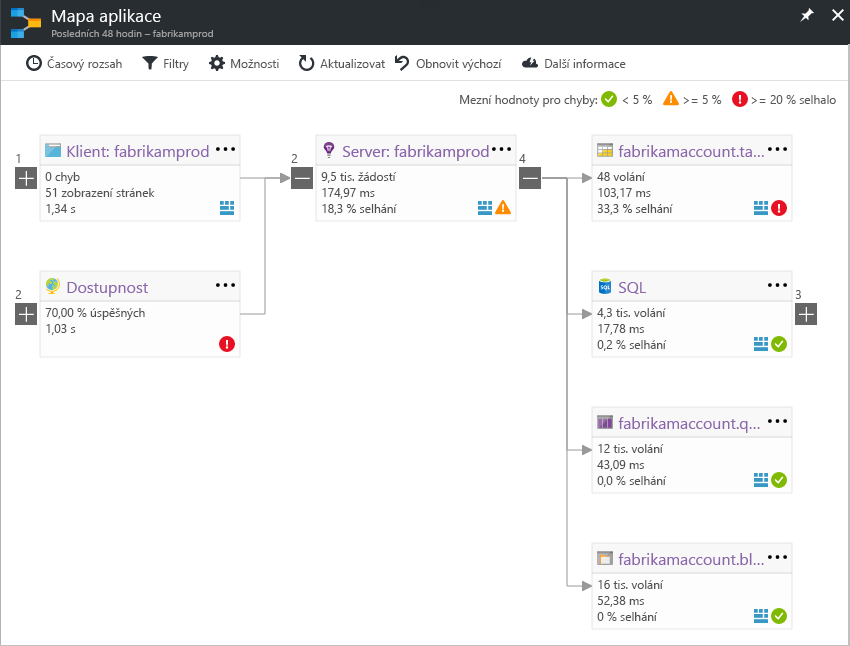

# Mapa aplikace ve službě Application InsightsApplication Map in Application Insights
V [Azure Application Insights](app-insights-overview.md), mapa aplikace je visual rozložení vztahů závislosti hello komponent vaší aplikace.In [Azure Application Insights](app-insights-overview.md), Application Map is a visual layout of hello dependency relationships of your application components. Jednotlivé komponenty zobrazuje klíčových ukazatelů výkonu například zatížení, výkonu, chyb a upozornění, toohelp že zjistit všechny součásti, která způsobila problém výkonu nebo selhání.Each component shows KPIs such as load, performance, failures, and alerts, toohelp you discover any component causing a performance issue or failure. Můžete kliknout na prostřednictvím z jakékoli součásti toomore podrobné diagnostiky, jako je například události Application Insights.You can click through from any component toomore detailed diagnostics, such as Application Insights events. Pokud vaše aplikace používá služby Azure, můžete také kliknout na prostřednictvím diagnostics tooAzure, jako je například doporučení Poradce pro databáze SQL.If your app uses Azure services, you can also click through tooAzure diagnostics, such as SQL Database Advisor recommendations.

Jako další grafy budete moct připnout aplikaci mapy toohello řídicí panel Azure, kde je plně funkční.Like other charts, you can pin an application map toohello Azure dashboard, where it is fully functional. 

## Otevřete hello aplikace mapyOpen hello application map
Otevřete hello mapy v okně Přehled hello pro vaši aplikaci:Open hello map from hello overview blade for your application:

Hello mapa znázorňuje:hello map shows:

* Testy dostupnostiAvailability tests
* Součásti klientské strany (monitorovat pomocí hello JavaScript SDK)Client-side component (monitored with hello JavaScript SDK)
* Klientská součást produktuServer-side component
* Závislosti hello součásti klienta a serveruDependencies of hello client and server components

Můžete rozbalit nebo sbalit skupiny odkaz závislost:You can expand and collapse dependency link groups:

Pokud máte velký počet závislostí jednoho typu (SQL, HTTP atd.), se mohou objevit seskupené.If you have many dependencies of one type (SQL, HTTP etc.), they may appear grouped. 

## Identifikaci problémůSpot problems
Každý uzel má ukazatele relevantní výkonu, jako je například hello zatížení, výkonu a selhání sazby za tuto součást.Each node has relevant performance indicators, such as hello load, performance, and failure rates for that component. 

Ikony upozornění upozorňují na možné problémy.Warning icons highlight possible problems. Oranžové upozornění znamená, že tam jsou chyby v žádostech, zobrazení stránek nebo volání závislostí.An orange warning means there are failures in requests, page views or dependency calls. Red se rozumí míra selhání výše 5 %.Red means a failure rate above 5%. Pokud chcete tooadjust tyto prahové hodnoty, otevřete panel Možnosti.If you want tooadjust these thresholds, open Options.

Aktivní výstrahy také zobrazit nahoru:Active alerts also show up: 

Pokud používáte SQL Azure, je ikonu, která ukazuje, kdy jsou doporučení na tom, jak může zlepšit výkon.If you use SQL Azure, there's an icon that shows when there are recommendations on how you can improve performance. 

Klikněte na možnost žádné ikonu tooget další podrobnosti:Click any icon tooget more details:

## Diagnostické klikněte na tlačítko prostřednictvímDiagnostic click through
Každý z uzlů hello na mapě hello nabízí cílové kliknutím prostřednictvím pro diagnostiku.Each of hello nodes on hello map offers targeted click through for diagnostics. Hello možnosti se liší v závislosti na typu hello hello uzlu.hello options vary depending on hello type of hello node.

Pro součásti, které jsou hostované v Azure hello možnosti zahrnují toothem přímé odkazy.For components that are hosted in Azure, hello options include direct links toothem.

## Filtry a časový rozsahFilters and time range
Ve výchozím nastavení shrnuje hello mapy všechna data hello k dispozici pro zvolené období hello.By default, hello map summarizes all hello data available for hello chosen time range. Ale můžete filtrovat, názvy pouze konkrétní operaci tooinclude nebo závislosti.But you can filter it tooinclude only specific operation names or dependencies.

* Název operace: Jedná se o zobrazení stránky a typy požadavků na straně serveru.Operation name: This includes both page views and server-side request types. Pomocí této možnosti hello mapa zobrazuje hello klíčového ukazatele výkonu na uzlu serveru nebo klientské hello pouze operacím hello vybrané.With this option, hello map shows hello KPI on hello server/client-side node for hello selected operations only. Zobrazuje hello závislosti volat v kontextu hello těchto konkrétních operací.It shows hello dependencies called in hello context of those specific operations.
* Název základní závislosti: Jedná se o hello AJAX prohlížeče závislosti a závislosti na straně serveru.Dependency base name: This includes hello AJAX browser dependencies and server-side dependencies. Pokud sestavu vlastní závislosti telemetrie s hello TrackDependency API zároveň jsou zde.If you report custom dependency telemetry with hello TrackDependency API, they also appear here. Můžete vybrat hello tooshow závislosti na mapě hello.You can select hello dependencies tooshow on hello map. Tento výběr aktuálně nefiltruje požadavků na straně serveru hello nebo hello zobrazení stránky na straně klienta.Currently this selection does not filter hello server-side requests, or hello client-side page views.

## Uložit filtrySave filters
filtry hello toosave jste použili, kódu pin hello filtrované zobrazení na [řídicí panel](app-insights-dashboards.md).toosave hello filters you have applied, pin hello filtered view onto a [dashboard](app-insights-dashboards.md).

## Podokno chybyError pane
Při kliknutí na uzel v mapě hello, podokně aplikace chyba se zobrazí na pravé straně hello shrnutí selhání pro tento uzel.When you click a node in hello map, an error pane is displayed on hello right-hand side summarizing failures for that node. Chyby jsou nejprve seskupené podle ID operace a potom seskupené podle ID problému.Failures are grouped first by operation ID and then grouped by problem ID.

Kliknutím na selhání přejdete toohello poslední instance tohoto selhání.Clicking on a failure takes you toohello most recent instance of that failure.

## Stav prostředkůResource health
Pro některé typy prostředků v hello horní části podokna hello chyba se zobrazí stav prostředku.For some resource types, resource health is displayed at hello top of hello error pane. Například kliknutím na uzel SQL se zobrazí stav databáze hello a všechny výstrahy, které mají aktivováno.For example, clicking a SQL node will show hello database health and any alerts that have fired.

Můžete kliknout na hello prostředků název tooview standardní přehled metriky pro tento prostředek.You can click hello resource name tooview standard overview metrics for that resource.

## Systém začátku do konce aplikace mapyEnd-to-end system app maps

*Vyžaduje SDK verze 2.3 nebo vyšší**Requires SDK version 2.3 or higher*

Pokud aplikace obsahuje několik komponenty, například k back endové službě kromě toohello webové aplikace - pak můžete zobrazit je všechny na mapě jednu integrované aplikaci.If your application has several components - for example, a back-end service in addition toohello web app - then you can show them all on one integrated app map.

Mapa aplikace Hello vyhledá uzly serveru pomocí následujících závislostí HTTP volání mezi servery s hello nainstalované Application Insights SDK.hello app map finds server nodes by following any HTTP dependency calls made between servers with hello Application Insights SDK installed. Každý prostředek Application Insights se předpokládá toocontain jeden server.Each Application Insights resource is assumed toocontain one server.

### Aplikace služby role mapy (preview)Multi-role app map (preview)

Hello preview aplikace s více role mapy funkce umožňuje mapy aplikace hello toouse s více servery odesílání dat toohello stejný prostředek Application Insights nebo klíč instrumentace.hello preview multi-role app map feature allows you toouse hello app map with multiple servers sending data toohello same Application Insights resource  / instrumentation key. Servery v mapě hello jsou oddělených hello cloud_RoleName vlastnost telemetrie položky.Servers in hello map are segmented by hello cloud_RoleName property on telemetry items. Nastavit *mapování aplikace s více rolí* příliš*na* z hello verze Preview okno tooenable tuto konfiguraci.Set *Multi-role Application Map* too*On* from hello Previews blade tooenable this configuration.

Tento přístup může požadovaných, v aplikaci micro-services, nebo v jiných scénářích, kde se mají události toocorrelate na více serverech v rámci jednoho prostředku Application Insights.This approach may be desired in a micro-services application, or in other scenarios where you want toocorrelate events across multiple servers within a single Application Insights resource.

## VideoVideo

> [!VIDEO https://channel9.msdn.com/events/Connect/2016/112/player] 

## Váš názorFeedback
Zadejte prosím zpětnou vazbu prostřednictvím možnosti hello portálu zpětné vazby.Please provide feedback through hello portal feedback option.

## Další krokyNext steps

* [Azure PortalAzure portal](https://portal.azure.com)
