# Přehled Application Insights pro DevOpsOverview of Application Insights for DevOps

S [Application Insights](app-insights-overview.md), můžete rychle zjistit, jaký je výkon aplikace a právě používá, když je za provozu.With [Application Insights](app-insights-overview.md), you can quickly find out how your app is performing and being used when it's live. Pokud dojde k potížím, umožňuje vědět o jeho, pomůže posoudit dopad hello a pomáhají zjistit příčinu hello.If there's a problem, it lets you know about it, helps you assess hello impact, and helps you determine hello cause.

Zde je účet od týmu, který sama vyvinula webových aplikací:Here's an account from a team that develops web applications:

* *"Během několika dní před jsme nasadili, vedlejší, opravy hotfix. Jsme nespustily průchodu testu široký, ale bohužel získali některé nečekaným změnám sloučeny do datové části hello způsobuje nekompatibilitu mezi hello front-end a back-EndY. Hned aktivováno naše výstrahy výjimek serveru surged a jsme byly provedeny vědět hello situaci. Pár kliknutí rychle na portálu služby Application Insights hello My dostatek informací z výjimka callstacks toonarrow dolů hello problém. Jsme vrácena okamžitě a omezené hello škody. Application Insights udělal tuto část hello devops cyklus velmi snadno a níž lze provést akci."**"A couple of days ago, we deployed a 'minor' hotfix. We didn't run a broad test pass, but unfortunately some unexpected change got merged into hello payload, causing incompatibility between hello front and back ends. Immediately, server exceptions surged, our alert fired, and we were made aware of hello situation. A few clicks away on hello Application Insights portal, we got enough information from exception callstacks toonarrow down hello problem. We rolled back immediately and limited hello damage. Application Insights has made this part of hello devops cycle very easy and actionable."*

V tomto článku jsme postupujte podle týmu v bance společnosti Fabrikam, která sama vyvinula hello online bankovnictví toosee systému (OBS), jak použít Application Insights tooquickly odpovídají toocustomers a provádět aktualizace.In this article we follow a team in Fabrikam Bank that develops hello online banking system (OBS) toosee how they use Application Insights tooquickly respond toocustomers and make updates.  

Hello týmu funguje v cyklu DevOps znázorňuje následující obrázek hello:hello team works on a DevOps cycle depicted in hello following illustration:

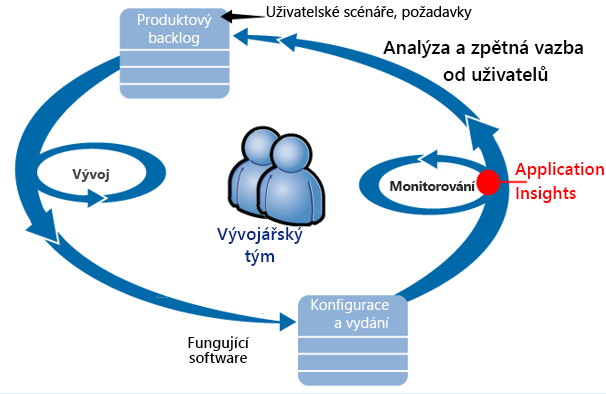

Požadavky na informačního kanálu do jejich vývoj nevyřízených položek (seznam úkolů).Requirements feed into their development backlog (task list). Tyto funkce fungují v krátkém sprintů, které často poskytovat software pracovní – obvykle ve formuláři hello vylepšení a rozšíření toohello existující aplikace.They work in short sprints, which often deliver working software - usually in hello form of improvements and extensions toohello existing application. pomocí nové funkce je často aktualizována aplikace Hello za provozu.hello live app is frequently updated with new features. I když je za provozu, hello team se monitoruje výkonu a využití hello pomoci Application Insights.While it's live, hello team monitors it for performance and usage with hello help of Application Insights. Tato data APM kanály zpátky na jejich vývoj nevyřízených položek.This APM data feeds back into their development backlog.

Hello používá Application Insights toomonitor hello živou webovou aplikaci úzce pro:hello team uses Application Insights toomonitor hello live web application closely for:

* Výkon.Performance. Chtějí toounderstand jak odezvy lišit počtu žádostí o; kolik procesoru, sítě, disk a další prostředky jsou používány; a kde jsou hello kritická místa.They want toounderstand how response times vary with request count; how much CPU, network, disk, and other resources are being used; and where hello bottlenecks are.
* Selhání.Failures. Pokud jsou výjimky nebo neúspěšné požadavky, nebo pokud se čítač výkonu ocitne mimo rozsah jeho možnost, hello team potřebám tooknow rychle, aby přijaly akce.If there are exceptions or failed requests, or if a performance counter goes outside its comfortable range, hello team needs tooknow rapidly so that they can take action.
* Využití.Usage. Při každém vydání nové funkce, hello team má rozsah toowhat tooknow, používá se a toho, jestli uživatelé mají všechny problémy s ním.Whenever a new feature is released, hello team want tooknow toowhat extent it is used, and whether users have any difficulties with it.

Umožňuje zaměřit se na část zpětnou vazbu hello hello cyklus:Let's focus on hello feedback part of hello cycle:

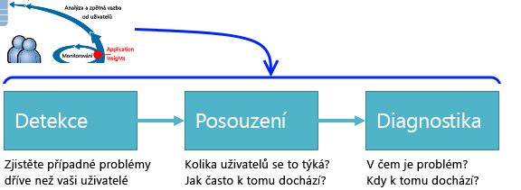

## Zjištění nízký dostupnostiDetect poor availability
Marcela Markova je vývojář senior hello OBS týmu a trvá hello realizace na sledování výkonu online.Marcela Markova is a senior developer on hello OBS team, and takes hello lead on monitoring online performance. Jana nastaví několik [testy dostupnosti](app-insights-monitor-web-app-availability.md):She sets up several [availability tests](app-insights-monitor-web-app-availability.md):

* Testu jedné adresy URL pro hello hlavní cílová stránka aplikace hello http://fabrikambank.com/onlinebanking/.A single-URL test for hello main landing page for hello app, http://fabrikambank.com/onlinebanking/. Jana nastaví kritéria kód HTTP 200 a text "Vítejte!".She sets criteria of HTTP code 200 and text 'Welcome!'. Pokud tento test ale selže, je něco vážně špatného hello síť hello servery nebo může být problém s nasazení.If this test fails, there's something seriously wrong with hello network or hello servers, or maybe a deployment issue. (Nebo uživatel změnil hello Vítejte!(Or someone has changed hello Welcome! zpráva na stránce hello bez možnosti čtení jeho Přehled.)message on hello page without letting her know.)
* Hlubší vícekrokového testu, který se přihlásí a získá aktuálního účtu výpis, kontrola pár klíčů podrobnosti na každé stránce.A deeper multi-step test, which logs in and gets a current account listing, checking a few key details on each page. Tento test ověřuje, že účty databázi hello odkaz toohello pracuje.This test verifies that hello link toohello accounts database is working. Použije Jana id fiktivní zákazníka: několik z nich jsou zachována pro účely testování.She uses a fictitious customer id: a few of them are maintained for test purposes.

Tyto testy nastavit je Marcela jisti, že tento tým hello rychle věděli o všech výpadku.With these tests set up, Marcela is confident that hello team will quickly know about any outage.  

Selhání zobrazují jako červené tečky v hello webového testu grafu:Failures show up as red dots on hello web test chart:

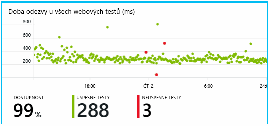

Ale ještě důležitější, výstrahu o jakákoli chyba e-mailu toohello vývojový tým.But more importantly, an alert about any failure is emailed toohello development team. Tento způsob se znát o něm téměř všechny hello zákazníků.In that way, they know about it before nearly all hello customers.

## Monitorování výkonuMonitor Performance
Na stránce Přehled hello ve službě Application Insights, je graf, který obsahuje celou řadu [klíčové metriky](app-insights-web-monitor-performance.md).On hello overview page in Application Insights, there's a chart that shows a variety of [key metrics](app-insights-web-monitor-performance.md).

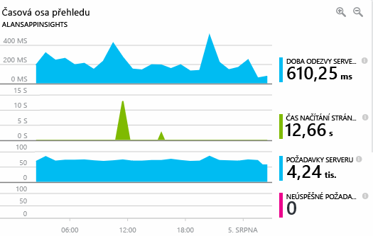

Čas načítání stránky prohlížeče je odvozená od telemetrické zprávy odesílané přímo z webové stránky.Browser page load time is derived from telemetry sent directly from web pages. Doba odezvy serveru, počtu žádostí o serveru a počet neúspěšných požadavků jsou všechny měřená v hello webový server a odeslat tooApplication statistiky z ní.Server response time, server request count, and failed request count are all measured in hello web server and sent tooApplication Insights from there.

Marcela je mírně nevadí hello graf odpovědi serveru.Marcela is slightly concerned with hello server response graph. Tento graf znázorňuje průměrný čas hello mezi když hello server obdrží požadavek HTTP z prohlížeče uživatele a když se vrátí odpověď hello.This graph shows hello average time between when hello server receives an HTTP request from a user's browser, and when it returns hello response. Není neobvyklou toosee varianta v tomto grafu, protože se zatížení systému hello liší.It isn't unusual toosee a variation in this chart, as load on hello system varies. Ale v takovém případě vypadá to, že toobe korelace mezi malé přírůstky. hello počet požadavků a big roste hello doby odezvy.But in this case, there seems toobe a correlation between small rises in hello count of requests, and big rises in hello response time. Který by to znamenat, že hello systému pracuje pouze při jeho omezení.That could indicate that hello system is operating just at its limits.

Jana otevře hello servery grafy:She opens hello Servers charts:

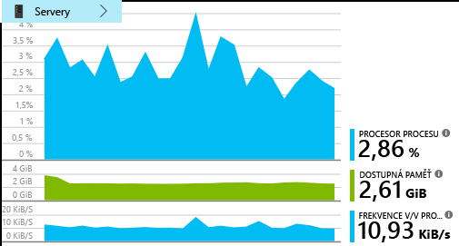

Vypadá to, toobe žádné přihlašovací omezení prostředků existuje, takže možná hello hrboly v grafech odpovědi serveru hello právě shoda.There seems toobe no sign of resource limitation there, so maybe hello bumps in hello server response charts are just a coincidence.

## Nastavit výstrahy toomeet cíleSet alerts toomeet goals
Uživatel nicméně přeje, aby tookeep přehled na dobu odezvy hello.Nevertheless, she'd like tookeep an eye on hello response times. Pokud přejde příliš vysoké, tooknow o něm Jana chce okamžitě.If they go too high, she wants tooknow about it immediately.

Aby Jana nastaví [výstraha](app-insights-metrics-explorer.md), pro větší než typické prahová hodnota doby odezvy.So she sets an [alert](app-insights-metrics-explorer.md), for response times greater than a typical threshold. Díky tomu svůj spolehlivosti, které Jana budete vědět o něm, pokud jsou pomalé odezvy.This gives her confidence that she'll know about it if response times are slow.

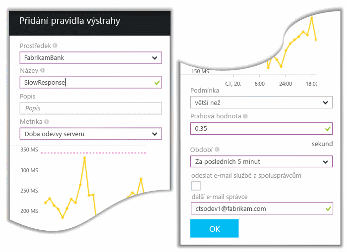

Výstrahy můžete nastavit na širokou škálu jiné metriky.Alerts can be set on a wide variety of other metrics. Například může přijímat e-mailů, pokud počet výjimka hello se změní na vysokou nebo přejde nízkou hello dostupné paměti, nebo pokud je v klientských požadavků ve špičce.For example, you can receive emails if hello exception count becomes high, or hello available memory goes low, or if there is a peak in client requests.

## Udržení informovanosti s výstrahami Inteligentní detekceStay informed with Smart Detection Alerts
Další den výstrahy e-mailu přicházejí z Application Insights.Next day, an alert email does arrive from Application Insights. Ale když uživatel otevře, Jana zjistí, že není hello odpovědi čas výstraha, která uživatel nastavit.But when she opens it, she finds it isn't hello response time alert that she set. Místo toho se sdělením, že došlo nečekané zvýšení neúspěšných požadavků – to znamená, požadavků, které vráceno selhání kódy 500 nebo víc.Instead, it tells her there's been a sudden rise in failed requests - that is, requests that have returned failure codes of 500 or more.

Neúspěšné požadavky jsou, odkud mají uživatelé vidět chybu – obvykle následující výjimka vyvolána v kódu hello.Failed requests are where users have seen an error - typically following an exception thrown in hello code. Možná zobrazí zpráva s oznámením "Bohužel jsme nelze nyní aktualizovat podrobností o."Maybe they see a message saying "Sorry we couldn't update your details right now." Nebo na absolutní to nepříjemné nejhorší, výpisu zásobníku se zobrazí na obrazovce hello uživatele s laskavým svolením hello webový server.Or, at absolute embarrassing worst, a stack dump appears on hello user's screen, courtesy of hello web server.

Tato výstraha je neočekávaném, protože hello čas posledního Jana zvážení, hello chybných požadavků, že byl encouragingly nízkou počet.This alert is a surprise, because hello last time she looked at it, hello failed request count was encouragingly low. Malý počet selhání je toobe v zaneprázdněný server očekává.A small number of failures is toobe expected in a busy server.

Bylo rovněž kousek neočekávaném pro ní protože Jana neměly tooconfigure této výstrahy.It was also a bit of a surprise for her because she didn't have tooconfigure this alert. Application Insights zahrnují inteligentní zjišťování.Application Insights include Smart Detection. Automaticky upraví obvyklé selhání vzor tooyour aplikace a selhání "získá se používá pro" na konkrétní stránky, nebo pod vysokého zatížení nebo propojené tooother metriky.It automatically adjusts tooyour app's usual failure pattern, and "gets used to" failures on a particular page, or under high load, or linked tooother metrics. Vyvolá výstrahy hello pouze v případě, že je zvýšení výše co IT oddělení dodává tooexpect.It raises hello alarm only if there's a rise above what it comes tooexpect.

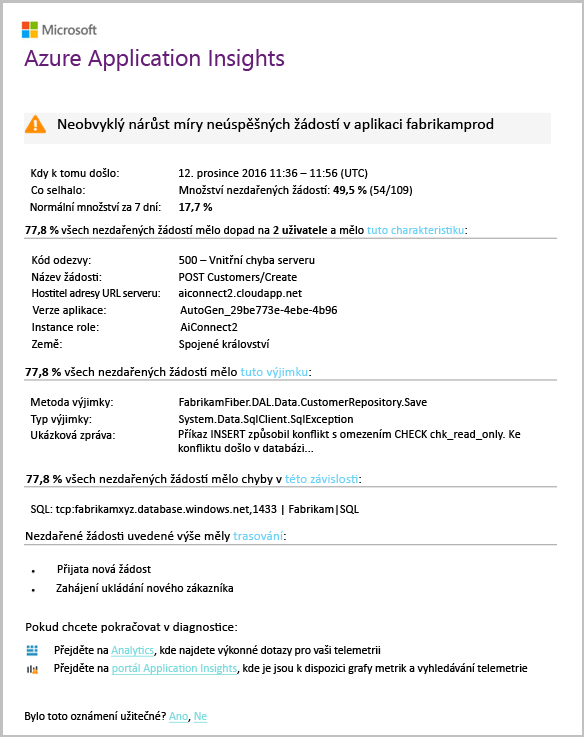

To je velmi užitečná e-mailu.This is a very useful email. Právě se nepodporuje vyvolat alarm.It doesn't just raise an alarm. Příliš mnoho hello třídění a diagnostiky pracovní dělá.It does a lot of hello triage and diagnostic work, too.

Zobrazuje jak mnoho zákazníků pocítí důsledky a které webové stránky nebo operace.It shows how many customers are affected, and which web pages or operations. Marcela můžete rozhodnout, jestli Jana potřebuje tooget hello celý tým práce na tomto jako protipožární cvičení, nebo jestli se můžete ignorovat až do příštího týdne.Marcela can decide whether she needs tooget hello whole team working on this as a fire drill, or whether it can be ignored until next week.

e-mailu Hello také ukazuje konkrétní výjimce došlo, a - i více zajímavé - tohoto selhání hello je přidružen konkrétní databázi tooa volání se nezdařilo.hello email also shows that a particular exception occurred, and - even more interesting - that hello failure is associated with failed calls tooa particular database. Tato část popisuje, proč hello selhání najednou zobrazovaly i v případě, že všechny aktualizace nebyla nasazena nedávno Marcela na týmu.This explains why hello fault suddenly appeared even though Marcela's team has not deployed any updates recently.

Marcella příkazy ping hello vedoucí týmu hello databáze založené na tento e-mail.Marcella pings hello leader of hello database team based on this email. Jana zjišťuje, zda se vydaná oprava v hello posledních půl hodiny; a bohužel se možná pravděpodobně změnu menší schématu...She learns that they released a hot fix in hello past half hour; and Oops, maybe there might have been a minor schema change....

Proto je hello problém na toobeing způsob hello odstraněna, i před příčin protokoly a do 15 minut od jeho použití.So hello problem is on hello way toobeing fixed, even before investigating logs, and within 15 minutes of it arising. Ale Marcela klikne na odkaz tooopen hello Application Insights.However, Marcela clicks hello link tooopen Application Insights. Otevře se přímo na chybné žádosti a tak může vidět databázi se nezdařilo volání v hello přidružené seznam závislostí volání.It opens straight onto a failed request, and she can see the failed database call in hello associated list of dependency calls.

## Zjištění výjimekDetect exceptions
S chvilku instalačního programu [výjimky](app-insights-asp-net-exceptions.md) jsou hlášené tooApplication Insights automaticky.With a little bit of setup, [exceptions](app-insights-asp-net-exceptions.md) are reported tooApplication Insights automatically. Se také dají zachytit explicitně vložením volání příliš[TrackException()](app-insights-api-custom-events-metrics.md#trackexception) do hello kódu:They can also be captured explicitly by inserting calls too[TrackException()](app-insights-api-custom-events-metrics.md#trackexception) into hello code:  

    var telemetry = new TelemetryClient();
    ...
    try
    { ...
    }
    catch (Exception ex)
    {
       // Set up some properties:
       var properties = new Dictionary <string, string>
         {{"Game", currentGame.Name}};

       var measurements = new Dictionary <string, double>
         {{"Users", currentGame.Users.Count}};

       // Send hello exception telemetry:
       telemetry.TrackException(ex, properties, measurements);
    }

tým Fabrikam Bank Hello vyvinul hello postup vždy odesílat telemetrii na výjimku, pokud je zřejmé obnovení.hello Fabrikam Bank team has evolved hello practice of always sending telemetry on an exception, unless there's an obvious recovery.  

Ve skutečnosti je i širší než jejich strategie: odesílání telemetrických dat ve všech případech, kde je frustrovaní v co zákazník hello se chtěli toodo, jestli odpovídá tooan výjimka v hello kódu, nebo ne.In fact, their strategy is even broader than that: They send telemetry in every case where hello customer is frustrated in what they wanted toodo, whether it corresponds tooan exception in hello code or not. Například pokud hello externí přenos mezi bank systém vrátí zprávu "nelze dokončit tuto transakci" nějakého důvodu provozní (nezávisle na hello zákazníka) pak budou sledovat tuto událost.For example, if hello external inter-bank transfer system returns a "can't complete this transaction" message for some operational reason (no fault of hello customer) then they track that event.

    var successCode = AttemptTransfer(transferAmount, ...);
    if (successCode < 0)
    {
       var properties = new Dictionary <string, string>
            {{ "Code", returnCode, ... }};
       var measurements = new Dictionary <string, double>
         {{"Value", transferAmount}};
       telemetry.TrackEvent("transfer failed", properties, measurements);
    }

TrackException je použité tooreport výjimky, protože odešle kopii hello zásobníku.TrackException is used tooreport exceptions because it sends a copy of hello stack. TrackEvent je použité tooreport další události.TrackEvent is used tooreport other events. Všechny vlastnosti, které mohou být užitečné při diagnostiku můžete připojit.You can attach any properties that might be useful in diagnosis.

Výjimky a události zobrazí v hello [diagnostické vyhledávání](app-insights-diagnostic-search.md) okno.Exceptions and events show up in hello [Diagnostic Search](app-insights-diagnostic-search.md) blade. Můžete přejít k podrobnostem je toosee hello další vlastnosti a trasováním zásobníku.You can drill into them toosee hello additional properties and stack trace.

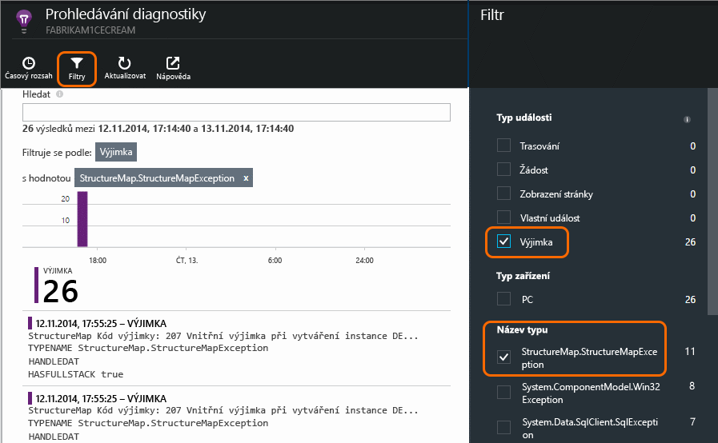

## Proaktivní monitorováníMonitor proactively
Marcela není právě nacházejí kolem čekání výstrahy.Marcela doesn't just sit around waiting for alerts. Krátce po každé nové nasazení, která se podíváme na [odezvy](app-insights-web-monitor-performance.md) – obě hello celkový obrázek a počty hello tabulky nejpomalejší žádosti, stejně jako výjimka.Soon after every redeployment, she takes a look at [response times](app-insights-web-monitor-performance.md) - both hello overall figure and hello table of slowest requests, as well as exception counts.  

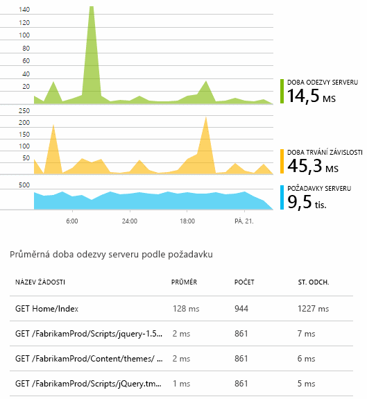

Jana můžete vyhodnotit vliv na výkon hello každé nasazení obvykle poslední porovnávání každý týden s hello.She can assess hello performance effect of every deployment, typically comparing each week with hello last. Pokud je nečekané zhoršování, se vyvolá, s vývojáři relevantní hello.If there's a sudden worsening, she raises that with hello relevant developers.

## Problémy tříděníTriage issues
Třídění - hodnocení závažnosti hello a rozsah problém - je prvním krokem hello po zjišťování.Triage - assessing hello severity and extent of a problem - is hello first step after detection. Měli jsme vyvolávající hello team půlnoci?Should we call out hello team at midnight? Nebo může být až další pohodlný mezera hello hello nevyřízené ponecháno?Or can it be left until hello next convenient gap in hello backlog? Existují některé klíčové otázky v třídění.There are some key questions in triage.

Jak často se se děje? grafy Hello v okně Přehled hello zadejte nějaký problém tooa perspektivy.How often is it happening? hello charts on hello Overview blade give some perspective tooa problem. Například hello Fabrikam aplikace generuje čtyři webového testu výstrahy jednu noc.For example, hello Fabrikam application generated four web test alerts one night. Prohlížení hello grafu v hello ráno, hello team by mohli zobrazit, aby byly skutečně některé červené tečky, i když stále většinu hello testů byly zelená.Looking at hello chart in hello morning, hello team could see that there were indeed some red dots, though still most of hello tests were green. Podrobnostem hello dostupnosti grafu, bylo naprosto jasné, že všechny tyto přerušované problémy byly z umístění jeden test.Drilling into hello availability chart, it was clear that all of these intermittent problems were from one test location. To se samozřejmě potíže se sítí, které mají vliv jenom jeden postup a sám s největší pravděpodobností zrušte.This was obviously a network issue affecting only one route, and would most likely clear itself.  

Naopak stabilní a výrazné zvýšení v grafu hello počty výjimky nebo odezvy je samozřejmě něco toopanic o.By contrast, a dramatic and stable rise in hello graph of exception counts or response times is obviously something toopanic about.

Užitečné třídění cílem je, zkuste ho sami.A useful triage tactic is Try It Yourself. Pokud spustíte do hello stejný problém, víte, jsou skutečná.If you run into hello same problem, you know it's real.

Jaké podíl uživatelů ovlivněných? tooobtain hrubý odpovědí, vydělte míra selhání hello počet relací hello.What fraction of users are affected? tooobtain a rough answer, divide hello failure rate by hello session count.

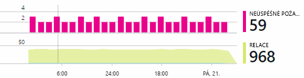

Po pomalé odezvy se porovnejte hello tabulky nejpomalejší neodpovídá požadavků s četností hello využití každé stránky.When there are slow responses, compare hello table of slowest-responding requests with hello usage frequency of each page.

Jak důležité je scénář hello blokované?How important is hello blocked scenario? Pokud je to funkčního problému blokování konkrétní uživatelský scénář, záleží mnohem?If this is a functional problem blocking a particular user story, does it matter much? Pokud zákazníci nelze platit svými účty, je to závažné; Pokud nemohou změnit svoje předvolby barvy obrazovky, možná ho můžete počkat.If customers can't pay their bills, this is serious; if they can't change their screen color preferences, maybe it can wait. Dobrý den podrobnosti události hello nebo výjimky nebo hello identity hello pomalé stránky, zjistíte, kde mají zákazníci potíže s.hello detail of hello event or exception, or hello identity of hello slow page, tells you where customers are having trouble.

## Diagnostikovat problémyDiagnose issues
Diagnostika není hello poměrně stejné jako ladění.Diagnosis isn't quite hello same as debugging. Než začnete trasování prostřednictvím hello kódu, byste měli mít hrubý představu o tom, proč, kde a kdy dochází k hello problém.Before you start tracing through hello code, you should have a rough idea of why, where and when hello issue is occurring.

**Pokud k tomu dojít?**  hello Historický přehled poskytované hello události a metriky grafy umožňuje snadno toocorrelate důsledky s možné příčiny.**When does it happen?** hello historical view provided by hello event and metric charts makes it easy toocorrelate effects with possible causes. Pokud jsou v odpovědi čas nebo výjimky sazby přerušované vrcholů, podívejte se na počtu žádostí o hello: Pokud je nejlepší při hello stejný čas, pak to vypadá problém prostředků.If there are intermittent peaks in response time or exception rates, look at hello request count: if it peaks at hello same time, then it looks like a resource problem. Potřebujete tooassign další procesoru nebo paměti?Do you need tooassign more CPU or memory? Nebo je závislost, která nemůže spravovat hello zatížení?Or is it a dependency that can't manage hello load?

**Je nám?****Is it us?**  Pokud máte nečekané pokles výkonu konkrétní typ požadavku – například když hello zákazník požaduje stavu účtu - pak je možné, může to být externí subsystému spíše než webové aplikace.If you have a sudden drop in performance of a particular type of request - for example when hello customer wants an account statement - then there's a possibility it might be an external subsystem rather than your web application. V Průzkumníku metrik vyberte hello míra selhání závislostí a doby trvání závislosti sazby a porovnání jejich historií přes hello po několik hodin nebo dnů s hello problému, který jste rozpoznali.In Metrics Explorer, select hello Dependency Failure rate and Dependency Duration rates and compare their histories over hello past few hours or days with hello problem you detected. Pokud jsou existuje korelace změny, může být externí subsystému tooblame.If there are correlating changes, then an external subsystem might be tooblame.  

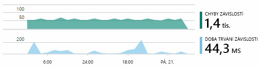

Některé pomalé závislosti jsou problémy, které informace o zeměpisné poloze.Some slow dependency issues are geolocation problems. Společnost Fabrikam Bank používá virtuální počítače Azure a zjistit, že jejich měl nechtěně umístění jejich webový server a server poskytující účty v různých zemí.Fabrikam Bank uses Azure virtual machines, and discovered that they had inadvertently located their web server and account server in different countries. Představují výrazné zlepšení byl způsobené migrace jeden z nich.A dramatic improvement was brought about by migrating one of them.

**Co jsme?****What did we do?** Pokud se problém hello nezobrazí toobe v závislost a nebyl vždy existuje, je pravděpodobně způsobena změnou poslední.If hello issue doesn't appear toobe in a dependency, and if it wasn't always there, it's probably caused by a recent change. Hello Historický přehled poskytované hello metriky a události grafy umožňuje snadno toocorrelate změny nečekané s nasazením.hello historical perspective provided by hello metric and event charts makes it easy toocorrelate any sudden changes with deployments. Který zužuje hello hledat hello problém.That narrows down hello search for hello problem.

**Co se děje?****What's going on?** Některé problémy dojít pouze zřídka a může být obtížné tootrack dolů testování do offline režimu.Some problems occur only rarely and can be difficult tootrack down by testing offline. Jediné, co můžeme udělat je tootry toocapture hello chyb případě za provozu.All we can do is tootry toocapture hello bug when it occurs live. Si můžete prohlédnout hello výpisy zásobníku v sestavách výjimka.You can inspect hello stack dumps in exception reports. Kromě toho můžete zapsat trasování volání, buď vašeho oblíbeného rozhraní protokolování, nebo TrackTrace() nebo TrackEvent().In addition, you can write tracing calls, either with your favorite logging framework or with TrackTrace() or TrackEvent().  

Společnost Fabrikam měl občasný problém s přenosy mezi společnostmi, ale pouze s určitými typy účtu.Fabrikam had an intermittent problem with inter-account transfers, but only with certain account types. toounderstand lepší co se děje, budou vloženy TrackTrace() volání na klíčové body v kódu hello připojení typ účtu hello jako vlastnost tooeach volání.toounderstand better what was happening, they inserted TrackTrace() calls at key points in hello code, attaching hello account type as a property tooeach call. Které provádí ho snadno toofilter se pouze tyto trasování v diagnostické vyhledávání.That made it easy toofilter out just those traces in Diagnostic Search. Jako vlastnosti a míry toohello trasování volání se také připojit hodnoty parametrů.They also attached parameter values as properties and measures toohello trace calls.

## Odpověď toodiscovered problémyRespond toodiscovered issues
Jakmile jste diagnostice hello problém, můžete použít plán toofix ho.Once you've diagnosed hello issue, you can make a plan toofix it. Možná budete potřebovat tooroll zpět ke změnám, nebo může být můžete právě pokračujte a opravte ho.Maybe you need tooroll back a recent change, or maybe you can just go ahead and fix it. Po dokončení opravy hello Application Insights poznáte, jestli byla úspěšná.Once hello fix is done, Application Insights tells you whether you succeeded.  

Společnost Fabrikam Bank vývojový tým trvat více strukturovanými měření tooperformance přístup, než používají toobefore používají Application Insights.Fabrikam Bank's development team take a more structured approach tooperformance measurement than they used toobefore they used Application Insights.

* Na stránce Přehled služby Application Insights hello nastavují výkonnostní cíle z hlediska konkrétní míry.They set performance targets in terms of specific measures in hello Application Insights overview page.
* Jejich návrh měření výkonu do aplikace hello od začátku hello, jako je například hello metriky, které měření postupu uživatele prostřednictvím nálevky.They design performance measures into hello application from hello start, such as hello metrics that measure user progress through 'funnels.'  

## Monitorování aktivity uživatelůMonitor user activity
Když je trvale dobré doba odezvy a existuje několik výjimek, tým vývojářů hello můžete přesunout na toousability.When response time is consistently good and there are few exceptions, hello dev team can move on toousability. Můžete myslíte o tom, jak tooimprove hello zkušeností uživatelů a jak tooencourage další uživatelé tooachieve hello požadovaných cílů.They can think about how tooimprove hello users' experience, and how tooencourage more users tooachieve hello desired goals.

Application Insights může být také použít toolearn uživatelů při práci s aplikací.Application Insights can also be used toolearn what users do with an app. Jakmile je plynulý chod, hello team přeje tooknow funkce, které jsou hello nejoblíbenější, co uživatelé jako nebo mít potíže s a jak často se vrátí.Once it's running smoothly, hello team would like tooknow which features are hello most popular, what users like or have difficulty with, and how often they come back. Které budou pomoci určit priority nadcházející práci.That will help them prioritize their upcoming work. A jejich můžete naplánovat úspěšné hello toomeasure každé funkce jako součást cyklu vývoje hello.And they can plan toomeasure hello success of each feature as part of hello development cycle. 

Například běžný uživatel cesty přes hello webu má zrušte "trychtýřového grafu."For example, a typical user journey through hello web site has a clear "funnel." Podívejte se na hello míry různé typy úvěr mnoho zákazníků.Many customers look at hello rates of different types of loan. Zmenšete počet, přejděte na toofill v podobě hello uvozovek.A smaller number go on toofill in hello quotation form. Několik těch, kteří získat nabídky, pokračujte a vyjměte hello úvěr.Of those who get a quotation, a few go ahead and take out hello loan.

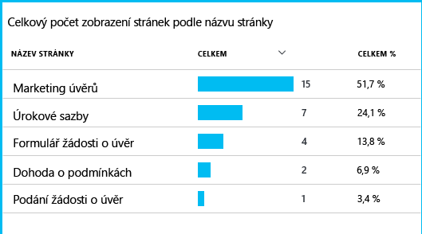

Vzhledem k tomu kde hello největší množství zákazníků vyřadit, hello firmy pracovat na tom, jak tooget více uživatelů prostřednictvím toohello dolní části hello trychtýřový.By considering where hello greatest numbers of customers drop out, hello business can work out how tooget more users through toohello bottom of hello funnel. V některých případech může být selhání uživatelské rozhraní (UX) – například tlačítka 'Další' hello je pevný toofind, nebo nejsou zřejmé hello pokyny.In some cases, there might be a user experience (UX) failure - for example, hello 'next' button is hard toofind, or hello instructions aren't obvious. Existuje více pravděpodobně větších obchodní důvody pro rozevírací li: možná jsou příliš vysoké míry úvěr hello.More likely, there are more significant business reasons for drop-outs: maybe hello loan rates are too high.

Libovolnou z důvodů hello hello data pomáhají hello team vycházejí co uživatelé dělají.Whatever hello reasons, hello data helps hello team work out what users are doing. Další sledování, který může být volání vložit toowork se podrobněji.More tracking calls can be inserted toowork out more detail. TrackEvent() lze použít toocount žádné akce uživatele, z hello podrobností dobře jednotlivé tlačítko klikne, herních bonusů toosignificant například platícího vypnout úvěr.TrackEvent() can be used toocount any user actions, from hello fine detail of individual button clicks, toosignificant achievements such as paying off a loan.

tým Hello je získávání použité toohaving informace o činnosti uživatelů.hello team is getting used toohaving information about user activity. V současné době vždy, když se navrhnout novou funkci, pracují na tom, jak bude získání zpětné vazby o jeho používání.Nowadays, whenever they design a new feature, they work out how they will get feedback about its usage. Jejich návrh sledování volání do funkce hello od začátku hello.They design tracking calls into hello feature from hello start. V každém cyklu vývoje používají funkce hello tooimprove hello zpětné vazby.They use hello feedback tooimprove hello feature in each development cycle.

[Další informace o sledování využití](app-insights-usage-overview.md).[Read more about tracking usage](app-insights-usage-overview.md).

## Použít hello DevOps cykluApply hello DevOps cycle
Proto je jak jedno použití team Application Insights nejenom toofix jednotlivé problémy, ale tooimprove jejich životního cyklu.So that's how one team use Application Insights not just toofix individual issues, but tooimprove their development lifecycle. Snad že ho udělil některé nápady o tom, jak Application Insights vám může pomoct se správou výkonu aplikací v aplikaci.I hope it has given you some ideas about how Application Insights can help you with application performance management in your own applications.

## VideoVideo

> [!VIDEO https://channel9.msdn.com/events/Connect/2016/112/player]

## Další krokyNext steps
Můžete začít používat několika způsoby v závislosti na vlastnosti hello vaší aplikace.You can get started in several ways, depending on hello characteristics of your application. Vyberte, co vám nejvíc vyhovuje:Pick what suits you best:

* [Webové aplikace ASP.NETASP.NET web application](app-insights-asp-net.md)
* [Webové aplikace JavaJava web application](app-insights-java-get-started.md)
* [Webové aplikace Node.jsNode.js web application](app-insights-nodejs.md)
* Nasazené aplikace, které jsou hostované na [IIS](app-insights-monitor-web-app-availability.md), [J2EE](app-insights-java-live.md), nebo [Azure](app-insights-azure.md).Already deployed apps, hosted on [IIS](app-insights-monitor-web-app-availability.md), [J2EE](app-insights-java-live.md), or [Azure](app-insights-azure.md).
* [Webové stránky](app-insights-javascript.md) -jedné stránky aplikace nebo obyčejnou webová stránka – použít samostatně nebo v tooany přidání možností serveru hello.[Web pages](app-insights-javascript.md) - Single Page App or ordinary web page - use this on its own or in addition tooany of hello server options.
* [Testy dostupnosti](app-insights-monitor-web-app-availability.md) tootest hello aplikace z veřejného Internetu.[Availability tests](app-insights-monitor-web-app-availability.md) tootest your app from hello public internet.
