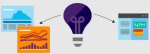

# Co je Application Insights?
Application Insights je rozšiřitelná služba pro správu výkonu aplikací (APM). Je určena webovým vývojářům na více platformách. Použít toomonitor za provozu webové aplikace. Automaticky zjišťuje anomálie ve výkonu. Zahrnuje výkonné analytics nástroje toohelp diagnostikovat problémy a toounderstand uživatelů ve skutečnosti při práci s vaší aplikací.  Je navržen toohelp neustále průběžně zlepšují výkon a použitelnost. Funguje pro aplikace na širokou škálu platforem včetně .NET, Node.js a J2EE, hostovaný místně nebo v cloudu hello. Se integruje s váš proces devOps a má připojovací body tooa řadu nástrojů pro vývoj.

[Prohlédněte si úvod animace hello](https://www.youtube.com/watch?v=fX2NtGrh-Y0).

## Jak Application Insights funguje?
Instalovat balíček malé instrumentace ve vaší aplikaci a nastavit prostředek Application Insights na portálu Microsoft Azure hello. instrumentace Hello monitoruje aplikace a odesílá telemetrická data toohello portálu. (hello aplikace můžou běžet kdekoli – nemá toobe hostované v Azure.)

Můžete instrumentace pouze hello aplikaci webové služby, ale také všechny komponenty pozadí a hello JavaScript ve webových stránkách hello sami. 

Kromě toho můžete vyžádat v telemetrie z prostředí hostitele hello například čítače výkonu, Azure diagnostics nebo Docker protokoly. Můžete také nastavit webové testy, které pravidelně odesílat žádosti o syntetické tooyour webové služby.

Všechny tyto datové proudy telemetrická data jsou integrované v hello portál Azure, kde můžete použít Výkonné a analýzu nezpracovaných dat toohello nástrojů pro vyhledávání.

### Co je režijní náklady na hello?
Hello dopad na výkon vaší aplikace jsou velmi malé. Sledovací volání neblokují, spojují se do dávek a odesílají v samostatném vlákně.

## Co Application Insights monitoruje?

Application Insights je zaměřen na hello vývojový tým toohelp pochopit, jaký je výkon aplikace a jak je používán. Monitoruje tyto parametry:

* **Frekvence požadavků, doby odezvy a míra selhání** – Zjistěte, které stránky jsou nejoblíbenější a v kterou denní dobu a kde jsou vaši uživatelé. Zjistíte, která stránka si vede nejlépe. Pokud se při zvýšení počtu požadavků zvýší i doba odezvy a míra selhání, máte pravděpodobně potíže s prostředky. 
* **Míra závislosti, doby odezvy a míra selhání** – Zjistěte, jestli vás nezpomalují externí služby.
* **Výjimky** – analyzovat statistiku hello agregován, nebo vyberte určité instance a přejít k podrobnostem hello trasování zásobníku a související požadavky. Hlásí se výjimky serveru i prohlížeče.
* **Zobrazení a načítání stránek** – Tyto informace hlásí prohlížeče uživatelů.
* **Volání AJAX** z webových stránek – frekvence, doby odezvy a míry selhání.
* **Počty uživatelů a relací**.
* **Čítače výkonu** ze serverových počítačů s Windows nebo Linuxem, jako je třeba CPU, paměť a využití sítě. 
* **Diagnostika hostitele** z Dockeru nebo Azure. 
* **Protokoly trasování diagnostiky** z vaší aplikace – umožňují zjistit korelaci mezi požadavky a událostmi trasování.
* **Vlastní události a metriky** , že napíšete sami v hello klienta nebo serveru kódu tootrack obchodní události, jako jsou položek prodaných nebo hry won.

## Kde se zobrazuje telemetrie?

Existuje hodně způsobů tooexplore vaše data. Podívejte se na tyto články:

|  |  |
| --- | --- |
| [**Inteligentní zjišťování a ruční výstrahy**](app-insights-proactive-diagnostics.md) Automatické výstrahy přizpůsobit tooyour aplikace normální vzorce telemetrie a aktivační událost, pokud má něco mimo obvykle vzor hello. Můžete také [nastavit výstrahy](app-insights-alerts.md) pro konkrétní úrovně vlastních nebo standardních metrik. | |
| [**Mapa aplikace**](app-insights-app-map.md) Hello součásti vaší aplikace, pomocí klíčové metriky a výstrahy. |  |
| [**Profiler**](app-insights-profiler.md) Zkontrolujte profily spuštění hello jen Vzorkovaná požadavků. | |
| [**Analýza využití**](app-insights-usage-overview.md) Analyzujte segmentaci a udržení uživatelů.| |
| [**Diagnostické vyhledávání dat instancí**](app-insights-diagnostic-search.md) Události vyhledávání a filtrování, jako jsou třeba požadavky, výjimky, volání závislosti, trasování protokolů a zobrazení stránek.  | |
| [**Průzkumník metrik pro agregovaná data**](app-insights-metrics-explorer.md) Prozkoumání, filtrování a segmentace agregovaných dat, jako jsou třeba frekvence požadavků, selhání a výjimek, doby odezvy a časy načtení stránek. | |
| [**Řídicí panely**](app-insights-dashboards.md#dashboards) Propojení dat z různých zdrojů a jejich sdílení s ostatními. Ideální pro více součásti aplikace a pro nepřetržitou zobrazení v týmové místnosti hello. | |
| [**Live Metrics Stream**](app-insights-live-stream.md) Při nasazování nového sestavení, podívejte se na tyto ukazatele výkonu téměř v reálném čase toomake se, že vše funguje podle očekávání. | |
| [**Analýzy**](app-insights-analytics.md) Tento výkonný dotazovací jazyk umožňuje odpovědět na složité dotazy týkající se využití a výkonu vaší aplikace. | |
| [**Visual Studio**](app-insights-visual-studio.md) Zobrazit data výkonu v kódu hello. Přechod toocode z trasování zásobníku.| |
| [**Ladicí program snímků**](app-insights-snapshot-debugger.md) Laďte vzorky snímků z operací za provozu s hodnotami parametrů.| |
| [**Power BI**](app-insights-export-power-bi.md) Integrujte metriky využití s ostatními funkcemi business intelligence.| |
| [**REST API**](https://dev.applicationinsights.io/) Napište kód toorun dotazy přes metriky a nezpracovaná data.|  |
| [**Průběžný export**](app-insights-export-telemetry.md) Export dat ve formátu raw toostorage hromadně, při doručení. | |

## Jak se Application Insights dá využít?

### Monitorování
Nainstalujte Application Insights ve vaší aplikaci, nastavte [webové testy dostupnosti](app-insights-monitor-web-app-availability.md) a:

* Nastavení [řídicí panel](app-insights-dashboards.md) místnosti váš tým tookeep na přehled o zatížení, rychlost reakce a hello výkon vaší závislosti stránce zatížení a volání AJAX.
* Zjistit, které jsou hello nejpomalejší a nejvíce požadavků selhání.
* Kukátko [živý datový proud](app-insights-live-stream.md) při nasazení nové verze, tooknow okamžitě o zjistíte nějaké snížení.

### Detekce a diagnostika
Když dostanete výstrahu nebo zjistíte problém:

* Posuďte, kolika uživatelů se top týká.
* Dejte selhání do souvislosti s výjimkami, voláními závislosti a trasováními.
* Prozkoumejte profiler, snímky, výpisy zásobníků a protokoly trasování.

### Vytváření, měření a učení
[Měření hello efektivita](app-insights-usage-overview.md) každé nové funkce, který nasadíte.

* Plánování toomeasure jak zákazníci používat nový UX nebo obchodní funkce.
* Napište do svého kódu vlastní telemetrii.
* Vývoj pro další základní hello cyklus na pevné důkaz z telemetrie.

## Začínáme
Application Insights je jedním z mnoha služby hostované v rámci Microsoft Azure a telemetrická data se odesílají existuje pro analýzu a prezentace hello. Proto před provedením cokoliv jiného, budete potřebovat předplatné příliš[Microsoft Azure](http://azure.com). Je bezplatná toosign a pokud se rozhodnete hello základní [ceny plán](https://azure.microsoft.com/pricing/details/application-insights/) z Application Insights je bezplatná dokud vaše aplikace se zvětšil toohave významné využití. Pokud už vaše organizace předplatné má, zvyšují vaše tooit účet Microsoft.

Existuje několik způsobů tooget spuštěna. Použijte ten, který vám nejvíce vyhovuje. Můžete přidat další hello později.

* **V době spuštění: instrumentaci vaší webové aplikace na serveru hello.** Zabraňuje kód toohello žádné aktualizace. Potřebujete server tooyour přístup správce.
  * [**IIS místně nebo ve virtuálním počítači**](app-insights-monitor-performance-live-website-now.md)
  * [**Virtuální počítač nebo webová aplikace Azure**](app-insights-monitor-performance-live-website-now.md)
  * [**J2EE**](app-insights-java-live.md)
* **V době vývoje: přidejte Application Insights tooyour kód.** Umožňuje toowrite vlastní telemetrie a tooinstrument back-end a desktopových aplikací.
  * [Visual Studio](app-insights-asp-net.md) 2013 s aktualizací Update 2 nebo novější.
  * Java v [Eclipse](app-insights-java-eclipse.md) nebo [jiné nástroje](app-insights-java-get-started.md)
  * [Node.js](app-insights-nodejs.md)
  * [Jiné platformy](app-insights-platforms.md)
* **[Instrumentace webových stránek](app-insights-javascript.md)** pro zobrazení stránek, AJAX a další telemetrii na straně klienta.
* **[Testy dostupnosti](app-insights-monitor-web-app-availability.md)** – Příkazem ping z našich serverů pravidelně testujte váš web.

## Další kroky
Začínáme při spuštění:

* [Server IIS](app-insights-monitor-performance-live-website-now.md)
* [Server J2EE](app-insights-java-live.md)

Začínáme při vývoji:

* [ASP.NET](app-insights-asp-net.md)
* [Java](app-insights-java-get-started.md)
* [Node.js](app-insights-nodejs.md)

## Podpora a zpětná vazba
* Otázky a problémy:
  * [Řešení potíží][qna]
  * [Fórum MSDN](https://social.msdn.microsoft.com/Forums/vstudio/home?forum=ApplicationInsights)
  * [StackOverflow](http://stackoverflow.com/questions/tagged/ms-application-insights)
* Vaše návrhy:
  * [UserVoice](https://visualstudio.uservoice.com/forums/357324)
* Blog:
  * [Blog Application Insights](https://azure.microsoft.com/blog/tag/application-insights)

## Videa

> [!VIDEO https://channel9.msdn.com/events/Connect/2016/100/player] 

<!--Link references-->

[android]: https://github.com/Microsoft/ApplicationInsights-Android
[azure]: ../insights-perf-analytics.md
[client]: app-insights-javascript.md
[desktop]: app-insights-windows-desktop.md
[detect]: app-insights-detect-triage-diagnose.md
[greenbrown]: app-insights-asp-net.md
[ios]: https://github.com/Microsoft/ApplicationInsights-iOS
[java]: app-insights-java-get-started.md
[knowUsers]: app-insights-web-track-usage.md
[platforms]: app-insights-platforms.md
[portal]: http://portal.azure.com/
[qna]: app-insights-troubleshoot-faq.md
[redfield]: app-insights-monitor-performance-live-website-now.md
