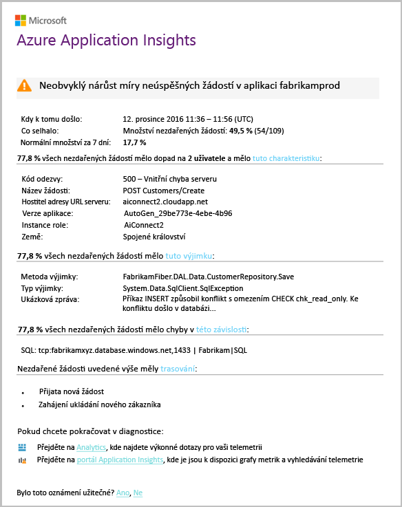

# Inteligentní detekce - anomálií selháníSmart Detection - Failure Anomalies
[Application Insights](app-insights-overview.md) automaticky vás upozorní skoro v reálném čase, pokud dojde neobvyklé zvýšení hello počet neúspěšných žádostí vaší webové aplikace.[Application Insights](app-insights-overview.md) automatically notifies you in near real time if your web app experiences an abnormal rise in hello rate of failed requests. Zjistí neobvyklého nárůstu hello počet požadavků HTTP nebo závislostí volání, které jsou hlášeny jako se nezdařilo.It detects an unusual rise in hello rate of HTTP requests or dependency calls that are reported as failed. Pro žádosti neúspěšné požadavky jsou obvykle s kódy odpovědí 400 nebo vyšší.For requests, failed requests are usually those with response codes of 400 or higher. toohelp rychlou kontrolu a diagnostikovat problém hello analýzu hello vlastnosti hello selhání a související telemetrii je součástí hello oznámení.toohelp you triage and diagnose hello problem, an analysis of hello characteristics of hello failures and related telemetry is provided in hello notification. Existují také odkazy toohello portál Application Insights pro další diagnostiku.There are also links toohello Application Insights portal for further diagnosis. Hello musí funkce žádné nastavení ani konfigurace, protože využívá strojové učení míra normální selhání hello toopredict algoritmy.hello feature needs no set-up nor configuration, as it uses machine learning algorithms toopredict hello normal failure rate.

Tato funkce funguje pro Java a ASP.NET webové aplikace hostované v cloudu hello nebo na serverech.This feature works for Java and ASP.NET web apps, hosted in hello cloud or on your own servers. Taky funguje pro každou aplikaci, která generuje telemetrická žádost nebo závislost – například pokud máte role pracovního procesu, který volá [TrackRequest()](app-insights-api-custom-events-metrics.md#trackrequest) nebo [TrackDependency()](app-insights-api-custom-events-metrics.md#trackdependency).It also works for any app that generates request or dependency telemetry - for example, if you have a worker role that calls [TrackRequest()](app-insights-api-custom-events-metrics.md#trackrequest) or [TrackDependency()](app-insights-api-custom-events-metrics.md#trackdependency).

Po nastavení [Application Insights pro svůj projekt](app-insights-overview.md), a pokud vaše aplikace generuje určité minimální množství telemetrie, inteligentní detekce anomálií selhání trvá 24 hodin toolearn hello normální chování vaší aplikace, než ho je zapnutá a může odesílat výstrahy.After setting up [Application Insights for your project](app-insights-overview.md), and provided your app generates a certain minimum amount of telemetry, Smart Detection of failure anomalies takes 24 hours toolearn hello normal behavior of your app, before it is switched on and can send alerts.

Zde je ukázka výstraha.Here's a sample alert.

> [!NOTE]
> Ve výchozím nastavení zobrazí kratší pošty formátu než v tomto příkladu.By default, you get a shorter format mail than this example. Ale můžete [přepínač toothis podrobném formátu](#configure-alerts).But you can [switch toothis detailed format](#configure-alerts).
>
>

Všimněte si, že se dozvíte:Notice that it tells you:

* míra selhání Hello porovná toonormal chování aplikace.hello failure rate compared toonormal app behavior.
* Počet uživatelů, kteří jsou vliv – abyste věděli, kolik tooworry.How many users are affected – so you know how much tooworry.
* Charakteristik vzor spojené s chybami hello.A characteristic pattern associated with hello failures. V tomto příkladu je kód konkrétní odpovědi, název požadavku (operace) a verzí v aplikaci.In this example, there’s a particular response code, request name (operation) and app version. Které okamžitě sděluje, kde toostart vyhledávání v kódu.That immediately tells you where toostart looking in your code. Další možnosti může být konkrétní operační systém prohlížeče nebo klienta.Other possibilities could be a specific browser or client operating system.
* Hello výjimce, trasování protokolu a selhání závislosti (databáze nebo dalších externích součástí), které zobrazí toobe přidružené hello rozdělení selhání.hello exception, log traces, and dependency failure (databases or other external components) that appear toobe associated with hello characterized failures.
* Propojí přímo toorelevant hledání na hello telemetrii ve službě Application Insights.Links directly toorelevant searches on hello telemetry in Application Insights.

## Výhody Inteligentní detekceBenefits of Smart Detection
Obyčejnou [metriky výstrahy](app-insights-alerts.md) zjistíte, může se jednat o problém.Ordinary [metric alerts](app-insights-alerts.md) tell you there might be a problem. Ale inteligentní zjišťování spustí hello diagnostiky pracovní pro vás, provádění spoustu hello analýzy, že byste jinak museli toodo sami.But Smart Detection starts hello diagnostic work for you, performing a lot of hello analysis you would otherwise have toodo yourself. Získáte výsledky hello přehledně zabalené, že vám pomůžeme tooget rychle toohello kořenové hello problému.You get hello results neatly packaged, helping you tooget quickly toohello root of hello problem.

## Jak to fungujeHow it works
Inteligentní detekce monitoruje hello telemetrie získané z vaší aplikace a v konkrétní hello selhání sazby.Smart  Detection monitors hello telemetry received from your app, and in particular hello failure rates. Toto pravidlo počty hello počet požadavků, pro které hello `Successful request` vlastnost má hodnotu false a hello počet závislostí volání pro které hello `Successful call` vlastnost je false.This rule counts hello number of requests for which hello `Successful request` property is false, and hello number of dependency calls for which hello `Successful call` property is false. Pro žádosti, ve výchozím nastavení `Successful request == (resultCode < 400)` (Pokud jste napsali vlastní kód příliš[filtru](app-insights-api-filtering-sampling.md#filtering) nebo vygenerování vlastního [TrackRequest](app-insights-api-custom-events-metrics.md#trackrequest) volání).For requests, by default, `Successful request == (resultCode < 400)` (unless you have written custom code too[filter](app-insights-api-filtering-sampling.md#filtering) or generate your own [TrackRequest](app-insights-api-custom-events-metrics.md#trackrequest) calls). 

Výkon vaší aplikace má typický vzor chování.Your app’s performance has a typical pattern of behavior. Některé požadavků nebo závislostí volání budou náchylnější toofailure než jiné; a hello celkové míra selhání může se stát, zatížením.Some requests or dependency calls will be more prone toofailure than others; and hello overall failure rate may go up as load increases. Inteligentní detekce využívá strojové učení toofind tyto anomálií.Smart Detection uses machine learning toofind these anomalies.

Jako telemetrie dodává do Application Insights z vaší webové aplikace, inteligentní detekce porovná aktuální chování hello hello vzory vidět přes hello posledních několik dnů.As telemetry comes into Application Insights from your web app, Smart Detection compares hello current behavior with hello patterns seen over hello past few days. Pokud neobvyklý růst v míra selhání pozorovanou porovnáním s předchozí výkonu, analýzu se aktivuje.If an abnormal rise in failure rate is observed by comparison with previous performance, an analysis is triggered.

Když se aktivuje analýzu hello služby clusteru analysis provádí hello chybných požadavků, tootry tooidentify vzorek hodnot, které charakterizovat hello selhání.When an analysis is triggered, hello service performs a cluster analysis on hello failed request, tootry tooidentify a pattern of values that characterize hello failures. V předchozím příkladu hello analýzy hello zjistila, že většina selhání jsou o konkrétní výsledný kód, název požadavku, hostitele adresy URL serveru a role instance.In hello example above, hello analysis has discovered that most failures are about a specific result code, request name, Server URL host, and role instance. Naopak hello analysis zjistí hello vlastnosti operačního systému klienta v průběhu více hodnot, a proto není uveden.By contrast, hello analysis has discovered that hello client operating system property is distributed over multiple values, and so it is not listed.

Když služby je instrumentována pomocí těchto volání telemetrie, hello analyzátoru hledá výjimku a selhání závislostí, které jsou přidružené požadavky hello cluster, ve kterém má identifikuje, společně s příklady všech protokolů trasování, které jsou spojené s těmi požadavky.When your service is instrumented with these telemetry calls, hello analyser looks for an exception and a dependency failure that are associated with requests in hello cluster it has identified, together with an example of any trace logs associated with those requests.

Výsledný analysis Hello se odešle tooyou jako výstrahu, pokud jste ji nakonfigurovali nikoli k.hello resulting analysis is sent tooyou as alert, unless you have configured it not to.

Jako hello [výstrahy, můžete nastavit ručně](app-insights-alerts.md), můžou kontrolovat stav hello hello výstrahy a jeho konfiguraci v hello výstrahy okno prostředku Application Insights.Like hello [alerts you set manually](app-insights-alerts.md), you can inspect hello state of hello alert and configure it in hello Alerts blade of your Application Insights resource. Ale na rozdíl od ostatních výstrah, není nutné tooset nahoru nebo nakonfigurovat Inteligentní detekce.But unlike other alerts, you don't need tooset up or configure Smart Detection. Pokud chcete, můžete zakázat nebo změnit jeho cíl e-mailové adresy.If you want, you can disable it or change its target email addresses.

## Konfigurace výstrahConfigure alerts
Můžete zakázat Inteligentní detekce, změnit hello příjemců e-mailu, vytvořit webhook, jehož nebo vyjádřit výslovný souhlas toomore podrobné zprávy upozornění.You can disable Smart Detection, change hello email recipients, create a webhook, or opt in toomore detailed alert messages.

Otevřete stránku hello výstrahy.Open hello Alerts page. Selhání anomálie se dodává spolu s všechny výstrahy, které jste si nastavili ručně, a zobrazí se, zda je momentálně ve stavu výstrahy hello.Failure Anomalies is included along with any alerts that you have set manually, and you can see whether it is currently in hello alert state.

Klikněte na výstrahu tooconfigure hello ho.Click hello alert tooconfigure it.

Všimněte si, že můžete zakázat Inteligentní detekce, ale nelze ho proto odstranit (nebo vytvořte jiný).Notice that you can disable Smart Detection, but you can't delete it (or create another one).

#### Podrobné výstrahyDetailed alerts
Pokud zvolíte možnost "Získat podrobnější Diagnostika" hello e-mailu, bude obsahovat další diagnostické informace.If you select "Get more detailed diagnostics" then hello email will contain more diagnostic information. V některých případech budete moct toodiagnose hello problém právě z hello dat v e-mailu hello.Sometimes you'll be able toodiagnose hello problem just from hello data in hello email.

Je mírné riziko, že hello podrobnější výstrah můžou obsahovat citlivé informace, protože obsahuje výjimku a trasování zpráv.There's a slight risk that hello more detailed alert could contain sensitive information, because it includes exception and trace messages. Však tomu by mohlo dojít pouze pokud váš kód by se mohl citlivých informací do těchto zpráv.However, this would only happen if your code could allow sensitive information into those messages.

## Triaging a diagnostice výstrahuTriaging and diagnosing an alert
Výstraha naznačuje, že byl zjištěn neobvyklý růst v hello frekvence neúspěšných požadavků.An alert indicates that an abnormal rise in hello failed request rate was detected. Je pravděpodobné, že je nějaký problém s vaší aplikace nebo jeho prostředí.It's likely that there is some problem with your app or its environment.

Z hello procento požadavky a počet ovlivněných uživatelů, můžete rozhodnout, jak naléhavě vyřešit určitý problém hello je.From hello percentage of requests and number of users affected, you can decide how urgent hello issue is. V předchozím příkladu hello míra selhání hello 22,5 % porovná s normální rychlosti % 1, znamená, že něco chybný se děje.In hello example above, hello failure rate of 22.5% compares with a normal rate of 1%, indicates that something bad is going on. Na dobrý den druhé straně, situace měla vliv na uživatele pouze 11.On hello other hand, only 11 users were affected. Pokud by měla aplikace, bude jak závažná možné tooassess, který je.If it were your app, you'd be able tooassess how serious that is.

V mnoha případech bude možné toodiagnose hello problém rychle z hello žádosti o název, výjimky, závislost selhání a trasování data poskytnutá.In many cases, you will be able toodiagnose hello problem quickly from hello request name, exception, dependency failure and trace data provided.

Existují některé další různá vodítka.There are some other clues. Míra selhání hello závislostí v tomto příkladu je hello například stejné jako hello výjimka rychlost (89.3 %).For example, hello dependency failure rate in this example is hello same as hello exception rate (89.3%). To naznačuje, že nastane hello výjimka přímo z chyby závislosti hello - budete jasno, kde toostart vyhledávání v kódu.This suggests that hello exception arises directly from hello dependency failure - giving you a clear idea of where toostart looking in your code.

tooinvestigate navíc hello odkazy v každé části přejdete přímých tooa [stránky hledání](app-insights-diagnostic-search.md) filtrované toohello příslušné požadavky, výjimky, závislostí nebo trasování.tooinvestigate further, hello links in each section will take you straight tooa [search page](app-insights-diagnostic-search.md) filtered toohello relevant requests, exception, dependency or traces. Nebo můžete otevřít hello [portál Azure](https://portal.azure.com), přejděte toohello prostředek Application Insights pro vaši aplikaci a otevřete okno selhání hello.Or you can open hello [Azure portal](https://portal.azure.com), navigate toohello Application Insights resource for your app, and open hello Failures blade.

V tomto příkladu kliknutím na odkaz hello 'zobrazit závislosti selhání podrobnosti' otevře okno hledání Application Insights hello.In this example, clicking hello 'View dependency failures details' link opens hello Application Insights search blade. Zobrazuje hello SQL příkaz, který obsahuje příklad hello hlavní příčina: hodnoty Null byly poskytnuty v povinná pole a neprošel ověřením platnosti během hello operace uložení.It shows hello SQL statement that has an example of hello root cause: NULLs were provided at mandatory fields and did not pass validation during hello save operation.

## Nedávné výstrahy můžete zkontrolovatReview recent alerts

Klikněte na tlačítko **Inteligentní detekce** tooget toohello poslední výstrahy:Click **Smart Detection** tooget toohello most recent alert:

## Jaký je rozdíl hello...What's hello difference ...
Inteligentní detekce anomálií selhání doplňuje jiné podobné avšak odlišné funkce Application Insights.Smart Detection of failure anomalies complements other similar but distinct features of Application Insights.

* [Metriky výstrahy](app-insights-alerts.md) jsou nastavené sami a můžete monitorovat řadu metrik, jako je například obsazení procesoru, požadavků, časů načtení stránky a tak dále.[Metric Alerts](app-insights-alerts.md) are set by you and can monitor a wide range of metrics such as CPU occupancy, request rates,  page load times, and so on. Můžete je použít toowarn vás, například, pokud potřebujete tooadd další prostředky.You can use them toowarn you, for example, if you need tooadd more resources. Naopak Inteligentní detekce anomálií selhání obsahuje malé rozsah kritické metriky (aktuálně pouze chybných požadavků rychlost), určené toonotify, je téměř v reálném čase způsobem po významně zvyšuje rychlost neúspěšných požadavků vaší webové aplikace ve srovnání tooweb aplikace normální chování.By contrast, Smart Detection of failure anomalies covers a small range of critical metrics (currently only failed request rate), designed toonotify you in near real time manner once your web app's failed request rate increases significantly compared tooweb app's normal behavior.

    Inteligentní detekce automaticky upraví jeho prahovou hodnotu v odpovědi tooprevailing podmínky.Smart Detection automatically adjusts its threshold in response tooprevailing conditions.

    Inteligentní zjišťování spustí hello diagnostické práce pro uživatele.Smart Detection starts hello diagnostic work for you.
* [Inteligentní detekce anomálií výkonu](app-insights-proactive-performance-diagnostics.md) také používá počítač intelligence toodiscover neobvyklou vzorců vaše metriky a není nutná žádná konfigurace vy.[Smart Detection of performance anomalies](app-insights-proactive-performance-diagnostics.md) also uses machine intelligence toodiscover unusual patterns in your metrics, and no configuration by you is required. Ale na rozdíl od Inteligentní detekce anomálií selhání hello účelem Inteligentní detekce anomálií výkonu je toofind segmenty vaší potrubí využití, který může být chybně zpracoval – například podle konkrétní stránky na určitý typ prohlížeče.But unlike Smart Detection of failure anomalies, hello purpose of Smart  Detection of performance anomalies is toofind segments of your usage manifold that might be badly served - for example, by specific pages on a specific type of browser. Analýza Hello se provádí denně a pokud se nenajde žádný výsledek, je pravděpodobně toobe naléhavé mnohem menší než výstrahu.hello analysis is performed daily, and if any result is found, it's likely toobe much less urgent than an alert. Naopak hello analýza selhání anomálií provádí nepřetržitě na příchozích telemetrických dat, a budete informováni, minut Pokud sazby selhání serveru jsou větší, než se očekávalo.By contrast, hello analysis for failure anomalies is performed continuously on incoming telemetry, and you will be notified within minutes if server failure rates are greater than expected.

## Pokud se zobrazí upozornění na inteligentní detekceIf you receive a Smart Detection alert
*Proč obdrželi tuto výstrahu?**Why have I received this alert?*

* Zjistili jsme neobvyklý růst v neúspěšných požadavků míra porovnání toohello normální účaří hello předcházející období.We detected an abnormal rise in failed requests rate compared toohello normal baseline of hello preceding period. Po dokončení analýzy selhání hello a související telemetrii myslíme si, že dojde k problému, který by měl vypadat do.After analysis of hello failures and associated telemetry, we think that there is a problem that you should look into.

*Znamená hello oznámení, že jsou výborný problém?**Does hello notification mean I definitely have a problem?*

* Pokusíme tooalert na přerušení aplikace nebo snížení výkonu, ale pouze můžete plně pochopit hello sémantiku a hello dopad na hello aplikace nebo uživatele.We try tooalert on app disruption or degradation, but only you can fully understand hello semantics and hello impact on hello app or users.

*Ano se možnost nepřetržitého podíváte na svá data?**So, you guys look at my data?*

* Ne.No. Služba Hello je zcela automatické.hello service is entirely automatic. Můžete získat pouze hello oznámení.Only you get hello notifications. Vaše data jsou [privátní](app-insights-data-retention-privacy.md).Your data is [private](app-insights-data-retention-privacy.md).

*Jsou toosubscribe toothis výstraha?**Do I have toosubscribe toothis alert?*

* Ne.No. Každá aplikace, že odešle požadavek telemetrie má pravidlo výstrahy Inteligentní detekce hello.Every application that sends request telemetry has hello Smart Detection alert rule.

*Můžete zrušit nebo dostávat oznámení hello namísto toho odesílána toomy kolegy?**Can I unsubscribe or get hello notifications sent toomy colleagues instead?*

* Ano, pravidla v výstrah, klikněte na tlačítko hello Inteligentní detekce pravidlo tooconfigure ho.Yes, In Alert rules, click hello Smart Detection rule tooconfigure it. Můžete zakázat hello výstrahy, nebo změnit příjemce pro hello výstrahy.You can disable hello alert, or change recipients for hello alert.

*Ztrátou hello e-mailu. Kde najdu hello oznámení portálu hello?**I lost hello email. Where can I find hello notifications in hello portal?*

* V protokolech hello aktivity.In hello Activity logs. V Azure otevřete prostředek Application Insights hello pro vaši aplikaci a potom vyberte protokoly aktivity.In Azure, open hello Application Insights resource for your app, then select Activity logs.

*Některé výstrahy hello jsou známé problémy a chcete tooreceive je.**Some of hello alerts are about known issues and I do not want tooreceive them.*

* Máme potlačení výstrahy na našem nevyřízených položek.We have alert suppression on our backlog.

## Další krokyNext steps
Tyto diagnostické nástroje můžete zkontrolovat hello telemetrie z vaší aplikace:These diagnostic tools help you inspect hello telemetry from your app:

* [Metriky explorerMetric explorer](app-insights-metrics-explorer.md)
* [Průzkumník služby SearchSearch explorer](app-insights-diagnostic-search.md)
* [Analýza - účinný dotazovací jazykAnalytics - powerful query language](app-insights-analytics-tour.md)

Inteligentní detekce jsou zcela automatické.Smart detections are completely automatic. Ale možná byste chtěli tooset si některé další výstrahy?But maybe you'd like tooset up some more alerts?

* [Ručně konfigurované metriky výstrahyManually configured metric alerts](app-insights-alerts.md)
* [Testy dostupnosti webuAvailability web tests](app-insights-monitor-web-app-availability.md)
