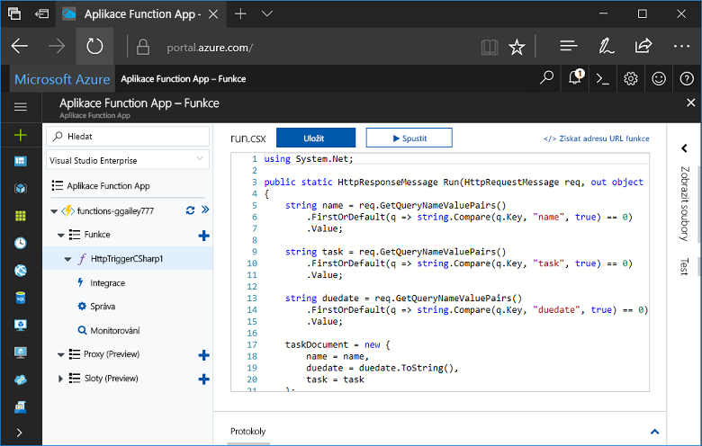
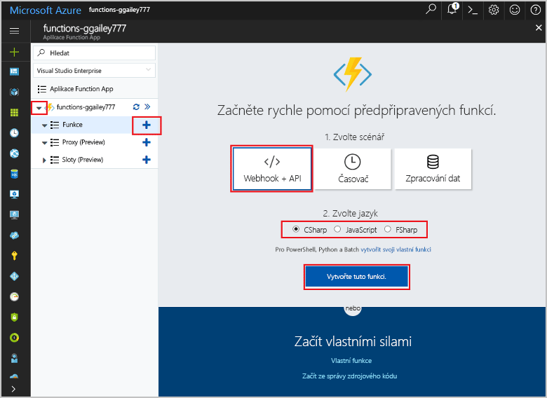
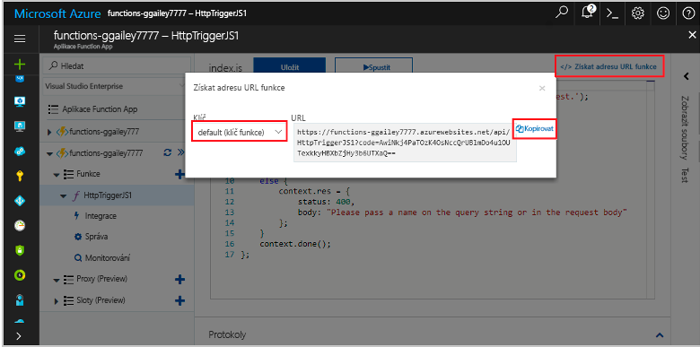
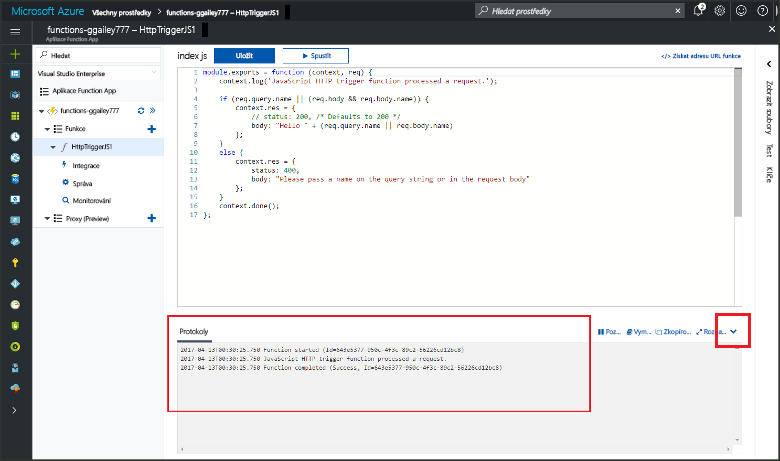

# Vytvoření první funkce v hello portálu Azure

Azure Functions umožňuje spuštění kódu v prostředí bez serveru bez nutnosti toofirst vytvoření virtuálního počítače nebo publikování webové aplikace. V tomto tématu se dozvíte, jak toouse funkce toocreate funkci "hello, world" v hello portálu Azure.

[!INCLUDE [quickstarts-free-trial-note](../../includes/quickstarts-free-trial-note.md)]

## Přihlaste se tooAzure

Přihlaste se toohello [portál Azure](https://portal.azure.com/).

## Vytvoření Function App

Musíte mít funkce aplikace toohost hello provádění funkcí. Aplikace Function App umožňuje seskupit funkce jako logickou jednotku pro snadnější správu, nasazování a sdílení prostředků. 

[!INCLUDE [Create function app Azure portal](../../includes/functions-create-function-app-portal.md)]

[!INCLUDE [functions-portal-favorite-function-apps](../../includes/functions-portal-favorite-function-apps.md)]

Dál vytvořte funkci v nové funkce aplikace hello.

## Vytvoření funkce aktivované protokolem HTTP

1. Rozbalte nové funkce aplikace, a poté klikněte na tlačítko hello  **+**  tlačítko vedle příliš**funkce**.

2.  V hello **rychle začít** vyberte **WebHook + API**, **vybrat jazyk** pro svou funkci a klikněte na **vytvořit tuto funkci** . 
   
    

Funkce je vytvořená ve zvoleného jazyka pomocí hello šablony pro HTTP aktivované funkce. Můžete spustit novou funkci hello odesláním požadavku HTTP.

## Testování funkce hello

1. V nové funkci klikněte na **</> Získat adresu URL funkce**, vyberte **výchozí (klíč funkce)** a pak na **Kopírovat**. 

    

2. Vložte adresu URL funkce hello do panelu Adresa prohlížeče. Připojit řetězec dotazu hello `&name=<yourname>` toothis adresy URL a stiskněte klávesu hello `Enter` klíče na vaši žádost hello tooexecute klávesnice. Hello tady je příklad hello odpovědi vrácené funkcí hello v prohlížeči Edge hello:

    

    požadavek Hello adresa URL obsahuje klíč, který je ve výchozím nastavení, tooaccess požadována funkce prostřednictvím protokolu HTTP.   

3. Když je funkce spuštěná, se zapisují informace o trasování toohello protokoly. toosee hello výstup trasování z předchozí zpracování hello, vrátí funkce tooyour hello portálu a klikněte na tlačítko hello v hello dolní části obrazovky tooexpand hello šipka nahoru **protokoly**. 

   

## Vyčištění prostředků

[!INCLUDE [Clean up resources](../../includes/functions-quickstart-cleanup.md)]

## Další kroky

Vytvořili jste aplikaci Function App s jednoduchou funkcí aktivovanou protokolem HTTP.  

[!INCLUDE [Next steps note](../../includes/functions-quickstart-next-steps.md)]

Další informace najdete v tématu [Vazby protokolu HTTP služby Azure Functions a vazby webhooku](functions-bindings-http-webhook.md).

