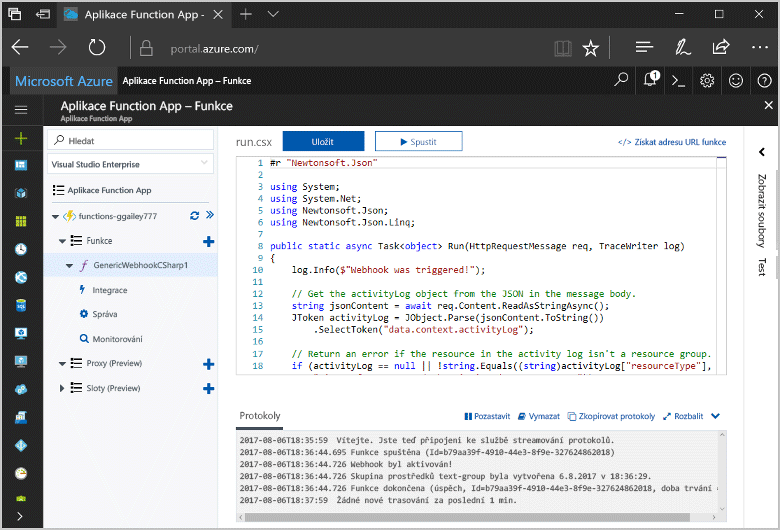
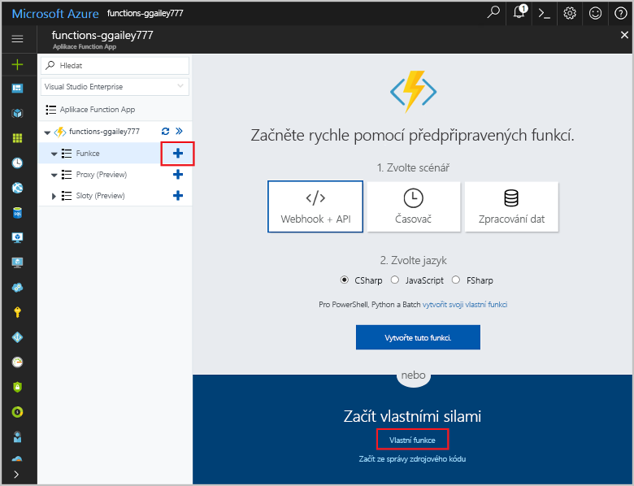
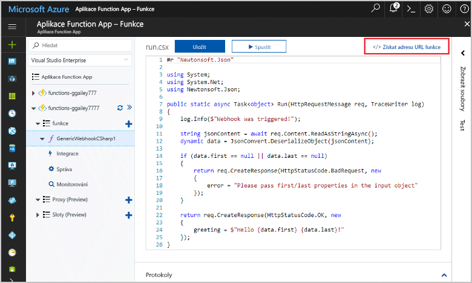
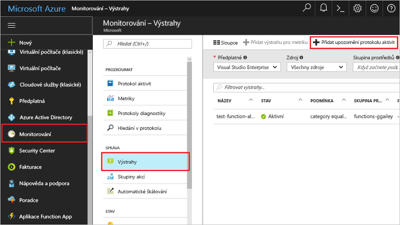
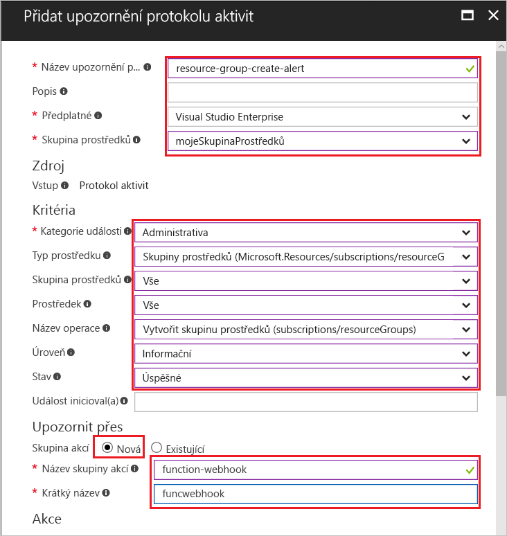
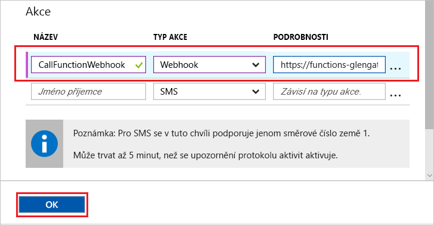
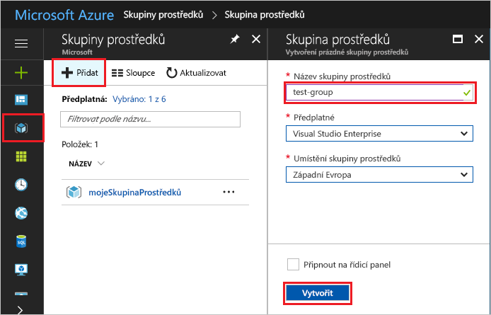
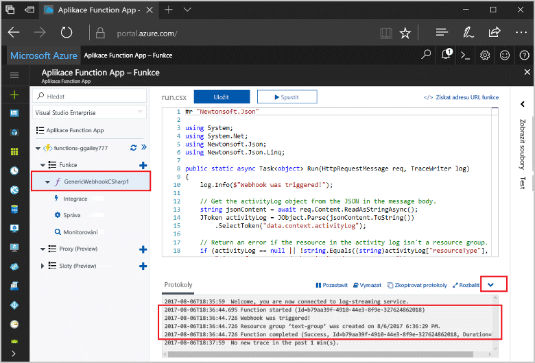

# <a name="create-a-function-triggered-by-a-generic-webhook"></a><span data-ttu-id="fbfcb-103">Vytvoření funkce aktivovány obecný webhook</span><span class="sxs-lookup"><span data-stu-id="fbfcb-103">Create a function triggered by a generic webhook</span></span>

<span data-ttu-id="fbfcb-104">Azure Functions umožňuje spuštění kódu v prostředí bez serveru bez nutnosti toofirst vytvoření virtuálního počítače nebo publikování webové aplikace.</span><span class="sxs-lookup"><span data-stu-id="fbfcb-104">Azure Functions lets you execute your code in a serverless environment without having toofirst create a VM or publish a web application.</span></span> <span data-ttu-id="fbfcb-105">Můžete například nakonfigurovat funkce toobe, aktivuje výstrahu aktivováno monitorování Azure.</span><span class="sxs-lookup"><span data-stu-id="fbfcb-105">For example, you can configure a function toobe triggered by an alert raised by Azure Monitor.</span></span> <span data-ttu-id="fbfcb-106">Toto téma ukazuje, jak přidat tooexecute kód C# Pokud skupina prostředků je tooyour předplatné.</span><span class="sxs-lookup"><span data-stu-id="fbfcb-106">This topic shows you how tooexecute C# code when a resource group is added tooyour subscription.</span></span>   



## <a name="prerequisites"></a><span data-ttu-id="fbfcb-108">Požadavky</span><span class="sxs-lookup"><span data-stu-id="fbfcb-108">Prerequisites</span></span> 

<span data-ttu-id="fbfcb-109">toocomplete v tomto kurzu:</span><span class="sxs-lookup"><span data-stu-id="fbfcb-109">toocomplete this tutorial:</span></span>

+ <span data-ttu-id="fbfcb-110">Pokud ještě nemáte předplatné Azure, vytvořte si [bezplatný účet](https://azure.microsoft.com/free/?WT.mc_id=A261C142F) před tím, než začnete.</span><span class="sxs-lookup"><span data-stu-id="fbfcb-110">If you don't have an Azure subscription, create a [free account](https://azure.microsoft.com/free/?WT.mc_id=A261C142F) before you begin.</span></span>

[!INCLUDE [functions-portal-favorite-function-apps](../../includes/functions-portal-favorite-function-apps.md)]

## <a name="create-an-azure-function-app"></a><span data-ttu-id="fbfcb-111">Vytvoření aplikace Azure Function App</span><span class="sxs-lookup"><span data-stu-id="fbfcb-111">Create an Azure Function app</span></span>

[!INCLUDE [Create function app Azure portal](../../includes/functions-create-function-app-portal.md)]

<span data-ttu-id="fbfcb-112">Dál vytvořte funkci v nové funkce aplikace hello.</span><span class="sxs-lookup"><span data-stu-id="fbfcb-112">Next, you create a function in hello new function app.</span></span>

## <span data-ttu-id="fbfcb-113"><a name="create-function"></a>Vytvoření obecný webhook aktivované funkce</span><span class="sxs-lookup"><span data-stu-id="fbfcb-113"><a name="create-function"></a>Create a generic webhook triggered function</span></span>

1. <span data-ttu-id="fbfcb-114">Rozšířit funkce aplikace a klikněte na tlačítko hello  **+**  tlačítko vedle příliš**funkce**.</span><span class="sxs-lookup"><span data-stu-id="fbfcb-114">Expand your function app and click hello **+** button next too**Functions**.</span></span> <span data-ttu-id="fbfcb-115">Pokud je tato funkce je hello první z nich v aplikaci funkce, vyberte **vlastní funkce**.</span><span class="sxs-lookup"><span data-stu-id="fbfcb-115">If this function is hello first one in your function app, select **Custom function**.</span></span> <span data-ttu-id="fbfcb-116">Zobrazí se hello kompletní sada šablon funkcí.</span><span class="sxs-lookup"><span data-stu-id="fbfcb-116">This displays hello complete set of function templates.</span></span>

    

2. <span data-ttu-id="fbfcb-118">Vyberte hello **obecný WebHook - C#** šablony.</span><span class="sxs-lookup"><span data-stu-id="fbfcb-118">Select hello **Generic WebHook - C#** template.</span></span> <span data-ttu-id="fbfcb-119">Zadejte název pro funkce C# a pak vyberte **vytvořit**.</span><span class="sxs-lookup"><span data-stu-id="fbfcb-119">Type a name for your C# function, then select **Create**.</span></span>

      

2. <span data-ttu-id="fbfcb-121">V nové funkce, klikněte na **URL funkce <> / Get**, zkopírujte a uložte hello hodnotu.</span><span class="sxs-lookup"><span data-stu-id="fbfcb-121">In your new function, click **</> Get function URL**, then copy and save hello value.</span></span> <span data-ttu-id="fbfcb-122">Můžete použít tuto hodnotu tooconfigure hello webhooku.</span><span class="sxs-lookup"><span data-stu-id="fbfcb-122">You use this value tooconfigure hello webhook.</span></span> 

    
         
<span data-ttu-id="fbfcb-124">Dále vytvoříte koncový bod webhooku ve výstraze protokolu aktivit v Azure monitorování.</span><span class="sxs-lookup"><span data-stu-id="fbfcb-124">Next, you create a webhook endpoint in an activity log alert in Azure Monitor.</span></span> 

## <a name="create-an-activity-log-alert"></a><span data-ttu-id="fbfcb-125">Vytvořit výstrahu protokolu aktivit</span><span class="sxs-lookup"><span data-stu-id="fbfcb-125">Create an activity log alert</span></span>

1. <span data-ttu-id="fbfcb-126">V hello portálu Azure, přejděte toohello **monitorování** služby, vyberte **výstrahy**a klikněte na tlačítko **přidat aktivitu protokolu upozornění**.</span><span class="sxs-lookup"><span data-stu-id="fbfcb-126">In hello Azure portal, navigate toohello **Monitor** service, select **Alerts**, and click **Add activity log alert**.</span></span>   

    

2. <span data-ttu-id="fbfcb-128">Použijte hello nastavení uvedeného v tabulce hello:</span><span class="sxs-lookup"><span data-stu-id="fbfcb-128">Use hello settings as specified in hello table:</span></span>

    

    | <span data-ttu-id="fbfcb-130">Nastavení</span><span class="sxs-lookup"><span data-stu-id="fbfcb-130">Setting</span></span>      |  <span data-ttu-id="fbfcb-131">Navrhovaná hodnota</span><span class="sxs-lookup"><span data-stu-id="fbfcb-131">Suggested value</span></span>   | <span data-ttu-id="fbfcb-132">Popis</span><span class="sxs-lookup"><span data-stu-id="fbfcb-132">Description</span></span>                              |
    | ------------ |  ------- | -------------------------------------------------- |
    | <span data-ttu-id="fbfcb-133">**Název výstrahy protokolu aktivit**</span><span class="sxs-lookup"><span data-stu-id="fbfcb-133">**Activity log alert name**</span></span> | <span data-ttu-id="fbfcb-134">prostředek skupiny vytvořit – upozornění</span><span class="sxs-lookup"><span data-stu-id="fbfcb-134">resource-group-create-alert</span></span> | <span data-ttu-id="fbfcb-135">Název výstrahy protokolu hello aktivity.</span><span class="sxs-lookup"><span data-stu-id="fbfcb-135">Name of hello activity log alert.</span></span> |
    | <span data-ttu-id="fbfcb-136">**Předplatné**</span><span class="sxs-lookup"><span data-stu-id="fbfcb-136">**Subscription**</span></span> | <span data-ttu-id="fbfcb-137">Vaše předplatné</span><span class="sxs-lookup"><span data-stu-id="fbfcb-137">Your subscription</span></span> | <span data-ttu-id="fbfcb-138">Hello odběr, který používáte pro účely tohoto kurzu.</span><span class="sxs-lookup"><span data-stu-id="fbfcb-138">hello subscription you are using for this tutorial.</span></span> | 
    |  <span data-ttu-id="fbfcb-139">**Skupina prostředků**</span><span class="sxs-lookup"><span data-stu-id="fbfcb-139">**Resource Group**</span></span> | <span data-ttu-id="fbfcb-140">myResourceGroup</span><span class="sxs-lookup"><span data-stu-id="fbfcb-140">myResourceGroup</span></span> | <span data-ttu-id="fbfcb-141">skupiny prostředků Hello hello výstrahy prostředky jsou nasazeny do.</span><span class="sxs-lookup"><span data-stu-id="fbfcb-141">hello resource group that hello alert resources are deployed to.</span></span> <span data-ttu-id="fbfcb-142">Pomocí hello stejné skupině prostředků jako funkce aplikace umožňuje snazší tooclean po dokončení kurzu hello.</span><span class="sxs-lookup"><span data-stu-id="fbfcb-142">Using hello same resource group as your function app makes it easier tooclean up after you complete hello tutorial.</span></span> |
    | <span data-ttu-id="fbfcb-143">**Kategorie události**</span><span class="sxs-lookup"><span data-stu-id="fbfcb-143">**Event category**</span></span> | <span data-ttu-id="fbfcb-144">Pro správu</span><span class="sxs-lookup"><span data-stu-id="fbfcb-144">Administrative</span></span> | <span data-ttu-id="fbfcb-145">Tato kategorie zahrnuje změny tooAzure prostředky.</span><span class="sxs-lookup"><span data-stu-id="fbfcb-145">This category includes changes made tooAzure resources.</span></span>  |
    | <span data-ttu-id="fbfcb-146">**Typ prostředku**</span><span class="sxs-lookup"><span data-stu-id="fbfcb-146">**Resource type**</span></span> | <span data-ttu-id="fbfcb-147">Skupiny prostředků</span><span class="sxs-lookup"><span data-stu-id="fbfcb-147">Resource groups</span></span> | <span data-ttu-id="fbfcb-148">Filtrování výstrah tooresource skupiny aktivit.</span><span class="sxs-lookup"><span data-stu-id="fbfcb-148">Filters alerts tooresource group activities.</span></span> |
    | <span data-ttu-id="fbfcb-149">**Skupina prostředků**</span><span class="sxs-lookup"><span data-stu-id="fbfcb-149">**Resource Group**</span></span><br/><span data-ttu-id="fbfcb-150">a **prostředků**</span><span class="sxs-lookup"><span data-stu-id="fbfcb-150">and **Resource**</span></span> | <span data-ttu-id="fbfcb-151">Všechny</span><span class="sxs-lookup"><span data-stu-id="fbfcb-151">All</span></span> | <span data-ttu-id="fbfcb-152">Monitorujte všechny prostředky.</span><span class="sxs-lookup"><span data-stu-id="fbfcb-152">Monitor all resources.</span></span> |
    | <span data-ttu-id="fbfcb-153">**Název operace**</span><span class="sxs-lookup"><span data-stu-id="fbfcb-153">**Operation name**</span></span> | <span data-ttu-id="fbfcb-154">Vytvoření skupiny prostředků</span><span class="sxs-lookup"><span data-stu-id="fbfcb-154">Create Resource Group</span></span> | <span data-ttu-id="fbfcb-155">Filtrování výstrah toocreate operace.</span><span class="sxs-lookup"><span data-stu-id="fbfcb-155">Filters alerts toocreate operations.</span></span> |
    | <span data-ttu-id="fbfcb-156">**Úroveň**</span><span class="sxs-lookup"><span data-stu-id="fbfcb-156">**Level**</span></span> | <span data-ttu-id="fbfcb-157">Informační</span><span class="sxs-lookup"><span data-stu-id="fbfcb-157">Informational</span></span> | <span data-ttu-id="fbfcb-158">Zahrnout informační úrovně výstrahy.</span><span class="sxs-lookup"><span data-stu-id="fbfcb-158">Include informational level alerts.</span></span> | 
    | <span data-ttu-id="fbfcb-159">**Stav**</span><span class="sxs-lookup"><span data-stu-id="fbfcb-159">**Status**</span></span> | <span data-ttu-id="fbfcb-160">Úspěch</span><span class="sxs-lookup"><span data-stu-id="fbfcb-160">Succeeded</span></span> | <span data-ttu-id="fbfcb-161">Filtry tooactions výstrahy, které byly úspěšně dokončeny.</span><span class="sxs-lookup"><span data-stu-id="fbfcb-161">Filters alerts tooactions that have completed successfully.</span></span> |
    | <span data-ttu-id="fbfcb-162">**Akce skupiny**</span><span class="sxs-lookup"><span data-stu-id="fbfcb-162">**Action group**</span></span> | <span data-ttu-id="fbfcb-163">Nový</span><span class="sxs-lookup"><span data-stu-id="fbfcb-163">New</span></span> | <span data-ttu-id="fbfcb-164">Vytvořte novou skupinu akce, který definuje hello akce trvá, když je vydána výstraha.</span><span class="sxs-lookup"><span data-stu-id="fbfcb-164">Create a new action group, which defines hello action takes when an alert is raised.</span></span> |
    | <span data-ttu-id="fbfcb-165">**Název skupiny akce**</span><span class="sxs-lookup"><span data-stu-id="fbfcb-165">**Action group name**</span></span> | <span data-ttu-id="fbfcb-166">Funkce webhooku</span><span class="sxs-lookup"><span data-stu-id="fbfcb-166">function-webhook</span></span> | <span data-ttu-id="fbfcb-167">Skupina akce název tooidentify hello.</span><span class="sxs-lookup"><span data-stu-id="fbfcb-167">A name tooidentify hello action group.</span></span>  | 
    | <span data-ttu-id="fbfcb-168">**Krátký název**</span><span class="sxs-lookup"><span data-stu-id="fbfcb-168">**Short name**</span></span> | <span data-ttu-id="fbfcb-169">funcwebhook</span><span class="sxs-lookup"><span data-stu-id="fbfcb-169">funcwebhook</span></span> | <span data-ttu-id="fbfcb-170">Krátký název pro skupinu akce hello.</span><span class="sxs-lookup"><span data-stu-id="fbfcb-170">A short name for hello action group.</span></span> |  

3. <span data-ttu-id="fbfcb-171">V **akce**, přidat akci pomocí nastavení hello uvedených v tabulce hello:</span><span class="sxs-lookup"><span data-stu-id="fbfcb-171">In **Actions**, add an action using hello settings as specified in hello table:</span></span> 

    

    | <span data-ttu-id="fbfcb-173">Nastavení</span><span class="sxs-lookup"><span data-stu-id="fbfcb-173">Setting</span></span>      |  <span data-ttu-id="fbfcb-174">Navrhovaná hodnota</span><span class="sxs-lookup"><span data-stu-id="fbfcb-174">Suggested value</span></span>   | <span data-ttu-id="fbfcb-175">Popis</span><span class="sxs-lookup"><span data-stu-id="fbfcb-175">Description</span></span>                              |
    | ------------ |  ------- | -------------------------------------------------- |
    | <span data-ttu-id="fbfcb-176">**Název**</span><span class="sxs-lookup"><span data-stu-id="fbfcb-176">**Name**</span></span> | <span data-ttu-id="fbfcb-177">CallFunctionWebhook</span><span class="sxs-lookup"><span data-stu-id="fbfcb-177">CallFunctionWebhook</span></span> | <span data-ttu-id="fbfcb-178">Název akce hello.</span><span class="sxs-lookup"><span data-stu-id="fbfcb-178">A name for hello action.</span></span> |
    | <span data-ttu-id="fbfcb-179">**Typ akce**</span><span class="sxs-lookup"><span data-stu-id="fbfcb-179">**Action type**</span></span> | <span data-ttu-id="fbfcb-180">Webhook</span><span class="sxs-lookup"><span data-stu-id="fbfcb-180">Webhook</span></span> | <span data-ttu-id="fbfcb-181">Hello odpovědi toohello upozornění je, že adresa URL Webhooku se nazývá.</span><span class="sxs-lookup"><span data-stu-id="fbfcb-181">hello response toohello alert is that a Webhook URL is called.</span></span> |
    | <span data-ttu-id="fbfcb-182">**Podrobnosti**</span><span class="sxs-lookup"><span data-stu-id="fbfcb-182">**Details**</span></span> | <span data-ttu-id="fbfcb-183">URL – funkce</span><span class="sxs-lookup"><span data-stu-id="fbfcb-183">Function URL</span></span> | <span data-ttu-id="fbfcb-184">Vložte adresy URL webhooku hello hello funkce, který jste zkopírovali dříve.</span><span class="sxs-lookup"><span data-stu-id="fbfcb-184">Paste in hello webhook URL of hello function that you copied earlier.</span></span> |<span data-ttu-id="fbfcb-185">v</span><span class="sxs-lookup"><span data-stu-id="fbfcb-185">v</span></span>

4. <span data-ttu-id="fbfcb-186">Klikněte na tlačítko **OK** toocreate hello výstrahy a akce skupiny.</span><span class="sxs-lookup"><span data-stu-id="fbfcb-186">Click **OK** toocreate hello alert and action group.</span></span>  

<span data-ttu-id="fbfcb-187">Hello webhooku se nyní nazývá při vytvoření skupiny prostředků v rámci vašeho předplatného.</span><span class="sxs-lookup"><span data-stu-id="fbfcb-187">hello webhook is now called when a resource group is created in your subscription.</span></span> <span data-ttu-id="fbfcb-188">Potom aktualizujte hello kód ve vaší funkce toohandle hello dat protokolu JSON v textu hello hello požadavku.</span><span class="sxs-lookup"><span data-stu-id="fbfcb-188">Next, you update hello code in your function toohandle hello JSON log data in hello body of hello request.</span></span>   

## <a name="update-hello-function-code"></a><span data-ttu-id="fbfcb-189">Aktualizovat kód funkce hello</span><span class="sxs-lookup"><span data-stu-id="fbfcb-189">Update hello function code</span></span>

1. <span data-ttu-id="fbfcb-190">Přejděte zpět tooyour funkce aplikace hello portálu a rozšířit funkce.</span><span class="sxs-lookup"><span data-stu-id="fbfcb-190">Navigate back tooyour function app in hello portal, and expand your function.</span></span> 

2. <span data-ttu-id="fbfcb-191">Nahraďte kód skriptu hello C# ve funkci hello portálu hello hello následující kód:</span><span class="sxs-lookup"><span data-stu-id="fbfcb-191">Replace hello C# script code in hello function in hello portal with hello following code:</span></span>

    ```csharp
    #r "Newtonsoft.Json"
    
    using System;
    using System.Net;
    using Newtonsoft.Json;
    using Newtonsoft.Json.Linq;
    
    public static async Task<object> Run(HttpRequestMessage req, TraceWriter log)
    {
        log.Info($"Webhook was triggered!");
    
        // Get hello activityLog object from hello JSON in hello message body.
        string jsonContent = await req.Content.ReadAsStringAsync();
        JToken activityLog = JObject.Parse(jsonContent.ToString())
            .SelectToken("data.context.activityLog");
    
        // Return an error if hello resource in hello activity log isn't a resource group. 
        if (activityLog == null || !string.Equals((string)activityLog["resourceType"], 
            "Microsoft.Resources/subscriptions/resourcegroups"))
        {
            log.Error("An error occured");
            return req.CreateResponse(HttpStatusCode.BadRequest, new
            {
                error = "Unexpected message payload or wrong alert received."
            });
        }
    
        // Write information about hello created resource group toohello streaming log.
        log.Info(string.Format("Resource group '{0}' was {1} on {2}.",
            (string)activityLog["resourceGroupName"],
            ((string)activityLog["subStatus"]).ToLower(), 
            (DateTime)activityLog["submissionTimestamp"]));
    
        return req.CreateResponse(HttpStatusCode.OK);    
    }
    ```

<span data-ttu-id="fbfcb-192">Nyní můžete otestovat hello funkce tak, že vytvoříte novou skupinu prostředků ve vašem předplatném.</span><span class="sxs-lookup"><span data-stu-id="fbfcb-192">Now you can test hello function by creating a new resource group in your subscription.</span></span>

## <a name="test-hello-function"></a><span data-ttu-id="fbfcb-193">Testování funkce hello</span><span class="sxs-lookup"><span data-stu-id="fbfcb-193">Test hello function</span></span>

1. <span data-ttu-id="fbfcb-194">Klikněte na ikonu skupiny prostředků hello v hello nalevo od hello portál Azure, vyberte **+ přidat**, zadejte **název skupiny prostředků**a vyberte **vytvořit** toocreate prázdné skupině prostředků.</span><span class="sxs-lookup"><span data-stu-id="fbfcb-194">Click hello resource group icon in hello left of hello Azure portal, select **+ Add**, type a **Resource group name**, and select **Create** toocreate an empty resource group.</span></span>
    
    

2. <span data-ttu-id="fbfcb-196">Přejděte zpět tooyour funkce a rozbalte hello **protokoly** okno.</span><span class="sxs-lookup"><span data-stu-id="fbfcb-196">Go back tooyour function and expand hello **Logs** window.</span></span> <span data-ttu-id="fbfcb-197">Po vytvoření skupiny prostředků hello hello výstrahy aktivační události protokolu aktivit hello webhooku a provede hello funkce.</span><span class="sxs-lookup"><span data-stu-id="fbfcb-197">After hello resource group is created, hello activity log alert triggers hello webhook and hello function executes.</span></span> <span data-ttu-id="fbfcb-198">Zobrazí název nové skupiny prostředků hello zapisují protokoly toohello hello.</span><span class="sxs-lookup"><span data-stu-id="fbfcb-198">You see hello name of hello new resource group written toohello logs.</span></span>  

    

3. <span data-ttu-id="fbfcb-200">(Volitelné) Přejděte zpět a odstraňte skupinu prostředků hello, kterou jste vytvořili.</span><span class="sxs-lookup"><span data-stu-id="fbfcb-200">(Optional) Go back and delete hello resource group that you created.</span></span> <span data-ttu-id="fbfcb-201">Všimněte si, že tuto aktivitu neaktivuje hello funkce.</span><span class="sxs-lookup"><span data-stu-id="fbfcb-201">Note that this activity doesn't trigger hello function.</span></span> <span data-ttu-id="fbfcb-202">Důvodem je, že odstranění operations filtrují hello výstraha.</span><span class="sxs-lookup"><span data-stu-id="fbfcb-202">This is because delete operations are filtered out by hello alert.</span></span> 

## <a name="clean-up-resources"></a><span data-ttu-id="fbfcb-203">Vyčištění prostředků</span><span class="sxs-lookup"><span data-stu-id="fbfcb-203">Clean up resources</span></span>

[!INCLUDE [Next steps note](../../includes/functions-quickstart-cleanup.md)]

## <a name="next-steps"></a><span data-ttu-id="fbfcb-204">Další kroky</span><span class="sxs-lookup"><span data-stu-id="fbfcb-204">Next steps</span></span>

<span data-ttu-id="fbfcb-205">Funkce, která se spouští při přijetí požadavku z obecný webhook jste vytvořili.</span><span class="sxs-lookup"><span data-stu-id="fbfcb-205">You have created a function that runs when a request is received from a generic webhook.</span></span> 

[!INCLUDE [Next steps note](../../includes/functions-quickstart-next-steps.md)]

<span data-ttu-id="fbfcb-206">Další informace o aktivačních událostech webhooků najdete v tématu [Vazby protokolu HTTP služby Azure Functions a vazby webhooku](functions-bindings-http-webhook.md).</span><span class="sxs-lookup"><span data-stu-id="fbfcb-206">For more information about webhook triggers, see [Azure Functions HTTP and webhook bindings](functions-bindings-http-webhook.md).</span></span> <span data-ttu-id="fbfcb-207">toolearn Další informace o vývoji funkce v jazyce C#, najdete v části [Azure funkcí jazyka C# skript referenční informace pro vývojáře](functions-reference-csharp.md).</span><span class="sxs-lookup"><span data-stu-id="fbfcb-207">toolearn more about developing functions in C#, see [Azure Functions C# script developer reference](functions-reference-csharp.md).</span></span>

