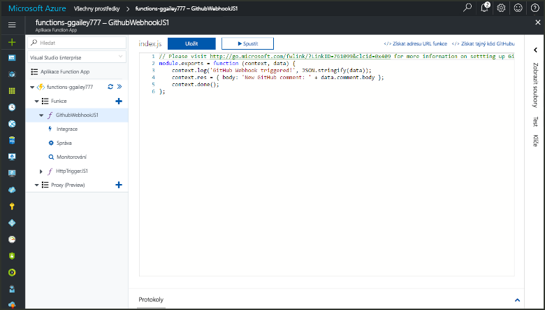
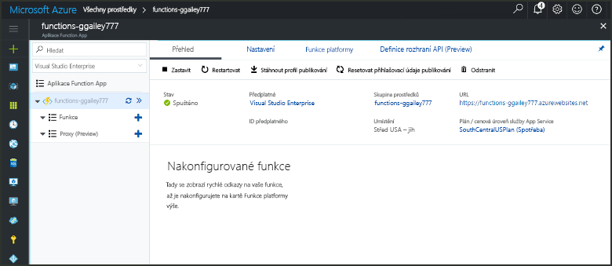
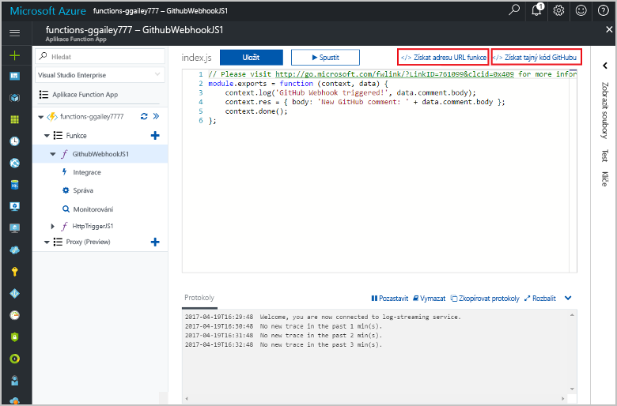
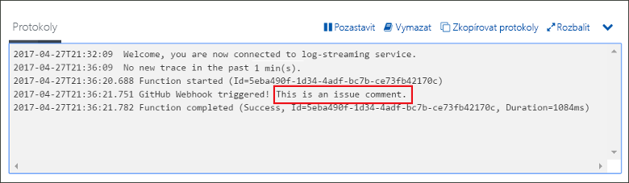

# Vytvoření funkce aktivované webhookem GitHubuCreate a function triggered by a GitHub webhook

Naučte se vytvořit funkci, která se aktivuje požadavkem webhooku HTTP s datovou částí specifickou pro GitHub.Learn how to create a function that is triggered by an HTTP webhook request with a GitHub-specific payload.

## PožadavkyPrerequisites

+ Účet GitHubu s alespoň jedním projektem.A GitHub account with at least one project.
+ Předplatné Azure.An Azure subscription. Pokud ho nemáte, než začnete, vytvořte si [bezplatný účet](https://azure.microsoft.com/free/?WT.mc_id=A261C142F).If you don't have one, create a [free account](https://azure.microsoft.com/free/?WT.mc_id=A261C142F) before you begin.

[!INCLUDE [functions-portal-favorite-function-apps](../../includes/functions-portal-favorite-function-apps.md)]

## Vytvoření aplikace Azure Function AppCreate an Azure Function app

[!INCLUDE [Create function app Azure portal](../../includes/functions-create-function-app-portal.md)]

Dál vytvoříte v nové aplikaci Function App funkci.Next, you create a function in the new function app.

## Vytvoření funkce aktivované webhookem GitHubuCreate a GitHub webhook triggered function

1. Rozbalte aplikaci Function App a klikněte na tlačítko **+** vedle položky **Funkce**.Expand your function app and click the **+** button next to **Functions**. Pokud jde o první funkci ve vaší aplikaci Function App, vyberte možnost **Vlastní funkce**.If this is the first function in your function app, select **Custom function**. Zobrazí se kompletní sada šablon funkcí.This displays the complete set of function templates.

    

2. Vyberte **WebHook Githubu** šablonu pro požadovaný jazyk.Select the **GitHub WebHook** template for your desired language. **Pojmenujte funkci** a pak vyberte **Vytvořit**.**Name your function**, then select **Create**.

      

3. V nové funkci klikněte na **</> Získat adresu URL funkce** a potom zkopírujte a uložte příslušné hodnoty.In your new function, click **</> Get function URL**, then copy and save the values. To samé udělejte s možností **</> Získat tajný klíč GitHubu**.Do the same thing for **</> Get GitHub secret**. Tyto hodnoty použijete ke konfiguraci webhooku na GitHubu.You use these values to configure the webhook in GitHub.

    

Dále vytvoříte webhook ve vašem úložišti GitHub.Next, you create a webhook in your GitHub repository.

## Konfigurace webhookuConfigure the webhook

1. V GitHubu přejděte do úložiště, které vlastníte.In GitHub, navigate to a repository that you own. Můžete také použít libovolné úložiště, které máte rozvětvené.You can also use any repository that you have forked. Pokud potřebujete úložiště rozvětvit, použijte stránku <https://github.com/Azure-Samples/functions-quickstart>.If you need to fork a repository, use <https://github.com/Azure-Samples/functions-quickstart>.

1. Klikněte na **Settings** (Nastavení), pak na **Webhooks** (Webhooky) a **Add webhook** (Přidat webhook).Click **Settings**, then click **Webhooks**, and  **Add webhook**.

    

1. Použijte nastavení uvedené v tabulce a potom klikněte na **Přidat webhook**.Use settings as specified in the table, then click **Add webhook**.

    

| NastaveníSetting | Navrhovaná hodnotaSuggested value | PopisDescription |
|---|---|---|
| **Datová část adresy URL****Payload URL** | Zkopírovaná hodnotaCopied value | Použijte hodnotu vrácenou příkazem **</> Získat adresu URL funkce**.Use the value returned by  **</> Get function URL**. |
| **Tajný kód****Secret**   | Zkopírovaná hodnotaCopied value | Použijte hodnotu vrácenou příkazem **</> Získat tajný kód GitHubu**.Use the value returned by  **</> Get GitHub secret**. |
| **Typ obsahu****Content type** | application/jsonapplication/json | Funkce očekává datovou část JSON.The function expects a JSON payload. |
| Aktivační událostiEvent triggers | Nechat mě vybrat jednotlivé událostiLet me select individual events | Chceme provést aktivaci jenom při událostech komentářů k problémům.We only want to trigger on issue comment events.  |
| | Komentář k problémuIssue comment |  |

Teď je webhook nakonfigurován tak, aby aktivoval vaši funkci v případě, že dojde k přidání nového komentáře k problému.Now, the webhook is configured to trigger your function when a new issue comment is added.

## Testování funkceTest the function

1. Ve vašem úložišti GitHub otevřete kartu **Issues** (Problémy) v novém okně prohlížeče.In your GitHub repository, open the **Issues** tab in a new browser window.

1. V novém okně klikněte na **New Issue** (Nový problém), zadejte název a klikněte na **Submit new issue** (Odeslat nový problém).In the new window, click **New Issue**, type a title, and then click **Submit new issue**.

1. U problému zadejte komentář a klikněte na tlačítko **Comment** (Komentář).In the issue, type a comment and click **Comment**.

    

1. Vraťte se na portál a podívejte se do protokolů.Go back to the portal and view the logs. Měli byste vidět položku trasování s textem nového komentáře.You should see a trace entry with the new comment text.

     

## Vyčištění prostředkůClean up resources

[!INCLUDE [Next steps note](../../includes/functions-quickstart-cleanup.md)]

## Další krokyNext steps

Vytvořili jste funkci, která se spustí při přijetí požadavku z webhooku Githubu.You have created a function that runs when a request is received from a GitHub webhook.

[!INCLUDE [Next steps note](../../includes/functions-quickstart-next-steps.md)]

Další informace o aktivačních událostech webhooků najdete v tématu [Vazby protokolu HTTP služby Azure Functions a vazby webhooku](functions-bindings-http-webhook.md).For more information about webhook triggers, see [Azure Functions HTTP and webhook bindings](functions-bindings-http-webhook.md).
