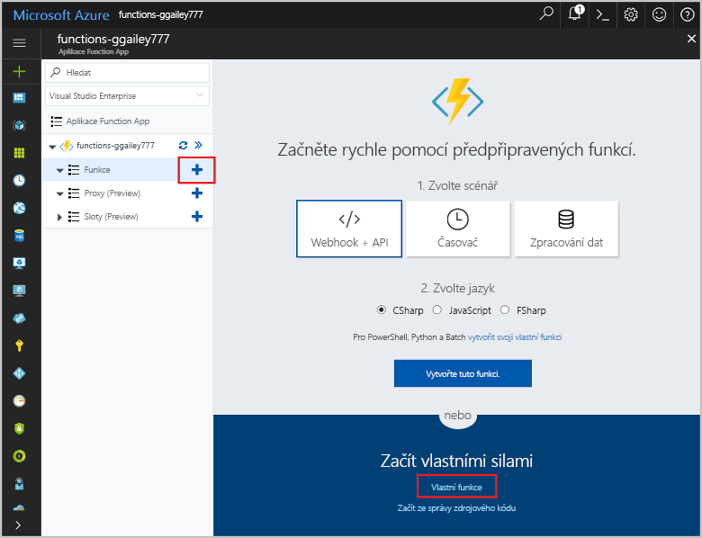

# Vytvoření funkce aktivované webhookem GitHubu

Zjistěte, jak toocreate funkci, která se aktivuje požadavkem HTTP webhooku s datovou část specifický pro GitHub.

## Požadavky

+ Účet GitHubu s alespoň jedním projektem.
+ Předplatné Azure. Pokud ho nemáte, než začnete, vytvořte si [bezplatný účet](https://azure.microsoft.com/free/?WT.mc_id=A261C142F).

[!INCLUDE [functions-portal-favorite-function-apps](../../includes/functions-portal-favorite-function-apps.md)]

## Vytvoření aplikace Azure Function App

[!INCLUDE [Create function app Azure portal](../../includes/functions-create-function-app-portal.md)]

Dál vytvořte funkci v nové funkce aplikace hello.

## Vytvoření funkce aktivované webhookem GitHubu

1. Rozšířit funkce aplikace a klikněte na tlačítko hello  **+**  tlačítko vedle příliš**funkce**. Pokud je to první funkce hello ve vaší aplikaci funkce, vyberte **vlastní funkce**. Zobrazí se hello kompletní sada šablon funkcí.

    

2. Vyberte hello **WebHook Githubu** šablonu pro požadovaný jazyk. **Pojmenujte funkci** a pak vyberte **Vytvořit**.

      

3. V nové funkce, klikněte na **URL funkce <> / Get**, zkopírujte a uložte hello hodnoty. Hello samé pro **tajný klíč <> / získat Githubu**. Použijte tyto hodnoty tooconfigure hello webhooku v Githubu.

    

Dále vytvoříte webhook ve vašem úložišti GitHub.

## Konfigurace webhooku hello

1. V Githubu přejděte tooa úložiště, který vlastníte. Můžete také použít libovolné úložiště, které máte rozvětvené. Pokud potřebujete toofork úložiště, použijte <https://github.com/Azure-Samples/functions-quickstart>.

1. Klikněte na **Settings** (Nastavení), pak na **Webhooks** (Webhooky) a **Add webhook** (Přidat webhook).

    

1. Použití nastavení uvedeného v tabulce hello a pak klikněte na **přidat webhooku**.

    

| Nastavení | Navrhovaná hodnota | Popis |
|---|---|---|
| **Datová část adresy URL** | Zkopírovaná hodnota | Použít hello hodnoty vrácené **URL funkce <> / Get**. |
| **Tajný kód**   | Zkopírovaná hodnota | Použít hello hodnoty vrácené **tajný klíč <> / získat Githubu**. |
| **Typ obsahu** | application/json | Funkce Hello očekává datové části JSON. |
| Aktivační události | Nechat mě vybrat jednotlivé události | Chceme jenom tootrigger na události komentář problém.  |
| | Komentář k problému |  |

Nyní, hello webhooku je funkce nakonfigurovaná tootrigger při přidání nové komentář problém.

## Testování funkce hello

1. V úložišti GitHub, otevřete hello **problémy** ve nové okno prohlížeče.

1. V novém okně hello, klikněte na tlačítko **nový problém**, zadejte název a potom klikněte na **odeslání nové problém**.

1. V hello problém, zadejte komentář a klikněte na tlačítko **komentář**.

    

1. Přejděte zpět toohello portál a zobrazit protokoly hello. Měli byste vidět položku trasování s nový komentář textem hello.

     

## Vyčištění prostředků

[!INCLUDE [Next steps note](../../includes/functions-quickstart-cleanup.md)]

## Další kroky

Vytvořili jste funkci, která se spustí při přijetí požadavku z webhooku Githubu.

[!INCLUDE [Next steps note](../../includes/functions-quickstart-next-steps.md)]

Další informace o aktivačních událostech webhooků najdete v tématu [Vazby protokolu HTTP služby Azure Functions a vazby webhooku](functions-bindings-http-webhook.md).
