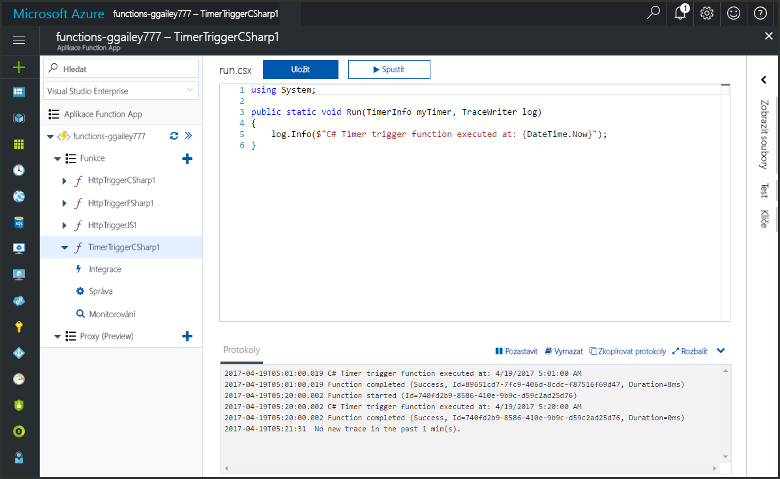
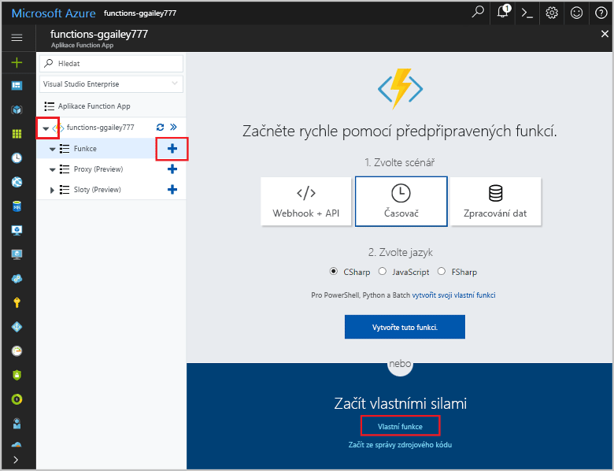
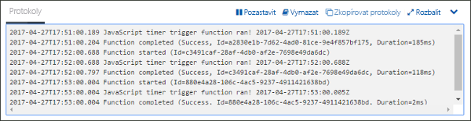
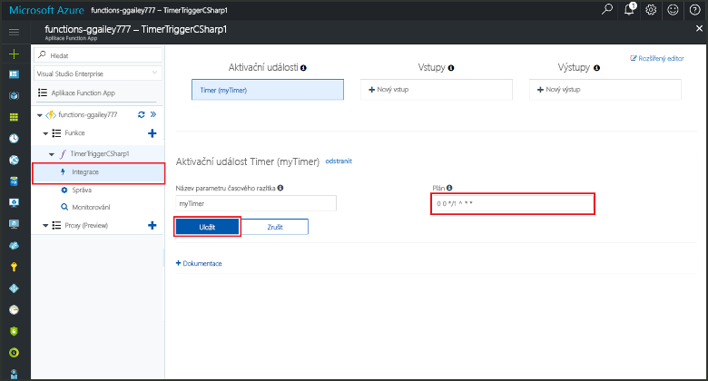

# Vytvoření funkce v Azure aktivované časovačemCreate a function in Azure that is triggered by a timer

Zjistěte, jak Azure Functions toocreate toouse funkci, která běží na základě plánu, který definujete.Learn how toouse Azure Functions toocreate a function that runs based a schedule that you define.

## PožadavkyPrerequisites

toocomplete v tomto kurzu:toocomplete this tutorial:

+ Pokud ještě nemáte předplatné Azure, vytvořte si [bezplatný účet](https://azure.microsoft.com/free/?WT.mc_id=A261C142F) před tím, než začnete.If you don't have an Azure subscription, create a [free account](https://azure.microsoft.com/free/?WT.mc_id=A261C142F) before you begin.

[!INCLUDE [functions-portal-favorite-function-apps](../../includes/functions-portal-favorite-function-apps.md)]

## Vytvoření aplikace Azure Function AppCreate an Azure Function app

[!INCLUDE [Create function app Azure portal](../../includes/functions-create-function-app-portal.md)]

Dál vytvořte funkci v nové funkce aplikace hello.Next, you create a function in hello new function app.

## Vytvoření funkce aktivované časovačemCreate a timer triggered function

1. Rozšířit funkce aplikace a klikněte na tlačítko hello  **+**  tlačítko vedle příliš**funkce**.Expand your function app and click hello **+** button next too**Functions**. Pokud je to první funkce hello ve vaší aplikaci funkce, vyberte **vlastní funkce**.If this is hello first function in your function app, select **Custom function**. Zobrazí se hello kompletní sada šablon funkcí.This displays hello complete set of function templates.

    

2. Vyberte hello **TimerTrigger** šablonu pro požadovaný jazyk.Select hello **TimerTrigger** template for your desired language. Pak použijte hello nastavení uvedeného v tabulce hello:Then use hello settings as specified in hello table:

    

    | NastaveníSetting | Navrhovaná hodnotaSuggested value | PopisDescription |
    |---|---|---|
    | **Pojmenujte svoji funkci****Name your function** | TimerTriggerCSharp1TimerTriggerCSharp1 | Definuje název hello funkce spustí časovač.Defines hello name of your timer triggered function. |
    | **[Plán](http://en.wikipedia.org/wiki/Cron#CRON_expression)****[Schedule](http://en.wikipedia.org/wiki/Cron#CRON_expression)** | 0 \*/1 \* \* \* \*0 \*/1 \* \* \* \* | Šest pole [výraz CRON](http://en.wikipedia.org/wiki/Cron#CRON_expression) která plánuje vaší funkce toorun každou minutu.A six field [CRON expression](http://en.wikipedia.org/wiki/Cron#CRON_expression) that schedules your function toorun every minute. |

2. Klikněte na možnost **Vytvořit**.Click **Create**. Ve zvoleném jazyce se vytvoří funkce, která se bude spouštět každou minutu.A function is created in your chosen language that runs every minute.

3. Zobrazení informací trasování zapsat toohello protokoly a zkontrolujte provádění.Verify execution by viewing trace information written toohello logs.

    

Nyní můžete změnit plán hello funkce tak, aby běžel méně často, například jednou za hodinu.Now, you can change hello function's schedule so that it runs less often, such as once every hour. 

## Plán aktualizace hello časovačeUpdate hello timer schedule

1. Rozbalte funkci a klikněte na **Integrace**.Expand your function and click **Integrate**. Toto je, kde můžete definovat vstup a výstup vazby pro funkce a také nastavit plán hello.This is where you define input and output bindings for your function and also set hello schedule. 

2. V poli **Plán** zadejte novou hodnotu `0 0 */1 * * *` a potom klikněte na **Uložit**.Enter a new **Schedule** value of `0 0 */1 * * *`, and then click **Save**.  

Teď máte funkci, která se spouští jednou za hodinu.You now have a function that runs once every hour. 

## Vyčištění prostředkůClean up resources

[!INCLUDE [Next steps note](../../includes/functions-quickstart-cleanup.md)]

## Další krokyNext steps

Vytvořili jste funkci, která se spouští na základě plánu.You have created a function that runs based on a schedule.

[!INCLUDE [Next steps note](../../includes/functions-quickstart-next-steps.md)]

Další informace o aktivačních časovačích najdete v tématu [Plánování spouštění kódu v Azure Functions](functions-bindings-timer.md).For more information timer triggers, see [Schedule code execution with Azure Functions](functions-bindings-timer.md).