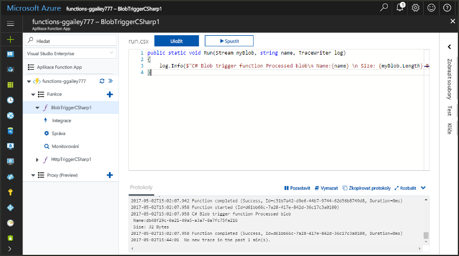
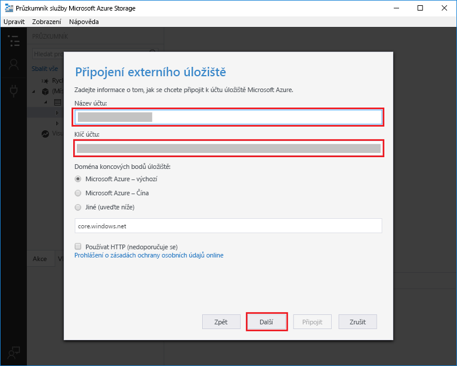
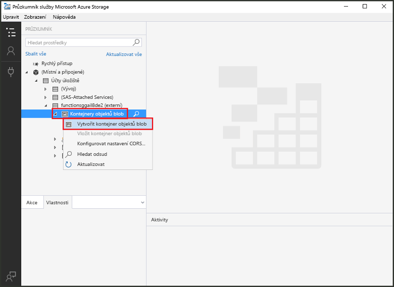
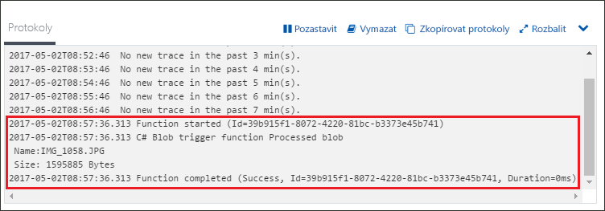

# Vytvoření funkce aktivované službou Azure Blob StorageCreate a function triggered by Azure Blob storage

Zjistěte, jak toocreate funkci aktivuje, když jsou soubory nahrát tooor aktualizovat v Azure Blob storage.Learn how toocreate a function triggered when files are uploaded tooor updated in Azure Blob storage.

## PožadavkyPrerequisites

+ Stáhněte a nainstalujte hello [Microsoft Azure Storage Explorer](http://storageexplorer.com/).Download and install hello [Microsoft Azure Storage Explorer](http://storageexplorer.com/).
+ Předplatné Azure.An Azure subscription. Pokud ho nemáte, než začnete, vytvořte si [bezplatný účet](https://azure.microsoft.com/free/?WT.mc_id=A261C142F).If you don't have one, create a [free account](https://azure.microsoft.com/free/?WT.mc_id=A261C142F) before you begin.

[!INCLUDE [functions-portal-favorite-function-apps](../../includes/functions-portal-favorite-function-apps.md)]

## Vytvoření aplikace Azure Function AppCreate an Azure Function app

[!INCLUDE [Create function app Azure portal](../../includes/functions-create-function-app-portal.md)]

Dál vytvořte funkci v nové funkce aplikace hello.Next, you create a function in hello new function app.

## Vytvoření funkce aktivované službou Blob StorageCreate a Blob storage triggered function

1. Rozšířit funkce aplikace a klikněte na tlačítko hello  **+**  tlačítko vedle příliš**funkce**.Expand your function app and click hello **+** button next too**Functions**. Pokud je to první funkce hello ve vaší aplikaci funkce, vyberte **vlastní funkce**.If this is hello first function in your function app, select **Custom function**. Zobrazí se hello kompletní sada šablon funkcí.This displays hello complete set of function templates.

    

2. Vyberte hello **BlobTrigger** šablonu pro požadovaný jazyk a použít hello nastavení uvedeného v tabulce hello.Select hello **BlobTrigger** template for your desired language, and use hello settings as specified in hello table.

    

    | NastaveníSetting | Navrhovaná hodnotaSuggested value | PopisDescription |
    |---|---|---|
    | **Cesta****Path**   | mycontainer/{name}mycontainer/{name}    | Monitorované umístění ve službě Blob Storage.Location in Blob storage being monitored. Název souboru Hello objektu hello blob je předán hello vazbu jako hello _název_ parametr.hello file name of hello blob is passed in hello binding as hello _name_ parameter.  |
    | **Připojení k účtu úložiště****Storage account connection** | AzureWebJobStorageAzureWebJobStorage | Můžete použít připojení účtu úložiště hello již používá aplikace funkce nebo vytvořte novou.You can use hello storage account connection already being used by your function app, or create a new one.  |
    | **Pojmenujte svoji funkci****Name your function** | Jedinečný název v rámci aplikace Function AppUnique in your function app | Název této funkce aktivované objektem blob.Name of this blob triggered function. |

3. Klikněte na tlačítko **vytvořit** toocreate funkce.Click **Create** toocreate your function.

V dalším kroku připojit tooyour účet úložiště Azure a vytvořit hello **můj_kontejner** kontejneru.Next, you connect tooyour Azure Storage account and create hello **mycontainer** container.

## Vytvoření kontejneru helloCreate hello container

1. Ve funkci klikněte na **Integrace**, rozbalte položku **Dokumentace**a zkopírujte údaje **Název účtu** a **Klíč účtu**.In your function, click **Integrate**, expand **Documentation**, and copy both **Account name** and **Account key**. Používáte účet úložiště toohello tooconnect tyto přihlašovací údaje.You use these credentials tooconnect toohello storage account. Pokud už jste připojení účtu úložiště, přeskočte toostep 4.If you have already connected your storage account, skip toostep 4.

    

1. Spustit hello [Microsoft Azure Storage Explorer](http://storageexplorer.com/) nástroje, klikněte na tlačítko hello připojit ikonu na levé straně hello, zvolte **použít název účtu úložiště a klíč**a klikněte na tlačítko **Další**.Run hello [Microsoft Azure Storage Explorer](http://storageexplorer.com/) tool, click hello connect icon on hello left, choose **Use a storage account name and key**, and click **Next**.

    

1. Zadejte hello **název účtu** a **klíč účtu** z kroku 1, klikněte na tlačítko **Další** a potom **Connect**.Enter hello **Account name** and **Account key** from step 1, click **Next** and then **Connect**. 

    

1. Rozbalte účet úložiště hello připojit, klikněte pravým tlačítkem na **Blob kontejnery**, klikněte na tlačítko **vytvořit kontejner objektů blob**, typ `mycontainer`, a potom stiskněte klávesu enter.Expand hello attached storage account, right-click **Blob containers**, click **Create blob container**, type `mycontainer`, and then press enter.

    

Teď, když máte kontejner objektů blob, můžete otestovat hello funkce tím, že nahrajete soubor toohello kontejner.Now that you have a blob container, you can test hello function by uploading a file toohello container.

## Testování funkce helloTest hello function

1. Zpět v hello portálu Azure, rozbalte procházet tooyour funkce hello **protokoly** dolnímu hello hello stránky a ujistěte se, že není pozastavená této protokolů streamování.Back in hello Azure portal, browse tooyour function expand hello **Logs** at hello bottom of hello page and make sure that log streaming isn't paused.

1. V Průzkumníku úložišť rozbalte účet úložiště, položku **Kontejnery objektů blob** a potom položku **mycontainer**.In Storage Explorer, expand your storage account, **Blob containers**, and **mycontainer**. Klikněte na **Odeslat** a potom na **Nahrát soubory…**.Click **Upload** and then **Upload files...**.

    

1. V hello **nahrání souborů** dialogovém okně klikněte na hello **soubory** pole.In hello **Upload files** dialog box, click hello **Files** field. Vyhledejte soubor tooa v místním počítači, jako je soubor bitové kopie, vyberte ho a klikněte na tlačítko **otevřete** a potom **nahrát**.Browse tooa file on your local computer, such as an image file, select it and click **Open** and then **Upload**.

1. Přejděte zpět tooyour funkce protokoly a ověřte, zda že byl načten tomuto objektu blob hello.Go back tooyour function logs and verify that hello blob has been read.

   

    >[!NOTE]
    > Když vaše aplikace funkce běží v plánu spotřeby výchozí hello, mohou být zpoždění až tooseveral minut mezi hello objekt blob se přidán nebo aktualizován a hello funkce se aktivuje.When your function app runs in hello default Consumption plan, there may be a delay of up tooseveral minutes between hello blob being added or updated and hello function being triggered. Pokud u funkcí aktivovaných objekty blob potřebujete nízkou latenci, zvažte spuštění aplikace Function App v rámci plánu služby App Service.If you need low latency in your blob triggered functions, consider running your function app in an App Service plan.

## Vyčištění prostředkůClean up resources

[!INCLUDE [Next steps note](../../includes/functions-quickstart-cleanup.md)]

## Další krokyNext steps

Vytvořili jste funkci, která se spustí v případě, že objekt blob je přidaný do úložiště objektů Blob tooor aktualizovat.You have created a function that runs when a blob is added tooor updated in Blob storage. 

[!INCLUDE [Next steps note](../../includes/functions-quickstart-next-steps.md)]

Další informace o aktivačních událostech služby Blob Storage najdete v tématu [Vazby služby Azure Functions Blob Storage](functions-bindings-storage-blob.md).For more information about Blob storage triggers, see [Azure Functions Blob storage bindings](functions-bindings-storage-blob.md).
