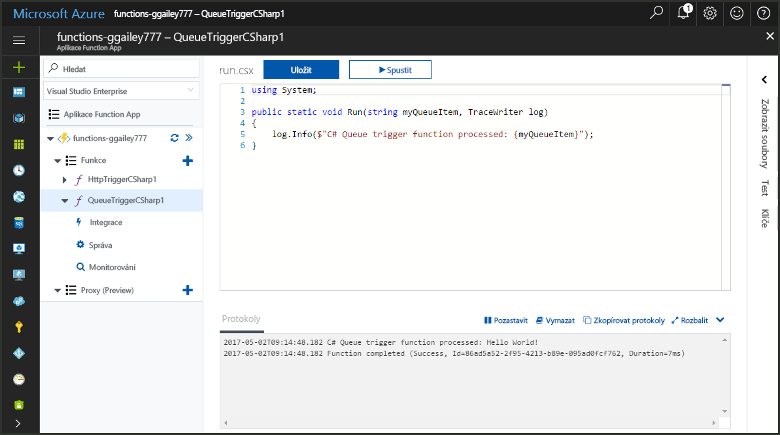
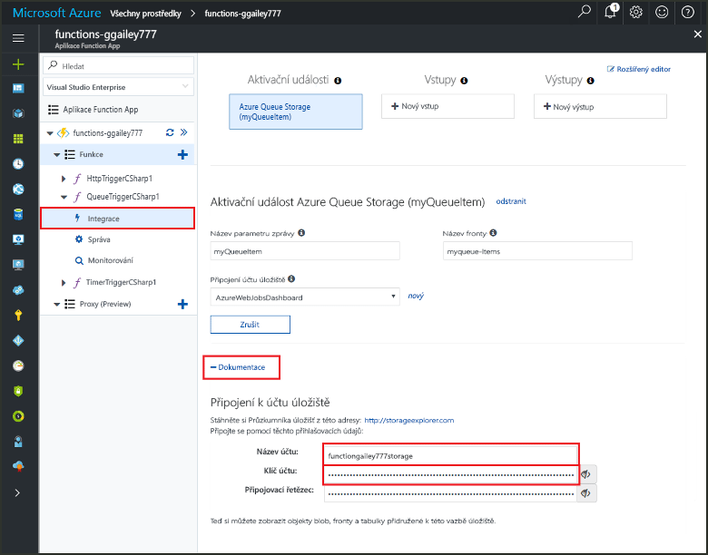
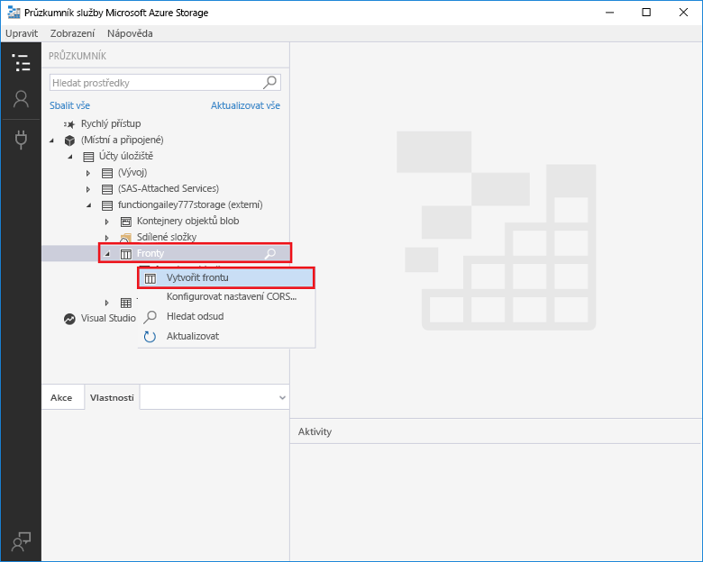
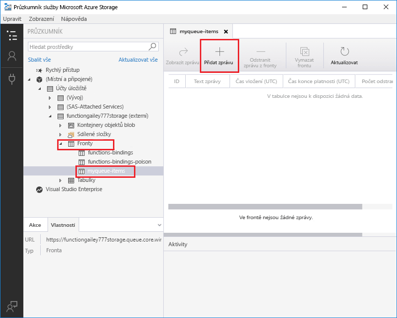
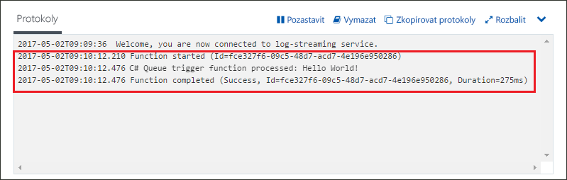

# Vytvoření funkce aktivované službou Azure Queue Storage

Zjistěte, jak toocreate funkci aktivuje, když se zprávy odeslané tooan fronty Azure Storage.

## Požadavky

- Stáhněte a nainstalujte hello [Microsoft Azure Storage Explorer](http://storageexplorer.com/).

- Předplatné Azure. Pokud ho nemáte, než začnete, vytvořte si [bezplatný účet](https://azure.microsoft.com/free/?WT.mc_id=A261C142F).

[!INCLUDE [functions-portal-favorite-function-apps](../../includes/functions-portal-favorite-function-apps.md)]

## Vytvoření aplikace Azure Function App

[!INCLUDE [Create function app Azure portal](../../includes/functions-create-function-app-portal.md)]

Dál vytvořte funkci v nové funkce aplikace hello.

## Vytvoření funkce aktivované frontou

1. Rozšířit funkce aplikace a klikněte na tlačítko hello  **+**  tlačítko vedle příliš**funkce**. Pokud je to první funkce hello ve vaší aplikaci funkce, vyberte **vlastní funkce**. Zobrazí se hello kompletní sada šablon funkcí.

    

2. Vyberte hello **QueueTrigger** šablonu pro požadovaný jazyk a použít hello nastavení uvedeného v tabulce hello.

    
    
    | Nastavení | Navrhovaná hodnota | Popis |
    |---|---|---|
    | **Název fronty**   | myqueue-items    | Název hello fronty tooconnect tooin účtu úložiště. |
    | **Připojení k účtu úložiště** | AzureWebJobStorage | Můžete použít připojení účtu úložiště hello již používá aplikace funkce nebo vytvořte novou.  |
    | **Pojmenujte svoji funkci** | Jedinečný název v rámci aplikace Function App | Název této funkce aktivované frontou. |

3. Klikněte na tlačítko **vytvořit** toocreate funkce.

V dalším kroku připojit tooyour účet úložiště Azure a vytvořit hello **Moje_fronta položky** fronty úložiště.

## Vytvořit frontu hello

1. Ve funkci klikněte na **Integrace**, rozbalte položku **Dokumentace**a zkopírujte údaje **Název účtu** a **Klíč účtu**. Používáte účet úložiště toohello tooconnect tyto přihlašovací údaje. Pokud už jste připojení účtu úložiště, přeskočte toostep 4.

    v

1. Spustit hello [Microsoft Azure Storage Explorer](http://storageexplorer.com/) nástroje, klikněte na tlačítko hello připojit ikonu na levé straně hello, zvolte **použít název účtu úložiště a klíč**a klikněte na tlačítko **Další**.

    

1. Zadejte hello **název účtu** a **klíč účtu** z kroku 1, klikněte na tlačítko **Další** a potom **Connect**.

    

1. Rozbalte účet úložiště hello připojit, klikněte pravým tlačítkem na **fronty**, klikněte na tlačítko **fronty vytvořit**, typ `myqueue-items`, a potom stiskněte klávesu enter.

    

Teď, když máte fronty úložiště, můžete otestovat hello funkce přidáním toohello front zpráv.

## Testování funkce hello

1. Zpět v hello portálu Azure, rozbalte procházet tooyour funkce hello **protokoly** dolnímu hello hello stránky a ujistěte se, že není pozastavená této protokolů streamování.

1. V Storage Exploreru rozbalte svůj účet úložiště, možnosti **Queues** (Fornty), a **myqueue-items** a potom klikněte na **Add message** (Přidat zprávu).

    

1. Zadejte zprávu „Hello World!“ do pole **Text zprávy** a klikněte na **OK**.

1. Počkejte několik sekund poté přejděte zpět tooyour funkce protokoly a ověřte, že tuto novou zprávu hello byl načten z fronty hello.

    

1. Zpět v Storage Explorer, klikněte na **aktualizovat** a ověřte, že uvítací zprávu zpracovává a již není ve frontě hello.

## Vyčištění prostředků

[!INCLUDE [Next steps note](../../includes/functions-quickstart-cleanup.md)]

## Další kroky

Vytvořili jste funkci, která spustí při přidání fronty úložiště tooa zprávu.

[!INCLUDE [Next steps note](../../includes/functions-quickstart-next-steps.md)]

Další informace o aktivačních událostech fronty úložiště najdete v tématu [Vazby front úložiště služby Azure Functions](functions-bindings-storage-queue.md).