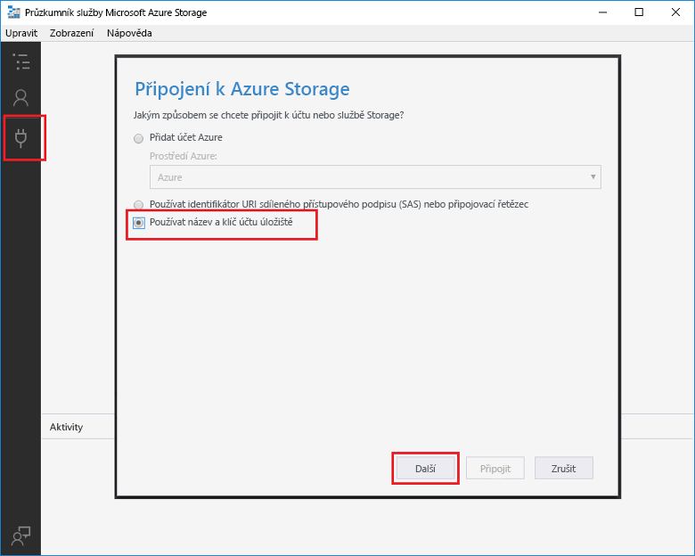

# Vytvoření funkce aktivované službou Azure Queue StorageCreate a function triggered by Azure Queue storage

Zjistěte, jak toocreate funkci aktivuje, když se zprávy odeslané tooan fronty Azure Storage.Learn how toocreate a function triggered when messages are submitted tooan Azure Storage queue.

## PožadavkyPrerequisites

- Stáhněte a nainstalujte hello [Microsoft Azure Storage Explorer](http://storageexplorer.com/).Download and install hello [Microsoft Azure Storage Explorer](http://storageexplorer.com/).

- Předplatné Azure.An Azure subscription. Pokud ho nemáte, než začnete, vytvořte si [bezplatný účet](https://azure.microsoft.com/free/?WT.mc_id=A261C142F).If you don't have one, create a [free account](https://azure.microsoft.com/free/?WT.mc_id=A261C142F) before you begin.

[!INCLUDE [functions-portal-favorite-function-apps](../../includes/functions-portal-favorite-function-apps.md)]

## Vytvoření aplikace Azure Function AppCreate an Azure Function app

[!INCLUDE [Create function app Azure portal](../../includes/functions-create-function-app-portal.md)]

Dál vytvořte funkci v nové funkce aplikace hello.Next, you create a function in hello new function app.

## Vytvoření funkce aktivované frontouCreate a Queue triggered function

1. Rozšířit funkce aplikace a klikněte na tlačítko hello  **+**  tlačítko vedle příliš**funkce**.Expand your function app and click hello **+** button next too**Functions**. Pokud je to první funkce hello ve vaší aplikaci funkce, vyberte **vlastní funkce**.If this is hello first function in your function app, select **Custom function**. Zobrazí se hello kompletní sada šablon funkcí.This displays hello complete set of function templates.

    

2. Vyberte hello **QueueTrigger** šablonu pro požadovaný jazyk a použít hello nastavení uvedeného v tabulce hello.Select hello **QueueTrigger** template for your desired language, and  use hello settings as specified in hello table.

    
    
    | NastaveníSetting | Navrhovaná hodnotaSuggested value | PopisDescription |
    |---|---|---|
    | **Název fronty****Queue name**   | myqueue-itemsmyqueue-items    | Název hello fronty tooconnect tooin účtu úložiště.Name of hello queue tooconnect tooin your Storage account. |
    | **Připojení k účtu úložiště****Storage account connection** | AzureWebJobStorageAzureWebJobStorage | Můžete použít připojení účtu úložiště hello již používá aplikace funkce nebo vytvořte novou.You can use hello storage account connection already being used by your function app, or create a new one.  |
    | **Pojmenujte svoji funkci****Name your function** | Jedinečný název v rámci aplikace Function AppUnique in your function app | Název této funkce aktivované frontou.Name of this queue triggered function. |

3. Klikněte na tlačítko **vytvořit** toocreate funkce.Click **Create** toocreate your function.

V dalším kroku připojit tooyour účet úložiště Azure a vytvořit hello **Moje_fronta položky** fronty úložiště.Next, you connect tooyour Azure Storage account and create hello **myqueue-items** storage queue.

## Vytvořit frontu helloCreate hello queue

1. Ve funkci klikněte na **Integrace**, rozbalte položku **Dokumentace**a zkopírujte údaje **Název účtu** a **Klíč účtu**.In your function, click **Integrate**, expand **Documentation**, and copy both **Account name** and **Account key**. Používáte účet úložiště toohello tooconnect tyto přihlašovací údaje.You use these credentials tooconnect toohello storage account. Pokud už jste připojení účtu úložiště, přeskočte toostep 4.If you have already connected your storage account, skip toostep 4.

    vv

1. Spustit hello [Microsoft Azure Storage Explorer](http://storageexplorer.com/) nástroje, klikněte na tlačítko hello připojit ikonu na levé straně hello, zvolte **použít název účtu úložiště a klíč**a klikněte na tlačítko **Další**.Run hello [Microsoft Azure Storage Explorer](http://storageexplorer.com/) tool, click hello connect icon on hello left, choose **Use a storage account name and key**, and click **Next**.

    

1. Zadejte hello **název účtu** a **klíč účtu** z kroku 1, klikněte na tlačítko **Další** a potom **Connect**.Enter hello **Account name** and **Account key** from step 1, click **Next** and then **Connect**.

    

1. Rozbalte účet úložiště hello připojit, klikněte pravým tlačítkem na **fronty**, klikněte na tlačítko **fronty vytvořit**, typ `myqueue-items`, a potom stiskněte klávesu enter.Expand hello attached storage account, right-click **Queues**, click **Create queue**, type `myqueue-items`, and then press enter.

    

Teď, když máte fronty úložiště, můžete otestovat hello funkce přidáním toohello front zpráv.Now that you have a storage queue, you can test hello function by adding a message toohello queue.

## Testování funkce helloTest hello function

1. Zpět v hello portálu Azure, rozbalte procházet tooyour funkce hello **protokoly** dolnímu hello hello stránky a ujistěte se, že není pozastavená této protokolů streamování.Back in hello Azure portal, browse tooyour function expand hello **Logs** at hello bottom of hello page and make sure that log streaming isn't paused.

1. V Storage Exploreru rozbalte svůj účet úložiště, možnosti **Queues** (Fornty), a **myqueue-items** a potom klikněte na **Add message** (Přidat zprávu).In Storage Explorer, expand your storage account, **Queues**, and **myqueue-items**, then click **Add message**.

    

1. Zadejte zprávu „Hello World!“Type your "Hello World!" do pole **Text zprávy** a klikněte na **OK**.message in **Message text** and click **OK**.

1. Počkejte několik sekund poté přejděte zpět tooyour funkce protokoly a ověřte, že tuto novou zprávu hello byl načten z fronty hello.Wait for a few seconds, then go back tooyour function logs and verify that hello new message has been read from hello queue.

    

1. Zpět v Storage Explorer, klikněte na **aktualizovat** a ověřte, že uvítací zprávu zpracovává a již není ve frontě hello.Back in Storage Explorer, click **Refresh** and verify that hello message has been processed and is no longer in hello queue.

## Vyčištění prostředkůClean up resources

[!INCLUDE [Next steps note](../../includes/functions-quickstart-cleanup.md)]

## Další krokyNext steps

Vytvořili jste funkci, která spustí při přidání fronty úložiště tooa zprávu.You have created a function that runs when a message is added tooa storage queue.

[!INCLUDE [Next steps note](../../includes/functions-quickstart-next-steps.md)]

Další informace o aktivačních událostech fronty úložiště najdete v tématu [Vazby front úložiště služby Azure Functions](functions-bindings-storage-queue.md).For more information about Queue storage triggers, see [Azure Functions Storage queue bindings](functions-bindings-storage-queue.md).