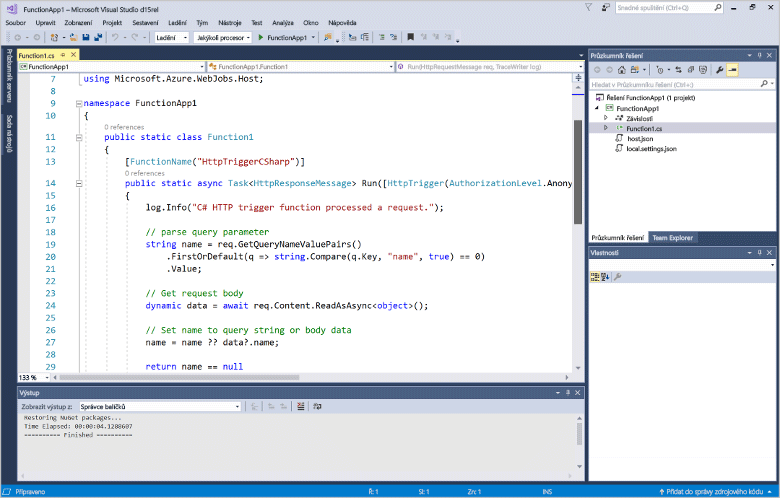
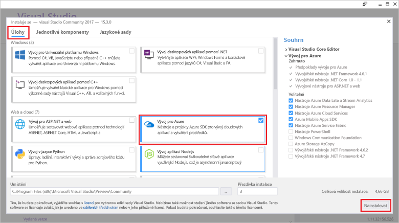
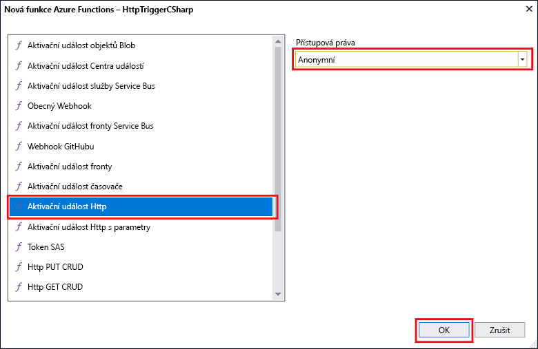

# Vytvoření první funkce pomocí sady Visual Studio

Azure Functions umožňuje spuštění kódu v prostředí bez serveru bez nutnosti toofirst vytvoření virtuálního počítače nebo publikování webové aplikace.

V tomto tématu se dozvíte, jak toouse hello Visual Studio 2017 tools pro Azure Functions toocreate a testování místně funkci "hello, world". Potom budete publikovat tooAzure kód funkce hello. Tyto nástroje jsou k dispozici jako součást pracovního vytížení Azure development hello ve Visual Studio 2017 verze 15.3 nebo novější.

## Požadavky

toocomplete tento kurz, instalace:

* [Visual Studio 2017 verze 15.3](https://www.visualstudio.com/vs/preview/), včetně hello **Azure development** zatížení.

    
    
    >[!NOTE]  
    Po instalaci nebo upgradu tooVisual Studio 2017 verze 15.3, budete pravděpodobně potřebovat toomanually aktualizace hello Visual Studio 2017 tools pro Azure Functions. Můžete je aktualizovat z hello nástrojů hello **nástroje** nabídky v části **rozšíření a aktualizace...**   >  **Aktualizace** > **sady Visual Studio Marketplace** > **Azure Functions a webové úlohy nástroje**  >  **Aktualizace**. 

[!INCLUDE [quickstarts-free-trial-note](../../includes/quickstarts-free-trial-note.md)] 

## Vytvoření projektu Azure Functions v sadě Visual Studio

[!INCLUDE [Create a project using hello Azure Functions template](../../includes/functions-vstools-create.md)]

Teď, když jste vytvořili projekt hello, můžete vytvořit svoji první funkci.

## Vytvoření funkce hello

1. V **Průzkumníku řešení** klikněte pravým tlačítkem na uzel projektu a vyberte **Přidat** > **Nová položka**. Vyberte **Funkce Azure Functions** a klikněte na **Přidat**.

2. Vyberte **HttpTrigger**, zadejte **Název funkce**, jako **Přístupová práva** vyberte **Anonymní** a klikněte na **Vytvořit**. Funkce Hello vytvořit přístup k požadavku HTTP z libovolného klienta. 

    

    Soubor kódu se přidá tooyour projekt, který obsahuje třídu, která implementuje funkce kódu. Tento kód je založena na šablonu, která přijímá název hodnota a toto využití zpátky. Hello **%{FunctionName/** atribut nastaví hello název funkce. Hello **HttpTrigger** atribut označuje uvítací zprávu, která aktivuje funkce hello. 

    

Teď máte vytvořenou funkci aktivovanou protokolem HTTP a můžete ji otestovat na místním počítači.

## Testování funkce hello místně

Nástroje Azure Functions Core umožňují spouštět projekt Azure Functions na místním počítači pro vývoj. Jste výzvami tooinstall, které tyto nástroje hello při prvním spuštění funkce ze sady Visual Studio.  

1. tootest funkce, stiskněte klávesu F5. Pokud se zobrazí výzva, přijímat žádosti o hello ze sady Visual Studio toodownload a nainstalujte nástroje pro základní funkce Azure (CLI).  Také můžete potřebovat tooenable výjimku brány firewall tak, aby hello nástrojů může zpracovávat požadavky HTTP.

2. Kopírování hello URL funkce z modulu runtime Azure Functions hello výstup.  

    

3. Vložte hello adresu URL pro požadavek HTTP hello do panelu Adresa prohlížeče. Připojit řetězec dotazu hello `&name=<yourname>` toothis adresy URL a provedení hello požadavku. Následující Hello zobrazuje hello odpovědi v hello prohlížeče toohello místní požadavek GET vrácené funkcí hello: 

    

4. toostop ladění, klikněte na tlačítko hello **Zastavit** tlačítka na panelu nástrojů Visual Studio hello.

Po ověření, že funkce hello běží správně v místním počítači, je čas toopublish hello projektu tooAzure.

## Publikování projektu tooAzure hello

Před publikováním projektu musíte mít v předplatném Azure aplikaci funkcí. Aplikaci funkcí můžete vytvořit přímo v sadě Visual Studio.

[!INCLUDE [Publish hello project tooAzure](../../includes/functions-vstools-publish.md)]

## Testování funkce v Azure

1. Zkopírujte hello základní adresu URL aplikace hello funkce ze stránky profilu publikování hello. Nahraďte hello `localhost:port` část hello adresy URL, které jste použili při testování hello funkce místně s hello nové základní adresu URL. Jako dříve, ujistěte se, řetězce dotazu hello tooappend `&name=<yourname>` toothis adresy URL a provedení hello požadavku.

    Hello adresu URL, která volá protokolu HTTP aktivované funkce vypadá takto:

        http://<functionappname>.azurewebsites.net/api/<functionname>?name=<yourname> 

2. Vložte tuto novou adresu URL pro požadavek hello HTTP do panelu Adresa prohlížeče. Následující Hello zobrazuje hello odpovědi v hello prohlížeče toohello vzdálené požadavek GET vrácené funkcí hello: 

    
 
## Další kroky

Použili jste aplikaci funkce sady Visual Studio toocreate C# pomocí jednoduché funkce protokolu HTTP aktivované. 

+ toolearn jak tooconfigure vašeho projektu toosupport jiné typy triggerů a vazeb, najdete v části hello [projektu hello konfigurace pro místní vývoj](functions-develop-vs.md#configure-the-project-for-local-development) kapitoly [nástroje funkce Azure pro sadu Visual Studio](functions-develop-vs.md).
+ toolearn Další informace o místní testování a ladění pomocí nástroje základní funkce hello Azure, najdete v části [kódu a testování Azure Functions místně](functions-run-local.md). 
+ toolearn Další informace o vývoji funkce jako knihovny tříd rozhraní .NET, najdete v části [knihovny tříd pomocí rozhraní .NET s Azure Functions](functions-dotnet-class-library.md). 

