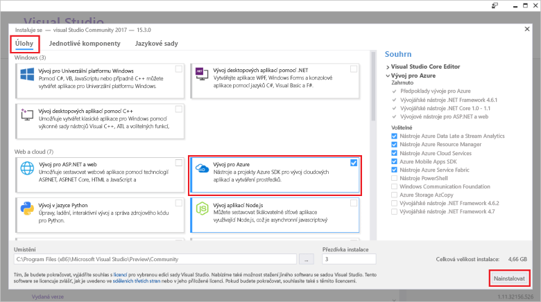

# <a name="azure-functions-tools-for-visual-studio"></a>Azure Functions Tools pro Visual Studio  

Azure funkce Tools for Visual Studio 2017 představuje rozšíření pro Visual Studio, která umožňuje vývoj, testování a nasazení tooAzure funkcí jazyka C#. Pokud je vaše první zkušenosti s Azure Functions, další informace najdete v [Úvod tooAzure funkce](functions-overview.md).

Hello nástroje funkce Azure poskytuje hello následující výhody: 

* Upravit, sestavte a spusťte funkce ve svém místním vývojovém počítači. 
* Publikování projektu Azure Functions přímo tooAzure. 
* Pomocí WebJobs atributy toodeclare funkce vazby přímo v kódu jazyka C# místo zachování samostatné function.json pro vazby definice hello.
* Vývoj a nasazení předem kompilované funkce jazyka C#. Předem dodržela funkce zajistit lepší studený start výkonu než založených na skriptech funkcí jazyka C#. 
* Přitom má všechny výhody hello vývoje v sadě Visual Studio Code funkcí v jazyce C#. 

Toto téma ukazuje, jak toouse hello nástroje funkce Azure pro Visual Studio 2017 toodevelop funkcí v jazyce C#. Také zjistíte, jak toopublish vašeho projektu tooAzure jako sestavení rozhraní .NET.

## <a name="prerequisites"></a>Požadavky

Nástroje Azure funkce je součástí zatížení Azure development hello [Visual Studio 2017 verze 15.3](https://www.visualstudio.com/vs/), nebo novější. Zajistěte, aby zahrnete hello **Azure development** zatížení v instalaci sady Visual Studio 2017 verze 15.3:



toocreate a nasazení funkce, musíte taky:

* Aktivní předplatné Azure. Pokud nemáte předplatné Azure, [volné účty](https://azure.microsoft.com/free/?WT.mc_id=A261C142F) jsou k dispozici.

* Účet úložiště Azure. toocreate účet úložiště, najdete v části [vytvořit účet úložiště](../storage/common/storage-create-storage-account.md#create-a-storage-account).  
## <a name="create-an-azure-functions-project"></a>Vytvoření projektu Azure Functions 

[!INCLUDE [Create a project using hello Azure Functions](../../includes/functions-vstools-create.md)]


## <a name="configure-hello-project-for-local-development"></a>Konfigurace projektu hello pro místní vývoj

Když vytvoříte nový projekt pomocí šablony Azure Functions hello, získáte prázdný C# projekt, který obsahuje hello následující soubory:

* **Host.JSON**: umožňuje nakonfigurovat hello funkce hostitele. Toto nastavení se týká i při spuštění místně a v Azure. Další informace najdete v tématu [host.json](https://github.com/Azure/azure-webjobs-sdk-script/wiki/host.json) článku.
    
* **Local.Settings.JSON**: udržuje nastavení používané při místním spuštění funkce. Tato nastavení nejsou používány nástrojem Azure, jsou používány hello [nástroje základní funkce Azure](functions-run-local.md). Použijte tato nastavení toospecify souboru, například připojovací řetězce tooother Azure services. Přidání nového klíče toohello **hodnoty** pole pro každé připojení vyžaduje funkce ve vašem projektu. Další informace najdete v tématu [nastavení místního souboru](functions-run-local.md#local-settings-file) v tématu nástroje základní funkce Azure hello.

Hello Functions runtime interně používá účet úložiště Azure. Pro všechny aktivovat jiného typu než HTTP a pomocí webhooků, musíte nastavit hello **Values.AzureWebJobsStorage** klíče tooa platný Azure Storage účet připojovací řetězec.

[!INCLUDE [Note toonot use local storage](../../includes/functions-local-settings-note.md)]

 tooset hello účet připojovacího řetězce úložiště:

1. V sadě Visual Studio otevřete **Průzkumník cloudu**, rozbalte položku **účet úložiště** > **váš účet úložiště**, pak vyberte **vlastnosti**a kopírování hello **primární připojovací řetězec** hodnotu.   

2. V projektu, otevřete soubor projektu local.settings.json hello a nastavte hodnotu hello hello **AzureWebJobsStorage** klíče toohello připojovací řetězec, kterou jste zkopírovali.

3. Opakujte hello předchozí krok tooadd jedinečné klíče toohello **hodnoty** pole pro všechna připojení, které vyžadují funkcí.  

## <a name="create-a-function"></a>Vytvoření funkce

V předem kompilované funkce jsou definovány hello vazby používané funkce hello použití atributů v kódu hello. Při použití nástroje funkce Azure toocreate hello funkcí ze šablon hello poskytuje tyto atributy se použijí pro vás. 

1. V **Průzkumníku řešení** klikněte pravým tlačítkem na uzel projektu a vyberte **Přidat** > **Nová položka**. Vyberte **funkce Azure**, zadejte **název** pro hello třídu a klikněte na tlačítko **přidat**.

2. Zvolte aktivační událost, nastavte hello vlastnosti vazby a klikněte na **vytvořit**. Hello následující příklad ukazuje nastavení hello při vytvoření fronty úložiště aktivaci funkce. 

    
    
    Klíč řetězce připojení s názvem **QueueStorage** zadaný, který je definován v souboru local.settings.json hello. 
 
3. Zkontrolujte hello nově přidaná třídy. Zobrazí statického **spustit** metody s atributem hello **%{FunctionName/** atribut. Tento atribut označuje, že je metoda hello hello vstupní bod pro funkci hello. 

    Například hello následující C# – třída představuje základní funkce úložiště aktivuje fronty:

    ````csharp
    using System;
    using Microsoft.Azure.WebJobs;
    using Microsoft.Azure.WebJobs.Host;
    
    namespace FunctionApp1
    {
        public static class Function1
        {
            [FunctionName("QueueTriggerCSharp")]        
            public static void Run([QueueTrigger("myqueue-items", Connection = "QueueStorage")]string myQueueItem, TraceWriter log)
            {
                log.Info($"C# Queue trigger function processed: {myQueueItem}");
            }
        }
    } 
    ````
 
    Atribut konkrétní vazbu je metody použité tooeach vazby zadaný parametr toohello vstupní bod. atribut Hello načítá informace o vazbě hello jako parametry. V předchozím příkladu hello hello první parametr má **QueueTrigger** atribut použité, s označením fronty aktivuje funkce. Název fronty Hello a název nastavení připojovacího řetězce jsou předány jako parametry.  

## <a name="testing-functions"></a>Testování funkcí

Nástroje Azure Functions Core umožňují spouštět projekt Azure Functions na místním počítači pro vývoj. Jste výzvami tooinstall, které tyto nástroje hello při prvním spuštění funkce ze sady Visual Studio.  

tootest funkce, stiskněte klávesu F5. Pokud se zobrazí výzva, přijímat žádosti o hello ze sady Visual Studio toodownload a nainstalujte nástroje pro základní funkce Azure (CLI).  Také můžete potřebovat tooenable výjimku brány firewall tak, aby hello nástrojů může zpracovávat požadavky HTTP.

S projektem hello systémem můžete otestovat váš kód by při testování nasazené funkce. Další informace najdete v tématu [strategie pro testování kódu v Azure Functions](functions-test-a-function.md). Při spuštění v režimu ladění, jsou zarážky v sadě Visual Studio podle očekávání. 

Příklad jak tootest fronty aktivuje funkce, najdete v části hello [fronty aktivuje funkce Rychlý úvodní kurz](functions-create-storage-queue-triggered-function.md#test-the-function).  

toolearn Další informace o použití nástroje základní funkce hello Azure, najdete v části [kód a testovat místně na Azure functions](functions-run-local.md).

## <a name="publish-tooazure"></a>Publikování tooAzure

[!INCLUDE [Publish hello project tooAzure](../../includes/functions-vstools-publish.md)]

>[!NOTE]  
>Všechna nastavení, které jste přidali v hello local.settings.json je nutné také přidat toohello funkce aplikace v Azure. Tato nastavení nejsou automaticky přidáni. Můžete přidat aplikaci funkce tooyour požadovaná nastavení v jednom z těchto způsobů:
>
>* [Pomocí portálu Azure hello](functions-how-to-use-azure-function-app-settings.md#settings).
>* [Pomocí hello `--publish-local-settings` možnost publikování v hello nástroje základní funkce Azure](functions-run-local.md#publish).
>* [Pomocí rozhraní příkazového řádku Azure hello](/cli/azure/functionapp/config/appsettings#set). 

## <a name="next-steps"></a>Další kroky

Další informace o nástrojích funkce Azure, najdete v tématu hello běžné otázky části hello [2017 nástroje sady Visual Studio pro Azure Functions](https://blogs.msdn.microsoft.com/webdev/2017/05/10/azure-function-tools-for-visual-studio-2017/) příspěvku na blogu.

toolearn Další informace o nástroje základní funkce hello Azure, najdete v části [kód a testovat místně na Azure functions](functions-run-local.md).  
toolearn Další informace o vývoji funkce jako knihovny tříd rozhraní .NET, najdete v části [knihovny tříd pomocí rozhraní .NET s Azure Functions](functions-dotnet-class-library.md). Toto téma obsahuje také příklady jak toouse atributy toodeclare hello různých typů vazeb Azure Functions podporuje.    
