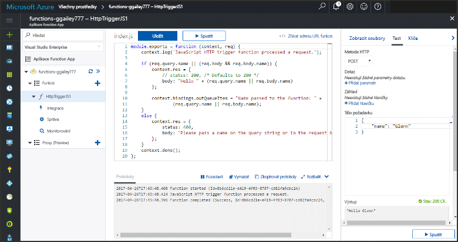
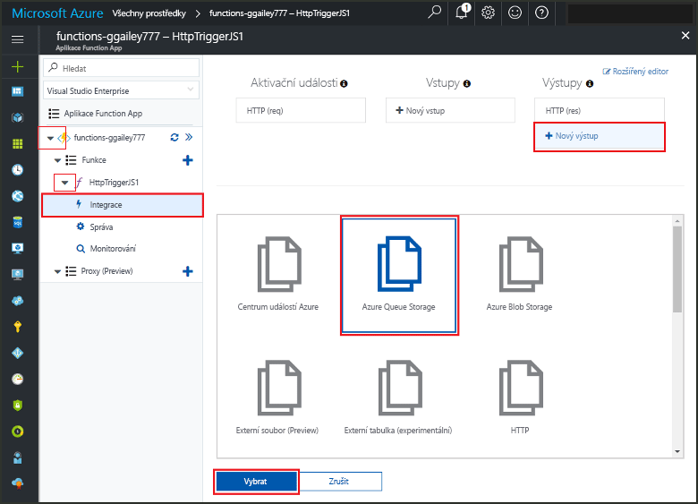
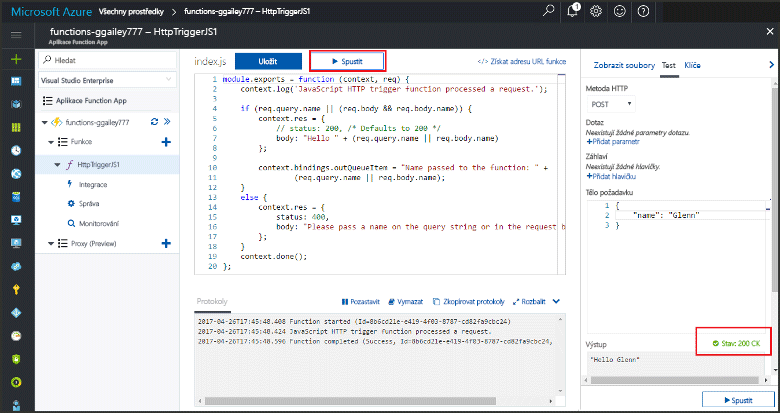
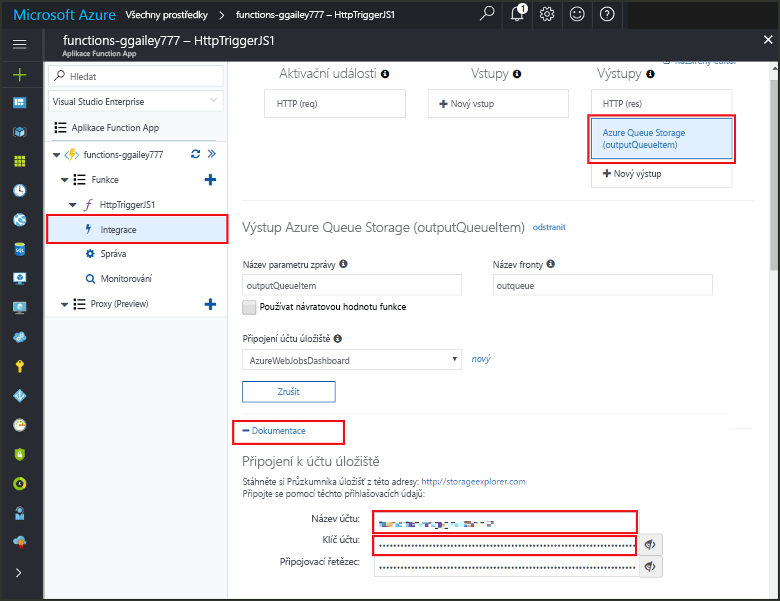
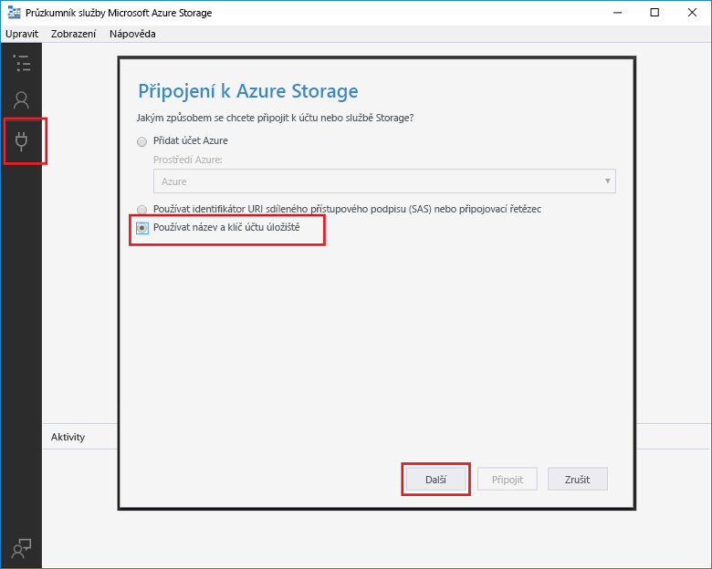

# <a name="add-messages-to-an-azure-storage-queue-using-functions"></a><span data-ttu-id="8d0e5-103">Přidání zpráv do fronty Azure Storage pomocí funkcí</span><span class="sxs-lookup"><span data-stu-id="8d0e5-103">Add messages to an Azure Storage queue using Functions</span></span>

<span data-ttu-id="8d0e5-104">Ve službě Azure Functions poskytují vstupní a výstupní vazby deklarativní způsob připojení k datům externí služby z funkce.</span><span class="sxs-lookup"><span data-stu-id="8d0e5-104">In Azure Functions, input and output bindings provide a declarative way to connect to external service data from your function.</span></span> <span data-ttu-id="8d0e5-105">V tomto tématu zjistíte, jak aktualizovat existující funkci přidáním výstupní vazby, která odesílá zprávy do Azure Queue Storage.</span><span class="sxs-lookup"><span data-stu-id="8d0e5-105">In this topic, learn how to update an existing function by adding an output binding that sends messages to Azure Queue storage.</span></span>  



## <a name="prerequisites"></a><span data-ttu-id="8d0e5-107">Požadavky</span><span class="sxs-lookup"><span data-stu-id="8d0e5-107">Prerequisites</span></span> 

[!INCLUDE [Previous topics](../../includes/functions-quickstart-previous-topics.md)]

* <span data-ttu-id="8d0e5-108">Nainstalujte [Microsoft Azure Storage Explorer](http://storageexplorer.com/).</span><span class="sxs-lookup"><span data-stu-id="8d0e5-108">Install the [Microsoft Azure Storage Explorer](http://storageexplorer.com/).</span></span>

## <span data-ttu-id="8d0e5-109"><a name="add-binding"></a>Přidání výstupní vazby</span><span class="sxs-lookup"><span data-stu-id="8d0e5-109"><a name="add-binding"></a>Add an output binding</span></span>
 
1. <span data-ttu-id="8d0e5-110">Rozbalte aplikaci Function App i funkci.</span><span class="sxs-lookup"><span data-stu-id="8d0e5-110">Expand both your function app and your function.</span></span>

2. <span data-ttu-id="8d0e5-111">Vyberte **integrací** a **+ nový výstupní**, zvolte **Azure Queue storage** a zvolte **vyberte**.</span><span class="sxs-lookup"><span data-stu-id="8d0e5-111">Select **Integrate** and **+ New output**, then choose **Azure Queue storage** and choose **Select**.</span></span>
    
    

3. <span data-ttu-id="8d0e5-113">Použijte nastavení uvedená v tabulce:</span><span class="sxs-lookup"><span data-stu-id="8d0e5-113">Use the settings as specified in the table:</span></span> 

    

    | <span data-ttu-id="8d0e5-115">Nastavení</span><span class="sxs-lookup"><span data-stu-id="8d0e5-115">Setting</span></span>      |  <span data-ttu-id="8d0e5-116">Navrhovaná hodnota</span><span class="sxs-lookup"><span data-stu-id="8d0e5-116">Suggested value</span></span>   | <span data-ttu-id="8d0e5-117">Popis</span><span class="sxs-lookup"><span data-stu-id="8d0e5-117">Description</span></span>                              |
    | ------------ |  ------- | -------------------------------------------------- |
    | <span data-ttu-id="8d0e5-118">**Název fronty**</span><span class="sxs-lookup"><span data-stu-id="8d0e5-118">**Queue name**</span></span>   | <span data-ttu-id="8d0e5-119">myqueue-items</span><span class="sxs-lookup"><span data-stu-id="8d0e5-119">myqueue-items</span></span>    | <span data-ttu-id="8d0e5-120">Název fronty, ke které se připojíte ve svém účtu úložiště.</span><span class="sxs-lookup"><span data-stu-id="8d0e5-120">The name of the queue to connect to in your Storage account.</span></span> |
    | <span data-ttu-id="8d0e5-121">**Připojení k účtu úložiště**</span><span class="sxs-lookup"><span data-stu-id="8d0e5-121">**Storage account connection**</span></span> | <span data-ttu-id="8d0e5-122">AzureWebJobStorage</span><span class="sxs-lookup"><span data-stu-id="8d0e5-122">AzureWebJobStorage</span></span> | <span data-ttu-id="8d0e5-123">Můžete použít připojení k účtu úložiště, které už používá vaše aplikace Function App, nebo můžete vytvořit nové.</span><span class="sxs-lookup"><span data-stu-id="8d0e5-123">You can use the storage account connection already being used by your function app, or create a new one.</span></span>  |
    | <span data-ttu-id="8d0e5-124">**Název parametru zprávy**</span><span class="sxs-lookup"><span data-stu-id="8d0e5-124">**Message parameter name**</span></span> | <span data-ttu-id="8d0e5-125">outputQueueItem</span><span class="sxs-lookup"><span data-stu-id="8d0e5-125">outputQueueItem</span></span> | <span data-ttu-id="8d0e5-126">Název výstupního parametru vazby.</span><span class="sxs-lookup"><span data-stu-id="8d0e5-126">The name of the output binding parameter.</span></span> | 

4. <span data-ttu-id="8d0e5-127">Kliknutím na **Uložit** přidejte vazbu.</span><span class="sxs-lookup"><span data-stu-id="8d0e5-127">Click **Save** to add the binding.</span></span>
 
<span data-ttu-id="8d0e5-128">Teď máte definovanou výstupní vazbu a je potřeba aktualizovat kód tak, aby tuto vazbu využíval k přidávání zpráv do fronty.</span><span class="sxs-lookup"><span data-stu-id="8d0e5-128">Now that you have an output binding defined, you need to update the code to use the binding to add messages to a queue.</span></span>  

## <a name="update-the-function-code"></a><span data-ttu-id="8d0e5-129">Aktualizace kódu funkce</span><span class="sxs-lookup"><span data-stu-id="8d0e5-129">Update the function code</span></span>

1. <span data-ttu-id="8d0e5-130">Vybráním určité funkce zobrazíte kód této funkce v editoru.</span><span class="sxs-lookup"><span data-stu-id="8d0e5-130">Select your function to display the function code in the editor.</span></span> 

2. <span data-ttu-id="8d0e5-131">Pro C# funkci, aktualizovat svou definici funkce následujícím způsobem, aby přidat **outputQueueItem** úložiště parametr vazby.</span><span class="sxs-lookup"><span data-stu-id="8d0e5-131">For a C# function, update your function definition as follows to add the **outputQueueItem** storage binding parameter.</span></span> <span data-ttu-id="8d0e5-132">V případě funkce v jazyce JavaScript tento krok přeskočte.</span><span class="sxs-lookup"><span data-stu-id="8d0e5-132">Skip this step for a JavaScript function.</span></span>

    ```cs   
    public static async Task<HttpResponseMessage> Run(HttpRequestMessage req, 
        ICollector<string> outputQueueItem, TraceWriter log)
    {
        ....
    }
    ```

3. <span data-ttu-id="8d0e5-133">Těsně před vrácením hodnoty touto metodou přidejte do funkce následující kód.</span><span class="sxs-lookup"><span data-stu-id="8d0e5-133">Add the following code to the function just before the method returns.</span></span> <span data-ttu-id="8d0e5-134">Použijte fragment kódu odpovídající jazyku vaší funkce.</span><span class="sxs-lookup"><span data-stu-id="8d0e5-134">Use the appropriate snippet for the language of your function.</span></span>

    ```javascript
    context.bindings.outputQueueItem = "Name passed to the function: " + 
                (req.query.name || req.body.name);
    ```

    ```cs
    outputQueueItem.Add("Name passed to the function: " + name);     
    ```

4. <span data-ttu-id="8d0e5-135">Změny uložíte tak, že vyberete **Uložit**.</span><span class="sxs-lookup"><span data-stu-id="8d0e5-135">Select **Save** to save changes.</span></span>

<span data-ttu-id="8d0e5-136">Hodnota předaná aktivační události HTTP je součástí zprávy přidané do fronty.</span><span class="sxs-lookup"><span data-stu-id="8d0e5-136">The value passed to the HTTP trigger is included in a message added to the queue.</span></span>
 
## <a name="test-the-function"></a><span data-ttu-id="8d0e5-137">Testování funkce</span><span class="sxs-lookup"><span data-stu-id="8d0e5-137">Test the function</span></span> 

1. <span data-ttu-id="8d0e5-138">Po uložení změn kódu vyberte **Spustit**.</span><span class="sxs-lookup"><span data-stu-id="8d0e5-138">After the code changes are saved, select **Run**.</span></span> 

    

2. <span data-ttu-id="8d0e5-140">Zkontrolujte protokoly a zkontrolujte, jestli se spuštění funkce zdařilo.</span><span class="sxs-lookup"><span data-stu-id="8d0e5-140">Check the logs to make sure that the function succeeded.</span></span> <span data-ttu-id="8d0e5-141">Při prvním použití výstupní vazby vytvoří modul runtime Functions v účtu úložiště novou frontu s názvem **outqueue**.</span><span class="sxs-lookup"><span data-stu-id="8d0e5-141">A new queue named **outqueue** is created in your Storage account by the Functions runtime when the output binding is first used.</span></span>

<span data-ttu-id="8d0e5-142">Teď se můžete připojit ke svému účtu úložiště a zkontrolovat novou frontu i zprávy, které jste do ní přidali.</span><span class="sxs-lookup"><span data-stu-id="8d0e5-142">Next, you can connect to your storage account to verify the new queue and the message you added to it.</span></span> 

## <a name="connect-to-the-queue"></a><span data-ttu-id="8d0e5-143">Připojení k frontě</span><span class="sxs-lookup"><span data-stu-id="8d0e5-143">Connect to the queue</span></span>

<span data-ttu-id="8d0e5-144">Pokud jste už nainstalovali Storage Explorer a připojili ho ke svému účtu úložiště, přeskočte první tři kroky.</span><span class="sxs-lookup"><span data-stu-id="8d0e5-144">Skip the first three steps if you have already installed Storage Explorer and connected it to your storage account.</span></span>    

1. <span data-ttu-id="8d0e5-145">Ve funkci, zvolte **integrací** a nové **Azure Queue storage** výstup vazby, pak rozbalte **dokumentaci**.</span><span class="sxs-lookup"><span data-stu-id="8d0e5-145">In your function, choose **Integrate** and the new **Azure Queue storage** output binding, then expand **Documentation**.</span></span> <span data-ttu-id="8d0e5-146">Zkopírujte nastavení **Název účtu** i **Klíč účtu**.</span><span class="sxs-lookup"><span data-stu-id="8d0e5-146">Copy both **Account name** and **Account key**.</span></span> <span data-ttu-id="8d0e5-147">Tyto přihlašovací údaje použijte k připojení k účtu úložiště.</span><span class="sxs-lookup"><span data-stu-id="8d0e5-147">You use these credentials to connect to the storage account.</span></span>
 
    

2. <span data-ttu-id="8d0e5-149">Spusťte [Microsoft Azure Storage Explorer](http://storageexplorer.com/), vlevo vyberte ikonu připojení, zvolte **Použít název a klíč účtu úložiště** a vyberte **Další**.</span><span class="sxs-lookup"><span data-stu-id="8d0e5-149">Run the [Microsoft Azure Storage Explorer](http://storageexplorer.com/) tool, select the connect icon on the left, choose **Use a storage account name and key**, and select **Next**.</span></span>

    
    
3. <span data-ttu-id="8d0e5-151">Do příslušných polí vložte **Název účtu** a **Klíč účtu** z kroku 1 a pak vyberte **Další** a **Připojit**.</span><span class="sxs-lookup"><span data-stu-id="8d0e5-151">Paste the **Account name** and **Account key** from step 1 into their corresponding fields, then select **Next**, and **Connect**.</span></span> 
  
    

4. <span data-ttu-id="8d0e5-153">Rozbalte účet připojené úložiště, rozbalte položku **fronty** a ověřte, že frontu s názvem **Moje_fronta položky** existuje.</span><span class="sxs-lookup"><span data-stu-id="8d0e5-153">Expand the attached storage account, expand **Queues** and verify that a queue named **myqueue-items** exists.</span></span> <span data-ttu-id="8d0e5-154">Fronta už by taky měla obsahovat zprávu.</span><span class="sxs-lookup"><span data-stu-id="8d0e5-154">You should also see a message already in the queue.</span></span>  
 
    
 

## <a name="clean-up-resources"></a><span data-ttu-id="8d0e5-156">Vyčištění prostředků</span><span class="sxs-lookup"><span data-stu-id="8d0e5-156">Clean up resources</span></span>

[!INCLUDE [Next steps note](../../includes/functions-quickstart-cleanup.md)]

## <a name="next-steps"></a><span data-ttu-id="8d0e5-157">Další kroky</span><span class="sxs-lookup"><span data-stu-id="8d0e5-157">Next steps</span></span>

<span data-ttu-id="8d0e5-158">Přidali jste k existující funkci výstupní vazbu.</span><span class="sxs-lookup"><span data-stu-id="8d0e5-158">You have added an output binding to an existing function.</span></span> 

[!INCLUDE [Next steps note](../../includes/functions-quickstart-next-steps.md)]

<span data-ttu-id="8d0e5-159">Další informace o vazbách do úložiště front najdete v tématu [Vazby front úložiště služby Azure Functions](functions-bindings-storage-queue.md).</span><span class="sxs-lookup"><span data-stu-id="8d0e5-159">For more information about binding to Queue storage, see [Azure Functions Storage queue bindings](functions-bindings-storage-queue.md).</span></span> 


