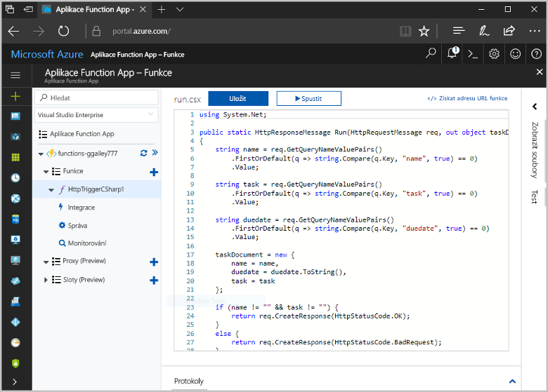
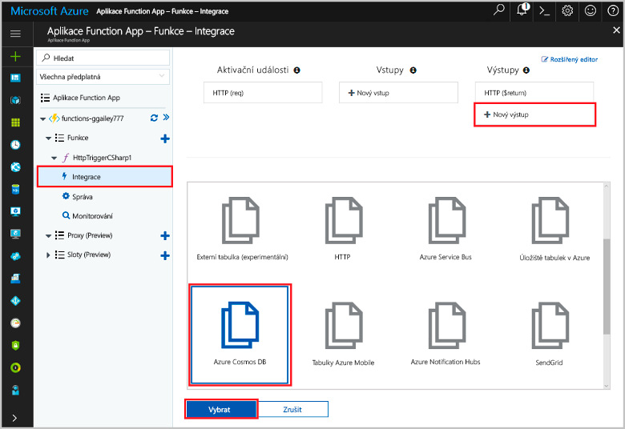
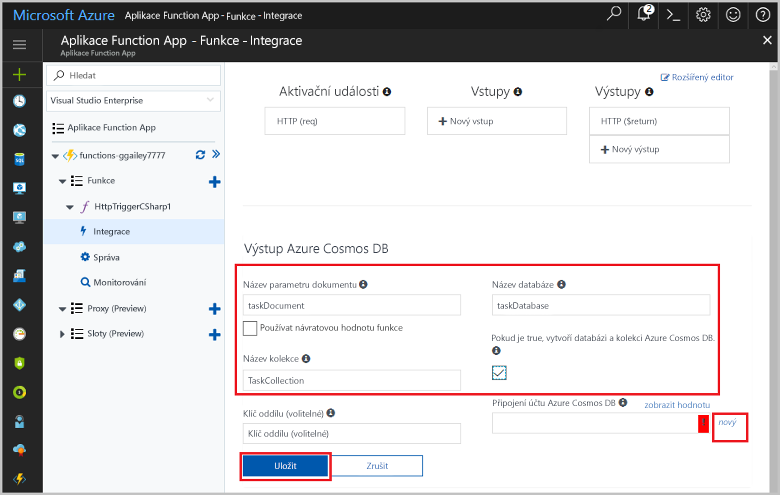
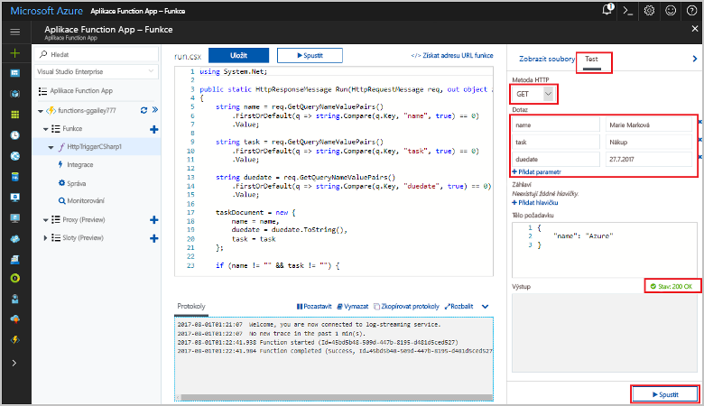
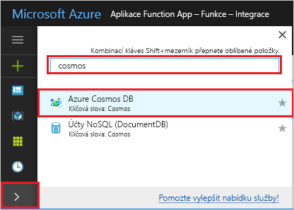
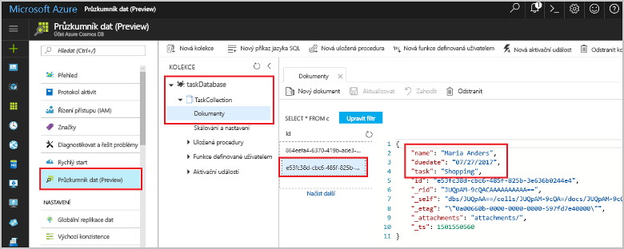

# <a name="store-unstructured-data-using-azure-functions-and-cosmos-db"></a>Ukládání nestrukturovaných dat pomocí Azure Functions a databáze Cosmos DB

[Azure Cosmos DB](https://azure.microsoft.com/services/cosmos-db/) je skvělým způsobem toostore nestrukturovaných a JSON data. Spolu s Azure Functions urychluje a zjednodušuje ukládání dat – ve srovnání s ukládáním dat v relační databáze budete potřebovat méně kódování.

V Azure Functions poskytují vstupní a výstupní vazby dat deklarativní způsob tooconnect tooexternal služby z funkce. V tomto tématu se dozvíte, jak tooupdate existující C# fungovat tooadd vazbu výstup, která ukládá Nestrukturovaná data v dokumentu Cosmos DB. 



## <a name="prerequisites"></a>Požadavky

toocomplete v tomto kurzu:

[!INCLUDE [Previous quickstart note](../../includes/functions-quickstart-previous-topics.md)]

## <a name="add-an-output-binding"></a>Přidání výstupní vazby

1. Rozbalte aplikaci Function App i funkci.

1. Vyberte **integrací** a **+ nový výstupní**, což je v hello top pravé části stránky hello. Zvolte **Azure Cosmos DB** a klikněte na **Vybrat**.

    

3. Použití hello **Azure Cosmos DB výstup** nastavení uvedeného v tabulce hello: 

    

    | Nastavení      | Navrhovaná hodnota  | Popis                                |
    | ------------ | ---------------- | ------------------------------------------ |
    | **Název parametru dokumentu** | taskDocument | Název, který odkazuje objekt Cosmos DB toohello v kódu. |
    | **Název databáze** | taskDatabase | Název databáze toosave dokumentů. |
    | **Název kolekce** | TaskCollection | Název kolekce databází Cosmos DB. |
    | **V případě hodnoty true vytvoří hello Cosmos DB databáze a kolekce.** | Zaškrtnuté | kolekce Hello již neexistuje, takže ho vytvořte. |

4. Vyberte **nový** další toohello **Cosmos DB dokumentu připojení** label a vyberte **+ vytvořit nový**. 

5. Použití hello **nový účet** nastavení uvedeného v tabulce hello: 

    

    | Nastavení      | Navrhovaná hodnota  | Popis                                |
    | ------------ | ---------------- | ------------------------------------------ |
    | **ID** | Název databáze | Jedinečné ID pro databázi Cosmos DB hello  |
    | **Rozhraní API** | SQL (DocumentDB) | Vyberte rozhraní API databáze hello dokumentu.  |
    | **Předplatné** | předplatné Azure | předplatné Azure  |
    | **Skupina prostředků** | myResourceGroup |  Použijte hello existující skupinu prostředků, která obsahuje aplikaci funkce. |
    | **Umístění**  | WestEurope | Vyberte umístění téměř tooeither aplikace funkce nebo tooother aplikace, které používají hello uložené dokumenty.  |

6. Klikněte na tlačítko **OK** toocreate hello databáze. To může trvat několik minut toocreate hello databáze. Po vytvoření databáze hello připojovací řetězec databáze hello je uložený jako funkce nastavení aplikace. Hello název tohoto nastavení aplikace je vložen do **účet připojení databáze Cosmos**. 
 
8. Po nastavení hello připojovací řetězec, vyberte **Uložit** toocreate hello vazby.

## <a name="update-hello-function-code"></a>Aktualizovat kód funkce hello

Nahraďte hello existující kód C# funkce hello následující kód:

```csharp
using System.Net;

public static HttpResponseMessage Run(HttpRequestMessage req, out object taskDocument, TraceWriter log)
{
    string name = req.GetQueryNameValuePairs()
        .FirstOrDefault(q => string.Compare(q.Key, "name", true) == 0)
        .Value;

    string task = req.GetQueryNameValuePairs()
        .FirstOrDefault(q => string.Compare(q.Key, "task", true) == 0)
        .Value;

    string duedate = req.GetQueryNameValuePairs()
        .FirstOrDefault(q => string.Compare(q.Key, "duedate", true) == 0)
        .Value;

    taskDocument = new {
        name = name,
        duedate = duedate.ToString(),
        task = task
    };

    if (name != "" && task != "") {
        return req.CreateResponse(HttpStatusCode.OK);
    }
    else {
        return req.CreateResponse(HttpStatusCode.BadRequest);
    }
}

```
Tato ukázka kódu přečte hello požadavek HTTP řetězců dotazů a přiřadí je toofields v hello `taskDocument` objektu. Hello `taskDocument` vazby odešle data objektu hello z této vazby parametru toobe uložené v databázi dokumentů vázané hello. Hello databáze byla vytvořena hello při prvním spuštění funkce hello.

## <a name="test-hello-function-and-database"></a>Test hello funkce a databáze

1. Rozbalte okno správné hello a vyberte **Test**. V části **dotazu**, klikněte na tlačítko **+ přidat parametr** a přidejte následující parametry řetězce dotazu toohello hello:

    + `name`
    + `task`
    + `duedate`

2. Klikněte na **Spustit** a ověřte, že se vrátí stavový kód 200.

    

1. Na levé straně hello portál Azure hello, rozbalte položku panelu ikonu hello, typ `cosmos` v hello vyhledávání pole a vyberte **Azure Cosmos DB**.

    

2. Vyberte hello databáze, které jste vytvořili, pak vyberte **Průzkumníku dat**. Rozbalte hello **kolekce** uzly, vyberte nový dokument hello a potvrďte, že hello dokument obsahuje vaše hodnoty řetězců dotazu, společně s některá další metadata. 

    

Úspěšně jste přidali aktivační událost HTTP tooyour vazby, která ukládá Nestrukturovaná data v databázi Cosmos DB.

[!INCLUDE [Clean-up section](../../includes/clean-up-section-portal.md)]

## <a name="next-steps"></a>Další kroky

[!INCLUDE [functions-quickstart-next-steps](../../includes/functions-quickstart-next-steps.md)]

Další informace o databázi Cosmos DB tooa vazby najdete v tématu [Azure funkce Cosmos DB vazby](functions-bindings-documentdb.md).
