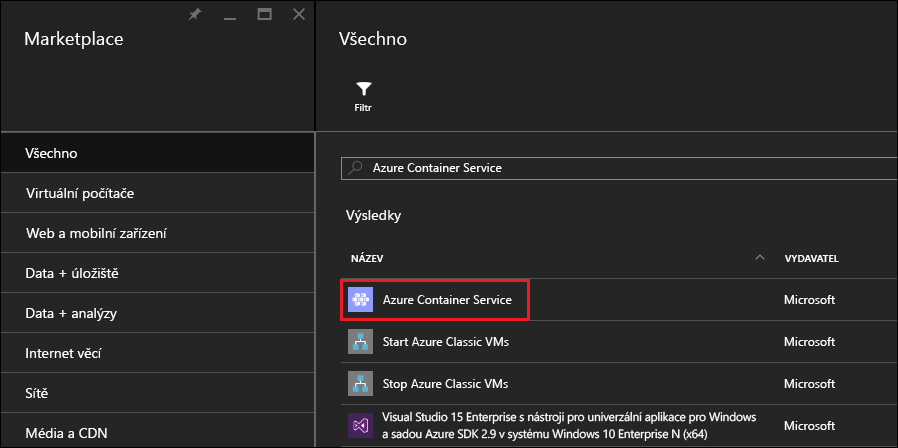
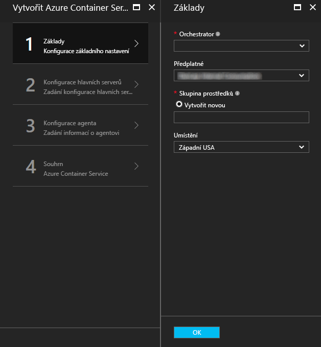
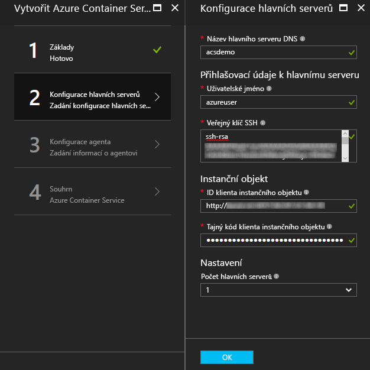
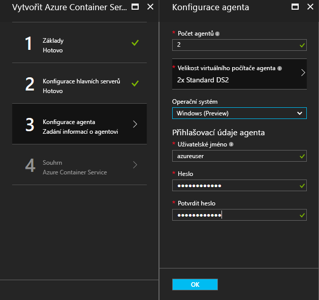
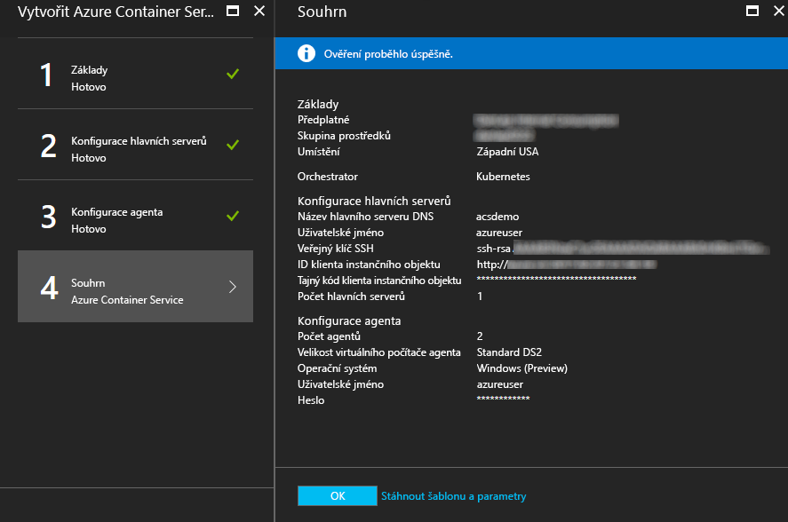
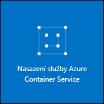

# <a name="deploy-a-docker-container-hosting-solution-using-hello-azure-portal"></a>Nasazení řešení pomocí portálu Azure hello hostování kontejner Docker


Azure Container Service umožňuje rychlé nasazení oblíbených open-source řešení pro clustering a orchestraci kontejnerů. Tento dokument vás provede nasazením clusteru Azure Container Service pomocí hello portál Azure nebo rychlý start šablonu Azure Resource Manager. 

Můžete také nasazení clusteru Azure Container Service pomocí hello [Azure CLI 2.0](container-service-create-acs-cluster-cli.md) nebo hello rozhraní API Správce Azure Container Service.

Související informace najdete v tématu [Úvod do služby Azure Container Service](../container-service-intro.md).


## <a name="prerequisites"></a>Požadavky

* **Předplatné Azure:** Pokud žádné nemáte, můžete se zaregistrovat k [bezplatné zkušební verzi](http://azure.microsoft.com/pricing/free-trial/?WT.mc_id=AA4C1C935). Pro větší cluster zvažte předplatné s průběžnými platbami nebo jiné možnosti nákupu.

    > [!NOTE]
    > Využití vašeho předplatného Azure a [kvótou prostředků](../../azure-subscription-service-limits.md), jako je například kvóty jader, můžete omezit hello velikost clusteru hello nasazení. toorequest zvýšení kvóty, otevřete [žádost o podporu online zákazníka](../../azure-supportability/how-to-create-azure-support-request.md) zdarma.
    >

* **Veřejný klíč SSH RSA**: Pokud nasazujete prostřednictvím portálu hello nebo jeden z šablony Azure rychlý start hello, potřebujete tooprovide hello veřejný klíč pro ověřování před virtuálními počítači Azure Container Service. toocreate klíče RSA Secure Shell (SSH), najdete v části hello [OS X a Linux](../../virtual-machines/linux/mac-create-ssh-keys.md) nebo [Windows](../../virtual-machines/linux/ssh-from-windows.md) pokyny. 

* **Služba ID objektu zabezpečení klienta a tajný klíč** (pouze Kubernetes): Další informace a pokyny toocreate objektu služby Azure Active Directory, naleznete v části [o hello instanční objekt pro cluster s podporou Kubernetes](../kubernetes/container-service-kubernetes-service-principal.md).


## <a name="create-a-cluster-by-using-hello-azure-portal"></a>Vytvoření clusteru pomocí hello portálu Azure
1. Vyberte přihlašovací toohello portál Azure, **nový**a hledání hello Azure Marketplace pro **Azure Container Service**.

      <br />

2. Klikněte na **Azure Container Service** a potom na **Vytvořit**.

3. Na hello **Základy** okno, zadejte hello následující informace:

    * **Orchestrator**: vyberte jednu z hello kontejneru orchestrators toodeploy v clusteru hello.
        * **DC/OS:** Nasadí cluster DC/OS.
        * **Swarm:** Nasadí cluster Docker Swarm.
        * **Kubernetes**: Nasadí cluster Kubernetes.
    * **Předplatné:** Vyberte předplatné Azure.
    * **Skupina prostředků**: Zadejte název hello novou skupinu prostředků pro nasazení hello.
    * **Umístění**: Vyberte oblast Azure pro nasazení Azure Container Service hello. Informace o dostupnosti najdete v tématu [Dostupné produkty v jednotlivých oblastech](https://azure.microsoft.com/regions/services/).
    
      <br />
    
    Klikněte na tlačítko **OK** po tooproceed připraven.

4. Na hello **hlavní konfigurace** okno, zadejte následující nastavení pro hlavní uzel hello Linux nebo uzly v clusteru hello (některá nastavení jsou konkrétní tooeach orchestrator) hello:

    * **Název DNS hlavní**: toocreate Předpona použitá hello jedinečný plně kvalifikovaný název domény (FQDN) pro hlavní server hello. Hello hlavní plně kvalifikovaný název domény má podobu hello *předponu*správu*umístění*. cloudapp.azure.com.
    * **Uživatelské jméno**: hello uživatelské jméno pro účet na všech virtuálních počítačů Linux hello v clusteru hello.
    * **Veřejný klíč SSH RSA**: přidejte veřejný klíč toobe hello používá k ověřování pro virtuální počítače s Linuxem hello. Je důležité, aby tento klíč neobsahoval žádné konce řádků a obsahuje hello `ssh-rsa` předponu. Hello `username@domain` operátory je volitelný. Hello klíč by měl vypadat podobně jako následující hello: **ssh-rsa AAAAB3Nz... <>...... UcyupgH azureuser@linuxvm** . 
    * **Instanční objekt**: Pokud jste vybrali hello Kubernetes orchestrator, zadejte Azure Active Directory **služby ID objektu zabezpečení klienta** (také nazývané hello appId) a **služby hlavní tajný klíč klienta pro** (heslo). Další informace najdete v tématu [o hello instanční objekt pro cluster s podporou Kubernetes](../kubernetes/container-service-kubernetes-service-principal.md).
    * **Hlavní počet**: počet hlavních serverů v clusteru hello hello.
    * **Diagnostika virtuálních počítačů**: pro některé orchestrators, můžete povolit Diagnostika virtuálních počítačů na hello hlavních serverů.

      <br />

    Klikněte na tlačítko **OK** po tooproceed připraven.

5. Na hello **konfigurace agenta** okno, zadejte hello následující informace:

    * **Počet agentů**: pro Docker Swarm a Kubernetes, tato hodnota je počáteční počet agentů v sadě škálování agentů hello hello. Pro DC/OS je počáteční počet agentů v privátní sadě škálování hello. Kromě toho se pro DC/OS vytvoří škálovací sada obsahující předem určený počet agentů. Hello počet agentů v této veřejné sadě škálování je dáno hello počet hlavních serverů v clusteru hello: jeden veřejný agent pro jeden z nich a dvě veřejné agentů pro tři nebo pět hlavních serverů.
    * **Velikost virtuálního počítače Agent**: hello velikost hello agenta virtuálních počítačů.
    * **Operační systém**: Toto nastavení je aktuálně k dispozici pouze v případě, že jste vybrali hello Kubernetes orchestrator. Zvolte distribuční Linux nebo toorun operační systém Windows Server na agentech hello. Toto nastavení určuje, jestli v clusteru bude možné spouštět aplikace typu kontejner Linux nebo Windows. 

        > [!NOTE]
        > Podpora kontejnerů Windows je pro clustery Kubernetes ve verzi Preview. V clusterech DC/OS a Swarm jsou v současné době ve službě Azure Container Service podporováni pouze linuxoví agenti.

    * **Přihlašovací údaje agenta**: Pokud jste vybrali operační systém Windows hello, zadejte správce **uživatelské jméno** a **heslo** pro agenta hello virtuálních počítačů. 

      <br />

    Klikněte na tlačítko **OK** po tooproceed připraven.

6. Až se dokončí ověření služby, klikněte na **OK**.

      <br />

7. Přečtěte si podmínky hello. proces nasazení hello toostart, klikněte na tlačítko **vytvořit**.

    Pokud jste zvolen toopin hello nasazení toohello portálu Azure, uvidíte stav nasazení hello.

      <br />

nasazení Hello trvá několik minut toocomplete. Potom clusteru Azure Container Service hello je připravený k použití.


## <a name="create-a-cluster-by-using-a-quickstart-template"></a>Vytvoření clusteru pomocí šablony pro rychlý start
Šablony Azure rychlý Start jsou k dispozici toodeploy cluster Azure Container Service. Hello, pokud šablony rychlý start může být upravený tooinclude další nebo pokročilá konfigurace Azure. toocreate clusteru Azure Container Service pomocí šablony Azure rychlý start, potřebujete předplatné Azure. Pokud žádné nemáte, můžete se zaregistrovat k [bezplatné zkušební verzi](http://azure.microsoft.com/pricing/free-trial/?WT.mc_id=AA4C1C935). 

Postupujte podle těchto kroků toodeploy clusteru pomocí šablony a hello 2.0 rozhraní příkazového řádku Azure (viz [pokyny k instalaci a instalaci](/cli/azure/install-az-cli2)).

> [!NOTE] 
> Pokud jste v systému Windows, můžete použít podobné kroky toodeploy šablonu pomocí Azure PowerShell. Postup najdete dál v této části. Můžete taky nasadit šablonu prostřednictvím hello [portál](../../azure-resource-manager/resource-group-template-deploy-portal.md) nebo jiné metody.

1. toodeploy cluster DC/OS, Docker Swarm nebo Kubernetes, vyberte jednu z hello k dispozici rychlý start šablony z Githubu. Následuje dílčí seznam. Hello DC/OS a Swarm šablony jsou hello stejné, s výjimkou hello výchozí orchestrator výběr.

    * [Šablona DC/OS](https://github.com/Azure/azure-quickstart-templates/tree/master/101-acs-dcos)
    * [Šablona Swarm](https://github.com/Azure/azure-quickstart-templates/tree/master/101-acs-swarm)
    * [Šablona Kubernetes](https://github.com/Azure/azure-quickstart-templates/tree/master/101-acs-kubernetes)

2. Přihlaste se tooyour účet Azure (`az login`) a ujistěte se, že hello rozhraní příkazového řádku Azure je připojený tooyour předplatného Azure. Hello výchozí předplatné můžete zobrazit pomocí hello následující příkaz:

    ```azurecli
    az account show
    ```
    
    Pokud máte více než jeden odběr a nutnosti tooset různé výchozí předplatné, spusťte `az account set --subscription` a zadejte název nebo ID odběru hello.

3. Jako osvědčený postup použijte pro nasazení hello novou skupinu prostředků. toocreate skupinu prostředků použijte hello `az group create` příkaz zadejte název skupiny prostředků a umístění: 

    ```azurecli
    az group create --name "RESOURCE_GROUP" --location "LOCATION"
    ```

4. Vytvořte soubor obsahující hello požadované šablonu JSON parametry. Stažení hello parametry soubor s názvem `azuredeploy.parameters.json` doprovodný šablony Azure Container Service hello `azuredeploy.json` v Githubu. Zadejte požadované hodnoty parametrů pro váš cluster. 

    Například toouse hello [šablona DC/OS](https://github.com/Azure/azure-quickstart-templates/tree/master/101-acs-dcos), zadejte hodnoty parametrů pro `dnsNamePrefix` a `sshRSAPublicKey`. V tématu hello popis v `azuredeploy.json` a možnosti pro další parametry.  
 

5. Vytvořit cluster Container Service pomocí předání soubor parametrů nasazení hello s hello následující příkaz, kde:

    * **RESOURCE_GROUP** je hello název skupiny prostředků hello, který jste vytvořili v předchozím kroku hello.
    * **DEPLOYMENT_NAME** (volitelné) je název poskytnout toohello nasazení.
    * **TEMPLATE_URI** je hello umístění souboru nasazení hello `azuredeploy.json`. Tento identifikátor URI musí být soubor Raw hello, ne to ukazatel toohello uživatelského rozhraní Githubu. toofind tento identifikátor URI, vyberte hello `azuredeploy.json` souboru v Githubu a klikněte na tlačítko hello **Raw** tlačítko.  

    ```azurecli
    az group deployment create -g RESOURCE_GROUP -n DEPLOYMENT_NAME --template-uri TEMPLATE_URI --parameters @azuredeploy.parameters.json
    ```

    Parametry můžete zadat taky jako řetězec formátu JSON na příkazovém řádku hello. Použijte podobné toohello následující příkaz:

    ```azurecli
    az group deployment create -g RESOURCE_GROUP -n DEPLOYMENT_NAME --template-uri TEMPLATE_URI --parameters "{ \"param1\": {\"value1\"} … }"
    ```

    > [!NOTE]
    > nasazení Hello trvá několik minut toocomplete.
    > 

### <a name="equivalent-powershell-commands"></a>Ekvivalentní příkazy PowerShellu
Šablonu clusteru Azure Container Service můžete také nasadit v PowerShellu. Tento dokument je založen na hello verze 1.0 [modul Azure PowerShell](https://azure.microsoft.com/blog/azps-1-0/).

1. toodeploy cluster DC/OS, Docker Swarm nebo Kubernetes, vyberte jednu z hello k dispozici rychlý start šablony z Githubu. Následuje dílčí seznam. Všimněte si, že hello DC/OS a Swarm šablony jsou hello stejné, s výjimkou hello hello výchozí orchestrator výběr.

    * [Šablona DC/OS](https://github.com/Azure/azure-quickstart-templates/tree/master/101-acs-dcos)
    * [Šablona Swarm](https://github.com/Azure/azure-quickstart-templates/tree/master/101-acs-swarm)
    * [Šablona Kubernetes](https://github.com/Azure/azure-quickstart-templates/tree/master/101-acs-kubernetes)

2. Před vytvořením clusteru v rámci vašeho předplatného Azure, ověřte, že relace prostředí PowerShell je přihlášena tooAzure. To lze provést pomocí hello `Get-AzureRMSubscription` příkaz:

    ```powershell
    Get-AzureRmSubscription
    ```

3. Pokud potřebujete toosign v tooAzure, použijte hello `Login-AzureRMAccount` příkaz:

    ```powershell
    Login-AzureRmAccount
    ```

4. Jako osvědčený postup použijte pro nasazení hello novou skupinu prostředků. toocreate skupinu prostředků použijte hello `New-AzureRmResourceGroup` příkaz a zadejte oblast název a cíl skupiny prostředků:

    ```powershell
    New-AzureRmResourceGroup -Name GROUP_NAME -Location REGION
    ```

5. Po vytvoření skupiny prostředků, můžete vytvořit cluster s hello následující příkaz. Hello URI hello potřeby je zadaná šablona s hello `-TemplateUri` parametr. Při spuštění tohoto příkazu vás PowerShell vyzve k zadání hodnot parametrů nasazení.

    ```powershell
    New-AzureRmResourceGroupDeployment -Name DEPLOYMENT_NAME -ResourceGroupName RESOURCE_GROUP_NAME -TemplateUri TEMPLATE_URI
    ```

#### <a name="provide-template-parameters"></a>Zadání parametrů šablony
Pokud jste obeznámeni s prostředím PowerShell, víte, že můžete přepínat mezi hello dostupné parametry rutiny zadáním znaménka minus (-) a stisknutím klávesy tabulátor hello. Stejně to funguje i při práci s parametry, které definujete v šabloně. Jakmile zadáte název šablony hello, hello rutina načte šablonu hello, analyzuje hello parametrů a dynamicky přidá příkaz toohello parametry šablony hello. Díky tomu hodnot parametrů šablony snadno toospecify hello. A pokud zapomenete hodnotu požadovaného parametru, prostředí PowerShell vás vyzve k zadání hodnoty hello.

Zde je celý příkaz hello i s vloženými parametry. Zadejte vlastní hodnoty pro názvy hello hello prostředků.

```powershell
New-AzureRmResourceGroupDeployment -ResourceGroupName RESOURCE_GROUP_NAME-TemplateURI TEMPLATE_URI -adminuser value1 -adminpassword value2 ....
```

## <a name="next-steps"></a>Další kroky
Nyní když máte funkční cluster, nahlédněte do těchto dokumentů, kde naleznete podrobnosti týkající se připojení a správy:

* [Připojení clusteru Azure Container Service tooan](../container-service-connect.md)
* [Práce se službou Azure Container Service a DC/OS](container-service-mesos-marathon-rest.md)
* [Práce se službou Azure Container Service a nástrojem Docker Swarm](container-service-docker-swarm.md)
* [Práce s Azure Container Service a Kubernetes](../kubernetes/container-service-kubernetes-walkthrough.md)
