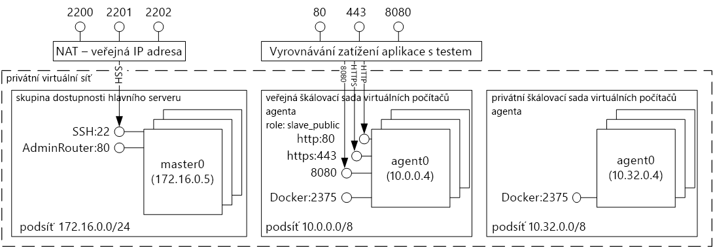
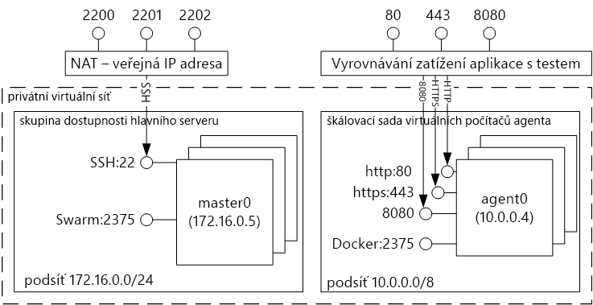
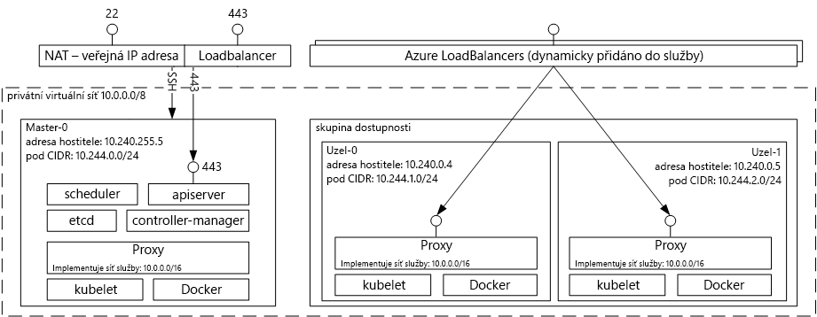

# Kontejner tooDocker Úvod hostování řešení s Azure Container ServiceIntroduction tooDocker container hosting solutions with Azure Container Service 
Azure Container Service umožňuje jednodušší pro vás toocreate, konfigurovat a spravovat cluster virtuálních počítačů, které jsou předkonfigurované toorun kontejnerizované aplikace.Azure Container Service makes it simpler for you toocreate, configure, and manage a cluster of virtual machines that are preconfigured toorun containerized applications. Používá optimalizovanou konfiguraci oblíbených nástrojů open source pro plánování a orchestraci.It uses an optimized configuration of popular open-source scheduling and orchestration tools. To umožňuje vám toouse existujících dovedností, nebo kreslení na text velké a stále se rozrůstající komunita odborných znalostí, toodeploy a spravovat aplikace založené na kontejneru v Microsoft Azure.This enables you toouse your existing skills, or draw upon a large and growing body of community expertise, toodeploy and manage container-based applications on Microsoft Azure.

Azure Container Service využívá hello Docker kontejneru formátu tooensure, že jsou vaše kontejnery aplikace plně přenositelné.Azure Container Service leverages hello Docker container format tooensure that your application containers are fully portable. Také podporuje vaši volbu Marathon a DC/OS, Docker Swarm nebo Kubernetes tak, aby tyto aplikace toothousands kontejnerů nebo i desetitisíce můžete škálovat.It also supports your choice of Marathon and DC/OS, Docker Swarm, or Kubernetes so that you can scale these applications toothousands of containers, or even tens of thousands.

Pomocí Azure Container Service můžete využít výhod podnikové úrovni funkce Azure, a současně se zachovává aplikace přenositelnost – včetně přenositelnost u vrstvy orchestration hello.By using Azure Container Service, you can take advantage of the enterprise-grade features of Azure, while still maintaining application portability--including portability at hello orchestration layers.

## Používání služby Azure Container ServiceUsing Azure Container Service
Naším cílem s Azure Container Service je tooprovide kontejneru hostitelské prostředí pomocí nástroje open source a technologie, které jsou dnes důležitá u našich zákazníků.Our goal with Azure Container Service is tooprovide a container hosting environment by using open-source tools and technologies that are popular among our customers today. toothis end zveřejňujeme hello standardních koncových bodů rozhraní API pro vaši zvolenou orchestrator (DC/OS, Docker Swarm nebo Kubernetes).toothis end, we expose hello standard API endpoints for your chosen orchestrator (DC/OS, Docker Swarm, or Kubernetes). Pomocí těchto koncových bodů, můžete využít veškerý software, který je schopen rozhovoru toothose koncové body.By using these endpoints, you can leverage any software that is capable of talking toothose endpoints. Například v případě hello hello Docker Swarm koncového bodu, můžete zvolit rozhraní příkazového řádku Dockeru hello toouse (CLI).For example, in hello case of hello Docker Swarm endpoint, you might choose toouse hello Docker command-line interface (CLI). Pro DC/OS můžete zvolit hello orchestrátoru DC/OS rozhraní příkazového řádku.For DC/OS, you might choose hello DCOS CLI. V případě systému Kubernetes můžete zvolit použití `kubectl`.For Kubernetes, you might choose `kubectl`.

## Vytvoření clusteru Dockeru s použitím služby Azure Container ServiceCreating a Docker cluster by using Azure Container Service
toobegin pomocí Azure Container Service, nasazení clusteru Azure Container Service přes portál hello (hledání hello Marketplace pro **Azure Container Service**), pomocí šablony Azure Resource Manager ([Docker Swarm](https://github.com/Azure/azure-quickstart-templates/tree/master/101-acs-swarm), [DC/OS](https://github.com/Azure/azure-quickstart-templates/tree/master/101-acs-dcos), nebo [Kubernetes](https://github.com/Azure/azure-quickstart-templates/tree/master/101-acs-kubernetes)), nebo s hello [Azure CLI 2.0](container-service-create-acs-cluster-cli.md).toobegin using Azure Container Service, you deploy an Azure Container Service cluster via hello portal (search hello Marketplace for **Azure Container Service**), by using an Azure Resource Manager template ([Docker Swarm](https://github.com/Azure/azure-quickstart-templates/tree/master/101-acs-swarm), [DC/OS](https://github.com/Azure/azure-quickstart-templates/tree/master/101-acs-dcos), or [Kubernetes](https://github.com/Azure/azure-quickstart-templates/tree/master/101-acs-kubernetes)), or with hello [Azure CLI 2.0](container-service-create-acs-cluster-cli.md). Hello, pokud šablony rychlý start může být upravený tooinclude další nebo pokročilá konfigurace Azure.hello provided quickstart templates can be modified tooinclude additional or advanced Azure configuration. Další informace najdete v části [Nasazení clusteru Azure Container Service](container-service-deployment.md).For more information, see [Deploy an Azure Container Service cluster](container-service-deployment.md).

## Nasazení aplikaceDeploying an application
Služba Azure Container Service poskytuje možnost orchestrace prostřednictvím Docker Swarmu, systému DC/OS nebo Kubernetes.Azure Container Service provides a choice of Docker Swarm, DC/OS, or Kubernetes for orchestration. Způsob nasazení aplikace závisí na zvoleném orchestrátoru.How you deploy your application depends on your choice of orchestrator.

### S použitím systému DC/OSUsing DC/OS
DC/OS je distribuované operačního systému podle hello Apache Mesos distribuovaných systémů jádra.DC/OS is a distributed operating system based on hello Apache Mesos distributed systems kernel. Apache Mesos je umístěna v hello Apache Software Foundation a jsou uvedeny některé hello [největších názvy v IT](http://mesos.apache.org/documentation/latest/powered-by-mesos/) uživatelů a přispěvatele.Apache Mesos is housed at hello Apache Software Foundation and lists some of hello [biggest names in IT](http://mesos.apache.org/documentation/latest/powered-by-mesos/) as users and contributors.

Systém DC/OS a Apache Mesos zahrnují rozsáhlou nabídku funkcí:DC/OS and Apache Mesos include an impressive feature set:

* Ověřená škálovatelnostProven scalability
* Replikované nadřízené a podřízené servery odolné proti chybám s použitím Apache ZooKeeperFault-tolerant replicated master and slaves using Apache ZooKeeper
* Podpora kontejnerů ve formátu DockeruSupport for Docker-formatted containers
* Nativní izolace mezi úkoly s kontejnery LinuxuNative isolation between tasks with Linux containers
* Plánování s více prostředky (paměť, procesor, disk a porty)Multiresource scheduling (memory, CPU, disk, and ports)
* Rozhraní API jazyků Java, Python a C++ pro vývoj nových paralelních aplikacíJava, Python, and C++ APIs for developing new parallel applications
* Webové uživatelské rozhraní pro zobrazení stavu clusteruA web UI for viewing cluster state

Ve výchozím nastavení zahrnuje DC/OS spuštěné v Azure Container Service hello Marathon orchestration platforma pro plánování úloh.By default, DC/OS running on Azure Container Service includes hello Marathon orchestration platform for scheduling workloads. Součástí hello DC/OS nasazení služby ACS je však hello Mesosphere Universe služeb, které lze přidat tooyour služby.However, included with hello DC/OS deployment of ACS is hello Mesosphere Universe of services that can be added tooyour service. Mezi služby v hello Universe patří, Spark, systému Hadoop, Cassandra a mnoho dalšího.Services in hello Universe include Spark, Hadoop, Cassandra, and much more.

#### S použitím systému MarathonUsing Marathon
Marathonu je platné pro celý cluster init a systém správy pro služby v cgroups--nebo v případě hello Azure Container Service kontejnery formátované Dockerem.Marathon is a cluster-wide init and control system for services in cgroups--or, in hello case of Azure Container Service, Docker-formatted containers. Systém Marathon poskytuje webové uživatelské rozhraní, ze kterého můžete nasazovat své aplikace.Marathon provides a web UI from which you can deploy your applications. K dispozici je přístup prostřednictvím adresy URL, která vypadá přibližně takto: `http://DNS_PREFIX.REGION.cloudapp.azure.com` Proměnné DNS\_PREFIX a REGION se definují v době nasazení.You can access this at a URL that looks something like `http://DNS_PREFIX.REGION.cloudapp.azure.com` where DNS\_PREFIX and REGION are both defined at deployment time. Samozřejmě můžete také zadat vlastní název DNS.Of course, you can also provide your own DNS name. Další informace o spouštění kontejner pomocí webového uživatelského rozhraní Marathon hello najdete v tématu [DC/OS Správa kontejnerů prostřednictvím webového uživatelského rozhraní Marathon hello](container-service-mesos-marathon-ui.md).For more information on running a container using hello Marathon web UI, see [DC/OS container management through hello Marathon web UI](container-service-mesos-marathon-ui.md).

Můžete taky hello rozhraní REST API pro komunikaci pomocí Marathonu.You can also use hello REST APIs for communicating with Marathon. Existuje mnoho klientských knihoven, které jsou k dispozici pro jednotlivé nástroje.There are a number of client libraries that are available for each tool. Pokrývaly různých jazycích – a samozřejmě můžete použít protokol HTTP hello v libovolném jazyce.They cover a variety of languages--and, of course, you can use hello HTTP protocol in any language. Podporu pro systém Marathon navíc poskytuje mnoho oblíbených nástrojů DevOps.In addition, many popular DevOps tools provide support for Marathon. Díky tomu má váš provozní tým při práci s clusterem Azure Container Service k dispozici maximální flexibilitu.This provides maximum flexibility for your operations team when you are working with an Azure Container Service cluster. Další informace o spouštění kontejner pomocí hello Marathon REST API, najdete v části [DC/OS Správa kontejnerů přes rozhraní REST API Marathonu hello](container-service-mesos-marathon-rest.md).For more information on running a container by using hello Marathon REST API, see [DC/OS container management through hello Marathon REST API](container-service-mesos-marathon-rest.md).

### S použitím Docker SwarmuUsing Docker Swarm
Docker Swarm poskytuje nativní clustering pro Docker.Docker Swarm provides native clustering for Docker. Protože Docker Swarm poskytuje hello standardní Docker rozhraní API, jakýkoli nástroj, který již komunikuje s démon Docker můžete použít hostitele toomultiple škálování tootransparently Swarm v Azure Container Service.Because Docker Swarm serves hello standard Docker API, any tool that already communicates with a Docker daemon can use Swarm tootransparently scale toomultiple hosts on Azure Container Service.

[!INCLUDE [container-service-swarm-mode-note](../../../includes/container-service-swarm-mode-note.md)]

Podporované nástroje pro správu kontejnerů v clusteru Swarm zahrnovat, ale nejsou omezeny na hello následující:Supported tools for managing containers on a Swarm cluster include, but are not limited to, hello following:

* DokkuDokku
* Rozhraní příkazového řádku Dockeru a Docker ComposeDocker CLI and Docker Compose
* KraneKrane
* JenkinsJenkins

### S použitím KubernetesUsing Kubernetes
Kubernetes je často používaný opensourcový nástroj pro orchestraci kontejnerů na úrovni produkce.Kubernetes is a popular open-source, production-grade container orchestrator tool. Kubernetes automatizuje nasazení, škálování a správu kontejnerizovaných aplikací.Kubernetes automates deployment, scaling, and management of containerized applications. Protože je řešení open source a vycházejí z komunity hello open source, bezproblémově běží v Azure Container Service a může být použité toodeploy kontejnery škálované na Azure Container Service.Because it is an open-source solution and is driven by hello open-source community, it runs seamlessly on Azure Container Service and can be used toodeploy containers at scale on Azure Container Service.

Má bohatou výbavu funkcí, například:It has a rich set of features including:
* Horizontální škálováníHorizontal scaling
* Zjišťování služeb a vyrovnávání zatíženíService discovery and load balancing
* Správa tajných klíčů a konfiguraceSecrets and configuration management
* Automatická uvedení a vrácení zpět založená na rozhraní APIAPI-based automated rollouts and rollbacks
* SamoopraveníSelf-healing

## VideaVideos
Začínáme se službou Azure Container Service (101):Getting started with Azure Container Service (101):  

> [!VIDEO https://channel9.msdn.com/Shows/Azure-Friday/Azure-Container-Service-101/player]
>
>

Vytváření aplikací pomocí hello Azure Container Service (Build 2016)Building Applications Using hello Azure Container Service (Build 2016)

> [!VIDEO https://channel9.msdn.com/Events/Build/2016/B822/player]
>
>

## Další krokyNext steps

Nasazení clusteru služby kontejneru pomocí hello [portál](container-service-deployment.md) nebo [Azure CLI 2.0](container-service-create-acs-cluster-cli.md).Deploy a container service cluster using hello [portal](container-service-deployment.md) or [Azure CLI 2.0](container-service-create-acs-cluster-cli.md).
