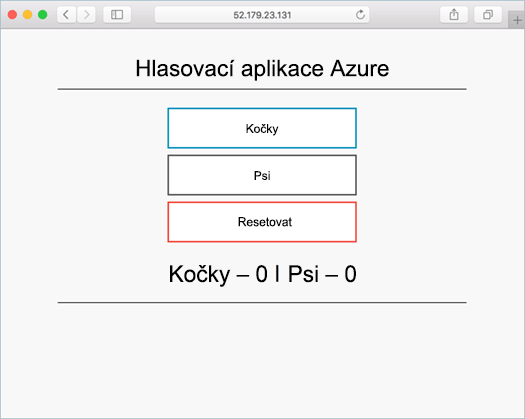

# <a name="deploy-docker-swarm-cluster"></a><span data-ttu-id="e40d5-103">Nasazení clusteru Docker Swarm</span><span class="sxs-lookup"><span data-stu-id="e40d5-103">Deploy Docker Swarm cluster</span></span>

<span data-ttu-id="e40d5-104">V této úvodní clusteru Docker Swarm je nasazená pomocí hello rozhraní příkazového řádku Azure.</span><span class="sxs-lookup"><span data-stu-id="e40d5-104">In this quick start, a Docker Swarm cluster is deployed using hello Azure CLI.</span></span> <span data-ttu-id="e40d5-105">Aplikace více kontejneru, který se skládá z webového front-endu a instanci Redis nasazení a poté běží na clusteru hello.</span><span class="sxs-lookup"><span data-stu-id="e40d5-105">A multi-container application consisting of web front end and a Redis instance is then deployed and run on hello cluster.</span></span> <span data-ttu-id="e40d5-106">Po dokončení aplikace hello je přístupné prostřednictvím Internetu hello.</span><span class="sxs-lookup"><span data-stu-id="e40d5-106">Once completed, hello application is accessible over hello internet.</span></span>

<span data-ttu-id="e40d5-107">Pokud ještě nemáte předplatné Azure, vytvořte si [bezplatný účet](https://azure.microsoft.com/free/?WT.mc_id=A261C142F) před tím, než začnete.</span><span class="sxs-lookup"><span data-stu-id="e40d5-107">If you don't have an Azure subscription, create a [free account](https://azure.microsoft.com/free/?WT.mc_id=A261C142F) before you begin.</span></span>

<span data-ttu-id="e40d5-108">Tento rychlý start vyžaduje, že používáte verzi rozhraní příkazového řádku Azure hello verze 2.0.4 nebo novější.</span><span class="sxs-lookup"><span data-stu-id="e40d5-108">This quickstart requires that you are running hello Azure CLI version 2.0.4 or later.</span></span> <span data-ttu-id="e40d5-109">Spustit `az --version` toofind hello verze.</span><span class="sxs-lookup"><span data-stu-id="e40d5-109">Run `az --version` toofind hello version.</span></span> <span data-ttu-id="e40d5-110">Pokud potřebujete tooinstall nebo aktualizace, přečtěte si [nainstalovat Azure CLI 2.0]( /cli/azure/install-azure-cli).</span><span class="sxs-lookup"><span data-stu-id="e40d5-110">If you need tooinstall or upgrade, see [Install Azure CLI 2.0]( /cli/azure/install-azure-cli).</span></span>

## <a name="create-a-resource-group"></a><span data-ttu-id="e40d5-111">Vytvoření skupiny prostředků</span><span class="sxs-lookup"><span data-stu-id="e40d5-111">Create a resource group</span></span>

<span data-ttu-id="e40d5-112">Vytvořte skupinu prostředků s hello [vytvořit skupinu az](/cli/azure/group#create) příkaz.</span><span class="sxs-lookup"><span data-stu-id="e40d5-112">Create a resource group with hello [az group create](/cli/azure/group#create) command.</span></span> <span data-ttu-id="e40d5-113">Skupina prostředků Azure je logická skupina, ve které se nasazují a spravují prostředky Azure.</span><span class="sxs-lookup"><span data-stu-id="e40d5-113">An Azure resource group is a logical group in which Azure resources are deployed and managed.</span></span>

<span data-ttu-id="e40d5-114">Hello následující příklad vytvoří skupinu prostředků s názvem *myResourceGroup* v hello *westus* umístění.</span><span class="sxs-lookup"><span data-stu-id="e40d5-114">hello following example creates a resource group named *myResourceGroup* in hello *westus* location.</span></span>

```azurecli-interactive
az group create --name myResourceGroup --location westus
```

<span data-ttu-id="e40d5-115">Výstup:</span><span class="sxs-lookup"><span data-stu-id="e40d5-115">Output:</span></span>

```json
{
  "id": "/subscriptions/00000000-0000-0000-0000-000000000000/resourceGroups/myResourceGroup",
  "location": "westcentralus",
  "managedBy": null,
  "name": "myResourceGroup",
  "properties": {
    "provisioningState": "Succeeded"
  },
  "tags": null
}
```

## <a name="create-docker-swarm-cluster"></a><span data-ttu-id="e40d5-116">Vytvoření clusteru Docker Swarm</span><span class="sxs-lookup"><span data-stu-id="e40d5-116">Create Docker Swarm cluster</span></span>

<span data-ttu-id="e40d5-117">Vytvoření clusteru Docker Swarm v Azure Container Service s hello [vytvořit acs az](/cli/azure/acs#create) příkaz.</span><span class="sxs-lookup"><span data-stu-id="e40d5-117">Create a Docker Swarm cluster in Azure Container Service with hello [az acs create](/cli/azure/acs#create) command.</span></span> 

<span data-ttu-id="e40d5-118">Hello následující příklad vytvoří cluster s názvem *mySwarmCluster* s Linuxem jeden hlavní uzel a tři uzly Linux agent.</span><span class="sxs-lookup"><span data-stu-id="e40d5-118">hello following example creates a cluster named *mySwarmCluster* with one Linux master node and three Linux agent nodes.</span></span>

```azurecli-interactive
az acs create --name mySwarmCluster --orchestrator-type Swarm --resource-group myResourceGroup --generate-ssh-keys
```

<span data-ttu-id="e40d5-119">Po několika minutách hello příkaz dokončí a vrátí formátu json informace o clusteru hello.</span><span class="sxs-lookup"><span data-stu-id="e40d5-119">After several minutes, hello command completes and returns json formatted information about hello cluster.</span></span>

## <a name="connect-toohello-cluster"></a><span data-ttu-id="e40d5-120">Připojte toohello cluster</span><span class="sxs-lookup"><span data-stu-id="e40d5-120">Connect toohello cluster</span></span>

<span data-ttu-id="e40d5-121">V rámci této úvodní potřebujete adresu IP hello hello Docker Swarm hlavní a hello Docker agenta fondu.</span><span class="sxs-lookup"><span data-stu-id="e40d5-121">Throughout this quick start, you need hello IP address of both hello Docker Swarm master and hello Docker agent pool.</span></span> <span data-ttu-id="e40d5-122">Spusťte následující příkaz tooreturn hello obě IP adresy.</span><span class="sxs-lookup"><span data-stu-id="e40d5-122">Run hello following command tooreturn both IP addresses.</span></span>


```bash
az network public-ip list --resource-group myResourceGroup --query '[*].{Name:name,IPAddress:ipAddress}' -o table
```

<span data-ttu-id="e40d5-123">Výstup:</span><span class="sxs-lookup"><span data-stu-id="e40d5-123">Output:</span></span>

```bash
Name                                                                 IPAddress
-------------------------------------------------------------------  -------------
swarmm-agent-ip-myswarmcluster-myresourcegroup-d5b9d4agent-66066781  52.179.23.131
swarmm-master-ip-myswarmcluster-myresourcegroup-d5b9d4mgmt-66066781  52.141.37.199
```

<span data-ttu-id="e40d5-124">Vytvořte hlavní Swarm toohello tunelového propojení SSH.</span><span class="sxs-lookup"><span data-stu-id="e40d5-124">Create an SSH tunnel toohello Swarm master.</span></span> <span data-ttu-id="e40d5-125">Nahraďte `IPAddress` s IP adresou hello hello Swarm hlavního serveru.</span><span class="sxs-lookup"><span data-stu-id="e40d5-125">Replace `IPAddress` with hello IP address of hello Swarm master.</span></span>

```bash
ssh -p 2200 -fNL 2375:localhost:2375 azureuser@IPAddress
```

<span data-ttu-id="e40d5-126">Sada hello `DOCKER_HOST` proměnné prostředí.</span><span class="sxs-lookup"><span data-stu-id="e40d5-126">Set hello `DOCKER_HOST` environment variable.</span></span> <span data-ttu-id="e40d5-127">To vám umožní toorun docker příkazy proti hello Docker Swarm bez nutnosti toospecify hello název hostitele hello.</span><span class="sxs-lookup"><span data-stu-id="e40d5-127">This allows you toorun docker commands against hello Docker Swarm without having toospecify hello name of hello host.</span></span>

```bash
export DOCKER_HOST=:2375
```

<span data-ttu-id="e40d5-128">Nyní je připraven toorun Docker služeb v hello Docker Swarm.</span><span class="sxs-lookup"><span data-stu-id="e40d5-128">You are now ready toorun Docker services on hello Docker Swarm.</span></span>


## <a name="run-hello-application"></a><span data-ttu-id="e40d5-129">Spuštění aplikace hello</span><span class="sxs-lookup"><span data-stu-id="e40d5-129">Run hello application</span></span>

<span data-ttu-id="e40d5-130">Vytvořte soubor s názvem `docker-compose.yaml` a kopírování hello do něj následující obsah.</span><span class="sxs-lookup"><span data-stu-id="e40d5-130">Create a file named `docker-compose.yaml` and copy hello following content into it.</span></span>

```yaml
version: '3'
services:
  azure-vote-back:
    image: redis
    container_name: azure-vote-back
    ports:
        - "6379:6379"

  azure-vote-front:
    image: microsoft/azure-vote-front:redis-v1
    container_name: azure-vote-front
    environment:
      REDIS: azure-vote-back
    ports:
        - "80:80"
```

<span data-ttu-id="e40d5-131">Spusťte následující příkaz toocreate hello Azure hlas služby hello.</span><span class="sxs-lookup"><span data-stu-id="e40d5-131">Run hello following command toocreate hello Azure Vote service.</span></span>

```bash
docker-compose up -d
```

<span data-ttu-id="e40d5-132">Výstup:</span><span class="sxs-lookup"><span data-stu-id="e40d5-132">Output:</span></span>

```bash
Creating network "user_default" with hello default driver
Pulling azure-vote-front (microsoft/azure-vote-front:redis-v1)...
swarm-agent-EE873B23000005: Pulling microsoft/azure-vote-front:redis-v1...
swarm-agent-EE873B23000004: Pulling microsoft/azure-vote-front:redis-v1... : downloaded
Pulling azure-vote-back (redis:latest)...
swarm-agent-EE873B23000004: Pulling redis:latest... : downloaded
Creating azure-vote-front ... 
Creating azure-vote-back ... 
Creating azure-vote-front
Creating azure-vote-back ...
```

## <a name="test-hello-application"></a><span data-ttu-id="e40d5-133">Testování aplikace hello</span><span class="sxs-lookup"><span data-stu-id="e40d5-133">Test hello application</span></span>

<span data-ttu-id="e40d5-134">Procházejte toohello IP adresu hello Swarm agenta fondu tootest si aplikaci Azure hlas hello.</span><span class="sxs-lookup"><span data-stu-id="e40d5-134">Browse toohello IP address of hello Swarm agent pool tootest out hello Azure Vote application.</span></span>



## <a name="delete-cluster"></a><span data-ttu-id="e40d5-136">Odstranění clusteru</span><span class="sxs-lookup"><span data-stu-id="e40d5-136">Delete cluster</span></span>
<span data-ttu-id="e40d5-137">Pokud hello cluster je již nepotřebujete, můžete použít hello [odstranění skupiny az](/cli/azure/group#delete) příkaz skupiny prostředků hello tooremove, container service a všechny související prostředky.</span><span class="sxs-lookup"><span data-stu-id="e40d5-137">When hello cluster is no longer needed, you can use hello [az group delete](/cli/azure/group#delete) command tooremove hello resource group, container service, and all related resources.</span></span>

```azurecli-interactive
az group delete --name myResourceGroup --yes --no-wait
```

## <a name="get-hello-code"></a><span data-ttu-id="e40d5-138">Získat kód hello</span><span class="sxs-lookup"><span data-stu-id="e40d5-138">Get hello code</span></span>

<span data-ttu-id="e40d5-139">V této úvodní předem vytvořené kontejneru bitové kopie byly použité toocreate Docker služby.</span><span class="sxs-lookup"><span data-stu-id="e40d5-139">In this quick start, pre-created container images have been used toocreate a Docker service.</span></span> <span data-ttu-id="e40d5-140">Hello související s kódu aplikace, soubor Docker, a soubor vytvářené jsou dostupné na Githubu.</span><span class="sxs-lookup"><span data-stu-id="e40d5-140">hello related application code, Dockerfile, and Compose file are available on GitHub.</span></span>

[<span data-ttu-id="e40d5-141">https://github.com/Azure-Samples/azure-voting-app-redis</span><span class="sxs-lookup"><span data-stu-id="e40d5-141">https://github.com/Azure-Samples/azure-voting-app-redis</span></span>](https://github.com/Azure-Samples/azure-voting-app-redis.git)

## <a name="next-steps"></a><span data-ttu-id="e40d5-142">Další kroky</span><span class="sxs-lookup"><span data-stu-id="e40d5-142">Next steps</span></span>

<span data-ttu-id="e40d5-143">V této úvodní nasazení clusteru Docker Swarm a nasadit aplikace s více kontejnerů tooit.</span><span class="sxs-lookup"><span data-stu-id="e40d5-143">In this quick start, you deployed a Docker Swarm cluster and deployed a multi-container application tooit.</span></span>

<span data-ttu-id="e40d5-144">toolearn o Docker záložním integraci s Visual Studio Team Services, pokračovat toohello CI/CD s Docker Swarm a služby VSTS.</span><span class="sxs-lookup"><span data-stu-id="e40d5-144">toolearn about integrating Docker warm with Visual Studio Team Services, continue toohello CI/CD with Docker Swarm and VSTS.</span></span>

> [!div class="nextstepaction"]
> [<span data-ttu-id="e40d5-145">CI/CD s Docker Swarm a VSTS</span><span class="sxs-lookup"><span data-stu-id="e40d5-145">CI/CD with Docker Swarm and VSTS</span></span>](./container-service-docker-swarm-setup-ci-cd.md)