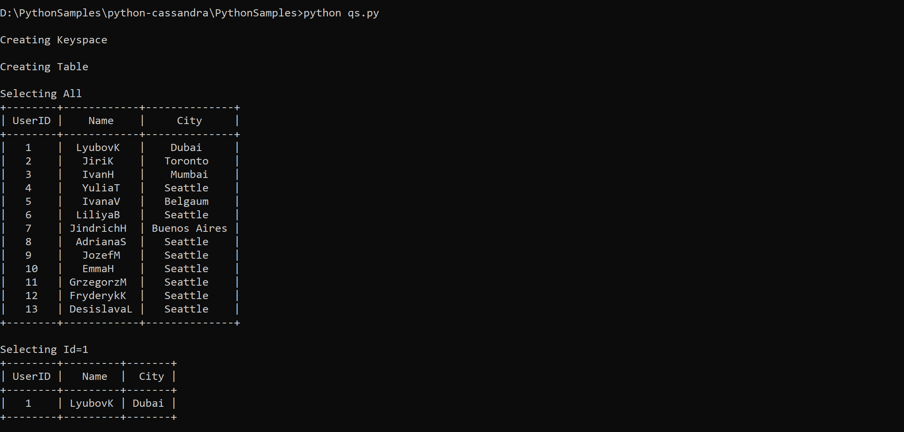

# <a name="quickstart-build-a-cassandra-app-with-python-and-azure-cosmos-db"></a>Rychlý start: Sestavení aplikace Cassandra pomocí Pythonu a Azure Cosmos DB

Tento rychlý start ukazuje, jak pomocí Pythonu a rozhraní Azure Cosmos DB [Cassandra API](cassandra-introduction.md) sestavit aplikaci profilu naklonováním příkladu z GitHubu. Tento rychlý start vás také provede vytvořením účtu služby Azure Cosmos DB pomocí webu Azure Portal.

Azure Cosmos DB je globálně distribuovaná databázová služba Microsoftu pro více modelů. Můžete rychle vytvořit a dotazovat databáze dokumentů, párů klíč-hodnota a grafů, které tak můžou využívat výhody možnosti globální distribuce a horizontálního škálování v jádru služby Azure Cosmos DB.   

## <a name="prerequisites"></a>Požadavky

[!INCLUDE [quickstarts-free-trial-note](../../includes/quickstarts-free-trial-note.md)]Alternativně můžete [vyzkoušet službu Azure Cosmos DB zdarma](https://azure.microsoft.com/try/cosmosdb/) bez předplatného Azure, poplatků a závazků.

Přístup k programu Azure Cosmos DB Cassandra API Preview. Pokud jste ještě nepožádali o přístup, [zaregistrujte se](cassandra-introduction.md#sign-up-now).

Navíc platí:
* [Python](https://www.python.org/downloads/) verze v2.7.14
* [Git](http://git-scm.com/)
* [Ovladač Python pro Apache Cassandra](https://github.com/datastax/python-driver)

## <a name="create-a-database-account"></a>Vytvoření účtu databáze

Než budete moct vytvořit databázi dokumentů, je potřeba pomocí služby Azure Cosmos DB vytvořit účet Cassandra.

[!INCLUDE [cosmos-db-create-dbaccount-cassandra](../../includes/cosmos-db-create-dbaccount-cassandra.md)]

## <a name="clone-the-sample-application"></a>Klonování ukázkové aplikace

Teď naklonujeme aplikaci rozhraní Cassandra API z GitHubu, nastavíme připojovací řetězec a spustíme ji. Uvidíte, jak snadno se pracuje s daty prostřednictvím kódu programu. 

1. Otevřete okno terminálu Git, například Git Bash, a pomocí příkazu `cd` přejděte do složky, do které chcete nainstalovat ukázkovou aplikaci. 

    ```bash
    cd "C:\git-samples"
    ```

2. Ukázkové úložiště naklonujete spuštěním následujícího příkazu. Tento příkaz vytvoří na vašem počítači kopii ukázkové aplikace. 

    ```bash
    git clone https://github.com/Azure-Samples/azure-cosmos-db-cassandra-python-getting-started.git
    ```

## <a name="review-the-code"></a>Kontrola kódu

Tento krok je volitelný. Pokud chcete zjistit, jak se v kódu vytvářejí prostředky databáze, můžete si prohlédnout následující fragmenty kódu. Všechny fragmenty kódu pocházejí ze souboru `pyquickstart.py`. Jinak můžete přeskočit přímo k části [Aktualizace připojovacího řetězce](#update-your-connection-string). 

* Uživatelské jméno a heslo se nastaví pomocí stránky připojovacího řetězce na webu Azure Portal. Cestu path\to\cert nahradíte cestou k vašemu certifikátu X509.

   ```python
    ssl_opts = {
            'ca_certs': 'path\to\cert',
            'ssl_version': ssl.PROTOCOL_TLSv1_2
            }
    auth_provider = PlainTextAuthProvider( username=cfg.config['username'], password=cfg.config['password'])
    cluster = Cluster([cfg.config['contactPoint']], port = cfg.config['port'], auth_provider=auth_provider, ssl_options=ssl_opts)
    session = cluster.connect()
   
   ```

* Inicializuje se proměnná `cluster` s informacemi contactPoint. Hodnota contactPoint se načte z webu Azure Portal.

    ```python
   cluster = Cluster([cfg.config['contactPoint']], port = cfg.config['port'], auth_provider=auth_provider)
    ```

* `cluster` se připojí k rozhraní Azure Cosmos DB Cassandra API.

    ```python
    session = cluster.connect()
    ```

* Vytvoří se nový prostor klíčů.

    ```python
   session.execute('CREATE KEYSPACE IF NOT EXISTS uprofile WITH replication = {\'class\': \'NetworkTopologyStrategy\', \'datacenter1\' : \'1\' }')
    ```

* Vytvoří se nová tabulka.

   ```
   session.execute('CREATE TABLE IF NOT EXISTS uprofile.user (user_id int PRIMARY KEY, user_name text, user_bcity text)');
   ```

* Vloží se entity klíč-hodnota.

    ```Python
    insert_data = session.prepare("INSERT INTO  uprofile.user  (user_id, user_name , user_bcity) VALUES (?,?,?)")
    batch = BatchStatement()
    batch.add(insert_data, (1, 'LyubovK', 'Dubai'))
    batch.add(insert_data, (2, 'JiriK', 'Toronto'))
    batch.add(insert_data, (3, 'IvanH', 'Mumbai'))
    batch.add(insert_data, (4, 'YuliaT', 'Seattle'))
    ....
    session.execute(batch)
    ```

* Spustí se dotaz pro získání všech hodnot klíčů.

    ```Python
    rows = session.execute('SELECT * FROM uprofile.user')
    ```  
    
* Spustí se dotaz pro získání páru klíč-hodnota.

    ```Python
    
    rows = session.execute('SELECT * FROM uprofile.user where user_id=1')
    ```  

## <a name="update-your-connection-string"></a>Aktualizace připojovacího řetězce

Teď se vraťte zpátky na portál Azure Portal, kde najdete informace o připojovacím řetězci, a zkopírujte je do aplikace. Tím aplikaci umožníte komunikovat s hostovanou databází.

1. Na webu [Azure Portal](http://portal.azure.com/) klikněte na **Připojovací řetězec**. 

    Pomocí tlačítka  na pravé straně obrazovky zkopírujte horní hodnotu KONTAKTNÍ BOD.

    

2. Otevřete soubor `config.py`. 

3. Vložte hodnotu KONTAKTNÍ BOD z portálu místo `<FILLME>` na řádku 10.

    Řádek 10 by teď měl vypadat nějak takto: 

    `'contactPoint': 'cosmos-db-quickstarts.documents.azure.com:10350'`

4. Zkopírujte z portálu hodnotu UŽIVATELSKÉ JMÉNO a vložte ji místo `<FILLME>` na řádku 6.

    Řádek 6 by teď měl vypadat nějak takto: 

    `'username': 'cosmos-db-quickstart',`
    
5. Zkopírujte z portálu hodnotu HESLO a vložte ji místo `<FILLME>` na řádku 8.

    Řádek 8 by teď měl vypadat nějak takto:

    `'password' = '2Ggkr662ifxz2Mg==`';`

6. Uložte soubor config.py.
    
## <a name="use-the-x509-certificate"></a>Použití certifikátu X509

1. Pokud potřebujete přidat certifikát Baltimore CyberTrust Root, jeho sériové číslo je 02:00:00:b9 a otisk SHA1 je d4🇩🇪20:d0:5e:66:fc:53:fe:1a:50:88:2c:78:db:28:52:ca:e4:74. Můžete ho stáhnout z adresy https://cacert.omniroot.com/bc2025.crt a uložit do místního souboru s příponou .cer.

2. Otevřete soubor pyquickstart.py a změňte cestu path\to\cert tak, aby odkazovala na váš nový certifikát.

3. Uložte soubor pyquickstart.py.

## <a name="run-the-app"></a>Spuštění aplikace

1. Pomocí příkazu cd v terminálu Git přejděte do složky azure-cosmos-db-cassandra-python-getting-started. 

2. Spusťte následující příkazy a nainstalujte požadované moduly:

    ```python
    python -m pip install cassandra-driver
    python -m pip install prettytable
    python -m pip install requests
    python -m pip install pyopenssl
    ```

2. Spusťte následující příkaz a spusťte vaši aplikaci uzlu:

    ```
    python pyquickstart.py
    ```

3. Na příkazovém řádku zkontrolujte očekávané výsledky.

    Stisknutím CTRL + C zastavte provádění programu a zavřete okno konzoly. 

    
    
    Teď můžete otevřít Průzkumníka dat na webu Azure Portal a zobrazit dotaz nebo provést úpravy a pracovat s těmito novými daty. 

    

## <a name="review-slas-in-the-azure-portal"></a>Ověření smluv SLA na webu Azure Portal

[!INCLUDE [cosmosdb-tutorial-review-slas](../../includes/cosmos-db-tutorial-review-slas.md)]

## <a name="clean-up-resources"></a>Vyčištění prostředků

[!INCLUDE [cosmosdb-delete-resource-group](../../includes/cosmos-db-delete-resource-group.md)]

## <a name="next-steps"></a>Další kroky

V tomto rychlém startu jsme se seznámili s postupem vytvoření účtu databáze Azure Cosmos, vytvoření kolekce pomocí Průzkumníka dat a spuštění aplikace. Teď můžete do účtu databáze Cosmos importovat další data. 

> [!div class="nextstepaction"]
> [Import dat Cassandra do služby Azure Cosmos DB](cassandra-import-data.md)

