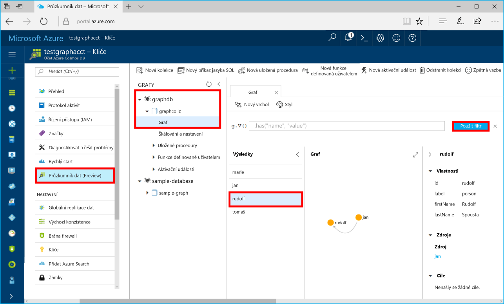

# <a name="azure-cosmos-db-build-a-net-application-using-hello-graph-api"></a>Azure Cosmos DB: Vytvoření aplikace .NET pomocí hello rozhraní Graph API

Databáze Azure Cosmos je databázová služba Microsoftu s více modely použitelná v celosvětovém měřítku. Můžete rychle vytvořit a dotazovat dokumentu, klíč/hodnota a graf databází, které těžit z globální distribuční hello a možnosti vodorovné škálování jádrem hello Azure Cosmos DB. 

Tento rychlý start předvádí, jak hello toocreate účet Azure Cosmos DB, databáze a graf (kontejner) pomocí portálu Azure. Potom sestavení a spuštění konzoly aplikace založená na hello [rozhraní Graph API](graph-sdk-dotnet.md) (preview).  

## <a name="prerequisites"></a>Požadavky

Pokud ještě nemáte nainstalované Visual Studio 2017, můžete stáhnout a použít hello **volné** [Visual Studio 2017 Community Edition](https://www.visualstudio.com/downloads/). Ujistěte se, že povolíte **Azure development** při instalaci sady Visual Studio hello.

[!INCLUDE [quickstarts-free-trial-note](../../includes/quickstarts-free-trial-note.md)]

## <a name="create-a-database-account"></a>Vytvoření účtu databáze

[!INCLUDE [cosmos-db-create-dbaccount-graph](../../includes/cosmos-db-create-dbaccount-graph.md)]

## <a name="add-a-graph"></a>Přidání grafu

[!INCLUDE [cosmos-db-create-graph](../../includes/cosmos-db-create-graph.md)]

## <a name="clone-hello-sample-application"></a>Klonování hello ukázkové aplikace

Teď umožňuje nastavit připojovací řetězec hello klonování rozhraní Graph API aplikace z githubu a potom ho spusťte. Uvidíte, jak je snadné toowork s daty prostřednictvím kódu programu. 

1. Otevřete okno terminálu git, jako je například git bash a `cd` tooa pracovní adresář.  

2. Spusťte následující příkaz tooclone hello Ukázka úložiště hello. 

    ```bash
    git clone https://github.com/Azure-Samples/azure-cosmos-db-graph-dotnet-getting-started.git
    ```

3. Poté otevřete Visual Studio a hello otevřete soubor řešení. 

## <a name="review-hello-code"></a>Zkontrolujte hello kódu

Provedeme jejich stručný přehled o dění v aplikaci hello. Hello otevřete soubor Program.cs a najdete, že tyto řádky kódu vytvořit hello prostředky Azure Cosmos DB. 

* Hello DocumentClient je inicializován. Ve verzi preview hello jsme přidali grafu rozšíření rozhraní API v klientovi Azure Cosmos DB hello. Pracujeme na klientovi samostatný graf odpojená od klienta Azure Cosmos DB hello a prostředky.

    ```csharp
    using (DocumentClient client = new DocumentClient(
        new Uri(endpoint),
        authKey,
        new ConnectionPolicy { ConnectionMode = ConnectionMode.Direct, ConnectionProtocol = Protocol.Tcp }))
    ```

* Vytvoří se nová databáze.

    ```csharp
    Database database = await client.CreateDatabaseIfNotExistsAsync(new Database { Id = "graphdb" });
    ```

* Vytvoří se nový graf.

    ```csharp
    DocumentCollection graph = await client.CreateDocumentCollectionIfNotExistsAsync(
        UriFactory.CreateDatabaseUri("graphdb"),
        new DocumentCollection { Id = "graph" },
        new RequestOptions { OfferThroughput = 1000 });
    ```
* Sérii kroků Gremlin jsou spouštěny pomocí hello `CreateGremlinQuery` metoda.

    ```csharp
    // hello CreateGremlinQuery method extensions allow you tooexecute Gremlin queries and iterate
    // results asychronously
    IDocumentQuery<dynamic> query = client.CreateGremlinQuery<dynamic>(graph, "g.V().count()");
    while (query.HasMoreResults)
    {
        foreach (dynamic result in await query.ExecuteNextAsync())
        {
            Console.WriteLine($"\t {JsonConvert.SerializeObject(result)}");
        }
    }

    ```

## <a name="update-your-connection-string"></a>Aktualizace připojovacího řetězce

Nyní přejděte zpět toohello Azure portálu tooget vaše informace o připojovacím řetězci a zkopírujte jej do aplikace hello.

1. V aplikaci Visual Studio 2017 otevřete soubor App.config hello. 

2. V hello portál Azure, v účtu Azure Cosmos DB, klikněte na **klíče** v levé navigační hello. 

    

3. Kopie vašeho **URI** hodnoty z portálu hello a nastavit jej jako hello hodnotu klíče hello koncový bod v souboru App.config. Můžete použít tlačítko Kopírovat hello, jak je uvedeno v předchozím snímku obrazovky toocopy hello hodnota hello.

    `<add key="Endpoint" value="https://FILLME.documents.azure.com:443" />`

4. Kopie vašeho **primární klíč** hodnoty z portálu hello a nastavit jej jako hello hodnota hello AuthKey klíče v souboru App.config a potom uložte změny. 

    `<add key="AuthKey" value="FILLME" />`

Jste nyní aktualizovat vaši aplikaci s všechny údaje hello potřebuje toocommunicate s Azure Cosmos DB. 

## <a name="run-hello-console-app"></a>Spusťte konzolovou aplikaci hello

1. V sadě Visual Studio, klikněte pravým tlačítkem na hello **GraphGetStarted** projektu v **Průzkumníku řešení** a pak klikněte na **spravovat balíčky NuGet**. 

2. V hello NuGet **Procházet** zadejte *Microsoft.Azure.Graphs* a zkontrolujte hello **zahrnuje předběžné verze** pole. 

3. Z výsledků hello nainstalovat hello **Microsoft.Azure.Graphs** knihovny. Tím se nainstaluje balíček knihovny hello Azure Cosmos DB grafu rozšíření a všechny závislosti.

    Pokud se zobrazí zpráva o Kontrola řešení toohello změny, klikněte na tlačítko **OK**. Pokud se vám zobrazí zpráva týkající se přijetí licence, klikněte na **Souhlasím**.

4. Klikněte na kombinaci kláves CTRL + F5 toorun hello aplikace.

   okno konzoly Hello zobrazí bodů uchycení hello a okrajů přidávané toohello grafu. Když hello dokončení skriptu, stiskněte klávesu ENTER dvakrát tooclose okna konzoly hello. 

## <a name="browse-using-hello-data-explorer"></a>Procházet pomocí hello Průzkumníku dat

Teď můžete přejít zpět tooData Explorer v hello portál Azure a procházet a dotaz na nová data grafu.

1. V Průzkumníku dat hello nové databáze se zobrazí v podokně grafy hello. Rozbalte položky **graphdb** a **graphcollz** a potom klikněte na **Graph**.

2. Klikněte na tlačítko hello **použít filtr** tlačítko toouse hello výchozí dotaz tooview všechny verticies hello v grafu hello. Hello data generována hello ukázkové aplikace se zobrazí v podokně grafy hello.

    Oddálit hello grafu, můžete zvětšit místo zobrazení grafu hello, přidat další verticies a přesunout verticies na hello zobrazit prostor.

    

## <a name="review-slas-in-hello-azure-portal"></a>Zkontrolujte SLA v hello portálu Azure

[!INCLUDE [cosmosdb-tutorial-review-slas](../../includes/cosmos-db-tutorial-review-slas.md)]

## <a name="clean-up-resources"></a>Vyčištění prostředků

Pokud ale nebudete toocontinue toouse této aplikace, odstraňte všechny prostředky, které jsou vytvořené tento rychlý start v hello portál Azure s hello následující kroky: 

1. V levé nabídce hello v hello portálu Azure klikněte na **skupiny prostředků** a pak klikněte na název hello hello prostředků, které jste vytvořili. 
2. Na stránce skupiny prostředků, klikněte na tlačítko **odstranit**hello textového pole zadejte název hello toodelete hello prostředků a pak klikněte na tlačítko **odstranit**.

## <a name="next-steps"></a>Další kroky

V tento rychlý start když jste se naučili toocreate účet Azure Cosmos DB vytvoření grafu pomocí hello Průzkumníku dat a spusťte aplikaci. Teď můžete pomocí konzoly Gremlin vytvářet složitější dotazy a implementovat účinnou logiku procházení grafů. 

> [!div class="nextstepaction"]
> [Dotazování pomocí konzoly Gremlin](tutorial-query-graph.md)

