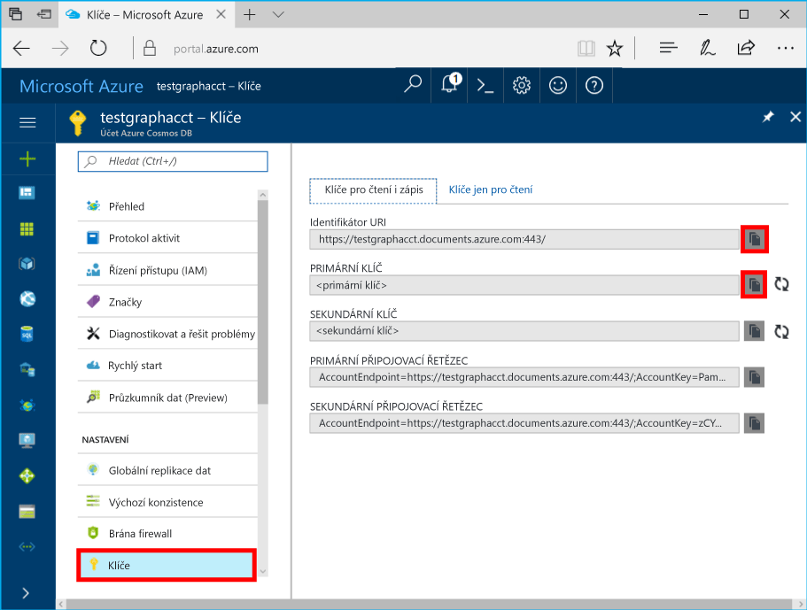

# <a name="azure-cosmos-db-create-query-and-traverse-a-graph-in-the-gremlin-console"></a><span data-ttu-id="0e376-103">Služba Azure Cosmos DB: Vytváření, zadávání dotazů a procházení grafu v konzole Gremlin</span><span class="sxs-lookup"><span data-stu-id="0e376-103">Azure Cosmos DB: Create, query, and traverse a graph in the Gremlin console</span></span>

<span data-ttu-id="0e376-104">Azure Cosmos DB je globálně distribuovaná databázová služba Microsoftu pro více modelů.</span><span class="sxs-lookup"><span data-stu-id="0e376-104">Azure Cosmos DB is Microsoft’s globally distributed multi-model database service.</span></span> <span data-ttu-id="0e376-105">Můžete snadno vytvořit a dotazovat databáze dotazů, klíčů/hodnot a grafů, které tak můžou využívat výhody použitelnosti v celosvětovém měřítku a možností horizontálního škálování v jádru Azure Cosmos DB.</span><span class="sxs-lookup"><span data-stu-id="0e376-105">You can quickly create and query document, key/value, and graph databases, all of which benefit from the global distribution and horizontal scale capabilities at the core of Azure Cosmos DB.</span></span> 

<span data-ttu-id="0e376-106">Tento rychlý start popisuje způsob vytvoření účtu služby Azure Cosmos DB a grafu (kontejneru) pomocí portálu Azure Portal a následné použití v [konzole Gremlin](https://tinkerpop.apache.org/docs/current/reference/#gremlin-console) z [webu Apache TinkerPop](http://tinkerpop.apache.org) pro práci s daty (náhledem) rozhraní Graph API.</span><span class="sxs-lookup"><span data-stu-id="0e376-106">This quick start demonstrates how to create an Azure Cosmos DB account, database, and graph (container) using the Azure portal and then use the [Gremlin Console](https://tinkerpop.apache.org/docs/current/reference/#gremlin-console) from  [Apache TinkerPop](http://tinkerpop.apache.org) to work with Graph API (preview) data.</span></span> <span data-ttu-id="0e376-107">V tomto kurzu se naučíte vytvářet vrcholy a okraje a zadávat k nim dotazy, a to aktualizací vlastnosti vrcholu, a dále zadávat dotazy pro vrcholy, procházet graf a vyřadit konkrétní vrchol.</span><span class="sxs-lookup"><span data-stu-id="0e376-107">In this tutorial, you create and query vertices and edges, updating a vertex property, query vertices, traverse the graph, and drop a vertex.</span></span>


<span data-ttu-id="0e376-109">Konzola Gremlin je založena na technologii Groovy nebo Java a běží v systémech Linux, Mac a Windows.</span><span class="sxs-lookup"><span data-stu-id="0e376-109">The Gremlin console is Groovy/Java based and runs on Linux, Mac, and Windows.</span></span> <span data-ttu-id="0e376-110">Můžete si ji stáhnout z [webu Apache TinkerPop](https://www.apache.org/dyn/closer.lua/tinkerpop/3.2.5/apache-tinkerpop-gremlin-console-3.2.5-bin.zip).</span><span class="sxs-lookup"><span data-stu-id="0e376-110">You can download it from the [Apache TinkerPop site](https://www.apache.org/dyn/closer.lua/tinkerpop/3.2.5/apache-tinkerpop-gremlin-console-3.2.5-bin.zip).</span></span>

## <a name="prerequisites"></a><span data-ttu-id="0e376-111">Požadavky</span><span class="sxs-lookup"><span data-stu-id="0e376-111">Prerequisites</span></span>

<span data-ttu-id="0e376-112">Abyste si mohli vytvořit účet služby Azure Cosmos DB pro tento rychlý start, musíte mít předplatné Azure.</span><span class="sxs-lookup"><span data-stu-id="0e376-112">You need to have an Azure subscription to create an Azure Cosmos DB account for this quickstart.</span></span>

[!INCLUDE [quickstarts-free-trial-note](../../includes/quickstarts-free-trial-note.md)]

<span data-ttu-id="0e376-113">Musíte si také nainstalovat [konzolu Gremlin](http://tinkerpop.apache.org/).</span><span class="sxs-lookup"><span data-stu-id="0e376-113">You also need to install the [Gremlin Console](http://tinkerpop.apache.org/).</span></span> <span data-ttu-id="0e376-114">Použijte verzi 3.2.5 nebo vyšší.</span><span class="sxs-lookup"><span data-stu-id="0e376-114">Use version 3.2.5 or above.</span></span>

## <a name="create-a-database-account"></a><span data-ttu-id="0e376-115">Vytvoření účtu databáze</span><span class="sxs-lookup"><span data-stu-id="0e376-115">Create a database account</span></span>

[!INCLUDE [cosmos-db-create-dbaccount-graph](../../includes/cosmos-db-create-dbaccount-graph.md)]

## <a name="add-a-graph"></a><span data-ttu-id="0e376-116">Přidání grafu</span><span class="sxs-lookup"><span data-stu-id="0e376-116">Add a graph</span></span>

[!INCLUDE [cosmos-db-create-graph](../../includes/cosmos-db-create-graph.md)]

## <span data-ttu-id="0e376-117"><a id="ConnectAppService"></a>Připojení ke službě aplikace</span><span class="sxs-lookup"><span data-stu-id="0e376-117"><a id="ConnectAppService"></a>Connect to your app service</span></span>
1. <span data-ttu-id="0e376-118">Než začnete používat konzolu Gremlin, vytvořte nebo upravte v adresáři apache-tinkerpop-gremlin-console-3.2.5/conf konfigurační soubor remote-secure.yaml.</span><span class="sxs-lookup"><span data-stu-id="0e376-118">Before starting the Gremlin Console, create or modify the remote-secure.yaml configuration file in the apache-tinkerpop-gremlin-console-3.2.5/conf directory.</span></span>
2. <span data-ttu-id="0e376-119">Vyplňte parametry *Hostitel*, *Port*, *Uživatelské jméno*, *Heslo*, *Fond připojení* a *Serializátor*:</span><span class="sxs-lookup"><span data-stu-id="0e376-119">Fill in your *host*, *port*, *username*, *password*, *connectionPool*, and *serializer* configurations:</span></span>

    <span data-ttu-id="0e376-120">Nastavení</span><span class="sxs-lookup"><span data-stu-id="0e376-120">Setting</span></span>|<span data-ttu-id="0e376-121">Navrhovaná hodnota</span><span class="sxs-lookup"><span data-stu-id="0e376-121">Suggested value</span></span>|<span data-ttu-id="0e376-122">Popis</span><span class="sxs-lookup"><span data-stu-id="0e376-122">Description</span></span>
    ---|---|---
    <span data-ttu-id="0e376-123">hostitelé</span><span class="sxs-lookup"><span data-stu-id="0e376-123">hosts</span></span>|<span data-ttu-id="0e376-124">[***.graphs.azure.com]</span><span class="sxs-lookup"><span data-stu-id="0e376-124">[***.graphs.azure.com]</span></span>|<span data-ttu-id="0e376-125">Viz snímek obrazovky níže.</span><span class="sxs-lookup"><span data-stu-id="0e376-125">See screenshot below.</span></span> <span data-ttu-id="0e376-126">Toto je hodnota Gremlin URI na stránce Přehled na webu Azure Portal v hranatých závorkách a s odebraným řetězcem „:443/“ na konci.</span><span class="sxs-lookup"><span data-stu-id="0e376-126">This is the Gremlin URI value on the Overview page of the Azure portal, in square brackets, with the trailing :443/ removed.</span></span><br><br><span data-ttu-id="0e376-127">Tuto hodnotu můžete získat také z karty Klíče s použitím hodnoty URI, ve které odeberete „https://“, změníte „documents“ na „graphs“ a odeberete „:443/“ na konci.</span><span class="sxs-lookup"><span data-stu-id="0e376-127">This value can also be retrieved from the Keys tab, using the URI value by removing https://, changing documents to graphs, and removing the trailing :443/.</span></span>
    <span data-ttu-id="0e376-128">port</span><span class="sxs-lookup"><span data-stu-id="0e376-128">port</span></span>|<span data-ttu-id="0e376-129">443</span><span class="sxs-lookup"><span data-stu-id="0e376-129">443</span></span>|<span data-ttu-id="0e376-130">Nastavte na hodnotu 443.</span><span class="sxs-lookup"><span data-stu-id="0e376-130">Set to 443.</span></span>
    <span data-ttu-id="0e376-131">uživatelské jméno</span><span class="sxs-lookup"><span data-stu-id="0e376-131">username</span></span>|<span data-ttu-id="0e376-132">*Vaše uživatelské jméno*</span><span class="sxs-lookup"><span data-stu-id="0e376-132">*Your username*</span></span>|<span data-ttu-id="0e376-133">Prostředek ve formátu `/dbs/<db>/colls/<coll>`, kde `<db>` je název vaší databáze a `<coll>` je název vaší kolekce.</span><span class="sxs-lookup"><span data-stu-id="0e376-133">The resource of the form `/dbs/<db>/colls/<coll>` where `<db>` is your database name and `<coll>` is your collection name.</span></span>
    <span data-ttu-id="0e376-134">heslo</span><span class="sxs-lookup"><span data-stu-id="0e376-134">password</span></span>|<span data-ttu-id="0e376-135">*Váš primární klíč*</span><span class="sxs-lookup"><span data-stu-id="0e376-135">*Your primary key*</span></span>| <span data-ttu-id="0e376-136">Viz druhý snímek obrazovky níže.</span><span class="sxs-lookup"><span data-stu-id="0e376-136">See second screenshot below.</span></span> <span data-ttu-id="0e376-137">Toto je váš primární klíč, který můžete získat ze stránky Klíče na webu Azure Portal v poli Primární klíč.</span><span class="sxs-lookup"><span data-stu-id="0e376-137">This is your primary key, which you can retrieve from the Keys page of the Azure portal, in the Primary Key box.</span></span> <span data-ttu-id="0e376-138">Pomocí tlačítka pro kopírování na levé straně pole hodnotu zkopírujte.</span><span class="sxs-lookup"><span data-stu-id="0e376-138">Use the copy button on the left side of the box to copy the value.</span></span>
    <span data-ttu-id="0e376-139">fond připojení</span><span class="sxs-lookup"><span data-stu-id="0e376-139">connectionPool</span></span>|<span data-ttu-id="0e376-140">{enableSsl: true}</span><span class="sxs-lookup"><span data-stu-id="0e376-140">{enableSsl: true}</span></span>|<span data-ttu-id="0e376-141">Nastavení fondu připojení pro protokol SSL.</span><span class="sxs-lookup"><span data-stu-id="0e376-141">Your connection pool setting for SSL.</span></span>
    <span data-ttu-id="0e376-142">serializátor</span><span class="sxs-lookup"><span data-stu-id="0e376-142">serializer</span></span>|<span data-ttu-id="0e376-143">{ className: org.apache.tinkerpop.gremlin.</span><span class="sxs-lookup"><span data-stu-id="0e376-143">{ className: org.apache.tinkerpop.gremlin.</span></span><br><span data-ttu-id="0e376-144">driver.ser.GraphSONMessageSerializerV1d0,</span><span class="sxs-lookup"><span data-stu-id="0e376-144">driver.ser.GraphSONMessageSerializerV1d0,</span></span><br> <span data-ttu-id="0e376-145">config: { serializeResultToString: true }}</span><span class="sxs-lookup"><span data-stu-id="0e376-145">config: { serializeResultToString: true }}</span></span>|<span data-ttu-id="0e376-146">Nastavte na tuto hodnotu a odstraňte případné konce řádků `\n` vzniklé vložením hodnoty.</span><span class="sxs-lookup"><span data-stu-id="0e376-146">Set to this value and delete any `\n` line breaks when pasting in the value.</span></span>

    <span data-ttu-id="0e376-147">Pro hodnotu hostitelé zkopírujte hodnotu **Gremlin URI** ze stránky **Přehled**: </span><span class="sxs-lookup"><span data-stu-id="0e376-147">For the hosts value, copy the **Gremlin URI** value from the **Overview** page: </span></span>

    <span data-ttu-id="0e376-148">Pro hodnotu heslo zkopírujte **Primární klíč** ze stránky **Klíče**: </span><span class="sxs-lookup"><span data-stu-id="0e376-148">For the password value, copy the **Primary key** from the **Keys** page: </span></span>


3. <span data-ttu-id="0e376-149">V terminálu spuštěním příkazu `bin/gremlin.bat` nebo `bin/gremlin.sh` spusťte [konzolu Gremlin](http://tinkerpop.apache.org/docs/3.2.5/tutorials/getting-started/).</span><span class="sxs-lookup"><span data-stu-id="0e376-149">In your terminal, run `bin/gremlin.bat` or `bin/gremlin.sh` to start the [Gremlin Console](http://tinkerpop.apache.org/docs/3.2.5/tutorials/getting-started/).</span></span>
4. <span data-ttu-id="0e376-150">V terminálu se spuštěním příkazu `:remote connect tinkerpop.server conf/remote-secure.yaml` připojte k aplikační službě.</span><span class="sxs-lookup"><span data-stu-id="0e376-150">In your terminal, run `:remote connect tinkerpop.server conf/remote-secure.yaml` to connect to your app service.</span></span>

    > [!TIP]
    > <span data-ttu-id="0e376-151">Pokud se zobrazí chyba `No appenders could be found for logger`, zkontrolujte, že jste v souboru remote-secure.yaml aktualizovali hodnotu serializátoru, jak je popsáno v kroku 2.</span><span class="sxs-lookup"><span data-stu-id="0e376-151">If you receive the error `No appenders could be found for logger` ensure that you updated the serializer value in the remote-secure.yaml file as described in step 2.</span></span> 

<span data-ttu-id="0e376-152">Výborně!</span><span class="sxs-lookup"><span data-stu-id="0e376-152">Great!</span></span> <span data-ttu-id="0e376-153">Nastavení se nám podařilo dokončit a teď můžete spouštět některé příkazy konzoly.</span><span class="sxs-lookup"><span data-stu-id="0e376-153">Now that we finished the setup, let's start running some console commands.</span></span>

<span data-ttu-id="0e376-154">Vyzkoušejme jednoduchý příkaz count().</span><span class="sxs-lookup"><span data-stu-id="0e376-154">Let's try a simple count() command.</span></span> <span data-ttu-id="0e376-155">Zadejte do příkazového řádku konzoly následující:</span><span class="sxs-lookup"><span data-stu-id="0e376-155">Type the following into the console at the prompt:</span></span>
```
:> g.V().count()
```

> [!TIP]
> <span data-ttu-id="0e376-156">Vidíte část příkazu `:>`, která předchází textu `g.V().count()`?</span><span class="sxs-lookup"><span data-stu-id="0e376-156">Notice the `:>` that precedes the `g.V().count()` text?</span></span> 
>
> <span data-ttu-id="0e376-157">Tuto část příkazu je potřeba zadat ručně.</span><span class="sxs-lookup"><span data-stu-id="0e376-157">This is part of the command you need to type.</span></span> <span data-ttu-id="0e376-158">Při používání konzole Gremlin s Azure Cosmos DB je to důležité.</span><span class="sxs-lookup"><span data-stu-id="0e376-158">It is important when using the Gremlin console, with Azure Cosmos DB.</span></span>  
>
> <span data-ttu-id="0e376-159">Vynechání této předpony `:>` dá konzole pokyn, aby příkaz spustila lokálně – často s grafem v paměti.</span><span class="sxs-lookup"><span data-stu-id="0e376-159">Omitting this `:>` prefix instructs the console to execute the command locally, often against an in-memory graph.</span></span>
> <span data-ttu-id="0e376-160">Použití `:>` informuje konzolu, že má spustit vzdálený příkaz – v tomto případě se službou Cosmos DB (buď emulátor místního hostitele, nebo > instance Azure).</span><span class="sxs-lookup"><span data-stu-id="0e376-160">Using this `:>` tells the console to execute a remote command, in this case against Cosmos DB (either the localhost emulator, or an > Azure instance).</span></span>


## <a name="create-vertices-and-edges"></a><span data-ttu-id="0e376-161">Vytváření vrcholů a okrajů</span><span class="sxs-lookup"><span data-stu-id="0e376-161">Create vertices and edges</span></span>

<span data-ttu-id="0e376-162">Začněme přidáním pěti osob pro nastavení vrcholů: *Tomáš*, *Marie*, *Robin*, *Petr* a *Jan*.</span><span class="sxs-lookup"><span data-stu-id="0e376-162">Let's begin by adding five person vertices for *Thomas*, *Mary Kay*, *Robin*, *Ben*, and *Jack*.</span></span>

<span data-ttu-id="0e376-163">Vstup (Tomáš):</span><span class="sxs-lookup"><span data-stu-id="0e376-163">Input (Thomas):</span></span>

```
:> g.addV('person').property('firstName', 'Thomas').property('lastName', 'Andersen').property('age', 44).property('userid', 1)
```

<span data-ttu-id="0e376-164">Výstup:</span><span class="sxs-lookup"><span data-stu-id="0e376-164">Output:</span></span>

```
==>[id:796cdccc-2acd-4e58-a324-91d6f6f5ed6d,label:person,type:vertex,properties:[firstName:[[id:f02a749f-b67c-4016-850e-910242d68953,value:Thomas]],lastName:[[id:f5fa3126-8818-4fda-88b0-9bb55145ce5c,value:Andersen]],age:[[id:f6390f9c-e563-433e-acbf-25627628016e,value:44]],userid:[[id:796cdccc-2acd-4e58-a324-91d6f6f5ed6d|userid,value:1]]]]
```
<span data-ttu-id="0e376-165">Vstup (Marie):</span><span class="sxs-lookup"><span data-stu-id="0e376-165">Input (Mary Kay):</span></span>

```
:> g.addV('person').property('firstName', 'Mary Kay').property('lastName', 'Andersen').property('age', 39).property('userid', 2)

```

<span data-ttu-id="0e376-166">Výstup:</span><span class="sxs-lookup"><span data-stu-id="0e376-166">Output:</span></span>

```
==>[id:0ac9be25-a476-4a30-8da8-e79f0119ea5e,label:person,type:vertex,properties:[firstName:[[id:ea0604f8-14ee-4513-a48a-1734a1f28dc0,value:Mary Kay]],lastName:[[id:86d3bba5-fd60-4856-9396-c195ef7d7f4b,value:Andersen]],age:[[id:bc81b78d-30c4-4e03-8f40-50f72eb5f6da,value:39]],userid:[[id:0ac9be25-a476-4a30-8da8-e79f0119ea5e|userid,value:2]]]]

```

<span data-ttu-id="0e376-167">Vstup (Robin):</span><span class="sxs-lookup"><span data-stu-id="0e376-167">Input (Robin):</span></span>

```
:> g.addV('person').property('firstName', 'Robin').property('lastName', 'Wakefield').property('userid', 3)
```

<span data-ttu-id="0e376-168">Výstup:</span><span class="sxs-lookup"><span data-stu-id="0e376-168">Output:</span></span>

```
==>[id:8dc14d6a-8683-4a54-8d74-7eef1fb43a3e,label:person,type:vertex,properties:[firstName:[[id:ec65f078-7a43-4cbe-bc06-e50f2640dc4e,value:Robin]],lastName:[[id:a3937d07-0e88-45d3-a442-26fcdfb042ce,value:Wakefield]],userid:[[id:8dc14d6a-8683-4a54-8d74-7eef1fb43a3e|userid,value:3]]]]
```

<span data-ttu-id="0e376-169">Vstup (Petr):</span><span class="sxs-lookup"><span data-stu-id="0e376-169">Input (Ben):</span></span>

```
:> g.addV('person').property('firstName', 'Ben').property('lastName', 'Miller').property('userid', 4)

```

<span data-ttu-id="0e376-170">Výstup:</span><span class="sxs-lookup"><span data-stu-id="0e376-170">Output:</span></span>

```
==>[id:ee86b670-4d24-4966-9a39-30529284b66f,label:person,type:vertex,properties:[firstName:[[id:a632469b-30fc-4157-840c-b80260871e9a,value:Ben]],lastName:[[id:4a08d307-0719-47c6-84ae-1b0b06630928,value:Miller]],userid:[[id:ee86b670-4d24-4966-9a39-30529284b66f|userid,value:4]]]]
```

<span data-ttu-id="0e376-171">Vstup (Jan):</span><span class="sxs-lookup"><span data-stu-id="0e376-171">Input (Jack):</span></span>

```
:> g.addV('person').property('firstName', 'Jack').property('lastName', 'Connor').property('userid', 5)
```

<span data-ttu-id="0e376-172">Výstup:</span><span class="sxs-lookup"><span data-stu-id="0e376-172">Output:</span></span>

```
==>[id:4c835f2a-ea5b-43bb-9b6b-215488ad8469,label:person,type:vertex,properties:[firstName:[[id:4250824e-4b72-417f-af98-8034aa15559f,value:Jack]],lastName:[[id:44c1d5e1-a831-480a-bf94-5167d133549e,value:Connor]],userid:[[id:4c835f2a-ea5b-43bb-9b6b-215488ad8469|userid,value:5]]]]
```


<span data-ttu-id="0e376-173">V dalším kroku přidejme pro vztahy mezi osobami okraje.</span><span class="sxs-lookup"><span data-stu-id="0e376-173">Next, let's add edges for relationships between our people.</span></span>

<span data-ttu-id="0e376-174">Vstup (Tomáš -> Marie):</span><span class="sxs-lookup"><span data-stu-id="0e376-174">Input (Thomas -> Mary Kay):</span></span>

```
:> g.V().hasLabel('person').has('firstName', 'Thomas').addE('knows').to(g.V().hasLabel('person').has('firstName', 'Mary Kay'))
```

<span data-ttu-id="0e376-175">Výstup:</span><span class="sxs-lookup"><span data-stu-id="0e376-175">Output:</span></span>

```
==>[id:c12bf9fb-96a1-4cb7-a3f8-431e196e702f,label:knows,type:edge,inVLabel:person,outVLabel:person,inV:0d1fa428-780c-49a5-bd3a-a68d96391d5c,outV:1ce821c6-aa3d-4170-a0b7-d14d2a4d18c3]
```

<span data-ttu-id="0e376-176">Vstup (Tomáš -> Robin):</span><span class="sxs-lookup"><span data-stu-id="0e376-176">Input (Thomas -> Robin):</span></span>

```
:> g.V().hasLabel('person').has('firstName', 'Thomas').addE('knows').to(g.V().hasLabel('person').has('firstName', 'Robin'))
```

<span data-ttu-id="0e376-177">Výstup:</span><span class="sxs-lookup"><span data-stu-id="0e376-177">Output:</span></span>

```
==>[id:58319bdd-1d3e-4f17-a106-0ddf18719d15,label:knows,type:edge,inVLabel:person,outVLabel:person,inV:3e324073-ccfc-4ae1-8675-d450858ca116,outV:1ce821c6-aa3d-4170-a0b7-d14d2a4d18c3]
```

<span data-ttu-id="0e376-178">Vstup (Robin -> Petr):</span><span class="sxs-lookup"><span data-stu-id="0e376-178">Input (Robin -> Ben):</span></span>

```
:> g.V().hasLabel('person').has('firstName', 'Robin').addE('knows').to(g.V().hasLabel('person').has('firstName', 'Ben'))
```

<span data-ttu-id="0e376-179">Výstup:</span><span class="sxs-lookup"><span data-stu-id="0e376-179">Output:</span></span>

```
==>[id:889c4d3c-549e-4d35-bc21-a3d1bfa11e00,label:knows,type:edge,inVLabel:person,outVLabel:person,inV:40fd641d-546e-412a-abcc-58fe53891aab,outV:3e324073-ccfc-4ae1-8675-d450858ca116]
```

## <a name="update-a-vertex"></a><span data-ttu-id="0e376-180">Aktualizace vrcholu</span><span class="sxs-lookup"><span data-stu-id="0e376-180">Update a vertex</span></span>

<span data-ttu-id="0e376-181">Aktualizujme vrchol *Tomáš* s novým věkovým údajem *45* let.</span><span class="sxs-lookup"><span data-stu-id="0e376-181">Let's update the *Thomas* vertex with a new age of *45*.</span></span>

<span data-ttu-id="0e376-182">Vstup:</span><span class="sxs-lookup"><span data-stu-id="0e376-182">Input:</span></span>
```
:> g.V().hasLabel('person').has('firstName', 'Thomas').property('age', 45)
```
<span data-ttu-id="0e376-183">Výstup:</span><span class="sxs-lookup"><span data-stu-id="0e376-183">Output:</span></span>

```
==>[id:ae36f938-210e-445a-92df-519f2b64c8ec,label:person,type:vertex,properties:[firstName:[[id:872090b6-6a77-456a-9a55-a59141d4ebc2,value:Thomas]],lastName:[[id:7ee7a39a-a414-4127-89b4-870bc4ef99f3,value:Andersen]],age:[[id:a2a75d5a-ae70-4095-806d-a35abcbfe71d,value:45]]]]
```

## <a name="query-your-graph"></a><span data-ttu-id="0e376-184">Dotazování grafu</span><span class="sxs-lookup"><span data-stu-id="0e376-184">Query your graph</span></span>

<span data-ttu-id="0e376-185">Teď spustíme pro graf celou řadu dotazů.</span><span class="sxs-lookup"><span data-stu-id="0e376-185">Now, let's run a variety of queries against your graph.</span></span>

<span data-ttu-id="0e376-186">Vyzkoušejme nejdříve dotaz s filtrem pro vrácení pouze osob nad 40 let.</span><span class="sxs-lookup"><span data-stu-id="0e376-186">First, let's try a query with a filter to return only people who are older than 40 years old.</span></span>

<span data-ttu-id="0e376-187">Vstup (dotaz s filtrem):</span><span class="sxs-lookup"><span data-stu-id="0e376-187">Input (filter query):</span></span>

```
:> g.V().hasLabel('person').has('age', gt(40))
```

<span data-ttu-id="0e376-188">Výstup:</span><span class="sxs-lookup"><span data-stu-id="0e376-188">Output:</span></span>

```
==>[id:ae36f938-210e-445a-92df-519f2b64c8ec,label:person,type:vertex,properties:[firstName:[[id:872090b6-6a77-456a-9a55-a59141d4ebc2,value:Thomas]],lastName:[[id:7ee7a39a-a414-4127-89b4-870bc4ef99f3,value:Andersen]],age:[[id:a2a75d5a-ae70-4095-806d-a35abcbfe71d,value:45]]]]
```

<span data-ttu-id="0e376-189">Teď navrhněme název pro skupinu osob nad 40 let.</span><span class="sxs-lookup"><span data-stu-id="0e376-189">Next, let's project the first name for the people who are older than 40 years old.</span></span>

<span data-ttu-id="0e376-190">Vstup (filtru + dotaz projekce):</span><span class="sxs-lookup"><span data-stu-id="0e376-190">Input (filter + projection query):</span></span>

```
:> g.V().hasLabel('person').has('age', gt(40)).values('firstName')
```

<span data-ttu-id="0e376-191">Výstup:</span><span class="sxs-lookup"><span data-stu-id="0e376-191">Output:</span></span>

```
==>Thomas
```

## <a name="traverse-your-graph"></a><span data-ttu-id="0e376-192">Procházení grafu</span><span class="sxs-lookup"><span data-stu-id="0e376-192">Traverse your graph</span></span>

<span data-ttu-id="0e376-193">Umožňuje procházet graf tak, aby vrátil všechny přátele uživatele Tomáš.</span><span class="sxs-lookup"><span data-stu-id="0e376-193">Let's traverse the graph to return all of Thomas's friends.</span></span>

<span data-ttu-id="0e376-194">Vstup (přátelé uživatele Tomáš):</span><span class="sxs-lookup"><span data-stu-id="0e376-194">Input (friends of Thomas):</span></span>

```
:> g.V().hasLabel('person').has('firstName', 'Thomas').outE('knows').inV().hasLabel('person')
```

<span data-ttu-id="0e376-195">Výstup:</span><span class="sxs-lookup"><span data-stu-id="0e376-195">Output:</span></span> 

```
==>[id:f04bc00b-cb56-46c4-a3bb-a5870c42f7ff,label:person,type:vertex,properties:[firstName:[[id:14feedec-b070-444e-b544-62be15c7167c,value:Mary Kay]],lastName:[[id:107ab421-7208-45d4-b969-bbc54481992a,value:Andersen]],age:[[id:4b08d6e4-58f5-45df-8e69-6b790b692e0a,value:39]]]]
==>[id:91605c63-4988-4b60-9a30-5144719ae326,label:person,type:vertex,properties:[firstName:[[id:f760e0e6-652a-481a-92b0-1767d9bf372e,value:Robin]],lastName:[[id:352a4caa-bad6-47e3-a7dc-90ff342cf870,value:Wakefield]]]]
```

<span data-ttu-id="0e376-196">V následujícím kroku načteme další vrstvu vrcholů.</span><span class="sxs-lookup"><span data-stu-id="0e376-196">Next, let's get the next layer of vertices.</span></span> <span data-ttu-id="0e376-197">Umožňuje procházet graf tak, aby vrátil všechny přátele uživatele Tomáš.</span><span class="sxs-lookup"><span data-stu-id="0e376-197">Traverse the graph to return all the friends of Thomas's friends.</span></span>

<span data-ttu-id="0e376-198">Vstup (přátelé přátel uživatele Tomáš):</span><span class="sxs-lookup"><span data-stu-id="0e376-198">Input (friends of friends of Thomas):</span></span>

```
:> g.V().hasLabel('person').has('firstName', 'Thomas').outE('knows').inV().hasLabel('person').outE('knows').inV().hasLabel('person')
```
<span data-ttu-id="0e376-199">Výstup:</span><span class="sxs-lookup"><span data-stu-id="0e376-199">Output:</span></span>

```
==>[id:a801a0cb-ee85-44ee-a502-271685ef212e,label:person,type:vertex,properties:[firstName:[[id:b9489902-d29a-4673-8c09-c2b3fe7f8b94,value:Ben]],lastName:[[id:e084f933-9a4b-4dbc-8273-f0171265cf1d,value:Miller]]]]
```

## <a name="drop-a-vertex"></a><span data-ttu-id="0e376-200">Vyřazení vrcholu</span><span class="sxs-lookup"><span data-stu-id="0e376-200">Drop a vertex</span></span>

<span data-ttu-id="0e376-201">Teď odstraníme vrchol z databáze grafu.</span><span class="sxs-lookup"><span data-stu-id="0e376-201">Let's now delete a vertex from the graph database.</span></span>

<span data-ttu-id="0e376-202">Vstup (vyřazení vrcholu Jan):</span><span class="sxs-lookup"><span data-stu-id="0e376-202">Input (drop Jack vertex):</span></span>

```
:> g.V().hasLabel('person').has('firstName', 'Jack').drop()
```

## <a name="clear-your-graph"></a><span data-ttu-id="0e376-203">Resetování grafu</span><span class="sxs-lookup"><span data-stu-id="0e376-203">Clear your graph</span></span>

<span data-ttu-id="0e376-204">Nakonec odstraníme z databáze všechny vrcholy a okraje.</span><span class="sxs-lookup"><span data-stu-id="0e376-204">Finally, let's clear the database of all vertices and edges.</span></span>

<span data-ttu-id="0e376-205">Vstup:</span><span class="sxs-lookup"><span data-stu-id="0e376-205">Input:</span></span>

```
:> g.E().drop()
:> g.V().drop()
```

<span data-ttu-id="0e376-206">Blahopřejeme!</span><span class="sxs-lookup"><span data-stu-id="0e376-206">Congratulations!</span></span> <span data-ttu-id="0e376-207">Dokončili jste tento kurz rozhraní Graph API služby Azure Cosmos DB!</span><span class="sxs-lookup"><span data-stu-id="0e376-207">You've completed this Azure Cosmos DB: Graph API tutorial!</span></span>

## <a name="review-slas-in-the-azure-portal"></a><span data-ttu-id="0e376-208">Ověření podmínek SLA na portálu Azure Portal</span><span class="sxs-lookup"><span data-stu-id="0e376-208">Review SLAs in the Azure portal</span></span>

[!INCLUDE [cosmosdb-tutorial-review-slas](../../includes/cosmos-db-tutorial-review-slas.md)]

## <a name="clean-up-resources"></a><span data-ttu-id="0e376-209">Vyčištění prostředků</span><span class="sxs-lookup"><span data-stu-id="0e376-209">Clean up resources</span></span>

<span data-ttu-id="0e376-210">Pokud nebudete tuto aplikace nadále používat, odstraňte na základě následujícího postupu z portálu Azure Portal všechny prostředky vytvořené podle tohoto rychlého startu:</span><span class="sxs-lookup"><span data-stu-id="0e376-210">If you're not going to continue to use this app, delete all resources created by this quickstart in the Azure portal with the following steps:</span></span>  

1. <span data-ttu-id="0e376-211">V nabídce vlevo na portálu Azure Portal klikněte na **Skupiny prostředků** a pak klikněte na název vytvořeného prostředku.</span><span class="sxs-lookup"><span data-stu-id="0e376-211">From the left-hand menu in the Azure portal, click **Resource groups** and then click the name of the resource you created.</span></span> 
2. <span data-ttu-id="0e376-212">Na stránce skupiny prostředků klikněte na **Odstranit**, do textového pole zadejte prostředek, který chcete odstranit, a pak klikněte na **Odstranit**.</span><span class="sxs-lookup"><span data-stu-id="0e376-212">On your resource group page, click **Delete**, type the name of the resource to delete in the text box, and then click **Delete**.</span></span>

## <a name="next-steps"></a><span data-ttu-id="0e376-213">Další kroky</span><span class="sxs-lookup"><span data-stu-id="0e376-213">Next steps</span></span>

<span data-ttu-id="0e376-214">V tomto rychlém startu jste se seznámili se způsobem vytvoření účtu služby Azure Cosmos DB, vytvoření grafu pomocí Průzkumníku dat, vytváření vrcholů a okrajů a procházení grafu pomocí konzoly Gremlin.</span><span class="sxs-lookup"><span data-stu-id="0e376-214">In this quickstart, you've learned how to create an Azure Cosmos DB account, create a graph using the Data Explorer, create vertices and edges, and traverse your graph using the Gremlin console.</span></span> <span data-ttu-id="0e376-215">Teď můžete pomocí konzoly Gremlin vytvářet složitější dotazy a implementovat účinnou logiku procházení grafů.</span><span class="sxs-lookup"><span data-stu-id="0e376-215">You can now build more complex queries and implement powerful graph traversal logic using Gremlin.</span></span> 

> [!div class="nextstepaction"]
> [<span data-ttu-id="0e376-216">Dotazování pomocí konzoly Gremlin</span><span class="sxs-lookup"><span data-stu-id="0e376-216">Query using Gremlin</span></span>](tutorial-query-graph.md)
