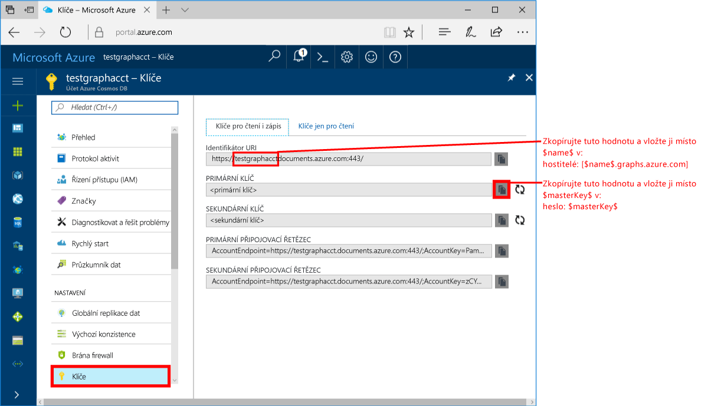
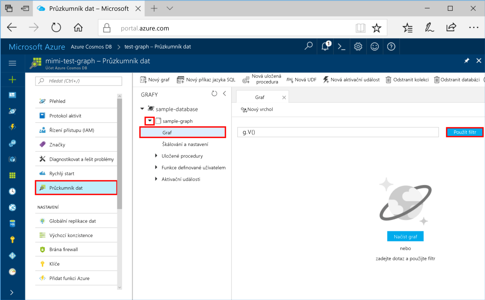
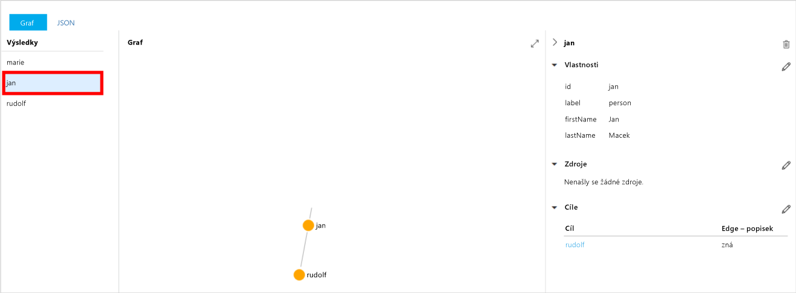
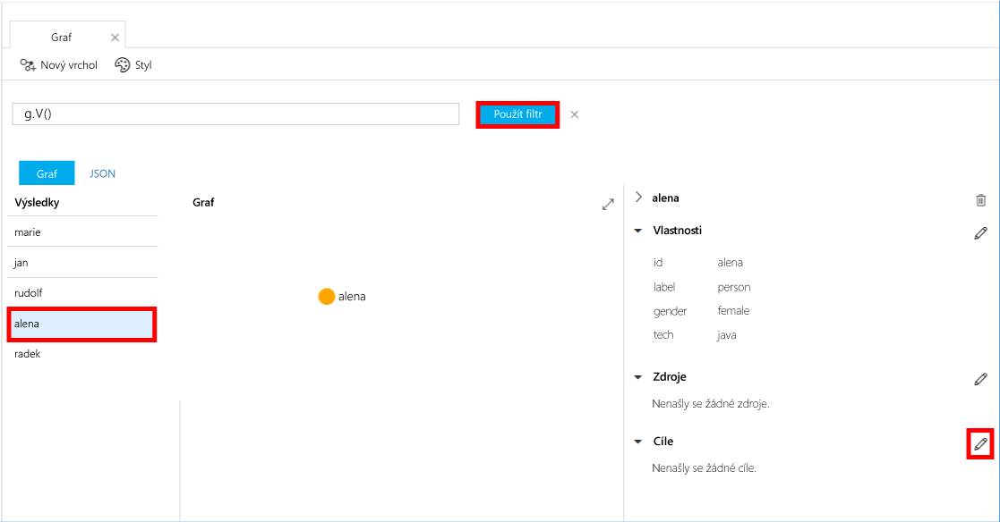
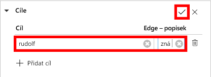
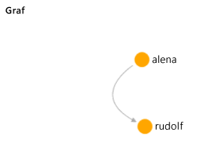

# <a name="azure-cosmos-db-create-a-graph-database-using-java-and-hello-azure-portal"></a><span data-ttu-id="62c8c-103">Azure Cosmos DB: Vytvoření databáze grafu pomocí Java a hello portálu Azure</span><span class="sxs-lookup"><span data-stu-id="62c8c-103">Azure Cosmos DB: Create a graph database using Java and hello Azure portal</span></span>

<span data-ttu-id="62c8c-104">Databáze Azure Cosmos je databázová služba Microsoftu s více modely použitelná v celosvětovém měřítku.</span><span class="sxs-lookup"><span data-stu-id="62c8c-104">Azure Cosmos DB is Microsoft’s globally distributed multi-model database service.</span></span> <span data-ttu-id="62c8c-105">Můžete rychle vytvořit a dotazovat dokumentu, klíč/hodnota a graf databází, které těžit z globální distribuční hello a možnosti vodorovné škálování jádrem hello Azure Cosmos DB.</span><span class="sxs-lookup"><span data-stu-id="62c8c-105">You can quickly create and query document, key/value, and graph databases, all of which benefit from hello global distribution and horizontal scale capabilities at hello core of Azure Cosmos DB.</span></span> 

<span data-ttu-id="62c8c-106">Tento rychlý start vytvoří graf databázi pomocí hello nástroje Azure portálu pro Azure Cosmos DB.</span><span class="sxs-lookup"><span data-stu-id="62c8c-106">This quickstart creates a graph database using hello Azure portal tools for Azure Cosmos DB.</span></span> <span data-ttu-id="62c8c-107">Tento rychlý start také ukazuje, jak vytvořit tooquickly konzolovou aplikaci Java pomocí graf databázi pomocí hello OSS [Gremlin Java](https://mvnrepository.com/artifact/org.apache.tinkerpop/gremlin-driver) ovladačů.</span><span class="sxs-lookup"><span data-stu-id="62c8c-107">This quickstart also shows you how tooquickly create a Java console app using a graph database using hello OSS [Gremlin Java](https://mvnrepository.com/artifact/org.apache.tinkerpop/gremlin-driver) driver.</span></span> <span data-ttu-id="62c8c-108">Hello pokyny v tento rychlý start platí pro všechny operační systémy, které podporují Javu.</span><span class="sxs-lookup"><span data-stu-id="62c8c-108">hello instructions in this quickstart can be followed on any operating system that is capable of running Java.</span></span> <span data-ttu-id="62c8c-109">Tento rychlý start vás seznámí s vytvoření a úprava prostředků grafu v hello uživatelského rozhraní nebo prostřednictvím kódu programu, podle toho, co je vaši volbu.</span><span class="sxs-lookup"><span data-stu-id="62c8c-109">This quickstart familiarizes you with creating and modifying graph resources in either hello UI or programmatically, whichever is your preference.</span></span> 

## <a name="prerequisites"></a><span data-ttu-id="62c8c-110">Požadavky</span><span class="sxs-lookup"><span data-stu-id="62c8c-110">Prerequisites</span></span>

* [<span data-ttu-id="62c8c-111">Java Development Kit (JDK) 1.7+</span><span class="sxs-lookup"><span data-stu-id="62c8c-111">Java Development Kit (JDK) 1.7+</span></span>](http://www.oracle.com/technetwork/java/javase/downloads/jdk8-downloads-2133151.html)
    * <span data-ttu-id="62c8c-112">Ubuntu, spusťte `apt-get install default-jdk` tooinstall hello JDK.</span><span class="sxs-lookup"><span data-stu-id="62c8c-112">On Ubuntu, run `apt-get install default-jdk` tooinstall hello JDK.</span></span>
    * <span data-ttu-id="62c8c-113">Být jisti tooset hello JAVA_HOME prostředí proměnné toopoint toohello složka nainstalovanou hello JDK.</span><span class="sxs-lookup"><span data-stu-id="62c8c-113">Be sure tooset hello JAVA_HOME environment variable toopoint toohello folder where hello JDK is installed.</span></span>
* <span data-ttu-id="62c8c-114">[Stáhněte](http://maven.apache.org/download.cgi) a [nainstalujte](http://maven.apache.org/install.html) binární archiv [Maven](http://maven.apache.org/).</span><span class="sxs-lookup"><span data-stu-id="62c8c-114">[Download](http://maven.apache.org/download.cgi) and [install](http://maven.apache.org/install.html) a [Maven](http://maven.apache.org/) binary archive</span></span>
    * <span data-ttu-id="62c8c-115">Na Ubuntu, můžete spustit `apt-get install maven` tooinstall Maven.</span><span class="sxs-lookup"><span data-stu-id="62c8c-115">On Ubuntu, you can run `apt-get install maven` tooinstall Maven.</span></span>
* [<span data-ttu-id="62c8c-116">Git</span><span class="sxs-lookup"><span data-stu-id="62c8c-116">Git</span></span>](https://www.git-scm.com/)
    * <span data-ttu-id="62c8c-117">Na Ubuntu, můžete spustit `sudo apt-get install git` tooinstall Git.</span><span class="sxs-lookup"><span data-stu-id="62c8c-117">On Ubuntu, you can run `sudo apt-get install git` tooinstall Git.</span></span>

[!INCLUDE [quickstarts-free-trial-note](../../includes/quickstarts-free-trial-note.md)]

## <a name="create-a-database-account"></a><span data-ttu-id="62c8c-118">Vytvoření účtu databáze</span><span class="sxs-lookup"><span data-stu-id="62c8c-118">Create a database account</span></span>

<span data-ttu-id="62c8c-119">Před vytvořením grafu databáze, musíte toocreate databázového účtu Gremlin (grafu) s Azure Cosmos DB.</span><span class="sxs-lookup"><span data-stu-id="62c8c-119">Before you can create a graph database, you need toocreate a Gremlin (Graph) database account with Azure Cosmos DB.</span></span>

[!INCLUDE [cosmos-db-create-dbaccount-graph](../../includes/cosmos-db-create-dbaccount-graph.md)]

## <a name="add-a-graph"></a><span data-ttu-id="62c8c-120">Přidání grafu</span><span class="sxs-lookup"><span data-stu-id="62c8c-120">Add a graph</span></span>

<span data-ttu-id="62c8c-121">Teď můžete použít nástroj Průzkumník dat hello v hello Azure portálu toocreate databázi grafu.</span><span class="sxs-lookup"><span data-stu-id="62c8c-121">You can now use hello Data Explorer tool in hello Azure portal toocreate a graph database.</span></span> 

1. <span data-ttu-id="62c8c-122">V hello portál Azure, v nabídce hello navigaci vlevo, klikněte na **Data Explorer (Preview)**.</span><span class="sxs-lookup"><span data-stu-id="62c8c-122">In hello Azure portal, in hello left navigation menu, click **Data Explorer (Preview)**.</span></span> 
2. <span data-ttu-id="62c8c-123">V hello **Data Explorer (Preview)** okně klikněte na tlačítko **nový graf**, potom vyplňte stránku hello pomocí hello následující informace:</span><span class="sxs-lookup"><span data-stu-id="62c8c-123">In hello **Data Explorer (Preview)** blade, click **New Graph**, then fill in hello page using hello following information:</span></span>

    

    <span data-ttu-id="62c8c-125">Nastavení</span><span class="sxs-lookup"><span data-stu-id="62c8c-125">Setting</span></span>|<span data-ttu-id="62c8c-126">Navrhovaná hodnota</span><span class="sxs-lookup"><span data-stu-id="62c8c-126">Suggested value</span></span>|<span data-ttu-id="62c8c-127">Popis</span><span class="sxs-lookup"><span data-stu-id="62c8c-127">Description</span></span>
    ---|---|---
    <span data-ttu-id="62c8c-128">ID databáze</span><span class="sxs-lookup"><span data-stu-id="62c8c-128">Database ID</span></span>|<span data-ttu-id="62c8c-129">sample-database</span><span class="sxs-lookup"><span data-stu-id="62c8c-129">sample-database</span></span>|<span data-ttu-id="62c8c-130">Hello ID pro novou databázi.</span><span class="sxs-lookup"><span data-stu-id="62c8c-130">hello ID for your new database.</span></span> <span data-ttu-id="62c8c-131">Názvy databází musí mít délku 1 až 255 znaků a nesmí obsahovat znaky `/ \ # ?` ani koncové mezery.</span><span class="sxs-lookup"><span data-stu-id="62c8c-131">Database names must be between 1 and 255 characters, and cannot contain `/ \ # ?` or a trailing space.</span></span>
    <span data-ttu-id="62c8c-132">ID grafu</span><span class="sxs-lookup"><span data-stu-id="62c8c-132">Graph ID</span></span>|<span data-ttu-id="62c8c-133">sample-graph</span><span class="sxs-lookup"><span data-stu-id="62c8c-133">sample-graph</span></span>|<span data-ttu-id="62c8c-134">Hello ID pro nový graf.</span><span class="sxs-lookup"><span data-stu-id="62c8c-134">hello ID for your new graph.</span></span> <span data-ttu-id="62c8c-135">Názvy grafu mají hello znak stejné požadavky jako ID databáze.</span><span class="sxs-lookup"><span data-stu-id="62c8c-135">Graph names have hello same character requirements as database ids.</span></span>
    <span data-ttu-id="62c8c-136">Kapacita úložiště</span><span class="sxs-lookup"><span data-stu-id="62c8c-136">Storage Capacity</span></span>| <span data-ttu-id="62c8c-137">10 GB</span><span class="sxs-lookup"><span data-stu-id="62c8c-137">10 GB</span></span>|<span data-ttu-id="62c8c-138">Ponechte výchozí hodnotu hello.</span><span class="sxs-lookup"><span data-stu-id="62c8c-138">Leave hello default value.</span></span> <span data-ttu-id="62c8c-139">Toto je kapacita úložiště hello hello databáze.</span><span class="sxs-lookup"><span data-stu-id="62c8c-139">This is hello storage capacity of hello database.</span></span>
    <span data-ttu-id="62c8c-140">Propustnost</span><span class="sxs-lookup"><span data-stu-id="62c8c-140">Throughput</span></span>|<span data-ttu-id="62c8c-141">400 RU/s</span><span class="sxs-lookup"><span data-stu-id="62c8c-141">400 RUs</span></span>|<span data-ttu-id="62c8c-142">Ponechte výchozí hodnotu hello.</span><span class="sxs-lookup"><span data-stu-id="62c8c-142">Leave hello default value.</span></span> <span data-ttu-id="62c8c-143">Je možné škálovat nahoru propustnost hello později Pokud chcete, aby tooreduce latence.</span><span class="sxs-lookup"><span data-stu-id="62c8c-143">You can scale up hello throughput later if you want tooreduce latency.</span></span>
    <span data-ttu-id="62c8c-144">Klíč oddílu</span><span class="sxs-lookup"><span data-stu-id="62c8c-144">Partition key</span></span>|<span data-ttu-id="62c8c-145">Ponechte prázdné</span><span class="sxs-lookup"><span data-stu-id="62c8c-145">Leave blank</span></span>|<span data-ttu-id="62c8c-146">Za účelem hello tento rychlý start nezadáte klíč oddílu hello.</span><span class="sxs-lookup"><span data-stu-id="62c8c-146">For hello purpose of this quickstart, leave hello partition key blank.</span></span>

3. <span data-ttu-id="62c8c-147">Jakmile vyplňování formuláře hello, klikněte na možnost **OK**.</span><span class="sxs-lookup"><span data-stu-id="62c8c-147">Once hello form is filled out, click **OK**.</span></span>

## <a name="clone-hello-sample-application"></a><span data-ttu-id="62c8c-148">Klonování hello ukázkové aplikace</span><span class="sxs-lookup"><span data-stu-id="62c8c-148">Clone hello sample application</span></span>

<span data-ttu-id="62c8c-149">Nyní Pojďme klonovat grafu aplikace z githubu, nastavte hello připojovací řetězec a spusťte ho.</span><span class="sxs-lookup"><span data-stu-id="62c8c-149">Now let's clone a graph app from github, set hello connection string, and run it.</span></span> <span data-ttu-id="62c8c-150">Uvidíte, jak je snadné toowork s daty prostřednictvím kódu programu.</span><span class="sxs-lookup"><span data-stu-id="62c8c-150">You see how easy it is toowork with data programmatically.</span></span> 

1. <span data-ttu-id="62c8c-151">Otevřete okno terminálu git, jako je například git bash a `cd` tooa pracovní adresář.</span><span class="sxs-lookup"><span data-stu-id="62c8c-151">Open a git terminal window, such as git bash, and `cd` tooa working directory.</span></span>  

2. <span data-ttu-id="62c8c-152">Spusťte následující příkaz tooclone hello Ukázka úložiště hello.</span><span class="sxs-lookup"><span data-stu-id="62c8c-152">Run hello following command tooclone hello sample repository.</span></span> 

    ```bash
    git clone https://github.com/Azure-Samples/azure-cosmos-db-graph-java-getting-started.git
    ```

## <a name="review-hello-code"></a><span data-ttu-id="62c8c-153">Zkontrolujte hello kódu</span><span class="sxs-lookup"><span data-stu-id="62c8c-153">Review hello code</span></span>

<span data-ttu-id="62c8c-154">Provedeme jejich stručný přehled o dění v aplikaci hello.</span><span class="sxs-lookup"><span data-stu-id="62c8c-154">Let's make a quick review of what's happening in hello app.</span></span> <span data-ttu-id="62c8c-155">Otevřete hello `Program.java` soubor ze složky \src\GetStarted hello a najděte tyto řádky kódu.</span><span class="sxs-lookup"><span data-stu-id="62c8c-155">Open hello `Program.java` file from hello \src\GetStarted folder and find these lines of code.</span></span> 

* <span data-ttu-id="62c8c-156">Hello Gremlin `Client` je inicializován ze hello konfigurace v `src/remote.yaml`.</span><span class="sxs-lookup"><span data-stu-id="62c8c-156">hello Gremlin `Client` is initialized from hello configuration in `src/remote.yaml`.</span></span>

    ```java
    cluster = Cluster.build(new File("src/remote.yaml")).create();
    ...
    client = cluster.connect();
    ```

* <span data-ttu-id="62c8c-157">Sérii kroků Gremlin jsou spouštěny pomocí hello `client.submit` metoda.</span><span class="sxs-lookup"><span data-stu-id="62c8c-157">A series of Gremlin steps are executed using hello `client.submit` method.</span></span>

    ```java
    ResultSet results = client.submit(gremlin);

    CompletableFuture<List<Result>> completableFutureResults = results.all();
    List<Result> resultList = completableFutureResults.get();

    for (Result result : resultList) {
        System.out.println(result.toString());
    }
    ```

## <a name="update-your-connection-string"></a><span data-ttu-id="62c8c-158">Aktualizace připojovacího řetězce</span><span class="sxs-lookup"><span data-stu-id="62c8c-158">Update your connection string</span></span>

1. <span data-ttu-id="62c8c-159">Otevřete hello src/remote.yaml soubor.</span><span class="sxs-lookup"><span data-stu-id="62c8c-159">Open hello src/remote.yaml file.</span></span> 

3. <span data-ttu-id="62c8c-160">Vyplňte vaše *hostitele*, *uživatelské jméno*, a *heslo* hodnot v souboru src/remote.yaml hello.</span><span class="sxs-lookup"><span data-stu-id="62c8c-160">Fill in your *hosts*, *username*, and *password* values in hello src/remote.yaml file.</span></span> <span data-ttu-id="62c8c-161">Hello zbytek hello nastavení nemusí toobe změnit.</span><span class="sxs-lookup"><span data-stu-id="62c8c-161">hello rest of hello settings do not need toobe changed.</span></span>

    <span data-ttu-id="62c8c-162">Nastavení</span><span class="sxs-lookup"><span data-stu-id="62c8c-162">Setting</span></span>|<span data-ttu-id="62c8c-163">Navrhovaná hodnota</span><span class="sxs-lookup"><span data-stu-id="62c8c-163">Suggested value</span></span>|<span data-ttu-id="62c8c-164">Popis</span><span class="sxs-lookup"><span data-stu-id="62c8c-164">Description</span></span>
    ---|---|---
    <span data-ttu-id="62c8c-165">Hostitelé</span><span class="sxs-lookup"><span data-stu-id="62c8c-165">Hosts</span></span>|<span data-ttu-id="62c8c-166">[***.graphs.azure.com]</span><span class="sxs-lookup"><span data-stu-id="62c8c-166">[***.graphs.azure.com]</span></span>|<span data-ttu-id="62c8c-167">Podívejte se na snímek obrazovky hello za touto tabulkou.</span><span class="sxs-lookup"><span data-stu-id="62c8c-167">See hello screenshot following this table.</span></span> <span data-ttu-id="62c8c-168">Tato hodnota je hodnota identifikátoru URI Gremlin hello na stránce Přehled hello hello portál Azure, v hranatých závorkách s koncové hello: 443 / odebrané.</span><span class="sxs-lookup"><span data-stu-id="62c8c-168">This value is hello Gremlin URI value on hello Overview page of hello Azure portal, in square brackets, with hello trailing :443/ removed.</span></span><br><br><span data-ttu-id="62c8c-169">Tuto hodnotu můžete také načíst z karty hello klíče, hodnota identifikátoru URI hello pomocí odebrání https://, změna toographs dokumenty a odebrání hello koncové: 443 /.</span><span class="sxs-lookup"><span data-stu-id="62c8c-169">This value can also be retrieved from hello Keys tab, using hello URI value by removing https://, changing documents toographs, and removing hello trailing :443/.</span></span>
    <span data-ttu-id="62c8c-170">Uživatelské jméno</span><span class="sxs-lookup"><span data-stu-id="62c8c-170">Username</span></span>|<span data-ttu-id="62c8c-171">/dbs/sample-database/colls/sample-graph</span><span class="sxs-lookup"><span data-stu-id="62c8c-171">/dbs/sample-database/colls/sample-graph</span></span>|<span data-ttu-id="62c8c-172">Hello prostředků hello formuláře `/dbs/<db>/colls/<coll>` kde `<db>` je název vaší existující databáze a `<coll>` je název vaší existující kolekci.</span><span class="sxs-lookup"><span data-stu-id="62c8c-172">hello resource of hello form `/dbs/<db>/colls/<coll>` where `<db>` is your existing database name and `<coll>` is your existing collection name.</span></span>
    <span data-ttu-id="62c8c-173">Heslo</span><span class="sxs-lookup"><span data-stu-id="62c8c-173">Password</span></span>|<span data-ttu-id="62c8c-174">*Primární hlavní klíč*</span><span class="sxs-lookup"><span data-stu-id="62c8c-174">*Your primary master key*</span></span>|<span data-ttu-id="62c8c-175">Podívejte se na hello druhý snímek obrazovky za touto tabulkou.</span><span class="sxs-lookup"><span data-stu-id="62c8c-175">See hello second screenshot following this table.</span></span> <span data-ttu-id="62c8c-176">Tato hodnota je primární klíč, který může načíst ze stránky klíče hello hello portál Azure, v poli hello primární klíč.</span><span class="sxs-lookup"><span data-stu-id="62c8c-176">This value is your primary key, which you can retrieve from hello Keys page of hello Azure portal, in hello Primary Key box.</span></span> <span data-ttu-id="62c8c-177">Zkopírujte hodnotu hello pomocí hello tlačítko Kopírovat na pravé straně hello hello pole.</span><span class="sxs-lookup"><span data-stu-id="62c8c-177">Copy hello value using hello copy button on hello right side of hello box.</span></span>

    <span data-ttu-id="62c8c-178">Pro hodnotu hello hostitele, zkopírujte hello **Gremlin URI** hodnotu z hello **přehled** stránky.</span><span class="sxs-lookup"><span data-stu-id="62c8c-178">For hello Hosts value, copy hello **Gremlin URI** value from hello **Overview** page.</span></span> <span data-ttu-id="62c8c-179">Pokud je prázdná, najdete v pokynech hello v řádku hello hostitelů v předcházející tabulce o vytváření hello Gremlin URI z okna klíče hello hello.</span><span class="sxs-lookup"><span data-stu-id="62c8c-179">If it's empty, see hello instructions in hello Hosts row in hello preceding table about creating hello Gremlin URI from hello Keys blade.</span></span>
<span data-ttu-id="62c8c-180"></span><span class="sxs-lookup"><span data-stu-id="62c8c-180"></span></span>

    <span data-ttu-id="62c8c-181">Pro hello hodnota hesla, zkopírujte hello **primární klíč** z hello **klíče** okno: </span><span class="sxs-lookup"><span data-stu-id="62c8c-181">For hello Password value, copy hello **Primary key** from hello **Keys** blade: </span></span>

## <a name="run-hello-console-app"></a><span data-ttu-id="62c8c-182">Spusťte konzolovou aplikaci hello</span><span class="sxs-lookup"><span data-stu-id="62c8c-182">Run hello console app</span></span>

1. <span data-ttu-id="62c8c-183">V okně terminálu hello git `cd` toohello azure-cosmos-db-graph-java-getting-started složky.</span><span class="sxs-lookup"><span data-stu-id="62c8c-183">In hello git terminal window, `cd` toohello azure-cosmos-db-graph-java-getting-started folder.</span></span>

2. <span data-ttu-id="62c8c-184">Zadejte v okně terminálu hello git, `mvn package` tooinstall hello požadované balíčky jazyka Java.</span><span class="sxs-lookup"><span data-stu-id="62c8c-184">In hello git terminal window, type `mvn package` tooinstall hello required Java packages.</span></span>

3. <span data-ttu-id="62c8c-185">Okno terminálu hello git, spusťte `mvn exec:java -D exec.mainClass=GetStarted.Program` hello okno terminálu toostart aplikace v jazyce Java.</span><span class="sxs-lookup"><span data-stu-id="62c8c-185">In hello git terminal window, run `mvn exec:java -D exec.mainClass=GetStarted.Program` in hello terminal window toostart your Java application.</span></span>

<span data-ttu-id="62c8c-186">Zobrazí okno terminálu Hello hello vrcholy přidávané toohello grafu.</span><span class="sxs-lookup"><span data-stu-id="62c8c-186">hello terminal window displays hello vertices being added toohello graph.</span></span> <span data-ttu-id="62c8c-187">Po dokončení programu hello přepněte zpět toohello portálu Azure v internetovém prohlížeči.</span><span class="sxs-lookup"><span data-stu-id="62c8c-187">Once hello program completes, switch back toohello Azure portal in your internet browser.</span></span> 

<a id="add-sample-data"></a>
## <a name="review-and-add-sample-data"></a><span data-ttu-id="62c8c-188">Kontrola a přidání ukázkových dat</span><span class="sxs-lookup"><span data-stu-id="62c8c-188">Review and add sample data</span></span>

<span data-ttu-id="62c8c-189">Teď můžete přejít zpět tooData Průzkumníka a vrcholy hello přidat graf toohello a přidat další datové body.</span><span class="sxs-lookup"><span data-stu-id="62c8c-189">You can now go back tooData Explorer and see hello vertices added toohello graph, and add additional data points.</span></span>

1. <span data-ttu-id="62c8c-190">V Průzkumníku dat rozbalte hello **ukázkové databáze**/**Ukázka grafu**, klikněte na tlačítko **grafu**a pak klikněte na tlačítko **použít filtr**.</span><span class="sxs-lookup"><span data-stu-id="62c8c-190">In Data Explorer, expand hello **sample-database**/**sample-graph**, click **Graph**, and then click **Apply Filter**.</span></span> 

   

2. <span data-ttu-id="62c8c-192">V hello **výsledky** seznamu si všimněte, přidat nové uživatele hello toohello grafu.</span><span class="sxs-lookup"><span data-stu-id="62c8c-192">In hello **Results** list, notice hello new users added toohello graph.</span></span> <span data-ttu-id="62c8c-193">Vyberte **ben** a Všimněte si, že mu byl připojen toorobin.</span><span class="sxs-lookup"><span data-stu-id="62c8c-193">Select **ben** and notice that he's connected toorobin.</span></span> <span data-ttu-id="62c8c-194">Můžete pohyb hello vrcholy na Průzkumníka hello grafu, přiblížení a oddálení a rozbalit hello velikost hello grafu explorer prostor.</span><span class="sxs-lookup"><span data-stu-id="62c8c-194">You can move hello vertices around on hello graph explorer, zoom in and out, and expand hello size of hello graph explorer surface.</span></span> 

   

3. <span data-ttu-id="62c8c-196">Umožňuje přidat pár nový graf toohello uživatele pomocí Průzkumníku dat hello.</span><span class="sxs-lookup"><span data-stu-id="62c8c-196">Let's add a few new users toohello graph using hello Data Explorer.</span></span> <span data-ttu-id="62c8c-197">Klikněte na tlačítko hello **nový vrchol** tlačítko tooadd data tooyour grafu.</span><span class="sxs-lookup"><span data-stu-id="62c8c-197">Click hello **New Vertex** button tooadd data tooyour graph.</span></span>

   

4. <span data-ttu-id="62c8c-199">Zadejte popisek z *osoba* zadejte hello následující klíče a hodnoty toocreate hello první vrchol v grafu hello.</span><span class="sxs-lookup"><span data-stu-id="62c8c-199">Enter a label of *person* then enter hello following keys and values toocreate hello first vertex in hello graph.</span></span> <span data-ttu-id="62c8c-200">Všimněte si, že pro každou osobu v grafu můžete vytvořit jedinečné vlastnosti.</span><span class="sxs-lookup"><span data-stu-id="62c8c-200">Notice that you can create unique properties for each person in your graph.</span></span> <span data-ttu-id="62c8c-201">Je vyžadován pouze klíč id hello.</span><span class="sxs-lookup"><span data-stu-id="62c8c-201">Only hello id key is required.</span></span>

    <span data-ttu-id="62c8c-202">key</span><span class="sxs-lookup"><span data-stu-id="62c8c-202">key</span></span>|<span data-ttu-id="62c8c-203">hodnota</span><span class="sxs-lookup"><span data-stu-id="62c8c-203">value</span></span>|<span data-ttu-id="62c8c-204">Poznámky</span><span class="sxs-lookup"><span data-stu-id="62c8c-204">Notes</span></span>
    ----|----|----
    <span data-ttu-id="62c8c-205">id</span><span class="sxs-lookup"><span data-stu-id="62c8c-205">id</span></span>|<span data-ttu-id="62c8c-206">ashley</span><span class="sxs-lookup"><span data-stu-id="62c8c-206">ashley</span></span>|<span data-ttu-id="62c8c-207">Hello jedinečný identifikátor pro vrchol hello.</span><span class="sxs-lookup"><span data-stu-id="62c8c-207">hello unique identifier for hello vertex.</span></span> <span data-ttu-id="62c8c-208">Pokud identifikátor nezadáte, vygeneruje se pro vás.</span><span class="sxs-lookup"><span data-stu-id="62c8c-208">If you don't specify an id, one is generated for you.</span></span>
    <span data-ttu-id="62c8c-209">gender (pohlaví)</span><span class="sxs-lookup"><span data-stu-id="62c8c-209">gender</span></span>|<span data-ttu-id="62c8c-210">female (žena)</span><span class="sxs-lookup"><span data-stu-id="62c8c-210">female</span></span>| 
    <span data-ttu-id="62c8c-211">tech (technologie)</span><span class="sxs-lookup"><span data-stu-id="62c8c-211">tech</span></span> | <span data-ttu-id="62c8c-212">java</span><span class="sxs-lookup"><span data-stu-id="62c8c-212">java</span></span> | 

    > [!NOTE]
    > <span data-ttu-id="62c8c-213">V tomto rychlém startu vytváříme kolekci bez oddílů.</span><span class="sxs-lookup"><span data-stu-id="62c8c-213">In this quickstart we create a non-partitioned collection.</span></span> <span data-ttu-id="62c8c-214">Ale pokud vytvoříte tak, že zadáte klíč oddílu během vytváření kolekce hello dělenou kolekci, budete potřebovat klíč oddílu hello tooinclude jako klíč v každé nové vrchol.</span><span class="sxs-lookup"><span data-stu-id="62c8c-214">However, if you create a partitioned collection by specifying a partition key during hello collection creation, then you need tooinclude hello partition key as a key in each new vertex.</span></span> 

5. <span data-ttu-id="62c8c-215">Klikněte na **OK**.</span><span class="sxs-lookup"><span data-stu-id="62c8c-215">Click **OK**.</span></span> <span data-ttu-id="62c8c-216">Může být nutné tooexpand vaše obrazovky toosee **OK** na konci hello úvodní obrazovka.</span><span class="sxs-lookup"><span data-stu-id="62c8c-216">You may need tooexpand your screen toosee **OK** on hello bottom of hello screen.</span></span>

6. <span data-ttu-id="62c8c-217">Znovu klikněte na **Nový vrchol** a přidejte dalšího nového uživatele.</span><span class="sxs-lookup"><span data-stu-id="62c8c-217">Click **New Vertex** again and add an additional new user.</span></span> <span data-ttu-id="62c8c-218">Zadejte popisek z *osoba* zadejte hello následující klíče a hodnoty:</span><span class="sxs-lookup"><span data-stu-id="62c8c-218">Enter a label of *person* then enter hello following keys and values:</span></span>

    <span data-ttu-id="62c8c-219">key</span><span class="sxs-lookup"><span data-stu-id="62c8c-219">key</span></span>|<span data-ttu-id="62c8c-220">hodnota</span><span class="sxs-lookup"><span data-stu-id="62c8c-220">value</span></span>|<span data-ttu-id="62c8c-221">Poznámky</span><span class="sxs-lookup"><span data-stu-id="62c8c-221">Notes</span></span>
    ----|----|----
    <span data-ttu-id="62c8c-222">id</span><span class="sxs-lookup"><span data-stu-id="62c8c-222">id</span></span>|<span data-ttu-id="62c8c-223">rakesh</span><span class="sxs-lookup"><span data-stu-id="62c8c-223">rakesh</span></span>|<span data-ttu-id="62c8c-224">Hello jedinečný identifikátor pro vrchol hello.</span><span class="sxs-lookup"><span data-stu-id="62c8c-224">hello unique identifier for hello vertex.</span></span> <span data-ttu-id="62c8c-225">Pokud identifikátor nezadáte, vygeneruje se pro vás.</span><span class="sxs-lookup"><span data-stu-id="62c8c-225">If you don't specify an id, one is generated for you.</span></span>
    <span data-ttu-id="62c8c-226">gender (pohlaví)</span><span class="sxs-lookup"><span data-stu-id="62c8c-226">gender</span></span>|<span data-ttu-id="62c8c-227">male (muž)</span><span class="sxs-lookup"><span data-stu-id="62c8c-227">male</span></span>| 
    <span data-ttu-id="62c8c-228">school (škola)</span><span class="sxs-lookup"><span data-stu-id="62c8c-228">school</span></span>|<span data-ttu-id="62c8c-229">MIT</span><span class="sxs-lookup"><span data-stu-id="62c8c-229">MIT</span></span>| 

7. <span data-ttu-id="62c8c-230">Klikněte na **OK**.</span><span class="sxs-lookup"><span data-stu-id="62c8c-230">Click **OK**.</span></span> 

8. <span data-ttu-id="62c8c-231">Klikněte na tlačítko **použít filtr** hello výchozí `g.V()` filtru.</span><span class="sxs-lookup"><span data-stu-id="62c8c-231">Click **Apply Filter** with hello default `g.V()` filter.</span></span> <span data-ttu-id="62c8c-232">Všichni uživatelé hello nyní zobrazit ve hello **výsledky** seznamu.</span><span class="sxs-lookup"><span data-stu-id="62c8c-232">All of hello users now show in hello **Results** list.</span></span> <span data-ttu-id="62c8c-233">Při přidávání více dat, můžete použít filtry toolimit výsledky.</span><span class="sxs-lookup"><span data-stu-id="62c8c-233">As you add more data, you can use filters toolimit your results.</span></span> <span data-ttu-id="62c8c-234">Ve výchozím Průzkumníku dat používá `g.V()` tooretrieve všechny vrcholy grafu, ale můžete změnit této tooa jiný [grafu dotazu](tutorial-query-graph.md), například `g.V().count()`, tooreturn počet všechny vrcholy hello v grafu hello ve formátu JSON.</span><span class="sxs-lookup"><span data-stu-id="62c8c-234">By default, Data Explorer uses `g.V()` tooretrieve all vertices in a graph, but you can change that tooa different [graph query](tutorial-query-graph.md), such as `g.V().count()`, tooreturn a count of all hello vertices in hello graph in JSON format.</span></span>

9. <span data-ttu-id="62c8c-235">Teď můžeme propojit uživatele rakesh a ashley.</span><span class="sxs-lookup"><span data-stu-id="62c8c-235">Now we can connect rakesh and ashley.</span></span> <span data-ttu-id="62c8c-236">Ujistěte se, **pracovník Novák** ve vybraných v hello **výsledky** seznamu a pak klikněte na tlačítko Upravit hello vedle příliš**cíle** na pravé straně nižší.</span><span class="sxs-lookup"><span data-stu-id="62c8c-236">Ensure **ashley** in selected in hello **Results** list, then click hello edit button next too**Targets** on lower right side.</span></span> <span data-ttu-id="62c8c-237">Může být nutné toowiden vaše hello toosee okno **vlastnosti** oblasti.</span><span class="sxs-lookup"><span data-stu-id="62c8c-237">You may need toowiden your window toosee hello **Properties** area.</span></span>

   

10. <span data-ttu-id="62c8c-239">V hello **cíl** zadejte *rakesh*a v hello **Edge popisek** zadejte *zná*a potom klikněte na zaškrtávací políčko hello.</span><span class="sxs-lookup"><span data-stu-id="62c8c-239">In hello **Target** box type *rakesh*, and in hello **Edge label** box type *knows*, and then click hello check box.</span></span>

   

11. <span data-ttu-id="62c8c-241">Nyní vyberte **rakesh** z seznam výsledků hello a zjistit, zda pracovník Novák a rakesh propojeni.</span><span class="sxs-lookup"><span data-stu-id="62c8c-241">Now select **rakesh** from hello results list and see that ashley and rakesh are connected.</span></span> 

   

    <span data-ttu-id="62c8c-243">Můžete také použít Průzkumníku dat toocreate uložené procedury, funkce UDF a aktivační události tooperform serverovou obchodní logiku také jako propustnost škálování.</span><span class="sxs-lookup"><span data-stu-id="62c8c-243">You can also use Data Explorer toocreate stored procedures, UDFs, and triggers tooperform server-side business logic as well as scale throughput.</span></span> <span data-ttu-id="62c8c-244">Průzkumník dat zpřístupní všechny hello předdefinované programový přístup k datům v hello rozhraní API k dispozici, ale poskytuje snadný přístup k datům tooyour v hello portálu Azure.</span><span class="sxs-lookup"><span data-stu-id="62c8c-244">Data Explorer exposes all of hello built-in programmatic data access available in hello APIs, but provides easy access tooyour data in hello Azure portal.</span></span>


## <a name="review-slas-in-hello-azure-portal"></a><span data-ttu-id="62c8c-245">Zkontrolujte SLA v hello portálu Azure</span><span class="sxs-lookup"><span data-stu-id="62c8c-245">Review SLAs in hello Azure portal</span></span>

[!INCLUDE [cosmosdb-tutorial-review-slas](../../includes/cosmos-db-tutorial-review-slas.md)]

## <a name="clean-up-resources"></a><span data-ttu-id="62c8c-246">Vyčištění prostředků</span><span class="sxs-lookup"><span data-stu-id="62c8c-246">Clean up resources</span></span>

<span data-ttu-id="62c8c-247">Pokud ale nebudete toocontinue toouse této aplikace, odstraňte všechny prostředky, které jsou vytvořené tento rychlý start v hello portál Azure s hello následující kroky:</span><span class="sxs-lookup"><span data-stu-id="62c8c-247">If you're not going toocontinue toouse this app, delete all resources created by this quickstart in hello Azure portal with hello following steps:</span></span> 

1. <span data-ttu-id="62c8c-248">V levé nabídce hello v hello portálu Azure klikněte na **skupiny prostředků** a pak klikněte na název hello hello prostředků, které jste vytvořili.</span><span class="sxs-lookup"><span data-stu-id="62c8c-248">From hello left-hand menu in hello Azure portal, click **Resource groups** and then click hello name of hello resource you created.</span></span> 
2. <span data-ttu-id="62c8c-249">Na stránce skupiny prostředků, klikněte na tlačítko **odstranit**hello textového pole zadejte název hello toodelete hello prostředků a pak klikněte na tlačítko **odstranit**.</span><span class="sxs-lookup"><span data-stu-id="62c8c-249">On your resource group page, click **Delete**, type hello name of hello resource toodelete in hello text box, and then click **Delete**.</span></span>

## <a name="next-steps"></a><span data-ttu-id="62c8c-250">Další kroky</span><span class="sxs-lookup"><span data-stu-id="62c8c-250">Next steps</span></span>

<span data-ttu-id="62c8c-251">V tento rychlý start když jste se naučili toocreate účet Azure Cosmos DB vytvoření grafu pomocí hello Průzkumníku dat a spusťte aplikaci.</span><span class="sxs-lookup"><span data-stu-id="62c8c-251">In this quickstart, you've learned how toocreate an Azure Cosmos DB account, create a graph using hello Data Explorer, and run an app.</span></span> <span data-ttu-id="62c8c-252">Teď můžete pomocí konzoly Gremlin vytvářet složitější dotazy a implementovat účinnou logiku procházení grafů.</span><span class="sxs-lookup"><span data-stu-id="62c8c-252">You can now build more complex queries and implement powerful graph traversal logic using Gremlin.</span></span> 

> [!div class="nextstepaction"]
> [<span data-ttu-id="62c8c-253">Dotazování pomocí konzoly Gremlin</span><span class="sxs-lookup"><span data-stu-id="62c8c-253">Query using Gremlin</span></span>](tutorial-query-graph.md)

