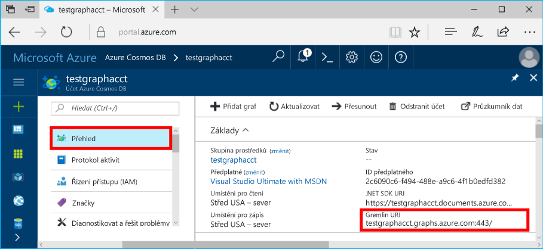

# <a name="azure-cosmos-db-build-a-nodejs-application-by-using-graph-api"></a>Databáze Azure Cosmos: Vytvoření aplikace Node.js využitím rozhraní Graph API

Azure Cosmos DB je služba více modelu databáze hello globálně distribuované od společnosti Microsoft. Můžete rychle vytvořit a dotazovat dokumentu, klíč/hodnota a graf databází, které těžit z globální distribuční hello a možnosti vodorovné škálování jádrem hello Azure Cosmos DB. 

Tento úvodní článek ukazuje, jak toocreate Azure DB Cosmos účet pro rozhraní Graph API (preview), databáze a grafu pomocí hello portálu Azure. Potom sestavit a spustit aplikaci konzoly pomocí hello open-source [Gremlin Node.js](https://www.npmjs.com/package/gremlin-secure) ovladačů.  

> [!NOTE]
> modul npm Hello `gremlin-secure` je upravenou verzi `gremlin` modul, se podpora pro protokol SSL a SASL požadované pro připojení k databázi Azure Cosmos. Zdrojový kód je k dispozici na [GitHubu](https://github.com/CosmosDB/gremlin-javascript).
>

## <a name="prerequisites"></a>Požadavky

Před spuštěním této ukázce, musíte mít hello následující požadavky:
* [Node.js](https://nodejs.org/en/) verze 0.10.29 nebo novější
* [Git](http://git-scm.com/)

[!INCLUDE [quickstarts-free-trial-note](../../includes/quickstarts-free-trial-note.md)]

## <a name="create-a-database-account"></a>Vytvoření účtu databáze

[!INCLUDE [cosmos-db-create-dbaccount-graph](../../includes/cosmos-db-create-dbaccount-graph.md)]

## <a name="add-a-graph"></a>Přidání grafu

[!INCLUDE [cosmos-db-create-graph](../../includes/cosmos-db-create-graph.md)]

## <a name="clone-hello-sample-application"></a>Klonování hello ukázkové aplikace

Teď umožňuje nastavit připojovací řetězec hello klonování rozhraní Graph API aplikace z Githubu a potom ho spusťte. Uvidíte, jak je snadné toowork s daty prostřednictvím kódu programu. 

1. Otevřete okno terminálu Git, jako je například Git Bash a změňte (prostřednictvím `cd` příkaz) tooa pracovní adresář.  

2. Spusťte následující příkaz tooclone hello Ukázka úložiště hello. 

    ```bash
    git clone https://github.com/Azure-Samples/azure-cosmos-db-graph-nodejs-getting-started.git
    ```

3. Otevřete soubor řešení hello v sadě Visual Studio. 

## <a name="review-hello-code"></a>Zkontrolujte hello kódu

Provedeme jejich stručný přehled o dění v aplikaci hello. Otevřete hello `app.js` soubor a najdete hello následující řádky kódu. 

* Vytvoří se klient Gremlin Hello.

    ```nodejs
    const client = Gremlin.createClient(
        443, 
        config.endpoint, 
        { 
            "session": false, 
            "ssl": true, 
            "user": `/dbs/${config.database}/colls/${config.collection}`,
            "password": config.primaryKey
        });
    ```

  Hello konfigurace jsou v `config.js`, který jsme upravit v následující části hello.

* Sérii kroků Gremlin jsou spouštěny s hello `client.execute` metoda.

    ```nodejs
    console.log('Running Count'); 
    client.execute("g.V().count()", { }, (err, results) => {
        if (err) return console.error(err);
        console.log(JSON.stringify(results));
        console.log();
    });
    ```

## <a name="update-your-connection-string"></a>Aktualizace připojovacího řetězce

1. Otevřete hello souboru config.js. 

2. V souboru config.js, vyplňte hello config.endpoint klíč s hello **Gremlin URI** hodnotu z hello **přehled** stránku hello portálu Azure. 

    `config.endpoint = "GRAPHENDPOINT";`

    

   Pokud hello **Gremlin URI** je hodnota prázdná, můžete z hello vygenerovat hello hodnotu **klíče** stránku hello portálu pomocí hello **URI** hodnotu, odebrání https:// a změna toographs dokumenty.

   Hello Gremlin koncový bod musí být jen název hostitele hello bez hello čísla portu nebo protokolu, jako je třeba `mygraphdb.graphs.azure.com` (ne `https://mygraphdb.graphs.azure.com` nebo `mygraphdb.graphs.azure.com:433`).

3. V souboru config.js, zadejte hodnotu config.primaryKey hello pomocí hello **primární klíč** hodnotu z hello **klíče** stránku hello portálu Azure. 

    `config.primaryKey = "PRIMARYKEY";`

   

4. Zadejte název databáze hello a název grafu (kontejner) pro hodnotu hello config.database a config.collection. 

Tady je příklad, jak by dokončený soubor config.js měl vypadat:

```nodejs
var config = {}

// Note that this must not have HTTPS or hello port number
config.endpoint = "testgraphacct.graphs.azure.com";
config.primaryKey = "Pams6e7LEUS7LJ2Qk0fjZf3eGo65JdMWHmyn65i52w8ozPX2oxY3iP0yu05t9v1WymAHNcMwPIqNAEv3XDFsEg==";
config.database = "graphdb"
config.collection = "Persons"

module.exports = config;
```

## <a name="run-hello-console-app"></a>Spusťte konzolovou aplikaci hello

1. Otevřete okno terminálu a změňte (prostřednictvím `cd` příkaz) toohello instalační adresář pro soubor package.json hello, který je součástí projektu hello.  

2. Spustit `npm install` tooinstall hello požadované moduly npm, včetně `gremlin-secure`.

3. Spustit `node app.js` v terminálu toostart aplikace uzlu.

## <a name="browse-with-data-explorer"></a>Procházení pomocí Průzkumníku dat

Teď můžete vrátit tooData Explorer v hello Azure portálu tooview, dotaz, upravit a pracovat s daty nový graf.

V Průzkumníku dat hello nové databáze se zobrazí v hello **grafy** podokně. Rozbalte databázi hello, za nímž následuje hello kolekce, a poté klikněte na tlačítko **grafu**.

Hello data generována hello ukázkové aplikace se zobrazí v další podokno hello v rámci hello **grafu** kartě po kliknutí na tlačítko **použít filtr**.

Zkuste dokončení `g.V()` s `.has('firstName', 'Thomas')` tootest hello filtru. Všimněte si, že hodnota hello je malá a velká písmena.

## <a name="review-slas-in-hello-azure-portal"></a>Zkontrolujte SLA v hello portálu Azure

[!INCLUDE [cosmosdb-tutorial-review-slas](../../includes/cosmos-db-tutorial-review-slas.md)]

## <a name="clean-up-your-resources"></a>Vyčištění prostředků

Pokud neplánujete toocontinue používání této aplikace, odstraňte všechny prostředky, které jste vytvořili v tomto článku díky hello následující: 

1. V hello portál Azure, v nabídce hello navigaci vlevo, klikněte na **skupiny prostředků**a potom klikněte na název hello hello prostředku, který jste vytvořili. 
2. Na stránce skupiny prostředků, klikněte na tlačítko **odstranit**, zadejte název hello toobe prostředků hello odstranit a pak klikněte na tlačítko **odstranit**.

## <a name="next-steps"></a>Další kroky

V tomto článku když jste se naučili toocreate účet Azure Cosmos DB vytvoření grafu pomocí Průzkumníku dat a spusťte aplikaci. Teď můžete pomocí konzoly Gremlin vytvářet složitější dotazy a implementovat účinnou logiku procházení grafů. 

> [!div class="nextstepaction"]
> [Dotazování pomocí konzoly Gremlin](tutorial-query-graph.md)
