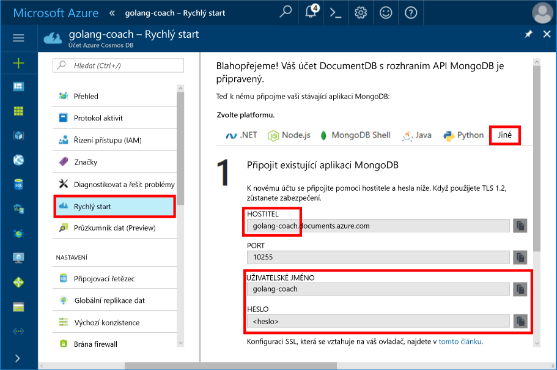
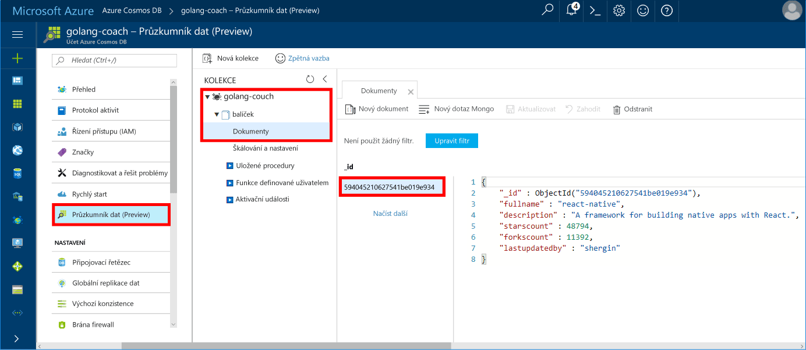

# <a name="azure-cosmos-db-build-a-mongodb-api-console-app-with-golang-and-hello-azure-portal"></a>Azure Cosmos DB: Vytvoření aplikace konzoly MongoDB rozhraní API s Golang a hello portálu Azure

Databáze Azure Cosmos je databázová služba Microsoftu s více modely použitelná v celosvětovém měřítku. Můžete rychle vytvořit a dotazovat dokumentu, klíč/hodnota a graf databází, které těžit z globální distribuční hello a možnosti vodorovné škálování jádrem hello Azure Cosmos DB.

Tento úvodní ukazuje, jak toouse existující [MongoDB](https://docs.microsoft.com/en-us/azure/cosmos-db/mongodb-introduction) aplikace napsané v [Golang](https://golang.org/) a připojte ho tooyour Azure Cosmos DB databáze, která podporuje připojení klienta MongoDB.

Jinými slovy aplikace Golang pouze ví, že se počítač připojuje tooa databáze pomocí rozhraní API MongoDB. Je transparentní toohello aplikace, která hello dat je uložen v Azure Cosmos DB.

## <a name="prerequisites"></a>Požadavky

- Předplatné Azure. Pokud ještě nemáte předplatné Azure, vytvořte si [bezplatný účet](https://azure.microsoft.com/free) před tím, než začnete.
- [Přejděte](https://golang.org/dl/) a základní znalosti o hello [přejděte](https://golang.org/) jazyk.
- Integrované vývojové prostředí – [Gogland](https://www.jetbrains.com/go/) od JetBrains, [Visual Studio Code](https://code.visualstudio.com/) od Microsoftu nebo [Atom](https://atom.io/). V tomto kurzu používáme Gogland.

<a id="create-account"></a>
## <a name="create-a-database-account"></a>Vytvoření účtu databáze

[!INCLUDE [cosmos-db-create-dbaccount](../../includes/cosmos-db-create-dbaccount-mongodb.md)]

## <a name="clone-hello-sample-application"></a>Klonování hello ukázkové aplikace

Klonování hello ukázkovou aplikaci a nainstalujte hello požadované balíčky.

1. Vytvořte složku s názvem CosmosDBSample hello GOROOT\src naleznete ve složce, ve výchozím nastavení je C:\Go\.
2. Spusťte následující příkaz pomocí okna terminálu git například git bash tooclone hello Ukázka úložiště do složky CosmosDBSample hello hello. 

    ```bash
    git clone https://github.com/Azure-Samples/azure-cosmos-db-mongodb-golang-getting-started.git
    ```
3.  Spusťte následující příkaz tooget hello mgo balíček hello. 

    ```
    go get gopkg.in/mgo.v2
    ```

Hello [mgo](http://labix.org/mgo) ovladačů (vyslovováno jako *mango*) je [MongoDB](http://www.mongodb.org/) ovladač pro hello [přejděte jazyk](http://golang.org/) , implementuje s formátováním a dobře testována Výběr funkcí v části velmi jednoduché rozhraní API následující standardní idioms přejděte.

<a id="connection-string"></a>

## <a name="update-your-connection-string"></a>Aktualizace připojovacího řetězce

Nyní přejděte zpět toohello Azure portálu tooget vaše informace o připojovacím řetězci a zkopírujte jej do aplikace hello.

1. Klikněte na tlačítko **úvodní** v hello levé navigační nabídku a pak klikněte na **jiných** tooview hello informace o připojovacím řetězci vyžadovanou hello aplikaci přejděte.

2. V Goglang otevřete hello main.go soubor v adresáři GOROOT\CosmosDBSample hello a aktualizujte následující řádky kódu pomocí hello připojovacím řetězcem z hello portálu Azure, jak ukazuje následující snímek obrazovky hello hello. 

    Název databáze Hello je předpona hello hello **hostitele** hodnotu v podokně řetězec hello připojení portálu Azure. Pro účet hello znázorňuje následující obrázek hello je název databáze hello golang školit.

    ```go
    Database: "hello prefix of hello Host value in hello Azure portal",
    Username: "hello Username in hello Azure portal",
    Password: "hello Password in hello Azure portal",
    ```

    

3. Uložte soubor main.go hello.

## <a name="review-hello-code"></a>Zkontrolujte hello kódu

Provedeme jejich stručný přehled o dění v souboru main.go hello. 

### <a name="connecting-hello-go-app-tooazure-cosmos-db"></a>Připojení hello tooAzure aplikace přejděte Cosmos DB

Azure Cosmos DB podporuje hello MongoDB povolen protokol SSL. tooconnect tooan MongoDB povolen protokol SSL, je nutné toodefine hello **DialServer** fungovat v [mgo. DialInfo](http://gopkg.in/mgo.v2#DialInfo)a ujistěte se, použití hello [tls. *Vytočit* ](http://golang.org/pkg/crypto/tls#Dial) funkce tooperform hello připojení.

Následující fragment kódu Golang Hello připojí hello přejděte aplikace pomocí rozhraní API služby Azure Cosmos DB MongoDB. Hello *DialInfo* třída obsahuje možnosti pro vytvoření relace s clusterem s podporou MongoDB.

```go
// DialInfo holds options for establishing a session with a MongoDB cluster.
dialInfo := &mgo.DialInfo{
    Addrs:    []string{"golang-couch.documents.azure.com:10255"}, // Get HOST + PORT
    Timeout:  60 * time.Second,
    Database: "database", // It can be anything
    Username: "username", // Username
    Password: "Azure database connect password from Azure Portal", // PASSWORD
    DialServer: func(addr *mgo.ServerAddr) (net.Conn, error) {
        return tls.Dial("tcp", addr.String(), &tls.Config{})
    },
}

// Create a session which maintains a pool of socket connections
// tooour Azure Cosmos DB MongoDB database.
session, err := mgo.DialWithInfo(dialInfo)

if err != nil {
    fmt.Printf("Can't connect toomongo, go error %v\n", err)
    os.Exit(1)
}

defer session.Close()

// SetSafe changes hello session safety mode.
// If hello safe parameter is nil, hello session is put in unsafe mode, 
// and writes become fire-and-forget,
// without error checking. hello unsafe mode is faster since operations won't hold on waiting for a confirmation.
// 
session.SetSafe(&mgo.Safe{})
```

Hello **mgo. Dial()** metoda se používá, když není připojení SSL. Pro připojení SSL, hello **mgo. DialWithInfo()** se metoda.

Instance hello **{DialWIthInfo}** objekt je použité toocreate objektu session hello. Po vytvoření relace hello dostanete hello kolekce pomocí hello následující fragment kódu:

```go
collection := session.DB(“database”).C(“package”)
```

<a id="create-document"></a>

### <a name="create-a-document"></a>Vytvoření dokumentu

```go
// Model
type Package struct {
    Id bson.ObjectId  `bson:"_id,omitempty"`
    FullName      string
    Description   string
    StarsCount    int
    ForksCount    int
    LastUpdatedBy string
}

// insert Document in collection
err = collection.Insert(&Package{
    FullName:"react",
    Description:"A framework for building native apps with React.",
    ForksCount: 11392,
    StarsCount:48794,
    LastUpdatedBy:"shergin",

})

if err != nil {
    log.Fatal("Problem inserting data: ", err)
    return
}
```

### <a name="query-or-read-a-document"></a>Dotazování nebo čtení dokumentu

Azure Cosmos DB podporuje bohaté dotazy na dokumenty JSON uložené v každé z kolekcí. Hello následující vzorový kód ukazuje dotaz, který můžete spustit na hello dokumenty v kolekci.

```go
// Get a Document from hello collection
result := Package{}
err = collection.Find(bson.M{"fullname": "react"}).One(&result)
if err != nil {
    log.Fatal("Error finding record: ", err)
    return
}

fmt.Println("Description:", result.Description)
```


### <a name="update-a-document"></a>Aktualizace dokumentu

```go
// Update a document
updateQuery := bson.M{"_id": result.Id}
change := bson.M{"$set": bson.M{"fullname": "react-native"}}
err = collection.Update(updateQuery, change)
if err != nil {
    log.Fatal("Error updating record: ", err)
    return
}
```

### <a name="delete-a-document"></a>Odstranění dokumentu

Azure Cosmos DB podporuje odstraňování dokumentů JSON.

```go
// Delete a document
query := bson.M{"_id": result.Id}
err = collection.Remove(query)
if err != nil {
   log.Fatal("Error deleting record: ", err)
   return
}
```
    
## <a name="run-hello-app"></a>Spuštění aplikace hello

1. V Goglang, ověřte, že vaše GOPATH (k dispozici v části **soubor**, **nastavení**, **přejděte**, **GOPATH**) hello umístění zahrnout jako které hello gopkg byla nainstalována, což je USERPROFILE\go ve výchozím nastavení. 
2. Komentář hello řádky, které odstranit řádky 91-96 hello dokumentu hello dokumentu viděli po spuštěné aplikaci hello.
3. V prostředí Gogland klikněte na **Run** (Spustit) a pak na **Run 'Build main.go and run'** (Spustit akci „Sestavit a spustit main.go“).

    aplikace Hello dokončí a zobrazí popis hello vytvořené v dokumentu hello [vytvořit dokument](#create-document).
    
    ```
    Description: A framework for building native apps with React.
    
    Process finished with exit code 0
    ```

    
    
## <a name="review-your-document-in-data-explorer"></a>Kontrola dokumentu v Průzkumníku dat

Vraťte se zpátky toohello Azure portálu toosee vašeho dokumentu v Průzkumníku dat.

1. Klikněte na tlačítko **Data Explorer (Preview)** v levé navigační nabídce hello rozbalte **golang školit**, **balíček**a potom klikněte na **dokumenty**. V hello **dokumenty** , klikněte na hello \_id toodisplay hello dokumentu v pravém podokně hello. 

    
    
2. Můžete pracovat s vloženého dokumentu hello a klikněte na tlačítko **aktualizace** toosave ho. Můžete také odstranit hello dokumentu nebo vytvořit nové dokumenty nebo dotazy.

## <a name="review-slas-in-hello-azure-portal"></a>Zkontrolujte SLA v hello portálu Azure

[!INCLUDE [cosmosdb-tutorial-review-slas](../../includes/cosmos-db-tutorial-review-slas.md)]

## <a name="clean-up-resources"></a>Vyčištění prostředků

Pokud ale nebudete toocontinue toouse této aplikace, odstraňte všechny prostředky, které jsou vytvořené tento rychlý start v hello portál Azure s hello následující kroky:

1. V levé nabídce hello v hello portálu Azure klikněte na **skupiny prostředků** a pak klikněte na název hello hello prostředků, které jste vytvořili. 
2. Na stránce skupiny prostředků, klikněte na tlačítko **odstranit**hello textového pole zadejte název hello toodelete hello prostředků a pak klikněte na tlačítko **odstranit**.

## <a name="next-steps"></a>Další kroky

V tento rychlý start když jste se naučili jak toocreate účet Azure Cosmos DB a spusťte Golang aplikace pomocí hello rozhraní API pro MongoDB. Nyní můžete importovat další data tooyour Cosmos DB účtu. 

> [!div class="nextstepaction"]
> [Importovat data do Azure Cosmos DB pro hello MongoDB rozhraní API](mongodb-migrate.md)
