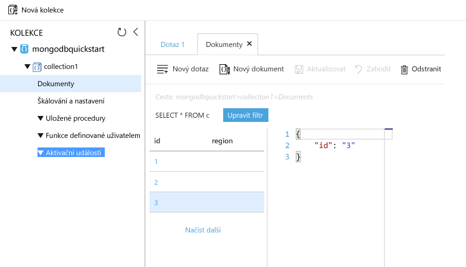

# <a name="azure-cosmos-db-migrate-an-existing-nodejs-mongodb-web-app"></a><span data-ttu-id="f1d8a-103">Služba Azure Cosmos DB: Migrace stávající webové aplikace MongoDB s podporou Node.js</span><span class="sxs-lookup"><span data-stu-id="f1d8a-103">Azure Cosmos DB: Migrate an existing Node.js MongoDB web app</span></span> 

<span data-ttu-id="f1d8a-104">Azure Cosmos DB je globálně distribuovaná databázová služba Microsoftu pro více modelů.</span><span class="sxs-lookup"><span data-stu-id="f1d8a-104">Azure Cosmos DB is Microsoft’s globally distributed multi-model database service.</span></span> <span data-ttu-id="f1d8a-105">Můžete snadno vytvořit a dotazovat databáze dotazů, klíčů/hodnot a grafů, které tak můžou využívat výhody použitelnosti v celosvětovém měřítku a možností horizontálního škálování v jádru Azure Cosmos DB.</span><span class="sxs-lookup"><span data-stu-id="f1d8a-105">You can quickly create and query document, key/value, and graph databases, all of which benefit from the global distribution and horizontal scale capabilities at the core of Azure Cosmos DB.</span></span> 

<span data-ttu-id="f1d8a-106">Tento rychlý start popisuje způsob použití stávající aplikace [MongoDB](mongodb-introduction.md) napsané v Node.js a připojení ke službě Azure Cosmos DB, která podporuje připojení klienta MongoDB.</span><span class="sxs-lookup"><span data-stu-id="f1d8a-106">This quickstart demonstrates how to use an existing [MongoDB](mongodb-introduction.md) app written in Node.js and connect it to your Azure Cosmos DB database, which supports MongoDB client connections.</span></span> <span data-ttu-id="f1d8a-107">Jinými slovy: aplikace Node.js ví pouze to, že se připojuje k databázi pomocí rozhraní API MongoDB.</span><span class="sxs-lookup"><span data-stu-id="f1d8a-107">In other words, your Node.js application only knows that it's connecting to a database using MongoDB APIs.</span></span> <span data-ttu-id="f1d8a-108">V aplikaci se transparentně zobrazuje, že data jsou uložena ve službě Azure Cosmos DB.</span><span class="sxs-lookup"><span data-stu-id="f1d8a-108">It is transparent to the application that the data is stored in Azure Cosmos DB.</span></span>

<span data-ttu-id="f1d8a-109">Po dokončení budete mít ve službě [Azure Cosmos DB](https://azure.microsoft.com/services/cosmos-db/) spuštěnou aplikaci MEAN (MongoDB, Express, AngularJS a Node.js).</span><span class="sxs-lookup"><span data-stu-id="f1d8a-109">When you are done, you will have a MEAN application (MongoDB, Express, AngularJS, and Node.js) running on [Azure Cosmos DB](https://azure.microsoft.com/services/cosmos-db/).</span></span> 


[!INCLUDE [cloud-shell-try-it](../../includes/cloud-shell-try-it.md)]

<span data-ttu-id="f1d8a-111">Pokud se rozhodnete nainstalovat a používat rozhraní příkazového řádku (CLI) místně, musíte mít spuštěnou verzi Azure CLI 2.0 nebo novější.</span><span class="sxs-lookup"><span data-stu-id="f1d8a-111">If you choose to install and use the CLI locally, this topic requires that you are running the Azure CLI version 2.0 or later.</span></span> <span data-ttu-id="f1d8a-112">Verzi zjistíte spuštěním příkazu `az --version`.</span><span class="sxs-lookup"><span data-stu-id="f1d8a-112">Run `az --version` to find the version.</span></span> <span data-ttu-id="f1d8a-113">Pokud potřebujete instalaci nebo upgrade, přečtěte si téma [Instalace Azure CLI 2.0]( /cli/azure/install-azure-cli).</span><span class="sxs-lookup"><span data-stu-id="f1d8a-113">If you need to install or upgrade, see [Install Azure CLI 2.0]( /cli/azure/install-azure-cli).</span></span> 

## <a name="prerequisites"></a><span data-ttu-id="f1d8a-114">Požadavky</span><span class="sxs-lookup"><span data-stu-id="f1d8a-114">Prerequisites</span></span> 
<span data-ttu-id="f1d8a-115">Abyste mohli spustit příkazy `npm` a `git`, musíte mít kromě rozhraní příkazového řádku Azure místně nainstalovaný [Node.js](https://nodejs.org/) a [Git](http://www.git-scm.com/downloads).</span><span class="sxs-lookup"><span data-stu-id="f1d8a-115">In addition to Azure CLI, you need [Node.js](https://nodejs.org/) and [Git](http://www.git-scm.com/downloads) installed locally to run `npm` and `git` commands.</span></span>

<span data-ttu-id="f1d8a-116">Měli byste mít praktickou znalost Node.js.</span><span class="sxs-lookup"><span data-stu-id="f1d8a-116">You should have working knowledge of Node.js.</span></span> <span data-ttu-id="f1d8a-117">Tento rychlý start není určen jako pomůcka pro všeobecný vývoj aplikací v Node.js.</span><span class="sxs-lookup"><span data-stu-id="f1d8a-117">This quickstart is not intended to help you with developing Node.js applications in general.</span></span>

## <a name="clone-the-sample-application"></a><span data-ttu-id="f1d8a-118">Klonování ukázkové aplikace</span><span class="sxs-lookup"><span data-stu-id="f1d8a-118">Clone the sample application</span></span>

<span data-ttu-id="f1d8a-119">Otevřete okno terminálu Git, jako je třeba Git Bash, a pomocí `cd` přejděte do pracovního adresáře.</span><span class="sxs-lookup"><span data-stu-id="f1d8a-119">Open a git terminal window, such as git bash, and `cd` to a working directory.</span></span>  

<span data-ttu-id="f1d8a-120">Spuštěním následujících příkazů naklonujte ukázkové úložiště.</span><span class="sxs-lookup"><span data-stu-id="f1d8a-120">Run the following commands to clone the sample repository.</span></span> <span data-ttu-id="f1d8a-121">Toto ukázkové úložiště obsahuje výchozí aplikaci [MEAN.js](http://meanjs.org/).</span><span class="sxs-lookup"><span data-stu-id="f1d8a-121">This sample repository contains the default [MEAN.js](http://meanjs.org/) application.</span></span> 

```bash
git clone https://github.com/prashanthmadi/mean
```

## <a name="run-the-application"></a><span data-ttu-id="f1d8a-122">Spuštění aplikace</span><span class="sxs-lookup"><span data-stu-id="f1d8a-122">Run the application</span></span>

<span data-ttu-id="f1d8a-123">Nainstalujte požadované balíčky a spusťte aplikaci.</span><span class="sxs-lookup"><span data-stu-id="f1d8a-123">Install the required packages and start the application.</span></span>

```bash
cd mean
npm install
npm start
```

## <a name="log-in-to-azure"></a><span data-ttu-id="f1d8a-124">Přihlaste se k Azure.</span><span class="sxs-lookup"><span data-stu-id="f1d8a-124">Log in to Azure</span></span>

<span data-ttu-id="f1d8a-125">Pokud používáte nainstalované rozhraní příkazového řádku Azure, přihlaste se k předplatnému Azure pomocí příkazu [az login](/cli/azure/#login) a postupujte podle pokynů na obrazovce.</span><span class="sxs-lookup"><span data-stu-id="f1d8a-125">If you are using an installed Azure CLI, log in to your Azure subscription with the [az login](/cli/azure/#login) command and follow the on-screen directions.</span></span> <span data-ttu-id="f1d8a-126">Pokud používáte Azure Cloud Shell, můžete tento krok přeskočit.</span><span class="sxs-lookup"><span data-stu-id="f1d8a-126">You can skip this step if you're using the Azure Cloud Shell.</span></span>

```azurecli
az login 
``` 
   
## <a name="add-the-azure-cosmos-db-module"></a><span data-ttu-id="f1d8a-127">Přidání modulu služby Azure Cosmos DB</span><span class="sxs-lookup"><span data-stu-id="f1d8a-127">Add the Azure Cosmos DB module</span></span>

<span data-ttu-id="f1d8a-128">Pokud používáte nainstalované rozhraní příkazového řádku Azure, zkontrolujte pomocí příkazu `az`, zda je komponenta `cosmosdb` už nainstalovaná.</span><span class="sxs-lookup"><span data-stu-id="f1d8a-128">If you are using an installed Azure CLI, check to see if the `cosmosdb` component is already installed by running the `az` command.</span></span> <span data-ttu-id="f1d8a-129">Pokud se komponenta `cosmosdb` v seznamu základních příkazů nachází, pokračujte k dalšímu příkazu.</span><span class="sxs-lookup"><span data-stu-id="f1d8a-129">If `cosmosdb` is in the list of base commands, proceed to the next command.</span></span> <span data-ttu-id="f1d8a-130">Pokud používáte Azure Cloud Shell, můžete tento krok přeskočit.</span><span class="sxs-lookup"><span data-stu-id="f1d8a-130">You can skip this step if you're using the Azure Cloud Shell.</span></span>

<span data-ttu-id="f1d8a-131">Pokud se komponenta `cosmosdb` v seznamu základních příkazů nenachází, přeinstalujte [rozhraní příkazového řádku Azure 2.0]( /cli/azure/install-azure-cli).</span><span class="sxs-lookup"><span data-stu-id="f1d8a-131">If `cosmosdb` is not in the list of base commands, reinstall [Azure CLI 2.0]( /cli/azure/install-azure-cli).</span></span>

## <a name="create-a-resource-group"></a><span data-ttu-id="f1d8a-132">Vytvoření skupiny prostředků</span><span class="sxs-lookup"><span data-stu-id="f1d8a-132">Create a resource group</span></span>

<span data-ttu-id="f1d8a-133">Vytvořte pomocí příkazu [az group create](/cli/azure/group#create) [skupinu prostředků](../azure-resource-manager/resource-group-overview.md).</span><span class="sxs-lookup"><span data-stu-id="f1d8a-133">Create a [resource group](../azure-resource-manager/resource-group-overview.md) with the [az group create](/cli/azure/group#create).</span></span> <span data-ttu-id="f1d8a-134">Skupina prostředků Azure je logický kontejner, ve kterém se nasazují a spravují prostředky Azure, jako například webové aplikace, databáze a účty úložiště.</span><span class="sxs-lookup"><span data-stu-id="f1d8a-134">An Azure resource group is a logical container into which Azure resources like web apps, databases and storage accounts are deployed and managed.</span></span> 

<span data-ttu-id="f1d8a-135">Následující příklad vytvoří skupinu prostředků pro oblast Západní Evropa.</span><span class="sxs-lookup"><span data-stu-id="f1d8a-135">The following example creates a resource group in the West Europe region.</span></span> <span data-ttu-id="f1d8a-136">Pro skupinu prostředků vyberte jedinečný název.</span><span class="sxs-lookup"><span data-stu-id="f1d8a-136">Choose a unique name for the resource group.</span></span>

<span data-ttu-id="f1d8a-137">Pokud používáte Azure Cloud Shell, klikněte na **Vyzkoušet** a postupujte podle pokynů pro přihlášení uvedených na obrazovce, potom příkaz zkopírujte do příkazového řádku.</span><span class="sxs-lookup"><span data-stu-id="f1d8a-137">If you are using Azure Cloud Shell, click **Try It**, follow the onscreen prompts to login, then copy the command into the command prompt.</span></span>

```azurecli-interactive
az group create --name myResourceGroup --location "West Europe"
```

## <a name="create-an-azure-cosmos-db-account"></a><span data-ttu-id="f1d8a-138">Vytvoření účtu služby Azure Cosmos DB</span><span class="sxs-lookup"><span data-stu-id="f1d8a-138">Create an Azure Cosmos DB account</span></span>

<span data-ttu-id="f1d8a-139">Pomocí příkazu [az cosmosdb create](/cli/azure/cosmosdb#create) vytvořte účet služby Azure Cosmos DB.</span><span class="sxs-lookup"><span data-stu-id="f1d8a-139">Create an Azure Cosmos DB account with the [az cosmosdb create](/cli/azure/cosmosdb#create) command.</span></span>

<span data-ttu-id="f1d8a-140">V následujícím příkazu nahraďte zástupný symbol `<cosmosdb-name>` vlastním jedinečným názvem účtu služby Azure Cosmos DB.</span><span class="sxs-lookup"><span data-stu-id="f1d8a-140">In the following command, please substitute your own unique Azure Cosmos DB account name where you see the `<cosmosdb-name>` placeholder.</span></span> <span data-ttu-id="f1d8a-141">Tento jedinečný název se použije jako součást koncového bodu služby Azure Cosmos DB (`https://<cosmosdb-name>.documents.azure.com/`). Název proto musí být jedinečný ve všech účtech služby Azure Cosmos DB platformy Azure.</span><span class="sxs-lookup"><span data-stu-id="f1d8a-141">This unique name will be used as part of your Azure Cosmos DB endpoint (`https://<cosmosdb-name>.documents.azure.com/`), so the name needs to be unique across all Azure Cosmos DB accounts in Azure.</span></span> 

```azurecli-interactive
az cosmosdb create --name <cosmosdb-name> --resource-group myResourceGroup --kind MongoDB
```

<span data-ttu-id="f1d8a-142">Parametr `--kind MongoDB` umožňuje klientská připojení MongoDB.</span><span class="sxs-lookup"><span data-stu-id="f1d8a-142">The `--kind MongoDB` parameter enables MongoDB client connections.</span></span>

<span data-ttu-id="f1d8a-143">Po vytvoření účtu služby Azure Cosmos DB zobrazí rozhraní příkazového řádku Azure podobné informace jako v následujícím příkladu.</span><span class="sxs-lookup"><span data-stu-id="f1d8a-143">When the Azure Cosmos DB account is created, the Azure CLI shows information similar to the following example.</span></span> 

> [!NOTE]
> <span data-ttu-id="f1d8a-144">Tento příklad jako formát výstupu Azure CLI používá výchozí JSON.</span><span class="sxs-lookup"><span data-stu-id="f1d8a-144">This example uses JSON as the Azure CLI output format, which is the default.</span></span> <span data-ttu-id="f1d8a-145">Pokud chcete použít jiný formát výstupu, přečtěte si téma [Formáty výstupu pro příkazy Azure CLI 2.0](https://docs.microsoft.com/cli/azure/format-output-azure-cli).</span><span class="sxs-lookup"><span data-stu-id="f1d8a-145">To use another output format, see [Output formats for Azure CLI 2.0 commands](https://docs.microsoft.com/cli/azure/format-output-azure-cli).</span></span>

```json
{
  "databaseAccountOfferType": "Standard",
  "documentEndpoint": "https://<cosmosdb-name>.documents.azure.com:443/",
  "id": "/subscriptions/00000000-0000-0000-0000-000000000000/resourceGroups/myResourceGroup/providers/Microsoft.Document
DB/databaseAccounts/<cosmosdb-name>",
  "kind": "MongoDB",
  "location": "West Europe",
  "name": "<cosmosdb-name>",
  "readLocations": [
    {
      "documentEndpoint": "https://<cosmosdb-name>-westeurope.documents.azure.com:443/",
      "failoverPriority": 0,
      "id": "<cosmosdb-name>-westeurope",
      "locationName": "West Europe",
      "provisioningState": "Succeeded"
    }
  ],
  "resourceGroup": "myResourceGroup",
  "type": "Microsoft.DocumentDB/databaseAccounts",
  "writeLocations": [
    {
      "documentEndpoint": "https://<cosmosdb-name>-westeurope.documents.azure.com:443/",
      "failoverPriority": 0,
      "id": "<cosmosdb-name>-westeurope",
      "locationName": "West Europe",
      "provisioningState": "Succeeded"
    }
  ]
} 
```

## <a name="connect-your-nodejs-application-to-the-database"></a><span data-ttu-id="f1d8a-146">Připojení aplikace Node.js k databázi</span><span class="sxs-lookup"><span data-stu-id="f1d8a-146">Connect your Node.js application to the database</span></span>

<span data-ttu-id="f1d8a-147">V tomto kroku připojíte ukázkovou aplikaci MEAN.js k právě vytvořené databázi služby Azure Cosmos DB, a to pomocí připojovacího řetězce MongoDB.</span><span class="sxs-lookup"><span data-stu-id="f1d8a-147">In this step, you connect your MEAN.js sample application to an Azure Cosmos DB database you just created, using a MongoDB connection string.</span></span> 

<a name="devconfig"></a>
## <a name="configure-the-connection-string-in-your-nodejs-application"></a><span data-ttu-id="f1d8a-148">Konfigurace připojovacího řetězce v aplikaci Node.js</span><span class="sxs-lookup"><span data-stu-id="f1d8a-148">Configure the connection string in your Node.js application</span></span>

<span data-ttu-id="f1d8a-149">V úložišti MEAN.js otevřete `config/env/local-development.js`.</span><span class="sxs-lookup"><span data-stu-id="f1d8a-149">In your MEAN.js repository, open `config/env/local-development.js`.</span></span>

<span data-ttu-id="f1d8a-150">Obsah tohoto souboru nahraďte následujícím kódem.</span><span class="sxs-lookup"><span data-stu-id="f1d8a-150">Replace the content of this file with the following code.</span></span> <span data-ttu-id="f1d8a-151">Nezapomeňte nahradit také dva zástupné symboly `<cosmosdb-name>` názvem vašeho účtu služby Azure Cosmos DB.</span><span class="sxs-lookup"><span data-stu-id="f1d8a-151">Be sure to also replace the two `<cosmosdb-name>` placeholders with your Azure Cosmos DB account name.</span></span>

```javascript
'use strict';

module.exports = {
  db: {
    uri: 'mongodb://<cosmosdb-name>:<primary_master_key>@<cosmosdb-name>.documents.azure.com:10255/mean-dev?ssl=true&sslverifycertificate=false'
  }
};
```

## <a name="retrieve-the-key"></a><span data-ttu-id="f1d8a-152">Načtení klíče</span><span class="sxs-lookup"><span data-stu-id="f1d8a-152">Retrieve the key</span></span>

<span data-ttu-id="f1d8a-153">Aby bylo možné se připojit k databázi služby Azure Cosmos DB, potřebujete klíč databáze.</span><span class="sxs-lookup"><span data-stu-id="f1d8a-153">In order to connect to an Azure Cosmos DB database, you need the database key.</span></span> <span data-ttu-id="f1d8a-154">Pro načtení primárního klíče použijte příkaz [az cosmosdb list-keys](/cli/azure/cosmosdb#list-keys).</span><span class="sxs-lookup"><span data-stu-id="f1d8a-154">Use the [az cosmosdb list-keys](/cli/azure/cosmosdb#list-keys) command to retrieve the primary key.</span></span>

```azurecli-interactive
az cosmosdb list-keys --name <cosmosdb-name> --resource-group myResourceGroup --query "primaryMasterKey"
```

<span data-ttu-id="f1d8a-155">Výstupní informace rozhraní příkazového řádku Azure jsou podobné jako v následujícím příkladu.</span><span class="sxs-lookup"><span data-stu-id="f1d8a-155">The Azure CLI outputs information similar to the following example.</span></span> 

```json
"RUayjYjixJDWG5xTqIiXjC..."
```

<span data-ttu-id="f1d8a-156">Zkopírujte hodnotu `primaryMasterKey`.</span><span class="sxs-lookup"><span data-stu-id="f1d8a-156">Copy the value of `primaryMasterKey`.</span></span> <span data-ttu-id="f1d8a-157">Vložte ji místo `<primary_master_key>` v souboru `local-development.js`.</span><span class="sxs-lookup"><span data-stu-id="f1d8a-157">Paste this over the  `<primary_master_key>` in `local-development.js`.</span></span>

<span data-ttu-id="f1d8a-158">Uložte provedené změny.</span><span class="sxs-lookup"><span data-stu-id="f1d8a-158">Save your changes.</span></span>

### <a name="run-the-application-again"></a><span data-ttu-id="f1d8a-159">Spusťte aplikaci znovu.</span><span class="sxs-lookup"><span data-stu-id="f1d8a-159">Run the application again.</span></span>

<span data-ttu-id="f1d8a-160">Spusťte `npm start` znovu.</span><span class="sxs-lookup"><span data-stu-id="f1d8a-160">Run `npm start` again.</span></span> 

```bash
npm start
```

<span data-ttu-id="f1d8a-161">Zpráva konzoly by vás teď měla informovat o tom, že vývojové prostředí je připravené a spuštěné.</span><span class="sxs-lookup"><span data-stu-id="f1d8a-161">A console message should now tell you that the development environment is up and running.</span></span> 

<span data-ttu-id="f1d8a-162">V prohlížeči přejděte na `http://localhost:3000`.</span><span class="sxs-lookup"><span data-stu-id="f1d8a-162">Navigate to `http://localhost:3000` in a browser.</span></span> <span data-ttu-id="f1d8a-163">V horní nabídce klikněte na **Zaregistrovat se** a pokuste se vytvořit dva fiktivní uživatele.</span><span class="sxs-lookup"><span data-stu-id="f1d8a-163">Click **Sign Up** in the top menu and try to create two dummy users.</span></span> 

<span data-ttu-id="f1d8a-164">Ukázková aplikace MEAN.js ukládá data uživatelů v databázi.</span><span class="sxs-lookup"><span data-stu-id="f1d8a-164">The MEAN.js sample application stores user data in the database.</span></span> <span data-ttu-id="f1d8a-165">Pokud budete úspěšní a aplikace MEAN.js automaticky zaregistruje vytvořeného uživatele, bude připojení Azure Cosmos DB fungovat.</span><span class="sxs-lookup"><span data-stu-id="f1d8a-165">If you are successful and MEAN.js automatically signs into the created user, then your Azure Cosmos DB connection is working.</span></span> 


## <a name="view-data-in-data-explorer"></a><span data-ttu-id="f1d8a-167">Zobrazení dat v Průzkumníku dat</span><span class="sxs-lookup"><span data-stu-id="f1d8a-167">View data in Data Explorer</span></span>

<span data-ttu-id="f1d8a-168">Data uložená službou Azure Cosmos DB je možné zobrazovat a je možné se na ně dotazovat a spouštět na ně obchodní logiku na portálu Azure Portal.</span><span class="sxs-lookup"><span data-stu-id="f1d8a-168">Data stored by an Azure Cosmos DB is available to view, query, and run business-logic on in the Azure portal.</span></span>

<span data-ttu-id="f1d8a-169">Pokud chcete zobrazovat uživatelská data vytvořená v předchozím kroku, zadávat na ně dotazy a pracovat s nimi, přihlaste se k portálu [Azure Portal](https://portal.azure.com) ve webovém prohlížeči.</span><span class="sxs-lookup"><span data-stu-id="f1d8a-169">To view, query, and work with the user data created in the previous step, login to the [Azure portal](https://portal.azure.com) in your web browser.</span></span>

<span data-ttu-id="f1d8a-170">V horním vyhledávacím poli zadejte Azure Cosmos DB.</span><span class="sxs-lookup"><span data-stu-id="f1d8a-170">In the top Search box, type Azure Cosmos DB.</span></span> <span data-ttu-id="f1d8a-171">Po otevření okna účtu služby Cosmos DB vyberte účet Cosmos DB.</span><span class="sxs-lookup"><span data-stu-id="f1d8a-171">When your Cosmos DB account blade opens, select your Cosmos DB account.</span></span> <span data-ttu-id="f1d8a-172">V levém navigačním panelu klikněte na Průzkumník dat.</span><span class="sxs-lookup"><span data-stu-id="f1d8a-172">In the left navigation, click Data Explorer.</span></span> <span data-ttu-id="f1d8a-173">Rozbalte kolekci v podokně Kolekce. Pak můžete zobrazovat dokumenty v kolekci, dotazovat se na data a dokonce vytvářet a spouštět uložené procedury, triggery a funkce UDF.</span><span class="sxs-lookup"><span data-stu-id="f1d8a-173">Expand your collection in the Collections pane, and then you can view the documents in the collection, query the data, and even create and run stored procedures, triggers, and UDFs.</span></span> 




## <a name="deploy-the-nodejs-application-to-azure"></a><span data-ttu-id="f1d8a-175">Nasaďte aplikaci Node.js do platformy Azure</span><span class="sxs-lookup"><span data-stu-id="f1d8a-175">Deploy the Node.js application to Azure</span></span>

<span data-ttu-id="f1d8a-176">V tomto kroku se nasazuje aplikace Node.js připojená k databázi MongoDB ke službě Azure Cosmos DB.</span><span class="sxs-lookup"><span data-stu-id="f1d8a-176">In this step, you deploy your MongoDB-connected Node.js application to Azure Cosmos DB.</span></span>

<span data-ttu-id="f1d8a-177">Pravděpodobně jste si všimli, že dříve změněný soubor konfigurace je určený pro vývojové prostředí (`/config/env/local-development.js`).</span><span class="sxs-lookup"><span data-stu-id="f1d8a-177">You may have noticed that the configuration file that you changed earlier is for the development environment (`/config/env/local-development.js`).</span></span> <span data-ttu-id="f1d8a-178">Pokud nasadíte aplikaci do služby App Service, bude se ve výchozím nastavení spouštět v produkčním prostředí.</span><span class="sxs-lookup"><span data-stu-id="f1d8a-178">When you deploy your application to App Service, it will run in the production environment by default.</span></span> <span data-ttu-id="f1d8a-179">Teď tedy musíte provést stejné změny v příslušném souboru konfigurace.</span><span class="sxs-lookup"><span data-stu-id="f1d8a-179">So now, you need to make the same change to the respective configuration file.</span></span>

<span data-ttu-id="f1d8a-180">V úložišti MEAN.js otevřete `config/env/production.js`.</span><span class="sxs-lookup"><span data-stu-id="f1d8a-180">In your MEAN.js repository, open `config/env/production.js`.</span></span>

<span data-ttu-id="f1d8a-181">V objektu `db` nahraďte hodnotu `uri` tak, jak je uvedeno v následujícím příkladu.</span><span class="sxs-lookup"><span data-stu-id="f1d8a-181">In the `db` object, replace the value of `uri` as show in the following example.</span></span> <span data-ttu-id="f1d8a-182">Nezapomeňte nahradit zástupné symboly jako v předcházejícím případě.</span><span class="sxs-lookup"><span data-stu-id="f1d8a-182">Be sure to replace the placeholders as before.</span></span>

```javascript
'mongodb://<cosmosdb-name>:<primary_master_key>@<cosmosdb-name>.documents.azure.com:10255/mean?ssl=true&sslverifycertificate=false',
```

> [!NOTE] 
> <span data-ttu-id="f1d8a-183">Možnost `ssl=true` je důležitá, protože [služba Azure Cosmos DB vyžaduje SSL](connect-mongodb-account.md#connection-string-requirements).</span><span class="sxs-lookup"><span data-stu-id="f1d8a-183">The `ssl=true` option is important because [Azure Cosmos DB requires SSL](connect-mongodb-account.md#connection-string-requirements).</span></span> 
>
>

<span data-ttu-id="f1d8a-184">V terminálu potvrďte do systému Git všechny změny.</span><span class="sxs-lookup"><span data-stu-id="f1d8a-184">In the terminal, commit all your changes into Git.</span></span> <span data-ttu-id="f1d8a-185">Můžete zkopírovat oba příkazy a spouštět je společně.</span><span class="sxs-lookup"><span data-stu-id="f1d8a-185">You can copy both commands to run them together.</span></span>

```bash
git add .
git commit -m "configured MongoDB connection string"
```
## <a name="clean-up-resources"></a><span data-ttu-id="f1d8a-186">Vyčištění prostředků</span><span class="sxs-lookup"><span data-stu-id="f1d8a-186">Clean up resources</span></span>

<span data-ttu-id="f1d8a-187">Pokud nebudete tuto aplikace nadále používat, odstraňte na základě následujícího postupu z portálu Azure Portal všechny prostředky vytvořené podle tohoto rychlého startu:</span><span class="sxs-lookup"><span data-stu-id="f1d8a-187">If you're not going to continue to use this app, delete all resources created by this quickstart in the Azure portal with the following steps:</span></span>

1. <span data-ttu-id="f1d8a-188">V nabídce vlevo na portálu Azure Portal klikněte na **Skupiny prostředků** a pak klikněte na název vytvořeného prostředku.</span><span class="sxs-lookup"><span data-stu-id="f1d8a-188">From the left-hand menu in the Azure portal, click **Resource groups** and then click the name of the resource you created.</span></span> 
2. <span data-ttu-id="f1d8a-189">Na stránce skupiny prostředků klikněte na **Odstranit**, do textového pole zadejte prostředek, který chcete odstranit, a pak klikněte na **Odstranit**.</span><span class="sxs-lookup"><span data-stu-id="f1d8a-189">On your resource group page, click **Delete**, type the name of the resource to delete in the text box, and then click **Delete**.</span></span>

## <a name="next-steps"></a><span data-ttu-id="f1d8a-190">Další kroky</span><span class="sxs-lookup"><span data-stu-id="f1d8a-190">Next steps</span></span>

<span data-ttu-id="f1d8a-191">V tomto rychlém startu jste se seznámili s postupem vytvoření účtu databáze služby Azure Cosmos DB a vytvoření kolekce MongoDB pomocí Průzkumníku dat.</span><span class="sxs-lookup"><span data-stu-id="f1d8a-191">In this quickstart, you've learned how to create an Azure Cosmos DB account and create a MongoDB collection using the Data Explorer.</span></span> <span data-ttu-id="f1d8a-192">Teď můžete migrovat data MongoDB do služby Azure Cosmos DB.</span><span class="sxs-lookup"><span data-stu-id="f1d8a-192">You can now migrate your MongoDB data to Azure Cosmos DB.</span></span>  

> [!div class="nextstepaction"]
> [<span data-ttu-id="f1d8a-193">Importování dat MongoDB do služby Azure Cosmos DB</span><span class="sxs-lookup"><span data-stu-id="f1d8a-193">Import MongoDB data into Azure Cosmos DB</span></span>](mongodb-migrate.md)
