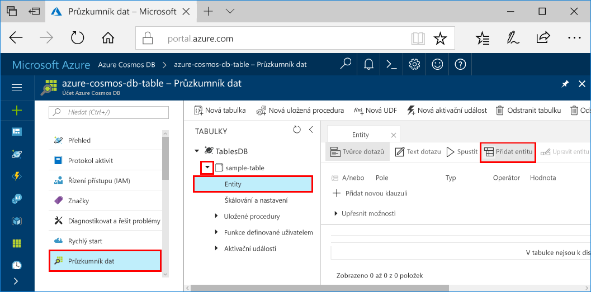

# <a name="azure-cosmos-db-build-a-net-application-using-hello-table-api"></a>Azure Cosmos DB: Vytvoření aplikace .NET pomocí hello tabulky rozhraní API

Databáze Azure Cosmos je databázová služba Microsoftu s více modely použitelná v celosvětovém měřítku. Můžete rychle vytvořit a dotazovat dokumentu, klíč/hodnota a graf databází, které těžit z globální distribuční hello a možnosti vodorovné škálování jádrem hello Azure Cosmos DB. 

Tento rychlý start předvádí, jak toocreate Azure DB Cosmos účtu a vytvořte tabulku v rámci tohoto účtu pomocí hello portálu Azure. Budete pak napíšete kód tooinsert, aktualizace a odstranění entity a spustit některé dotazy pomocí hello nové [Windows Azure Storage úrovně Premium Table](https://aka.ms/premiumtablenuget) (preview) balíček NuGet. V této knihovně bylo hello stejné třídy a metody podpisy jako veřejné hello [sada SDK úložiště Windows Azure](https://www.nuget.org/packages/WindowsAzure.Storage), ale také obsahuje hello možnost tooconnect tooAzure Cosmos DB účty pomocí hello [tabulky API](table-introduction.md) (preview). 

## <a name="prerequisites"></a>Požadavky

Pokud ještě nemáte nainstalované Visual Studio 2017, můžete stáhnout a použít hello **volné** [Visual Studio 2017 Community Edition](https://www.visualstudio.com/downloads/). Ujistěte se, že povolíte **Azure development** při instalaci sady Visual Studio hello.

[!INCLUDE [quickstarts-free-trial-note](../../includes/quickstarts-free-trial-note.md)]

## <a name="create-a-database-account"></a>Vytvoření účtu databáze

[!INCLUDE [cosmos-db-create-dbaccount-table](../../includes/cosmos-db-create-dbaccount-table.md)]

## <a name="add-a-table"></a>Přidání tabulky

[!INCLUDE [cosmos-db-create-table](../../includes/cosmos-db-create-table.md)]

## <a name="add-sample-data"></a>Přidání ukázkových dat

Nyní můžete přidat data tooyour nové tabulky pomocí Průzkumníku dat (Preview).

1. V Průzkumníku dat rozbalte **ukázkovou tabulku**, klikněte na **Entity** a potom klikněte na **Přidat entitu**.

   
2. Nyní přidejte dat toohello PartitionKey hodnota pole a hodnota pole RowKey a klikněte na **Přidat entitu**.

   
  
    Můžete nyní přidat další tabulky tooyour entity, upravit vaší entity nebo dotazování na data v Průzkumníku dat. Průzkumník dat je také, kde můžete škálovat vaše propustnost a přidání uložené procedury, uživatelem definované funkce a tabulka tooyour aktivační události.

## <a name="clone-hello-sample-application"></a>Klonování hello ukázkové aplikace

Nyní Pojďme klonovat aplikace tabulky z githubu, nastavte hello připojovací řetězec a spusťte ho. Uvidíte, jak je snadné toowork s daty prostřednictvím kódu programu. 

1. Otevřete okno terminálu git, jako je například git bash a `cd` tooa pracovní adresář.  

2. Spusťte následující příkaz tooclone hello Ukázka úložiště hello. 

    ```bash
    git clone https://github.com/Azure-Samples/azure-cosmos-db-table-dotnet-getting-started.git
    ```

3. Poté otevřete soubor řešení hello v sadě Visual Studio. 

## <a name="review-hello-code"></a>Zkontrolujte hello kódu

Provedeme jejich stručný přehled o dění v aplikaci hello. Hello otevřete soubor Program.cs a najdete, že tyto řádky kódu vytvořit hello prostředky Azure Cosmos DB. 

* Hello CloudTableClient je inicializován.

    ```csharp
    CloudStorageAccount storageAccount = CloudStorageAccount.Parse(connectionString); 
    CloudTableClient tableClient = storageAccount.CreateCloudTableClient();
    ```

* Vytvoří se nová tabulka, pokud ještě neexistuje.

    ```csharp
    CloudTable table = tableClient.GetTableReference("people");
    table.CreateIfNotExists();
    ```

* Vytvoří se nový kontejner tabulky. Si všimnete, že je velmi podobné tooregular tento kód Azure Table storage SDK. 

    ```csharp
    CustomerEntity item = new CustomerEntity()
                {
                    PartitionKey = Guid.NewGuid().ToString(),
                    RowKey = Guid.NewGuid().ToString(),
                    Email = $"{GetRandomString(6)}@contoso.com",
                    PhoneNumber = "425-555-0102",
                    Bio = GetRandomString(1000)
                };
    ```

## <a name="update-your-connection-string"></a>Aktualizace připojovacího řetězce

Nyní jsme budete aktualizovat informace o připojovacím řetězci hello tak vaše aplikace může kontaktovat tooAzure Cosmos DB. 

1. V sadě Visual Studio otevřete soubor app.config hello. 

2. V hello [portál Azure](http://portal.azure.com/)v hello Azure Cosmos DB levé navigační nabídky, klikněte na tlačítko **připojovací řetězec**. Potom v podokně nové hello klikněte na tlačítko Kopírovat hello pro hello připojovací řetězec. 

    

3. Jako hodnotu hello hello PremiumStorageConnectionString vložit hodnotu hello do souboru app.config hello. 

    `<add key="PremiumStorageConnectionString" 
        value="DefaultEndpointsProtocol=https;AccountName=MYSTORAGEACCOUNT;AccountKey=AUTHKEY;TableEndpoint=https://COSMOSDB.documents.azure.com" />`    

    Můžete ponechat hello StandardStorageConnectionString, jako je.

Jste nyní aktualizovat vaši aplikaci s všechny údaje hello potřebuje toocommunicate s Azure Cosmos DB. 

## <a name="run-hello-web-app"></a>Spouštění hello webové aplikace

1. V sadě Visual Studio, klikněte pravým tlačítkem na hello **PremiumTableGetStarted** projektu v **Průzkumníku řešení** a pak klikněte na **spravovat balíčky NuGet**. 

2. V hello NuGet **Procházet** zadejte *WindowsAzure.Storage PremiumTable*.

3. Zkontrolujte hello **zahrnout předběžné verze** pole. 

4. Z výsledků hello nainstalovat hello **WindowsAzure.Storage PremiumTable** knihovny. Tím se nainstaluje hello preview rozhraní API služby Azure Cosmos DB tabulky balíčku a také všechny závislosti. Všimněte si, že se jedná o jiný balíček NuGet než balíček Windows Azure Storage hello používá Azure Table storage. 

5. Klikněte na kombinaci kláves CTRL + F5 toorun hello aplikace.

    okno konzoly Hello zobrazí data hello právě přidali, načíst, dotaz, nahradit a odstraněna z tabulky hello. Po dokončení skriptu hello stiskněte okna konzoly všechny klíče tooclose hello. 
    
    

6. Pokud chcete, aby toosee hello nové entity v Průzkumníku dat, jenom komentář 188 208 řádků v souboru program.cs, nejsou odstraněny, pak znovu spusťte ukázkové hello. 

    Můžete teď se vrátit tooData Explorer, klikněte na tlačítko **aktualizovat**, rozbalte hello **osoby** tabulky a klikněte na tlačítko **entity**a pracovat s Tato nová data. 

    

## <a name="review-slas-in-hello-azure-portal"></a>Zkontrolujte SLA v hello portálu Azure

[!INCLUDE [cosmosdb-tutorial-review-slas](../../includes/cosmos-db-tutorial-review-slas.md)]

## <a name="clean-up-resources"></a>Vyčištění prostředků

Pokud ale nebudete toocontinue toouse této aplikace, odstraňte všechny prostředky, které jsou vytvořené tento rychlý start v hello portál Azure s hello následující kroky: 

1. V levé nabídce hello v hello portálu Azure klikněte na **skupiny prostředků** a pak klikněte na název hello hello prostředků, které jste vytvořili. 
2. Na stránce skupiny prostředků, klikněte na tlačítko **odstranit**hello textového pole zadejte název hello toodelete hello prostředků a pak klikněte na tlačítko **odstranit**.

## <a name="next-steps"></a>Další kroky

V tento rychlý start když jste se naučili toocreate účet Azure Cosmos DB vytvoření tabulky s použitím hello Průzkumníku dat a spusťte aplikaci.  Teď se můžete dotazovat svá data pomocí funkce hello tabulky rozhraní API.  

> [!div class="nextstepaction"]
> [Dotaz pomocí hello tabulky rozhraní API](tutorial-query-table.md)

