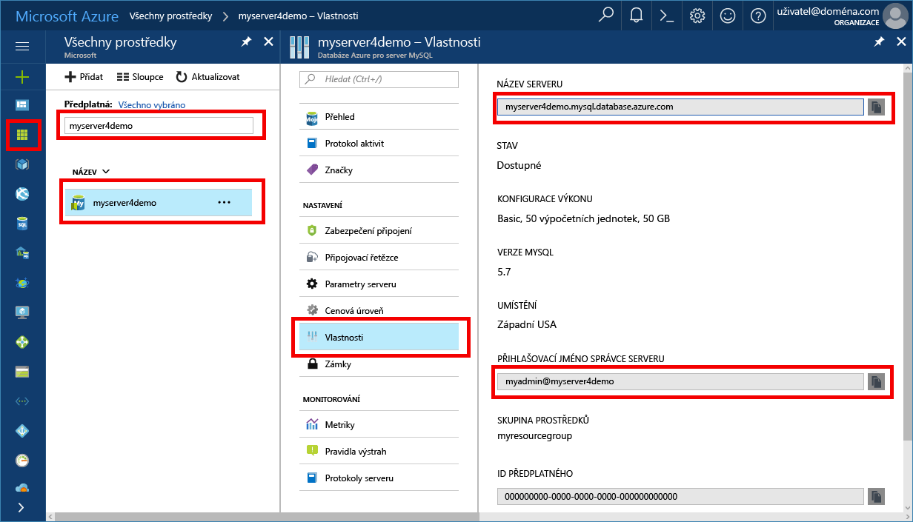

# <a name="azure-database-for-mysql-use-net-c-tooconnect-and-query-data"></a><span data-ttu-id="3fa52-103">Azure databáze pro databázi MySQL: tooconnect a dotaz data pomocí .NET (C#)</span><span class="sxs-lookup"><span data-stu-id="3fa52-103">Azure Database for MySQL: Use .NET (C#) tooconnect and query data</span></span>
<span data-ttu-id="3fa52-104">Tento rychlý start předvádí jak tooconnect tooan Azure databáze pro databázi MySQL pomocí aplikace v jazyce C#.</span><span class="sxs-lookup"><span data-stu-id="3fa52-104">This quickstart demonstrates how tooconnect tooan Azure Database for MySQL using a C# application.</span></span> <span data-ttu-id="3fa52-105">Zobrazuje jak toouse tooquery příkazy SQL, vložit, aktualizovat a odstranit data v databázi hello.</span><span class="sxs-lookup"><span data-stu-id="3fa52-105">It shows how toouse SQL statements tooquery, insert, update, and delete data in hello database.</span></span> <span data-ttu-id="3fa52-106">Hello postup v tomto článku předpokládá, že jste obeznámeni s vývojem pomocí jazyka C#, a že jste novou tooworking s Azure Database pro databázi MySQL.</span><span class="sxs-lookup"><span data-stu-id="3fa52-106">hello steps in this article assume that you are familiar with developing using C#, and that you are new tooworking with Azure Database for MySQL.</span></span>

## <a name="prerequisites"></a><span data-ttu-id="3fa52-107">Požadavky</span><span class="sxs-lookup"><span data-stu-id="3fa52-107">Prerequisites</span></span>
<span data-ttu-id="3fa52-108">Tento rychlý start využívá prostředky hello vytvořené v některém z těchto průvodcích se dozvíte jako výchozí bod:</span><span class="sxs-lookup"><span data-stu-id="3fa52-108">This quickstart uses hello resources created in either of these guides as a starting point:</span></span>
- [<span data-ttu-id="3fa52-109">Vytvoření serveru Azure Database for MySQL pomocí webu Azure Portal</span><span class="sxs-lookup"><span data-stu-id="3fa52-109">Create an Azure Database for MySQL server using Azure portal</span></span>](./quickstart-create-mysql-server-database-using-azure-portal.md)
- [<span data-ttu-id="3fa52-110">Vytvoření serveru Azure Database for MySQL pomocí Azure CLI</span><span class="sxs-lookup"><span data-stu-id="3fa52-110">Create an Azure Database for MySQL server using Azure CLI</span></span>](./quickstart-create-mysql-server-database-using-azure-cli.md)

<span data-ttu-id="3fa52-111">Budete také muset:</span><span class="sxs-lookup"><span data-stu-id="3fa52-111">You also need to:</span></span>
- <span data-ttu-id="3fa52-112">Nainstalovat rozhraní [.NET](https://www.microsoft.com/net/download).</span><span class="sxs-lookup"><span data-stu-id="3fa52-112">Install [.NET](https://www.microsoft.com/net/download).</span></span> <span data-ttu-id="3fa52-113">Postupujte podle kroků hello v hello propojit článek tooinstall .NET speciálně pro vaši platformu (Windows, Ubuntu Linux nebo systému macOS).</span><span class="sxs-lookup"><span data-stu-id="3fa52-113">Follow hello steps in hello linked article tooinstall .NET specifically for your platform (Windows, Ubuntu Linux, or macOS).</span></span> 
- <span data-ttu-id="3fa52-114">Nainstalovat sadu [Visual Studio](https://www.visualstudio.com/downloads/).</span><span class="sxs-lookup"><span data-stu-id="3fa52-114">Install [Visual Studio](https://www.visualstudio.com/downloads/).</span></span>
- <span data-ttu-id="3fa52-115">Nainstalovat [ovladač ODBC pro MySQL](https://dev.mysql.com/downloads/connector/odbc/).</span><span class="sxs-lookup"><span data-stu-id="3fa52-115">Install [ODBC Driver for MySQL](https://dev.mysql.com/downloads/connector/odbc/).</span></span>

## <a name="get-connection-information"></a><span data-ttu-id="3fa52-116">Získání informací o připojení</span><span class="sxs-lookup"><span data-stu-id="3fa52-116">Get connection information</span></span>
<span data-ttu-id="3fa52-117">Získáte hello připojení informace potřebné tooconnect toohello Azure Database pro databázi MySQL.</span><span class="sxs-lookup"><span data-stu-id="3fa52-117">Get hello connection information needed tooconnect toohello Azure Database for MySQL.</span></span> <span data-ttu-id="3fa52-118">Musíte hello serveru plně kvalifikovaný název a přihlašovací údaje.</span><span class="sxs-lookup"><span data-stu-id="3fa52-118">You need hello fully qualified server name and login credentials.</span></span>

1. <span data-ttu-id="3fa52-119">Přihlaste se toohello [portál Azure](https://portal.azure.com/).</span><span class="sxs-lookup"><span data-stu-id="3fa52-119">Log in toohello [Azure portal](https://portal.azure.com/).</span></span>
2. <span data-ttu-id="3fa52-120">Hello levé nabídce na portálu Azure, klikněte na tlačítko **všechny prostředky** a vyhledejte hello serveru, které jste vytvořili, například **myserver4demo**.</span><span class="sxs-lookup"><span data-stu-id="3fa52-120">From hello left-hand menu in Azure portal, click **All resources** and search for hello server you have created, such as **myserver4demo**.</span></span>
3. <span data-ttu-id="3fa52-121">Klikněte na název serveru hello.</span><span class="sxs-lookup"><span data-stu-id="3fa52-121">Click hello server name.</span></span>
4. <span data-ttu-id="3fa52-122">Vyberte hello serveru **vlastnosti** stránky.</span><span class="sxs-lookup"><span data-stu-id="3fa52-122">Select hello server's **Properties** page.</span></span> <span data-ttu-id="3fa52-123">Poznamenejte si hello **název serveru** a **přihlašovací jméno pro Server správce**.</span><span class="sxs-lookup"><span data-stu-id="3fa52-123">Make a note of hello **Server name** and **Server admin login name**.</span></span>
 <span data-ttu-id="3fa52-124"></span><span class="sxs-lookup"><span data-stu-id="3fa52-124"></span></span>
5. <span data-ttu-id="3fa52-125">Pokud zapomenete vaše přihlašovací údaje serveru, přejděte toohello **přehled** stránka tooview hello serveru správce přihlašovací jméno a v případě potřeby obnovit heslo hello.</span><span class="sxs-lookup"><span data-stu-id="3fa52-125">If you forget your server login information, navigate toohello **Overview** page tooview hello Server admin login name and, if necessary, reset hello password.</span></span>

## <a name="connect-create-table-and-insert-data"></a><span data-ttu-id="3fa52-126">Připojení, vytvoření tabulky a vložení dat</span><span class="sxs-lookup"><span data-stu-id="3fa52-126">Connect, create table, and insert data</span></span>
<span data-ttu-id="3fa52-127">Použití hello následující kód tooconnect a načtení dat pomocí hello **CREATE TABLE** a **INSERT INTO** příkazů SQL.</span><span class="sxs-lookup"><span data-stu-id="3fa52-127">Use hello following code tooconnect and load hello data using **CREATE TABLE** and  **INSERT INTO** SQL statements.</span></span> <span data-ttu-id="3fa52-128">Kód Hello používá třídu rozhraní ODBC se metoda [Open()](https://msdn.microsoft.com/en-us/library/system.data.odbc.odbcconnection.open(v=vs.110).aspx) tooestablish tooMySQL připojení.</span><span class="sxs-lookup"><span data-stu-id="3fa52-128">hello code uses ODBC class with method [Open()](https://msdn.microsoft.com/en-us/library/system.data.odbc.odbcconnection.open(v=vs.110).aspx) tooestablish a connection tooMySQL.</span></span> <span data-ttu-id="3fa52-129">Potom kód hello používá metoda [CreateCommand()](https://msdn.microsoft.com/en-us/library/system.data.odbc.odbcconnection.createcommand(v=vs.110).aspx), nastaví vlastnost CommandText hello a volá metodu [ExecuteNonQuery()](https://msdn.microsoft.com/en-us/library/system.data.odbc.odbccommand.executenonquery(v=vs.110).aspx) toorun hello databáze příkazy.</span><span class="sxs-lookup"><span data-stu-id="3fa52-129">Then hello code uses method [CreateCommand()](https://msdn.microsoft.com/en-us/library/system.data.odbc.odbcconnection.createcommand(v=vs.110).aspx), sets hello CommandText property, and calls method [ExecuteNonQuery()](https://msdn.microsoft.com/en-us/library/system.data.odbc.odbccommand.executenonquery(v=vs.110).aspx) toorun hello database commands.</span></span> 

<span data-ttu-id="3fa52-130">Nahraďte hello hostitele, DBName, uživatele a heslo parametry hello hodnoty, kterou jste zadali při vytvoření hello server a databáze.</span><span class="sxs-lookup"><span data-stu-id="3fa52-130">Replace hello Host, DBName, User, and Password parameters with hello values that you specified when you created hello server and database.</span></span> 

```csharp
using System;
using System.Collections.Generic;
using System.Linq;
using System.Text;
using System.Threading.Tasks;
using MySql.Data;
using System.Data.Odbc;

namespace driver
{
    class MySQLCreate
    {
        static void Main(string[] args)
        {
            var conn = new OdbcConnection("DRIVER={MySQL ODBC 5.3 unicode Driver}; Server=myserver4demo.mysql.database.azure.com; Port=3306;" +
            " Database=quickstartdb; Uid=myadmin@myserver4demo; Pwd=server_admin_password; sslverify=0; Option=3;MULTI_STATEMENTS=1");

            Console.Out.WriteLine("Opening connection");
            conn.Open();

            var command = conn.CreateCommand();
            command.CommandText = "DROP TABLE IF EXISTS inventory;";
            command.ExecuteNonQuery();
            Console.Out.WriteLine("Finished dropping table (if existed)");

            command.CommandText = "CREATE TABLE inventory (id serial PRIMARY KEY, name VARCHAR(50), quantity INTEGER);";
            command.ExecuteNonQuery();
            Console.Out.WriteLine("Finished creating table");

            command.CommandText =
                String.Format(
                    @"INSERT INTO inventory (name, quantity) VALUES ({0}, {1});
                    INSERT INTO inventory (name, quantity) VALUES ({2}, {3});
                    INSERT INTO inventory (name, quantity) VALUES ({4}, {5});",
                    "\'banana\'", 150,
                    "\'orange\'", 154,
                    "\'apple\'", 100
                    );

            int nRows = command.ExecuteNonQuery();
            Console.Out.WriteLine(String.Format("Number of rows inserted={0}", nRows));

            Console.Out.WriteLine("Closing connection");
            conn.Close();

            Console.WriteLine("Press RETURN tooexit");
            Console.ReadLine();
        }

    }
}

```

## <a name="read-data"></a><span data-ttu-id="3fa52-131">Čtení dat</span><span class="sxs-lookup"><span data-stu-id="3fa52-131">Read data</span></span>

<span data-ttu-id="3fa52-132">Použití hello následující kód tooconnect a čtení dat pomocí hello **vyberte** příkaz jazyka SQL.</span><span class="sxs-lookup"><span data-stu-id="3fa52-132">Use hello following code tooconnect and read hello data using a **SELECT** SQL statement.</span></span> <span data-ttu-id="3fa52-133">Kód Hello používá třídu rozhraní ODBC se metoda [Open()](https://msdn.microsoft.com/en-us/library/system.data.odbc.odbcconnection.open(v=vs.110).aspx) tooestablish tooMySQL připojení.</span><span class="sxs-lookup"><span data-stu-id="3fa52-133">hello code uses ODBC class with method [Open()](https://msdn.microsoft.com/en-us/library/system.data.odbc.odbcconnection.open(v=vs.110).aspx) tooestablish a connection tooMySQL.</span></span> <span data-ttu-id="3fa52-134">Potom kód hello používá metoda [CreateCommand()](https://msdn.microsoft.com/en-us/library/system.data.odbc.odbcconnection.createcommand(v=vs.110).aspx) a metoda [ExecuteReader())](https://msdn.microsoft.com/en-us/library/system.data.odbc.odbccommand.executereader(v=vs.110).aspx) toorun hello databáze příkazy.</span><span class="sxs-lookup"><span data-stu-id="3fa52-134">Then hello code uses method [CreateCommand()](https://msdn.microsoft.com/en-us/library/system.data.odbc.odbcconnection.createcommand(v=vs.110).aspx) and method [ExecuteReader()](https://msdn.microsoft.com/en-us/library/system.data.odbc.odbccommand.executereader(v=vs.110).aspx) toorun hello database commands.</span></span> <span data-ttu-id="3fa52-135">Další hello kód používá [Read()](https://msdn.microsoft.com/en-us/library/system.data.odbc.odbcdatareader.read(v=vs.110).aspx) tooadvance toohello záznamy ve výsledcích hello.</span><span class="sxs-lookup"><span data-stu-id="3fa52-135">Next hello code uses [Read()](https://msdn.microsoft.com/en-us/library/system.data.odbc.odbcdatareader.read(v=vs.110).aspx) tooadvance toohello records in hello results.</span></span> <span data-ttu-id="3fa52-136">Potom kód hello používá hodnoty hello tooparse GetInt32 a GetString – v záznamu hello.</span><span class="sxs-lookup"><span data-stu-id="3fa52-136">Then hello code uses GetInt32 and GetString tooparse hello values in hello record.</span></span>

<span data-ttu-id="3fa52-137">Nahraďte hello hostitele, DBName, uživatele a heslo parametry hello hodnoty, kterou jste zadali při vytvoření hello server a databáze.</span><span class="sxs-lookup"><span data-stu-id="3fa52-137">Replace hello Host, DBName, User, and Password parameters with hello values that you specified when you created hello server and database.</span></span> 

```csharp
using System;
using System.Collections.Generic;
using System.Linq;
using System.Text;
using System.Threading.Tasks;
using MySql.Data;
using System.Data.Odbc;


namespace driver
{
    class MySQLRead
    {

        static void Main(string[] args)
        {
            var conn = new OdbcConnection("DRIVER={MySQL ODBC 5.3 unicode Driver}; Server=myserver4demo.mysql.database.azure.com; Port=3306;" +
            " Database=quickstartdb; Uid=myadmin@myserver4demo; Pwd=server_admin_password; sslverify=0; Option=3;MULTI_STATEMENTS=1");

            Console.Out.WriteLine("Opening connection");
            conn.Open();

            var command = conn.CreateCommand();
            command.CommandText = "SELECT * FROM inventory;";

            var reader = command.ExecuteReader();
            while (reader.Read())
            {
                Console.WriteLine(
                    string.Format(
                        "Reading from table=({0}, {1}, {2})",
                        reader.GetInt32(0).ToString(),
                        reader.GetString(1),
                        reader.GetInt32(2).ToString()
                        )
                    );
            }

            Console.Out.WriteLine("Closing connection");
            conn.Close();

            Console.WriteLine("Press RETURN tooexit");
            Console.ReadLine();
        }
    }
}


```

## <a name="update-data"></a><span data-ttu-id="3fa52-138">Aktualizace dat</span><span class="sxs-lookup"><span data-stu-id="3fa52-138">Update data</span></span>
<span data-ttu-id="3fa52-139">Použití hello následující kód tooconnect a čtení dat pomocí hello **aktualizace** příkaz jazyka SQL.</span><span class="sxs-lookup"><span data-stu-id="3fa52-139">Use hello following code tooconnect and read hello data using a **UPDATE** SQL statement.</span></span> <span data-ttu-id="3fa52-140">Kód Hello používá třídu rozhraní ODBC se metoda [Open()](https://msdn.microsoft.com/en-us/library/system.data.odbc.odbcconnection.open(v=vs.110).aspx) tooestablish tooMySQL připojení.</span><span class="sxs-lookup"><span data-stu-id="3fa52-140">hello code uses ODBC class with method [Open()](https://msdn.microsoft.com/en-us/library/system.data.odbc.odbcconnection.open(v=vs.110).aspx) tooestablish a connection tooMySQL.</span></span> <span data-ttu-id="3fa52-141">Potom kód hello používá metoda [CreateCommand()](https://msdn.microsoft.com/en-us/library/system.data.odbc.odbcconnection.createcommand(v=vs.110).aspx), nastaví vlastnost CommandText hello a volá metodu [ExecuteNonQuery()](https://msdn.microsoft.com/en-us/library/system.data.odbc.odbccommand.executenonquery(v=vs.110).aspx) toorun hello databáze příkazy.</span><span class="sxs-lookup"><span data-stu-id="3fa52-141">Then hello code uses method [CreateCommand()](https://msdn.microsoft.com/en-us/library/system.data.odbc.odbcconnection.createcommand(v=vs.110).aspx), sets hello CommandText property, and calls method [ExecuteNonQuery()](https://msdn.microsoft.com/en-us/library/system.data.odbc.odbccommand.executenonquery(v=vs.110).aspx) toorun hello database commands.</span></span>

<span data-ttu-id="3fa52-142">Nahraďte hello hostitele, DBName, uživatele a heslo parametry hello hodnoty, kterou jste zadali při vytvoření hello server a databáze.</span><span class="sxs-lookup"><span data-stu-id="3fa52-142">Replace hello Host, DBName, User, and Password parameters with hello values that you specified when you created hello server and database.</span></span> 

```csharp
using System;
using System.Collections.Generic;
using System.Linq;
using System.Text;
using System.Threading.Tasks;
using System.Data.Odbc;

namespace driver
{
    class MySQLUpdate
    {
        static void Main(string[] args)
        {
            var conn = new OdbcConnection("DRIVER={MySQL ODBC 5.3 unicode Driver}; Server=myserver4demo.mysql.database.azure.com; Port=3306;" +
            " Database=quickstartdb; Uid=myadmin@myserver4demo; Pwd=server_admin_password; sslverify=0; Option=3;MULTI_STATEMENTS=1");

            Console.Out.WriteLine("Opening connection");
            conn.Open();

            var command = conn.CreateCommand();
            command.CommandText =
            String.Format("UPDATE inventory SET quantity = {0} WHERE name = {1};",
                200,
                "\'banana\'"
                );

            int nRows = command.ExecuteNonQuery();
            Console.Out.WriteLine(String.Format("Number of rows updated={0}", nRows));

            Console.Out.WriteLine("Closing connection");
            conn.Close();

            Console.WriteLine("Press RETURN tooexit");
            Console.ReadLine();
        }
    }
}


```


## <a name="delete-data"></a><span data-ttu-id="3fa52-143">Odstranění dat</span><span class="sxs-lookup"><span data-stu-id="3fa52-143">Delete data</span></span>
<span data-ttu-id="3fa52-144">Použití hello následující kód tooconnect a odstranit hello dat pomocí **odstranit** příkaz jazyka SQL.</span><span class="sxs-lookup"><span data-stu-id="3fa52-144">Use hello following code tooconnect and delete hello data using a **DELETE** SQL statement.</span></span> 

<span data-ttu-id="3fa52-145">Kód Hello používá třídu rozhraní ODBC se metoda [Open()](https://msdn.microsoft.com/en-us/library/system.data.odbc.odbcconnection.open(v=vs.110).aspx) tooestablish tooMySQL připojení.</span><span class="sxs-lookup"><span data-stu-id="3fa52-145">hello code uses ODBC class with method [Open()](https://msdn.microsoft.com/en-us/library/system.data.odbc.odbcconnection.open(v=vs.110).aspx) tooestablish a connection tooMySQL.</span></span> <span data-ttu-id="3fa52-146">Potom kód hello používá metoda [CreateCommand()](https://msdn.microsoft.com/en-us/library/system.data.odbc.odbcconnection.createcommand(v=vs.110).aspx), nastaví vlastnost CommandText hello a volá metodu [ExecuteNonQuery()](https://msdn.microsoft.com/en-us/library/system.data.odbc.odbccommand.executenonquery(v=vs.110).aspx) toorun hello databáze příkazy.</span><span class="sxs-lookup"><span data-stu-id="3fa52-146">Then hello code uses method [CreateCommand()](https://msdn.microsoft.com/en-us/library/system.data.odbc.odbcconnection.createcommand(v=vs.110).aspx), sets hello CommandText property, and calls method [ExecuteNonQuery()](https://msdn.microsoft.com/en-us/library/system.data.odbc.odbccommand.executenonquery(v=vs.110).aspx) toorun hello database commands.</span></span>

<span data-ttu-id="3fa52-147">Nahraďte hello hostitele, DBName, uživatele a heslo parametry hello hodnoty, kterou jste zadali při vytvoření hello server a databáze.</span><span class="sxs-lookup"><span data-stu-id="3fa52-147">Replace hello Host, DBName, User, and Password parameters with hello values that you specified when you created hello server and database.</span></span> 

```csharp
using System;
using System.Collections.Generic;
using System.Linq;
using System.Text;
using System.Threading.Tasks;
using System.Data.Odbc;

namespace driver
{
    class MySQLDelete
    {
        static void Main(string[] args)
        {
            var conn = new OdbcConnection("DRIVER={MySQL ODBC 5.3 unicode Driver}; Server=myserver4demo.mysql.database.azure.com; Port=3306;" +
            " Database=quickstartdb; Uid=myadmin@myserver4demo; Pwd=server_admin_password; sslverify=0; Option=3;MULTI_STATEMENTS=1");

            Console.Out.WriteLine("Opening connection");
            conn.Open();

            var command = conn.CreateCommand();
            command.CommandText =
                String.Format("DELETE FROM inventory WHERE name = {0};",
                    "\'orange\'");
            int nRows = command.ExecuteNonQuery();
            Console.Out.WriteLine(String.Format("Number of rows deleted={0}", nRows));

            Console.Out.WriteLine("Closing connection");
            conn.Close();

            Console.WriteLine("Press RETURN tooexit");
            Console.ReadLine();
        }
    }
}

```

## <a name="next-steps"></a><span data-ttu-id="3fa52-148">Další kroky</span><span class="sxs-lookup"><span data-stu-id="3fa52-148">Next steps</span></span>
> [!div class="nextstepaction"]
> [<span data-ttu-id="3fa52-149">Migrace vaší tooAzure databáze MySQL databáze pro databázi MySQL pomocí výpisu a obnovení</span><span class="sxs-lookup"><span data-stu-id="3fa52-149">Migrate your MySQL database tooAzure Database for MySQL using dump and restore</span></span>](concepts-migrate-dump-restore.md)
