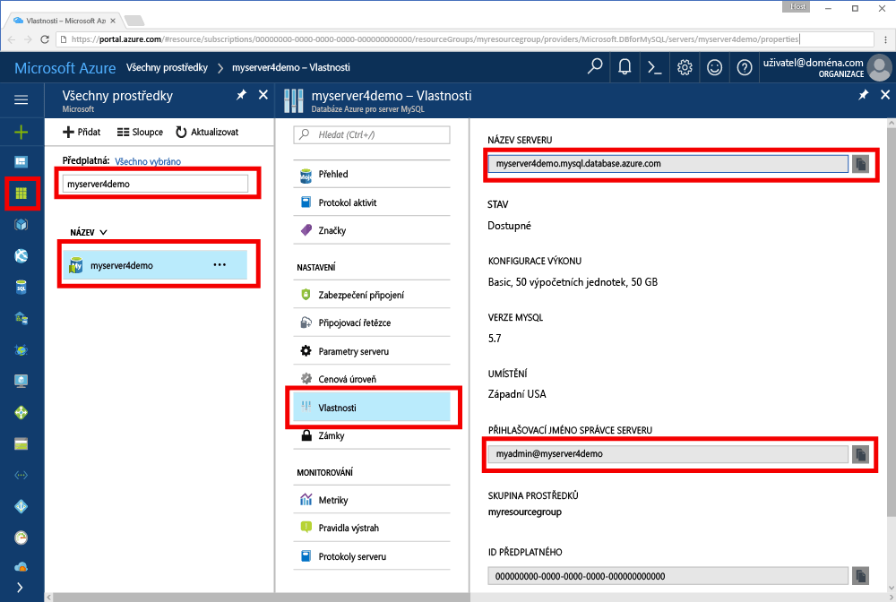

# <a name="azure-database-for-mysql-use-go-language-to-connect-and-query-data"></a><span data-ttu-id="68bb9-103">Azure Database for MySQL: Připojení a dotazování dat pomocí jazyka Go</span><span class="sxs-lookup"><span data-stu-id="68bb9-103">Azure Database for MySQL: Use Go language to connect and query data</span></span>
<span data-ttu-id="68bb9-104">Tento rychlý start ukazuje, jak se připojit ke službě Azure Database for MySQL pomocí kódu napsaného v jazyce [Go](https://golang.org/) z platforem Windows, Ubuntu Linux a Apple macOS.</span><span class="sxs-lookup"><span data-stu-id="68bb9-104">This quickstart demonstrates how to connect to an Azure Database for MySQL using code written in the [Go](https://golang.org/) language from Windows, Ubuntu Linux, and Apple macOS platforms.</span></span> <span data-ttu-id="68bb9-105">Ukazuje, jak pomocí příkazů jazyka SQL dotazovat, vkládat, aktualizovat a odstraňovat data v databázi.</span><span class="sxs-lookup"><span data-stu-id="68bb9-105">It shows how to use SQL statements to query, insert, update, and delete data in the database.</span></span> <span data-ttu-id="68bb9-106">V tomto článku se předpokládá, že máte zkušenosti s vývojem pomocí jazyka Go, ale teprve začínáte pracovat se službou Azure Database for MySQL.</span><span class="sxs-lookup"><span data-stu-id="68bb9-106">This article assumes you are familiar with development using Go, but that you are new to working with Azure Database for MySQL.</span></span>

## <a name="prerequisites"></a><span data-ttu-id="68bb9-107">Požadavky</span><span class="sxs-lookup"><span data-stu-id="68bb9-107">Prerequisites</span></span>
<span data-ttu-id="68bb9-108">Tento rychlý start jako výchozí bod využívá prostředky vytvořené v některém z těchto průvodců:</span><span class="sxs-lookup"><span data-stu-id="68bb9-108">This quickstart uses the resources created in either of these guides as a starting point:</span></span>
- [<span data-ttu-id="68bb9-109">Vytvoření serveru Azure Database for MySQL pomocí webu Azure Portal</span><span class="sxs-lookup"><span data-stu-id="68bb9-109">Create an Azure Database for MySQL server using Azure portal</span></span>](./quickstart-create-mysql-server-database-using-azure-portal.md)
- [<span data-ttu-id="68bb9-110">Vytvoření serveru Azure Database for MySQL pomocí Azure CLI</span><span class="sxs-lookup"><span data-stu-id="68bb9-110">Create an Azure Database for MySQL server using Azure CLI</span></span>](./quickstart-create-mysql-server-database-using-azure-cli.md)

## <a name="install-go-and-mysql-connector"></a><span data-ttu-id="68bb9-111">Instalace jazyka Go a konektoru MySQL</span><span class="sxs-lookup"><span data-stu-id="68bb9-111">Install Go and MySQL connector</span></span>
<span data-ttu-id="68bb9-112">Nainstalujte na svém počítači jazyk [Go](https://golang.org/doc/install) a ovladač [go-sql-driver for MySQL](https://github.com/go-sql-driver/mysql#installation).</span><span class="sxs-lookup"><span data-stu-id="68bb9-112">Install [Go](https://golang.org/doc/install) and the [go-sql-driver for MySQL](https://github.com/go-sql-driver/mysql#installation) on your own machine.</span></span> <span data-ttu-id="68bb9-113">V závislosti na vaší platformě postupujte podle příslušných kroků:</span><span class="sxs-lookup"><span data-stu-id="68bb9-113">Depending on your platform, follow the steps:</span></span>

### <a name="windows"></a><span data-ttu-id="68bb9-114">Windows</span><span class="sxs-lookup"><span data-stu-id="68bb9-114">Windows</span></span>
1. <span data-ttu-id="68bb9-115">[Stáhněte](https://golang.org/dl/) a nainstalujte jazyk Go pro Microsoft Windows podle [pokynů k instalaci](https://golang.org/doc/install).</span><span class="sxs-lookup"><span data-stu-id="68bb9-115">[Download](https://golang.org/dl/) and install Go for Microsoft Windows according to the [installation instructions](https://golang.org/doc/install).</span></span>
2. <span data-ttu-id="68bb9-116">Z nabídky Start spusťte příkazový řádek.</span><span class="sxs-lookup"><span data-stu-id="68bb9-116">Launch the command prompt from the start menu.</span></span>
3. <span data-ttu-id="68bb9-117">Vytvořte složku pro váš projekt, například:</span><span class="sxs-lookup"><span data-stu-id="68bb9-117">Make a folder for your project such.</span></span> <span data-ttu-id="68bb9-118">`mkdir  %USERPROFILE%\go\src\mysqlgo`.</span><span class="sxs-lookup"><span data-stu-id="68bb9-118">`mkdir  %USERPROFILE%\go\src\mysqlgo`.</span></span>
4. <span data-ttu-id="68bb9-119">Změňte adresář na složku projektu, například `cd %USERPROFILE%\go\src\mysqlgo`.</span><span class="sxs-lookup"><span data-stu-id="68bb9-119">Change directory into the project folder, such as `cd %USERPROFILE%\go\src\mysqlgo`.</span></span>
5. <span data-ttu-id="68bb9-120">Nastavte proměnnou prostředí GOPATH tak, aby odkazovala na adresář se zdrojovým kódem.</span><span class="sxs-lookup"><span data-stu-id="68bb9-120">Set the environment variable for GOPATH to point to the source code directory.</span></span> <span data-ttu-id="68bb9-121">`set GOPATH=%USERPROFILE%\go`.</span><span class="sxs-lookup"><span data-stu-id="68bb9-121">`set GOPATH=%USERPROFILE%\go`.</span></span>
6. <span data-ttu-id="68bb9-122">Nainstalujte ovladač [go-sql-driver for mysql](https://github.com/go-sql-driver/mysql#installation) spuštěním příkazu`go get github.com/go-sql-driver/mysql`.</span><span class="sxs-lookup"><span data-stu-id="68bb9-122">Install the [go-sql-driver for mysql](https://github.com/go-sql-driver/mysql#installation) by running the `go get github.com/go-sql-driver/mysql` command.</span></span>

   <span data-ttu-id="68bb9-123">Stručně řečeno, nainstalujte jazyk Go a potom na příkazovém řádku spusťte následující příkazy:</span><span class="sxs-lookup"><span data-stu-id="68bb9-123">In summary, install Go, then run these commands in the command prompt:</span></span>
   ```cmd
   mkdir  %USERPROFILE%\go\src\mysqlgo
   cd %USERPROFILE%\go\src\mysqlgo
   set GOPATH=%USERPROFILE%\go
   go get github.com/go-sql-driver/mysql
   ```

### <a name="linux-ubuntu"></a><span data-ttu-id="68bb9-124">Linux (Ubuntu)</span><span class="sxs-lookup"><span data-stu-id="68bb9-124">Linux (Ubuntu)</span></span>
1. <span data-ttu-id="68bb9-125">Spusťte prostředí Bash.</span><span class="sxs-lookup"><span data-stu-id="68bb9-125">Launch the Bash shell.</span></span> 
2. <span data-ttu-id="68bb9-126">Nainstalujte jazyk Go spuštěním příkazu `sudo apt-get install golang-go`.</span><span class="sxs-lookup"><span data-stu-id="68bb9-126">Install Go by running `sudo apt-get install golang-go`.</span></span>
3. <span data-ttu-id="68bb9-127">Ve svém domovském adresáři vytvořte složku pro projekt, například `mkdir -p ~/go/src/mysqlgo/`.</span><span class="sxs-lookup"><span data-stu-id="68bb9-127">Make a folder for your project in your home directory, such as `mkdir -p ~/go/src/mysqlgo/`.</span></span>
4. <span data-ttu-id="68bb9-128">Změňte adresář na tuto složku, například `cd ~/go/src/mysqlgo/`.</span><span class="sxs-lookup"><span data-stu-id="68bb9-128">Change directory into the folder, such as `cd ~/go/src/mysqlgo/`.</span></span>
5. <span data-ttu-id="68bb9-129">Nastavte proměnnou prostředí GOPATH tak, aby odkazovala na platný zdrojový adresář, jako je například aktuální složka go ve vašem domovském adresáři.</span><span class="sxs-lookup"><span data-stu-id="68bb9-129">Set the GOPATH environment variable to point to a valid source directory, such as your current home directory's go folder.</span></span> <span data-ttu-id="68bb9-130">Spuštěním příkazu `export GOPATH=~/go` v prostředí Bash přidejte adresář go jako hodnotu proměnné GOPATH pro aktuální relaci prostředí.</span><span class="sxs-lookup"><span data-stu-id="68bb9-130">At the bash shell, run `export GOPATH=~/go` to add the go directory as the GOPATH for the current shell session.</span></span>
6. <span data-ttu-id="68bb9-131">Nainstalujte ovladač [go-sql-driver for mysql](https://github.com/go-sql-driver/mysql#installation) spuštěním příkazu`go get github.com/go-sql-driver/mysql`.</span><span class="sxs-lookup"><span data-stu-id="68bb9-131">Install the [go-sql-driver for mysql](https://github.com/go-sql-driver/mysql#installation) by running the `go get github.com/go-sql-driver/mysql` command.</span></span>

   <span data-ttu-id="68bb9-132">Stručně řečeno, spusťte tyto příkazy Bash:</span><span class="sxs-lookup"><span data-stu-id="68bb9-132">In summary, run these bash commands:</span></span>
   ```bash
   sudo apt-get install golang-go
   mkdir -p ~/go/src/mysqlgo/
   cd ~/go/src/mysqlgo/
   export GOPATH=~/go/
   go get github.com/go-sql-driver/mysql
   ```

### <a name="apple-macos"></a><span data-ttu-id="68bb9-133">Apple macOS</span><span class="sxs-lookup"><span data-stu-id="68bb9-133">Apple macOS</span></span>
1. <span data-ttu-id="68bb9-134">Stáhněte a nainstalujte jazyk Go podle [pokynů k instalaci](https://golang.org/doc/install) odpovídajících vaší platformě.</span><span class="sxs-lookup"><span data-stu-id="68bb9-134">Download and install Go according to the [installation instructions](https://golang.org/doc/install)  matching your platform.</span></span> 
2. <span data-ttu-id="68bb9-135">Spusťte prostředí Bash.</span><span class="sxs-lookup"><span data-stu-id="68bb9-135">Launch the Bash shell.</span></span> 
3. <span data-ttu-id="68bb9-136">Ve svém domovském adresáři vytvořte složku pro projekt, například `mkdir -p ~/go/src/mysqlgo/`.</span><span class="sxs-lookup"><span data-stu-id="68bb9-136">Make a folder for your project in your home directory, such as `mkdir -p ~/go/src/mysqlgo/`.</span></span>
4. <span data-ttu-id="68bb9-137">Změňte adresář na tuto složku, například `cd ~/go/src/mysqlgo/`.</span><span class="sxs-lookup"><span data-stu-id="68bb9-137">Change directory into the folder, such as `cd ~/go/src/mysqlgo/`.</span></span>
5. <span data-ttu-id="68bb9-138">Nastavte proměnnou prostředí GOPATH tak, aby odkazovala na platný zdrojový adresář, jako je například aktuální složka go ve vašem domovském adresáři.</span><span class="sxs-lookup"><span data-stu-id="68bb9-138">Set the GOPATH environment variable to point to a valid source directory, such as your current home directory's go folder.</span></span> <span data-ttu-id="68bb9-139">Spuštěním příkazu `export GOPATH=~/go` v prostředí Bash přidejte adresář go jako hodnotu proměnné GOPATH pro aktuální relaci prostředí.</span><span class="sxs-lookup"><span data-stu-id="68bb9-139">At the bash shell, run `export GOPATH=~/go` to add the go directory as the GOPATH for the current shell session.</span></span>
6. <span data-ttu-id="68bb9-140">Nainstalujte ovladač [go-sql-driver for mysql](https://github.com/go-sql-driver/mysql#installation) spuštěním příkazu`go get github.com/go-sql-driver/mysql`.</span><span class="sxs-lookup"><span data-stu-id="68bb9-140">Install the [go-sql-driver for mysql](https://github.com/go-sql-driver/mysql#installation) by running the `go get github.com/go-sql-driver/mysql` command.</span></span>

   <span data-ttu-id="68bb9-141">Stručně řečeno, nainstalujte jazyk Go a potom spusťte tyto příkazy Bash:</span><span class="sxs-lookup"><span data-stu-id="68bb9-141">In summary, install Go, then run these bash commands:</span></span>
   ```bash
   mkdir -p ~/go/src/mysqlgo/
   cd ~/go/src/mysqlgo/
   export GOPATH=~/go/
   go get github.com/go-sql-driver/mysql
   ```

## <a name="get-connection-information"></a><span data-ttu-id="68bb9-142">Získání informací o připojení</span><span class="sxs-lookup"><span data-stu-id="68bb9-142">Get connection information</span></span>
<span data-ttu-id="68bb9-143">Získejte informace o připojení potřebné pro připojení ke službě Azure Database for MySQL.</span><span class="sxs-lookup"><span data-stu-id="68bb9-143">Get the connection information needed to connect to the Azure Database for MySQL.</span></span> <span data-ttu-id="68bb9-144">Potřebujete plně kvalifikovaný název serveru a přihlašovací údaje.</span><span class="sxs-lookup"><span data-stu-id="68bb9-144">You need the fully qualified server name and login credentials.</span></span>

1. <span data-ttu-id="68bb9-145">Přihlaste se k [portálu Azure](https://portal.azure.com/).</span><span class="sxs-lookup"><span data-stu-id="68bb9-145">Log in to the [Azure portal](https://portal.azure.com/).</span></span>
2. <span data-ttu-id="68bb9-146">V nabídce vlevo na webu Azure Portal klikněte na **Všechny prostředky** a vyhledejte vytvořený server, například **myserver4demo**.</span><span class="sxs-lookup"><span data-stu-id="68bb9-146">From the left-hand menu in Azure portal, click **All resources** and search for the server you have creased, such as **myserver4demo**.</span></span>
3. <span data-ttu-id="68bb9-147">Klikněte na název serveru **myserver4demo**.</span><span class="sxs-lookup"><span data-stu-id="68bb9-147">Click the server name **myserver4demo**.</span></span>
4. <span data-ttu-id="68bb9-148">Vyberte stránku **Vlastnosti** serveru.</span><span class="sxs-lookup"><span data-stu-id="68bb9-148">Select the server's **Properties** page.</span></span> <span data-ttu-id="68bb9-149">Poznamenejte si **Název serveru** a **Přihlašovací jméno správce serveru**.</span><span class="sxs-lookup"><span data-stu-id="68bb9-149">Make a note of the **Server name** and **Server admin login name**.</span></span>
 <span data-ttu-id="68bb9-150"></span><span class="sxs-lookup"><span data-stu-id="68bb9-150"></span></span>
5. <span data-ttu-id="68bb9-151">Pokud zapomenete přihlašovací údaje k serveru, přejděte na stránku **Přehled**, kde můžete zobrazit přihlašovací jméno správce serveru a v případě potřeby resetovat heslo.</span><span class="sxs-lookup"><span data-stu-id="68bb9-151">If you forget your server login information, navigate to the **Overview** page to view the Server admin login name and, if necessary, reset the password.</span></span>
   

## <a name="build-and-run-go-code"></a><span data-ttu-id="68bb9-152">Sestavení a spuštění kódu jazyka Go</span><span class="sxs-lookup"><span data-stu-id="68bb9-152">Build and run Go code</span></span> 
1. <span data-ttu-id="68bb9-153">K psaní kódu jazyka Go můžete použít jednoduchý textový editor, jako je Poznámkový blok v systému Microsoft Windows, [vi](http://manpages.ubuntu.com/manpages/xenial/man1/nvi.1.html#contenttoc5) nebo [Nano](https://www.nano-editor.org/) v systému Ubuntu nebo TextEdit v systému macOS.</span><span class="sxs-lookup"><span data-stu-id="68bb9-153">To write Golang code, you can use a simple text editor, such as Notepad in Microsoft Windows, [vi](http://manpages.ubuntu.com/manpages/xenial/man1/nvi.1.html#contenttoc5) or [Nano](https://www.nano-editor.org/) in Ubuntu, or TextEdit in macOS.</span></span> <span data-ttu-id="68bb9-154">Pokud dáváte přednost bohatšímu integrovanému vývojovému prostředí (IDE), vyzkoušejte [Gogland](https://www.jetbrains.com/go/) od JetBrains, [Visual Studio Code](https://code.visualstudio.com/) od Microsoftu nebo [Atom](https://atom.io/).</span><span class="sxs-lookup"><span data-stu-id="68bb9-154">If you prefer a richer Interactive Development Environment (IDE) try [Gogland](https://www.jetbrains.com/go/) by Jetbrains, [Visual Studio Code](https://code.visualstudio.com/) by Microsoft, or [Atom](https://atom.io/).</span></span>
2. <span data-ttu-id="68bb9-155">Kód jazyka Go z dalších částí vložte do textových souborů a tyto soubory uložte do složky vašeho projektu s příponou \*.go, například `%USERPROFILE%\go\src\mysqlgo\createtable.go` (cesta ve Windows) nebo `~/go/src/mysqlgo/createtable.go` (cesta v Linuxu).</span><span class="sxs-lookup"><span data-stu-id="68bb9-155">Paste the Go code from the sections below into text files, and save into your project folder with file extension \*.go, such as Windows path `%USERPROFILE%\go\src\mysqlgo\createtable.go` or Linux path `~/go/src/mysqlgo/createtable.go`.</span></span>
3. <span data-ttu-id="68bb9-156">V kódu vyhledejte konstanty `HOST`, `DATABASE`, `USER` a `PASSWORD` a příklady hodnot nahraďte vlastními hodnotami.</span><span class="sxs-lookup"><span data-stu-id="68bb9-156">Locate the `HOST`, `DATABASE`, `USER`, and `PASSWORD` constants in the code, and replace the example values with your own values.</span></span> 
4. <span data-ttu-id="68bb9-157">Spusťte příkazový řádek nebo prostředí Bash.</span><span class="sxs-lookup"><span data-stu-id="68bb9-157">Launch the command prompt or bash shell.</span></span> <span data-ttu-id="68bb9-158">Změňte adresář na složku vašeho projektu.</span><span class="sxs-lookup"><span data-stu-id="68bb9-158">Change directory into your project folder.</span></span> <span data-ttu-id="68bb9-159">Například ve Windows pomocí příkazu `cd %USERPROFILE%\go\src\mysqlgo\`.</span><span class="sxs-lookup"><span data-stu-id="68bb9-159">For example, on Windows `cd %USERPROFILE%\go\src\mysqlgo\`.</span></span> <span data-ttu-id="68bb9-160">V Linuxu pomocí příkazu `cd ~/go/src/mysqlgo/`.</span><span class="sxs-lookup"><span data-stu-id="68bb9-160">On Linux `cd ~/go/src/mysqlgo/`.</span></span>  <span data-ttu-id="68bb9-161">Některá ze zmíněných integrovaných vývojových prostředí (IDE) nabízejí možnosti ladění a modulu runtime, které nevyžadují příkazy prostředí.</span><span class="sxs-lookup"><span data-stu-id="68bb9-161">Some of the IDE editors mentioned offer debug and runtime capabilities without requiring shell commands.</span></span>
5. <span data-ttu-id="68bb9-162">Spusťte kód zadáním příkazu `go run createtable.go`, který aplikaci zkompiluje a spustí.</span><span class="sxs-lookup"><span data-stu-id="68bb9-162">Run the code by typing the command `go run createtable.go` to compile the application and run it.</span></span> 
6. <span data-ttu-id="68bb9-163">Alternativně, pokud z kódu chcete sestavit nativní aplikaci, spusťte příkaz `go build createtable.go` a pak aplikaci spusťte pomocí souboru `createtable.exe`.</span><span class="sxs-lookup"><span data-stu-id="68bb9-163">Alternatively, to build the code into a native application, `go build createtable.go`, then launch `createtable.exe` to run the application.</span></span>

## <a name="connect-create-table-and-insert-data"></a><span data-ttu-id="68bb9-164">Připojení, vytvoření tabulky a vložení dat</span><span class="sxs-lookup"><span data-stu-id="68bb9-164">Connect, create table, and insert data</span></span>
<span data-ttu-id="68bb9-165">Pomocí následujícího kódu se připojte k serveru, vytvořte tabulku a nahrajte data s využitím příkazu **INSERT** jazyka SQL.</span><span class="sxs-lookup"><span data-stu-id="68bb9-165">Use the following code to connect to the server, create a table, and load the data using an **INSERT** SQL statement.</span></span> 

<span data-ttu-id="68bb9-166">Kód importuje tři balíčky: [balíček sql](https://golang.org/pkg/database/sql/), balíček [go sql driver for mysql](https://github.com/go-sql-driver/mysql#installation) jako ovladač pro komunikaci se službou Azure Database for MySQL a [balíček fmt](https://golang.org/pkg/fmt/) pro tisk vstupů a výstupů na příkazovém řádku.</span><span class="sxs-lookup"><span data-stu-id="68bb9-166">The code imports three packages: the [sql package](https://golang.org/pkg/database/sql/), the [go sql driver for mysql](https://github.com/go-sql-driver/mysql#installation) as a driver to communicate with the Azure Database for MySQL, and the [fmt package](https://golang.org/pkg/fmt/) for printed input and output on the command line.</span></span>

<span data-ttu-id="68bb9-167">Kód volá metodu [sql.Open()](http://go-database-sql.org/accessing.html) pro připojení ke službě Azure Database for MySQL a pomocí metody [db.Ping()](https://golang.org/pkg/database/sql/#DB.Ping) zkontroluje stav připojení.</span><span class="sxs-lookup"><span data-stu-id="68bb9-167">The code calls method [sql.Open()](http://go-database-sql.org/accessing.html) to connect to Azure Database for MySQL, and checks the connection using method [db.Ping()](https://golang.org/pkg/database/sql/#DB.Ping).</span></span> <span data-ttu-id="68bb9-168">Po celou dobu se používá [popisovač databáze](https://golang.org/pkg/database/sql/#DB), který uchovává fond připojení pro databázový server.</span><span class="sxs-lookup"><span data-stu-id="68bb9-168">A [database handle](https://golang.org/pkg/database/sql/#DB) is used throughout, holding the connection pool for the database server.</span></span> <span data-ttu-id="68bb9-169">Kód několikrát volá metodu [Exec()](https://golang.org/pkg/database/sql/#DB.Exec) pro spuštění několika příkazů jazyka DDL.</span><span class="sxs-lookup"><span data-stu-id="68bb9-169">The code calls the [Exec()](https://golang.org/pkg/database/sql/#DB.Exec) method several times to run several DDL commands.</span></span> <span data-ttu-id="68bb9-170">Kód také pomocí metod [Prepare()](http://go-database-sql.org/prepared.html) a Exec() spouští připravené příkazy s různými parametry pro vložení tří řádků.</span><span class="sxs-lookup"><span data-stu-id="68bb9-170">The code also uses the [Prepare()](http://go-database-sql.org/prepared.html) and Exec() to run prepared statements with different parameters to insert three rows.</span></span> <span data-ttu-id="68bb9-171">Pokaždé se pomocí vlastní metody checkError() zkontroluje, jestli nedošlo k chybě, a pokud k nějaké dojde, kód se nouzově ukončí.</span><span class="sxs-lookup"><span data-stu-id="68bb9-171">Each time a custom checkError() method is used to check if an error occurred and panic to exit.</span></span>

<span data-ttu-id="68bb9-172">Nahraďte konstanty `host`, `database`, `user` a `password` vlastními hodnotami.</span><span class="sxs-lookup"><span data-stu-id="68bb9-172">Replace the `host`, `database`, `user`, and `password` constants with your own values.</span></span> 

```Go
package main

import (
    "database/sql"
    "fmt"

    _ "github.com/go-sql-driver/mysql"
)

const (
    host     = "myserver4demo.mysql.database.azure.com"
    database = "quickstartdb"
    user     = "myadmin@myserver4demo"
    password = "yourpassword"
)

func checkError(err error) {
    if err != nil {
        panic(err)
    }
}

func main() {

    // Initialize connection string.
    var connectionString = fmt.Sprintf("%s:%s@tcp(%s:3306)/%s?allowNativePasswords=true", user, password, host, database)

    // Initialize connection object.
    db, err := sql.Open("mysql", connectionString)
    checkError(err)
    defer db.Close()

    err = db.Ping()
    checkError(err)
    fmt.Println("Successfully created connection to database.")

    // Drop previous table of same name if one exists.
    _, err = db.Exec("DROP TABLE IF EXISTS inventory;")
    checkError(err)
    fmt.Println("Finished dropping table (if existed).")

    // Create table.
    _, err = db.Exec("CREATE TABLE inventory (id serial PRIMARY KEY, name VARCHAR(50), quantity INTEGER);")
    checkError(err)
    fmt.Println("Finished creating table.")

    // Insert some data into table.
    sqlStatement, err := db.Prepare("INSERT INTO inventory (name, quantity) VALUES (?, ?);")
    res, err := sqlStatement.Exec("banana", 150)
    checkError(err)
    rowCount, err := res.RowsAffected()
    fmt.Printf("Inserted %d row(s) of data.\n", rowCount)

    res, err = sqlStatement.Exec("orange", 154)
    checkError(err)
    rowCount, err = res.RowsAffected()
    fmt.Printf("Inserted %d row(s) of data.\n", rowCount)

    res, err = sqlStatement.Exec("apple", 100)
    checkError(err)
    rowCount, err = res.RowsAffected()
    fmt.Printf("Inserted %d row(s) of data.\n", rowCount)
    fmt.Println("Done.")
}

```

## <a name="read-data"></a><span data-ttu-id="68bb9-173">Čtení dat</span><span class="sxs-lookup"><span data-stu-id="68bb9-173">Read data</span></span>
<span data-ttu-id="68bb9-174">Pomocí následujícího kódu se připojte a načtěte data s využitím příkazu **SELECT** jazyka SQL.</span><span class="sxs-lookup"><span data-stu-id="68bb9-174">Use the following code to connect and read the data using a **SELECT** SQL statement.</span></span> 

<span data-ttu-id="68bb9-175">Kód importuje tři balíčky: [balíček sql](https://golang.org/pkg/database/sql/), balíček [go sql driver for mysql](https://github.com/go-sql-driver/mysql#installation) jako ovladač pro komunikaci se službou Azure Database for MySQL a [balíček fmt](https://golang.org/pkg/fmt/) pro tisk vstupů a výstupů na příkazovém řádku.</span><span class="sxs-lookup"><span data-stu-id="68bb9-175">The code imports three packages: the [sql package](https://golang.org/pkg/database/sql/), the [go sql driver for mysql](https://github.com/go-sql-driver/mysql#installation) as a driver to communicate with the Azure Database for MySQL, and the [fmt package](https://golang.org/pkg/fmt/) for printed input and output on the command line.</span></span>

<span data-ttu-id="68bb9-176">Kód volá metodu [sql.Open()](http://go-database-sql.org/accessing.html) pro připojení ke službě Azure Database for MySQL a pomocí metody [db.Ping()](https://golang.org/pkg/database/sql/#DB.Ping) zkontroluje stav připojení.</span><span class="sxs-lookup"><span data-stu-id="68bb9-176">The code calls method [sql.Open()](http://go-database-sql.org/accessing.html) to connect to Azure Database for MySQL, and checks the connection using method [db.Ping()](https://golang.org/pkg/database/sql/#DB.Ping).</span></span> <span data-ttu-id="68bb9-177">Po celou dobu se používá [popisovač databáze](https://golang.org/pkg/database/sql/#DB), který uchovává fond připojení pro databázový server.</span><span class="sxs-lookup"><span data-stu-id="68bb9-177">A [database handle](https://golang.org/pkg/database/sql/#DB) is used throughout, holding the connection pool for the database server.</span></span> <span data-ttu-id="68bb9-178">Kód volá metodu [Query()](https://golang.org/pkg/database/sql/#DB.Query) pro spuštění příkazu select.</span><span class="sxs-lookup"><span data-stu-id="68bb9-178">The code calls the [Query()](https://golang.org/pkg/database/sql/#DB.Query) method to run the select command.</span></span> <span data-ttu-id="68bb9-179">Potom spustí metodu [Next()](https://golang.org/pkg/database/sql/#Rows.Next) pro iteraci sadou výsledků dotazu a metodu [Scan()](https://golang.org/pkg/database/sql/#Rows.Scan) pro parsování hodnot sloupců a uložení těchto hodnot do proměnných.</span><span class="sxs-lookup"><span data-stu-id="68bb9-179">Then it runs [Next()](https://golang.org/pkg/database/sql/#Rows.Next) to iterate through the result set and [Scan()](https://golang.org/pkg/database/sql/#Rows.Scan) to parse the column values, saving the value into variables.</span></span> <span data-ttu-id="68bb9-180">Pokaždé se pomocí vlastní metody checkError() zkontroluje, jestli nedošlo k chybě, a pokud k nějaké dojde, kód se nouzově ukončí.</span><span class="sxs-lookup"><span data-stu-id="68bb9-180">Each time a custom checkError() method is used to check if an error occurred and panic to exit.</span></span>

<span data-ttu-id="68bb9-181">Nahraďte konstanty `host`, `database`, `user` a `password` vlastními hodnotami.</span><span class="sxs-lookup"><span data-stu-id="68bb9-181">Replace the `host`, `database`, `user`, and `password` constants with your own values.</span></span> 

```Go
package main

import (
    "database/sql"
    "fmt"

    _ "github.com/go-sql-driver/mysql"
)

const (
    host     = "myserver4demo.mysql.database.azure.com"
    database = "quickstartdb"
    user     = "myadmin@myserver4demo"
    password = "yourpassword"
)

func checkError(err error) {
    if err != nil {
        panic(err)
    }
}

func main() {

    // Initialize connection string.
    var connectionString = fmt.Sprintf("%s:%s@tcp(%s:3306)/%s?allowNativePasswords=true", user, password, host, database)

    // Initialize connection object.
    db, err := sql.Open("mysql", connectionString)
    checkError(err)
    defer db.Close()

    err = db.Ping()
    checkError(err)
    fmt.Println("Successfully created connection to database.")

    // Variables for printing column data when scanned.
    var (
        id       int
        name     string
        quantity int
    )

    // Read some data from the table.
    rows, err := db.Query("SELECT id, name, quantity from inventory;")
    checkError(err)
    defer rows.Close()
    fmt.Println("Reading data:")
    for rows.Next() {
        err := rows.Scan(&id, &name, &quantity)
        checkError(err)
        fmt.Printf("Data row = (%d, %s, %d)\n", id, name, quantity)
    }
    err = rows.Err()
    checkError(err)
    fmt.Println("Done.")
}
```

## <a name="update-data"></a><span data-ttu-id="68bb9-182">Aktualizace dat</span><span class="sxs-lookup"><span data-stu-id="68bb9-182">Update data</span></span>
<span data-ttu-id="68bb9-183">Pomocí následujícího kódu se připojte a aktualizujte data s využitím příkazu **UPDATE** jazyka SQL.</span><span class="sxs-lookup"><span data-stu-id="68bb9-183">Use the following code to connect and update the data using a **UPDATE** SQL statement.</span></span> 

<span data-ttu-id="68bb9-184">Kód importuje tři balíčky: [balíček sql](https://golang.org/pkg/database/sql/), balíček [go sql driver for mysql](https://github.com/go-sql-driver/mysql#installation) jako ovladač pro komunikaci se službou Azure Database for MySQL a [balíček fmt](https://golang.org/pkg/fmt/) pro tisk vstupů a výstupů na příkazovém řádku.</span><span class="sxs-lookup"><span data-stu-id="68bb9-184">The code imports three packages: the [sql package](https://golang.org/pkg/database/sql/), the [go sql driver for mysql](https://github.com/go-sql-driver/mysql#installation) as a driver to communicate with the Azure Database for MySQL, and the [fmt package](https://golang.org/pkg/fmt/) for printed input and output on the command line.</span></span>

<span data-ttu-id="68bb9-185">Kód volá metodu [sql.Open()](http://go-database-sql.org/accessing.html) pro připojení ke službě Azure Database for MySQL a pomocí metody [db.Ping()](https://golang.org/pkg/database/sql/#DB.Ping) zkontroluje stav připojení.</span><span class="sxs-lookup"><span data-stu-id="68bb9-185">The code calls method [sql.Open()](http://go-database-sql.org/accessing.html) to connect to Azure Database for MySQL, and checks the connection using method [db.Ping()](https://golang.org/pkg/database/sql/#DB.Ping).</span></span> <span data-ttu-id="68bb9-186">Po celou dobu se používá [popisovač databáze](https://golang.org/pkg/database/sql/#DB), který uchovává fond připojení pro databázový server.</span><span class="sxs-lookup"><span data-stu-id="68bb9-186">A [database handle](https://golang.org/pkg/database/sql/#DB) is used throughout, holding the connection pool for the database server.</span></span> <span data-ttu-id="68bb9-187">Kód volá metodu [Exec()](https://golang.org/pkg/database/sql/#DB.Exec) pro spuštění příkazu update.</span><span class="sxs-lookup"><span data-stu-id="68bb9-187">The code calls the [Exec()](https://golang.org/pkg/database/sql/#DB.Exec) method to run the update command.</span></span> <span data-ttu-id="68bb9-188">Pokaždé se pomocí vlastní metody checkError() zkontroluje, jestli nedošlo k chybě, a pokud k nějaké dojde, kód se nouzově ukončí.</span><span class="sxs-lookup"><span data-stu-id="68bb9-188">Each time a custom checkError() method is used to check if an error occurred and panic to exit.</span></span>

<span data-ttu-id="68bb9-189">Nahraďte konstanty `host`, `database`, `user` a `password` vlastními hodnotami.</span><span class="sxs-lookup"><span data-stu-id="68bb9-189">Replace the `host`, `database`, `user`, and `password` constants with your own values.</span></span> 

```Go
package main

import (
    "database/sql"
    "fmt"

    _ "github.com/go-sql-driver/mysql"
)

const (
    host     = "myserver4demo.mysql.database.azure.com"
    database = "quickstartdb"
    user     = "myadmin@myserver4demo"
    password = "yourpassword"
)

func checkError(err error) {
    if err != nil {
        panic(err)
    }
}

func main() {

    // Initialize connection string.
    var connectionString = fmt.Sprintf("%s:%s@tcp(%s:3306)/%s?allowNativePasswords=true", user, password, host, database)

    // Initialize connection object.
    db, err := sql.Open("mysql", connectionString)
    checkError(err)
    defer db.Close()

    err = db.Ping()
    checkError(err)
    fmt.Println("Successfully created connection to database.")

    // Modify some data in table.
    rows, err := db.Exec("UPDATE inventory SET quantity = ? WHERE name = ?", 200, "banana")
    checkError(err)
    rowCount, err := rows.RowsAffected()
    fmt.Printf("Deleted %d row(s) of data.\n", rowCount)
    fmt.Println("Done.")
}
```

## <a name="delete-data"></a><span data-ttu-id="68bb9-190">Odstranění dat</span><span class="sxs-lookup"><span data-stu-id="68bb9-190">Delete data</span></span>
<span data-ttu-id="68bb9-191">Pomocí následujícího kódu se připojte a odeberte data s využitím příkazu **DELETE** jazyka SQL.</span><span class="sxs-lookup"><span data-stu-id="68bb9-191">Use the following code to connect and remove data using a **DELETE** SQL statement.</span></span> 

<span data-ttu-id="68bb9-192">Kód importuje tři balíčky: [balíček sql](https://golang.org/pkg/database/sql/), balíček [go sql driver for mysql](https://github.com/go-sql-driver/mysql#installation) jako ovladač pro komunikaci se službou Azure Database for MySQL a [balíček fmt](https://golang.org/pkg/fmt/) pro tisk vstupů a výstupů na příkazovém řádku.</span><span class="sxs-lookup"><span data-stu-id="68bb9-192">The code imports three packages: the [sql package](https://golang.org/pkg/database/sql/), the [go sql driver for mysql](https://github.com/go-sql-driver/mysql#installation) as a driver to communicate with the Azure Database for MySQL, and the [fmt package](https://golang.org/pkg/fmt/) for printed input and output on the command line.</span></span>

<span data-ttu-id="68bb9-193">Kód volá metodu [sql.Open()](http://go-database-sql.org/accessing.html) pro připojení ke službě Azure Database for MySQL a pomocí metody [db.Ping()](https://golang.org/pkg/database/sql/#DB.Ping) zkontroluje stav připojení.</span><span class="sxs-lookup"><span data-stu-id="68bb9-193">The code calls method [sql.Open()](http://go-database-sql.org/accessing.html) to connect to Azure Database for MySQL, and checks the connection using method [db.Ping()](https://golang.org/pkg/database/sql/#DB.Ping).</span></span> <span data-ttu-id="68bb9-194">Po celou dobu se používá [popisovač databáze](https://golang.org/pkg/database/sql/#DB), který uchovává fond připojení pro databázový server.</span><span class="sxs-lookup"><span data-stu-id="68bb9-194">A [database handle](https://golang.org/pkg/database/sql/#DB) is used throughout, holding the connection pool for the database server.</span></span> <span data-ttu-id="68bb9-195">Kód volá metodu [Exec()](https://golang.org/pkg/database/sql/#DB.Exec) pro spuštění příkazu delete.</span><span class="sxs-lookup"><span data-stu-id="68bb9-195">The code calls the [Exec()](https://golang.org/pkg/database/sql/#DB.Exec) method to run the delete command.</span></span> <span data-ttu-id="68bb9-196">Pokaždé se pomocí vlastní metody checkError() zkontroluje, jestli nedošlo k chybě, a pokud k nějaké dojde, kód se nouzově ukončí.</span><span class="sxs-lookup"><span data-stu-id="68bb9-196">Each time a custom checkError() method is used to check if an error occurred and panic to exit.</span></span>

<span data-ttu-id="68bb9-197">Nahraďte konstanty `host`, `database`, `user` a `password` vlastními hodnotami.</span><span class="sxs-lookup"><span data-stu-id="68bb9-197">Replace the `host`, `database`, `user`, and `password` constants with your own values.</span></span> 

```Go
package main

import (
    "database/sql"
    "fmt"
    _ "github.com/go-sql-driver/mysql"
)

const (
    host     = "myserver4demo.mysql.database.azure.com"
    database = "quickstartdb"
    user     = "myadmin@myserver4demo"
    password = "yourpassword"
)

func checkError(err error) {
    if err != nil {
        panic(err)
    }
}

func main() {

    // Initialize connection string.
    var connectionString = fmt.Sprintf("%s:%s@tcp(%s:3306)/%s?allowNativePasswords=true", user, password, host, database)

    // Initialize connection object.
    db, err := sql.Open("mysql", connectionString)
    checkError(err)
    defer db.Close()

    err = db.Ping()
    checkError(err)
    fmt.Println("Successfully created connection to database.")

    // Modify some data in table.
    rows, err := db.Exec("DELETE FROM inventory WHERE name = ?", "orange")
    checkError(err)
    rowCount, err := rows.RowsAffected()
    fmt.Printf("Deleted %d row(s) of data.\n", rowCount)
    fmt.Println("Done.")
}
```

## <a name="next-steps"></a><span data-ttu-id="68bb9-198">Další kroky</span><span class="sxs-lookup"><span data-stu-id="68bb9-198">Next steps</span></span>
> [!div class="nextstepaction"]
> [<span data-ttu-id="68bb9-199">Migrace vaší databáze pomocí exportu a importu</span><span class="sxs-lookup"><span data-stu-id="68bb9-199">Migrate your database using Export and Import</span></span>](./concepts-migrate-import-export.md)
