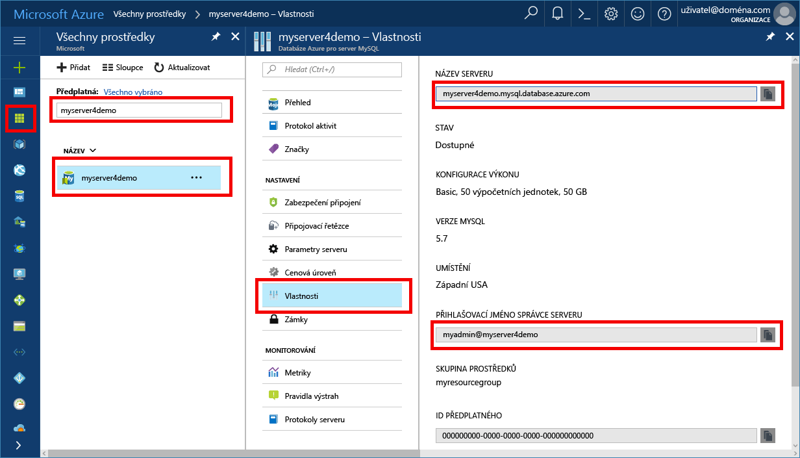

# <a name="azure-database-for-mysql-use-mysql-workbench-tooconnect-and-query-data"></a>Azure databáze pro databázi MySQL: MySQL Workbench použití tooconnect a dotazování dat
Tento rychlý start předvádí jak tooconnect tooan databáze Azure pro používání MySQL hello MySQL Workbench aplikace. 

## <a name="prerequisites"></a>Požadavky
Tento rychlý start využívá prostředky hello vytvořené v některém z těchto průvodcích se dozvíte jako výchozí bod:
- [Vytvoření serveru Azure Database for MySQL pomocí webu Azure Portal](./quickstart-create-mysql-server-database-using-azure-portal.md)
- [Vytvoření serveru Azure Database for MySQL pomocí Azure CLI](./quickstart-create-mysql-server-database-using-azure-cli.md)

## <a name="install-mysql-workbench"></a>Nainstalujte MySQL Workbench
Stáhněte a nainstalujte MySQL Workbench na vašem počítače od [hello MySQL webu](https://dev.mysql.com/downloads/workbench/).

## <a name="get-connection-information"></a>Získání informací o připojení
Získáte hello připojení informace potřebné tooconnect toohello Azure Database pro databázi MySQL. Musíte hello serveru plně kvalifikovaný název a přihlašovací údaje.

1. Přihlaste se toohello [portál Azure](https://portal.azure.com/).

2. Hello levé nabídce na portálu Azure, klikněte na tlačítko **všechny prostředky** a vyhledejte hello serveru, které jste vytvořili, například **myserver4demo**.

3. Klikněte na název serveru hello.

4. Vyberte hello serveru **vlastnosti** stránky. Poznamenejte si hello **název serveru** a **přihlašovací jméno pro Server správce**.

 
 
5. Pokud zapomenete vaše přihlašovací údaje serveru, přejděte toohello **přehled** stránka tooview hello serveru správce přihlašovací jméno a v případě potřeby obnovit heslo hello.

## <a name="connect-toohello-server-using-mysql-workbench"></a>Připojení serveru toohello pomocí MySQL Workbench 
server databáze MySQL tooAzure tooconnect pomocí hello grafického uživatelského rozhraní nástroje MySQL Workbench:

1.  Spusťte hello MySQL Workbench aplikace ve vašem počítači. 

2.  V **nastavit připojení k nové** dialogovém okně zadejte následující informace na hello hello **parametry** karty:

    

    | **Nastavení** | **Navrhovaná hodnota** | **Popis pole** |
    |---|---|---|
    |   Název připojení | Ukázkové připojení | Zadejte popisek pro toto připojení. |
    | Způsob připojení | Standard (TCP/IP) | Standard (TCP/IP) je dostačující. |
    | Název hostitele | *název serveru* | Zadejte hello hodnota názvu serveru, která byla použita při dříve vytvořili hello Azure Database pro databázi MySQL. Náš ukázkový server v příkladu je myserver4demo.mysql.database.azure.com. Použití hello plně kvalifikovaný název domény (\*. mysql.database.azure.com) jako v příkladu hello. Pokud si nepamatujete název serveru, postupujte podle kroků hello v hello předchozí část tooget hello informace o připojení.  |
    | Port | 3306 | Vždy používejte port 3306 při připojování tooAzure databáze pro databázi MySQL. |
    | Uživatelské jméno |  *přihlašovací jméno správce serveru* | Zadejte hello serveru správce přihlašovací uživatelské jméno, když máte vytvořený hello Azure Database pro databázi MySQL. Uživatelské jméno v našem příkladu je myadmin@myserver4demo. Pokud si nepamatujete hello uživatelské jméno, postupujte podle kroků hello v hello předchozí část tooget hello informace o připojení. Formát Hello je  *username@servername* .
    | Heslo | vaše heslo | Klikněte na tlačítko **úložiště v trezoru...**  tlačítko toosave hello heslo. |

3.   Klikněte na tlačítko **Test připojení** tootest, pokud jsou správně nakonfigurovány všechny parametry. 

4.   Klikněte na tlačítko **OK** toosave hello připojení. 

5.   V seznamu hello z **MySQL připojení**, klikněte na serveru odpovídající tooyour hello dlaždic a počkejte toobe připojení hello navázat.

6.   Otevře novou kartu SQL s prázdné editoru můžete zadat své dotazy.

    > [!NOTE]
    > Ve výchozím nastavení je zabezpečení připojení protokol SSL vyžaduje a vynucovat u vaší databázi Azure pro server databáze MySQL. Žádná další konfigurace s certifikáty protokolu SSL je obvykle MySQL Workbench tooconnect tooyour server vyžaduje. Další informace o SSL najdete v tématu [připojení konfigurace protokolu SSL ve vaší aplikaci toosecurely connect tooAzure databáze pro databázi MySQL](./howto-configure-ssl.md).  Pokud potřebujete toodisable SSL, navštivte hello portál Azure a klikněte na tlačítko hello připojení zabezpečení stránky toodisable hello vynutit SSL připojení přepínací tlačítko.

## <a name="create-a-table-insert-data-read-data-update-data-delete-data"></a>Umožňuje vytvořit tabulku, vkládání dat, čtení dat, aktualizace dat, odstranit data
1. Zkopírujte a vložte kód SQL ukázka hello do prázdné tooillustrate kartě SQL ukázková data.

    Tento kód vytvoří prázdnou databázi s názvem quickstartdb a poté vytvoří ukázkovou tabulku s názvem inventáře. Vloží některé řádky a pak přečte hello řádků. Změní hello dat pomocí příkazu update a čtení hello řádků znovu. Nakonec se odstraní řádek a přečte hello řádků znovu.
    
    ```sql
    -- Create a database
    -- DROP DATABASE IF EXISTS quickstartdb;
    CREATE DATABASE quickstartdb;
    USE quickstartdb;
    
    -- Create a table and insert rows
    DROP TABLE IF EXISTS inventory;
    CREATE TABLE inventory (id serial PRIMARY KEY, name VARCHAR(50), quantity INTEGER);
    INSERT INTO inventory (name, quantity) VALUES ('banana', 150);
    INSERT INTO inventory (name, quantity) VALUES ('orange', 154);
    INSERT INTO inventory (name, quantity) VALUES ('apple', 100);
    
    -- Read
    SELECT * FROM inventory;
    
    -- Update
    UPDATE inventory SET quantity = 200 WHERE id = 1;
    SELECT * FROM inventory;
    
    -- Delete
    DELETE FROM inventory WHERE id = 2;
    SELECT * FROM inventory;
    ```

    Hello – snímek obrazovky ukazuje příklad hello kódu SQL ve výstupu SQL Workbench a hello po jeho spuštění.
    
    

2. toorun hello ukázkový kód SQL, klikněte na tlačítko hello zesvětlení bolt ikonu na hello nástrojů hello **soubor SQL** kartě.
3. Všimněte si hello tři záložkách výsledkem hello **výsledek mřížky** části uprostřed hello stránku hello. 
4. Všimněte si hello **výstup** seznam v dolní části hello hello stránky. Hello stav každého příkazu se zobrazí. 

Nyní jste připojení tooAzure databáze pro databázi MySQL pomocí MySQL Workbench a zkontrolují data pomocí jazyka SQL hello.

## <a name="next-steps"></a>Další kroky
> [!div class="nextstepaction"]
> [Migrace vaší databáze pomocí exportu a importu](./concepts-migrate-import-export.md)
