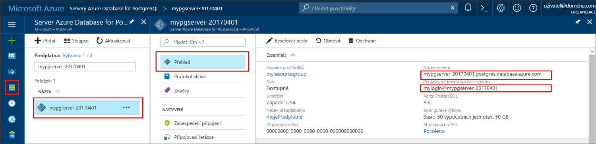

# <a name="azure-database-for-postgresql-use-go-language-to-connect-and-query-data"></a><span data-ttu-id="92233-103">Azure Database for PostgreSQL: Použití jazyka Go k připojení a dotazování dat</span><span class="sxs-lookup"><span data-stu-id="92233-103">Azure Database for PostgreSQL: Use Go language to connect and query data</span></span>
<span data-ttu-id="92233-104">Tento rychlý start ukazuje, jak se připojit ke službě Azure Database for PostgreSQL pomocí kódu napsaného v jazyce [Go](https://golang.org/) (Golang).</span><span class="sxs-lookup"><span data-stu-id="92233-104">This quickstart demonstrates how to connect to an Azure Database for PostgreSQL using code written in the [Go](https://golang.org/) language (golang).</span></span> <span data-ttu-id="92233-105">Ukazuje, jak pomocí příkazů jazyka SQL dotazovat, vkládat, aktualizovat a odstraňovat data v databázi.</span><span class="sxs-lookup"><span data-stu-id="92233-105">It shows how to use SQL statements to query, insert, update, and delete data in the database.</span></span> <span data-ttu-id="92233-106">V tomto článku se předpokládá, že máte zkušenosti s vývojem pomocí jazyka Go, ale teprve začínáte pracovat se službou Azure Database for PostgreSQL.</span><span class="sxs-lookup"><span data-stu-id="92233-106">This article assumes you are familiar with development using Go, but that you are new to working with Azure Database for PostgreSQL.</span></span>

## <a name="prerequisites"></a><span data-ttu-id="92233-107">Požadavky</span><span class="sxs-lookup"><span data-stu-id="92233-107">Prerequisites</span></span>
<span data-ttu-id="92233-108">Tento rychlý start využívá jako výchozí bod prostředky vytvořené v některém z těchto průvodců:</span><span class="sxs-lookup"><span data-stu-id="92233-108">This quickstart uses the resources created in either of these guides as a starting point:</span></span>
- [<span data-ttu-id="92233-109">Vytvoření databáze – portál</span><span class="sxs-lookup"><span data-stu-id="92233-109">Create DB - Portal</span></span>](quickstart-create-server-database-portal.md)
- [<span data-ttu-id="92233-110">Vytvoření databáze – rozhraní příkazového řádku Azure</span><span class="sxs-lookup"><span data-stu-id="92233-110">Create DB - Azure CLI</span></span>](quickstart-create-server-database-azure-cli.md)

## <a name="install-go-and-pq-connector"></a><span data-ttu-id="92233-111">Instalace jazyka Go a konektoru pq</span><span class="sxs-lookup"><span data-stu-id="92233-111">Install Go and pq connector</span></span>
<span data-ttu-id="92233-112">Nainstalujte na svém počítači jazyk [Go](https://golang.org/doc/install) a [ovladač Pure Go Postgres (pq)](https://github.com/lib/pq).</span><span class="sxs-lookup"><span data-stu-id="92233-112">Install [Go](https://golang.org/doc/install) and the [Pure Go Postgres driver (pq)](https://github.com/lib/pq) on your own machine.</span></span> <span data-ttu-id="92233-113">V závislosti na vaší platformě postupujte podle příslušných kroků:</span><span class="sxs-lookup"><span data-stu-id="92233-113">Depending on your platform, follow the steps:</span></span>

### <a name="windows"></a><span data-ttu-id="92233-114">Windows</span><span class="sxs-lookup"><span data-stu-id="92233-114">Windows</span></span>
1. <span data-ttu-id="92233-115">[Stáhněte](https://golang.org/dl/) a nainstalujte jazyk Go pro Microsoft Windows podle [pokynů k instalaci](https://golang.org/doc/install).</span><span class="sxs-lookup"><span data-stu-id="92233-115">[Download](https://golang.org/dl/) and install Go for Microsoft Windows according to the [installation instructions](https://golang.org/doc/install).</span></span>
2. <span data-ttu-id="92233-116">Z nabídky Start spusťte příkazový řádek.</span><span class="sxs-lookup"><span data-stu-id="92233-116">Launch the command prompt from the start menu.</span></span>
3. <span data-ttu-id="92233-117">Vytvořte složku pro váš projekt, například:</span><span class="sxs-lookup"><span data-stu-id="92233-117">Make a folder for your project such.</span></span> <span data-ttu-id="92233-118">`mkdir  %USERPROFILE%\go\src\postgresqlgo`.</span><span class="sxs-lookup"><span data-stu-id="92233-118">`mkdir  %USERPROFILE%\go\src\postgresqlgo`.</span></span>
4. <span data-ttu-id="92233-119">Změňte adresář na složku projektu, například `cd %USERPROFILE%\go\src\postgresqlgo`.</span><span class="sxs-lookup"><span data-stu-id="92233-119">Change directory into the project folder, such as `cd %USERPROFILE%\go\src\postgresqlgo`.</span></span>
5. <span data-ttu-id="92233-120">Nastavte proměnnou prostředí GOPATH tak, aby odkazovala na adresář se zdrojovým kódem.</span><span class="sxs-lookup"><span data-stu-id="92233-120">Set the environment variable for GOPATH to point to the source code directory.</span></span> <span data-ttu-id="92233-121">`set GOPATH=%USERPROFILE%\go`.</span><span class="sxs-lookup"><span data-stu-id="92233-121">`set GOPATH=%USERPROFILE%\go`.</span></span>
6. <span data-ttu-id="92233-122">Nainstalujte [ovladač Pure Go Postgres (pq)](https://github.com/lib/pq) spuštěním příkazu `go get github.com/lib/pq`.</span><span class="sxs-lookup"><span data-stu-id="92233-122">Install the [Pure Go Postgres driver (pq)](https://github.com/lib/pq) by running the `go get github.com/lib/pq` command.</span></span>

   <span data-ttu-id="92233-123">Stručně řečeno, nainstalujte jazyk Go a potom na příkazovém řádku spusťte následující příkazy:</span><span class="sxs-lookup"><span data-stu-id="92233-123">In summary, install Go, then run these commands in the command prompt:</span></span>
   ```cmd
   mkdir  %USERPROFILE%\go\src\postgresqlgo
   cd %USERPROFILE%\go\src\postgresqlgo
   set GOPATH=%USERPROFILE%\go
   go get github.com/lib/pq
   ```

### <a name="linux-ubuntu"></a><span data-ttu-id="92233-124">Linux (Ubuntu)</span><span class="sxs-lookup"><span data-stu-id="92233-124">Linux (Ubuntu)</span></span>
1. <span data-ttu-id="92233-125">Spusťte prostředí Bash.</span><span class="sxs-lookup"><span data-stu-id="92233-125">Launch the Bash shell.</span></span> 
2. <span data-ttu-id="92233-126">Nainstalujte jazyk Go spuštěním příkazu `sudo apt-get install golang-go`.</span><span class="sxs-lookup"><span data-stu-id="92233-126">Install Go by running `sudo apt-get install golang-go`.</span></span>
3. <span data-ttu-id="92233-127">Ve svém domovském adresáři vytvořte složku pro projekt, například `mkdir -p ~/go/src/postgresqlgo/`.</span><span class="sxs-lookup"><span data-stu-id="92233-127">Make a folder for your project in your home directory, such as `mkdir -p ~/go/src/postgresqlgo/`.</span></span>
4. <span data-ttu-id="92233-128">Změňte adresář na tuto složku, například `cd ~/go/src/postgresqlgo/`.</span><span class="sxs-lookup"><span data-stu-id="92233-128">Change directory into the folder, such as `cd ~/go/src/postgresqlgo/`.</span></span>
5. <span data-ttu-id="92233-129">Nastavte proměnnou prostředí GOPATH tak, aby odkazovala na platný zdrojový adresář, jako je například aktuální složka go ve vašem domovském adresáři.</span><span class="sxs-lookup"><span data-stu-id="92233-129">Set the GOPATH environment variable to point to a valid source directory, such as your current home directory's go folder.</span></span> <span data-ttu-id="92233-130">Spuštěním příkazu `export GOPATH=~/go` v prostředí Bash přidejte adresář go jako hodnotu proměnné GOPATH pro aktuální relaci prostředí.</span><span class="sxs-lookup"><span data-stu-id="92233-130">At the bash shell, run `export GOPATH=~/go` to add the go directory as the GOPATH for the current shell session.</span></span>
6. <span data-ttu-id="92233-131">Nainstalujte [ovladač Pure Go Postgres (pq)](https://github.com/lib/pq) spuštěním příkazu `go get github.com/lib/pq`.</span><span class="sxs-lookup"><span data-stu-id="92233-131">Install the [Pure Go Postgres driver (pq)](https://github.com/lib/pq) by running the `go get github.com/lib/pq` command.</span></span>

   <span data-ttu-id="92233-132">Stručně řečeno, spusťte tyto příkazy Bash:</span><span class="sxs-lookup"><span data-stu-id="92233-132">In summary, run these bash commands:</span></span>
   ```bash
   sudo apt-get install golang-go
   mkdir -p ~/go/src/postgresqlgo/
   cd ~/go/src/postgresqlgo/
   export GOPATH=~/go/
   go get github.com/lib/pq
   ```

### <a name="apple-macos"></a><span data-ttu-id="92233-133">Apple macOS</span><span class="sxs-lookup"><span data-stu-id="92233-133">Apple macOS</span></span>
1. <span data-ttu-id="92233-134">Stáhněte a nainstalujte jazyk Go podle [pokynů k instalaci](https://golang.org/doc/install) odpovídajících vaší platformě.</span><span class="sxs-lookup"><span data-stu-id="92233-134">Download and install Go according to the [installation instructions](https://golang.org/doc/install)  matching your platform.</span></span> 
2. <span data-ttu-id="92233-135">Spusťte prostředí Bash.</span><span class="sxs-lookup"><span data-stu-id="92233-135">Launch the Bash shell.</span></span> 
3. <span data-ttu-id="92233-136">Ve svém domovském adresáři vytvořte složku pro projekt, například `mkdir -p ~/go/src/postgresqlgo/`.</span><span class="sxs-lookup"><span data-stu-id="92233-136">Make a folder for your project in your home directory, such as `mkdir -p ~/go/src/postgresqlgo/`.</span></span>
4. <span data-ttu-id="92233-137">Změňte adresář na tuto složku, například `cd ~/go/src/postgresqlgo/`.</span><span class="sxs-lookup"><span data-stu-id="92233-137">Change directory into the folder, such as `cd ~/go/src/postgresqlgo/`.</span></span>
5. <span data-ttu-id="92233-138">Nastavte proměnnou prostředí GOPATH tak, aby odkazovala na platný zdrojový adresář, jako je například aktuální složka go ve vašem domovském adresáři.</span><span class="sxs-lookup"><span data-stu-id="92233-138">Set the GOPATH environment variable to point to a valid source directory, such as your current home directory's go folder.</span></span> <span data-ttu-id="92233-139">Spuštěním příkazu `export GOPATH=~/go` v prostředí Bash přidejte adresář go jako hodnotu proměnné GOPATH pro aktuální relaci prostředí.</span><span class="sxs-lookup"><span data-stu-id="92233-139">At the bash shell, run `export GOPATH=~/go` to add the go directory as the GOPATH for the current shell session.</span></span>
6. <span data-ttu-id="92233-140">Nainstalujte [ovladač Pure Go Postgres (pq)](https://github.com/lib/pq) spuštěním příkazu `go get github.com/lib/pq`.</span><span class="sxs-lookup"><span data-stu-id="92233-140">Install the [Pure Go Postgres driver (pq)](https://github.com/lib/pq) by running the `go get github.com/lib/pq` command.</span></span>

   <span data-ttu-id="92233-141">Stručně řečeno, nainstalujte jazyk Go a potom spusťte tyto příkazy Bash:</span><span class="sxs-lookup"><span data-stu-id="92233-141">In summary, install Go, then run these bash commands:</span></span>
   ```bash
   mkdir -p ~/go/src/postgresqlgo/
   cd ~/go/src/postgresqlgo/
   export GOPATH=~/go/
   go get github.com/lib/pq
   ```

## <a name="get-connection-information"></a><span data-ttu-id="92233-142">Získání informací o připojení</span><span class="sxs-lookup"><span data-stu-id="92233-142">Get connection information</span></span>
<span data-ttu-id="92233-143">Získejte informace o připojení potřebné pro připojení ke službě Azure Database for PostgreSQL.</span><span class="sxs-lookup"><span data-stu-id="92233-143">Get the connection information needed to connect to the Azure Database for PostgreSQL.</span></span> <span data-ttu-id="92233-144">Potřebujete plně kvalifikovaný název serveru a přihlašovací údaje.</span><span class="sxs-lookup"><span data-stu-id="92233-144">You need the fully qualified server name and login credentials.</span></span>

1. <span data-ttu-id="92233-145">Přihlaste se k portálu [Azure Portal](https://portal.azure.com/).</span><span class="sxs-lookup"><span data-stu-id="92233-145">Log in to the [Azure portal](https://portal.azure.com/).</span></span>
2. <span data-ttu-id="92233-146">V nabídce vlevo na webu Azure Portal klikněte na **Všechny prostředky** a vyhledejte vytvořený server, například **mypgserver-20170401**.</span><span class="sxs-lookup"><span data-stu-id="92233-146">From the left-hand menu in Azure portal, click **All resources** and search for the server you have created, such as **mypgserver-20170401**.</span></span>
3. <span data-ttu-id="92233-147">Klikněte na název serveru **mypgserver-20170401**.</span><span class="sxs-lookup"><span data-stu-id="92233-147">Click the server name **mypgserver-20170401**.</span></span>
4. <span data-ttu-id="92233-148">Vyberte stránku **Přehled** serveru.</span><span class="sxs-lookup"><span data-stu-id="92233-148">Select the server's **Overview** page.</span></span> <span data-ttu-id="92233-149">Poznamenejte si **Název serveru** a **Přihlašovací jméno správce serveru**.</span><span class="sxs-lookup"><span data-stu-id="92233-149">Make a note of the **Server name** and **Server admin login name**.</span></span>
 <span data-ttu-id="92233-150"></span><span class="sxs-lookup"><span data-stu-id="92233-150"></span></span>
5. <span data-ttu-id="92233-151">Pokud zapomenete přihlašovací údaje pro váš server, přejděte na stránku **Přehled** a zobrazte přihlašovací jméno správce serveru.</span><span class="sxs-lookup"><span data-stu-id="92233-151">If you forget your server login information, navigate to the **Overview** page, and view the Server admin login name.</span></span> <span data-ttu-id="92233-152">V případě potřeby obnovte heslo.</span><span class="sxs-lookup"><span data-stu-id="92233-152">If necessary, reset the password.</span></span>

## <a name="build-and-run-go-code"></a><span data-ttu-id="92233-153">Sestavení a spuštění kódu jazyka Go</span><span class="sxs-lookup"><span data-stu-id="92233-153">Build and run Go code</span></span> 
1. <span data-ttu-id="92233-154">K psaní kódu jazyka Go můžete použít jednoduchý textový editor, jako je Poznámkový blok v systému Microsoft Windows, [vi](http://manpages.ubuntu.com/manpages/xenial/man1/nvi.1.html#contenttoc5) nebo [Nano](https://www.nano-editor.org/) v systému Ubuntu nebo TextEdit v systému macOS.</span><span class="sxs-lookup"><span data-stu-id="92233-154">To write Golang code, you can use a simple text editor, such as Notepad in Microsoft Windows, [vi](http://manpages.ubuntu.com/manpages/xenial/man1/nvi.1.html#contenttoc5) or [Nano](https://www.nano-editor.org/) in Ubuntu, or TextEdit in macOS.</span></span> <span data-ttu-id="92233-155">Pokud dáváte přednost bohatšímu integrovanému vývojovému prostředí (IDE), vyzkoušejte [Gogland](https://www.jetbrains.com/go/) od JetBrains, [Visual Studio Code](https://code.visualstudio.com/) od Microsoftu nebo [Atom](https://atom.io/).</span><span class="sxs-lookup"><span data-stu-id="92233-155">If you prefer a richer Interactive Development Environment (IDE) try [Gogland](https://www.jetbrains.com/go/) by Jetbrains, [Visual Studio Code](https://code.visualstudio.com/) by Microsoft, or [Atom](https://atom.io/).</span></span>
2. <span data-ttu-id="92233-156">Kód jazyka Go z dalších částí vložte do textových souborů a tyto soubory uložte do složky vašeho projektu s příponou \*.go, například `%USERPROFILE%\go\src\postgresqlgo\createtable.go` (cesta ve Windows) nebo `~/go/src/postgresqlgo/createtable.go` (cesta v Linuxu).</span><span class="sxs-lookup"><span data-stu-id="92233-156">Paste the Golang code from the sections below into text files, and save into your project folder with file extension \*.go, such as Windows path `%USERPROFILE%\go\src\postgresqlgo\createtable.go` or Linux path `~/go/src/postgresqlgo/createtable.go`.</span></span>
3. <span data-ttu-id="92233-157">V kódu vyhledejte konstanty `HOST`, `DATABASE`, `USER` a `PASSWORD` a příklady hodnot nahraďte vlastními hodnotami.</span><span class="sxs-lookup"><span data-stu-id="92233-157">Locate the `HOST`, `DATABASE`, `USER`, and `PASSWORD` constants in the code, and replace the example values with your own values.</span></span>  
4. <span data-ttu-id="92233-158">Spusťte příkazový řádek nebo prostředí Bash.</span><span class="sxs-lookup"><span data-stu-id="92233-158">Launch the command prompt or bash shell.</span></span> <span data-ttu-id="92233-159">Změňte adresář na složku vašeho projektu.</span><span class="sxs-lookup"><span data-stu-id="92233-159">Change directory into your project folder.</span></span> <span data-ttu-id="92233-160">Například ve Windows pomocí příkazu `cd %USERPROFILE%\go\src\postgresqlgo\`.</span><span class="sxs-lookup"><span data-stu-id="92233-160">For example, on Windows `cd %USERPROFILE%\go\src\postgresqlgo\`.</span></span> <span data-ttu-id="92233-161">V Linuxu pomocí příkazu `cd ~/go/src/postgresqlgo/`.</span><span class="sxs-lookup"><span data-stu-id="92233-161">On Linux `cd ~/go/src/postgresqlgo/`.</span></span> <span data-ttu-id="92233-162">Některá ze zmíněných integrovaných vývojových prostředí (IDE) nabízejí možnosti ladění a modulu runtime, které nevyžadují příkazy prostředí.</span><span class="sxs-lookup"><span data-stu-id="92233-162">Some of the IDE environments mentioned offer debug and runtime capabilities without requiring shell commands.</span></span>
5. <span data-ttu-id="92233-163">Spusťte kód zadáním příkazu `go run createtable.go`, který aplikaci zkompiluje a spustí.</span><span class="sxs-lookup"><span data-stu-id="92233-163">Run the code by typing the command `go run createtable.go` to compile the application and run it.</span></span> 
6. <span data-ttu-id="92233-164">Alternativně, pokud z kódu chcete sestavit nativní aplikaci, spusťte příkaz `go build createtable.go` a pak aplikaci spusťte pomocí souboru `createtable.exe`.</span><span class="sxs-lookup"><span data-stu-id="92233-164">Alternatively, to build the code into a native application, `go build createtable.go`, then launch `createtable.exe` to run the application.</span></span>

## <a name="connect-and-create-a-table"></a><span data-ttu-id="92233-165">Připojení a vytvoření tabulky</span><span class="sxs-lookup"><span data-stu-id="92233-165">Connect and create a table</span></span>
<span data-ttu-id="92233-166">Pomocí následujícího kódu se připojte a vytvořte tabulku s využitím příkazu **CREATE TABLE** jazyka SQL, po kterém následují příkazy **INSERT INTO** jazyka SQL, které do tabulky přidají řádky.</span><span class="sxs-lookup"><span data-stu-id="92233-166">Use the following code to connect and create a table using **CREATE TABLE** SQL statement, followed by **INSERT INTO** SQL statements to add rows into the table.</span></span>

<span data-ttu-id="92233-167">Kód importuje tři balíčky: [balíček sql](https://golang.org/pkg/database/sql/), [balíček pq](http://godoc.org/github.com/lib/pq) jako ovladač pro komunikaci se serverem Postgres a [balíček fmt](https://golang.org/pkg/fmt/) pro tisk vstupů a výstupů na příkazovém řádku.</span><span class="sxs-lookup"><span data-stu-id="92233-167">The code imports three packages: the [sql package](https://golang.org/pkg/database/sql/), the [pq package](http://godoc.org/github.com/lib/pq) as a driver to communicate with the Postgres server, and the [fmt package](https://golang.org/pkg/fmt/) for printed input and output on the command line.</span></span>

<span data-ttu-id="92233-168">Kód volá metodu [sql.Open()](http://godoc.org/github.com/lib/pq#Open) pro připojení ke službě Azure Database for PostgreSQL a pomocí metody [db.Ping()](https://golang.org/pkg/database/sql/#DB.Ping) zkontroluje stav připojení.</span><span class="sxs-lookup"><span data-stu-id="92233-168">The code calls method [sql.Open()](http://godoc.org/github.com/lib/pq#Open) to connect to Azure Database for PostgreSQL, and checks the connection using method [db.Ping()](https://golang.org/pkg/database/sql/#DB.Ping).</span></span> <span data-ttu-id="92233-169">Po celou dobu se používá [popisovač databáze](https://golang.org/pkg/database/sql/#DB), který uchovává fond připojení pro databázový server.</span><span class="sxs-lookup"><span data-stu-id="92233-169">A [database handle](https://golang.org/pkg/database/sql/#DB) is used throughout, holding the connection pool for the database server.</span></span> <span data-ttu-id="92233-170">Kód několikrát volá metodu [Exec()](https://golang.org/pkg/database/sql/#DB.Exec) pro spuštění několika příkazů jazyka SQL.</span><span class="sxs-lookup"><span data-stu-id="92233-170">The code calls the [Exec()](https://golang.org/pkg/database/sql/#DB.Exec) method several times to run several SQL commands.</span></span> <span data-ttu-id="92233-171">Pokaždé vlastní metoda checkError() zkontroluje, jestli nedošlo k chybě, a pokud k nějaké dojde, nouzově kód ukončí.</span><span class="sxs-lookup"><span data-stu-id="92233-171">Each time a custom checkError() method to check if an error occurred and panic to exit if an error occurs.</span></span>

<span data-ttu-id="92233-172">Nahraďte parametry `HOST`, `DATABASE`, `USER` a `PASSWORD` vlastními hodnotami.</span><span class="sxs-lookup"><span data-stu-id="92233-172">Replace the `HOST`, `DATABASE`, `USER`, and `PASSWORD` parameters with your own values.</span></span> 

```go
package main

import (
    "database/sql"
    "fmt"
    _ "github.com/lib/pq"
)

const (
    // Initialize connection constants.
    HOST     = "mypgserver-20170401.postgres.database.azure.com"
    DATABASE = "mypgsqldb"
    USER     = "mylogin@mypgserver-20170401"
    PASSWORD = "<server_admin_password>"
)

func checkError(err error) {
    if err != nil {
        panic(err)
    }
}

func main() {
    // Initialize connection string.
    var connectionString string = fmt.Sprintf("host=%s user=%s password=%s dbname=%s sslmode=require", HOST, USER, PASSWORD, DATABASE)

    // Initialize connection object.
    db, err := sql.Open("postgres", connectionString)
    checkError(err)

    err = db.Ping()
    checkError(err)
    fmt.Println("Successfully created connection to database")

    // Drop previous table of same name if one exists.
    _, err = db.Exec("DROP TABLE IF EXISTS inventory;")
    checkError(err)
    fmt.Println("Finished dropping table (if existed)")

    // Create table.
    _, err = db.Exec("CREATE TABLE inventory (id serial PRIMARY KEY, name VARCHAR(50), quantity INTEGER);")
    checkError(err)
    fmt.Println("Finished creating table")

    // Insert some data into table.
    sql_statement := "INSERT INTO inventory (name, quantity) VALUES ($1, $2);"
    _, err = db.Exec(sql_statement, "banana", 150)
    checkError(err)
    _, err = db.Exec(sql_statement, "orange", 154)
    checkError(err)
    _, err = db.Exec(sql_statement, "apple", 100)
    checkError(err)
    fmt.Println("Inserted 3 rows of data")
}
```

## <a name="read-data"></a><span data-ttu-id="92233-173">Čtení dat</span><span class="sxs-lookup"><span data-stu-id="92233-173">Read data</span></span>
<span data-ttu-id="92233-174">Pomocí následujícího kódu se připojte a načtěte data s využitím příkazu **SELECT** jazyka SQL.</span><span class="sxs-lookup"><span data-stu-id="92233-174">Use the following code to connect and read the data using a **SELECT** SQL statement.</span></span> 

<span data-ttu-id="92233-175">Kód importuje tři balíčky: [balíček sql](https://golang.org/pkg/database/sql/), [balíček pq](http://godoc.org/github.com/lib/pq) jako ovladač pro komunikaci se serverem Postgres a [balíček fmt](https://golang.org/pkg/fmt/) pro tisk vstupů a výstupů na příkazovém řádku.</span><span class="sxs-lookup"><span data-stu-id="92233-175">The code imports three packages: the [sql package](https://golang.org/pkg/database/sql/), the [pq package](http://godoc.org/github.com/lib/pq) as a driver to communicate with the Postgres server, and the [fmt package](https://golang.org/pkg/fmt/) for printed input and output on the command line.</span></span>

<span data-ttu-id="92233-176">Kód volá metodu [sql.Open()](http://godoc.org/github.com/lib/pq#Open) pro připojení ke službě Azure Database for PostgreSQL a pomocí metody [db.Ping()](https://golang.org/pkg/database/sql/#DB.Ping) zkontroluje stav připojení.</span><span class="sxs-lookup"><span data-stu-id="92233-176">The code calls method [sql.Open()](http://godoc.org/github.com/lib/pq#Open) to connect to Azure Database for PostgreSQL, and checks the connection using method [db.Ping()](https://golang.org/pkg/database/sql/#DB.Ping).</span></span> <span data-ttu-id="92233-177">Po celou dobu se používá [popisovač databáze](https://golang.org/pkg/database/sql/#DB), který uchovává fond připojení pro databázový server.</span><span class="sxs-lookup"><span data-stu-id="92233-177">A [database handle](https://golang.org/pkg/database/sql/#DB) is used throughout, holding the connection pool for the database server.</span></span> <span data-ttu-id="92233-178">Dotaz SELECT se spustí zavoláním metody [db.Query()](https://golang.org/pkg/database/sql/#DB.Query) a výsledné řádky se uloží do proměnné typu [rows](https://golang.org/pkg/database/sql/#Rows).</span><span class="sxs-lookup"><span data-stu-id="92233-178">The select query is run by calling method [db.Query()](https://golang.org/pkg/database/sql/#DB.Query), and the resulting rows is kept in a variable of type [rows](https://golang.org/pkg/database/sql/#Rows).</span></span> <span data-ttu-id="92233-179">Kód čte hodnoty dat sloupců na aktuálním řádku pomocí metody [rows.Scan()](https://golang.org/pkg/database/sql/#Rows.Scan) a ve smyčce prochází řádky pomocí iterátoru [rows.Next()](https://golang.org/pkg/database/sql/#Rows.Next), dokud nějaké řádky existují.</span><span class="sxs-lookup"><span data-stu-id="92233-179">The code reads the column data values in the current row using method [rows.Scan()](https://golang.org/pkg/database/sql/#Rows.Scan) and loops over the rows using the iterator [rows.Next()](https://golang.org/pkg/database/sql/#Rows.Next) until no more rows exist.</span></span> <span data-ttu-id="92233-180">Hodnoty sloupců každého řádku se vytisknou na výstup konzoly. Pokaždé vlastní metoda checkError() zkontroluje, jestli nedošlo k chybě, a pokud k nějaké dojde, nouzově kód ukončí.</span><span class="sxs-lookup"><span data-stu-id="92233-180">Each row's column values are printed to the console out. Each time a custom checkError() method to check if an error occurred and panic to exit if an error occurs.</span></span>

<span data-ttu-id="92233-181">Nahraďte parametry `HOST`, `DATABASE`, `USER` a `PASSWORD` vlastními hodnotami.</span><span class="sxs-lookup"><span data-stu-id="92233-181">Replace the `HOST`, `DATABASE`, `USER`, and `PASSWORD` parameters with your own values.</span></span> 

```go
package main

import (
    "database/sql"
    "fmt"
    _ "github.com/lib/pq"
)

const (
    // Initialize connection constants.
    HOST     = "mypgserver-20170401.postgres.database.azure.com"
    DATABASE = "mypgsqldb"
    USER     = "mylogin@mypgserver-20170401"
    PASSWORD = "<server_admin_password>"
)

func checkError(err error) {
    if err != nil {
        panic(err)
    }
}

func main() {

    // Initialize connection string.
    var connectionString string = fmt.Sprintf("host=%s user=%s password=%s dbname=%s sslmode=require", HOST, USER, PASSWORD, DATABASE)

    // Initialize connection object.
    db, err := sql.Open("postgres", connectionString)
    checkError(err)

    err = db.Ping()
    checkError(err)
    fmt.Println("Successfully created connection to database")

    // Read rows from table.
    var id int
    var name string
    var quantity int

    sql_statement := "SELECT * from inventory;"
    rows, err := db.Query(sql_statement)
    checkError(err)

    for rows.Next() {
        switch err := rows.Scan(&id, &name, &quantity); err {
        case sql.ErrNoRows:
            fmt.Println("No rows were returned")
        case nil:
            fmt.Printf("Data row = (%d, %s, %d)\n", id, name, quantity)
        default:
            checkError(err)
        }
    }
}
```

## <a name="update-data"></a><span data-ttu-id="92233-182">Aktualizace dat</span><span class="sxs-lookup"><span data-stu-id="92233-182">Update data</span></span>
<span data-ttu-id="92233-183">Pomocí následujícího kódu se připojte a aktualizujte data s využitím příkazu **UPDATE** jazyka SQL.</span><span class="sxs-lookup"><span data-stu-id="92233-183">Use the following code to connect and update the data using a **UPDATE** SQL statement.</span></span>

<span data-ttu-id="92233-184">Kód importuje tři balíčky: [balíček sql](https://golang.org/pkg/database/sql/), [balíček pq](http://godoc.org/github.com/lib/pq) jako ovladač pro komunikaci se serverem Postgres a [balíček fmt](https://golang.org/pkg/fmt/) pro tisk vstupů a výstupů na příkazovém řádku.</span><span class="sxs-lookup"><span data-stu-id="92233-184">The code imports three packages: the [sql package](https://golang.org/pkg/database/sql/), the [pq package](http://godoc.org/github.com/lib/pq) as a driver to communicate with the Postgres server, and the [fmt package](https://golang.org/pkg/fmt/) for printed input and output on the command line.</span></span>

<span data-ttu-id="92233-185">Kód volá metodu [sql.Open()](http://godoc.org/github.com/lib/pq#Open) pro připojení ke službě Azure Database for PostgreSQL a pomocí metody [db.Ping()](https://golang.org/pkg/database/sql/#DB.Ping) zkontroluje stav připojení.</span><span class="sxs-lookup"><span data-stu-id="92233-185">The code calls method [sql.Open()](http://godoc.org/github.com/lib/pq#Open) to connect to Azure Database for PostgreSQL, and checks the connection using method [db.Ping()](https://golang.org/pkg/database/sql/#DB.Ping).</span></span> <span data-ttu-id="92233-186">Po celou dobu se používá [popisovač databáze](https://golang.org/pkg/database/sql/#DB), který uchovává fond připojení pro databázový server.</span><span class="sxs-lookup"><span data-stu-id="92233-186">A [database handle](https://golang.org/pkg/database/sql/#DB) is used throughout, holding the connection pool for the database server.</span></span> <span data-ttu-id="92233-187">Kód volá metodu [Exec()](https://golang.org/pkg/database/sql/#DB.Exec) pro spuštění příkazu jazyka SQL, který aktualizuje tabulku.</span><span class="sxs-lookup"><span data-stu-id="92233-187">The code calls the [Exec()](https://golang.org/pkg/database/sql/#DB.Exec) method to run the SQL statement that updates the table.</span></span> <span data-ttu-id="92233-188">Vlastní metoda checkError() zkontroluje, jestli nedošlo k chybě, a pokud k nějaké dojde, nouzově kód ukončí.</span><span class="sxs-lookup"><span data-stu-id="92233-188">A custom checkError() method to check if an error occurred and panic to exit if an error occurs.</span></span>

<span data-ttu-id="92233-189">Nahraďte parametry `HOST`, `DATABASE`, `USER` a `PASSWORD` vlastními hodnotami.</span><span class="sxs-lookup"><span data-stu-id="92233-189">Replace the `HOST`, `DATABASE`, `USER`, and `PASSWORD` parameters with your own values.</span></span> 
```go
package main

import (
  "database/sql"
  _ "github.com/lib/pq"
  "fmt"
)

const (
    // Initialize connection constants.
    HOST     = "mypgserver-20170401.postgres.database.azure.com"
    DATABASE = "mypgsqldb"
    USER     = "mylogin@mypgserver-20170401"
    PASSWORD = "<server_admin_password>"
)

func checkError(err error) {
    if err != nil {
        panic(err)
    }
}

func main() {
    
    // Initialize connection string.
    var connectionString string = 
        fmt.Sprintf("host=%s user=%s password=%s dbname=%s sslmode=require", HOST, USER, PASSWORD, DATABASE)

    // Initialize connection object.
    db, err := sql.Open("postgres", connectionString)
    checkError(err)

    err = db.Ping()
    checkError(err)
    fmt.Println("Successfully created connection to database")

    // Modify some data in table.
    sql_statement := "UPDATE inventory SET quantity = $2 WHERE name = $1;"
    _, err = db.Exec(sql_statement, "banana", 200)
    checkError(err)
    fmt.Println("Updated 1 row of data")
}
```

## <a name="delete-data"></a><span data-ttu-id="92233-190">Odstranění dat</span><span class="sxs-lookup"><span data-stu-id="92233-190">Delete data</span></span>
<span data-ttu-id="92233-191">Pomocí následujícího kódu se připojte a načtěte data s využitím příkazu **DELETE** jazyka SQL.</span><span class="sxs-lookup"><span data-stu-id="92233-191">Use the following code to connect and read the data using a **DELETE** SQL statement.</span></span> 

<span data-ttu-id="92233-192">Kód importuje tři balíčky: [balíček sql](https://golang.org/pkg/database/sql/), [balíček pq](http://godoc.org/github.com/lib/pq) jako ovladač pro komunikaci se serverem Postgres a [balíček fmt](https://golang.org/pkg/fmt/) pro tisk vstupů a výstupů na příkazovém řádku.</span><span class="sxs-lookup"><span data-stu-id="92233-192">The code imports three packages: the [sql package](https://golang.org/pkg/database/sql/), the [pq package](http://godoc.org/github.com/lib/pq) as a driver to communicate with the Postgres server, and the [fmt package](https://golang.org/pkg/fmt/) for printed input and output on the command line.</span></span>

<span data-ttu-id="92233-193">Kód volá metodu [sql.Open()](http://godoc.org/github.com/lib/pq#Open) pro připojení ke službě Azure Database for PostgreSQL a pomocí metody [db.Ping()](https://golang.org/pkg/database/sql/#DB.Ping) zkontroluje stav připojení.</span><span class="sxs-lookup"><span data-stu-id="92233-193">The code calls method [sql.Open()](http://godoc.org/github.com/lib/pq#Open) to connect to Azure Database for PostgreSQL, and checks the connection using method [db.Ping()](https://golang.org/pkg/database/sql/#DB.Ping).</span></span> <span data-ttu-id="92233-194">Po celou dobu se používá [popisovač databáze](https://golang.org/pkg/database/sql/#DB), který uchovává fond připojení pro databázový server.</span><span class="sxs-lookup"><span data-stu-id="92233-194">A [database handle](https://golang.org/pkg/database/sql/#DB) is used throughout, holding the connection pool for the database server.</span></span> <span data-ttu-id="92233-195">Kód volá metodu [Exec()](https://golang.org/pkg/database/sql/#DB.Exec) pro spuštění příkazu jazyka SQL, který aktualizuje tabulku.</span><span class="sxs-lookup"><span data-stu-id="92233-195">The code calls the [Exec()](https://golang.org/pkg/database/sql/#DB.Exec) method to run the SQL statement that updates the table.</span></span> <span data-ttu-id="92233-196">Vlastní metoda checkError() zkontroluje, jestli nedošlo k chybě, a pokud k nějaké dojde, nouzově kód ukončí.</span><span class="sxs-lookup"><span data-stu-id="92233-196">A custom checkError() method to check if an error occurred and panic to exit if an error occurs.</span></span>

<span data-ttu-id="92233-197">Nahraďte parametry `HOST`, `DATABASE`, `USER` a `PASSWORD` vlastními hodnotami.</span><span class="sxs-lookup"><span data-stu-id="92233-197">Replace the `HOST`, `DATABASE`, `USER`, and `PASSWORD` parameters with your own values.</span></span> 
```go
package main

import (
  "database/sql"
  _ "github.com/lib/pq"
  "fmt"
)

const (
    // Initialize connection constants.
    HOST     = "mypgserver-20170401.postgres.database.azure.com"
    DATABASE = "mypgsqldb"
    USER     = "mylogin@mypgserver-20170401"
    PASSWORD = "<server_admin_password>"
)

func checkError(err error) {
    if err != nil {
        panic(err)
    }
}

func main() {
    
    // Initialize connection string.
    var connectionString string = 
        fmt.Sprintf("host=%s user=%s password=%s dbname=%s sslmode=require", HOST, USER, PASSWORD, DATABASE)

    // Initialize connection object.
    db, err := sql.Open("postgres", connectionString)
    checkError(err)

    err = db.Ping()
    checkError(err)
    fmt.Println("Successfully created connection to database")

    // Delete some data from table.
    sql_statement := "DELETE FROM inventory WHERE name = $1;"
    _, err = db.Exec(sql_statement, "orange")
    checkError(err)
    fmt.Println("Deleted 1 row of data")
}
```

## <a name="next-steps"></a><span data-ttu-id="92233-198">Další kroky</span><span class="sxs-lookup"><span data-stu-id="92233-198">Next steps</span></span>
> [!div class="nextstepaction"]
> [<span data-ttu-id="92233-199">Migrace vaší databáze pomocí exportu a importu</span><span class="sxs-lookup"><span data-stu-id="92233-199">Migrate your database using Export and Import</span></span>](./howto-migrate-using-export-and-import.md)
