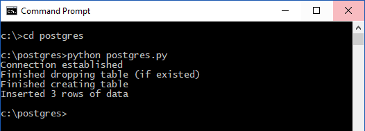

# <a name="azure-database-for-postgresql-use-python-tooconnect-and-query-data"></a><span data-ttu-id="2e07c-103">Azure databázi PostgreSQL: použití Python tooconnect a dotazování dat</span><span class="sxs-lookup"><span data-stu-id="2e07c-103">Azure Database for PostgreSQL: Use Python tooconnect and query data</span></span>
<span data-ttu-id="2e07c-104">Tento rychlý start předvádí jak toouse [Python](https://python.org) tooconnect tooan databáze Azure pro PostgreSQL.</span><span class="sxs-lookup"><span data-stu-id="2e07c-104">This quickstart demonstrates how toouse [Python](https://python.org) tooconnect tooan Azure Database for PostgreSQL.</span></span> <span data-ttu-id="2e07c-105">Také ukazuje, jak toouse tooquery příkazy SQL, vložit, aktualizovat a odstranit data v databázi hello ze systému macOS, Ubuntu Linux a platformy systému Windows.</span><span class="sxs-lookup"><span data-stu-id="2e07c-105">It also demonstrates how toouse SQL statements tooquery, insert, update, and delete data in hello database from macOS, Ubuntu Linux, and Windows platforms.</span></span> <span data-ttu-id="2e07c-106">Hello kroky v tomto článku Předpokládejme, že jsou obeznámeni s vývojem pomocí Pythonu a jsou nové tooworking s Azure databáze PostgreSQL.</span><span class="sxs-lookup"><span data-stu-id="2e07c-106">hello steps in this article assume that you are familiar with developing using Python and are new tooworking with Azure Database for PostgreSQL.</span></span>

## <a name="prerequisites"></a><span data-ttu-id="2e07c-107">Požadavky</span><span class="sxs-lookup"><span data-stu-id="2e07c-107">Prerequisites</span></span>
<span data-ttu-id="2e07c-108">Tento rychlý start využívá prostředky hello vytvořené v některém z těchto průvodcích se dozvíte jako výchozí bod:</span><span class="sxs-lookup"><span data-stu-id="2e07c-108">This quickstart uses hello resources created in either of these guides as a starting point:</span></span>
- [<span data-ttu-id="2e07c-109">Vytvoření databáze – portál</span><span class="sxs-lookup"><span data-stu-id="2e07c-109">Create DB - Portal</span></span>](quickstart-create-server-database-portal.md)
- [<span data-ttu-id="2e07c-110">Vytvoření databáze – rozhraní příkazového řádku</span><span class="sxs-lookup"><span data-stu-id="2e07c-110">Create DB - CLI</span></span>](quickstart-create-server-database-azure-cli.md)

<span data-ttu-id="2e07c-111">Budete také muset:</span><span class="sxs-lookup"><span data-stu-id="2e07c-111">You also need:</span></span>
- <span data-ttu-id="2e07c-112">Nainstalovat [Python](https://www.python.org/downloads/)</span><span class="sxs-lookup"><span data-stu-id="2e07c-112">[python](https://www.python.org/downloads/) installed</span></span>
- <span data-ttu-id="2e07c-113">Nainstalovat balíček [pip](https://pip.pypa.io/en/stable/installing/) (pokud pracujete s binárními soubory Pythonu 2 >= 2.7.9 nebo Pythonu 3 >= 3.4 stažené z webu [python.org](https://python.org), balíček pip už máte nainstalovaný).</span><span class="sxs-lookup"><span data-stu-id="2e07c-113">[pip](https://pip.pypa.io/en/stable/installing/) package installed (pip is already installed if you're working with Python 2 >=2.7.9 or Python 3 >=3.4 binaries downloaded from [python.org](https://python.org).</span></span>

## <a name="install-hello-python-connection-libraries-for-postgresql"></a><span data-ttu-id="2e07c-114">Instalace knihovny připojení hello Python pro PostgreSQL</span><span class="sxs-lookup"><span data-stu-id="2e07c-114">Install hello Python connection libraries for PostgreSQL</span></span>
<span data-ttu-id="2e07c-115">Nainstalujte hello [psycopg2](http://initd.org/psycopg/docs/install.html) balíčku, což vám umožní tooconnect a dotaz hello databáze.</span><span class="sxs-lookup"><span data-stu-id="2e07c-115">Install hello [psycopg2](http://initd.org/psycopg/docs/install.html) package, which enables you tooconnect and query hello database.</span></span> <span data-ttu-id="2e07c-116">je psycopg2 [k dispozici na úložiště PyPI](https://pypi.python.org/pypi/psycopg2/) hello tvar [kolečka](http://pythonwheels.com/) balíčky pro hello nejběžnější platformy (Linux, OSX, Windows).</span><span class="sxs-lookup"><span data-stu-id="2e07c-116">psycopg2 is [available on PyPI](https://pypi.python.org/pypi/psycopg2/) in hello form of [wheel](http://pythonwheels.com/) packages for hello most common platforms (Linux, OSX, Windows).</span></span> <span data-ttu-id="2e07c-117">Použití pip nainstalovat tooget hello binární verze modulu hello včetně všechny závislosti hello.</span><span class="sxs-lookup"><span data-stu-id="2e07c-117">Use pip install tooget hello binary version of hello module including all hello dependencies.</span></span>

1. <span data-ttu-id="2e07c-118">Na vlastním počítači spusťte rozhraní příkazového řádku:</span><span class="sxs-lookup"><span data-stu-id="2e07c-118">On your own computer, launch a command-line interface:</span></span>
    - <span data-ttu-id="2e07c-119">V systému Linux spusťte prostředí Bash hello.</span><span class="sxs-lookup"><span data-stu-id="2e07c-119">On Linux, launch hello Bash shell.</span></span>
    - <span data-ttu-id="2e07c-120">V systému macOS spusťte hello terminálu.</span><span class="sxs-lookup"><span data-stu-id="2e07c-120">On macOS, launch hello Terminal.</span></span>
    - <span data-ttu-id="2e07c-121">V systému Windows spusťte příkazový řádek hello z hello nabídce Start.</span><span class="sxs-lookup"><span data-stu-id="2e07c-121">On Windows, launch hello Command Prompt from hello Start Menu.</span></span>
2. <span data-ttu-id="2e07c-122">Ujistěte se, že používáte nejnovější verzi pip hello spuštěním příkazu:</span><span class="sxs-lookup"><span data-stu-id="2e07c-122">Ensure that you are using hello most current version of pip by running a command such as:</span></span>
    ```cmd
    pip install -U pip
    ```

3. <span data-ttu-id="2e07c-123">Spusťte následující příkaz tooinstall hello psycopg2 balíček hello:</span><span class="sxs-lookup"><span data-stu-id="2e07c-123">Run hello following command tooinstall hello psycopg2 package:</span></span>
    ```cmd
    pip install psycopg2
    ```

## <a name="get-connection-information"></a><span data-ttu-id="2e07c-124">Získání informací o připojení</span><span class="sxs-lookup"><span data-stu-id="2e07c-124">Get connection information</span></span>
<span data-ttu-id="2e07c-125">Získáte hello připojení informace potřebné tooconnect toohello databáze Azure pro PostgreSQL.</span><span class="sxs-lookup"><span data-stu-id="2e07c-125">Get hello connection information needed tooconnect toohello Azure Database for PostgreSQL.</span></span> <span data-ttu-id="2e07c-126">Musíte hello serveru plně kvalifikovaný název a přihlašovací údaje.</span><span class="sxs-lookup"><span data-stu-id="2e07c-126">You need hello fully qualified server name and login credentials.</span></span>

1. <span data-ttu-id="2e07c-127">Přihlaste se toohello [portál Azure](https://portal.azure.com/).</span><span class="sxs-lookup"><span data-stu-id="2e07c-127">Log in toohello [Azure portal](https://portal.azure.com/).</span></span>
2. <span data-ttu-id="2e07c-128">Hello levé nabídce na portálu Azure, klikněte na tlačítko **všechny prostředky** a vyhledejte **mypgserver 20170401** (server hello jste právě vytvořili).</span><span class="sxs-lookup"><span data-stu-id="2e07c-128">From hello left-hand menu in Azure portal, click **All resources** and search for **mypgserver-20170401** (hello server you just created).</span></span>
3. <span data-ttu-id="2e07c-129">Klikněte na název serveru hello **mypgserver 20170401**.</span><span class="sxs-lookup"><span data-stu-id="2e07c-129">Click hello server name **mypgserver-20170401**.</span></span>
4. <span data-ttu-id="2e07c-130">Vyberte hello serveru **přehled** stránky a poté si poznamenejte hello **název serveru** a **přihlašovací jméno pro Server správce**.</span><span class="sxs-lookup"><span data-stu-id="2e07c-130">Select hello server's **Overview** page, and then make a note of hello **Server name** and **Server admin login name**.</span></span>
 <span data-ttu-id="2e07c-131"></span><span class="sxs-lookup"><span data-stu-id="2e07c-131"></span></span>
5. <span data-ttu-id="2e07c-132">Pokud zapomenete vaše přihlašovací údaje serveru, přejděte toohello **přehled** stránka tooview hello serveru správce přihlašovací jméno a v případě potřeby obnovit heslo hello.</span><span class="sxs-lookup"><span data-stu-id="2e07c-132">If you forget your server login information, navigate toohello **Overview** page tooview hello Server admin login name and, if necessary, reset hello password.</span></span>

## <a name="how-toorun-python-code"></a><span data-ttu-id="2e07c-133">Jak toorun kód Python</span><span class="sxs-lookup"><span data-stu-id="2e07c-133">How toorun Python code</span></span>
<span data-ttu-id="2e07c-134">Toto téma obsahuje celkem čtyři vzorové kódy, z nichž každý provádí konkrétní funkci.</span><span class="sxs-lookup"><span data-stu-id="2e07c-134">This topic contains a total of four code samples, each of which performs a specific function.</span></span> <span data-ttu-id="2e07c-135">Hello následující pokyny znamenat jak toocreate s textovým souborem, Vložit blok kódu a potom uložte soubor hello tak, aby ji můžete spustit později.</span><span class="sxs-lookup"><span data-stu-id="2e07c-135">hello following instructions indicate how toocreate a text file, insert a code block, and then save hello file so that you can run it later.</span></span> <span data-ttu-id="2e07c-136">Být jisti toocreate čtyři samostatné soubory, jeden pro každou blok kódu.</span><span class="sxs-lookup"><span data-stu-id="2e07c-136">Be sure toocreate four separate files, one for each code block.</span></span>

- <span data-ttu-id="2e07c-137">Pomocí oblíbeného textového editoru vytvořte nový soubor.</span><span class="sxs-lookup"><span data-stu-id="2e07c-137">Using your favorite text editor, create a new file.</span></span>
- <span data-ttu-id="2e07c-138">Zkopírujte a vložte jednu z ukázky kódu hello v následující části do textového souboru hello hello.</span><span class="sxs-lookup"><span data-stu-id="2e07c-138">Copy and paste one of hello code samples in hello following sections into hello text file.</span></span> <span data-ttu-id="2e07c-139">Nahraďte hello **hostitele**, **dbname**, **uživatele**, a **heslo** parametry s hello hodnoty, kterou jste zadali při vytvoření hello Server a databáze.</span><span class="sxs-lookup"><span data-stu-id="2e07c-139">Replace hello **host**, **dbname**, **user**, and **password** parameters with hello values that you specified when you created hello server and database.</span></span>
- <span data-ttu-id="2e07c-140">Uložte hello soubor s příponou .py hello (například postgres.py) do složky projektu.</span><span class="sxs-lookup"><span data-stu-id="2e07c-140">Save hello file with hello .py extension (for example postgres.py) into your project folder.</span></span> <span data-ttu-id="2e07c-141">Pokud používáte hello operačního systému Windows, se, že tooselect kódování UTF-8 při ukládání souboru hello.</span><span class="sxs-lookup"><span data-stu-id="2e07c-141">If you are running hello Windows OS, be sure tooselect UTF-8 encoding when saving hello file.</span></span> 
- <span data-ttu-id="2e07c-142">Spusťte prostředí shell příkazového řádku nebo Bash hello a poté změňte hello tooyour projektu složku, například `cd postgres`.</span><span class="sxs-lookup"><span data-stu-id="2e07c-142">Launch hello Command Prompt or Bash shell and then change hello directory tooyour project folder, for example `cd postgres`.</span></span>
-  <span data-ttu-id="2e07c-143">toorun hello kód, typ hello Python příkazu s parametrem hello název souboru, například `Python postgres.py`.</span><span class="sxs-lookup"><span data-stu-id="2e07c-143">toorun hello code, type hello Python command followed by hello file name, for example `Python postgres.py`.</span></span>

> [!NOTE]
> <span data-ttu-id="2e07c-144">Počínaje Python verze 3, mohou se zobrazit chyba hello `SyntaxError: Missing parentheses in call too'print'` při spuštění hello následující bloky kódu.</span><span class="sxs-lookup"><span data-stu-id="2e07c-144">Starting in Python version 3, you may see hello error `SyntaxError: Missing parentheses in call too'print'` when running hello following code blocks.</span></span> <span data-ttu-id="2e07c-145">Pokud k tomu dojde, nahraďte každý příkaz toohello volání `print "string"` s použitím závorky, jako například volání funkce `print("string")`.</span><span class="sxs-lookup"><span data-stu-id="2e07c-145">If that happens, replace each call toohello command `print "string"` with a function call using parenthesis, such as `print("string")`.</span></span>

## <a name="connect-create-table-and-insert-data"></a><span data-ttu-id="2e07c-146">Připojení, vytvoření tabulky a vložení dat</span><span class="sxs-lookup"><span data-stu-id="2e07c-146">Connect, create table, and insert data</span></span>
<span data-ttu-id="2e07c-147">Použití hello následující kód tooconnect a načtení dat pomocí hello [psycopg2.connect](http://initd.org/psycopg/docs/connection.html) fungovat s **vložit** příkaz jazyka SQL.</span><span class="sxs-lookup"><span data-stu-id="2e07c-147">Use hello following code tooconnect and load hello data using [psycopg2.connect](http://initd.org/psycopg/docs/connection.html) function with **INSERT** SQL statement.</span></span> <span data-ttu-id="2e07c-148">Hello [cursor.execute](http://initd.org/psycopg/docs/cursor.html#execute) funkce je použité tooexecute hello dotaz SQL na databázi PostgreSQL.</span><span class="sxs-lookup"><span data-stu-id="2e07c-148">hello [cursor.execute](http://initd.org/psycopg/docs/cursor.html#execute) function is used tooexecute hello SQL query against PostgreSQL database.</span></span> <span data-ttu-id="2e07c-149">Nahraďte hello hodnoty, kterou jste zadali při vytvoření hello server a databáze hello hostitele, dbname, uživatele a heslo parametry.</span><span class="sxs-lookup"><span data-stu-id="2e07c-149">Replace hello host, dbname, user, and password parameters with hello values that you specified when you created hello server and database.</span></span>

```Python
import psycopg2

# Update connection string information obtained from hello portal
host = "mypgserver-20170401.postgres.database.azure.com"
user = "mylogin@mypgserver-20170401"
dbname = "mypgsqldb"
password = "<server_admin_password>"
sslmode = "require"

# Construct connection string
conn_string = "host={0} user={1} dbname={2} password={3} sslmode={4}".format(host, user, dbname, password, sslmode)
conn = psycopg2.connect(conn_string) 
print "Connection established"

cursor = conn.cursor()

# Drop previous table of same name if one exists
cursor.execute("DROP TABLE IF EXISTS inventory;")
print "Finished dropping table (if existed)"

# Create table
cursor.execute("CREATE TABLE inventory (id serial PRIMARY KEY, name VARCHAR(50), quantity INTEGER);")
print "Finished creating table"

# Insert some data into table
cursor.execute("INSERT INTO inventory (name, quantity) VALUES (%s, %s);", ("banana", 150))
cursor.execute("INSERT INTO inventory (name, quantity) VALUES (%s, %s);", ("orange", 154))
cursor.execute("INSERT INTO inventory (name, quantity) VALUES (%s, %s);", ("apple", 100))
print "Inserted 3 rows of data"

# Cleanup
conn.commit()
cursor.close()
conn.close()
```

<span data-ttu-id="2e07c-150">Po hello kód spustí úspěšně, zobrazí se následující výstup hello:</span><span class="sxs-lookup"><span data-stu-id="2e07c-150">After hello code runs successfully, hello output appears as follows:</span></span>



## <a name="read-data"></a><span data-ttu-id="2e07c-152">Čtení dat</span><span class="sxs-lookup"><span data-stu-id="2e07c-152">Read data</span></span>
<span data-ttu-id="2e07c-153">Použití hello následující kód tooread hello data vložená, pomocí [cursor.execute](http://initd.org/psycopg/docs/cursor.html#execute) fungovat s **vyberte** příkaz jazyka SQL.</span><span class="sxs-lookup"><span data-stu-id="2e07c-153">Use hello following code tooread hello data inserted using [cursor.execute](http://initd.org/psycopg/docs/cursor.html#execute) function with **SELECT** SQL statement.</span></span> <span data-ttu-id="2e07c-154">Tato funkce přijímá dotazu a vrátí výsledek nastavit, které lze vstupní přes s použitím hello [cursor.fetchall()](http://initd.org/psycopg/docs/cursor.html#cursor.fetchall).</span><span class="sxs-lookup"><span data-stu-id="2e07c-154">This function accepts a query and returns a result set that can be iterated over with hello use of [cursor.fetchall()](http://initd.org/psycopg/docs/cursor.html#cursor.fetchall).</span></span> <span data-ttu-id="2e07c-155">Nahraďte hello hodnoty, kterou jste zadali při vytvoření hello server a databáze hello hostitele, dbname, uživatele a heslo parametry.</span><span class="sxs-lookup"><span data-stu-id="2e07c-155">Replace hello host, dbname, user, and password parameters with hello values that you specified when you created hello server and database.</span></span>

```Python
import psycopg2

# Update connection string information obtained from hello portal
host = "mypgserver-20170401.postgres.database.azure.com"
user = "mylogin@mypgserver-20170401"
dbname = "mypgsqldb"
password = "<server_admin_password>"
sslmode = "require"

# Construct connection string
conn_string = "host={0} user={1} dbname={2} password={3} sslmode={4}".format(host, user, dbname, password, sslmode)
conn = psycopg2.connect(conn_string) 
print "Connection established"

cursor = conn.cursor()

# Fetch all rows from table
cursor.execute("SELECT * FROM inventory;")
rows = cursor.fetchall()

# Print all rows
for row in rows:
    print "Data row = (%s, %s, %s)" %(str(row[0]), str(row[1]), str(row[2]))

# Cleanup
conn.commit()
cursor.close()
conn.close()
```

## <a name="update-data"></a><span data-ttu-id="2e07c-156">Aktualizace dat</span><span class="sxs-lookup"><span data-stu-id="2e07c-156">Update data</span></span>
<span data-ttu-id="2e07c-157">Použití hello následující kód tooupdate hello inventáře řádek, který jste vložili dříve pomocí [cursor.execute](http://initd.org/psycopg/docs/cursor.html#execute) fungovat s **aktualizace** příkaz jazyka SQL.</span><span class="sxs-lookup"><span data-stu-id="2e07c-157">Use hello following code tooupdate hello inventory row that you previously inserted using [cursor.execute](http://initd.org/psycopg/docs/cursor.html#execute) function with **UPDATE** SQL statement.</span></span> <span data-ttu-id="2e07c-158">Nahraďte hello hodnoty, kterou jste zadali při vytvoření hello server a databáze hello hostitele, dbname, uživatele a heslo parametry.</span><span class="sxs-lookup"><span data-stu-id="2e07c-158">Replace hello host, dbname, user, and password parameters with hello values that you specified when you created hello server and database.</span></span>

```Python
import psycopg2

# Update connection string information obtained from hello portal
host = "mypgserver-20170401.postgres.database.azure.com"
user = "mylogin@mypgserver-20170401"
dbname = "mypgsqldb"
password = "<server_admin_password>"
sslmode = "require"

# Construct connection string
conn_string = "host={0} user={1} dbname={2} password={3} sslmode={4}".format(host, user, dbname, password, sslmode)
conn = psycopg2.connect(conn_string) 
print "Connection established"

cursor = conn.cursor()

# Update a data row in hello table
cursor.execute("UPDATE inventory SET quantity = %s WHERE name = %s;", (200, "banana"))
print "Updated 1 row of data"

# Cleanup
conn.commit()
cursor.close()
conn.close()
```

## <a name="delete-data"></a><span data-ttu-id="2e07c-159">Odstranění dat</span><span class="sxs-lookup"><span data-stu-id="2e07c-159">Delete data</span></span>
<span data-ttu-id="2e07c-160">Použití hello následující kód toodelete skladové položky, kterou jste vložili dříve pomocí [cursor.execute](http://initd.org/psycopg/docs/cursor.html#execute) fungovat s **odstranit** příkaz jazyka SQL.</span><span class="sxs-lookup"><span data-stu-id="2e07c-160">Use hello following code toodelete an inventory item that you previously inserted using [cursor.execute](http://initd.org/psycopg/docs/cursor.html#execute) function with **DELETE** SQL statement.</span></span> <span data-ttu-id="2e07c-161">Nahraďte hello hodnoty, kterou jste zadali při vytvoření hello server a databáze hello hostitele, dbname, uživatele a heslo parametry.</span><span class="sxs-lookup"><span data-stu-id="2e07c-161">Replace hello host, dbname, user, and password parameters with hello values that you specified when you created hello server and database.</span></span>

```Python
import psycopg2

# Update connection string information obtained from hello portal
host = "mypgserver-20170401.postgres.database.azure.com"
user = "mylogin@mypgserver-20170401"
dbname = "mypgsqldb"
password = "<server_admin_password>"
sslmode = "require"

# Construct connection string
conn_string = "host={0} user={1} dbname={2} password={3} sslmode={4}".format(host, user, dbname, password, sslmode)
conn = psycopg2.connect(conn_string) 
print "Connection established"

cursor = conn.cursor()

# Delete data row from table
cursor.execute("DELETE FROM inventory WHERE name = %s;", ("orange",))
print "Deleted 1 row of data"

# Cleanup
conn.commit()
cursor.close()
conn.close()
```

## <a name="next-steps"></a><span data-ttu-id="2e07c-162">Další kroky</span><span class="sxs-lookup"><span data-stu-id="2e07c-162">Next steps</span></span>
> [!div class="nextstepaction"]
> [<span data-ttu-id="2e07c-163">Migrace vaší databáze pomocí exportu a importu</span><span class="sxs-lookup"><span data-stu-id="2e07c-163">Migrate your database using Export and Import</span></span>](./howto-migrate-using-export-and-import.md)
