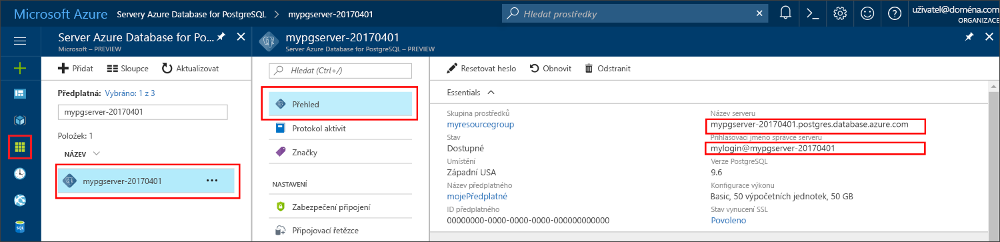

# <a name="azure-database-for-postgresql-use-ruby-to-connect-and-query-data"></a><span data-ttu-id="06655-103">Azure Database for PostgreSQL: Použití Ruby k připojení a dotazování dat</span><span class="sxs-lookup"><span data-stu-id="06655-103">Azure Database for PostgreSQL: Use Ruby to connect and query data</span></span>
<span data-ttu-id="06655-104">Tento rychlý start ukazuje, jak se připojit ke službě Azure Database for PostgreSQL pomocí aplikace v [Ruby](https://www.ruby-lang.org).</span><span class="sxs-lookup"><span data-stu-id="06655-104">This quickstart demonstrates how to connect to an Azure Database for PostgreSQL using a [Ruby](https://www.ruby-lang.org) application.</span></span> <span data-ttu-id="06655-105">Ukazuje, jak pomocí příkazů jazyka SQL dotazovat, vkládat, aktualizovat a odstraňovat data v databázi.</span><span class="sxs-lookup"><span data-stu-id="06655-105">It shows how to use SQL statements to query, insert, update, and delete data in the database.</span></span> <span data-ttu-id="06655-106">V tomto článku se předpokládá, že máte zkušenosti s vývojem pomocí Ruby, ale teprve začínáte pracovat se službou Azure Database for PostgreSQL.</span><span class="sxs-lookup"><span data-stu-id="06655-106">This article assumes you are familiar with development using Ruby, but that you are new to working with Azure Database for PostgreSQL.</span></span>

## <a name="prerequisites"></a><span data-ttu-id="06655-107">Požadavky</span><span class="sxs-lookup"><span data-stu-id="06655-107">Prerequisites</span></span>
<span data-ttu-id="06655-108">Tento rychlý start využívá jako výchozí bod prostředky vytvořené v některém z těchto průvodců:</span><span class="sxs-lookup"><span data-stu-id="06655-108">This quickstart uses the resources created in either of these guides as a starting point:</span></span>
- [<span data-ttu-id="06655-109">Vytvoření databáze – portál</span><span class="sxs-lookup"><span data-stu-id="06655-109">Create DB - Portal</span></span>](quickstart-create-server-database-portal.md)
- [<span data-ttu-id="06655-110">Vytvoření databáze – rozhraní příkazového řádku Azure</span><span class="sxs-lookup"><span data-stu-id="06655-110">Create DB - Azure CLI</span></span>](quickstart-create-server-database-azure-cli.md)

## <a name="install-ruby"></a><span data-ttu-id="06655-111">Instalace Ruby</span><span class="sxs-lookup"><span data-stu-id="06655-111">Install Ruby</span></span>
<span data-ttu-id="06655-112">Nainstalujte Ruby na vlastní počítač.</span><span class="sxs-lookup"><span data-stu-id="06655-112">Install Ruby on your own machine.</span></span> 

### <a name="windows"></a><span data-ttu-id="06655-113">Windows</span><span class="sxs-lookup"><span data-stu-id="06655-113">Windows</span></span>
- <span data-ttu-id="06655-114">Stáhněte a nainstalujte nejnovější verzi [Ruby](http://rubyinstaller.org/downloads/).</span><span class="sxs-lookup"><span data-stu-id="06655-114">Download and Install the latest version of [Ruby](http://rubyinstaller.org/downloads/).</span></span>
- <span data-ttu-id="06655-115">Na poslední obrazovce instalačního programu MSI zaškrtněte políčko s textem „Run 'ridk install' to install MSYS2 and development toolchain“ (Spustit ridk install pro instalaci MSYS2 a vývojářské sady nástrojů).</span><span class="sxs-lookup"><span data-stu-id="06655-115">On the finish screen of the MSI installer, check the box that says "Run 'ridk install' to install MSYS2 and development toolchain."</span></span> <span data-ttu-id="06655-116">Potom kliknutím na **Finish** (Dokončit) spusťte další instalační program.</span><span class="sxs-lookup"><span data-stu-id="06655-116">Then click **Finish** to launch the next installer.</span></span>
- <span data-ttu-id="06655-117">Spustí se instalační program RubyInstaller2 pro Windows.</span><span class="sxs-lookup"><span data-stu-id="06655-117">The RubyInstaller2 for Windows installer launches.</span></span> <span data-ttu-id="06655-118">Zadejte 2 pro instalaci aktualizace úložiště MSYS2.</span><span class="sxs-lookup"><span data-stu-id="06655-118">Type 2 to install the MSYS2 repository update.</span></span> <span data-ttu-id="06655-119">Po dokončení a navrácení na příkazový řádek instalace zavřete příkazové okno.</span><span class="sxs-lookup"><span data-stu-id="06655-119">After it finishes and returns to the installation prompt, close the command window.</span></span>
- <span data-ttu-id="06655-120">Z nabídky Start spusťte nový příkazový řádek (cmd).</span><span class="sxs-lookup"><span data-stu-id="06655-120">Launch a new command prompt (cmd) from the Start menu.</span></span>
- <span data-ttu-id="06655-121">Příkazem `ruby -v` otestujte instalaci Ruby a zobrazte nainstalovanou verzi.</span><span class="sxs-lookup"><span data-stu-id="06655-121">Test the Ruby installation `ruby -v` to see the version installed.</span></span>
- <span data-ttu-id="06655-122">Příkazem `gem -v` otestujte instalaci nástroje Gem a zobrazte nainstalovanou verzi.</span><span class="sxs-lookup"><span data-stu-id="06655-122">Test the Gem installation `gem -v` to see the version installed.</span></span>
- <span data-ttu-id="06655-123">Pomocí nástroje Gem sestavte modul PostgreSQL pro Ruby spuštěním příkazu `gem install pg`.</span><span class="sxs-lookup"><span data-stu-id="06655-123">Build the PostgreSQL module for Ruby using Gem by running the command `gem install pg`.</span></span>

### <a name="macos"></a><span data-ttu-id="06655-124">MacOS</span><span class="sxs-lookup"><span data-stu-id="06655-124">MacOS</span></span>
- <span data-ttu-id="06655-125">Nainstalujte Ruby pomocí Homebrew spuštěním příkazu `brew install ruby`.</span><span class="sxs-lookup"><span data-stu-id="06655-125">Install Ruby using Homebrew by running the command `brew install ruby`.</span></span> <span data-ttu-id="06655-126">Další možnosti instalace najdete v [dokumentaci k instalaci](https://www.ruby-lang.org/en/documentation/installation/#homebrew) Ruby.</span><span class="sxs-lookup"><span data-stu-id="06655-126">For more installation options, see the Ruby [installation documentation](https://www.ruby-lang.org/en/documentation/installation/#homebrew)</span></span>
- <span data-ttu-id="06655-127">Příkazem `ruby -v` otestujte instalaci Ruby a zobrazte nainstalovanou verzi.</span><span class="sxs-lookup"><span data-stu-id="06655-127">Test the Ruby installation `ruby -v` to see the version installed.</span></span>
- <span data-ttu-id="06655-128">Příkazem `gem -v` otestujte instalaci nástroje Gem a zobrazte nainstalovanou verzi.</span><span class="sxs-lookup"><span data-stu-id="06655-128">Test the Gem installation `gem -v` to see the version installed.</span></span>
- <span data-ttu-id="06655-129">Pomocí nástroje Gem sestavte modul PostgreSQL pro Ruby spuštěním příkazu `gem install pg`.</span><span class="sxs-lookup"><span data-stu-id="06655-129">Build the PostgreSQL module for Ruby using Gem by running the command `gem install pg`.</span></span>

### <a name="linux-ubuntu"></a><span data-ttu-id="06655-130">Linux (Ubuntu)</span><span class="sxs-lookup"><span data-stu-id="06655-130">Linux (Ubuntu)</span></span>
- <span data-ttu-id="06655-131">Nainstalujte Ruby spuštěním příkazu `sudo apt-get install ruby-full`.</span><span class="sxs-lookup"><span data-stu-id="06655-131">Install Ruby by running the command `sudo apt-get install ruby-full`.</span></span> <span data-ttu-id="06655-132">Další možnosti instalace najdete v [dokumentaci k instalaci](https://www.ruby-lang.org/en/documentation/installation/) Ruby.</span><span class="sxs-lookup"><span data-stu-id="06655-132">For more installation options, see the Ruby [installation documentation](https://www.ruby-lang.org/en/documentation/installation/).</span></span>
- <span data-ttu-id="06655-133">Příkazem `ruby -v` otestujte instalaci Ruby a zobrazte nainstalovanou verzi.</span><span class="sxs-lookup"><span data-stu-id="06655-133">Test the Ruby installation `ruby -v` to see the version installed.</span></span>
- <span data-ttu-id="06655-134">Nainstalujte nejnovější aktualizace pro nástroj Gem spuštěním příkazu `sudo gem update --system`.</span><span class="sxs-lookup"><span data-stu-id="06655-134">Install the latest updates for Gem by running the command `sudo gem update --system`.</span></span>
- <span data-ttu-id="06655-135">Příkazem `gem -v` otestujte instalaci nástroje Gem a zobrazte nainstalovanou verzi.</span><span class="sxs-lookup"><span data-stu-id="06655-135">Test the Gem installation `gem -v` to see the version installed.</span></span>
- <span data-ttu-id="06655-136">Nainstalujte gcc, make a další nástroje sestavení spuštěním příkazu `sudo apt-get install build-essential`.</span><span class="sxs-lookup"><span data-stu-id="06655-136">Install the gcc, make, and other build tools by running the command `sudo apt-get install build-essential`.</span></span>
- <span data-ttu-id="06655-137">Nainstalujte knihovny PostgreSQL spuštěním příkazu `sudo apt-get install libpq-dev`.</span><span class="sxs-lookup"><span data-stu-id="06655-137">Install the PostgreSQL libraries by running the command `sudo apt-get install libpq-dev`.</span></span>
- <span data-ttu-id="06655-138">Pomocí nástroje Gem sestavte modul pg pro Ruby spuštěním příkazu `sudo gem install pg`.</span><span class="sxs-lookup"><span data-stu-id="06655-138">Build the Ruby pg module using Gem by running the command `sudo gem install pg`.</span></span>

## <a name="run-ruby-code"></a><span data-ttu-id="06655-139">Spuštění kódu Ruby</span><span class="sxs-lookup"><span data-stu-id="06655-139">Run Ruby code</span></span> 
- <span data-ttu-id="06655-140">Uložte kód do textového souboru a soubor uložte s příponou souboru .rb do složky projektu, například `C:\rubypostgres\read.rb` nebo `/home/username/rubypostgres/read.rb`.</span><span class="sxs-lookup"><span data-stu-id="06655-140">Save the code into a text file, and save the file into a project folder with file extension .rb, such as `C:\rubypostgres\read.rb` or `/home/username/rubypostgres/read.rb`</span></span>
- <span data-ttu-id="06655-141">Pokud chcete kód spustit, spusťte příkazový řádek nebo prostředí Bash.</span><span class="sxs-lookup"><span data-stu-id="06655-141">To run the code, launch the command prompt or bash shell.</span></span> <span data-ttu-id="06655-142">Pokud chcete aplikaci spustit, změňte adresář na složku projektu příkazem `cd rubypostgres` a pak zadejte příkaz `ruby read.rb`.</span><span class="sxs-lookup"><span data-stu-id="06655-142">Change directory into your project folder `cd rubypostgres`, then type the command `ruby read.rb` to run the application.</span></span>

## <a name="get-connection-information"></a><span data-ttu-id="06655-143">Získání informací o připojení</span><span class="sxs-lookup"><span data-stu-id="06655-143">Get connection information</span></span>
<span data-ttu-id="06655-144">Získejte informace o připojení potřebné pro připojení ke službě Azure Database for PostgreSQL.</span><span class="sxs-lookup"><span data-stu-id="06655-144">Get the connection information needed to connect to the Azure Database for PostgreSQL.</span></span> <span data-ttu-id="06655-145">Potřebujete plně kvalifikovaný název serveru a přihlašovací údaje.</span><span class="sxs-lookup"><span data-stu-id="06655-145">You need the fully qualified server name and login credentials.</span></span>

1. <span data-ttu-id="06655-146">Přihlaste se k portálu [Azure Portal](https://portal.azure.com/).</span><span class="sxs-lookup"><span data-stu-id="06655-146">Log in to the [Azure portal](https://portal.azure.com/).</span></span>
2. <span data-ttu-id="06655-147">V nabídce vlevo na webu Azure Portal klikněte na **Všechny prostředky** a vyhledejte vytvořený server, například **mypgserver-20170401**.</span><span class="sxs-lookup"><span data-stu-id="06655-147">From the left-hand menu in Azure portal, click **All resources** and search for the server you have created, such as **mypgserver-20170401**.</span></span>
3. <span data-ttu-id="06655-148">Klikněte na název serveru **mypgserver-20170401**.</span><span class="sxs-lookup"><span data-stu-id="06655-148">Click the server name **mypgserver-20170401**.</span></span>
4. <span data-ttu-id="06655-149">Vyberte stránku **Přehled** serveru.</span><span class="sxs-lookup"><span data-stu-id="06655-149">Select the server's **Overview** page.</span></span> <span data-ttu-id="06655-150">Poznamenejte si **Název serveru** a **Přihlašovací jméno správce serveru**.</span><span class="sxs-lookup"><span data-stu-id="06655-150">Make a note of the **Server name** and **Server admin login name**.</span></span>
 <span data-ttu-id="06655-151"></span><span class="sxs-lookup"><span data-stu-id="06655-151"></span></span>
5. <span data-ttu-id="06655-152">Pokud zapomenete přihlašovací údaje pro váš server, přejděte na stránku **Přehled** a zobrazte přihlašovací jméno správce serveru.</span><span class="sxs-lookup"><span data-stu-id="06655-152">If you forget your server login information, navigate to the **Overview** page to view the Server admin login name.</span></span> <span data-ttu-id="06655-153">V případě potřeby obnovte heslo.</span><span class="sxs-lookup"><span data-stu-id="06655-153">If necessary, reset the password.</span></span>

## <a name="connect-and-create-a-table"></a><span data-ttu-id="06655-154">Připojení a vytvoření tabulky</span><span class="sxs-lookup"><span data-stu-id="06655-154">Connect and create a table</span></span>
<span data-ttu-id="06655-155">Pomocí následujícího kódu se připojte a vytvořte tabulku s využitím příkazu **CREATE TABLE** jazyka SQL, po kterém následují příkazy **INSERT INTO** jazyka SQL, které do tabulky přidají řádky.</span><span class="sxs-lookup"><span data-stu-id="06655-155">Use the following code to connect and create a table using **CREATE TABLE** SQL statement, followed by **INSERT INTO** SQL statements to add rows into the table.</span></span>

<span data-ttu-id="06655-156">Kód pro připojení ke službě Azure Database for PostgreSQL používá objekt [PG::Connection](http://www.rubydoc.info/gems/pg/PG/Connection) s konstruktorem [new()](http://www.rubydoc.info/gems/pg/PG%2FConnection:initialize).</span><span class="sxs-lookup"><span data-stu-id="06655-156">The code uses a  [PG::Connection](http://www.rubydoc.info/gems/pg/PG/Connection) object with constructor [new()](http://www.rubydoc.info/gems/pg/PG%2FConnection:initialize) to connect to Azure Database for PostgreSQL.</span></span> <span data-ttu-id="06655-157">Potom volá metodu [exec()](http://www.rubydoc.info/gems/pg/PG/Connection#exec-instance_method) pro spuštění příkazů DROP, CREATE TABLE a INSERT INTO.</span><span class="sxs-lookup"><span data-stu-id="06655-157">Then it calls method [exec()](http://www.rubydoc.info/gems/pg/PG/Connection#exec-instance_method) to run the DROP, CREATE TABLE, and INSERT INTO commands.</span></span> <span data-ttu-id="06655-158">Kód kontroluje chyby pomocí třídy [PG::Error](http://www.rubydoc.info/gems/pg/PG/Error).</span><span class="sxs-lookup"><span data-stu-id="06655-158">The code checks for errors using the [PG::Error](http://www.rubydoc.info/gems/pg/PG/Error) class.</span></span> <span data-ttu-id="06655-159">Před ukončením potom volá metodu [close()](http://www.rubydoc.info/gems/pg/PG/Connection#lo_close-instance_method) pro ukončení připojení.</span><span class="sxs-lookup"><span data-stu-id="06655-159">Then it calls method [close()](http://www.rubydoc.info/gems/pg/PG/Connection#lo_close-instance_method) to close the connection before terminating.</span></span>

<span data-ttu-id="06655-160">Nahraďte řetězce `host`, `database`, `user` a `password` vlastními hodnotami.</span><span class="sxs-lookup"><span data-stu-id="06655-160">Replace the `host`, `database`, `user`, and `password` strings with your own values.</span></span> 
```ruby
require 'pg'

begin
    # Initialize connection variables.
    host = String('mypgserver-20170401.postgres.database.azure.com')
    database = String('postgres')
    user = String('mylogin@mypgserver-20170401')
    password = String('<server_admin_password>')

    # Initialize connection object.
    connection = PG::Connection.new(:host => host, :user => user, :dbname => database, :port => '5432', :password => password)
    puts 'Successfully created connection to database'

    # Drop previous table of same name if one exists
    connection.exec('DROP TABLE IF EXISTS inventory;')
    puts 'Finished dropping table (if existed).'

    # Drop previous table of same name if one exists.
    connection.exec('CREATE TABLE inventory (id serial PRIMARY KEY, name VARCHAR(50), quantity INTEGER);')
    puts 'Finished creating table.'

    # Insert some data into table.
    connection.exec("INSERT INTO inventory VALUES(1, 'banana', 150)")
    connection.exec("INSERT INTO inventory VALUES(2, 'orange', 154)")
    connection.exec("INSERT INTO inventory VALUES(3, 'apple', 100)")
    puts 'Inserted 3 rows of data.'

rescue PG::Error => e
    puts e.message 
    
ensure
    connection.close if connection
end
```

## <a name="read-data"></a><span data-ttu-id="06655-161">Čtení dat</span><span class="sxs-lookup"><span data-stu-id="06655-161">Read data</span></span>
<span data-ttu-id="06655-162">Pomocí následujícího kódu se připojte a načtěte data s využitím příkazu **SELECT** jazyka SQL.</span><span class="sxs-lookup"><span data-stu-id="06655-162">Use the following code to connect and read the data using a **SELECT** SQL statement.</span></span> 

<span data-ttu-id="06655-163">Kód pro připojení ke službě Azure Database for PostgreSQL používá objekt [PG::Connection](http://www.rubydoc.info/gems/pg/PG/Connection) s konstruktorem [new()](http://www.rubydoc.info/gems/pg/PG%2FConnection:initialize).</span><span class="sxs-lookup"><span data-stu-id="06655-163">The code uses a  [PG::Connection](http://www.rubydoc.info/gems/pg/PG/Connection) object with constructor [new()](http://www.rubydoc.info/gems/pg/PG%2FConnection:initialize) to connect to Azure Database for PostgreSQL.</span></span> <span data-ttu-id="06655-164">Potom volá metodu [exec()](http://www.rubydoc.info/gems/pg/PG/Connection#exec-instance_method) pro spuštění příkazu SELECT a výsledky uloží do sady výsledků dotazu.</span><span class="sxs-lookup"><span data-stu-id="06655-164">Then it calls method [exec()](http://www.rubydoc.info/gems/pg/PG/Connection#exec-instance_method) to run the SELECT command, keeping the results in a result set.</span></span> <span data-ttu-id="06655-165">Nad kolekcí sady výsledků dotazu se iteruje pomocí smyčky `resultSet.each do` a hodnoty aktuálního řádku se ukládají do proměnné `row`.</span><span class="sxs-lookup"><span data-stu-id="06655-165">The result set collection is iterated over using the `resultSet.each do` loop, keeping the current row values in the `row` variable.</span></span> <span data-ttu-id="06655-166">Kód kontroluje chyby pomocí třídy [PG::Error](http://www.rubydoc.info/gems/pg/PG/Error).</span><span class="sxs-lookup"><span data-stu-id="06655-166">The code checks for errors using the [PG::Error](http://www.rubydoc.info/gems/pg/PG/Error) class.</span></span> <span data-ttu-id="06655-167">Před ukončením potom volá metodu [close()](http://www.rubydoc.info/gems/pg/PG/Connection#lo_close-instance_method) pro ukončení připojení.</span><span class="sxs-lookup"><span data-stu-id="06655-167">Then it calls method [close()](http://www.rubydoc.info/gems/pg/PG/Connection#lo_close-instance_method) to close the connection before terminating.</span></span>

<span data-ttu-id="06655-168">Nahraďte řetězce `host`, `database`, `user` a `password` vlastními hodnotami.</span><span class="sxs-lookup"><span data-stu-id="06655-168">Replace the `host`, `database`, `user`, and `password` strings with your own values.</span></span> 

```ruby
require 'pg'

begin
    # Initialize connection variables.
    host = String('mypgserver-20170401.postgres.database.azure.com')
    database = String('postgres')
    user = String('mylogin@mypgserver-20170401')
    password = String('<server_admin_password>')

    # Initialize connection object.
    connection = PG::Connection.new(:host => host, :user => user, :database => dbname, :port => '5432', :password => password)
    puts 'Successfully created connection to database.'

    resultSet = connection.exec('SELECT * from inventory;')
    resultSet.each do |row|
        puts 'Data row = (%s, %s, %s)' % [row['id'], row['name'], row['quantity']]
    end

rescue PG::Error => e
    puts e.message 
    
ensure
    connection.close if connection
end
```

## <a name="update-data"></a><span data-ttu-id="06655-169">Aktualizace dat</span><span class="sxs-lookup"><span data-stu-id="06655-169">Update data</span></span>
<span data-ttu-id="06655-170">Pomocí následujícího kódu se připojte a aktualizujte data s využitím příkazu **UPDATE** jazyka SQL.</span><span class="sxs-lookup"><span data-stu-id="06655-170">Use the following code to connect and update the data using a **UPDATE** SQL statement.</span></span>

<span data-ttu-id="06655-171">Kód pro připojení ke službě Azure Database for PostgreSQL používá objekt [PG::Connection](http://www.rubydoc.info/gems/pg/PG/Connection) s konstruktorem [new()](http://www.rubydoc.info/gems/pg/PG%2FConnection:initialize).</span><span class="sxs-lookup"><span data-stu-id="06655-171">The code uses a  [PG::Connection](http://www.rubydoc.info/gems/pg/PG/Connection) object with constructor [new()](http://www.rubydoc.info/gems/pg/PG%2FConnection:initialize) to connect to Azure Database for PostgreSQL.</span></span> <span data-ttu-id="06655-172">Potom volá metodu [exec()](http://www.rubydoc.info/gems/pg/PG/Connection#exec-instance_method) pro spuštění příkazu UPDATE.</span><span class="sxs-lookup"><span data-stu-id="06655-172">Then it calls method [exec()](http://www.rubydoc.info/gems/pg/PG/Connection#exec-instance_method) to run the UPDATE command.</span></span> <span data-ttu-id="06655-173">Kód kontroluje chyby pomocí třídy [PG::Error](http://www.rubydoc.info/gems/pg/PG/Error).</span><span class="sxs-lookup"><span data-stu-id="06655-173">The code checks for errors using the [PG::Error](http://www.rubydoc.info/gems/pg/PG/Error) class.</span></span> <span data-ttu-id="06655-174">Před ukončením potom volá metodu [close()](http://www.rubydoc.info/gems/pg/PG/Connection#lo_close-instance_method) pro ukončení připojení.</span><span class="sxs-lookup"><span data-stu-id="06655-174">Then it calls method [close()](http://www.rubydoc.info/gems/pg/PG/Connection#lo_close-instance_method) to close the connection before terminating.</span></span>

<span data-ttu-id="06655-175">Nahraďte řetězce `host`, `database`, `user` a `password` vlastními hodnotami.</span><span class="sxs-lookup"><span data-stu-id="06655-175">Replace the `host`, `database`, `user`, and `password` strings with your own values.</span></span> 

```ruby
require 'pg'

begin
    # Initialize connection variables.
    host = String('mypgserver-20170401.postgres.database.azure.com')
    database = String('postgres')
    user = String('mylogin@mypgserver-20170401')
    password = String('<server_admin_password>')

    # Initialize connection object.
    connection = PG::Connection.new(:host => host, :user => user, :dbname => database, :port => '5432', :password => password)
    puts 'Successfully created connection to database.'

    # Modify some data in table.
    connection.exec('UPDATE inventory SET quantity = %d WHERE name = %s;' % [200, '\'banana\''])
    puts 'Updated 1 row of data.'

rescue PG::Error => e
    puts e.message 
    
ensure
    connection.close if connection
end
```


## <a name="delete-data"></a><span data-ttu-id="06655-176">Odstranění dat</span><span class="sxs-lookup"><span data-stu-id="06655-176">Delete data</span></span>
<span data-ttu-id="06655-177">Pomocí následujícího kódu se připojte a načtěte data s využitím příkazu **DELETE** jazyka SQL.</span><span class="sxs-lookup"><span data-stu-id="06655-177">Use the following code to connect and read the data using a **DELETE** SQL statement.</span></span> 

<span data-ttu-id="06655-178">Kód pro připojení ke službě Azure Database for PostgreSQL používá objekt [PG::Connection](http://www.rubydoc.info/gems/pg/PG/Connection) s konstruktorem [new()](http://www.rubydoc.info/gems/pg/PG%2FConnection:initialize).</span><span class="sxs-lookup"><span data-stu-id="06655-178">The code uses a  [PG::Connection](http://www.rubydoc.info/gems/pg/PG/Connection) object with constructor [new()](http://www.rubydoc.info/gems/pg/PG%2FConnection:initialize) to connect to Azure Database for PostgreSQL.</span></span> <span data-ttu-id="06655-179">Potom volá metodu [exec()](http://www.rubydoc.info/gems/pg/PG/Connection#exec-instance_method) pro spuštění příkazu UPDATE.</span><span class="sxs-lookup"><span data-stu-id="06655-179">Then it calls method [exec()](http://www.rubydoc.info/gems/pg/PG/Connection#exec-instance_method) to run the UPDATE command.</span></span> <span data-ttu-id="06655-180">Kód kontroluje chyby pomocí třídy [PG::Error](http://www.rubydoc.info/gems/pg/PG/Error).</span><span class="sxs-lookup"><span data-stu-id="06655-180">The code checks for errors using the [PG::Error](http://www.rubydoc.info/gems/pg/PG/Error) class.</span></span> <span data-ttu-id="06655-181">Před ukončením potom volá metodu [close()](http://www.rubydoc.info/gems/pg/PG/Connection#lo_close-instance_method) pro ukončení připojení.</span><span class="sxs-lookup"><span data-stu-id="06655-181">Then it calls method [close()](http://www.rubydoc.info/gems/pg/PG/Connection#lo_close-instance_method) to close the connection before terminating.</span></span>

<span data-ttu-id="06655-182">Nahraďte řetězce `host`, `database`, `user` a `password` vlastními hodnotami.</span><span class="sxs-lookup"><span data-stu-id="06655-182">Replace the `host`, `database`, `user`, and `password` strings with your own values.</span></span> 

```ruby
require 'pg'

begin
    # Initialize connection variables.
    host = String('mypgserver-20170401.postgres.database.azure.com')
    database = String('postgres')
    user = String('mylogin@mypgserver-20170401')
    password = String('<server_admin_password>')

    # Initialize connection object.
    connection = PG::Connection.new(:host => host, :user => user, :dbname => database, :port => '5432', :password => password)
    puts 'Successfully created connection to database.'

    # Modify some data in table.
    connection.exec('DELETE FROM inventory WHERE name = %s;' % ['\'orange\''])
    puts 'Deleted 1 row of data.'

rescue PG::Error => e
    puts e.message 
    
ensure
    connection.close if connection
end
```

## <a name="next-steps"></a><span data-ttu-id="06655-183">Další kroky</span><span class="sxs-lookup"><span data-stu-id="06655-183">Next steps</span></span>
> [!div class="nextstepaction"]
> [<span data-ttu-id="06655-184">Migrace vaší databáze pomocí exportu a importu</span><span class="sxs-lookup"><span data-stu-id="06655-184">Migrate your database using Export and Import</span></span>](./howto-migrate-using-export-and-import.md)
