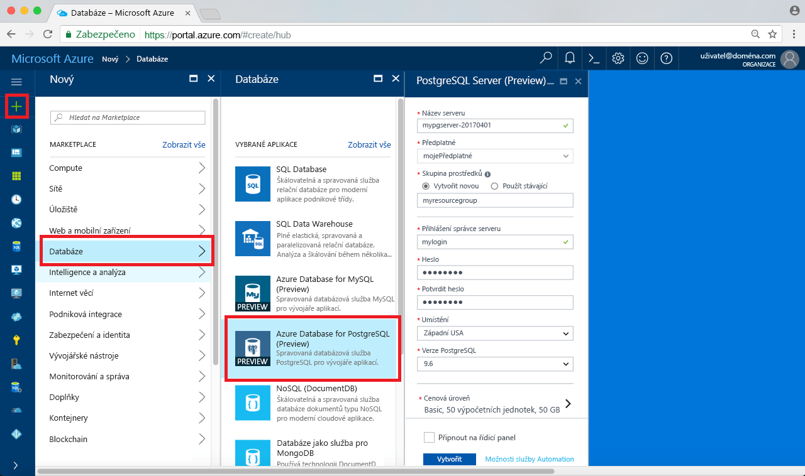
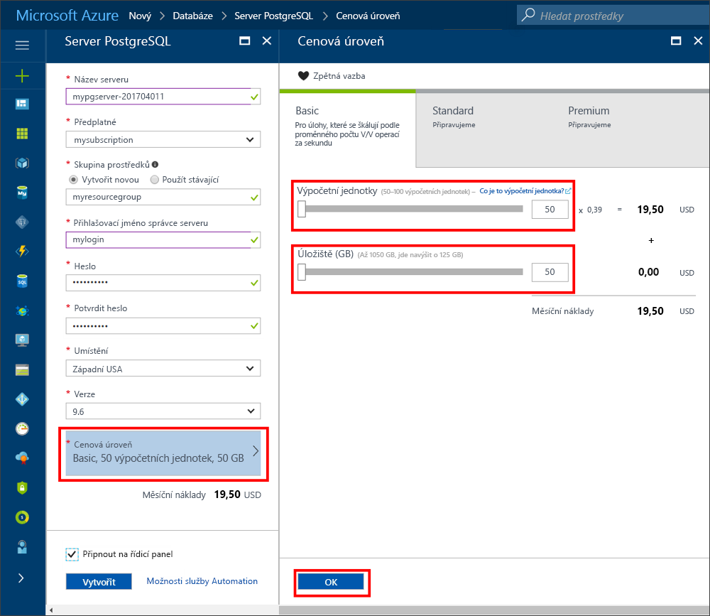
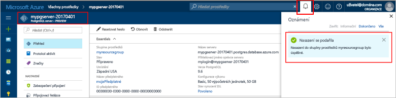
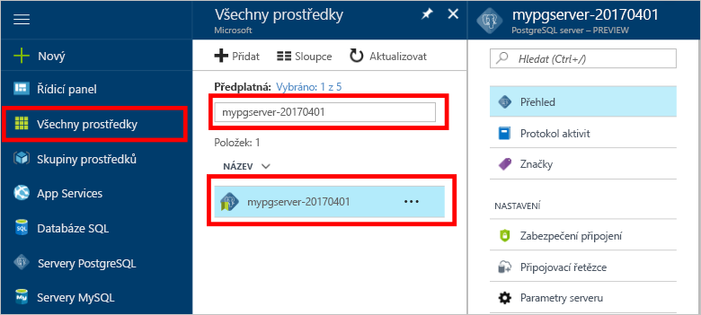
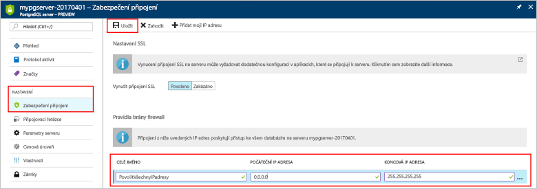
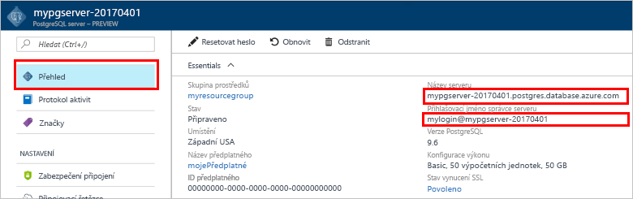
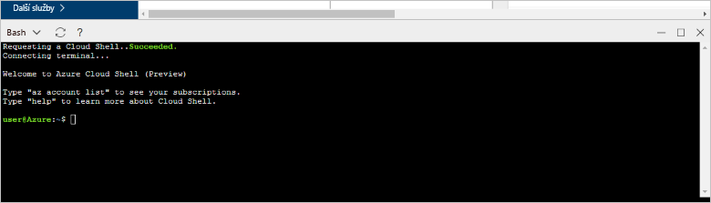
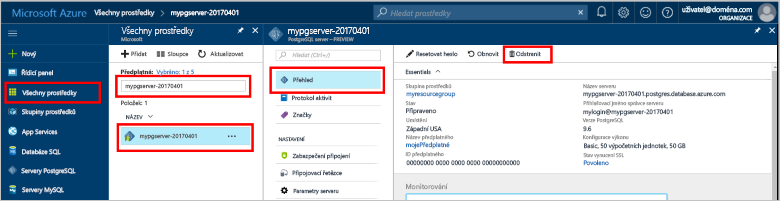

# <a name="create-an-azure-database-for-postgresql-in-the-azure-portal"></a><span data-ttu-id="1a408-103">Vytvoření Azure Database for PostgreSQL na portálu Azure Portal</span><span class="sxs-lookup"><span data-stu-id="1a408-103">Create an Azure Database for PostgreSQL in the Azure portal</span></span>

<span data-ttu-id="1a408-104">Azure Database for PostgreSQL je spravovaná služba, která umožňuje spouštět, spravovat a škálovat vysoce dostupné databáze PostgreSQL v cloudu.</span><span class="sxs-lookup"><span data-stu-id="1a408-104">Azure Database for PostgreSQL is a managed service that enables you to run, manage, and scale highly available PostgreSQL databases in the cloud.</span></span> <span data-ttu-id="1a408-105">V tomto rychlém startu se dozvíte, jak přibližně během pěti minut vytvořit server Azure Database for PostgreSQL pomocí webu Azure Portal.</span><span class="sxs-lookup"><span data-stu-id="1a408-105">This quickstart shows you how to create an Azure Database for PostgreSQL server using the Azure portal in about five minutes.</span></span>

<span data-ttu-id="1a408-106">Pokud ještě nemáte předplatné Azure, vytvořte si [bezplatný účet](https://azure.microsoft.com/free/) před tím, než začnete.</span><span class="sxs-lookup"><span data-stu-id="1a408-106">If you don't have an Azure subscription, create a [free](https://azure.microsoft.com/free/) account before you begin.</span></span>

## <a name="log-in-to-the-azure-portal"></a><span data-ttu-id="1a408-107">Přihlášení k portálu Azure Portal</span><span class="sxs-lookup"><span data-stu-id="1a408-107">Log in to the Azure portal</span></span>
<span data-ttu-id="1a408-108">Otevřete svůj webový prohlížeč a přejděte na [portál Microsoft Azure Portal](https://portal.azure.com/).</span><span class="sxs-lookup"><span data-stu-id="1a408-108">Open your web browser, and navigate to the [Microsoft Azure portal](https://portal.azure.com/).</span></span> <span data-ttu-id="1a408-109">Zadejte přihlašovací údaje pro přihlášení k portálu.</span><span class="sxs-lookup"><span data-stu-id="1a408-109">Enter your credentials to sign in to the portal.</span></span> <span data-ttu-id="1a408-110">Výchozím zobrazením je váš řídicí panel služby.</span><span class="sxs-lookup"><span data-stu-id="1a408-110">The default view is your service dashboard.</span></span>

## <a name="create-an-azure-database-for-postgresql"></a><span data-ttu-id="1a408-111">Vytvoření Azure Database for PostgreSQL</span><span class="sxs-lookup"><span data-stu-id="1a408-111">Create an Azure Database for PostgreSQL</span></span>

<span data-ttu-id="1a408-112">Server Azure Database for PostgreSQL se vytvoří s definovanou sadou [výpočetních prostředků a prostředků úložiště](./concepts-compute-unit-and-storage.md).</span><span class="sxs-lookup"><span data-stu-id="1a408-112">An Azure Database for PostgreSQL server is created with a defined set of [compute and storage resources](./concepts-compute-unit-and-storage.md).</span></span> <span data-ttu-id="1a408-113">Server se vytvoří v rámci [skupiny prostředků Azure](../azure-resource-manager/resource-group-overview.md).</span><span class="sxs-lookup"><span data-stu-id="1a408-113">The server is created within an [Azure resource group](../azure-resource-manager/resource-group-overview.md).</span></span>

<span data-ttu-id="1a408-114">Server Azure Database for PostgreSQL vytvoříte pomocí tohoto postupu:</span><span class="sxs-lookup"><span data-stu-id="1a408-114">Follow these steps to create an Azure Database for PostgreSQL server:</span></span>
1.  <span data-ttu-id="1a408-115">Klikněte na tlačítko **Nový** (+) v levém horním rohu webu Azure Portal.</span><span class="sxs-lookup"><span data-stu-id="1a408-115">Click the **New** button (+) found on the upper left-hand corner of the Azure portal.</span></span>
2.  <span data-ttu-id="1a408-116">Na stránce **Nový** vyberte **Databáze** a na stránce **Databáze** vyberte **Azure Database for PostgreSQL**.</span><span class="sxs-lookup"><span data-stu-id="1a408-116">Select **Databases** from the **New** page, and select **Azure Database for PostgreSQL** from the **Databases** page.</span></span>
 <span data-ttu-id="1a408-117"></span><span class="sxs-lookup"><span data-stu-id="1a408-117"></span></span>

3.  <span data-ttu-id="1a408-118">Vyplňte formulář podrobností nového serveru pomocí následujících informací, jak je vidět na předchozím obrázku:</span><span class="sxs-lookup"><span data-stu-id="1a408-118">Fill out the new server details form with the following information, as shown on the preceding image:</span></span>

    <span data-ttu-id="1a408-119">Nastavení</span><span class="sxs-lookup"><span data-stu-id="1a408-119">Setting</span></span>|<span data-ttu-id="1a408-120">Navrhovaná hodnota</span><span class="sxs-lookup"><span data-stu-id="1a408-120">Suggested value</span></span>|<span data-ttu-id="1a408-121">Popis</span><span class="sxs-lookup"><span data-stu-id="1a408-121">Description</span></span>
    ---|---|---
    <span data-ttu-id="1a408-122">Název serveru</span><span class="sxs-lookup"><span data-stu-id="1a408-122">Server name</span></span> |<span data-ttu-id="1a408-123">*mypgserver-20170401*</span><span class="sxs-lookup"><span data-stu-id="1a408-123">*mypgserver-20170401*</span></span>|<span data-ttu-id="1a408-124">Zvolte jedinečný název serveru, který identifikuje váš server Azure Database for PostgreSQL.</span><span class="sxs-lookup"><span data-stu-id="1a408-124">Choose a unique name that identifies your Azure Database for PostgreSQL server.</span></span> <span data-ttu-id="1a408-125">K názvu serveru, který zadáte pro připojování aplikací, se připojí název domény *postgres.database.azure.com*.</span><span class="sxs-lookup"><span data-stu-id="1a408-125">The domain name *postgres.database.azure.com* is appended to the server name you provide for applications to connect to.</span></span> <span data-ttu-id="1a408-126">Název serveru může obsahovat pouze malá písmena, číslice a znak spojovníku (-) a musí se skládat ze 3 až 63 znaků.</span><span class="sxs-lookup"><span data-stu-id="1a408-126">The server name can contain only lowercase letters, numbers, and the hyphen (-) character, and it must contain from 3 through 63 characters.</span></span>
    <span data-ttu-id="1a408-127">Předplatné</span><span class="sxs-lookup"><span data-stu-id="1a408-127">Subscription</span></span>|<span data-ttu-id="1a408-128">*Vaše předplatné*</span><span class="sxs-lookup"><span data-stu-id="1a408-128">*Your subscription*</span></span>|<span data-ttu-id="1a408-129">Předplatné Azure, které chcete použít pro váš server.</span><span class="sxs-lookup"><span data-stu-id="1a408-129">The Azure subscription that you want to use for your server.</span></span> <span data-ttu-id="1a408-130">Pokud máte více předplatných, vyberte odpovídající předplatné, ve kterém se prostředek účtuje.</span><span class="sxs-lookup"><span data-stu-id="1a408-130">If you have multiple subscriptions, choose the appropriate subscription in which the resource is billed for.</span></span>
    <span data-ttu-id="1a408-131">Skupina prostředků</span><span class="sxs-lookup"><span data-stu-id="1a408-131">Resource Group</span></span>|<span data-ttu-id="1a408-132">*myresourcegroup*</span><span class="sxs-lookup"><span data-stu-id="1a408-132">*myresourcegroup*</span></span>| <span data-ttu-id="1a408-133">Můžete vytvořit nový název skupiny prostředků nebo použít některý ze stávajících ve vašem předplatném.</span><span class="sxs-lookup"><span data-stu-id="1a408-133">You may make a new resource group name, or use an existing one from your subscription.</span></span>
    <span data-ttu-id="1a408-134">Přihlašovací jméno správce serveru</span><span class="sxs-lookup"><span data-stu-id="1a408-134">Server admin login</span></span> |<span data-ttu-id="1a408-135">*mylogin*</span><span class="sxs-lookup"><span data-stu-id="1a408-135">*mylogin*</span></span>| <span data-ttu-id="1a408-136">Vytvořte si vlastní přihlašovací účet, který budete používat při připojování k serveru.</span><span class="sxs-lookup"><span data-stu-id="1a408-136">Make your own login account to use when connecting to the server.</span></span> <span data-ttu-id="1a408-137">Přihlašovací jméno správce nemůže být azure_superuser, azure_pg_admin, admin, administrator, root, guest ani public a nesmí začínat na pg_.</span><span class="sxs-lookup"><span data-stu-id="1a408-137">The admin login name cannot be 'azure_superuser', 'azure_pg_admin', 'admin', 'administrator', 'root', 'guest', or 'public', and cannot start with 'pg_'.</span></span>
    <span data-ttu-id="1a408-138">Heslo</span><span class="sxs-lookup"><span data-stu-id="1a408-138">Password</span></span> |<span data-ttu-id="1a408-139">*Nějaké si zvolte*</span><span class="sxs-lookup"><span data-stu-id="1a408-139">*Your choice*</span></span> | <span data-ttu-id="1a408-140">Vytvořte nové heslo pro účet správce serveru.</span><span class="sxs-lookup"><span data-stu-id="1a408-140">Create a new password for the server admin account.</span></span> <span data-ttu-id="1a408-141">Musí se skládat z 8 až 128 znaků.</span><span class="sxs-lookup"><span data-stu-id="1a408-141">Must contain from 8 to 128 characters.</span></span> <span data-ttu-id="1a408-142">Heslo musí obsahovat znaky ze tří z těchto kategorií – velká písmena anglické abecedy, malá písmena anglické abecedy, číslice (0–9) a jiné než alfanumerických znaky (!, $, #, % apod.).</span><span class="sxs-lookup"><span data-stu-id="1a408-142">Your password must contain characters from three of the following categories – English uppercase letters, English lowercase letters, numbers (0-9), and non-alphanumeric characters (!, $, #, %, etc.).</span></span>
    <span data-ttu-id="1a408-143">Umístění</span><span class="sxs-lookup"><span data-stu-id="1a408-143">Location</span></span>|<span data-ttu-id="1a408-144">*Oblast nejbližší vašim uživatelům*</span><span class="sxs-lookup"><span data-stu-id="1a408-144">*The region closest to your users*</span></span>| <span data-ttu-id="1a408-145">Zvolte umístění co nejblíže vašim uživatelům.</span><span class="sxs-lookup"><span data-stu-id="1a408-145">Choose the location that's closest to your users.</span></span>
    <span data-ttu-id="1a408-146">Verze PostgreSQL</span><span class="sxs-lookup"><span data-stu-id="1a408-146">PostgreSQL Version</span></span>|<span data-ttu-id="1a408-147">*Zvolte nejnovější verzi*</span><span class="sxs-lookup"><span data-stu-id="1a408-147">*Choose the latest version*</span></span>| <span data-ttu-id="1a408-148">Zvolte nejnovější verzi, pokud nemáte specifické požadavky.</span><span class="sxs-lookup"><span data-stu-id="1a408-148">Choose the latest version unless you have specific requirements.</span></span>
    <span data-ttu-id="1a408-149">Cenová úroveň</span><span class="sxs-lookup"><span data-stu-id="1a408-149">Pricing Tier</span></span> | <span data-ttu-id="1a408-150">**Basic**, **50 výpočetních jednotek**, **50 GB**</span><span class="sxs-lookup"><span data-stu-id="1a408-150">**Basic**, **50 Compute Units** **50 GB**</span></span> | <span data-ttu-id="1a408-151">Klikněte na **Cenová úroveň** a určete úroveň služby a úroveň výkonu pro novou databázi.</span><span class="sxs-lookup"><span data-stu-id="1a408-151">Click **Pricing tier** to specify the service tier and performance level for your new database.</span></span> <span data-ttu-id="1a408-152">Na kartě v horní části zvolte úroveň Basic.</span><span class="sxs-lookup"><span data-stu-id="1a408-152">Choose Basic tier in the tab at the top.</span></span> <span data-ttu-id="1a408-153">Klikněte na levý konec posuvníku Výpočetní jednotky a pro účely tohoto rychlého startu upravte hodnotu na nejnižší dostupné množství.</span><span class="sxs-lookup"><span data-stu-id="1a408-153">Click the left end of the Compute Units slider to adjust the value to the least amount available for this quickstart.</span></span> <span data-ttu-id="1a408-154">Kliknutím na **OK** uložte výběr cenové úrovně.</span><span class="sxs-lookup"><span data-stu-id="1a408-154">Click **Ok** to save the pricing tier selection.</span></span> <span data-ttu-id="1a408-155">Viz následující snímek obrazovky.</span><span class="sxs-lookup"><span data-stu-id="1a408-155">See the following screenshot.</span></span>
    | <span data-ttu-id="1a408-156">Připnutí na řídicí panel</span><span class="sxs-lookup"><span data-stu-id="1a408-156">Pin to dashboard</span></span> | <span data-ttu-id="1a408-157">Zaškrtnout</span><span class="sxs-lookup"><span data-stu-id="1a408-157">Check</span></span> | <span data-ttu-id="1a408-158">Zaškrtněte možnost **Připnout na řídicí panel**, abyste povolili snadné sledování vašeho serveru na přední stránce řídicího panelu na webu Azure Portal.</span><span class="sxs-lookup"><span data-stu-id="1a408-158">Check the **Pin to dashboard** option to allow easy tracking of your server on the front dashboard page of your Azure portal.</span></span>

  > [!IMPORTANT]
  > <span data-ttu-id="1a408-159">Zde zadané jméno správce serveru a heslo se vyžadují k přihlášení na server a jeho databáze dále v tomto rychlém startu.</span><span class="sxs-lookup"><span data-stu-id="1a408-159">The server admin login and password that you specify here are required to log in to the server and its databases later in this quick start.</span></span> <span data-ttu-id="1a408-160">Tyto informace si zapamatujte nebo poznamenejte pro pozdější použití.</span><span class="sxs-lookup"><span data-stu-id="1a408-160">Remember or record this information for later use.</span></span>

    

4.  <span data-ttu-id="1a408-162">Klikněte na **Vytvořit**, aby se server zřídil.</span><span class="sxs-lookup"><span data-stu-id="1a408-162">Click **Create** to provision the server.</span></span> <span data-ttu-id="1a408-163">Zřizování trvá několik minut, maximálně však 20 minut.</span><span class="sxs-lookup"><span data-stu-id="1a408-163">Provisioning takes a few minutes, up to 20 minutes maximum.</span></span>

5.  <span data-ttu-id="1a408-164">Na panelu nástrojů klikněte na **Oznámení** a sledujte proces nasazení.</span><span class="sxs-lookup"><span data-stu-id="1a408-164">On the toolbar, click **Notifications** to monitor the deployment process.</span></span>
 <span data-ttu-id="1a408-165"></span><span class="sxs-lookup"><span data-stu-id="1a408-165"></span></span>
   
  <span data-ttu-id="1a408-166">Ve výchozím nastavení se databáze **postgres** vytvoří v rámci vašeho serveru.</span><span class="sxs-lookup"><span data-stu-id="1a408-166">By default, **postgres** database gets created under your server.</span></span> <span data-ttu-id="1a408-167">Databáze [postgres](https://www.postgresql.org/docs/9.6/static/app-initdb.html) je výchozí databáze určená pro uživatele, nástroje a aplikace třetích stran.</span><span class="sxs-lookup"><span data-stu-id="1a408-167">The [postgres](https://www.postgresql.org/docs/9.6/static/app-initdb.html) database is a default database meant for use by users, utilities, and third-party applications.</span></span> 

## <a name="configure-a-server-level-firewall-rule"></a><span data-ttu-id="1a408-168">Konfigurace pravidla brány firewall na úrovni serveru</span><span class="sxs-lookup"><span data-stu-id="1a408-168">Configure a server-level firewall rule</span></span>

<span data-ttu-id="1a408-169">Služba Azure Database for PostgreSQL vytváří bránu firewall na úrovni serveru.</span><span class="sxs-lookup"><span data-stu-id="1a408-169">The Azure Database for PostgreSQL service creates a firewall at the server-level.</span></span> <span data-ttu-id="1a408-170">Tato brána firewall brání externím aplikacím a nástrojům v připojení k serveru a kterékoli databázi na serveru, pokud není vytvořené pravidlo brány firewall k otevření brány firewall pro konkrétní IP adresy.</span><span class="sxs-lookup"><span data-stu-id="1a408-170">This firewall prevents external applications and tools from connecting to the server and any databases on the server, unless a firewall rule is created to open the firewall for specific IP addresses.</span></span> 

1.  <span data-ttu-id="1a408-171">Po dokončení nasazení najděte váš server.</span><span class="sxs-lookup"><span data-stu-id="1a408-171">Locate your server after the deployment completes.</span></span> <span data-ttu-id="1a408-172">V případě potřeby ho můžete vyhledat.</span><span class="sxs-lookup"><span data-stu-id="1a408-172">If needed, you can search for it.</span></span> <span data-ttu-id="1a408-173">Klikněte například na **Všechny prostředky** v levé nabídce a zadejte název serveru (například ukázkový *mypgserver-20170401*). Vyhledáte tak nově vytvořený server.</span><span class="sxs-lookup"><span data-stu-id="1a408-173">For example, click **All Resources** from the left-hand menu and type in the server name (such as the example *mypgserver-20170401*) to search for your newly created server.</span></span> <span data-ttu-id="1a408-174">Klikněte na název vašeho serveru uvedený ve výsledcích hledání.</span><span class="sxs-lookup"><span data-stu-id="1a408-174">Click on your server name listed in the search result.</span></span> <span data-ttu-id="1a408-175">Otevře se stránka **Přehled** vašeho serveru a poskytne vám možnosti další konfigurace.</span><span class="sxs-lookup"><span data-stu-id="1a408-175">The **Overview** page for your server opens and provides options for further configuration.</span></span>
 
    

2.  <span data-ttu-id="1a408-177">Na stránce serveru vyberte **Zabezpečení připojení**.</span><span class="sxs-lookup"><span data-stu-id="1a408-177">On the server page, select **Connection security**.</span></span> 
    <span data-ttu-id="1a408-178"></span><span class="sxs-lookup"><span data-stu-id="1a408-178"></span></span>

3.  <span data-ttu-id="1a408-179">Pod nadpisem **Pravidla brány firewall** klikněte do prázdného textového pole ve sloupci **Název pravidla** a začněte vytvářet pravidlo brány firewall.</span><span class="sxs-lookup"><span data-stu-id="1a408-179">Under the **Firewall rules** heading, click in the blank text box in the **Rule Name** column to begin creating the firewall rule.</span></span> 

    <span data-ttu-id="1a408-180">Pro účely tohoto rychlého startu povolíme provoz do serveru ze všech IP adres tak, že do textového pole v každém sloupci vyplníme následující hodnoty:</span><span class="sxs-lookup"><span data-stu-id="1a408-180">For this quick start, let's allow all IP addresses into the server by filling in the text box in each column with the following values:</span></span>

    <span data-ttu-id="1a408-181">Název pravidla</span><span class="sxs-lookup"><span data-stu-id="1a408-181">Rule Name</span></span> | <span data-ttu-id="1a408-182">Počáteční IP adresa</span><span class="sxs-lookup"><span data-stu-id="1a408-182">Start IP</span></span> | <span data-ttu-id="1a408-183">Koncová IP adresa</span><span class="sxs-lookup"><span data-stu-id="1a408-183">End IP</span></span> 
    ---|---|---
    <span data-ttu-id="1a408-184">AllowAllIps</span><span class="sxs-lookup"><span data-stu-id="1a408-184">AllowAllIps</span></span> |  <span data-ttu-id="1a408-185">0.0.0.0</span><span class="sxs-lookup"><span data-stu-id="1a408-185">0.0.0.0</span></span> | <span data-ttu-id="1a408-186">255.255.255.255</span><span class="sxs-lookup"><span data-stu-id="1a408-186">255.255.255.255</span></span>

4. <span data-ttu-id="1a408-187">Na horním panelu nástrojů na stránce Zabezpečení připojení klikněte na **Uložit**.</span><span class="sxs-lookup"><span data-stu-id="1a408-187">On the upper toolbar of the Connection security page, click **Save**.</span></span> <span data-ttu-id="1a408-188">Chvíli počkejte, než se zobrazí oznámení o úspěšném dokončení aktualizace zabezpečení připojení, a pak pokračujte.</span><span class="sxs-lookup"><span data-stu-id="1a408-188">Wait for a few moments and notice the notification showing that updating connection security has finished successfully before continuing.</span></span>

    > [!NOTE]
    > <span data-ttu-id="1a408-189">Připojení k serveru Azure Database for PostgreSQL komunikují přes port 5432.</span><span class="sxs-lookup"><span data-stu-id="1a408-189">Connections to your Azure Database for PostgreSQL server communicate over port 5432.</span></span> <span data-ttu-id="1a408-190">Pokud se pokoušíte připojit z podnikové sítě, nemusí být odchozí provoz přes port 5432 bránou firewall vaší sítě povolený.</span><span class="sxs-lookup"><span data-stu-id="1a408-190">If you are trying to connect from within a corporate network, outbound traffic over port 5432 may not be allowed by your network's firewall.</span></span> <span data-ttu-id="1a408-191">Pokud je to tak, k serveru se nebudete moct připojit, dokud vaše IT oddělení neotevře port 5432.</span><span class="sxs-lookup"><span data-stu-id="1a408-191">If so, you will not be able to connect to your server unless your IT department opens port 5432.</span></span>
    >

## <a name="get-the-connection-information"></a><span data-ttu-id="1a408-192">Získání informací o připojení</span><span class="sxs-lookup"><span data-stu-id="1a408-192">Get the connection information</span></span>

<span data-ttu-id="1a408-193">Při vytvoření našeho serveru Azure Database for PostgreSQL se vytvoří i výchozí databáze **postgres**.</span><span class="sxs-lookup"><span data-stu-id="1a408-193">When we created our Azure Database for PostgreSQL server, a default database named **postgres** gets created.</span></span> <span data-ttu-id="1a408-194">Pokud se chcete připojit ke svému databázovému serveru, je potřeba si vzpomenout na úplný název serveru a přihlašovací údaje správce.</span><span class="sxs-lookup"><span data-stu-id="1a408-194">To connect to your database server, you need to remember the full server name and admin login credentials.</span></span> <span data-ttu-id="1a408-195">Pravděpodobně jste si tyto hodnoty poznamenali v dřívější části tohoto článku Rychlý start.</span><span class="sxs-lookup"><span data-stu-id="1a408-195">You may have noted those values earlier in the quick start article.</span></span> <span data-ttu-id="1a408-196">Pokud ne, název serveru a přihlašovací informace můžete snadno vyhledat na stránce Přehled serveru na webu Azure Portal.</span><span class="sxs-lookup"><span data-stu-id="1a408-196">In case you did not, you can easily find the server name and login information from the server Overview page in the Azure portal.</span></span>

1. <span data-ttu-id="1a408-197">Otevřete stránku **Přehled** vašeho serveru.</span><span class="sxs-lookup"><span data-stu-id="1a408-197">Open your server's **Overview** page.</span></span> <span data-ttu-id="1a408-198">Poznamenejte si **Název serveru** a **Přihlašovací jméno správce serveru**.</span><span class="sxs-lookup"><span data-stu-id="1a408-198">Make a note of the **Server name** and **Server admin login name**.</span></span>
    <span data-ttu-id="1a408-199">Přejeďte kurzorem přes jednotlivá pole a vpravo od textu se zobrazí ikona kopírování.</span><span class="sxs-lookup"><span data-stu-id="1a408-199">Hover your cursor over each field, and the copy icon appears to the right of the text.</span></span> <span data-ttu-id="1a408-200">Podle potřeby hodnoty zkopírujte kliknutím na ikonu kopírování.</span><span class="sxs-lookup"><span data-stu-id="1a408-200">Click the copy icon as needed to copy the values.</span></span>

 

## <a name="connect-to-postgresql-database-using-psql-in-cloud-shell"></a><span data-ttu-id="1a408-202">Připojení k databázi PostgreSQL pomocí psql ve službě Cloud Shell</span><span class="sxs-lookup"><span data-stu-id="1a408-202">Connect to PostgreSQL database using psql in Cloud Shell</span></span>

<span data-ttu-id="1a408-203">Existuje řada aplikací, které můžete použít pro připojení k vašemu serveru Azure Database for PostgreSQL.</span><span class="sxs-lookup"><span data-stu-id="1a408-203">There are a number of applications you can use to connect to your Azure Database for PostgreSQL server.</span></span> <span data-ttu-id="1a408-204">Nejprve si ukážeme, jak se k serveru připojit pomocí nástroje příkazového řádku psql.</span><span class="sxs-lookup"><span data-stu-id="1a408-204">Let's first use the psql command-line utility to illustrate how to connect to the server.</span></span>  <span data-ttu-id="1a408-205">Můžete použít webový prohlížeč a Azure Cloud Shell, jak je zde popsáno, aniž by bylo nutné instalovat další software.</span><span class="sxs-lookup"><span data-stu-id="1a408-205">You can use a web browser and the Azure Cloud Shell as described here without the need to install any additional software.</span></span> <span data-ttu-id="1a408-206">Pokud máte nástroj psql nainstalovaný místně na svém počítači, můžete se připojit i z něj.</span><span class="sxs-lookup"><span data-stu-id="1a408-206">If you have the psql utility installed locally on your own machine, you can connect from there as well.</span></span>

1. <span data-ttu-id="1a408-207">Pomocí ikony terminálu v horním navigačním podokně spusťte službu Azure Cloud Shell.</span><span class="sxs-lookup"><span data-stu-id="1a408-207">Launch the Azure Cloud Shell via the terminal icon on the top navigation pane.</span></span>

   

2. <span data-ttu-id="1a408-209">Azure Cloud Shell se otevře v prohlížeči a umožní vám zadávat příkazy prostředí Bash.</span><span class="sxs-lookup"><span data-stu-id="1a408-209">The Azure Cloud Shell opens in your browser, enabling you to type bash shell commands.</span></span>

   

3. <span data-ttu-id="1a408-211">V příkazovém řádku služby Cloud Shell se zadáním příkazového řádku psql na zeleném řádku připojte k databázi na vašem serveru Azure Database for PostgreSQL.</span><span class="sxs-lookup"><span data-stu-id="1a408-211">At the Cloud Shell prompt, connect to a database in your Azure Database for PostgreSQL server by typing the psql command line at the green prompt.</span></span>

    <span data-ttu-id="1a408-212">Následující formát se používá pro připojení k serveru Azure Database for PostgreSQL s nástrojem [psql](https://www.postgresql.org/docs/9.6/static/app-psql.html):</span><span class="sxs-lookup"><span data-stu-id="1a408-212">The following format is used to connect to an Azure Database for PostgreSQL server with the [psql](https://www.postgresql.org/docs/9.6/static/app-psql.html) utility:</span></span>
    ```bash
    psql --host=<yourserver> --port=<port> --username=<server admin login> --dbname=<database name>
    ```

    <span data-ttu-id="1a408-213">Například následující příkaz se připojí k ukázkovému serveru:</span><span class="sxs-lookup"><span data-stu-id="1a408-213">For example, the following command connects to an example server:</span></span>

    ```bash
    psql --host=mypgserver-20170401.postgres.database.azure.com --port=5432 --username=mylogin@mypgserver-20170401 --dbname=postgres
    ```

    <span data-ttu-id="1a408-214">Parametr psql</span><span class="sxs-lookup"><span data-stu-id="1a408-214">psql parameter</span></span> |<span data-ttu-id="1a408-215">Navrhovaná hodnota</span><span class="sxs-lookup"><span data-stu-id="1a408-215">Suggested value</span></span>|<span data-ttu-id="1a408-216">Popis</span><span class="sxs-lookup"><span data-stu-id="1a408-216">Description</span></span>
    ---|---|---
    <span data-ttu-id="1a408-217">--host</span><span class="sxs-lookup"><span data-stu-id="1a408-217">--host</span></span> | <span data-ttu-id="1a408-218">*název serveru*</span><span class="sxs-lookup"><span data-stu-id="1a408-218">*server name*</span></span> | <span data-ttu-id="1a408-219">Zadejte hodnotu názvu serveru, kterou jste použili dříve při vytváření služby Azure Database for PostgreSQL.</span><span class="sxs-lookup"><span data-stu-id="1a408-219">Specify the server name value that was used when you created the Azure Database for PostgreSQL earlier.</span></span> <span data-ttu-id="1a408-220">Náš ukázkový server v příkladu je mypgserver-20170401.postgres.database.azure.com. Použijte plně kvalifikovaný název domény (\*.postgres.database.azure.com), jak je znázorněno v příkladu.</span><span class="sxs-lookup"><span data-stu-id="1a408-220">Our example server shown is mypgserver-20170401.postgres.database.azure.com. Use the fully qualified domain name (\*.postgres.database.azure.com) as shown in the example.</span></span> <span data-ttu-id="1a408-221">Pokud si název vašeho serveru nepamatujete, získejte informace o připojení pomocí postupu v předchozí části.</span><span class="sxs-lookup"><span data-stu-id="1a408-221">Follow the steps in the previous section to get the connection information if you do not remember your server name.</span></span> 
    <span data-ttu-id="1a408-222">--port</span><span class="sxs-lookup"><span data-stu-id="1a408-222">--port</span></span> | <span data-ttu-id="1a408-223">**5432**</span><span class="sxs-lookup"><span data-stu-id="1a408-223">**5432**</span></span> | <span data-ttu-id="1a408-224">Při připojování ke službě Azure Database for PostgreSQL vždy používejte port 5432.</span><span class="sxs-lookup"><span data-stu-id="1a408-224">Always use port 5432 when connecting to Azure Database for PostgreSQL.</span></span> 
    <span data-ttu-id="1a408-225">--username</span><span class="sxs-lookup"><span data-stu-id="1a408-225">--username</span></span> | <span data-ttu-id="1a408-226">*přihlašovací jméno správce serveru*</span><span class="sxs-lookup"><span data-stu-id="1a408-226">*server admin login name*</span></span> |<span data-ttu-id="1a408-227">Zadejte přihlašovací uživatelské jméno správce serveru, které jste zadali dříve při vytváření služby Azure Database for PostgreSQL.</span><span class="sxs-lookup"><span data-stu-id="1a408-227">Type in the  server admin login username supplied when you created the Azure Database for PostgreSQL earlier.</span></span> <span data-ttu-id="1a408-228">Pokud si uživatelské jméno nepamatujete, získejte informace o připojení pomocí postupu v předchozí části.</span><span class="sxs-lookup"><span data-stu-id="1a408-228">Follow the steps in the previous section to get the connection information if you do not remember the username.</span></span>  <span data-ttu-id="1a408-229">Formát je *username@servername*.</span><span class="sxs-lookup"><span data-stu-id="1a408-229">The format is *username@servername*.</span></span>
    <span data-ttu-id="1a408-230">--dbname</span><span class="sxs-lookup"><span data-stu-id="1a408-230">--dbname</span></span> | <span data-ttu-id="1a408-231">**postgres**</span><span class="sxs-lookup"><span data-stu-id="1a408-231">**postgres**</span></span> | <span data-ttu-id="1a408-232">Pro první připojení použijte výchozí, systémem vygenerovaný, název databáze *postgres*.</span><span class="sxs-lookup"><span data-stu-id="1a408-232">Use the default system generated database name *postgres* for the first connection.</span></span> <span data-ttu-id="1a408-233">Později vytvoříte vlastní databázi.</span><span class="sxs-lookup"><span data-stu-id="1a408-233">Later you create your own database.</span></span>

    <span data-ttu-id="1a408-234">Po spuštění příkazu psql s vlastními hodnotami parametrů se zobrazí výzva k zadání hesla správce serveru.</span><span class="sxs-lookup"><span data-stu-id="1a408-234">After running the psql command, with your own parameter values, you are prompted to type the server admin password.</span></span> <span data-ttu-id="1a408-235">Jedná se o stejné heslo, které jste zadali při vytváření serveru.</span><span class="sxs-lookup"><span data-stu-id="1a408-235">This password is the same that you provided when you created the server.</span></span> 

    <span data-ttu-id="1a408-236">Parametr psql</span><span class="sxs-lookup"><span data-stu-id="1a408-236">psql parameter</span></span> |<span data-ttu-id="1a408-237">Navrhovaná hodnota</span><span class="sxs-lookup"><span data-stu-id="1a408-237">Suggested value</span></span>|<span data-ttu-id="1a408-238">Popis</span><span class="sxs-lookup"><span data-stu-id="1a408-238">Description</span></span>
    ---|---|---
    <span data-ttu-id="1a408-239">heslo</span><span class="sxs-lookup"><span data-stu-id="1a408-239">password</span></span> | <span data-ttu-id="1a408-240">*vaše heslo správce*</span><span class="sxs-lookup"><span data-stu-id="1a408-240">*your admin password*</span></span> | <span data-ttu-id="1a408-241">Poznámka: na příkazovém řádku Bash se zadávané znaky hesla nezobrazí.</span><span class="sxs-lookup"><span data-stu-id="1a408-241">Note, the typed password characters are not shown on the bash prompt.</span></span> <span data-ttu-id="1a408-242">Po zadání všech znaků stiskněte enter, abyste se ověřili a připojili.</span><span class="sxs-lookup"><span data-stu-id="1a408-242">Press enter after you have typed all the characters to authenticate and connect.</span></span>

    <span data-ttu-id="1a408-243">Jakmile budete připojeni, nástroj psql zobrazí příkazový řádek postgres, kde můžete zadávat příkazy jazyka SQL.</span><span class="sxs-lookup"><span data-stu-id="1a408-243">Once connected, the psql utility displays a postgres prompt where you type sql commands.</span></span> <span data-ttu-id="1a408-244">Ve výstupu počátečního připojení se může zobrazit varování, protože nástroj psql ve službě Azure Cloud Shell může mít jinou verzi než na serveru Azure Database for PostgreSQL.</span><span class="sxs-lookup"><span data-stu-id="1a408-244">In the initial connection output, a warning may be displayed since the psql in the Azure Cloud Shell may be a different  version than the Azure Database for PostgreSQL server version.</span></span> 
    
    <span data-ttu-id="1a408-245">Příklad výstupu nástroje psql:</span><span class="sxs-lookup"><span data-stu-id="1a408-245">Example psql output:</span></span>
    ```bash
    psql (9.5.7, server 9.6.2)
    WARNING: psql major version 9.5, server major version 9.6.
        Some psql features might not work.
    SSL connection (protocol: TLSv1.2, cipher: ECDHE-RSA-AES256-SHA384, bits: 256, compression: off)
    Type "help" for help.
   
    postgres=> 
    ```

    > [!TIP]
    > <span data-ttu-id="1a408-246">Pokud brána firewall není nakonfigurovaná k povolení IP adres služby Azure Cloud Shell, dojde k následující chybě:</span><span class="sxs-lookup"><span data-stu-id="1a408-246">If the firewall is not configured to allow the IP address of the Azure Cloud Shell, the following error occurs:</span></span>
    > 
    > <span data-ttu-id="1a408-247">"psql: FATAL: no pg_hba.conf entry for host "138.91.195.82", user "mylogin", database "postgres", SSL on FATAL:  SSL connection is required. (psql: ZÁVAŽNÁ CHYBA: nenalezen žádný záznam pg_hba.conf pro hostitele 138.91.195.82, uživatele mylogin, databázi postgres, ZÁVAŽNÁ CHYBA SSL: vyžaduje se připojení SSL.)</span><span class="sxs-lookup"><span data-stu-id="1a408-247">"psql: FATAL:  no pg_hba.conf entry for host "138.91.195.82", user "mylogin", database "postgres", SSL on FATAL:  SSL connection is required.</span></span> <span data-ttu-id="1a408-248">Zadejte možnosti SSL a zkuste to znovu.</span><span class="sxs-lookup"><span data-stu-id="1a408-248">Please specify SSL options and retry.</span></span>
    > 
    > <span data-ttu-id="1a408-249">Pokud chcete chybu vyřešit, ujistěte se, že konfigurace serveru odpovídá postupu v části *Konfigurace pravidla brány firewall na úrovni serveru* tohoto článku.</span><span class="sxs-lookup"><span data-stu-id="1a408-249">To resolve the error, make sure the server configuration matches the steps in the *Configure a server-level firewall rule* section of the article.</span></span>

4.  <span data-ttu-id="1a408-250">Vytvořte prázdnou databázi zadáním následujícího příkazu na příkazovém řádku:</span><span class="sxs-lookup"><span data-stu-id="1a408-250">Create a blank database at the prompt by typing the following command:</span></span>
    ```bash
    CREATE DATABASE mypgsqldb;
    ```
    <span data-ttu-id="1a408-251">Dokončení příkazu může chvíli trvat.</span><span class="sxs-lookup"><span data-stu-id="1a408-251">The command may take a few moments to complete.</span></span> 

5.  <span data-ttu-id="1a408-252">V příkazovém řádku proveďte následující příkaz pro přepnutí připojení na nově vytvořenou databázi **mypgsqldb**.</span><span class="sxs-lookup"><span data-stu-id="1a408-252">At the prompt, execute the following command to switch connection to the newly created database **mypgsqldb**.</span></span>
    ```bash
    \c mypgsqldb
    ```

6.  <span data-ttu-id="1a408-253">Zadejte \q a stisknutím klávesy ENTER ukončete psql.</span><span class="sxs-lookup"><span data-stu-id="1a408-253">Type \q and then press ENTER to quit psql.</span></span> <span data-ttu-id="1a408-254">Jakmile budete hotovi, můžete zavřít Azure Cloud Shell.</span><span class="sxs-lookup"><span data-stu-id="1a408-254">You can close the Azure Cloud Shell after you are done.</span></span>

<span data-ttu-id="1a408-255">Právě jste se připojili ke službě Azure Database for PostgreSQL a vytvořili prázdnou uživatelskou databázi.</span><span class="sxs-lookup"><span data-stu-id="1a408-255">Now you have connected to the Azure Database for PostgreSQL and created a blank user database.</span></span> <span data-ttu-id="1a408-256">Pokračujte k další části a připojte se pomocí dalšího běžného nástroje pgAdmin.</span><span class="sxs-lookup"><span data-stu-id="1a408-256">Continue to the next section to connect using another common tool, pgAdmin.</span></span>

## <a name="connect-to-postgresql-database-using-pgadmin"></a><span data-ttu-id="1a408-257">Připojení k databázi PostgreSQL pomocí aplikace pgAdmin</span><span class="sxs-lookup"><span data-stu-id="1a408-257">Connect to PostgreSQL database using pgAdmin</span></span>

<span data-ttu-id="1a408-258">Připojení k serveru Azure PostgreSQL pomocí grafického uživatelského rozhraní aplikace _pgAdmin_</span><span class="sxs-lookup"><span data-stu-id="1a408-258">To connect to Azure PostgreSQL server using the GUI tool _pgAdmin_</span></span>
1.  <span data-ttu-id="1a408-259">Na klientském počítači spusťte aplikaci _pgAdmin_.</span><span class="sxs-lookup"><span data-stu-id="1a408-259">Launch the _pgAdmin_ application on your client computer.</span></span> <span data-ttu-id="1a408-260">_pgAdmin_ můžete nainstalovat ze stránky http://www.pgadmin.org/.</span><span class="sxs-lookup"><span data-stu-id="1a408-260">You can install _pgAdmin_ from http://www.pgadmin.org/.</span></span>
2.  <span data-ttu-id="1a408-261">Klikněte na ikonu **Přidat nový server** v části **Rychlé odkazy** uprostřed stránky Řídicí panel.</span><span class="sxs-lookup"><span data-stu-id="1a408-261">Click the **Add New Server** icon from the **Quick Links** section in the center of the Dashboard page.</span></span>
3.  <span data-ttu-id="1a408-262">V dialogovém okně **Vytvořit – server** na kartě **Obecné** zadejte jedinečný popisný název serveru, jako například **Azure PostgreSQL Server**.</span><span class="sxs-lookup"><span data-stu-id="1a408-262">In the **Create - Server** dialog box **General** tab, enter a unique friendly Name for the server, such as **Azure PostgreSQL Server**.</span></span>
<span data-ttu-id="1a408-263"></span><span class="sxs-lookup"><span data-stu-id="1a408-263"></span></span>
4.  <span data-ttu-id="1a408-264">V dialogovém okně **Vytvořit – server** na kartě **Připojení** použijte uvedená nastavení a klikněte na **Uložit**.</span><span class="sxs-lookup"><span data-stu-id="1a408-264">In the **Create - Server** dialog box, **Connection** tab, use the settings as specified and click **Save**.</span></span>
   <span data-ttu-id="1a408-265"></span><span class="sxs-lookup"><span data-stu-id="1a408-265"></span></span>

    <span data-ttu-id="1a408-266">Parametr pgAdmin</span><span class="sxs-lookup"><span data-stu-id="1a408-266">pgAdmin parameter</span></span> |<span data-ttu-id="1a408-267">Navrhovaná hodnota</span><span class="sxs-lookup"><span data-stu-id="1a408-267">Suggested value</span></span>|<span data-ttu-id="1a408-268">Popis</span><span class="sxs-lookup"><span data-stu-id="1a408-268">Description</span></span>
    ---|---|---
    <span data-ttu-id="1a408-269">Název nebo adresa hostitele</span><span class="sxs-lookup"><span data-stu-id="1a408-269">Host Name/Address</span></span> | <span data-ttu-id="1a408-270">*název serveru*</span><span class="sxs-lookup"><span data-stu-id="1a408-270">*server name*</span></span> | <span data-ttu-id="1a408-271">Zadejte hodnotu názvu serveru, kterou jste použili dříve při vytváření služby Azure Database for PostgreSQL.</span><span class="sxs-lookup"><span data-stu-id="1a408-271">Specify the server name value that was used when you created the Azure Database for PostgreSQL earlier.</span></span> <span data-ttu-id="1a408-272">Náš ukázkový server v příkladu je mypgserver-20170401.postgres.database.azure.com. Použijte plně kvalifikovaný název domény (\*.postgres.database.azure.com), jak je znázorněno v příkladu.</span><span class="sxs-lookup"><span data-stu-id="1a408-272">Our example server shown is mypgserver-20170401.postgres.database.azure.com. Use the fully qualified domain name (\*.postgres.database.azure.com) as shown in the example.</span></span> <span data-ttu-id="1a408-273">Pokud si název vašeho serveru nepamatujete, získejte informace o připojení pomocí postupu v předchozí části.</span><span class="sxs-lookup"><span data-stu-id="1a408-273">Follow the steps in the previous section to get the connection information if you do not remember your server name.</span></span> 
    <span data-ttu-id="1a408-274">Port</span><span class="sxs-lookup"><span data-stu-id="1a408-274">Port</span></span> | <span data-ttu-id="1a408-275">**5432**</span><span class="sxs-lookup"><span data-stu-id="1a408-275">**5432**</span></span> | <span data-ttu-id="1a408-276">Při připojování ke službě Azure Database for PostgreSQL vždy používejte port 5432.</span><span class="sxs-lookup"><span data-stu-id="1a408-276">Always use port 5432 when connecting to Azure Database for PostgreSQL.</span></span>  
    <span data-ttu-id="1a408-277">Databáze údržby</span><span class="sxs-lookup"><span data-stu-id="1a408-277">Maintenance Database</span></span> | <span data-ttu-id="1a408-278">**postgres**</span><span class="sxs-lookup"><span data-stu-id="1a408-278">**postgres**</span></span> | <span data-ttu-id="1a408-279">Požijte výchozí systémem generovaný název databáze *postgres*.</span><span class="sxs-lookup"><span data-stu-id="1a408-279">Use the default system generated database name *postgres*.</span></span>
    <span data-ttu-id="1a408-280">Uživatelské jméno</span><span class="sxs-lookup"><span data-stu-id="1a408-280">User Name</span></span> | <span data-ttu-id="1a408-281">*přihlašovací jméno správce serveru*</span><span class="sxs-lookup"><span data-stu-id="1a408-281">*server admin login name*</span></span> | <span data-ttu-id="1a408-282">Zadejte přihlašovací uživatelské jméno správce serveru, které jste zadali dříve při vytváření služby Azure Database for PostgreSQL.</span><span class="sxs-lookup"><span data-stu-id="1a408-282">Type in the server admin login username supplied when you created the Azure Database for PostgreSQL earlier.</span></span> <span data-ttu-id="1a408-283">Pokud si uživatelské jméno nepamatujete, získejte informace o připojení pomocí postupu v předchozí části.</span><span class="sxs-lookup"><span data-stu-id="1a408-283">Follow the steps in the previous section to get the connection information if you do not remember the username.</span></span> <span data-ttu-id="1a408-284">Formát je *username@servername*.</span><span class="sxs-lookup"><span data-stu-id="1a408-284">The format is *username@servername*.</span></span>
    <span data-ttu-id="1a408-285">Heslo</span><span class="sxs-lookup"><span data-stu-id="1a408-285">Password</span></span> | <span data-ttu-id="1a408-286">*vaše heslo správce*</span><span class="sxs-lookup"><span data-stu-id="1a408-286">*your admin password*</span></span> |  <span data-ttu-id="1a408-287">Heslo, které jste si zvolili při vytváření serveru dříve v tomto rychlém startu.</span><span class="sxs-lookup"><span data-stu-id="1a408-287">The password you chose when you created the server earlier in this quickstart.</span></span>
    <span data-ttu-id="1a408-288">Role</span><span class="sxs-lookup"><span data-stu-id="1a408-288">Role</span></span> | <span data-ttu-id="1a408-289">*ponechte prázdné*</span><span class="sxs-lookup"><span data-stu-id="1a408-289">*leave blank*</span></span> | <span data-ttu-id="1a408-290">V tuto chvíli není potřeba zadávat název role.</span><span class="sxs-lookup"><span data-stu-id="1a408-290">No need to provide a role name at this point.</span></span> <span data-ttu-id="1a408-291">Ponechte toto pole prázdné.</span><span class="sxs-lookup"><span data-stu-id="1a408-291">Leave the field blank.</span></span>
    <span data-ttu-id="1a408-292">Režim SSL</span><span class="sxs-lookup"><span data-stu-id="1a408-292">SSL Mode</span></span> | <span data-ttu-id="1a408-293">Vyžadovat</span><span class="sxs-lookup"><span data-stu-id="1a408-293">Require</span></span> | <span data-ttu-id="1a408-294">Ve výchozím nastavení jsou všechny servery Azure PostgreSQL vytvořeny se zapnutým vynucováním SSL.</span><span class="sxs-lookup"><span data-stu-id="1a408-294">By default, all Azure PostgreSQL servers are created with SSL enforcing turned ON.</span></span> <span data-ttu-id="1a408-295">Pokud chcete vynucování SSL vypnout, přečtěte si podrobnosti v tématu [Vynucování SSL](./concepts-ssl-connection-security.md).</span><span class="sxs-lookup"><span data-stu-id="1a408-295">To turn OFF SSL enforcing, see details in [Enforcing SSL](./concepts-ssl-connection-security.md).</span></span>
    
5.  <span data-ttu-id="1a408-296">Klikněte na **Uložit**.</span><span class="sxs-lookup"><span data-stu-id="1a408-296">Click **Save**.</span></span>
6.  <span data-ttu-id="1a408-297">V levém podokně Prohlížeč rozbalte uzel **Servery**.</span><span class="sxs-lookup"><span data-stu-id="1a408-297">In the Browser left pane, expand the **Servers** node.</span></span> <span data-ttu-id="1a408-298">Vyberte váš server, například **Azure PostgreSQL Server**, a kliknutím se k němu připojte.</span><span class="sxs-lookup"><span data-stu-id="1a408-298">Choose your server, for example **Azure PostgreSQL Server** and click to connect to it.</span></span>
7. <span data-ttu-id="1a408-299">Rozbalte uzel serveru a pod ním pak rozbalte **Databáze**.</span><span class="sxs-lookup"><span data-stu-id="1a408-299">Expand the server node, and then expand **Databases** under it.</span></span> <span data-ttu-id="1a408-300">Seznam by měl obsahovat vaši existující databázi *postgres* a všechny nově vytvořené uživatelské databáze, jako je *mypgsqldb*, kterou jsme vytvořili v předchozí části.</span><span class="sxs-lookup"><span data-stu-id="1a408-300">The list should include your existing *postgres* database, and any newly created user database, such as *mypgsqldb*, that we created in the previous section.</span></span> <span data-ttu-id="1a408-301">Nezapomeňte, že na jeden server se službou Azure Database for PostgreSQL můžete vytvořit více databází.</span><span class="sxs-lookup"><span data-stu-id="1a408-301">Notice that you may create multiple databases per server with Azure Database for PostgreSQL.</span></span>
8. <span data-ttu-id="1a408-302">Klikněte pravým tlačítkem na **Databáze**, zvolte nabídku **Vytvořit** a klikněte na **Databáze**.</span><span class="sxs-lookup"><span data-stu-id="1a408-302">Right-click on **Databases**, choose the **Create** menu, and click **Database**.</span></span>
9.  <span data-ttu-id="1a408-303">Do pole **Databáze** zadejte libovolný název databáze, například *mypgsqldb*, jak je znázorněno v příkladu.</span><span class="sxs-lookup"><span data-stu-id="1a408-303">Type a database name of your choice in the **Database** field, such as *mypgsqldb* shown in the example.</span></span> 
10. <span data-ttu-id="1a408-304">Z rozevírací nabídky vyberte **Vlastníka** databáze.</span><span class="sxs-lookup"><span data-stu-id="1a408-304">Select the **Owner** for the database from the drop-down box.</span></span> <span data-ttu-id="1a408-305">Zvolte přihlašovací jméno správce serveru, jako je *mylogin* v našem příkladu.</span><span class="sxs-lookup"><span data-stu-id="1a408-305">Choose your server admin login name, such as our example *mylogin*.</span></span>
10. <span data-ttu-id="1a408-306">Kliknutím na **Uložit** vytvořte novou prázdnou databázi.</span><span class="sxs-lookup"><span data-stu-id="1a408-306">Click **Save** to create a new blank database.</span></span>
11. <span data-ttu-id="1a408-307">V podokně **Prohlížeč** se vytvořená databáze zobrazí v seznamu databází pod názvem vašeho serveru.</span><span class="sxs-lookup"><span data-stu-id="1a408-307">In the **Browser** pane, see the database you created in the list of Databases under your server name.</span></span>
 <span data-ttu-id="1a408-308"></span><span class="sxs-lookup"><span data-stu-id="1a408-308"></span></span>


## <a name="clean-up-resources"></a><span data-ttu-id="1a408-309">Vyčištění prostředků</span><span class="sxs-lookup"><span data-stu-id="1a408-309">Clean up resources</span></span>
<span data-ttu-id="1a408-310">Vyčistěte prostředky, které jste vytvořili v rámci tohoto rychlého startu, buď odstraněním [skupiny prostředků Azure](../azure-resource-manager/resource-group-overview.md), což zahrnuje odstranění všech prostředků ve skupině prostředků, nebo odstraněním příslušného prostředku serveru, pokud chcete ostatní prostředky ponechat beze změn.</span><span class="sxs-lookup"><span data-stu-id="1a408-310">Clean up the resources you created in the quickstart either by deleting the [Azure resource group](../azure-resource-manager/resource-group-overview.md), which includes all the resources in the resource group, or by deleting the one server resource if you want to keep the other resources intact.</span></span>

> [!TIP]
> <span data-ttu-id="1a408-311">Další rychlé starty v této kolekci vycházejí z tohoto rychlého startu.</span><span class="sxs-lookup"><span data-stu-id="1a408-311">Other quickstarts in this collection build upon this quick start.</span></span> <span data-ttu-id="1a408-312">Pokud chcete pokračovat v práci s dalšími rychlými starty, neprovádějte čištění prostředků vytvořených v rámci tohoto rychlého startu.</span><span class="sxs-lookup"><span data-stu-id="1a408-312">If you plan to continue on to work with subsequent quickstarts, do not clean up the resources created in this quickstart.</span></span> <span data-ttu-id="1a408-313">Pokud pokračovat nechcete, pomocí následujících kroků odstraňte prostředky vytvořené tímto rychlým startem na webu Azure Portal.</span><span class="sxs-lookup"><span data-stu-id="1a408-313">If you do not plan to continue, use the following steps to delete resources created by this quickstart in the Azure portal.</span></span>

<span data-ttu-id="1a408-314">Pokud chcete odstranit celou skupinu prostředků, včetně nově vytvořeného serveru:</span><span class="sxs-lookup"><span data-stu-id="1a408-314">To delete the entire resource group including the newly created server:</span></span>
1.  <span data-ttu-id="1a408-315">Vyhledejte skupinu prostředků na webu Azure Portal.</span><span class="sxs-lookup"><span data-stu-id="1a408-315">Locate your resource group in the Azure portal.</span></span> <span data-ttu-id="1a408-316">V nabídce vlevo na webu Azure Portal klikněte na **Skupiny prostředků** a potom klikněte na název vaší skupiny prostředků, jako je **myresourcegroup** v našem příkladu.</span><span class="sxs-lookup"><span data-stu-id="1a408-316">From the left-hand menu in the Azure portal, click **Resource groups** and then click the name of your resource group, such as our example **myresourcegroup**.</span></span>
2.  <span data-ttu-id="1a408-317">Na stránce vaší skupiny prostředků klikněte na **Odstranit**.</span><span class="sxs-lookup"><span data-stu-id="1a408-317">On your resource group page, click **Delete**.</span></span> <span data-ttu-id="1a408-318">Pak pro potvrzení odstranění zadejte do textového pole název vaší skupiny prostředků, jako je **myresourcegroup** v našem příkladu, a klikněte na **Odstranit**.</span><span class="sxs-lookup"><span data-stu-id="1a408-318">Then type the name of your resource group, such as our example **myresourcegroup**, in the text box to confirm deletion, and then click **Delete**.</span></span>

<span data-ttu-id="1a408-319">Pokud místo toho chcete odstranit nově vytvořený server:</span><span class="sxs-lookup"><span data-stu-id="1a408-319">Or instead, to delete the newly created server:</span></span>
1.  <span data-ttu-id="1a408-320">Vyhledejte server na webu Azure Portal, pokud ho ještě nemáte otevřený.</span><span class="sxs-lookup"><span data-stu-id="1a408-320">Locate your server in the Azure portal, if you do not have it open.</span></span> <span data-ttu-id="1a408-321">V nabídce vlevo na webu Azure Portal klikněte na **Všechny prostředky** a vyhledejte server, který jste vytvořili.</span><span class="sxs-lookup"><span data-stu-id="1a408-321">From the left-hand menu in Azure portal, click **All resources**, and then search for the server you created.</span></span>
2.  <span data-ttu-id="1a408-322">Na stránce **Přehled** klikněte na tlačítko **Odstranit** v horním podokně.</span><span class="sxs-lookup"><span data-stu-id="1a408-322">On the **Overview** page, click the **Delete** button on the top pane.</span></span>
<span data-ttu-id="1a408-323"></span><span class="sxs-lookup"><span data-stu-id="1a408-323"></span></span>
3.  <span data-ttu-id="1a408-324">Potvrďte název serveru, který chcete odstranit, a zobrazte jeho databáze, které tím ovlivníte.</span><span class="sxs-lookup"><span data-stu-id="1a408-324">Confirm the server name you want to delete, and show the databases under it that are affected.</span></span> <span data-ttu-id="1a408-325">Do textového pole zadejte název vašeho serveru, jako je **mypgserver-20170401** v našem příkladu, a potom klikněte na **Odstranit**.</span><span class="sxs-lookup"><span data-stu-id="1a408-325">Type your server name in the text box, such as our example **mypgserver-20170401**, and then click **Delete**.</span></span>

## <a name="next-steps"></a><span data-ttu-id="1a408-326">Další kroky</span><span class="sxs-lookup"><span data-stu-id="1a408-326">Next steps</span></span>
> [!div class="nextstepaction"]
> [<span data-ttu-id="1a408-327">Migrace vaší databáze pomocí exportu a importu</span><span class="sxs-lookup"><span data-stu-id="1a408-327">Migrate your database using Export and Import</span></span>](./howto-migrate-using-export-and-import.md)
