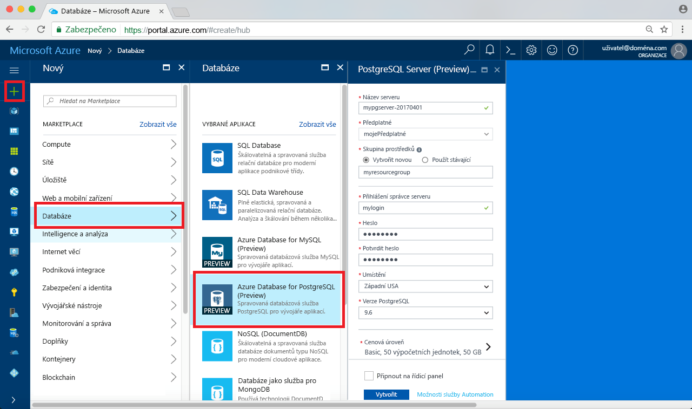
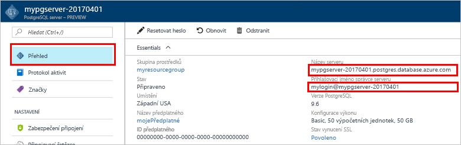

# <a name="design-your-first-azure-database-for-postgresql-using-hello-azure-portal"></a><span data-ttu-id="618d1-103">Navrhnout první databáze Azure pro PostgreSQL pomocí hello portálu Azure</span><span class="sxs-lookup"><span data-stu-id="618d1-103">Design your first Azure Database for PostgreSQL using hello Azure portal</span></span>

<span data-ttu-id="618d1-104">Azure databázi PostgreSQL je spravovaná služba, která vám umožní toorun, spravovat a škálování vysoce dostupné databáze PostgreSQL v cloudu hello.</span><span class="sxs-lookup"><span data-stu-id="618d1-104">Azure Database for PostgreSQL is a managed service that enables you toorun, manage, and scale highly available PostgreSQL databases in hello cloud.</span></span> <span data-ttu-id="618d1-105">Pomocí hello portálu Azure, můžete snadno spravovat váš server a návrhu databáze.</span><span class="sxs-lookup"><span data-stu-id="618d1-105">Using hello Azure portal, you can easily manage your server and design a database.</span></span>

<span data-ttu-id="618d1-106">V tomto kurzu použijete hello Azure portálu toolearn jak na:</span><span class="sxs-lookup"><span data-stu-id="618d1-106">In this tutorial, you use hello Azure portal toolearn how to:</span></span>
> [!div class="checklist"]
> * <span data-ttu-id="618d1-107">Vytvoření Azure Database for PostgreSQL</span><span class="sxs-lookup"><span data-stu-id="618d1-107">Create an Azure Database for PostgreSQL</span></span>
> * <span data-ttu-id="618d1-108">Konfigurace brány firewall serveru hello</span><span class="sxs-lookup"><span data-stu-id="618d1-108">Configure hello server firewall</span></span>
> * <span data-ttu-id="618d1-109">Použití [ **psql** ](https://www.postgresql.org/docs/9.6/static/app-psql.html) nástroj toocreate databáze</span><span class="sxs-lookup"><span data-stu-id="618d1-109">Use [**psql**](https://www.postgresql.org/docs/9.6/static/app-psql.html) utility toocreate a database</span></span>
> * <span data-ttu-id="618d1-110">Načíst ukázková data</span><span class="sxs-lookup"><span data-stu-id="618d1-110">Load sample data</span></span>
> * <span data-ttu-id="618d1-111">Dotazování dat</span><span class="sxs-lookup"><span data-stu-id="618d1-111">Query data</span></span>
> * <span data-ttu-id="618d1-112">Aktualizace dat</span><span class="sxs-lookup"><span data-stu-id="618d1-112">Update data</span></span>
> * <span data-ttu-id="618d1-113">Obnovení dat</span><span class="sxs-lookup"><span data-stu-id="618d1-113">Restore data</span></span>

## <a name="prerequisites"></a><span data-ttu-id="618d1-114">Požadavky</span><span class="sxs-lookup"><span data-stu-id="618d1-114">Prerequisites</span></span>
<span data-ttu-id="618d1-115">Pokud ještě nemáte předplatné Azure, vytvořte si [bezplatný účet](https://azure.microsoft.com/free/) před tím, než začnete.</span><span class="sxs-lookup"><span data-stu-id="618d1-115">If you don't have an Azure subscription, create a [free](https://azure.microsoft.com/free/) account before you begin.</span></span>

## <a name="log-in-toohello-azure-portal"></a><span data-ttu-id="618d1-116">Přihlaste se toohello portálu Azure</span><span class="sxs-lookup"><span data-stu-id="618d1-116">Log in toohello Azure portal</span></span>
<span data-ttu-id="618d1-117">Přihlaste se toohello [portál Azure](https://portal.azure.com).</span><span class="sxs-lookup"><span data-stu-id="618d1-117">Log in toohello [Azure portal](https://portal.azure.com).</span></span>

## <a name="create-an-azure-database-for-postgresql"></a><span data-ttu-id="618d1-118">Vytvoření Azure Database for PostgreSQL</span><span class="sxs-lookup"><span data-stu-id="618d1-118">Create an Azure Database for PostgreSQL</span></span>

<span data-ttu-id="618d1-119">Server Azure Database for PostgreSQL se vytvoří s definovanou sadou [výpočetních prostředků a prostředků úložiště](./concepts-compute-unit-and-storage.md).</span><span class="sxs-lookup"><span data-stu-id="618d1-119">An Azure Database for PostgreSQL server is created with a defined set of [compute and storage resources](./concepts-compute-unit-and-storage.md).</span></span> <span data-ttu-id="618d1-120">Hello server je vytvořen v rámci [skupina prostředků Azure](../azure-resource-manager/resource-group-overview.md).</span><span class="sxs-lookup"><span data-stu-id="618d1-120">hello server is created within an [Azure resource group](../azure-resource-manager/resource-group-overview.md).</span></span>

<span data-ttu-id="618d1-121">Postupujte podle těchto kroků toocreate databázi Azure pro PostgreSQL server:</span><span class="sxs-lookup"><span data-stu-id="618d1-121">Follow these steps toocreate an Azure Database for PostgreSQL server:</span></span>
1.  <span data-ttu-id="618d1-122">Klikněte na tlačítko hello **+ nový** nalezeno tlačítko na hello levém horním rohu hello portálu Azure.</span><span class="sxs-lookup"><span data-stu-id="618d1-122">Click hello **+ New**  button found on hello upper left-hand corner of hello Azure portal.</span></span>
2.  <span data-ttu-id="618d1-123">Vyberte **databáze** z hello **nový** a vyberte **databáze Azure pro PostgreSQL** z hello **databáze** stránky.</span><span class="sxs-lookup"><span data-stu-id="618d1-123">Select **Databases** from hello **New** page, and select **Azure Database for PostgreSQL** from hello **Databases** page.</span></span>
 <span data-ttu-id="618d1-124"></span><span class="sxs-lookup"><span data-stu-id="618d1-124"></span></span>

3.  <span data-ttu-id="618d1-125">Vyplňte hello nového serveru podrobnosti formuláře s hello následující informace, jak je znázorněno na hello předcházející bitové kopie:</span><span class="sxs-lookup"><span data-stu-id="618d1-125">Fill out hello new server details form with hello following information, as shown on hello preceding image:</span></span>
    - <span data-ttu-id="618d1-126">Název serveru: **mypgserver 20170401** (název serveru mapuje tooDNS název a je proto vyžaduje toobe globálně jedinečné)</span><span class="sxs-lookup"><span data-stu-id="618d1-126">Server name: **mypgserver-20170401** (name of a server maps tooDNS name and is thus required toobe globally unique)</span></span> 
    - <span data-ttu-id="618d1-127">Předplatné: Pokud máte více předplatných, vyberte příslušné předplatné hello, ve kterém hello prostředek neexistuje nebo se fakturuje pro.</span><span class="sxs-lookup"><span data-stu-id="618d1-127">Subscription: If you have multiple subscriptions, choose hello appropriate subscription in which hello resource exists or is billed for.</span></span>
    - <span data-ttu-id="618d1-128">Skupina prostředků: **myresourcegroup**</span><span class="sxs-lookup"><span data-stu-id="618d1-128">Resource group: **myresourcegroup**</span></span>
    - <span data-ttu-id="618d1-129">Přihlašovací jméno správce serveru a heslo dle vašeho výběru</span><span class="sxs-lookup"><span data-stu-id="618d1-129">Server admin login and password of your choice</span></span>
    - <span data-ttu-id="618d1-130">Umístění</span><span class="sxs-lookup"><span data-stu-id="618d1-130">Location</span></span>
    - <span data-ttu-id="618d1-131">Verze PostgreSQL</span><span class="sxs-lookup"><span data-stu-id="618d1-131">PostgreSQL Version</span></span>

  > [!IMPORTANT]
  > <span data-ttu-id="618d1-132">Hello přihlašovací jméno správce serveru a heslo, které tady zadáte jsou požadované toolog toohello serveru a její databáze dále v této úvodní.</span><span class="sxs-lookup"><span data-stu-id="618d1-132">hello server admin login and password that you specify here are required toolog in toohello server and its databases later in this quick start.</span></span> <span data-ttu-id="618d1-133">Tyto informace si zapamatujte nebo poznamenejte pro pozdější použití.</span><span class="sxs-lookup"><span data-stu-id="618d1-133">Remember or record this information for later use.</span></span>

4.  <span data-ttu-id="618d1-134">Klikněte na tlačítko **cenová úroveň** toospecify hello služby vrstvy a úroveň výkonu pro novou databázi.</span><span class="sxs-lookup"><span data-stu-id="618d1-134">Click **Pricing tier** toospecify hello service tier and performance level for your new database.</span></span> <span data-ttu-id="618d1-135">Pro tento rychlý start vyberte úroveň **Basic**, **50 výpočetních jednotek** a **50 GB** zahrnutého úložiště.</span><span class="sxs-lookup"><span data-stu-id="618d1-135">For this quick start, select **Basic** Tier, **50 Compute Units** and **50 GB** of included storage.</span></span>
 <span data-ttu-id="618d1-136"></span><span class="sxs-lookup"><span data-stu-id="618d1-136"></span></span>
5.  <span data-ttu-id="618d1-137">Klikněte na tlačítko **OK**.</span><span class="sxs-lookup"><span data-stu-id="618d1-137">Click **Ok**.</span></span>
6.  <span data-ttu-id="618d1-138">Klikněte na tlačítko **vytvořit** tooprovision hello serveru.</span><span class="sxs-lookup"><span data-stu-id="618d1-138">Click **Create** tooprovision hello server.</span></span> <span data-ttu-id="618d1-139">Zřizování trvá několik minut.</span><span class="sxs-lookup"><span data-stu-id="618d1-139">Provisioning takes a few minutes.</span></span>

  > [!TIP]
  > <span data-ttu-id="618d1-140">Zkontrolujte hello **Pin toodashboard** možnost tooallow snadné sledování vašich nasazení.</span><span class="sxs-lookup"><span data-stu-id="618d1-140">Check hello **Pin toodashboard** option tooallow easy tracking of your deployments.</span></span>

7.  <span data-ttu-id="618d1-141">Na panelu nástrojů hello, klikněte na tlačítko **oznámení** procesu nasazení toomonitor hello.</span><span class="sxs-lookup"><span data-stu-id="618d1-141">On hello toolbar, click **Notifications** toomonitor hello deployment process.</span></span>
 <span data-ttu-id="618d1-142"></span><span class="sxs-lookup"><span data-stu-id="618d1-142"></span></span>
   
  <span data-ttu-id="618d1-143">Ve výchozím nastavení se databáze **postgres** vytvoří v rámci vašeho serveru.</span><span class="sxs-lookup"><span data-stu-id="618d1-143">By default, **postgres** database gets created under your server.</span></span> <span data-ttu-id="618d1-144">Hello [postgres](https://www.postgresql.org/docs/9.6/static/app-initdb.html) databáze je výchozí databáze určené výhradně pro uživatele, nástroje a aplikace třetích stran.</span><span class="sxs-lookup"><span data-stu-id="618d1-144">hello [postgres](https://www.postgresql.org/docs/9.6/static/app-initdb.html) database is a default database meant for use by users, utilities, and third-party applications.</span></span> 

## <a name="configure-a-server-level-firewall-rule"></a><span data-ttu-id="618d1-145">Konfigurace pravidla brány firewall na úrovni serveru</span><span class="sxs-lookup"><span data-stu-id="618d1-145">Configure a server-level firewall rule</span></span>

<span data-ttu-id="618d1-146">Hello databáze Azure pro službu PostgreSQL vytvoří brána firewall na úrovni serveru hello.</span><span class="sxs-lookup"><span data-stu-id="618d1-146">hello Azure Database for PostgreSQL service creates a firewall at hello server-level.</span></span> <span data-ttu-id="618d1-147">Tato brána firewall brání externí aplikace a nástroje pro připojení serveru toohello a všechny databáze na serveru hello, pokud pravidlo brány firewall není vytvořená tooopen hello brány firewall pro konkrétní IP adresy.</span><span class="sxs-lookup"><span data-stu-id="618d1-147">This firewall prevents external applications and tools from connecting toohello server and any databases on hello server unless a firewall rule is created tooopen hello firewall for specific IP addresses.</span></span> 

1.  <span data-ttu-id="618d1-148">Po dokončení hello nasazení, klikněte na tlačítko **všechny prostředky** z nabídky na levé straně hello a zadejte název hello **mypgserver 20170401** toosearch pro nově vytvořený server.</span><span class="sxs-lookup"><span data-stu-id="618d1-148">After hello deployment completes, click **All Resources** from hello left-hand menu and type in hello name **mypgserver-20170401** toosearch for your newly created server.</span></span> <span data-ttu-id="618d1-149">Klikněte na název serveru hello uvedené v výsledek hledání hello.</span><span class="sxs-lookup"><span data-stu-id="618d1-149">Click hello server name listed in hello search result.</span></span> <span data-ttu-id="618d1-150">Hello **přehled** stránky pro váš server otevře a poskytuje možnosti pro další konfiguraci.</span><span class="sxs-lookup"><span data-stu-id="618d1-150">hello **Overview** page for your server opens and provides options for further configuration.</span></span>
 
 

2.  <span data-ttu-id="618d1-152">V okně hello serveru, vyberte **zabezpečení připojení**.</span><span class="sxs-lookup"><span data-stu-id="618d1-152">In hello server blade, select **Connection Security**.</span></span> 
3.  <span data-ttu-id="618d1-153">Klikněte do textového pole hello **název pravidla** a přidejte nové brány firewall pravidla toowhitelist hello rozsah IP adres pro připojení.</span><span class="sxs-lookup"><span data-stu-id="618d1-153">Click in hello text box under **Rule Name,** and add a new firewall rule toowhitelist hello IP range for connectivity.</span></span> <span data-ttu-id="618d1-154">V tomto kurzu budeme povolit všechny IP adresy a to zadáním **název pravidla = AllowAllIps**, **počáteční IP = 0.0.0.0** a **Koncová IP adresa = 255.255.255.255** a pak klikněte na tlačítko **uložit** .</span><span class="sxs-lookup"><span data-stu-id="618d1-154">For this tutorial, let's allow all IPs by typing in **Rule Name = AllowAllIps**, **Start IP = 0.0.0.0** and **End IP = 255.255.255.255** and then click **Save**.</span></span> <span data-ttu-id="618d1-155">Můžete nastavit pravidlo brány firewall, které pokrývá IP rozsah toobe tooconnect mít z vaší sítě.</span><span class="sxs-lookup"><span data-stu-id="618d1-155">You can set a firewall rule that covers an IP range toobe able tooconnect from your network.</span></span>
 
 

4.  <span data-ttu-id="618d1-157">Klikněte na tlačítko **Uložit** a pak klikněte na tlačítko hello **X** tooclose hello **zabezpečení připojení** stránky.</span><span class="sxs-lookup"><span data-stu-id="618d1-157">Click **Save** and then click hello **X** tooclose hello **Connections Security** page.</span></span>

  > [!NOTE]
  > <span data-ttu-id="618d1-158">Server Azure PostgreSQL komunikuje přes port 5432.</span><span class="sxs-lookup"><span data-stu-id="618d1-158">Azure PostgreSQL server communicates over port 5432.</span></span> <span data-ttu-id="618d1-159">Pokud se pokoušíte tooconnect z podnikové sítě, odchozí provoz přes port 5432 nemusí mít povolený bránou firewall vaší sítě.</span><span class="sxs-lookup"><span data-stu-id="618d1-159">If you are trying tooconnect from within a corporate network, outbound traffic over port 5432 may not be allowed by your network's firewall.</span></span> <span data-ttu-id="618d1-160">Pokud ano, nebudou se moct tooconnect serveru Azure SQL Database tooyour, dokud vaše IT oddělení otevře port 5432.</span><span class="sxs-lookup"><span data-stu-id="618d1-160">If so, you will not be able tooconnect tooyour Azure SQL Database server unless your IT department opens port 5432.</span></span>
  >


## <a name="get-hello-connection-information"></a><span data-ttu-id="618d1-161">Získat informace o připojení hello</span><span class="sxs-lookup"><span data-stu-id="618d1-161">Get hello connection information</span></span>

<span data-ttu-id="618d1-162">Pokud jsme vytvořili naše databáze Azure pro PostgreSQL server, hello výchozí **postgres** se vytvoří také databáze.</span><span class="sxs-lookup"><span data-stu-id="618d1-162">When we created our Azure Database for PostgreSQL server, hello default **postgres** database also gets created.</span></span> <span data-ttu-id="618d1-163">tooconnect tooyour databázový server, musíte tooprovide informace a přístup k přihlašovacím údajům hostitele.</span><span class="sxs-lookup"><span data-stu-id="618d1-163">tooconnect tooyour database server, you need tooprovide host information and access credentials.</span></span>

1. <span data-ttu-id="618d1-164">Hello levé nabídce na portálu Azure, klikněte na tlačítko **všechny prostředky** a vyhledejte hello serveru, kterou jste právě vytvořili **mypgserver 20170401**.</span><span class="sxs-lookup"><span data-stu-id="618d1-164">From hello left-hand menu in Azure portal, click **All resources** and search for hello server you just created **mypgserver-20170401**.</span></span>

  

3. <span data-ttu-id="618d1-166">Klikněte na název serveru hello **mypgserver 20170401**.</span><span class="sxs-lookup"><span data-stu-id="618d1-166">Click hello server name **mypgserver-20170401**.</span></span>
4. <span data-ttu-id="618d1-167">Vyberte hello serveru **přehled** stránky.</span><span class="sxs-lookup"><span data-stu-id="618d1-167">Select hello server's **Overview** page.</span></span> <span data-ttu-id="618d1-168">Poznamenejte si hello **název serveru** a **přihlašovací jméno pro Server správce**.</span><span class="sxs-lookup"><span data-stu-id="618d1-168">Make a note of hello **Server name** and **Server admin login name**.</span></span>

 


## <a name="connect-toopostgresql-database-using-psql-in-cloud-shell"></a><span data-ttu-id="618d1-170">Připojit databáze tooPostgreSQL pomocí psql v prostředí cloudu</span><span class="sxs-lookup"><span data-stu-id="618d1-170">Connect tooPostgreSQL database using psql in Cloud Shell</span></span>

<span data-ttu-id="618d1-171">Použijeme hello psql nástroj příkazového řádku tooconnect toohello databáze Azure nyní pro PostgreSQL server.</span><span class="sxs-lookup"><span data-stu-id="618d1-171">Let's now use hello psql command-line utility tooconnect toohello Azure Database for PostgreSQL server.</span></span> 
1. <span data-ttu-id="618d1-172">Spusťte hello prostředí cloudu Azure prostřednictvím terminálu ikonu hello v horním navigačním podokně hello.</span><span class="sxs-lookup"><span data-stu-id="618d1-172">Launch hello Azure Cloud Shell via hello terminal icon on hello top navigation pane.</span></span>

   

2. <span data-ttu-id="618d1-174">Otevře se v prohlížeči, takže se budete tootype bash příkazy Hello prostředí cloudu Azure.</span><span class="sxs-lookup"><span data-stu-id="618d1-174">hello Azure Cloud Shell opens in your browser, enabling you tootype bash commands.</span></span>

   

3. <span data-ttu-id="618d1-176">Na příkazovém řádku prostředí cloudu hello připojte tooyour Azure databáze pro server PostgreSQL pomocí příkazů psql hello.</span><span class="sxs-lookup"><span data-stu-id="618d1-176">At hello Cloud Shell prompt, connect tooyour Azure Database for PostgreSQL server using hello psql commands.</span></span> <span data-ttu-id="618d1-177">Hello následující formát je použité tooconnect tooan Azure databáze pro server PostgreSQL s hello [psql](https://www.postgresql.org/docs/9.6/static/app-psql.html) nástroj:</span><span class="sxs-lookup"><span data-stu-id="618d1-177">hello following format is used tooconnect tooan Azure Database for PostgreSQL server with hello [psql](https://www.postgresql.org/docs/9.6/static/app-psql.html) utility:</span></span>
   ```bash
   psql --host=<myserver> --port=<port> --username=<server admin login> --dbname=<database name>
   ```

   <span data-ttu-id="618d1-178">Například následující příkaz hello připojuje toohello výchozí databázi, která je volána **postgres** na vašem serveru PostgreSQL **mypgserver 20170401.postgres.database.azure.com** pomocí přihlašovacích údajů k přístupu.</span><span class="sxs-lookup"><span data-stu-id="618d1-178">For example, hello following command connects toohello default database called **postgres** on your PostgreSQL server **mypgserver-20170401.postgres.database.azure.com** using access credentials.</span></span> <span data-ttu-id="618d1-179">Po zobrazení výzvy zadejte heslo správce serveru.</span><span class="sxs-lookup"><span data-stu-id="618d1-179">Enter your server admin password when prompted.</span></span>

   ```bash
   psql --host=mypgserver-20170401.postgres.database.azure.com --port=5432 --username=mylogin@mypgserver-20170401 --dbname=postgres
   ```

## <a name="create-a-new-database"></a><span data-ttu-id="618d1-180">Vytvoření nové databáze</span><span class="sxs-lookup"><span data-stu-id="618d1-180">Create a New Database</span></span>
<span data-ttu-id="618d1-181">Jakmile jste server připojený toohello, vytvořte prázdnou databázi hello příkazového řádku.</span><span class="sxs-lookup"><span data-stu-id="618d1-181">Once you're connected toohello server, create a blank database at hello prompt.</span></span>
```bash
CREATE DATABASE mypgsqldb;
```

<span data-ttu-id="618d1-182">Na příkazovém řádku hello spustit následující příkaz tooswitch připojení toohello nově vytvořený databáze hello **mypgsqldb**.</span><span class="sxs-lookup"><span data-stu-id="618d1-182">At hello prompt, execute hello following command tooswitch connection toohello newly created database **mypgsqldb**.</span></span>
```bash
\c mypgsqldb
```
## <a name="create-tables-in-hello-database"></a><span data-ttu-id="618d1-183">Vytváření tabulek v databázi hello</span><span class="sxs-lookup"><span data-stu-id="618d1-183">Create tables in hello database</span></span>
<span data-ttu-id="618d1-184">Teď, když víte, jak tooconnect toohello databáze Azure pro PostgreSQL, jsme můžete projít postupy toocomplete některé základní úlohy.</span><span class="sxs-lookup"><span data-stu-id="618d1-184">Now that you know how tooconnect toohello Azure Database for PostgreSQL, we can go over how toocomplete some basic tasks.</span></span>

<span data-ttu-id="618d1-185">Jsme nejprve vytvořit tabulku a načíst určitými daty.</span><span class="sxs-lookup"><span data-stu-id="618d1-185">First, we can create a table and load it with some data.</span></span> <span data-ttu-id="618d1-186">Umožňuje vytvořit tabulku, která sleduje informace o inventáři.</span><span class="sxs-lookup"><span data-stu-id="618d1-186">Let's create a table that tracks inventory information.</span></span>
```sql
CREATE TABLE inventory (
    id serial PRIMARY KEY, 
    name VARCHAR(50), 
    quantity INTEGER
);
```

<span data-ttu-id="618d1-187">Můžete zjistit hello nově vytvořený tabulky v seznamu hello tabvles nyní zadáním:</span><span class="sxs-lookup"><span data-stu-id="618d1-187">You can see hello newly created table in hello list of tabvles now by typing:</span></span>
```sql
\dt
```

## <a name="load-data-into-hello-tables"></a><span data-ttu-id="618d1-188">Načtení dat do tabulky hello</span><span class="sxs-lookup"><span data-stu-id="618d1-188">Load data into hello tables</span></span>
<span data-ttu-id="618d1-189">Teď, když máme tabulku, jsme do něj vložte některá data.</span><span class="sxs-lookup"><span data-stu-id="618d1-189">Now that we have a table, we can insert some data into it.</span></span> <span data-ttu-id="618d1-190">V okně spusťte příkazový řádek text hello spusťte následující dotaz tooinsert hello některé řádky dat.</span><span class="sxs-lookup"><span data-stu-id="618d1-190">At hello open command prompt window, run hello following query tooinsert some rows of data</span></span>
```sql
INSERT INTO inventory (id, name, quantity) VALUES (1, 'banana', 150); 
INSERT INTO inventory (id, name, quantity) VALUES (2, 'orange', 154);
```

<span data-ttu-id="618d1-191">Máte nyní dva řádky ukázková data do hello tabulky, které jste vytvořili dříve.</span><span class="sxs-lookup"><span data-stu-id="618d1-191">You have now two rows of sample data into hello table you created earlier.</span></span>

## <a name="query-and-update-hello-data-in-hello-tables"></a><span data-ttu-id="618d1-192">Dotazování a aktualizovat hello data v tabulkách hello</span><span class="sxs-lookup"><span data-stu-id="618d1-192">Query and update hello data in hello tables</span></span>
<span data-ttu-id="618d1-193">Spusťte následující dotaz tooretrieve informace z tabulky databáze hello hello.</span><span class="sxs-lookup"><span data-stu-id="618d1-193">Execute hello following query tooretrieve information from hello database table.</span></span> 
```sql
SELECT * FROM inventory;
```

<span data-ttu-id="618d1-194">Můžete také aktualizovat hello data v tabulkách hello</span><span class="sxs-lookup"><span data-stu-id="618d1-194">You can also update hello data in hello tables</span></span>
```sql
UPDATE inventory SET quantity = 200 WHERE name = 'banana';
```

<span data-ttu-id="618d1-195">Při načítání dat, získá Hello řádek příslušným způsobem aktualizuje.</span><span class="sxs-lookup"><span data-stu-id="618d1-195">hello row gets updated accordingly when you retrieve data.</span></span>
```sql
SELECT * FROM inventory;
```

## <a name="restore-data-tooa-previous-point-in-time"></a><span data-ttu-id="618d1-196">Obnovení dat tooa předchozího bodu v čase</span><span class="sxs-lookup"><span data-stu-id="618d1-196">Restore data tooa previous point in time</span></span>
<span data-ttu-id="618d1-197">Představte si, že jste omylem odstranili této tabulky.</span><span class="sxs-lookup"><span data-stu-id="618d1-197">Imagine you have accidentally deleted this table.</span></span> <span data-ttu-id="618d1-198">Tato situace je něco, které nelze snadno obnovit z.</span><span class="sxs-lookup"><span data-stu-id="618d1-198">This situation is something you cannot easily recover from.</span></span> <span data-ttu-id="618d1-199">Azure databázi PostgreSQL vám umožní toogo back tooany bodu v čase (v hello poslední too7 dní (Basic) a 35 dní (standardní)) a obnovit tento nový server tooa bodu v čase.</span><span class="sxs-lookup"><span data-stu-id="618d1-199">Azure Database for PostgreSQL allows you toogo back tooany point-in-time (in hello last up too7 days (Basic) and 35 days (Standard)) and restore this point-in-time tooa new server.</span></span> <span data-ttu-id="618d1-200">Můžete použít tento nový server toorecover odstraněná data.</span><span class="sxs-lookup"><span data-stu-id="618d1-200">You can use this new server toorecover your deleted data.</span></span> <span data-ttu-id="618d1-201">Následující kroky obnovení hello ukázkový server tooa bod před přidáním tabulky hello Hello.</span><span class="sxs-lookup"><span data-stu-id="618d1-201">hello following steps restore hello sample server tooa point before hello table was added.</span></span>

1.  <span data-ttu-id="618d1-202">V databázi Azure hello PostgreSQL stránka serveru, klikněte na tlačítko **obnovení** na panelu nástrojů hello.</span><span class="sxs-lookup"><span data-stu-id="618d1-202">On hello Azure Database for PostgreSQL page for your server, click **Restore** on hello toolbar.</span></span> <span data-ttu-id="618d1-203">Hello **obnovení** otevře se stránka.</span><span class="sxs-lookup"><span data-stu-id="618d1-203">hello **Restore** page opens.</span></span>
  <span data-ttu-id="618d1-204"></span><span class="sxs-lookup"><span data-stu-id="618d1-204"></span></span>
2.  <span data-ttu-id="618d1-205">Vyplňte hello **obnovení** formulář hello požadované informace:</span><span class="sxs-lookup"><span data-stu-id="618d1-205">Fill out hello **Restore** form with hello required information:</span></span>

  
  - <span data-ttu-id="618d1-207">**Bod obnovení**: Vyberte bodu v čase, k níž dojde před hello server byl změněn</span><span class="sxs-lookup"><span data-stu-id="618d1-207">**Restore point**: Select a point-in-time that occurs before hello server was changed</span></span>
  - <span data-ttu-id="618d1-208">**Cílový server**: Zadejte nový název serveru, který chcete toorestore k</span><span class="sxs-lookup"><span data-stu-id="618d1-208">**Target server**: Provide a new server name you want toorestore to</span></span>
  - <span data-ttu-id="618d1-209">**Umístění**: nelze vybrat hello oblast, ve výchozím nastavení je stejný jako zdrojový server hello</span><span class="sxs-lookup"><span data-stu-id="618d1-209">**Location**: You cannot select hello region, by default it is same as hello source server</span></span>
  - <span data-ttu-id="618d1-210">**Cenová úroveň**: tuto hodnotu nelze změnit, při obnovení serveru.</span><span class="sxs-lookup"><span data-stu-id="618d1-210">**Pricing tier**: You cannot change this value when restoring a server.</span></span> <span data-ttu-id="618d1-211">Je stejný jako zdrojový server hello.</span><span class="sxs-lookup"><span data-stu-id="618d1-211">It is same as hello source server.</span></span> 
3.  <span data-ttu-id="618d1-212">Klikněte na tlačítko **OK** toorestore hello serveru příliš[obnovení tooa v daném okamžiku](./howto-restore-server-portal.md) před hello tabulky byla odstraněna.</span><span class="sxs-lookup"><span data-stu-id="618d1-212">Click **OK** toorestore hello server too[restore tooa point-in-time](./howto-restore-server-portal.md) before hello tables was deleted.</span></span> <span data-ttu-id="618d1-213">Obnovení do serveru tooa jiného bodu v čase vytvoří duplicitní nový server jako původní server hello hello bodu v čase, zadáte, za předpokladu, že je v rámci hello dobu uchování vašeho [vrstvy služby](./concepts-service-tiers.md).</span><span class="sxs-lookup"><span data-stu-id="618d1-213">Restoring a server tooa different point in time creates a duplicate new server as hello original server as of hello point in time you specify, provided that it is within hello retention period for your [service tier](./concepts-service-tiers.md).</span></span>

## <a name="next-steps"></a><span data-ttu-id="618d1-214">Další kroky</span><span class="sxs-lookup"><span data-stu-id="618d1-214">Next Steps</span></span>
<span data-ttu-id="618d1-215">V tomto kurzu jste se dozvěděli, jak toouse hello portál Azure a další nástroje pro:</span><span class="sxs-lookup"><span data-stu-id="618d1-215">In this tutorial, you learned how toouse hello Azure portal and other utilities to:</span></span>
> [!div class="checklist"]
> * <span data-ttu-id="618d1-216">Vytvoření Azure Database for PostgreSQL</span><span class="sxs-lookup"><span data-stu-id="618d1-216">Create an Azure Database for PostgreSQL</span></span>
> * <span data-ttu-id="618d1-217">Konfigurace brány firewall serveru hello</span><span class="sxs-lookup"><span data-stu-id="618d1-217">Configure hello server firewall</span></span>
> * <span data-ttu-id="618d1-218">Použití [ **psql** ](https://www.postgresql.org/docs/9.6/static/app-psql.html) nástroj toocreate databáze</span><span class="sxs-lookup"><span data-stu-id="618d1-218">Use [**psql**](https://www.postgresql.org/docs/9.6/static/app-psql.html) utility toocreate a database</span></span>
> * <span data-ttu-id="618d1-219">Načíst ukázková data</span><span class="sxs-lookup"><span data-stu-id="618d1-219">Load sample data</span></span>
> * <span data-ttu-id="618d1-220">Dotazování dat</span><span class="sxs-lookup"><span data-stu-id="618d1-220">Query data</span></span>
> * <span data-ttu-id="618d1-221">Aktualizace dat</span><span class="sxs-lookup"><span data-stu-id="618d1-221">Update data</span></span>
> * <span data-ttu-id="618d1-222">Obnovení dat</span><span class="sxs-lookup"><span data-stu-id="618d1-222">Restore data</span></span>

<span data-ttu-id="618d1-223">Dále se naučíte, jak toouse rozhraní příkazového řádku Azure toodo podobných úloh, zkontrolujte v tomto kurzu: [navrhnout první databáze Azure pro PostgreSQL pomocí rozhraní příkazového řádku Azure](tutorial-design-database-using-azure-cli.md)</span><span class="sxs-lookup"><span data-stu-id="618d1-223">Next, learn how toouse Azure CLI toodo similar tasks, review this tutorial: [Design your first Azure Database for PostgreSQL using Azure CLI](tutorial-design-database-using-azure-cli.md)</span></span>
