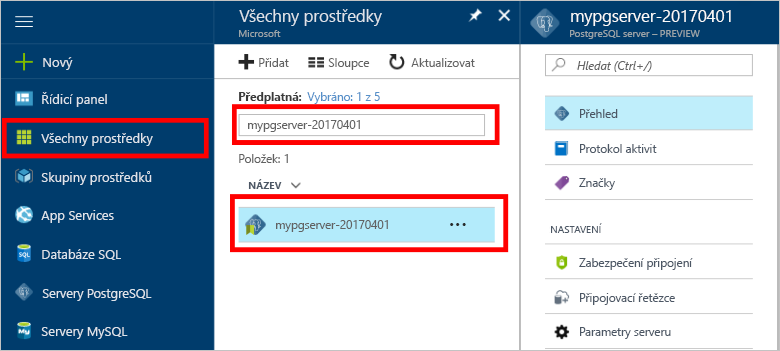

# <a name="design-your-first-azure-database-for-postgresql-using-hello-azure-portal"></a>Navrhnout první databáze Azure pro PostgreSQL pomocí hello portálu Azure

Azure databázi PostgreSQL je spravovaná služba, která vám umožní toorun, spravovat a škálování vysoce dostupné databáze PostgreSQL v cloudu hello. Pomocí hello portálu Azure, můžete snadno spravovat váš server a návrhu databáze.

V tomto kurzu použijete hello Azure portálu toolearn jak na:
> [!div class="checklist"]
> * Vytvoření Azure Database for PostgreSQL
> * Konfigurace brány firewall serveru hello
> * Použití [ **psql** ](https://www.postgresql.org/docs/9.6/static/app-psql.html) nástroj toocreate databáze
> * Načíst ukázková data
> * Dotazování dat
> * Aktualizace dat
> * Obnovení dat

## <a name="prerequisites"></a>Požadavky
Pokud ještě nemáte předplatné Azure, vytvořte si [bezplatný účet](https://azure.microsoft.com/free/) před tím, než začnete.

## <a name="log-in-toohello-azure-portal"></a>Přihlaste se toohello portálu Azure
Přihlaste se toohello [portál Azure](https://portal.azure.com).

## <a name="create-an-azure-database-for-postgresql"></a>Vytvoření Azure Database for PostgreSQL

Server Azure Database for PostgreSQL se vytvoří s definovanou sadou [výpočetních prostředků a prostředků úložiště](./concepts-compute-unit-and-storage.md). Hello server je vytvořen v rámci [skupina prostředků Azure](../azure-resource-manager/resource-group-overview.md).

Postupujte podle těchto kroků toocreate databázi Azure pro PostgreSQL server:
1.  Klikněte na tlačítko hello **+ nový** nalezeno tlačítko na hello levém horním rohu hello portálu Azure.
2.  Vyberte **databáze** z hello **nový** a vyberte **databáze Azure pro PostgreSQL** z hello **databáze** stránky.
 

3.  Vyplňte hello nového serveru podrobnosti formuláře s hello následující informace, jak je znázorněno na hello předcházející bitové kopie:
    - Název serveru: **mypgserver 20170401** (název serveru mapuje tooDNS název a je proto vyžaduje toobe globálně jedinečné) 
    - Předplatné: Pokud máte více předplatných, vyberte příslušné předplatné hello, ve kterém hello prostředek neexistuje nebo se fakturuje pro.
    - Skupina prostředků: **myresourcegroup**
    - Přihlašovací jméno správce serveru a heslo dle vašeho výběru
    - Umístění
    - Verze PostgreSQL

  > [!IMPORTANT]
  > Hello přihlašovací jméno správce serveru a heslo, které tady zadáte jsou požadované toolog toohello serveru a její databáze dále v této úvodní. Tyto informace si zapamatujte nebo poznamenejte pro pozdější použití.

4.  Klikněte na tlačítko **cenová úroveň** toospecify hello služby vrstvy a úroveň výkonu pro novou databázi. Pro tento rychlý start vyberte úroveň **Basic**, **50 výpočetních jednotek** a **50 GB** zahrnutého úložiště.
 
5.  Klikněte na tlačítko **OK**.
6.  Klikněte na tlačítko **vytvořit** tooprovision hello serveru. Zřizování trvá několik minut.

  > [!TIP]
  > Zkontrolujte hello **Pin toodashboard** možnost tooallow snadné sledování vašich nasazení.

7.  Na panelu nástrojů hello, klikněte na tlačítko **oznámení** procesu nasazení toomonitor hello.
 
   
  Ve výchozím nastavení se databáze **postgres** vytvoří v rámci vašeho serveru. Hello [postgres](https://www.postgresql.org/docs/9.6/static/app-initdb.html) databáze je výchozí databáze určené výhradně pro uživatele, nástroje a aplikace třetích stran. 

## <a name="configure-a-server-level-firewall-rule"></a>Konfigurace pravidla brány firewall na úrovni serveru

Hello databáze Azure pro službu PostgreSQL vytvoří brána firewall na úrovni serveru hello. Tato brána firewall brání externí aplikace a nástroje pro připojení serveru toohello a všechny databáze na serveru hello, pokud pravidlo brány firewall není vytvořená tooopen hello brány firewall pro konkrétní IP adresy. 

1.  Po dokončení hello nasazení, klikněte na tlačítko **všechny prostředky** z nabídky na levé straně hello a zadejte název hello **mypgserver 20170401** toosearch pro nově vytvořený server. Klikněte na název serveru hello uvedené v výsledek hledání hello. Hello **přehled** stránky pro váš server otevře a poskytuje možnosti pro další konfiguraci.
 
 

2.  V okně hello serveru, vyberte **zabezpečení připojení**. 
3.  Klikněte do textového pole hello **název pravidla** a přidejte nové brány firewall pravidla toowhitelist hello rozsah IP adres pro připojení. V tomto kurzu budeme povolit všechny IP adresy a to zadáním **název pravidla = AllowAllIps**, **počáteční IP = 0.0.0.0** a **Koncová IP adresa = 255.255.255.255** a pak klikněte na tlačítko **uložit** . Můžete nastavit pravidlo brány firewall, které pokrývá IP rozsah toobe tooconnect mít z vaší sítě.
 
 

4.  Klikněte na tlačítko **Uložit** a pak klikněte na tlačítko hello **X** tooclose hello **zabezpečení připojení** stránky.

  > [!NOTE]
  > Server Azure PostgreSQL komunikuje přes port 5432. Pokud se pokoušíte tooconnect z podnikové sítě, odchozí provoz přes port 5432 nemusí mít povolený bránou firewall vaší sítě. Pokud ano, nebudou se moct tooconnect serveru Azure SQL Database tooyour, dokud vaše IT oddělení otevře port 5432.
  >


## <a name="get-hello-connection-information"></a>Získat informace o připojení hello

Pokud jsme vytvořili naše databáze Azure pro PostgreSQL server, hello výchozí **postgres** se vytvoří také databáze. tooconnect tooyour databázový server, musíte tooprovide informace a přístup k přihlašovacím údajům hostitele.

1. Hello levé nabídce na portálu Azure, klikněte na tlačítko **všechny prostředky** a vyhledejte hello serveru, kterou jste právě vytvořili **mypgserver 20170401**.

  

3. Klikněte na název serveru hello **mypgserver 20170401**.
4. Vyberte hello serveru **přehled** stránky. Poznamenejte si hello **název serveru** a **přihlašovací jméno pro Server správce**.

 


## <a name="connect-toopostgresql-database-using-psql-in-cloud-shell"></a>Připojit databáze tooPostgreSQL pomocí psql v prostředí cloudu

Použijeme hello psql nástroj příkazového řádku tooconnect toohello databáze Azure nyní pro PostgreSQL server. 
1. Spusťte hello prostředí cloudu Azure prostřednictvím terminálu ikonu hello v horním navigačním podokně hello.

   

2. Otevře se v prohlížeči, takže se budete tootype bash příkazy Hello prostředí cloudu Azure.

   

3. Na příkazovém řádku prostředí cloudu hello připojte tooyour Azure databáze pro server PostgreSQL pomocí příkazů psql hello. Hello následující formát je použité tooconnect tooan Azure databáze pro server PostgreSQL s hello [psql](https://www.postgresql.org/docs/9.6/static/app-psql.html) nástroj:
   ```bash
   psql --host=<myserver> --port=<port> --username=<server admin login> --dbname=<database name>
   ```

   Například následující příkaz hello připojuje toohello výchozí databázi, která je volána **postgres** na vašem serveru PostgreSQL **mypgserver 20170401.postgres.database.azure.com** pomocí přihlašovacích údajů k přístupu. Po zobrazení výzvy zadejte heslo správce serveru.

   ```bash
   psql --host=mypgserver-20170401.postgres.database.azure.com --port=5432 --username=mylogin@mypgserver-20170401 --dbname=postgres
   ```

## <a name="create-a-new-database"></a>Vytvoření nové databáze
Jakmile jste server připojený toohello, vytvořte prázdnou databázi hello příkazového řádku.
```bash
CREATE DATABASE mypgsqldb;
```

Na příkazovém řádku hello spustit následující příkaz tooswitch připojení toohello nově vytvořený databáze hello **mypgsqldb**.
```bash
\c mypgsqldb
```
## <a name="create-tables-in-hello-database"></a>Vytváření tabulek v databázi hello
Teď, když víte, jak tooconnect toohello databáze Azure pro PostgreSQL, jsme můžete projít postupy toocomplete některé základní úlohy.

Jsme nejprve vytvořit tabulku a načíst určitými daty. Umožňuje vytvořit tabulku, která sleduje informace o inventáři.
```sql
CREATE TABLE inventory (
    id serial PRIMARY KEY, 
    name VARCHAR(50), 
    quantity INTEGER
);
```

Můžete zjistit hello nově vytvořený tabulky v seznamu hello tabvles nyní zadáním:
```sql
\dt
```

## <a name="load-data-into-hello-tables"></a>Načtení dat do tabulky hello
Teď, když máme tabulku, jsme do něj vložte některá data. V okně spusťte příkazový řádek text hello spusťte následující dotaz tooinsert hello některé řádky dat.
```sql
INSERT INTO inventory (id, name, quantity) VALUES (1, 'banana', 150); 
INSERT INTO inventory (id, name, quantity) VALUES (2, 'orange', 154);
```

Máte nyní dva řádky ukázková data do hello tabulky, které jste vytvořili dříve.

## <a name="query-and-update-hello-data-in-hello-tables"></a>Dotazování a aktualizovat hello data v tabulkách hello
Spusťte následující dotaz tooretrieve informace z tabulky databáze hello hello. 
```sql
SELECT * FROM inventory;
```

Můžete také aktualizovat hello data v tabulkách hello
```sql
UPDATE inventory SET quantity = 200 WHERE name = 'banana';
```

Při načítání dat, získá Hello řádek příslušným způsobem aktualizuje.
```sql
SELECT * FROM inventory;
```

## <a name="restore-data-tooa-previous-point-in-time"></a>Obnovení dat tooa předchozího bodu v čase
Představte si, že jste omylem odstranili této tabulky. Tato situace je něco, které nelze snadno obnovit z. Azure databázi PostgreSQL vám umožní toogo back tooany bodu v čase (v hello poslední too7 dní (Basic) a 35 dní (standardní)) a obnovit tento nový server tooa bodu v čase. Můžete použít tento nový server toorecover odstraněná data. Následující kroky obnovení hello ukázkový server tooa bod před přidáním tabulky hello Hello.

1.  V databázi Azure hello PostgreSQL stránka serveru, klikněte na tlačítko **obnovení** na panelu nástrojů hello. Hello **obnovení** otevře se stránka.
  
2.  Vyplňte hello **obnovení** formulář hello požadované informace:

  
  - **Bod obnovení**: Vyberte bodu v čase, k níž dojde před hello server byl změněn
  - **Cílový server**: Zadejte nový název serveru, který chcete toorestore k
  - **Umístění**: nelze vybrat hello oblast, ve výchozím nastavení je stejný jako zdrojový server hello
  - **Cenová úroveň**: tuto hodnotu nelze změnit, při obnovení serveru. Je stejný jako zdrojový server hello. 
3.  Klikněte na tlačítko **OK** toorestore hello serveru příliš[obnovení tooa v daném okamžiku](./howto-restore-server-portal.md) před hello tabulky byla odstraněna. Obnovení do serveru tooa jiného bodu v čase vytvoří duplicitní nový server jako původní server hello hello bodu v čase, zadáte, za předpokladu, že je v rámci hello dobu uchování vašeho [vrstvy služby](./concepts-service-tiers.md).

## <a name="next-steps"></a>Další kroky
V tomto kurzu jste se dozvěděli, jak toouse hello portál Azure a další nástroje pro:
> [!div class="checklist"]
> * Vytvoření Azure Database for PostgreSQL
> * Konfigurace brány firewall serveru hello
> * Použití [ **psql** ](https://www.postgresql.org/docs/9.6/static/app-psql.html) nástroj toocreate databáze
> * Načíst ukázková data
> * Dotazování dat
> * Aktualizace dat
> * Obnovení dat

Dále se naučíte, jak toouse rozhraní příkazového řádku Azure toodo podobných úloh, zkontrolujte v tomto kurzu: [navrhnout první databáze Azure pro PostgreSQL pomocí rozhraní příkazového řádku Azure](tutorial-design-database-using-azure-cli.md)
