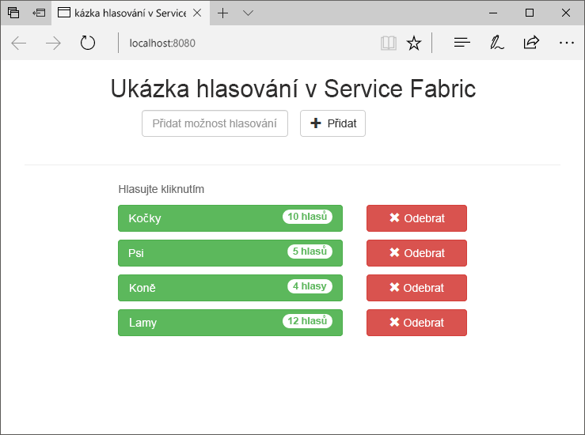
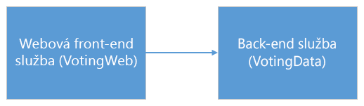
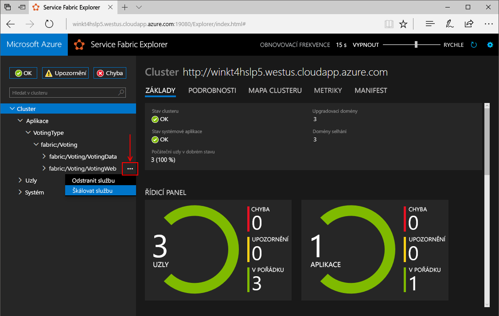
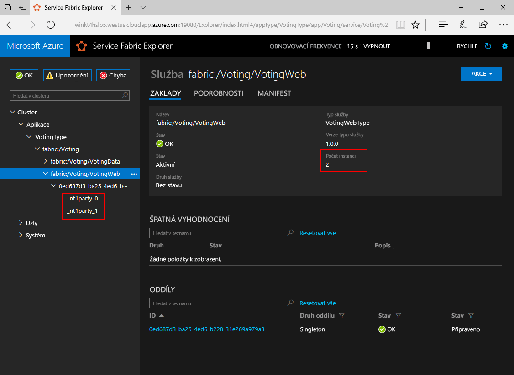
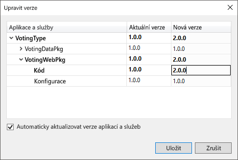
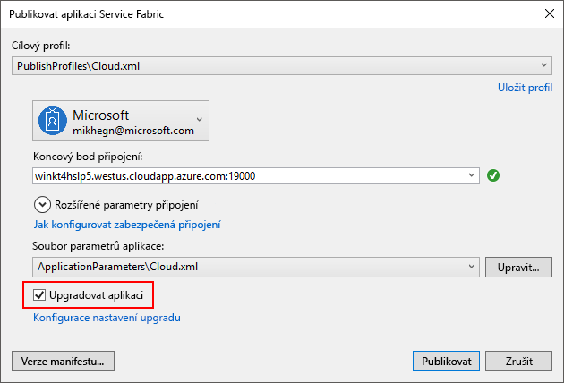
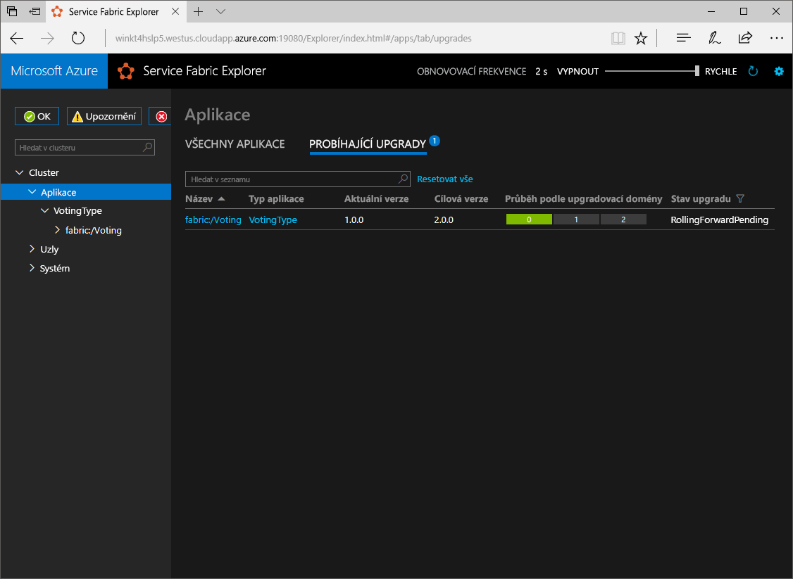

# <a name="create-a-net-service-fabric-application-in-azure"></a><span data-ttu-id="2504f-103">Vytvoření aplikace .NET Service Fabric v Azure</span><span class="sxs-lookup"><span data-stu-id="2504f-103">Create a .NET Service Fabric application in Azure</span></span>
<span data-ttu-id="2504f-104">Azure Service Fabric je platforma distribuovaných systémů pro nasazování a správu škálovatelných a spolehlivých mikroslužeb a kontejnerů.</span><span class="sxs-lookup"><span data-stu-id="2504f-104">Azure Service Fabric is a distributed systems platform for deploying and managing scalable and reliable microservices and containers.</span></span> 

<span data-ttu-id="2504f-105">Tento rychlý start ukazuje, jak toodeploy vaší první aplikace tooService .NET prostředků infrastruktury.</span><span class="sxs-lookup"><span data-stu-id="2504f-105">This quickstart shows how toodeploy your first .NET application tooService Fabric.</span></span> <span data-ttu-id="2504f-106">Jakmile budete hotovi, máte hlasovací aplikaci s ASP.NET Core web, který je front-end, který uloží výsledků hlasování ve stavové služby back-end v clusteru hello.</span><span class="sxs-lookup"><span data-stu-id="2504f-106">When you're finished, you have a voting application with an ASP.NET Core web front-end that saves voting results in a stateful back-end service in hello cluster.</span></span>



<span data-ttu-id="2504f-108">Pomocí této aplikace se dozvíte, jak:</span><span class="sxs-lookup"><span data-stu-id="2504f-108">Using this application you learn how to:</span></span>
> [!div class="checklist"]
> * <span data-ttu-id="2504f-109">Vytvoření aplikace pomocí rozhraní .NET a Service Fabric</span><span class="sxs-lookup"><span data-stu-id="2504f-109">Create an application using .NET and Service Fabric</span></span>
> * <span data-ttu-id="2504f-110">Pomocí ASP.NET core jako webového front-endu</span><span class="sxs-lookup"><span data-stu-id="2504f-110">Use ASP.NET core as a web front-end</span></span>
> * <span data-ttu-id="2504f-111">Ukládání dat aplikací ve stavové služby</span><span class="sxs-lookup"><span data-stu-id="2504f-111">Store application data in a stateful service</span></span>
> * <span data-ttu-id="2504f-112">Ladění aplikace místně</span><span class="sxs-lookup"><span data-stu-id="2504f-112">Debug your application locally</span></span>
> * <span data-ttu-id="2504f-113">Nasazení clusteru tooa hello aplikace v Azure</span><span class="sxs-lookup"><span data-stu-id="2504f-113">Deploy hello application tooa cluster in Azure</span></span>
> * <span data-ttu-id="2504f-114">Aplikace hello škálování mezi několika uzly</span><span class="sxs-lookup"><span data-stu-id="2504f-114">Scale-out hello application across multiple nodes</span></span>
> * <span data-ttu-id="2504f-115">Provedení postupného upgradu aplikace</span><span class="sxs-lookup"><span data-stu-id="2504f-115">Perform a rolling application upgrade</span></span>

## <a name="prerequisites"></a><span data-ttu-id="2504f-116">Požadavky</span><span class="sxs-lookup"><span data-stu-id="2504f-116">Prerequisites</span></span>
<span data-ttu-id="2504f-117">toocomplete tento rychlý start:</span><span class="sxs-lookup"><span data-stu-id="2504f-117">toocomplete this quickstart:</span></span>
1. <span data-ttu-id="2504f-118">[Nainstalovat Visual Studio 2017](https://www.visualstudio.com/) s hello **Azure development** a **ASP.NET a webové vývoj** úlohy.</span><span class="sxs-lookup"><span data-stu-id="2504f-118">[Install Visual Studio 2017](https://www.visualstudio.com/) with hello **Azure development** and **ASP.NET and web development** workloads.</span></span>
2. <span data-ttu-id="2504f-119">[Nainstalovat Git](https://git-scm.com/).</span><span class="sxs-lookup"><span data-stu-id="2504f-119">[Install Git](https://git-scm.com/)</span></span>
3. [<span data-ttu-id="2504f-120">Nainstalujte hello Microsoft Azure Service Fabric SDK</span><span class="sxs-lookup"><span data-stu-id="2504f-120">Install hello Microsoft Azure Service Fabric SDK</span></span>](http://www.microsoft.com/web/handlers/webpi.ashx?command=getinstallerredirect&appid=MicrosoftAzure-ServiceFabric-CoreSDK)
4. <span data-ttu-id="2504f-121">Spusťte následující příkaz tooenable Visual Studio toodeploy toohello místní cluster Service Fabric hello:</span><span class="sxs-lookup"><span data-stu-id="2504f-121">Run hello following command tooenable Visual Studio toodeploy toohello local Service Fabric cluster:</span></span>
    ```powershell
    Set-ExecutionPolicy -ExecutionPolicy Unrestricted -Force -Scope CurrentUser
    ```

## <a name="download-hello-sample"></a><span data-ttu-id="2504f-122">Stažení ukázky hello</span><span class="sxs-lookup"><span data-stu-id="2504f-122">Download hello sample</span></span>
<span data-ttu-id="2504f-123">V příkazovém okně spusťte následující příkaz tooclone hello ukázkové aplikace úložiště tooyour místního počítače hello.</span><span class="sxs-lookup"><span data-stu-id="2504f-123">In a command window, run hello following command tooclone hello sample app repository tooyour local machine.</span></span>
```
git clone https://github.com/Azure-Samples/service-fabric-dotnet-quickstart
```

## <a name="run-hello-application-locally"></a><span data-ttu-id="2504f-124">Místní spuštění aplikace hello</span><span class="sxs-lookup"><span data-stu-id="2504f-124">Run hello application locally</span></span>
<span data-ttu-id="2504f-125">Klikněte pravým tlačítkem na ikonu hello Visual Studio v nabídce Start hello a zvolte **spustit jako správce**.</span><span class="sxs-lookup"><span data-stu-id="2504f-125">Right-click hello Visual Studio icon in hello Start Menu and choose **Run as administrator**.</span></span> <span data-ttu-id="2504f-126">Pořadí tooattach hello ladicí program tooyour služby je nutné toorun Visual Studio jako správce.</span><span class="sxs-lookup"><span data-stu-id="2504f-126">In order tooattach hello debugger tooyour services, you need toorun Visual Studio as administrator.</span></span>

<span data-ttu-id="2504f-127">Otevřete hello **Voting.sln** řešení sady Visual Studio z hello úložiště, které jste naklonovali.</span><span class="sxs-lookup"><span data-stu-id="2504f-127">Open hello **Voting.sln** Visual Studio solution from hello repository you cloned.</span></span>

<span data-ttu-id="2504f-128">aplikace hello toodeploy, stiskněte klávesu **F5**.</span><span class="sxs-lookup"><span data-stu-id="2504f-128">toodeploy hello application, press **F5**.</span></span>

> [!NOTE]
> <span data-ttu-id="2504f-129">Hello poprvé spustíte a nasazení aplikace hello, Visual Studio vytvoří místní cluster pro ladění.</span><span class="sxs-lookup"><span data-stu-id="2504f-129">hello first time you run and deploy hello application, Visual Studio creates a local cluster for debugging.</span></span> <span data-ttu-id="2504f-130">Tato operace může chvíli trvat.</span><span class="sxs-lookup"><span data-stu-id="2504f-130">This operation may take some time.</span></span> <span data-ttu-id="2504f-131">Stav vytváření clusteru Hello se zobrazí v okně výstupu sady Visual Studio hello.</span><span class="sxs-lookup"><span data-stu-id="2504f-131">hello cluster creation status is displayed in hello Visual Studio output window.</span></span>

<span data-ttu-id="2504f-132">Po dokončení nasazení hello spustit prohlížeč a otevřete tuto stránku: `http://localhost:8080` -hello webového front-endu aplikace hello.</span><span class="sxs-lookup"><span data-stu-id="2504f-132">When hello deployment is complete, launch a browser and open this page: `http://localhost:8080` - hello web front-end of hello application.</span></span>


<span data-ttu-id="2504f-134">Teď můžete přidat sadu hlasovací tlačítka a spuštění trvá hlasy.</span><span class="sxs-lookup"><span data-stu-id="2504f-134">You can now add a set of voting options, and start taking votes.</span></span> <span data-ttu-id="2504f-135">Hello spouštět aplikace a ukládá všechna data v clusteru Service Fabric, bez nutnosti hello samostatné databáze.</span><span class="sxs-lookup"><span data-stu-id="2504f-135">hello application runs and stores all data in your Service Fabric cluster, without hello need for a separate database.</span></span>

## <a name="walk-through-hello-voting-sample-application"></a><span data-ttu-id="2504f-136">Provede hello hlasování ukázkové aplikace</span><span class="sxs-lookup"><span data-stu-id="2504f-136">Walk through hello voting sample application</span></span>
<span data-ttu-id="2504f-137">Hello hlasování aplikace se skládá ze dvou služeb:</span><span class="sxs-lookup"><span data-stu-id="2504f-137">hello voting application consists of two services:</span></span>
- <span data-ttu-id="2504f-138">Webová služba front-endu (VotingWeb) – ASP.NET Core webových front-endové služby, která obsluhuje hello webové stránky a zpřístupňuje rozhraní API toocommunicate s hello back-end službu.</span><span class="sxs-lookup"><span data-stu-id="2504f-138">Web front-end service (VotingWeb)- An ASP.NET Core web front-end service, which serves hello web page and exposes web APIs toocommunicate with hello backend service.</span></span>
- <span data-ttu-id="2504f-139">Služba back endu (VotingData)-ASP.NET Core webová služba, která zpřístupňuje rozhraní API toostore hello hlas výsledkem slovník spolehlivé trvalé na disku.</span><span class="sxs-lookup"><span data-stu-id="2504f-139">Back-end service (VotingData)- An ASP.NET Core web service, which exposes an API toostore hello vote results in a reliable dictionary persisted on disk.</span></span>



<span data-ttu-id="2504f-141">Když hlasovat v hello aplikace hello následující dojít k události:</span><span class="sxs-lookup"><span data-stu-id="2504f-141">When you vote in hello application hello following events occur:</span></span>
1. <span data-ttu-id="2504f-142">JavaScript odešle hello hlas požadavek toohello webové rozhraní API v hello webové front-endové služby jako požadavek HTTP PUT.</span><span class="sxs-lookup"><span data-stu-id="2504f-142">A JavaScript sends hello vote request toohello web API in hello web front-end service as an HTTP PUT request.</span></span>

2. <span data-ttu-id="2504f-143">front-end webové Hello používá proxy toolocate a předávat k službě back-end toohello požadavek HTTP PUT.</span><span class="sxs-lookup"><span data-stu-id="2504f-143">hello web front-end service uses a proxy toolocate and forward an HTTP PUT request toohello back-end service.</span></span>

3. <span data-ttu-id="2504f-144">Hello back endové službě trvá hello příchozího požadavku, a ukládá hello aktualizovat výsledek v spolehlivé slovník, který získá replikované toomultiple uzlů v clusteru hello a trvalé na disku.</span><span class="sxs-lookup"><span data-stu-id="2504f-144">hello back-end service takes hello incoming request, and stores hello updated result in a reliable dictionary, which gets replicated toomultiple nodes within hello cluster and persisted on disk.</span></span> <span data-ttu-id="2504f-145">Všechny aplikace hello data se ukládají v clusteru hello, takže se žádná databáze.</span><span class="sxs-lookup"><span data-stu-id="2504f-145">All hello application's data is stored in hello cluster, so no database is needed.</span></span>

## <a name="debug-in-visual-studio"></a><span data-ttu-id="2504f-146">Ladění v sadě Visual Studio</span><span class="sxs-lookup"><span data-stu-id="2504f-146">Debug in Visual Studio</span></span>
<span data-ttu-id="2504f-147">Při ladění aplikace v sadě Visual Studio, kterou používáte místní cluster Service Fabric vývoj.</span><span class="sxs-lookup"><span data-stu-id="2504f-147">When debugging application in Visual Studio, you are using a local Service Fabric development cluster.</span></span> <span data-ttu-id="2504f-148">Máte možnost tooadjust hello váš ladění tooyour scénář prostředí.</span><span class="sxs-lookup"><span data-stu-id="2504f-148">You have hello option tooadjust your debugging experience tooyour scenario.</span></span> <span data-ttu-id="2504f-149">V této aplikaci uložíme data v naší službě back-end pomocí slovník spolehlivé.</span><span class="sxs-lookup"><span data-stu-id="2504f-149">In this application, we store data in our back-end service, using a reliable dictionary.</span></span> <span data-ttu-id="2504f-150">Visual Studio odebere aplikaci hello za výchozí při zastavení ladicího programu hello.</span><span class="sxs-lookup"><span data-stu-id="2504f-150">Visual Studio removes hello application per default when you stop hello debugger.</span></span> <span data-ttu-id="2504f-151">Odebrání aplikace hello způsobí hello data hello back-end služby tooalso odeberou.</span><span class="sxs-lookup"><span data-stu-id="2504f-151">Removing hello application causes hello data in hello back-end service tooalso be removed.</span></span> <span data-ttu-id="2504f-152">toopersist hello data mezi relace ladění, můžete změnit hello **režim ladění aplikací** jako vlastnost na hello **Voting** projektu v sadě Visual Studio.</span><span class="sxs-lookup"><span data-stu-id="2504f-152">toopersist hello data between debugging sessions, you can change hello **Application Debug Mode** as a property on hello **Voting** project in Visual Studio.</span></span>

<span data-ttu-id="2504f-153">toolook na co se stane, že v kódu hello dokončení hello následující kroky:</span><span class="sxs-lookup"><span data-stu-id="2504f-153">toolook at what happens in hello code, complete hello following steps:</span></span>
1. <span data-ttu-id="2504f-154">Otevřete hello **VotesController.cs** souboru a nastavit zarážky v hello webové rozhraní API **Put** – metoda (řádku 47) – můžete vyhledat hello soubor v Průzkumníku řešení v sadě Visual Studio hello.</span><span class="sxs-lookup"><span data-stu-id="2504f-154">Open hello **VotesController.cs** file and set a breakpoint in hello web API's **Put** method (line 47) - You can search for hello file in hello Solution Explorer in Visual Studio.</span></span>

2. <span data-ttu-id="2504f-155">Otevřete hello **VoteDataController.cs** souboru a nastavit zarážky v tomto rozhraní web API **Put** – metoda (řádku 50).</span><span class="sxs-lookup"><span data-stu-id="2504f-155">Open hello **VoteDataController.cs** file and set a breakpoint in this web API's **Put** method (line 50).</span></span>

3. <span data-ttu-id="2504f-156">Vrátit toohello prohlížeče a klikněte na hlasování možnost nebo přidat novou možnost hlasování.</span><span class="sxs-lookup"><span data-stu-id="2504f-156">Go back toohello browser and click a voting option or add a new voting option.</span></span> <span data-ttu-id="2504f-157">Kliknutí na první zarážky hello do kontroleru hello webové front endové rozhraní api.</span><span class="sxs-lookup"><span data-stu-id="2504f-157">You hit hello first breakpoint in hello web front-end's api controller.</span></span>
    - <span data-ttu-id="2504f-158">Toto je, kde hello JavaScript v prohlížeči hello odešle řadič požadavek toohello webové rozhraní API v hello front-endové služby.</span><span class="sxs-lookup"><span data-stu-id="2504f-158">This is where hello JavaScript in hello browser sends a request toohello web API controller in hello front-end service.</span></span>
    
    

    - <span data-ttu-id="2504f-160">Nejprve jsme vytvořit adresu URL toohello hello ReverseProxy pro naši službu back-end **(1)**.</span><span class="sxs-lookup"><span data-stu-id="2504f-160">First we construct hello URL toohello ReverseProxy for our back-end service **(1)**.</span></span>
    - <span data-ttu-id="2504f-161">Potom pošleme hello požadavek HTTP PUT toohello ReverseProxy **(2)**.</span><span class="sxs-lookup"><span data-stu-id="2504f-161">Then we send hello HTTP PUT Request toohello ReverseProxy **(2)**.</span></span>
    - <span data-ttu-id="2504f-162">Nakonec hello vrátíme hello odpověď z klienta toohello back-end služby hello **(3)**.</span><span class="sxs-lookup"><span data-stu-id="2504f-162">Finally hello we return hello response from hello back-end service toohello client **(3)**.</span></span>

4. <span data-ttu-id="2504f-163">Stiskněte klávesu **F5** toocontinue</span><span class="sxs-lookup"><span data-stu-id="2504f-163">Press **F5** toocontinue</span></span>
    - <span data-ttu-id="2504f-164">Nyní jste na hello zarážce v hello back endové službě.</span><span class="sxs-lookup"><span data-stu-id="2504f-164">You are now at hello break point in hello back-end service.</span></span>
    
    

    - <span data-ttu-id="2504f-166">V prvním řádku hello hello metoda **(1)** používáme hello `StateManager` tooget nebo přidejte spolehlivé slovník nazývaný `counts`.</span><span class="sxs-lookup"><span data-stu-id="2504f-166">In hello first line in hello method **(1)** we are using hello `StateManager` tooget or add a reliable dictionary called `counts`.</span></span>
    - <span data-ttu-id="2504f-167">Všechny interakce s hodnotami ve slovníku spolehlivé vyžadují transakci, této konfigurace pomocí příkazu **(2)** vytvoří této transakce.</span><span class="sxs-lookup"><span data-stu-id="2504f-167">All interactions with values in a reliable dictionary require a transaction, this using statement **(2)** creates that transaction.</span></span>
    - <span data-ttu-id="2504f-168">V transakci hello jsme potom aktualizujte hodnotu hello hello relevantní klíče pro hello volíte možnost a potvrzení hello operaci **(3)**.</span><span class="sxs-lookup"><span data-stu-id="2504f-168">In hello transaction, we then update hello value of hello relevant key for hello voting option and commits hello operation **(3)**.</span></span> <span data-ttu-id="2504f-169">Po potvrzení hello metoda vrátí, hello dat ve slovníku hello k aktualizaci a replikované tooother uzly v clusteru hello.</span><span class="sxs-lookup"><span data-stu-id="2504f-169">Once hello commit method returns, hello data is updated in hello dictionary and replicated tooother nodes in hello cluster.</span></span> <span data-ttu-id="2504f-170">Hello data jsou nyní bezpečně uložena v clusteru hello a hello back-end služby při selhání tooother uzly, i nadále s hello data k dispozici.</span><span class="sxs-lookup"><span data-stu-id="2504f-170">hello data is now safely stored in hello cluster, and hello back-end service can fail over tooother nodes, still having hello data available.</span></span>
5. <span data-ttu-id="2504f-171">Stiskněte klávesu **F5** toocontinue</span><span class="sxs-lookup"><span data-stu-id="2504f-171">Press **F5** toocontinue</span></span>

<span data-ttu-id="2504f-172">hello toostop ladicí relace, stiskněte klávesu **Shift + F5**.</span><span class="sxs-lookup"><span data-stu-id="2504f-172">toostop hello debugging session, press **Shift+F5**.</span></span>

## <a name="deploy-hello-application-tooazure"></a><span data-ttu-id="2504f-173">Nasazení aplikace tooAzure hello</span><span class="sxs-lookup"><span data-stu-id="2504f-173">Deploy hello application tooAzure</span></span>
<span data-ttu-id="2504f-174">toodeploy hello aplikace tooa clusteru v Azure, můžete buď zvolíte toocreate vlastní clusteru, nebo použijte Cluster strany.</span><span class="sxs-lookup"><span data-stu-id="2504f-174">toodeploy hello application tooa cluster in Azure, you can either choose toocreate your own cluster, or use a Party Cluster.</span></span>

<span data-ttu-id="2504f-175">Strany clustery jsou zdarma, časově omezené clusterů Service Fabric hostované v Azure a spusťte Service Fabric týmem hello kde každý, kdo můžete nasadit aplikace a další informace o platformě hello.</span><span class="sxs-lookup"><span data-stu-id="2504f-175">Party clusters are free, limited-time Service Fabric clusters hosted on Azure and run by hello Service Fabric team where anyone can deploy applications and learn about hello platform.</span></span> <span data-ttu-id="2504f-176">tooget přístup tooa strany clusteru [postupujte podle pokynů hello](http://aka.ms/tryservicefabric).</span><span class="sxs-lookup"><span data-stu-id="2504f-176">tooget access tooa Party Cluster, [follow hello instructions](http://aka.ms/tryservicefabric).</span></span> 

<span data-ttu-id="2504f-177">Informace o vytvoření vlastního clusteru najdete v tématu [Vytvoření vašeho prvního clusteru Service Fabric v Azure](service-fabric-get-started-azure-cluster.md).</span><span class="sxs-lookup"><span data-stu-id="2504f-177">For information about creating your own cluster, see [Create your first Service Fabric cluster on Azure](service-fabric-get-started-azure-cluster.md).</span></span>

> [!Note]
> <span data-ttu-id="2504f-178">Služba front-endu webové Hello je nakonfigurované toolisten na portu 8080 pro příchozí provoz.</span><span class="sxs-lookup"><span data-stu-id="2504f-178">hello web front-end service is configured toolisten on port 8080 for incoming traffic.</span></span> <span data-ttu-id="2504f-179">Ujistěte se, že je ve vašem clusteru tento port otevřený.</span><span class="sxs-lookup"><span data-stu-id="2504f-179">Make sure that port is open in your cluster.</span></span> <span data-ttu-id="2504f-180">Pokud používáte hello strany clusteru, tento port je otevřený.</span><span class="sxs-lookup"><span data-stu-id="2504f-180">If you are using hello Party Cluster, this port is open.</span></span>
>

### <a name="deploy-hello-application-using-visual-studio"></a><span data-ttu-id="2504f-181">Nasazení aplikace hello pomocí sady Visual Studio</span><span class="sxs-lookup"><span data-stu-id="2504f-181">Deploy hello application using Visual Studio</span></span>
<span data-ttu-id="2504f-182">Teď, když aplikace hello je připraveno, můžete ho nasadit cluster tooa přímo ze sady Visual Studio.</span><span class="sxs-lookup"><span data-stu-id="2504f-182">Now that hello application is ready, you can deploy it tooa cluster directly from Visual Studio.</span></span>

1. <span data-ttu-id="2504f-183">Klikněte pravým tlačítkem na **Voting** v hello Průzkumníku řešení a zvolte **publikovat**.</span><span class="sxs-lookup"><span data-stu-id="2504f-183">Right-click **Voting** in hello Solution Explorer and choose **Publish**.</span></span> <span data-ttu-id="2504f-184">Otevře se dialogové okno publikování Hello.</span><span class="sxs-lookup"><span data-stu-id="2504f-184">hello Publish dialog appears.</span></span>

    

2. <span data-ttu-id="2504f-186">Typ v hello koncového bodu připojení clusteru hello v hello **koncového bodu připojení** pole a klikněte na tlačítko **publikovat**.</span><span class="sxs-lookup"><span data-stu-id="2504f-186">Type in hello Connection Endpoint of hello cluster in hello **Connection Endpoint** field and click **Publish**.</span></span> <span data-ttu-id="2504f-187">Když zaregistrujete hello strany clusteru, je k dispozici hello koncového bodu připojení v prohlížeči hello.</span><span class="sxs-lookup"><span data-stu-id="2504f-187">When signing up for hello Party Cluster, hello Connection Endpoint is provided in hello browser.</span></span> <span data-ttu-id="2504f-188">-například `winh1x87d1d.westus.cloudapp.azure.com:19000`.</span><span class="sxs-lookup"><span data-stu-id="2504f-188">- for example, `winh1x87d1d.westus.cloudapp.azure.com:19000`.</span></span>

3. <span data-ttu-id="2504f-189">Otevřete prohlížeč a zadejte adresu clusteru hello – například `http://winh1x87d1d.westus.cloudapp.azure.com`.</span><span class="sxs-lookup"><span data-stu-id="2504f-189">Open a browser and type in hello cluster address - for example, `http://winh1x87d1d.westus.cloudapp.azure.com`.</span></span> <span data-ttu-id="2504f-190">Teď byste měli vidět hello aplikace běžící v clusteru hello v Azure.</span><span class="sxs-lookup"><span data-stu-id="2504f-190">You should now see hello application running in hello cluster in Azure.</span></span>


## <a name="scale-applications-and-services-in-a-cluster"></a><span data-ttu-id="2504f-192">Škálování aplikací a služeb v clusteru</span><span class="sxs-lookup"><span data-stu-id="2504f-192">Scale applications and services in a cluster</span></span>
<span data-ttu-id="2504f-193">Service Fabric služby je možné snadno rozšířit mezi tooaccommodate clusteru pro změnu hello zatížení služby hello.</span><span class="sxs-lookup"><span data-stu-id="2504f-193">Service Fabric services can easily be scaled across a cluster tooaccommodate for a change in hello load on hello services.</span></span> <span data-ttu-id="2504f-194">Škálování služby změnou hello počet instancí spuštěných v clusteru hello.</span><span class="sxs-lookup"><span data-stu-id="2504f-194">You scale a service by changing hello number of instances running in hello cluster.</span></span> <span data-ttu-id="2504f-195">Máte více způsobů škálování vašim službám, můžete použít skripty nebo příkazy z prostředí PowerShell nebo Service Fabric rozhraní příkazového řádku (sfctl).</span><span class="sxs-lookup"><span data-stu-id="2504f-195">You have multiple ways of scaling your services, you can use scripts or commands from PowerShell or Service Fabric CLI (sfctl).</span></span> <span data-ttu-id="2504f-196">V tomto příkladu používáme Service Fabric Exploreru.</span><span class="sxs-lookup"><span data-stu-id="2504f-196">In this example, we are using Service Fabric Explorer.</span></span>

<span data-ttu-id="2504f-197">Service Fabric Explorer běží v na všech clusterech Service Fabric a je přístupný z prohlížeče, procházením toohello port pro správu clusterů HTTP (19080), například `http://winh1x87d1d.westus.cloudapp.azure.com:19080`.</span><span class="sxs-lookup"><span data-stu-id="2504f-197">Service Fabric Explorer runs in all Service Fabric clusters and can be accessed from a browser, by browsing toohello clusters HTTP management port (19080), for example, `http://winh1x87d1d.westus.cloudapp.azure.com:19080`.</span></span>

<span data-ttu-id="2504f-198">tooscale hello webové front-endové služby, hello následující kroky:</span><span class="sxs-lookup"><span data-stu-id="2504f-198">tooscale hello web front-end service, do hello following steps:</span></span>

1. <span data-ttu-id="2504f-199">Otevřete ve vašem clusteru Service Fabric Explorer – například `http://winh1x87d1d.westus.cloudapp.azure.com:19080`.</span><span class="sxs-lookup"><span data-stu-id="2504f-199">Open Service Fabric Explorer in your cluster - for example,`http://winh1x87d1d.westus.cloudapp.azure.com:19080`.</span></span>
2. <span data-ttu-id="2504f-200">Klikněte na další toohello hello třemi tečkami (tři tečky) **fabric: / Voting/VotingWeb** uzlu v hello treeview a zvolte **škálování služby**.</span><span class="sxs-lookup"><span data-stu-id="2504f-200">Click on hello ellipsis (three dots) next toohello **fabric:/Voting/VotingWeb** node in hello treeview and choose **Scale Service**.</span></span>

    

    <span data-ttu-id="2504f-202">Teď můžete zvolit tooscale hello počet instancí front-endu webové hello.</span><span class="sxs-lookup"><span data-stu-id="2504f-202">You can now choose tooscale hello number of instances of hello web front-end service.</span></span>

3. <span data-ttu-id="2504f-203">Změňte číslo hello příliš**2** a klikněte na tlačítko **škálování služby**.</span><span class="sxs-lookup"><span data-stu-id="2504f-203">Change hello number too**2** and click **Scale Service**.</span></span>
4. <span data-ttu-id="2504f-204">Klikněte na hello **fabric: / Voting/VotingWeb** uzel v hello stromové zobrazení a rozbalte uzel oddílu hello (představované identifikátor GUID).</span><span class="sxs-lookup"><span data-stu-id="2504f-204">Click on hello **fabric:/Voting/VotingWeb** node in hello tree-view and expand hello partition node (represented by a GUID).</span></span>

    

    <span data-ttu-id="2504f-206">Nyní můžete vidět, že služba hello má dvě instance, a v zobrazení stromu hello uzlů, které instance hello spustili.</span><span class="sxs-lookup"><span data-stu-id="2504f-206">You can now see that hello service has two instances, and in hello tree view you see which nodes hello instances run on.</span></span>

<span data-ttu-id="2504f-207">Pomocí této úlohy jednoduchou správu jsme dvojitá hello prostředky, které jsou k dispozici pro naše zatížení front-endovou službu tooprocess uživatele.</span><span class="sxs-lookup"><span data-stu-id="2504f-207">By this simple management task, we doubled hello resources available for our front-end service tooprocess user load.</span></span> <span data-ttu-id="2504f-208">Je důležité toounderstand, který není nutné více instancí služby toohave, ho spustit spolehlivě.</span><span class="sxs-lookup"><span data-stu-id="2504f-208">It's important toounderstand that you do not need multiple instances of a service toohave it run reliably.</span></span> <span data-ttu-id="2504f-209">Pokud se služby nezdaří, Service Fabric zajišťuje, že nové instance služby běží v clusteru hello.</span><span class="sxs-lookup"><span data-stu-id="2504f-209">If a service fails, Service Fabric makes sure a new service instance runs in hello cluster.</span></span>

## <a name="perform-a-rolling-application-upgrade"></a><span data-ttu-id="2504f-210">Provedení postupného upgradu aplikace</span><span class="sxs-lookup"><span data-stu-id="2504f-210">Perform a rolling application upgrade</span></span>
<span data-ttu-id="2504f-211">Pokud nasazujete aplikaci tooyour nové aktualizace, Service Fabric zavede hello aktualizace bezpečným způsobem.</span><span class="sxs-lookup"><span data-stu-id="2504f-211">When deploying new updates tooyour application, Service Fabric rolls out hello update in a safe way.</span></span> <span data-ttu-id="2504f-212">Vrácení upgradu vám dává žádné výpadky při upgradu a také automatické vrácení zpět, musí dojít k chybám.</span><span class="sxs-lookup"><span data-stu-id="2504f-212">Rolling upgrades gives you no downtime while upgrading as well as automated rollback should errors occur.</span></span>

<span data-ttu-id="2504f-213">tooupgrade hello aplikace, hello následující:</span><span class="sxs-lookup"><span data-stu-id="2504f-213">tooupgrade hello application, do hello following:</span></span>

1. <span data-ttu-id="2504f-214">Otevřete hello **Index.cshtml** souborů v sadě Visual Studio – můžete vyhledat hello soubor v Průzkumníku řešení v sadě Visual Studio hello.</span><span class="sxs-lookup"><span data-stu-id="2504f-214">Open hello **Index.cshtml** file in Visual Studio - You can search for hello file in hello Solution Explorer in Visual Studio.</span></span>
2. <span data-ttu-id="2504f-215">Přidáním některé text – například změnit hello nadpis na stránce hello.</span><span class="sxs-lookup"><span data-stu-id="2504f-215">Change hello heading on hello page by adding some text - for example.</span></span>
    ```html
        <div class="col-xs-8 col-xs-offset-2 text-center">
            <h2>Service Fabric Voting Sample v2</h2>
        </div>
    ```
3. <span data-ttu-id="2504f-216">Uložte soubor hello.</span><span class="sxs-lookup"><span data-stu-id="2504f-216">Save hello file.</span></span>
4. <span data-ttu-id="2504f-217">Klikněte pravým tlačítkem na **Voting** v hello Průzkumníku řešení a zvolte **publikovat**.</span><span class="sxs-lookup"><span data-stu-id="2504f-217">Right-click **Voting** in hello Solution Explorer and choose **Publish**.</span></span> <span data-ttu-id="2504f-218">Otevře se dialogové okno publikování Hello.</span><span class="sxs-lookup"><span data-stu-id="2504f-218">hello Publish dialog appears.</span></span>
5. <span data-ttu-id="2504f-219">Klikněte na tlačítko hello **Manifest verze** tlačítko toochange hello verze hello služby a aplikace.</span><span class="sxs-lookup"><span data-stu-id="2504f-219">Click hello **Manifest Version** button toochange hello version of hello service and application.</span></span>
6. <span data-ttu-id="2504f-220">Změna hello verzi hello **kód** prvek v rámci **VotingWebPkg** příliš "2.0.0", například a klikněte na tlačítko **Uložit**.</span><span class="sxs-lookup"><span data-stu-id="2504f-220">Change hello version of hello **Code** element under **VotingWebPkg** too"2.0.0", for example, and click **Save**.</span></span>

    
7. <span data-ttu-id="2504f-222">V hello **publikovat aplikace Service Fabric** dialogové okno, zkontrolujte hello upgradu hello aplikace políčko a klikněte na **publikovat**.</span><span class="sxs-lookup"><span data-stu-id="2504f-222">In hello **Publish Service Fabric Application** dialog, check hello Upgrade hello Application checkbox, and click **Publish**.</span></span>

    
8. <span data-ttu-id="2504f-224">Otevřete prohlížeč a vyhledejte adresu clusteru toohello na portu 19080 – například `http://winh1x87d1d.westus.cloudapp.azure.com:19080`.</span><span class="sxs-lookup"><span data-stu-id="2504f-224">Open your browser and browse toohello cluster address on port 19080 - for example, `http://winh1x87d1d.westus.cloudapp.azure.com:19080`.</span></span>
9. <span data-ttu-id="2504f-225">Klikněte na hello **aplikace** uzlu hello stromové zobrazení a potom **upgrady v průběhu** v pravém podokně hello.</span><span class="sxs-lookup"><span data-stu-id="2504f-225">Click on hello **Applications** node in hello tree view, and then **Upgrades in Progress** in hello right-hand pane.</span></span> <span data-ttu-id="2504f-226">Zobrazí jak hello upgradu vrátí prostřednictvím hello upgradovacích domén v clusteru, ujistěte se, že každá doména, je v pořádku před pokračováním toohello Další.</span><span class="sxs-lookup"><span data-stu-id="2504f-226">You see how hello upgrade rolls through hello upgrade domains in your cluster, making sure each domain is healthy before proceeding toohello next.</span></span>
    <span data-ttu-id="2504f-227"></span><span class="sxs-lookup"><span data-stu-id="2504f-227"></span></span>

    <span data-ttu-id="2504f-228">Service Fabric lze upgrady bezpečné tím, že po upgradu hello služby v každém uzlu v clusteru hello dvě minuty.</span><span class="sxs-lookup"><span data-stu-id="2504f-228">Service Fabric makes upgrades safe by waiting two minutes after upgrading hello service on each node in hello cluster.</span></span> <span data-ttu-id="2504f-229">Očekávejte tootake celý aktualizace hello přibližně osm minut.</span><span class="sxs-lookup"><span data-stu-id="2504f-229">Expect hello entire update tootake approximately eight minutes.</span></span>

10. <span data-ttu-id="2504f-230">Při upgradu hello běží, můžete dál používat aplikace hello.</span><span class="sxs-lookup"><span data-stu-id="2504f-230">While hello upgrade is running, you can still use hello application.</span></span> <span data-ttu-id="2504f-231">Vzhledem k tomu, že máte dvě instance služby hello spuštěna v clusteru hello, některé z vašich žádosti o může získat upgradovanou verzi produktu aplikace hello, zatímco jiné může stále dojít k předchozí verzi aplikace hello.</span><span class="sxs-lookup"><span data-stu-id="2504f-231">Because you have two instances of hello service running in hello cluster, some of your requests may get an upgraded version of hello application, while others may still get hello old version.</span></span>

## <a name="next-steps"></a><span data-ttu-id="2504f-232">Další kroky</span><span class="sxs-lookup"><span data-stu-id="2504f-232">Next steps</span></span>
<span data-ttu-id="2504f-233">V tomto rychlém startu jste se naučili:</span><span class="sxs-lookup"><span data-stu-id="2504f-233">In this quickstart, you learned how to:</span></span>

> [!div class="checklist"]
> * <span data-ttu-id="2504f-234">Vytvoření aplikace pomocí rozhraní .NET a Service Fabric</span><span class="sxs-lookup"><span data-stu-id="2504f-234">Create an application using .NET and Service Fabric</span></span>
> * <span data-ttu-id="2504f-235">Pomocí ASP.NET core jako webového front-endu</span><span class="sxs-lookup"><span data-stu-id="2504f-235">Use ASP.NET core as a web front-end</span></span>
> * <span data-ttu-id="2504f-236">Ukládání dat aplikací ve stavové služby</span><span class="sxs-lookup"><span data-stu-id="2504f-236">Store application data in a stateful service</span></span>
> * <span data-ttu-id="2504f-237">Ladění aplikace místně</span><span class="sxs-lookup"><span data-stu-id="2504f-237">Debug your application locally</span></span>
> * <span data-ttu-id="2504f-238">Nasazení clusteru tooa hello aplikace v Azure</span><span class="sxs-lookup"><span data-stu-id="2504f-238">Deploy hello application tooa cluster in Azure</span></span>
> * <span data-ttu-id="2504f-239">Aplikace hello škálování mezi několika uzly</span><span class="sxs-lookup"><span data-stu-id="2504f-239">Scale-out hello application across multiple nodes</span></span>
> * <span data-ttu-id="2504f-240">Provedení postupného upgradu aplikace</span><span class="sxs-lookup"><span data-stu-id="2504f-240">Perform a rolling application upgrade</span></span>

<span data-ttu-id="2504f-241">toolearn informace o Service Fabric a rozhraní .NET, podívejte se na tomto kurzu:</span><span class="sxs-lookup"><span data-stu-id="2504f-241">toolearn more about Service Fabric and .NET, take a look at this tutorial:</span></span>
> [!div class="nextstepaction"]
> [<span data-ttu-id="2504f-242">Aplikace .NET v Service Fabric</span><span class="sxs-lookup"><span data-stu-id="2504f-242">.NET application on Service Fabric</span></span>](service-fabric-tutorial-create-dotnet-app.md)