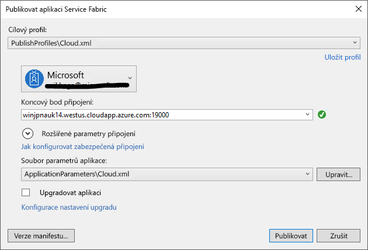

# <a name="deploy-an-application-tooa-party-cluster-in-azure"></a><span data-ttu-id="c0af1-103">Nasazení aplikace tooa strany clusteru v Azure</span><span class="sxs-lookup"><span data-stu-id="c0af1-103">Deploy an application tooa Party Cluster in Azure</span></span>
<span data-ttu-id="c0af1-104">V tomto kurzu je součástí dvě řady a ukazuje, jak toodeploy tooa aplikace Azure Service Fabric strany clusteru v Azure.</span><span class="sxs-lookup"><span data-stu-id="c0af1-104">This tutorial is part two of a series and shows you how toodeploy an Azure Service Fabric application tooa Party Cluster in Azure.</span></span>

<span data-ttu-id="c0af1-105">V druhé části kurzu řady hello zjistíte, jak:</span><span class="sxs-lookup"><span data-stu-id="c0af1-105">In part two of hello tutorial series, you learn how to:</span></span>
> [!div class="checklist"]
> * <span data-ttu-id="c0af1-106">Nasazení clusteru vzdálené tooa aplikace pomocí sady Visual Studio</span><span class="sxs-lookup"><span data-stu-id="c0af1-106">Deploy an application tooa remote cluster using Visual Studio</span></span>
> * <span data-ttu-id="c0af1-107">Odebrání aplikace z clusteru pomocí Service Fabric Exploreru</span><span class="sxs-lookup"><span data-stu-id="c0af1-107">Remove an application from a cluster using Service Fabric Explorer</span></span>

<span data-ttu-id="c0af1-108">V této série kurzu zjistíte, jak:</span><span class="sxs-lookup"><span data-stu-id="c0af1-108">In this tutorial series you learn how to:</span></span>
> [!div class="checklist"]
> * [<span data-ttu-id="c0af1-109">Sestavení aplikace .NET Service Fabric</span><span class="sxs-lookup"><span data-stu-id="c0af1-109">Build a .NET Service Fabric application</span></span>](service-fabric-tutorial-create-dotnet-app.md)
> * <span data-ttu-id="c0af1-110">Nasazení vzdáleného clusteru tooa hello aplikace</span><span class="sxs-lookup"><span data-stu-id="c0af1-110">Deploy hello application tooa remote cluster</span></span>
> * [<span data-ttu-id="c0af1-111">Konfigurace CI/CD pomocí Visual Studio Team Services</span><span class="sxs-lookup"><span data-stu-id="c0af1-111">Configure CI/CD using Visual Studio Team Services</span></span>](service-fabric-tutorial-deploy-app-with-cicd-vsts.md)

## <a name="prerequisites"></a><span data-ttu-id="c0af1-112">Požadavky</span><span class="sxs-lookup"><span data-stu-id="c0af1-112">Prerequisites</span></span>
<span data-ttu-id="c0af1-113">Před zahájením tohoto kurzu:</span><span class="sxs-lookup"><span data-stu-id="c0af1-113">Before you begin this tutorial:</span></span>
- <span data-ttu-id="c0af1-114">Pokud nemáte předplatné Azure, vytvořte [bezplatný účet](https://azure.microsoft.com/free/?WT.mc_id=A261C142F)</span><span class="sxs-lookup"><span data-stu-id="c0af1-114">If you don't have an Azure subscription, create a [free account](https://azure.microsoft.com/free/?WT.mc_id=A261C142F)</span></span>
- <span data-ttu-id="c0af1-115">[Nainstalovat Visual Studio 2017](https://www.visualstudio.com/) a nainstalujte hello **Azure development** a **ASP.NET a webové vývoj** úlohy.</span><span class="sxs-lookup"><span data-stu-id="c0af1-115">[Install Visual Studio 2017](https://www.visualstudio.com/) and install hello **Azure development** and **ASP.NET and web development** workloads.</span></span>
- [<span data-ttu-id="c0af1-116">Nainstalujte hello Service Fabric SDK</span><span class="sxs-lookup"><span data-stu-id="c0af1-116">Install hello Service Fabric SDK</span></span>](service-fabric-get-started.md)

## <a name="download-hello-voting-sample-application"></a><span data-ttu-id="c0af1-117">Stáhněte si ukázkovou aplikaci Voting hello</span><span class="sxs-lookup"><span data-stu-id="c0af1-117">Download hello Voting sample application</span></span>
<span data-ttu-id="c0af1-118">Pokud není sestavení hello Voting ukázkovou aplikaci [součástí jeden z této série kurz](service-fabric-tutorial-create-dotnet-app.md), můžete ho stáhnout.</span><span class="sxs-lookup"><span data-stu-id="c0af1-118">If you did not build hello Voting sample application in [part one of this tutorial series](service-fabric-tutorial-create-dotnet-app.md), you can download it.</span></span> <span data-ttu-id="c0af1-119">V příkazovém okně spusťte následující příkaz tooclone hello ukázkové aplikace úložiště tooyour místního počítače hello.</span><span class="sxs-lookup"><span data-stu-id="c0af1-119">In a command window, run hello following command tooclone hello sample app repository tooyour local machine.</span></span>

```
git clone https://github.com/Azure-Samples/service-fabric-dotnet-quickstart
```

## <a name="set-up-a-party-cluster"></a><span data-ttu-id="c0af1-120">Nastavení clusteru strany</span><span class="sxs-lookup"><span data-stu-id="c0af1-120">Set up a Party Cluster</span></span>
<span data-ttu-id="c0af1-121">Strany clustery jsou zdarma, časově omezené clusterů Service Fabric hostované v Azure a spusťte Service Fabric týmem hello kde každý, kdo můžete nasadit aplikace a další informace o platformě hello.</span><span class="sxs-lookup"><span data-stu-id="c0af1-121">Party clusters are free, limited-time Service Fabric clusters hosted on Azure and run by hello Service Fabric team where anyone can deploy applications and learn about hello platform.</span></span> <span data-ttu-id="c0af1-122">Zdarma!</span><span class="sxs-lookup"><span data-stu-id="c0af1-122">For free!</span></span>

<span data-ttu-id="c0af1-123">tooget přístup tooa strany clusteru, procházet toothis lokality: http://aka.ms/tryservicefabric a postupujte podle hello pokyny tooget tooa clusteru přístupu.</span><span class="sxs-lookup"><span data-stu-id="c0af1-123">tooget access tooa Party Cluster, browse toothis site: http://aka.ms/tryservicefabric and follow hello instructions tooget access tooa cluster.</span></span> <span data-ttu-id="c0af1-124">Je nutné Facebooku nebo Githubu účet tooget přístup tooa strany clusteru.</span><span class="sxs-lookup"><span data-stu-id="c0af1-124">You need a Facebook or GitHub account tooget access tooa Party Cluster.</span></span>

> [!NOTE]
> <span data-ttu-id="c0af1-125">Strany clustery není zabezpečená, aby vaše aplikace a všechna data, která jste uložili v nich může být viditelné tooothers.</span><span class="sxs-lookup"><span data-stu-id="c0af1-125">Party clusters are not secured, so your applications and any data you put in them may be visible tooothers.</span></span> <span data-ttu-id="c0af1-126">Nenasazujte nic nechcete, aby ostatní toosee.</span><span class="sxs-lookup"><span data-stu-id="c0af1-126">Don't deploy anything you don't want others toosee.</span></span> <span data-ttu-id="c0af1-127">Být jisti tooread přes naše podmínky použití pro všechny podrobnosti hello.</span><span class="sxs-lookup"><span data-stu-id="c0af1-127">Be sure tooread over our Terms of Use for all hello details.</span></span>

## <a name="configure-hello-listening-port"></a><span data-ttu-id="c0af1-128">Nakonfigurujte port naslouchání hello</span><span class="sxs-lookup"><span data-stu-id="c0af1-128">Configure hello listening port</span></span>
<span data-ttu-id="c0af1-129">Když je vytvořen hello VotingWeb front-endová služba, Visual Studio náhodně zvolí port pro službu toolisten hello na.</span><span class="sxs-lookup"><span data-stu-id="c0af1-129">When hello VotingWeb front-end service is created, Visual Studio randomly selects a port for hello service toolisten on.</span></span>  <span data-ttu-id="c0af1-130">Hello VotingWeb služba funguje jako front-end pro tuto aplikaci hello a přijímá externích přenosů, proto budeme vazby této služby tooa pevné a také znát port.</span><span class="sxs-lookup"><span data-stu-id="c0af1-130">hello VotingWeb service acts as hello front-end for this application and accepts external traffic, so let's bind that service tooa fixed and well-know port.</span></span> <span data-ttu-id="c0af1-131">V Průzkumníku řešení otevřete *VotingWeb/PackageRoot/ServiceManifest.xml*.</span><span class="sxs-lookup"><span data-stu-id="c0af1-131">In Solution Explorer, open  *VotingWeb/PackageRoot/ServiceManifest.xml*.</span></span>  <span data-ttu-id="c0af1-132">Najde hello **koncový bod** prostředku v hello **prostředky** části a změňte hello **Port** too80 hodnotu.</span><span class="sxs-lookup"><span data-stu-id="c0af1-132">Find hello **Endpoint** resource in hello **Resources** section and change hello **Port** value too80.</span></span>

```xml
<Resources>
    <Endpoints>
      <!-- This endpoint is used by hello communication listener tooobtain hello port on which too
           listen. Please note that if your service is partitioned, this port is shared with 
           replicas of different partitions that are placed in your code. -->
      <Endpoint Protocol="http" Name="ServiceEndpoint" Type="Input" Port="80" />
    </Endpoints>
  </Resources>
```

<span data-ttu-id="c0af1-133">Také aktualizujte hodnotu vlastnosti hello adresa URL aplikace v projektu Voting hello, otevře se webový prohlížeč toohello správný port při ladění pomocí 'F5'.</span><span class="sxs-lookup"><span data-stu-id="c0af1-133">Also update hello Application URL property value in hello Voting project so a web browser opens toohello correct port when you debug using 'F5'.</span></span>  <span data-ttu-id="c0af1-134">V Průzkumníku řešení, vyberte hello **Voting** projekt a aktualizace hello **adresa URL aplikace** vlastnost.</span><span class="sxs-lookup"><span data-stu-id="c0af1-134">In Solution Explorer, select hello **Voting** project and update hello **Application URL** property.</span></span>


## <a name="deploy-hello-app-toohello-azure"></a><span data-ttu-id="c0af1-136">Nasazení aplikace toohello hello Azure</span><span class="sxs-lookup"><span data-stu-id="c0af1-136">Deploy hello app toohello Azure</span></span>
<span data-ttu-id="c0af1-137">Teď, když aplikace hello je připraveno, můžete ho nasadit toohello strany clusteru přímé ze sady Visual Studio.</span><span class="sxs-lookup"><span data-stu-id="c0af1-137">Now that hello application is ready, you can deploy it toohello Party Cluster direct from Visual Studio.</span></span>

1. <span data-ttu-id="c0af1-138">Klikněte pravým tlačítkem na **Voting** v hello Průzkumníku řešení a zvolte **publikovat**.</span><span class="sxs-lookup"><span data-stu-id="c0af1-138">Right-click **Voting** in hello Solution Explorer and choose **Publish**.</span></span>

    

2. <span data-ttu-id="c0af1-140">Zadejte hello koncového bodu připojení hello strany clusteru v hello **koncového bodu připojení** pole a klikněte na tlačítko **publikovat**.</span><span class="sxs-lookup"><span data-stu-id="c0af1-140">Type in hello Connection Endpoint of hello Party Cluster in hello **Connection Endpoint** field and click **Publish**.</span></span>

    <span data-ttu-id="c0af1-141">Po publikování hello je dokončena, byste měli mít toosend k žádosti o toohello aplikaci prostřednictvím prohlížeče.</span><span class="sxs-lookup"><span data-stu-id="c0af1-141">Once hello publish has finished, you should be able toosend a request toohello application via a browser.</span></span>

3. <span data-ttu-id="c0af1-142">Otevřít vaše preferované prohlížeč a zadejte adresu clusteru hello (hello koncového bodu připojení bez informace o portu hello – například win1kw5649s.westus.cloudapp.azure.com).</span><span class="sxs-lookup"><span data-stu-id="c0af1-142">Open you preferred browser and type in hello cluster address (hello connection endpoint without hello port information - for example, win1kw5649s.westus.cloudapp.azure.com).</span></span>

    <span data-ttu-id="c0af1-143">Teď byste měli vidět hello stejný výsledek jako jste viděli při místním spuštění aplikace hello.</span><span class="sxs-lookup"><span data-stu-id="c0af1-143">You should now see hello same result as you saw when running hello application locally.</span></span>

    

## <a name="remove-hello-application-from-a-cluster-using-service-fabric-explorer"></a><span data-ttu-id="c0af1-145">Hello aplikaci odebrat z clusteru pomocí Service Fabric Exploreru</span><span class="sxs-lookup"><span data-stu-id="c0af1-145">Remove hello application from a cluster using Service Fabric Explorer</span></span>
<span data-ttu-id="c0af1-146">Service Fabric Explorer je tooexplore grafické uživatelské rozhraní a spravovat aplikace v clusteru Service Fabric.</span><span class="sxs-lookup"><span data-stu-id="c0af1-146">Service Fabric Explorer is a graphical user interface tooexplore and manage applications in a Service Fabric cluster.</span></span>

<span data-ttu-id="c0af1-147">aplikace hello tooremove z hello strany clusteru:</span><span class="sxs-lookup"><span data-stu-id="c0af1-147">tooremove hello application from hello Party Cluster:</span></span>

1. <span data-ttu-id="c0af1-148">Procházejte toohello Service Fabric Explorer pomocí odkazu hello poskytované stránku hello strany clusteru.</span><span class="sxs-lookup"><span data-stu-id="c0af1-148">Browse toohello Service Fabric Explorer, using hello link provided by hello Party Cluster sign-up page.</span></span> <span data-ttu-id="c0af1-149">Například http://win1kw5649s.westus.cloudapp.azure.com:19080/Explorer/index.html.</span><span class="sxs-lookup"><span data-stu-id="c0af1-149">For example, http://win1kw5649s.westus.cloudapp.azure.com:19080/Explorer/index.html.</span></span>

2. <span data-ttu-id="c0af1-150">V Service Fabric Exploreru přejděte toohello **fabric://Voting** uzlu treeview hello na levé straně hello.</span><span class="sxs-lookup"><span data-stu-id="c0af1-150">In Service Fabric Explorer, navigate toohello **fabric://Voting** node in hello treeview on hello left-hand side.</span></span>

3. <span data-ttu-id="c0af1-151">Klikněte na tlačítko hello **akce** tlačítko v pravém hello **Essentials** podokně a zvolte **odstranit aplikaci**.</span><span class="sxs-lookup"><span data-stu-id="c0af1-151">Click hello **Action** button in hello right-hand **Essentials** pane, and choose **Delete Application**.</span></span> <span data-ttu-id="c0af1-152">Potvrďte odstraňování hello instanci aplikace, který odebere hello instanci naše aplikace běžící v clusteru hello.</span><span class="sxs-lookup"><span data-stu-id="c0af1-152">Confirm deleting hello application instance, which removes hello instance of our application running in hello cluster.</span></span>


## <a name="remove-hello-application-type-from-a-cluster-using-service-fabric-explorer"></a><span data-ttu-id="c0af1-154">Typ aplikace hello odebrat z clusteru pomocí Service Fabric Exploreru</span><span class="sxs-lookup"><span data-stu-id="c0af1-154">Remove hello application type from a cluster using Service Fabric Explorer</span></span>
<span data-ttu-id="c0af1-155">Aplikace jsou nasazeny jako typy aplikací v clusteru Service Fabric, což umožňuje vám toohave více instancí a verzí hello aplikace běžící v rámci clusteru hello.</span><span class="sxs-lookup"><span data-stu-id="c0af1-155">Applications are deployed as application types in a Service Fabric cluster, which enables you toohave multiple instances and versions of hello application running within hello cluster.</span></span> <span data-ttu-id="c0af1-156">Po odebrání hello spuštěna instance naše aplikace jsme rovněž můžete odebrat hello typu, čištění hello toocomplete hello nasazení.</span><span class="sxs-lookup"><span data-stu-id="c0af1-156">After having removed hello running instance of our application, we can also remove hello type, toocomplete hello cleanup of hello deployment.</span></span>

<span data-ttu-id="c0af1-157">Další informace o modelu hello aplikace v Service Fabric najdete v tématu [Model aplikace v Service Fabric](service-fabric-application-model.md).</span><span class="sxs-lookup"><span data-stu-id="c0af1-157">For more information about hello application model in Service Fabric, see [Model an application in Service Fabric](service-fabric-application-model.md).</span></span>

1. <span data-ttu-id="c0af1-158">Přejděte toohello **VotingType** uzlu hello treeview.</span><span class="sxs-lookup"><span data-stu-id="c0af1-158">Navigate toohello **VotingType** node in hello treeview.</span></span>

2. <span data-ttu-id="c0af1-159">Klikněte na tlačítko hello **akce** tlačítko v pravém hello **Essentials** podokně a zvolte **Unprovision typu**.</span><span class="sxs-lookup"><span data-stu-id="c0af1-159">Click hello **Action** button in hello right-hand **Essentials** pane, and choose **Unprovision Type**.</span></span> <span data-ttu-id="c0af1-160">Potvrďte Rušení zřizování typ aplikace hello.</span><span class="sxs-lookup"><span data-stu-id="c0af1-160">Confirm unprovisioning hello application type.</span></span>


<span data-ttu-id="c0af1-162">Tím končí hello kurzu.</span><span class="sxs-lookup"><span data-stu-id="c0af1-162">This concludes hello tutorial.</span></span>

## <a name="next-steps"></a><span data-ttu-id="c0af1-163">Další kroky</span><span class="sxs-lookup"><span data-stu-id="c0af1-163">Next steps</span></span>
<span data-ttu-id="c0af1-164">V tomto kurzu jste se naučili:</span><span class="sxs-lookup"><span data-stu-id="c0af1-164">In this tutorial, you learned how to:</span></span>

> [!div class="checklist"]
> * <span data-ttu-id="c0af1-165">Nasazení clusteru vzdálené tooa aplikace pomocí sady Visual Studio</span><span class="sxs-lookup"><span data-stu-id="c0af1-165">Deploy an application tooa remote cluster using Visual Studio</span></span>
> * <span data-ttu-id="c0af1-166">Odebrání aplikace z clusteru pomocí Service Fabric Exploreru</span><span class="sxs-lookup"><span data-stu-id="c0af1-166">Remove an application from a cluster using Service Fabric Explorer</span></span>

<span data-ttu-id="c0af1-167">ADVANCE toohello další kurz:</span><span class="sxs-lookup"><span data-stu-id="c0af1-167">Advance toohello next tutorial:</span></span>
> [!div class="nextstepaction"]
> [<span data-ttu-id="c0af1-168">Nastavte průběžnou integraci pomocí Visual Studio Team Services</span><span class="sxs-lookup"><span data-stu-id="c0af1-168">Set up continuous integration using Visual Studio Team Services</span></span>](service-fabric-tutorial-deploy-app-with-cicd-vsts.md)