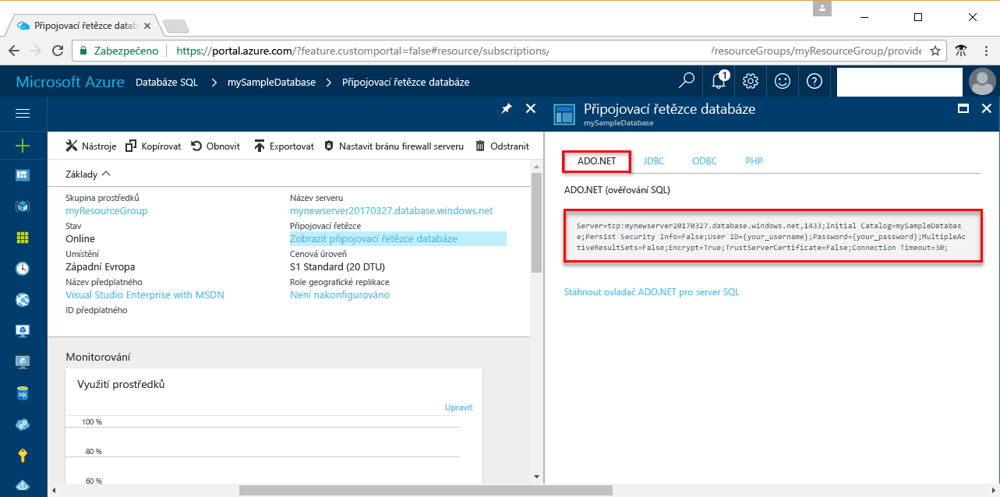

# <a name="use-net-core-c-tooquery-an-azure-sql-database"></a><span data-ttu-id="c4a00-103">Použít tooquery .NET Core (C#) Azure SQL database</span><span class="sxs-lookup"><span data-stu-id="c4a00-103">Use .NET Core (C#) tooquery an Azure SQL database</span></span>

<span data-ttu-id="c4a00-104">Tento úvodní kurz ukazuje, jak toouse [.NET Core](https://www.microsoft.com/net/) v systému Windows nebo Linux/systému macOS toocreate C# program tooconnect tooan Azure SQL databáze a používat data tooquery příkazy jazyka Transact-SQL.</span><span class="sxs-lookup"><span data-stu-id="c4a00-104">This quick start tutorial demonstrates how toouse [.NET Core](https://www.microsoft.com/net/) on Windows/Linux/macOS toocreate a C# program tooconnect tooan Azure SQL database and use Transact-SQL statements tooquery data.</span></span>

## <a name="prerequisites"></a><span data-ttu-id="c4a00-105">Požadavky</span><span class="sxs-lookup"><span data-stu-id="c4a00-105">Prerequisites</span></span>

<span data-ttu-id="c4a00-106">toocomplete tento rychlý úvodní kurz, ujistěte se, že máte hello následující:</span><span class="sxs-lookup"><span data-stu-id="c4a00-106">toocomplete this quick start tutorial, make sure you have hello following:</span></span>

- <span data-ttu-id="c4a00-107">Databázi SQL Azure.</span><span class="sxs-lookup"><span data-stu-id="c4a00-107">An Azure SQL database.</span></span> <span data-ttu-id="c4a00-108">Tento rychlý start používá hello prostředky vytvořené v jednom z těchto rychlé spuštění:</span><span class="sxs-lookup"><span data-stu-id="c4a00-108">This quick start uses hello resources created in one of these quick starts:</span></span> 

   - [<span data-ttu-id="c4a00-109">Vytvoření databáze – portál</span><span class="sxs-lookup"><span data-stu-id="c4a00-109">Create DB - Portal</span></span>](sql-database-get-started-portal.md)
   - [<span data-ttu-id="c4a00-110">Vytvoření databáze – rozhraní příkazového řádku</span><span class="sxs-lookup"><span data-stu-id="c4a00-110">Create DB - CLI</span></span>](sql-database-get-started-cli.md)
   - [<span data-ttu-id="c4a00-111">Vytvoření databáze – PowerShell</span><span class="sxs-lookup"><span data-stu-id="c4a00-111">Create DB - PowerShell</span></span>](sql-database-get-started-powershell.md)

- <span data-ttu-id="c4a00-112">A [pravidlo brány firewall na úrovni serveru](sql-database-get-started-portal.md#create-a-server-level-firewall-rule) pro hello veřejnou IP adresu počítače hello použijete pro tento kurz rychlý start.</span><span class="sxs-lookup"><span data-stu-id="c4a00-112">A [server-level firewall rule](sql-database-get-started-portal.md#create-a-server-level-firewall-rule) for hello public IP address of hello computer you use for this quick start tutorial.</span></span>
- <span data-ttu-id="c4a00-113">Nainstalované [.NET Core pro váš operační systém](https://www.microsoft.com/net/core).</span><span class="sxs-lookup"><span data-stu-id="c4a00-113">You have installed [.NET Core for your operating system](https://www.microsoft.com/net/core).</span></span> 

## <a name="sql-server-connection-information"></a><span data-ttu-id="c4a00-114">Informace o připojení k SQL serveru</span><span class="sxs-lookup"><span data-stu-id="c4a00-114">SQL server connection information</span></span>

<span data-ttu-id="c4a00-115">Získáte hello připojení informace potřebné tooconnect toohello Azure SQL database.</span><span class="sxs-lookup"><span data-stu-id="c4a00-115">Get hello connection information needed tooconnect toohello Azure SQL database.</span></span> <span data-ttu-id="c4a00-116">Budete potřebovat hello serveru plně kvalifikovaný název, název databáze a přihlašovacích údajů v dalším postupu hello.</span><span class="sxs-lookup"><span data-stu-id="c4a00-116">You will need hello fully qualified server name, database name, and login information in hello next procedures.</span></span>

1. <span data-ttu-id="c4a00-117">Přihlaste se toohello [portál Azure](https://portal.azure.com/).</span><span class="sxs-lookup"><span data-stu-id="c4a00-117">Log in toohello [Azure portal](https://portal.azure.com/).</span></span>
2. <span data-ttu-id="c4a00-118">Vyberte **databází SQL** z nabídky na levé straně hello a klikněte na tlačítko databáze na hello **databází SQL** stránky.</span><span class="sxs-lookup"><span data-stu-id="c4a00-118">Select **SQL Databases** from hello left-hand menu, and click your database on hello **SQL databases** page.</span></span> 
3. <span data-ttu-id="c4a00-119">Na hello **přehled** stránky pro vaši databázi hello zkontrolujte plně kvalifikovaný název serveru, jak ukazuje následující obrázek hello.</span><span class="sxs-lookup"><span data-stu-id="c4a00-119">On hello **Overview** page for your database, review hello fully qualified server name as shown in hello following image.</span></span> <span data-ttu-id="c4a00-120">Můžete podržet přes toobring název serveru hello až hello **klikněte na tlačítko toocopy** možnost.</span><span class="sxs-lookup"><span data-stu-id="c4a00-120">You can hover over hello server name toobring up hello **Click toocopy** option.</span></span> 

    

4. <span data-ttu-id="c4a00-122">Pokud zapomenete přihlašovací údaje serveru Azure SQL Database, přejděte toohello databáze SQL serveru stránky tooview hello serveru správce název.</span><span class="sxs-lookup"><span data-stu-id="c4a00-122">If you forget your Azure SQL Database server login information, navigate toohello SQL Database server page tooview hello server admin name.</span></span> <span data-ttu-id="c4a00-123">V případě potřeby můžete resetovat heslo hello.</span><span class="sxs-lookup"><span data-stu-id="c4a00-123">You can reset hello password if necessary.</span></span>

5. <span data-ttu-id="c4a00-124">Klikněte na tlačítko **Zobrazit databázové připojovací řetězce**.</span><span class="sxs-lookup"><span data-stu-id="c4a00-124">Click **Show database connection strings**.</span></span>

6. <span data-ttu-id="c4a00-125">Zkontrolujte hello dokončení **ADO.NET** připojovací řetězec.</span><span class="sxs-lookup"><span data-stu-id="c4a00-125">Review hello complete **ADO.NET** connection string.</span></span>

    

> [!IMPORTANT]
> <span data-ttu-id="c4a00-127">Pravidlo brány firewall musí mít zavedené hello veřejných IP adres hello počítače, na kterém provádíte tento kurz.</span><span class="sxs-lookup"><span data-stu-id="c4a00-127">You must have a firewall rule in place for hello public IP address of hello computer on which you perform this tutorial.</span></span> <span data-ttu-id="c4a00-128">Pokud jsou v jiném počítači nebo mít jinou veřejnou IP adresu, vytvořte [pravidlo brány firewall na úrovni serveru pomocí portálu Azure hello](sql-database-get-started-portal.md#create-a-server-level-firewall-rule).</span><span class="sxs-lookup"><span data-stu-id="c4a00-128">If you are on a different computer or have a different public IP address, create a [server-level firewall rule using hello Azure portal](sql-database-get-started-portal.md#create-a-server-level-firewall-rule).</span></span> 
>
  
## <a name="create-a-new-net-project"></a><span data-ttu-id="c4a00-129">Vytvoření nového projektu .NET</span><span class="sxs-lookup"><span data-stu-id="c4a00-129">Create a new .NET project</span></span>

1. <span data-ttu-id="c4a00-130">Otevřete příkazový řádek a vytvořte složku *sqltest*.</span><span class="sxs-lookup"><span data-stu-id="c4a00-130">Open a command prompt and create a folder named *sqltest*.</span></span> <span data-ttu-id="c4a00-131">Přejděte toohello složky můžete vytvořit a spustit hello následující příkaz:</span><span class="sxs-lookup"><span data-stu-id="c4a00-131">Navigate toohello folder you created and run hello following command:</span></span>

    ```
    dotnet new console
    ```

2. <span data-ttu-id="c4a00-132">Otevřete ***sqltest.csproj*** s svém oblíbeném textovém editoru a přidejte System.Data.SqlClient jako závislost pomocí hello následující kód:</span><span class="sxs-lookup"><span data-stu-id="c4a00-132">Open ***sqltest.csproj*** with your favorite text editor and add System.Data.SqlClient as a dependency using hello following code:</span></span>

    ```xml
    <ItemGroup>
        <PackageReference Include="System.Data.SqlClient" Version="4.3.0" />
    </ItemGroup>
    ```

## <a name="insert-code-tooquery-sql-database"></a><span data-ttu-id="c4a00-133">Vložení kódu tooquery SQL database</span><span class="sxs-lookup"><span data-stu-id="c4a00-133">Insert code tooquery SQL database</span></span>

1. <span data-ttu-id="c4a00-134">Ve vývojovém prostředí nebo oblíbeném textovém editoru otevřete soubor **Program.cs**.</span><span class="sxs-lookup"><span data-stu-id="c4a00-134">In your development environment or favorite text editor open **Program.cs**</span></span>

2. <span data-ttu-id="c4a00-135">Nahraďte obsah hello hello následující kód a přidat hello odpovídající hodnoty pro server, databáze, uživatele a heslo.</span><span class="sxs-lookup"><span data-stu-id="c4a00-135">Replace hello contents with hello following code and add hello appropriate values for your server, database, user, and password.</span></span>

```csharp
using System;
using System.Data.SqlClient;
using System.Text;

namespace sqltest
{
    class Program
    {
        static void Main(string[] args)
        {
            try 
            { 
                SqlConnectionStringBuilder builder = new SqlConnectionStringBuilder();
                builder.DataSource = "your_server.database.windows.net"; 
                builder.UserID = "your_user";            
                builder.Password = "your_password";     
                builder.InitialCatalog = "your_database";

                using (SqlConnection connection = new SqlConnection(builder.ConnectionString))
                {
                    Console.WriteLine("\nQuery data example:");
                    Console.WriteLine("=========================================\n");
                    
                    connection.Open();       
                    StringBuilder sb = new StringBuilder();
                    sb.Append("SELECT TOP 20 pc.Name as CategoryName, p.name as ProductName ");
                    sb.Append("FROM [SalesLT].[ProductCategory] pc ");
                    sb.Append("JOIN [SalesLT].[Product] p ");
                    sb.Append("ON pc.productcategoryid = p.productcategoryid;");
                    String sql = sb.ToString();

                    using (SqlCommand command = new SqlCommand(sql, connection))
                    {
                        using (SqlDataReader reader = command.ExecuteReader())
                        {
                            while (reader.Read())
                            {
                                Console.WriteLine("{0} {1}", reader.GetString(0), reader.GetString(1));
                            }
                        }
                    }                    
                }
            }
            catch (SqlException e)
            {
                Console.WriteLine(e.ToString());
            }
            Console.ReadLine();
        }
    }
}
```

## <a name="run-hello-code"></a><span data-ttu-id="c4a00-136">Spuštění kódu hello</span><span class="sxs-lookup"><span data-stu-id="c4a00-136">Run hello code</span></span>

1. <span data-ttu-id="c4a00-137">Hello příkazového řádku spusťte následující příkazy hello:</span><span class="sxs-lookup"><span data-stu-id="c4a00-137">At hello command prompt, run hello following commands:</span></span>

   ```csharp
   dotnet restore
   dotnet run
   ```

2. <span data-ttu-id="c4a00-138">Ověřte, že horních řádků 20 hello se vrátí a pak zavřete okno aplikace hello.</span><span class="sxs-lookup"><span data-stu-id="c4a00-138">Verify that hello top 20 rows are returned and then close hello application window.</span></span>


## <a name="next-steps"></a><span data-ttu-id="c4a00-139">Další kroky</span><span class="sxs-lookup"><span data-stu-id="c4a00-139">Next steps</span></span>

- <span data-ttu-id="c4a00-140">[Začínáme s .NET Core v systému Windows nebo Linux/macOS hello příkazového řádku](/dotnet/core/tutorials/using-with-xplat-cli).</span><span class="sxs-lookup"><span data-stu-id="c4a00-140">[Getting started with .NET Core on Windows/Linux/macOS using hello command line](/dotnet/core/tutorials/using-with-xplat-cli).</span></span>
- <span data-ttu-id="c4a00-141">Zjistěte, jak příliš[připojení a dotazování Azure SQL database pomocí hello rozhraní .NET framework a Visual Studio](sql-database-connect-query-dotnet-visual-studio.md).</span><span class="sxs-lookup"><span data-stu-id="c4a00-141">Learn how too[connect and query an Azure SQL database using hello .NET framework and Visual Studio](sql-database-connect-query-dotnet-visual-studio.md).</span></span>  
- <span data-ttu-id="c4a00-142">Zjistěte, jak příliš[navrhnout první databáze Azure SQL pomocí aplikace SSMS](sql-database-design-first-database.md) nebo [navrhnout první databáze Azure SQL pomocí rozhraní .NET](sql-database-design-first-database-csharp.md).</span><span class="sxs-lookup"><span data-stu-id="c4a00-142">Learn how too[Design your first Azure SQL database using SSMS](sql-database-design-first-database.md) or [Design your first Azure SQL database using .NET](sql-database-design-first-database-csharp.md).</span></span>
- <span data-ttu-id="c4a00-143">Další informace o .NET najdete v [dokumentaci rozhraní .NET](https://docs.microsoft.com/dotnet/).</span><span class="sxs-lookup"><span data-stu-id="c4a00-143">For more information about .NET, see [.NET documentation](https://docs.microsoft.com/dotnet/).</span></span>
