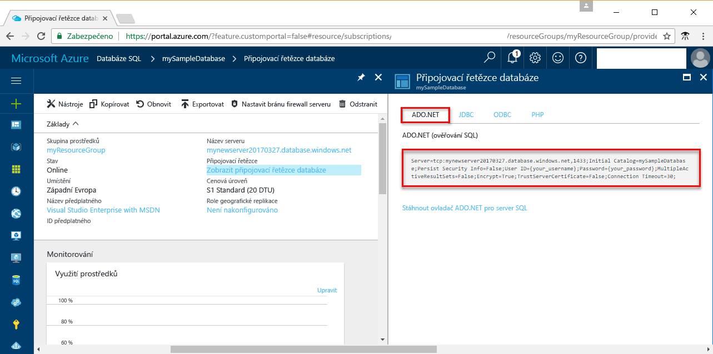

# <a name="use-net-c-with-visual-studio-to-connect-and-query-an-azure-sql-database"></a><span data-ttu-id="33346-103">Použití .NET (jazyk C#) a sady Visual Studio k připojení k databázi SQL Azure a jejímu dotazování</span><span class="sxs-lookup"><span data-stu-id="33346-103">Use .NET (C#) with Visual Studio to connect and query an Azure SQL database</span></span>

<span data-ttu-id="33346-104">Tento rychlý úvodní kurz ukazuje použití rozhraní [.NET Framework](https://www.microsoft.com/net/) a sady Visual Studio k vytvoření programu v jazyce C# pro připojení k databázi SQL Azure a použití příkazů jazyka Transact-SQL k dotazování dat.</span><span class="sxs-lookup"><span data-stu-id="33346-104">This quick start tutorial demonstrates how to use the [.NET framework](https://www.microsoft.com/net/) to create a C# program with Visual Studio to connect to an Azure SQL database and use Transact-SQL statements to query data.</span></span>

## <a name="prerequisites"></a><span data-ttu-id="33346-105">Požadavky</span><span class="sxs-lookup"><span data-stu-id="33346-105">Prerequisites</span></span>

<span data-ttu-id="33346-106">Abyste mohli absolvovat tento rychlý úvodní kurz, ujistěte se, že máte následující:</span><span class="sxs-lookup"><span data-stu-id="33346-106">To complete this quick start tutorial, make sure you have the following:</span></span>

- <span data-ttu-id="33346-107">Databázi SQL Azure.</span><span class="sxs-lookup"><span data-stu-id="33346-107">An Azure SQL database.</span></span> <span data-ttu-id="33346-108">Tento rychlý start používá prostředky vytvořené v některém z těchto rychlých startů:</span><span class="sxs-lookup"><span data-stu-id="33346-108">This quick start uses the resources created in one of these quick starts:</span></span> 

   - [<span data-ttu-id="33346-109">Vytvoření databáze – portál</span><span class="sxs-lookup"><span data-stu-id="33346-109">Create DB - Portal</span></span>](sql-database-get-started-portal.md)
   - [<span data-ttu-id="33346-110">Vytvoření databáze – rozhraní příkazového řádku</span><span class="sxs-lookup"><span data-stu-id="33346-110">Create DB - CLI</span></span>](sql-database-get-started-cli.md)
   - [<span data-ttu-id="33346-111">Vytvoření databáze – PowerShell</span><span class="sxs-lookup"><span data-stu-id="33346-111">Create DB - PowerShell</span></span>](sql-database-get-started-powershell.md)

- <span data-ttu-id="33346-112">[Pravidlo brány firewall na úrovni serveru](sql-database-get-started-portal.md#create-a-server-level-firewall-rule) pro veřejnou IP adresu počítače, který používáte pro tento rychlý úvodní kurz.</span><span class="sxs-lookup"><span data-stu-id="33346-112">A [server-level firewall rule](sql-database-get-started-portal.md#create-a-server-level-firewall-rule) for the public IP address of the computer you use for this quick start tutorial.</span></span>
- <span data-ttu-id="33346-113">Instalaci sady [Visual Studio Community 2017, Visual Studio Professional 2017 nebo Visual Studio Enterprise 2017](https://www.visualstudio.com/downloads/).</span><span class="sxs-lookup"><span data-stu-id="33346-113">An installation of [Visual Studio Community 2017, Visual Studio Professional 2017, or Visual Studio Enterprise 2017](https://www.visualstudio.com/downloads/).</span></span>

## <a name="sql-server-connection-information"></a><span data-ttu-id="33346-114">Informace o připojení k SQL serveru</span><span class="sxs-lookup"><span data-stu-id="33346-114">SQL server connection information</span></span>

<span data-ttu-id="33346-115">Získejte informace o připojení potřebné pro připojení k databázi SQL Azure.</span><span class="sxs-lookup"><span data-stu-id="33346-115">Get the connection information needed to connect to the Azure SQL database.</span></span> <span data-ttu-id="33346-116">V dalších postupech budete potřebovat plně kvalifikovaný název serveru, název databáze a přihlašovací údaje.</span><span class="sxs-lookup"><span data-stu-id="33346-116">You will need the fully qualified server name, database name, and login information in the next procedures.</span></span>

1. <span data-ttu-id="33346-117">Přihlaste se k portálu [Azure Portal](https://portal.azure.com/).</span><span class="sxs-lookup"><span data-stu-id="33346-117">Log in to the [Azure portal](https://portal.azure.com/).</span></span>
2. <span data-ttu-id="33346-118">V nabídce vlevo vyberte **SQL Database** a na stránce **Databáze SQL** klikněte na vaši databázi.</span><span class="sxs-lookup"><span data-stu-id="33346-118">Select **SQL Databases** from the left-hand menu, and click your database on the **SQL databases** page.</span></span> 
3. <span data-ttu-id="33346-119">Na stránce **Přehled** pro vaši databázi si prohlédněte plně kvalifikovaný název serveru, jak je znázorněno na následujícím obrázku.</span><span class="sxs-lookup"><span data-stu-id="33346-119">On the **Overview** page for your database, review the fully qualified server name as shown in the following image.</span></span> <span data-ttu-id="33346-120">Pokud na název serveru najedete myší, můžete vyvolat možnost **Kopírování kliknutím**.</span><span class="sxs-lookup"><span data-stu-id="33346-120">You can hover over the server name to bring up the **Click to copy** option.</span></span> 

    

4. <span data-ttu-id="33346-122">Pokud zapomenete přihlašovací informace pro váš server služby Azure SQL Database, přejděte na stránku serveru služby SQL Database, abyste zobrazili jméno správce serveru.</span><span class="sxs-lookup"><span data-stu-id="33346-122">If you forget your Azure SQL Database server login information, navigate to the SQL Database server page to view the server admin name.</span></span> <span data-ttu-id="33346-123">V případě potřeby můžete obnovit heslo.</span><span class="sxs-lookup"><span data-stu-id="33346-123">You can reset the password if necessary.</span></span>

5. <span data-ttu-id="33346-124">Klikněte na tlačítko **Zobrazit databázové připojovací řetězce**.</span><span class="sxs-lookup"><span data-stu-id="33346-124">Click **Show database connection strings**.</span></span>

6. <span data-ttu-id="33346-125">Zkontrolujte úplný připojovací řetězec **ADO.NET**.</span><span class="sxs-lookup"><span data-stu-id="33346-125">Review the complete **ADO.NET** connection string.</span></span>

    

> [!IMPORTANT]
> <span data-ttu-id="33346-127">Musíte mít nastavené pravidlo brány firewall pro veřejnou IP adresu počítače, na kterém provádíte tento kurz.</span><span class="sxs-lookup"><span data-stu-id="33346-127">You must have a firewall rule in place for the public IP address of the computer on which you perform this tutorial.</span></span> <span data-ttu-id="33346-128">Pokud jste na jiném počítači nebo máte jinou veřejnou IP adresu, vytvořte [pravidlo brány firewall na úrovni serveru pomocí webu Azure Portal](sql-database-get-started-portal.md#create-a-server-level-firewall-rule).</span><span class="sxs-lookup"><span data-stu-id="33346-128">If you are on a different computer or have a different public IP address, create a [server-level firewall rule using the Azure portal](sql-database-get-started-portal.md#create-a-server-level-firewall-rule).</span></span> 
>
  
## <a name="create-a-new-visual-studio-project"></a><span data-ttu-id="33346-129">Vytvoření nového projektu v sadě Visual Studio</span><span class="sxs-lookup"><span data-stu-id="33346-129">Create a new Visual Studio project</span></span>

1. <span data-ttu-id="33346-130">V sadě Visual Studio vyberte **Soubor**, **Nový**, **Projekt**.</span><span class="sxs-lookup"><span data-stu-id="33346-130">In Visual Studio, choose **File**, **New**, **Project**.</span></span> 
2. <span data-ttu-id="33346-131">V dialogovém okně **Nový projekt** rozbalte **Visual C#**.</span><span class="sxs-lookup"><span data-stu-id="33346-131">In the **New Project** dialog, and expand **Visual C#**.</span></span>
3. <span data-ttu-id="33346-132">Vyberte **Konzolová aplikace** a jako název projektu zadejte *sqltest*.</span><span class="sxs-lookup"><span data-stu-id="33346-132">Select **Console App** and enter *sqltest* for the project name.</span></span>
4. <span data-ttu-id="33346-133">Kliknutím na **OK** vytvořte nový projekt a otevřete ho v sadě Visual Studio.</span><span class="sxs-lookup"><span data-stu-id="33346-133">Click **OK** to create and open the new project in Visual Studio</span></span>
4. <span data-ttu-id="33346-134">V Průzkumníku řešení klikněte pravým tlačítkem na **sqltest** a klikněte na **Správa balíčků NuGet**.</span><span class="sxs-lookup"><span data-stu-id="33346-134">In Solution Explorer, right-click **sqltest** and click **Manage NuGet Packages**.</span></span> 
5. <span data-ttu-id="33346-135">V části **Procházet** vyhledejte a po nalezení vyberte ```System.Data.SqlClient```.</span><span class="sxs-lookup"><span data-stu-id="33346-135">On the **Browse**, search for ```System.Data.SqlClient``` and, when found, select it.</span></span>
6. <span data-ttu-id="33346-136">Na stránce **System.Data.SqlClient** klikněte na **Nainstalovat**.</span><span class="sxs-lookup"><span data-stu-id="33346-136">In the **System.Data.SqlClient** page, click **Install**.</span></span>
7. <span data-ttu-id="33346-137">Po dokončení instalace zkontrolujte změny a potom kliknutím na **OK** zavřete okno **Náhled**.</span><span class="sxs-lookup"><span data-stu-id="33346-137">When the install completes, review the changes and then click **OK** to close the **Preview** window.</span></span> 
8. <span data-ttu-id="33346-138">Pokud se zobrazí okno **Souhlas s podmínkami licence**, klikněte na **Souhlasím**.</span><span class="sxs-lookup"><span data-stu-id="33346-138">If a **License Acceptance** window appears, click **I Accept**.</span></span>

## <a name="insert-code-to-query-sql-database"></a><span data-ttu-id="33346-139">Vložení kódu pro dotazování databáze SQL</span><span class="sxs-lookup"><span data-stu-id="33346-139">Insert code to query SQL database</span></span>
1. <span data-ttu-id="33346-140">Přepněte na soubor **Program.cs** (případně ho otevřete).</span><span class="sxs-lookup"><span data-stu-id="33346-140">Switch to (or open if necessary) **Program.cs**</span></span>

2. <span data-ttu-id="33346-141">Obsah souboru **Program.cs** nahraďte následujícím kódem a přidejte odpovídající hodnoty pro váš server, databázi, uživatele a heslo.</span><span class="sxs-lookup"><span data-stu-id="33346-141">Replace the contents of **Program.cs** with the following code and add the appropriate values for your server, database, user, and password.</span></span>

```csharp
using System;
using System.Data.SqlClient;
using System.Text;

namespace sqltest
{
    class Program
    {
        static void Main(string[] args)
        {
            try 
            { 
                SqlConnectionStringBuilder builder = new SqlConnectionStringBuilder();
                builder.DataSource = "your_server.database.windows.net"; 
                builder.UserID = "your_user";            
                builder.Password = "your_password";     
                builder.InitialCatalog = "your_database";

                using (SqlConnection connection = new SqlConnection(builder.ConnectionString))
                {
                    Console.WriteLine("\nQuery data example:");
                    Console.WriteLine("=========================================\n");
                    
                    connection.Open();       
                    StringBuilder sb = new StringBuilder();
                    sb.Append("SELECT TOP 20 pc.Name as CategoryName, p.name as ProductName ");
                    sb.Append("FROM [SalesLT].[ProductCategory] pc ");
                    sb.Append("JOIN [SalesLT].[Product] p ");
                    sb.Append("ON pc.productcategoryid = p.productcategoryid;");
                    String sql = sb.ToString();

                    using (SqlCommand command = new SqlCommand(sql, connection))
                    {
                        using (SqlDataReader reader = command.ExecuteReader())
                        {
                            while (reader.Read())
                            {
                                Console.WriteLine("{0} {1}", reader.GetString(0), reader.GetString(1));
                            }
                        }
                    }                    
                }
            }
            catch (SqlException e)
            {
                Console.WriteLine(e.ToString());
            }
            Console.ReadLine();
        }
    }
}
```

## <a name="run-the-code"></a><span data-ttu-id="33346-142">Spuštění kódu</span><span class="sxs-lookup"><span data-stu-id="33346-142">Run the code</span></span>

1. <span data-ttu-id="33346-143">Stisknutím klávesy **F5** spusťte aplikaci.</span><span class="sxs-lookup"><span data-stu-id="33346-143">Press **F5** to run the application.</span></span>
2. <span data-ttu-id="33346-144">Ověřte, že se vrátilo prvních 20 řádků, a potom zavřete okno aplikace.</span><span class="sxs-lookup"><span data-stu-id="33346-144">Verify that the top 20 rows are returned and then close the application window.</span></span>

## <a name="next-steps"></a><span data-ttu-id="33346-145">Další kroky</span><span class="sxs-lookup"><span data-stu-id="33346-145">Next steps</span></span>

- <span data-ttu-id="33346-146">Informace o [připojení k databázi SQL Azure a jejím dotazování pomocí .NET Core](sql-database-connect-query-dotnet-core.md) v systému Windows, Linux nebo macOS</span><span class="sxs-lookup"><span data-stu-id="33346-146">Learn how to [connect and query an Azure SQL database using .NET core](sql-database-connect-query-dotnet-core.md) on Windows/Linux/macOS.</span></span>  
- <span data-ttu-id="33346-147">Informace o tom, [jak začít s .NET Core v systému Windows, Linux nebo macOS pomocí příkazového řádku](/dotnet/core/tutorials/using-with-xplat-cli)</span><span class="sxs-lookup"><span data-stu-id="33346-147">Learn about [Getting started with .NET Core on Windows/Linux/macOS using the command line](/dotnet/core/tutorials/using-with-xplat-cli).</span></span>
- <span data-ttu-id="33346-148">Informace o [návrhu první databáze SQL Azure pomocí aplikace SSMS](sql-database-design-first-database.md) nebo [návrhu první databáze SQL Azure pomocí .NET](sql-database-design-first-database-csharp.md)</span><span class="sxs-lookup"><span data-stu-id="33346-148">Learn how to [Design your first Azure SQL database using SSMS](sql-database-design-first-database.md) or [Design your first Azure SQL database using .NET](sql-database-design-first-database-csharp.md).</span></span>
- <span data-ttu-id="33346-149">Další informace o .NET najdete v [dokumentaci rozhraní .NET](https://docs.microsoft.com/dotnet/).</span><span class="sxs-lookup"><span data-stu-id="33346-149">For more information about .NET, see [.NET documentation](https://docs.microsoft.com/dotnet/).</span></span>
