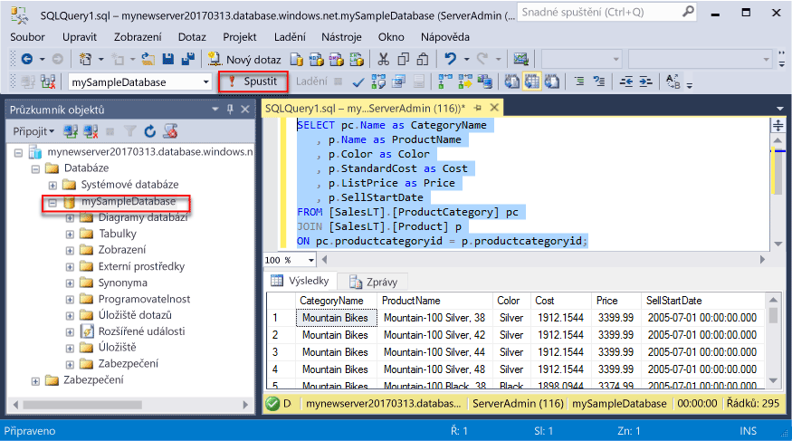
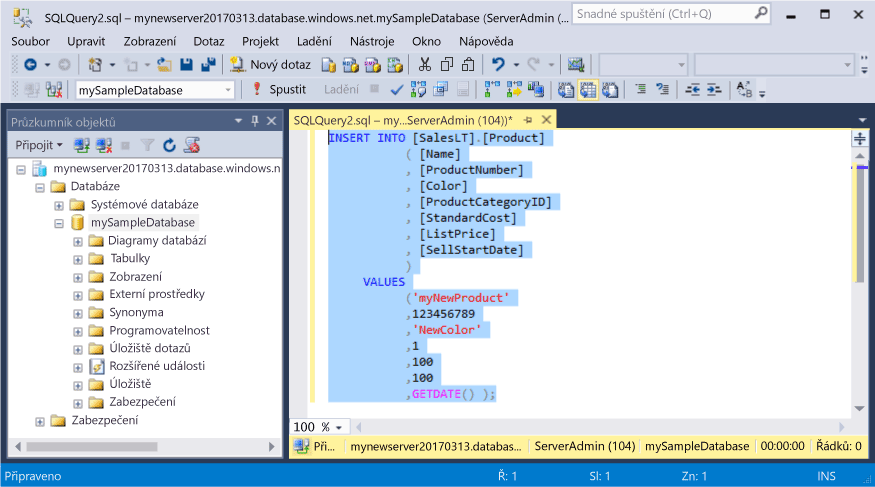
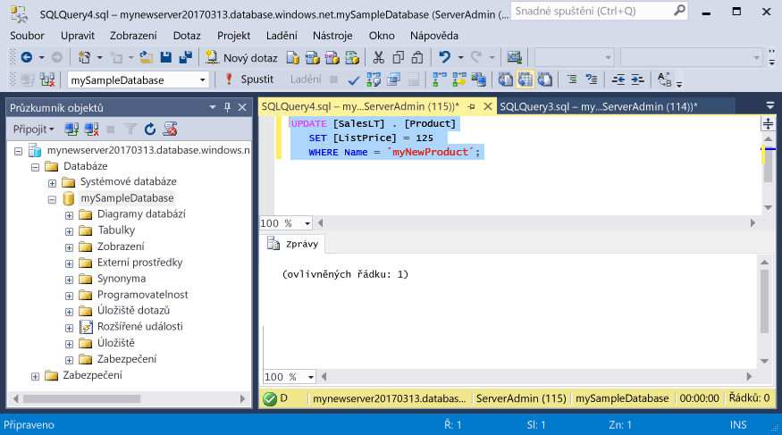
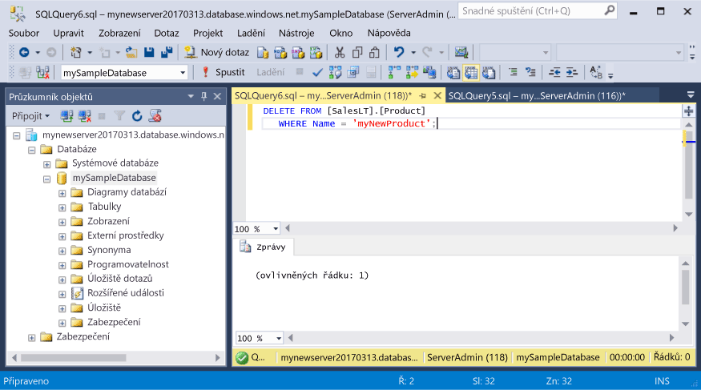

# <a name="azure-sql-database-use-sql-server-management-studio-tooconnect-and-query-data"></a>Azure SQL Database: Pomocí SQL Server Management Studio tooconnect a dotazování dat

[SQL Server Management Studio](https://msdn.microsoft.com/library/ms174173.aspx) (SSMS) je integrované prostředí pro správu jakékoliv infrastruktury, SQL, z tooSQL systému SQL Server databáze pro Microsoft Windows. Tento rychlý start předvádí, jak toouse SSMS tooconnect tooan Azure SQL database a použití jazyka Transact-SQL příkazy tooquery, vložit, aktualizovat a odstranit data v databázi hello. 

## <a name="prerequisites"></a>Požadavky

Tento rychlý start používá jako jeho výchozí prostředky hello bodu vytvořené v jednom z těchto rychlé spuštění:

- [Vytvoření databáze – portál](sql-database-get-started-portal.md)
- [Vytvoření databáze – rozhraní příkazového řádku](sql-database-get-started-cli.md)
- [Vytvoření databáze – PowerShell](sql-database-get-started-powershell.md)

Než začnete, ujistěte se, máte nainstalovanou nejnovější verzi hello [SSMS](https://msdn.microsoft.com/library/mt238290.aspx). 

## <a name="sql-server-connection-information"></a>Informace o připojení k SQL serveru

Získáte hello připojení informace potřebné tooconnect toohello Azure SQL database. Budete potřebovat hello serveru plně kvalifikovaný název, název databáze a přihlašovacích údajů v dalším postupu hello.

1. Přihlaste se toohello [portál Azure](https://portal.azure.com/).
2. Vyberte **databází SQL** z nabídky na levé straně hello a klikněte na tlačítko databáze na hello **databází SQL** stránky. 
3. Na hello **přehled** pro vaši databázi si prohlédněte hello serveru plně kvalifikovaný název, jak ukazuje následující obrázek hello. Můžete podržet přes toobring název serveru hello až hello **klikněte na tlačítko toocopy** možnost.

    

4. Pokud jste zapomněli hello přihlašovací informace pro váš server databáze SQL Azure, přejděte toohello databáze SQL serveru stránky tooview hello serveru správce název a, v případě potřeby obnovit heslo hello. 

## <a name="connect-tooyour-database"></a>Připojit databáze tooyour

Pomocí SQL Server Management Studio tooestablish serveru Azure SQL Database tooyour připojení. 

> [!IMPORTANT]
> Logický server Azure SQL Database naslouchá na portu 1433. Pokud se pokoušíte tooconnect tooan Azure SQL Database logického serveru z podniková brána firewall, musí být tento port otevřít v hello podniková brána firewall pro připojení je toosuccessfully.
>

1. Otevřete SQL Server Management Studio.

2. V hello **připojit tooServer** dialogovém okně zadejte hello následující informace:

   | Nastavení       | Navrhovaná hodnota | Popis | 
   | ------------ | ------------------ | ------------------------------------------------- | 
   | **Typ serveru** | Databázový stroj | Tato hodnota se vyžaduje. |
   | **Název serveru** | název plně kvalifikovaný server Hello | Hello název by měl být přibližně takto: **mynewserver20170313.database.windows.net**. |
   | **Ověřování** | Ověřování SQL Serveru | Ověřování systému SQL je typ hello pouze ověřování, který jsme nakonfigurovali v tomto kurzu. |
   | **Přihlášení** | účet správce serveru Hello | Toto je hello účet, který jste zadali při vytváření hello server. |
   | **Heslo** | Hello heslo pro váš účet správce serveru | Toto je hello heslo, které jste zadali při vytváření hello server. |

     

3. Klikněte na tlačítko **možnosti** v hello **připojit tooserver** dialogové okno. V hello **připojit toodatabase** zadejte **mySampleDatabase** tooconnect toothis databáze.

     

4. Klikněte na **Připojit**. Otevře se okno Průzkumník objektů Hello v aplikaci SSMS. 

     

5. V Průzkumníku objektů rozbalte **databáze** a potom rozbalte **mySampleDatabase** tooview hello objekty v ukázkové databázi hello.

## <a name="query-data"></a>Dotazování dat

Použití hello následující kód tooquery produktů hello prvních 20 počítačů podle kategorie pomocí hello [vyberte](https://msdn.microsoft.com/library/ms189499.aspx) příkazu Transact-SQL.

1. V Průzkumníku objektů klikněte pravým tlačítkem na **mySampleDatabase** a potom klikněte na **Nový dotaz**. Otevře okno prázdné dotazu který je připojený tooyour databáze.
2. V okně dotazu hello zadejte hello následující dotaz:

   ```sql
   SELECT pc.Name as CategoryName, p.name as ProductName
   FROM [SalesLT].[ProductCategory] pc
   JOIN [SalesLT].[Product] p
   ON pc.productcategoryid = p.productcategoryid;
   ```

3. Na panelu nástrojů hello, klikněte na tlačítko **Execute** tooretrieve data z tabulek produktu a ProductCategory hello.

    

## <a name="insert-data"></a>Vložení dat

Použití hello následující kód tooinsert nového produktu do tabulky SalesLT.Product hello pomocí hello [vložit](https://msdn.microsoft.com/library/ms174335.aspx) příkazu Transact-SQL.

1. V okně dotazu hello nahraďte předchozí dotaz hello hello následující dotaz:

   ```sql
   INSERT INTO [SalesLT].[Product]
           ( [Name]
           , [ProductNumber]
           , [Color]
           , [ProductCategoryID]
           , [StandardCost]
           , [ListPrice]
           , [SellStartDate]
           )
     VALUES
           ('myNewProduct'
           ,123456789
           ,'NewColor'
           ,1
           ,100
           ,100
           ,GETDATE() );
   ```

2. Na panelu nástrojů hello, klikněte na tlačítko **Execute** tooinsert nový řádek v tabulce produktu hello.

    

## <a name="update-data"></a>Aktualizace dat

Použití hello následující kód tooupdate hello nového produktu, zda jste dříve přidali pomocí hello [aktualizace](https://msdn.microsoft.com/library/ms177523.aspx) příkazu Transact-SQL.

1. V okně dotazu hello nahraďte předchozí dotaz hello hello následující dotaz:

   ```sql
   UPDATE [SalesLT].[Product]
   SET [ListPrice] = 125
   WHERE Name = 'myNewProduct';
   ```

2. Na panelu nástrojů hello, klikněte na tlačítko **Execute** tooupdate hello zadaný řádek v tabulce produktu hello.

    

## <a name="delete-data"></a>Odstranění dat

Použití hello následující kód toodelete hello nového produktu, zda jste dříve přidali pomocí hello [odstranit](https://msdn.microsoft.com/library/ms189835.aspx) příkazu Transact-SQL.

1. V okně dotazu hello nahraďte předchozí dotaz hello hello následující dotaz:

   ```sql
   DELETE FROM [SalesLT].[Product]
   WHERE Name = 'myNewProduct';
   ```

2. Na panelu nástrojů hello, klikněte na tlačítko **Execute** toodelete hello zadaný řádek v tabulce produktu hello.

    

## <a name="next-steps"></a>Další kroky

- toolearn o vytváření a správě serverů a databází pomocí jazyka Transact-SQL, najdete v části [Další informace o službě Azure SQL Database serverů a databází](sql-database-servers-databases.md).
- Další informace o aplikaci SSMS najdete v tématu [Použití aplikace SQL Server Management Studio](https://msdn.microsoft.com/library/ms174173.aspx).
- tooconnect a dotazu pomocí kódu pro Visual Studio, najdete v části [připojit a zadávat dotazy s Visual Studio Code](sql-database-connect-query-vscode.md).
- tooconnect a dotaz pomocí rozhraní .NET, najdete v části [připojit a zadávat dotazy pomocí .NET](sql-database-connect-query-dotnet.md).
- tooconnect a dotazem jazyka PHP, najdete v části [připojit a zadávat dotazy s PHP](sql-database-connect-query-php.md).
- tooconnect a dotaz pomocí Node.js, najdete v části [připojit a zadávat dotazy s Node.js](sql-database-connect-query-nodejs.md).
- tooconnect a dotazem jazyka Java, najdete v části [připojit a zadávat dotazy s Javou](sql-database-connect-query-java.md).
- tooconnect a dotazem jazyka Python, najdete v části [připojit a zadávat dotazy s Pythonem](sql-database-connect-query-python.md).
- tooconnect a dotazu pomocí Ruby, najdete v části [připojit a zadávat dotazy s Ruby](sql-database-connect-query-ruby.md).
