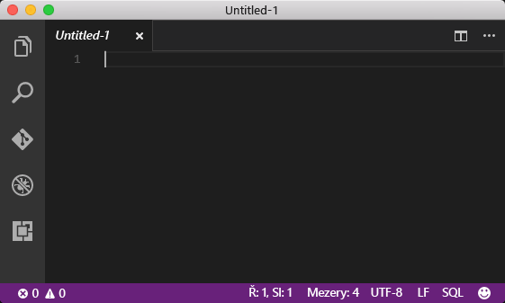
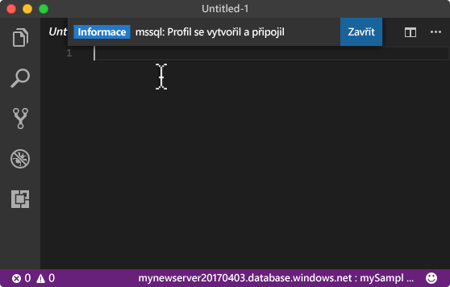
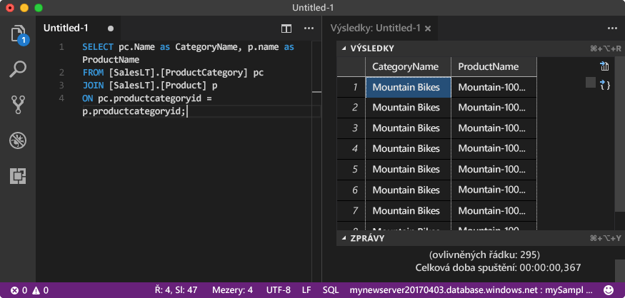

# <a name="azure-sql-database-use-visual-studio-code-tooconnect-and-query-data"></a><span data-ttu-id="44d5d-105">Azure SQL Database: Použití Visual Studio Code tooconnect a dotazování dat</span><span class="sxs-lookup"><span data-stu-id="44d5d-105">Azure SQL Database: Use Visual Studio Code tooconnect and query data</span></span>

<span data-ttu-id="44d5d-106">[Visual Studio Code](https://code.visualstudio.com/docs) je editor grafické kódu pro Linux, systému macOS, a Windows, které podporuje rozšíření, včetně hello [mssql rozšíření](https://aka.ms/mssql-marketplace) k dotazování systému Microsoft SQL Server, Azure SQL Database a SQL Data Warehouse.</span><span class="sxs-lookup"><span data-stu-id="44d5d-106">[Visual Studio Code](https://code.visualstudio.com/docs) is a graphical code editor for Linux, macOS, and Windows that supports extensions, including hello [mssql extension](https://aka.ms/mssql-marketplace) for querying Microsoft SQL Server, Azure SQL Database, and SQL Data Warehouse.</span></span> <span data-ttu-id="44d5d-107">Tento rychlý start předvádí, jak toouse Visual Studio Code tooconnect tooan Azure SQL database a použití jazyka Transact-SQL příkazy tooquery, vložit, aktualizovat a odstranit data v databázi hello.</span><span class="sxs-lookup"><span data-stu-id="44d5d-107">This quick start demonstrates how toouse Visual Studio Code tooconnect tooan Azure SQL database, and then use Transact-SQL statements tooquery, insert, update, and delete data in hello database.</span></span>

## <a name="prerequisites"></a><span data-ttu-id="44d5d-108">Požadavky</span><span class="sxs-lookup"><span data-stu-id="44d5d-108">Prerequisites</span></span>

<span data-ttu-id="44d5d-109">Tento rychlý start používá jako jeho výchozí prostředky hello bodu vytvořené v jednom z těchto rychlé spuštění:</span><span class="sxs-lookup"><span data-stu-id="44d5d-109">This quick start uses as its starting point hello resources created in one of these quick starts:</span></span>

- [<span data-ttu-id="44d5d-110">Vytvoření databáze – portál</span><span class="sxs-lookup"><span data-stu-id="44d5d-110">Create DB - Portal</span></span>](sql-database-get-started-portal.md)
- [<span data-ttu-id="44d5d-111">Vytvoření databáze – rozhraní příkazového řádku</span><span class="sxs-lookup"><span data-stu-id="44d5d-111">Create DB - CLI</span></span>](sql-database-get-started-cli.md)
- [<span data-ttu-id="44d5d-112">Vytvoření databáze – PowerShell</span><span class="sxs-lookup"><span data-stu-id="44d5d-112">Create DB - PowerShell</span></span>](sql-database-get-started-powershell.md)

<span data-ttu-id="44d5d-113">Než začnete, ujistěte se, máte nainstalovanou nejnovější verzi hello [Visual Studio Code](https://code.visualstudio.com/Download) a načíst hello [mssql rozšíření](https://aka.ms/mssql-marketplace).</span><span class="sxs-lookup"><span data-stu-id="44d5d-113">Before you start, make sure you have installed hello newest version of [Visual Studio Code](https://code.visualstudio.com/Download) and loaded hello [mssql extension](https://aka.ms/mssql-marketplace).</span></span> <span data-ttu-id="44d5d-114">Instalační pokyny pro rozšíření mssql hello najdete v tématu [instalaci VS Code](https://docs.microsoft.com/sql/linux/sql-server-linux-develop-use-vscode#install-vs-code) a zobrazit [mssql pro Visual Studio Code](https://marketplace.visualstudio.com/items?itemName=ms-mssql.mssql).</span><span class="sxs-lookup"><span data-stu-id="44d5d-114">For installation guidance for hello mssql extension, see [Install VS Code](https://docs.microsoft.com/sql/linux/sql-server-linux-develop-use-vscode#install-vs-code) and see [mssql for Visual Studio Code](https://marketplace.visualstudio.com/items?itemName=ms-mssql.mssql).</span></span> 

## <a name="configure-vs-code"></a><span data-ttu-id="44d5d-115">Konfigurace VS Code</span><span class="sxs-lookup"><span data-stu-id="44d5d-115">Configure VS Code</span></span> 

### <a name="mac-os"></a><span data-ttu-id="44d5d-116">**Mac OS**</span><span class="sxs-lookup"><span data-stu-id="44d5d-116">**Mac OS**</span></span>
<span data-ttu-id="44d5d-117">U systému macOS je nutné tooinstall OpenSSL, který je předpokladu pro DotNet základní tohoto rozšíření mssql používá.</span><span class="sxs-lookup"><span data-stu-id="44d5d-117">For macOS, you need tooinstall OpenSSL which is a prerequiste for DotNet Core that mssql extention uses.</span></span> <span data-ttu-id="44d5d-118">Otevřete terminálu a zadejte následující příkazy tooinstall hello **brew** a **OpenSSL**.</span><span class="sxs-lookup"><span data-stu-id="44d5d-118">Open your terminal and enter hello following commands tooinstall **brew** and **OpenSSL**.</span></span> 

```bash
ruby -e "$(curl -fsSL https://raw.githubusercontent.com/Homebrew/install/master/install)"
brew update
brew install openssl
mkdir -p /usr/local/lib
ln -s /usr/local/opt/openssl/lib/libcrypto.1.0.0.dylib /usr/local/lib/
ln -s /usr/local/opt/openssl/lib/libssl.1.0.0.dylib /usr/local/lib/
```

### <a name="linux-ubuntu"></a><span data-ttu-id="44d5d-119">**Linux (Ubuntu)**</span><span class="sxs-lookup"><span data-stu-id="44d5d-119">**Linux (Ubuntu)**</span></span>

<span data-ttu-id="44d5d-120">Není potřeba žádná zvláštní konfigurace.</span><span class="sxs-lookup"><span data-stu-id="44d5d-120">No special configuration needed.</span></span>

### <a name="windows"></a><span data-ttu-id="44d5d-121">**Windows**</span><span class="sxs-lookup"><span data-stu-id="44d5d-121">**Windows**</span></span>

<span data-ttu-id="44d5d-122">Není potřeba žádná zvláštní konfigurace.</span><span class="sxs-lookup"><span data-stu-id="44d5d-122">No special configuration needed.</span></span>

## <a name="sql-server-connection-information"></a><span data-ttu-id="44d5d-123">Informace o připojení k SQL serveru</span><span class="sxs-lookup"><span data-stu-id="44d5d-123">SQL server connection information</span></span>

<span data-ttu-id="44d5d-124">Získáte hello připojení informace potřebné tooconnect toohello Azure SQL database.</span><span class="sxs-lookup"><span data-stu-id="44d5d-124">Get hello connection information needed tooconnect toohello Azure SQL database.</span></span> <span data-ttu-id="44d5d-125">Budete potřebovat hello serveru plně kvalifikovaný název, název databáze a přihlašovacích údajů v dalším postupu hello.</span><span class="sxs-lookup"><span data-stu-id="44d5d-125">You will need hello fully qualified server name, database name, and login information in hello next procedures.</span></span>

1. <span data-ttu-id="44d5d-126">Přihlaste se toohello [portál Azure](https://portal.azure.com/).</span><span class="sxs-lookup"><span data-stu-id="44d5d-126">Log in toohello [Azure portal](https://portal.azure.com/).</span></span>
2. <span data-ttu-id="44d5d-127">Vyberte **databází SQL** z nabídky na levé straně hello a klikněte na tlačítko databáze na hello **databází SQL** stránky.</span><span class="sxs-lookup"><span data-stu-id="44d5d-127">Select **SQL Databases** from hello left-hand menu, and click your database on hello **SQL databases** page.</span></span> 
3. <span data-ttu-id="44d5d-128">Na hello **přehled** stránky pro vaši databázi hello zkontrolujte plně kvalifikovaný název serveru, jak ukazuje následující obrázek hello.</span><span class="sxs-lookup"><span data-stu-id="44d5d-128">On hello **Overview** page for your database, review hello fully qualified server name as shown in hello following image.</span></span> <span data-ttu-id="44d5d-129">Můžete podržet přes toobring název serveru hello až hello **klikněte na tlačítko toocopy** možnost.</span><span class="sxs-lookup"><span data-stu-id="44d5d-129">You can hover over hello server name toobring up hello **Click toocopy** option.</span></span>

    

4. <span data-ttu-id="44d5d-131">Pokud jste zapomněli hello přihlašovací informace pro váš server databáze SQL Azure, přejděte toohello databáze SQL serveru stránky tooview hello serveru správce název a, v případě potřeby obnovit heslo hello.</span><span class="sxs-lookup"><span data-stu-id="44d5d-131">If you have forgotten hello login information for your Azure SQL Database server, navigate toohello SQL Database server page tooview hello server admin name and, if necessary, reset hello password.</span></span> 

## <a name="set-language-mode-toosql"></a><span data-ttu-id="44d5d-132">TooSQL režimu jazykové sady</span><span class="sxs-lookup"><span data-stu-id="44d5d-132">Set language mode tooSQL</span></span>

<span data-ttu-id="44d5d-133">Sada hello jazyk režim je nastaven příliš**SQL** ve Visual Studio Code tooenable mssql příkazy a IntelliSense T-SQL.</span><span class="sxs-lookup"><span data-stu-id="44d5d-133">Set hello language mode is set too**SQL** in Visual Studio Code tooenable mssql commands and T-SQL IntelliSense.</span></span>

1. <span data-ttu-id="44d5d-134">Otevřete nové okno nástroje Visual Studio Code.</span><span class="sxs-lookup"><span data-stu-id="44d5d-134">Open a new Visual Studio Code window.</span></span> 

2. <span data-ttu-id="44d5d-135">Klikněte na tlačítko **prostý Text** v hello pravém dolním rohu hello stavový řádek.</span><span class="sxs-lookup"><span data-stu-id="44d5d-135">Click **Plain Text** in hello lower right-hand corner of hello status bar.</span></span>
3. <span data-ttu-id="44d5d-136">V hello **vyberte jazyk režimu** rozevírací nabídky, které se otevře, typ **SQL**a potom stiskněte klávesu **ENTER** tooset hello jazyk režimu tooSQL.</span><span class="sxs-lookup"><span data-stu-id="44d5d-136">In hello **Select language mode** drop-down menu that opens, type **SQL**, and then press **ENTER** tooset hello language mode tooSQL.</span></span> 

   

## <a name="connect-tooyour-database"></a><span data-ttu-id="44d5d-138">Připojit databáze tooyour</span><span class="sxs-lookup"><span data-stu-id="44d5d-138">Connect tooyour database</span></span>

<span data-ttu-id="44d5d-139">Pomocí Visual Studio Code tooestablish serveru Azure SQL Database tooyour připojení.</span><span class="sxs-lookup"><span data-stu-id="44d5d-139">Use Visual Studio Code tooestablish a connection tooyour Azure SQL Database server.</span></span>

> [!IMPORTANT]
> <span data-ttu-id="44d5d-140">Než budete pokračovat, ujistěte se, že máte připravené informace o vašem serveru, databázi a přihlašovacích údajích.</span><span class="sxs-lookup"><span data-stu-id="44d5d-140">Before continuing, make sure that you have your server, database, and login information ready.</span></span> <span data-ttu-id="44d5d-141">Až začnete zadat informace o profilu hello připojení,-li změnit váš výběr z Visual Studio Code, budete mít toorestart vytváření profilu připojení hello.</span><span class="sxs-lookup"><span data-stu-id="44d5d-141">Once you begin entering hello connection profile information, if you change your focus from Visual Studio Code, you have toorestart creating hello connection profile.</span></span>
>

1. <span data-ttu-id="44d5d-142">V produktu VS Code, stiskněte klávesu **CTRL + SHIFT + P** (nebo **F1**) tooopen hello palety příkaz.</span><span class="sxs-lookup"><span data-stu-id="44d5d-142">In VS Code, press **CTRL+SHIFT+P** (or **F1**) tooopen hello Command Palette.</span></span>

2. <span data-ttu-id="44d5d-143">Zadejte **sqlcon** a stiskněte klávesu **ENTER**.</span><span class="sxs-lookup"><span data-stu-id="44d5d-143">Type **sqlcon** and press **ENTER**.</span></span>

3. <span data-ttu-id="44d5d-144">Stiskněte klávesu **ENTER** tooselect **vytvořit profil připojení**.</span><span class="sxs-lookup"><span data-stu-id="44d5d-144">Press **ENTER** tooselect **Create Connection Profile**.</span></span> <span data-ttu-id="44d5d-145">Tím se vytvoří profil připojení pro vaši instanci SQL Serveru.</span><span class="sxs-lookup"><span data-stu-id="44d5d-145">This creates a connection profile for your SQL Server instance.</span></span>

4. <span data-ttu-id="44d5d-146">Postupujte podle vlastnosti připojení hello výzvy toospecify hello pro nový profil připojení hello.</span><span class="sxs-lookup"><span data-stu-id="44d5d-146">Follow hello prompts toospecify hello connection properties for hello new connection profile.</span></span> <span data-ttu-id="44d5d-147">Po zadání jednotlivých hodnot, stiskněte klávesu **ENTER** toocontinue.</span><span class="sxs-lookup"><span data-stu-id="44d5d-147">After specifying each value, press **ENTER** toocontinue.</span></span> 

   | <span data-ttu-id="44d5d-148">Nastavení</span><span class="sxs-lookup"><span data-stu-id="44d5d-148">Setting</span></span>       | <span data-ttu-id="44d5d-149">Navrhovaná hodnota</span><span class="sxs-lookup"><span data-stu-id="44d5d-149">Suggested value</span></span> | <span data-ttu-id="44d5d-150">Popis</span><span class="sxs-lookup"><span data-stu-id="44d5d-150">Description</span></span> |
   | ------------ | ------------------ | ------------------------------------------------- | 
   | <span data-ttu-id="44d5d-151">**Název serveru</span><span class="sxs-lookup"><span data-stu-id="44d5d-151">**Server name</span></span> | <span data-ttu-id="44d5d-152">název plně kvalifikovaný server Hello</span><span class="sxs-lookup"><span data-stu-id="44d5d-152">hello fully qualified server name</span></span> | <span data-ttu-id="44d5d-153">Hello název by měl být přibližně takto: **mynewserver20170313.database.windows.net**.</span><span class="sxs-lookup"><span data-stu-id="44d5d-153">hello name should be something like this: **mynewserver20170313.database.windows.net**.</span></span> |
   | <span data-ttu-id="44d5d-154">**Název databáze**</span><span class="sxs-lookup"><span data-stu-id="44d5d-154">**Database name**</span></span> | <span data-ttu-id="44d5d-155">mySampleDatabase</span><span class="sxs-lookup"><span data-stu-id="44d5d-155">mySampleDatabase</span></span> | <span data-ttu-id="44d5d-156">Název Hello tooconnect toowhich hello databáze.</span><span class="sxs-lookup"><span data-stu-id="44d5d-156">hello name of hello database toowhich tooconnect.</span></span> |
   | <span data-ttu-id="44d5d-157">**Ověřování**</span><span class="sxs-lookup"><span data-stu-id="44d5d-157">**Authentication**</span></span> | <span data-ttu-id="44d5d-158">Přihlášení k SQL serveru</span><span class="sxs-lookup"><span data-stu-id="44d5d-158">SQL Login</span></span>| <span data-ttu-id="44d5d-159">Ověřování systému SQL je typ hello pouze ověřování, který jsme nakonfigurovali v tomto kurzu.</span><span class="sxs-lookup"><span data-stu-id="44d5d-159">SQL Authentication is hello only authentication type that we have configured in this tutorial.</span></span> |
   | <span data-ttu-id="44d5d-160">**Uživatelské jméno**</span><span class="sxs-lookup"><span data-stu-id="44d5d-160">**User name**</span></span> | <span data-ttu-id="44d5d-161">účet správce serveru Hello</span><span class="sxs-lookup"><span data-stu-id="44d5d-161">hello server admin account</span></span> | <span data-ttu-id="44d5d-162">Toto je hello účet, který jste zadali při vytváření hello server.</span><span class="sxs-lookup"><span data-stu-id="44d5d-162">This is hello account that you specified when you created hello server.</span></span> |
   | <span data-ttu-id="44d5d-163">**Heslo (Přihlášení SQL)**</span><span class="sxs-lookup"><span data-stu-id="44d5d-163">**Password (SQL Login)**</span></span> | <span data-ttu-id="44d5d-164">Hello heslo pro váš účet správce serveru</span><span class="sxs-lookup"><span data-stu-id="44d5d-164">hello password for your server admin account</span></span> | <span data-ttu-id="44d5d-165">Toto je hello heslo, které jste zadali při vytváření hello server.</span><span class="sxs-lookup"><span data-stu-id="44d5d-165">This is hello password that you specified when you created hello server.</span></span> |
   | <span data-ttu-id="44d5d-166">**Uložit heslo?**</span><span class="sxs-lookup"><span data-stu-id="44d5d-166">**Save Password?**</span></span> | <span data-ttu-id="44d5d-167">Ano nebo Ne</span><span class="sxs-lookup"><span data-stu-id="44d5d-167">Yes or No</span></span> | <span data-ttu-id="44d5d-168">Pokud nechcete, aby heslo hello tooenter pokaždé, když, vyberte možnost Ano.</span><span class="sxs-lookup"><span data-stu-id="44d5d-168">Select Yes if you do not want tooenter hello password each time.</span></span> |
   | <span data-ttu-id="44d5d-169">**Zadejte název pro tento profil.**</span><span class="sxs-lookup"><span data-stu-id="44d5d-169">**Enter a name for this profile**</span></span> | <span data-ttu-id="44d5d-170">Název profilu, jako například **mySampleDatabase**</span><span class="sxs-lookup"><span data-stu-id="44d5d-170">A profile name, such as **mySampleDatabase**</span></span> | <span data-ttu-id="44d5d-171">Pokud uložíte název profilu, zrychlíte připojování k dalším přihlašovacím profilům.</span><span class="sxs-lookup"><span data-stu-id="44d5d-171">A saved profile name speeds your connection on subsequent logins.</span></span> | 

5. <span data-ttu-id="44d5d-172">Stiskněte klávesu hello **ESC** klíče tooclose hello informační zpráva informující o tom, že hello profil je vytvořen a připojené.</span><span class="sxs-lookup"><span data-stu-id="44d5d-172">Press hello **ESC** key tooclose hello info message that informs you that hello profile is created and connected.</span></span>

6. <span data-ttu-id="44d5d-173">Ověření připojení ve stavovém hello.</span><span class="sxs-lookup"><span data-stu-id="44d5d-173">Verify your connection in hello status bar.</span></span>

   

## <a name="query-data"></a><span data-ttu-id="44d5d-175">Dotazování dat</span><span class="sxs-lookup"><span data-stu-id="44d5d-175">Query data</span></span>

<span data-ttu-id="44d5d-176">Použití hello následující kód tooquery produktů hello prvních 20 počítačů podle kategorie pomocí hello [vyberte](https://msdn.microsoft.com/library/ms189499.aspx) příkazu Transact-SQL.</span><span class="sxs-lookup"><span data-stu-id="44d5d-176">Use hello following code tooquery for hello top 20 products by category using hello [SELECT](https://msdn.microsoft.com/library/ms189499.aspx) Transact-SQL statement.</span></span>

1. <span data-ttu-id="44d5d-177">V hello **Editor** okno, zadejte následující dotaz v okně dotazu prázdný hello hello:</span><span class="sxs-lookup"><span data-stu-id="44d5d-177">In hello **Editor** window, enter hello following query in hello empty query window:</span></span>

   ```sql
   SELECT pc.Name as CategoryName, p.name as ProductName
   FROM [SalesLT].[ProductCategory] pc
   JOIN [SalesLT].[Product] p
   ON pc.productcategoryid = p.productcategoryid;
   ```

2. <span data-ttu-id="44d5d-178">Stiskněte klávesu **CTRL + SHIFT + E** tooretrieve data z tabulek produktu a ProductCategory hello.</span><span class="sxs-lookup"><span data-stu-id="44d5d-178">Press **CTRL+SHIFT+E** tooretrieve data from hello Product and ProductCategory tables.</span></span>

    

## <a name="insert-data"></a><span data-ttu-id="44d5d-180">Vložení dat</span><span class="sxs-lookup"><span data-stu-id="44d5d-180">Insert data</span></span>

<span data-ttu-id="44d5d-181">Použití hello následující kód tooinsert nového produktu do tabulky SalesLT.Product hello pomocí hello [vložit](https://msdn.microsoft.com/library/ms174335.aspx) příkazu Transact-SQL.</span><span class="sxs-lookup"><span data-stu-id="44d5d-181">Use hello following code tooinsert a new product into hello SalesLT.Product table using hello [INSERT](https://msdn.microsoft.com/library/ms174335.aspx) Transact-SQL statement.</span></span>

1. <span data-ttu-id="44d5d-182">V hello **Editor** okně hello předchozí dotaz odstranit a zadejte hello následující dotaz:</span><span class="sxs-lookup"><span data-stu-id="44d5d-182">In hello **Editor** window, delete hello previous query and enter hello following query:</span></span>

   ```sql
   INSERT INTO [SalesLT].[Product]
           ( [Name]
           , [ProductNumber]
           , [Color]
           , [ProductCategoryID]
           , [StandardCost]
           , [ListPrice]
           , [SellStartDate]
           )
     VALUES
           ('myNewProduct'
           ,123456789
           ,'NewColor'
           ,1
           ,100
           ,100
           ,GETDATE() );
   ```

2. <span data-ttu-id="44d5d-183">Stiskněte klávesu **CTRL + SHIFT + E** tooinsert nový řádek v tabulce produktu hello.</span><span class="sxs-lookup"><span data-stu-id="44d5d-183">Press **CTRL+SHIFT+E** tooinsert a new row in hello Product table.</span></span>

## <a name="update-data"></a><span data-ttu-id="44d5d-184">Aktualizace dat</span><span class="sxs-lookup"><span data-stu-id="44d5d-184">Update data</span></span>

<span data-ttu-id="44d5d-185">Použití hello následující kód tooupdate hello nového produktu, zda jste dříve přidali pomocí hello [aktualizace](https://msdn.microsoft.com/library/ms177523.aspx) příkazu Transact-SQL.</span><span class="sxs-lookup"><span data-stu-id="44d5d-185">Use hello following code tooupdate hello new product that you previously added using hello [UPDATE](https://msdn.microsoft.com/library/ms177523.aspx) Transact-SQL statement.</span></span>

1.  <span data-ttu-id="44d5d-186">V hello **Editor** okně hello předchozí dotaz odstranit a zadejte hello následující dotaz:</span><span class="sxs-lookup"><span data-stu-id="44d5d-186">In hello **Editor** window, delete hello previous query and enter hello following query:</span></span>

   ```sql
   UPDATE [SalesLT].[Product]
   SET [ListPrice] = 125
   WHERE Name = 'myNewProduct';
   ```

2. <span data-ttu-id="44d5d-187">Stiskněte klávesu **CTRL + SHIFT + E** tooupdate hello zadaný řádek v tabulce produktu hello.</span><span class="sxs-lookup"><span data-stu-id="44d5d-187">Press **CTRL+SHIFT+E** tooupdate hello specified row in hello Product table.</span></span>

## <a name="delete-data"></a><span data-ttu-id="44d5d-188">Odstranění dat</span><span class="sxs-lookup"><span data-stu-id="44d5d-188">Delete data</span></span>

<span data-ttu-id="44d5d-189">Použití hello následující kód toodelete hello nového produktu, zda jste dříve přidali pomocí hello [odstranit](https://msdn.microsoft.com/library/ms189835.aspx) příkazu Transact-SQL.</span><span class="sxs-lookup"><span data-stu-id="44d5d-189">Use hello following code toodelete hello new product that you previously added using hello [DELETE](https://msdn.microsoft.com/library/ms189835.aspx) Transact-SQL statement.</span></span>

1. <span data-ttu-id="44d5d-190">V hello **Editor** okně hello předchozí dotaz odstranit a zadejte hello následující dotaz:</span><span class="sxs-lookup"><span data-stu-id="44d5d-190">In hello **Editor** window, delete hello previous query and enter hello following query:</span></span>

   ```sql
   DELETE FROM [SalesLT].[Product]
   WHERE Name = 'myNewProduct';
   ```

2. <span data-ttu-id="44d5d-191">Stiskněte klávesu **CTRL + SHIFT + E** toodelete hello zadaný řádek v tabulce produktu hello.</span><span class="sxs-lookup"><span data-stu-id="44d5d-191">Press **CTRL+SHIFT+E** toodelete hello specified row in hello Product table.</span></span>

## <a name="next-steps"></a><span data-ttu-id="44d5d-192">Další kroky</span><span class="sxs-lookup"><span data-stu-id="44d5d-192">Next steps</span></span>

- <span data-ttu-id="44d5d-193">tooconnect a dotazu pomocí SQL Server Management Studio, najdete v části [připojit a zadávat dotazy pomocí SSMS](sql-database-connect-query-ssms.md).</span><span class="sxs-lookup"><span data-stu-id="44d5d-193">tooconnect and query using SQL Server Management Studio, see [Connect and query with SSMS](sql-database-connect-query-ssms.md).</span></span>
- <span data-ttu-id="44d5d-194">Článek z časopisu MSDN o použití editoru Visual Studio Code najdete v blogovém příspěvku [Vytvoření databáze IDE s rozšířením MSSQL](https://msdn.microsoft.com/magazine/mt809115).</span><span class="sxs-lookup"><span data-stu-id="44d5d-194">For an MSDN magazine article on using Visual Studio Code, see [Create a database IDE with MSSQL extension blog post](https://msdn.microsoft.com/magazine/mt809115).</span></span>
