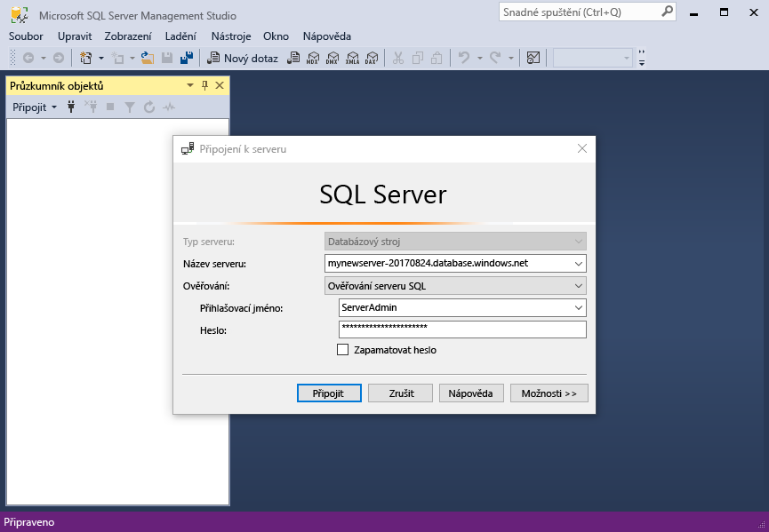
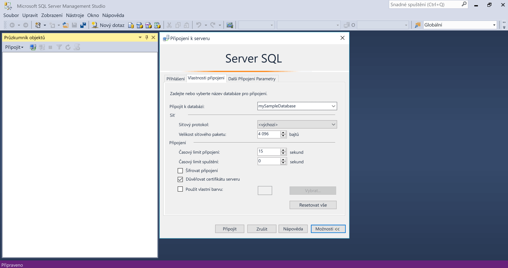
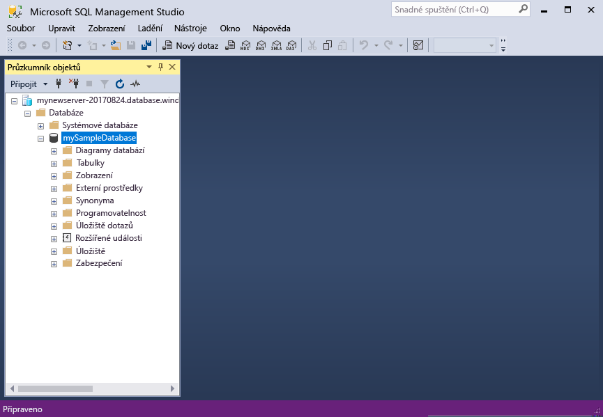

# <a name="design-your-first-azure-sql-database"></a>Návrh svoji první databázi Azure SQL

Databáze SQL Azure je relační databáze jako a služba (DBaaS) v hello cloudu Microsoftu ("Azure"). V tomto kurzu zjistíte, jak toouse hello portál Azure a [SQL Server Management Studio](https://msdn.microsoft.com/library/ms174173.aspx) (SSMS) na: 

> [!div class="checklist"]
> * Vytvoření databáze v hello portálu Azure
> * Nastavit pravidlo brány firewall na úrovni serveru v hello portálu Azure
> * Připojit databáze toohello pomocí SSMS
> * Vytváření tabulek pomocí SSMS
> * Hromadné načtení dat pomocí BCP
> * Dotaz na data pomocí SSMS
> * Obnovit předchozí tooa databáze hello [obnovení bodu v čase](sql-database-recovery-using-backups.md#point-in-time-restore) v hello portálu Azure

Pokud nemáte předplatné Azure, [vytvořit bezplatný účet](https://azure.microsoft.com/free/) před zahájením.

## <a name="prerequisites"></a>Požadavky

toocomplete tento kurz, zkontrolujte zda jste nainstalovali:
- nejnovější verze Hello [SQL Server Management Studio](https://msdn.microsoft.com/library/ms174173.aspx) (SSMS).
- nejnovější verze Hello [BCP a SQLCMD](https://www.microsoft.com/download/details.aspx?id=36433).

## <a name="log-in-toohello-azure-portal"></a>Přihlaste se toohello portálu Azure

Přihlaste se toohello [portál Azure](https://portal.azure.com/).

## <a name="create-a-blank-sql-database"></a>Vytvořit prázdnou databázi SQL

Databáze SQL Azure se vytvoří s definovanou sadou [výpočetních prostředků a prostředků úložiště](sql-database-service-tiers.md). Hello databáze byla vytvořena v rámci [skupina prostředků Azure](../azure-resource-manager/resource-group-overview.md) a v [logického serveru Azure SQL Database](sql-database-features.md). 

Postupujte podle těchto kroků toocreate prázdnou databázi SQL. 

1. Klikněte na tlačítko hello **nový** nalezeno tlačítko na hello levém horním rohu hello portálu Azure.

2. Vyberte **databáze** z hello **nový** a vyberte **SQL Database** z hello **databáze** stránky. 

   

3. Vyplňte hello SQL Database formulář s hello následující informace, jak je znázorněno na hello předcházející bitové kopie:   

   | Nastavení       | Navrhovaná hodnota | Popis | 
   | ------------ | ------------------ | ------------------------------------------------- | 
   | **Název databáze** | mySampleDatabase | Platné názvy databází najdete v tématu [Identifikátory databází](https://docs.microsoft.com/sql/relational-databases/databases/database-identifiers). | 
   | **Předplatné** | Vaše předplatné  | Podrobnosti o vašich předplatných najdete v tématu [Předplatná](https://account.windowsazure.com/Subscriptions). |
   | **Skupina prostředků** | myResourceGroup | Platné názvy skupin prostředků najdete v tématu [Pravidla a omezení pojmenování](https://docs.microsoft.com/azure/architecture/best-practices/naming-conventions). |
   | **Vyberte zdroj** | Prázdnou databázi | Určuje, že by měl být vytvořen prázdnou databázi. |

4. Klikněte na tlačítko **Server** toocreate a nakonfigurujte nový server pro novou databázi. Vyplňte hello **nového formuláře serveru** s hello následující informace: 

   | Nastavení       | Navrhovaná hodnota | Popis | 
   | ------------ | ------------------ | ------------------------------------------------- | 
   | **Název serveru** | Libovolný globálně jedinečný název | Platné názvy serverů najdete v tématu [Pravidla a omezení pojmenování](https://docs.microsoft.com/azure/architecture/best-practices/naming-conventions). | 
   | **Přihlašovací jméno správce serveru** | Libovolné platné jméno | Platná přihlašovací jména najdete v tématu [Identifikátory databází](https://docs.microsoft.com/sql/relational-databases/databases/database-identifiers).|
   | **Heslo** | Libovolné platné heslo | Heslo musí mít aspoň 8 znaků a musí obsahovat znaky ze tří z následujících kategorií hello: velká písmena, malá písmena, číslice a jiné než alfanumerické znaky. |
   | **Umístění** | Libovolné platné umístění | Informace o oblastech najdete v tématu [Oblasti služeb Azure](https://azure.microsoft.com/regions/). |

   

5. Klikněte na **Vybrat**.

6. Klikněte na tlačítko **cenová úroveň** toospecify hello služby vrstvy a úroveň výkonu pro novou databázi. V tomto kurzu vyberte **20 Dtu** a **250** GB úložiště.

   

7. Klikněte na tlačítko **Použít**.  

8. Vyberte **kolace** pro prázdnou databázi hello (pro tento kurz použijte hello výchozí hodnota). Další informace o kolacích najdete v tématu [kolace](https://docs.microsoft.com/sql/t-sql/statements/collations)

9. Klikněte na tlačítko **vytvořit** tooprovision hello databáze. Zřizování trvá o minutu a půl toocomplete. 

10. Na panelu nástrojů hello, klikněte na tlačítko **oznámení** procesu nasazení toomonitor hello.

   

## <a name="create-a-server-level-firewall-rule"></a>Vytvoření pravidla brány firewall na úrovni serveru

Hello služba SQL Database vytvoří brána firewall na serveru – úrovni hello, které zabrání připojení toohello serveru nebo kterékoli databázi na serveru hello, pokud je vytvořeno pravidlo brány firewall tooopen hello brány firewall pro konkrétní IP adresy externí aplikace a nástroje. Postupujte podle těchto kroků toocreate [pravidlo brány firewall na úrovni serveru SQL Database](sql-database-firewall-configure.md) pro vašeho klienta IP adres a povolte externí připojení přes firewall hello databáze SQL pro vaše IP adresa. 

> [!NOTE]
> SQL Database komunikuje přes port 1433. Pokud se pokoušíte tooconnect z podnikové sítě, odchozí provoz přes port 1433 nemusí mít povolený bránou firewall vaší sítě. Pokud ano, nemůžete připojit tooyour serveru Azure SQL Database, pokud vaše IT oddělení otevře port 1433.
>

1. Po dokončení hello nasazení, klikněte na tlačítko **databází SQL** z nabídky na levé straně hello a pak klikněte na tlačítko **mySampleDatabase** na hello **databází SQL** stránky. Hello přehledová stránka otevře vaší databáze, zobrazující text hello plně kvalifikovaný název serveru (například **mynewserver20170313.database.windows.net**) a poskytuje možnosti pro další konfiguraci. Tento plně kvalifikovaný název serveru zkopírujte pro pozdější použití.

   > [!IMPORTANT]
   > Je nutné tento plně kvalifikovaný název tooconnect tooyour serveru a její databáze v následných rychlé zahájení.
   > 

    

2. Klikněte na tlačítko **nastavení brány firewall serveru** na panelu nástrojů hello viz předchozí obrázek hello. Hello **nastavení brány Firewall** otevře se stránka pro hello databáze SQL server. 

    


3. Klikněte na tlačítko **přidat IP adresu klienta** na panelu nástrojů tooadd hello vaše aktuální IP adres tooa nové pravidlo brány firewall. Pravidlo brány firewall může otevřít port 1433 pro jednu IP adresu nebo rozsah IP adres.

4. Klikněte na **Uložit**. Pro aktuální IP adrese otevřít port 1433 na logickém serveru hello je vytvořeno pravidlo brány firewall na úrovni serveru.

    

4. Klikněte na tlačítko **OK** a pak zavřete hello **nastavení brány Firewall** stránky.

Teď se můžete připojit toohello databáze SQL server a její databáze pomocí SQL Server Management Studio nebo jiný nástroj podle svého výběru z tuto IP adresu pomocí účtu správce serveru hello vytvořili dříve.

> [!IMPORTANT]
> Standardně je povolen přístup přes bránu firewall hello databáze SQL pro všechny služby Azure. Klikněte na tlačítko **OFF** na této stránce toodisable pro všechny služby Azure.

## <a name="sql-server-connection-information"></a>Informace o připojení k SQL serveru

Získáte hello serveru plně kvalifikovaný název pro váš server Azure SQL Database v hello portálu Azure. Použijete hello plně kvalifikovaný název tooconnect tooyour serveru pomocí SQL Server Management Studio.

1. Přihlaste se toohello [portál Azure](https://portal.azure.com/).
2. Vyberte **databází SQL** z nabídky na levé straně hello a klikněte na tlačítko databáze na hello **databází SQL** stránky. 
3. V hello **Essentials** podokně hello Azure stránky portálu pro vaši databázi, vyhledejte a pak zkopírujte hello **název serveru**.

   

## <a name="connect-toohello-database-with-ssms"></a>Připojit databáze toohello pomocí SSMS

Použití [SQL Server Management Studio](https://docs.microsoft.com/sql/ssms/sql-server-management-studio-ssms) tooestablish serveru Azure SQL Database tooyour připojení.

1. Otevřete SQL Server Management Studio.

2. V hello **připojit tooServer** dialogovém okně zadejte hello následující informace:

   | Nastavení       | Navrhovaná hodnota | Popis | 
   | ------------ | ------------------ | ------------------------------------------------- | 
   | Typ serveru | Databázový stroj | Tato hodnota je povinná. |
   | Název serveru | název plně kvalifikovaný server Hello | Hello název by měl být přibližně takto: **mynewserver20170313.database.windows.net**. |
   | Authentication | Ověřování SQL Serveru | Ověřování systému SQL je typ hello pouze ověřování, který jsme nakonfigurovali v tomto kurzu. |
   | Přihlásit | účet správce serveru Hello | Toto je hello účet, který jste zadali při vytváření hello server. |
   | Heslo | Hello heslo pro váš účet správce serveru | Toto je hello heslo, které jste zadali při vytváření hello server. |

   

3. Klikněte na tlačítko **možnosti** v hello **připojit tooserver** dialogové okno. V hello **připojit toodatabase** zadejte **mySampleDatabase** tooconnect toothis databáze.

     

4. Klikněte na **Připojit**. Otevře se okno Průzkumník objektů Hello v aplikaci SSMS. 

5. V Průzkumníku objektů rozbalte **databáze** a potom rozbalte **mySampleDatabase** tooview hello objekty v ukázkové databázi hello.

     

## <a name="create-tables-in-hello-database"></a>Vytváření tabulek v databázi hello 

Vytvořte schéma databáze s čtyři tabulek, které model student systém správy pro použití vysoké školy [Transact-SQL](https://docs.microsoft.com/sql/t-sql/language-reference):

- Osoba
- Kurz
- Studenty
- Úvěrového tohoto modelu systém správy student pro vysoké školy

Hello následující diagram znázorňuje jak Tyhle tabulky jsou související tooeach jiné. Některé z těchto tabulek odkazovat na sloupce v jiné tabulky. Například hello Student tabulka odkazuje na hello **PersonId** sloupec hello **osoba** tabulky. Studie hello diagram toounderstand jak hello tabulky v tomto kurzu jsou související tooone jiné. Pro podrobný rozbor toho, jak toocreate efektivní databázových tabulek, najdete v části [vytvořit efektivní databázových tabulek](https://msdn.microsoft.com/library/cc505842.aspx). Informace o výběru datových typů najdete v tématu [datové typy](https://docs.microsoft.com/sql/t-sql/data-types/data-types-transact-sql).

> [!NOTE]
> Můžete taky hello [návrháře tabulky v aplikaci SQL Server Management Studio](https://msdn.microsoft.com/library/hh272695.aspx) toocreate a tabulek. 


1. V Průzkumníku objektů klikněte pravým tlačítkem na **mySampleDatabase** a potom klikněte na **Nový dotaz**. Otevře okno prázdné dotazu který je připojený tooyour databáze.

2. V okně dotazu hello spusťte následující dotaz toocreate čtyři tabulek v databázi hello: 

   ```sql 
   -- Create Person table

   CREATE TABLE Person
   (
   PersonId   INT IDENTITY PRIMARY KEY,
   FirstName   NVARCHAR(128) NOT NULL,
   MiddelInitial NVARCHAR(10),
   LastName   NVARCHAR(128) NOT NULL,
   DateOfBirth   DATE NOT NULL
   )
   
   -- Create Student table
 
   CREATE TABLE Student
   (
   StudentId INT IDENTITY PRIMARY KEY,
   PersonId  INT REFERENCES Person (PersonId),
   Email   NVARCHAR(256)
   )
   
   -- Create Course table
 
   CREATE TABLE Course
   (
   CourseId  INT IDENTITY PRIMARY KEY,
   Name   NVARCHAR(50) NOT NULL,
   Teacher   NVARCHAR(256) NOT NULL
   ) 

   -- Create Credit table
 
   CREATE TABLE Credit
   (
   StudentId   INT REFERENCES Student (StudentId),
   CourseId   INT REFERENCES Course (CourseId),
   Grade   DECIMAL(5,2) CHECK (Grade <= 100.00),
   Attempt   TINYINT,
   CONSTRAINT  [UQ_studentgrades] UNIQUE CLUSTERED
   (
   StudentId, CourseId, Grade, Attempt
   )
   )
   ```

   

3. Rozbalte uzel 'tabulky' hello hello objekt SQL Server Management Studio Průzkumníka toosee hello tabulek, které jste vytvořili.

   

## <a name="load-data-into-hello-tables"></a>Načtení dat do tabulky hello

1. Vytvořte složku s názvem **SampleTableData** v vaše soubory ke stažení složky toostore ukázková data pro vaši databázi. 

2. Klikněte pravým tlačítkem na hello následující odkazy a uložit je do hello **SampleTableData** složky. 

   - [SampleCourseData](https://sqldbtutorial.blob.core.windows.net/tutorials/SampleCourseData)
   - [SamplePersonData](https://sqldbtutorial.blob.core.windows.net/tutorials/SamplePersonData)
   - [SampleStudentData](https://sqldbtutorial.blob.core.windows.net/tutorials/SampleStudentData)
   - [SampleCreditData](https://sqldbtutorial.blob.core.windows.net/tutorials/SampleCreditData)

3. Otevřete okno příkazového řádku a přejděte toohello SampleTableData složky.

4. Spustit následující příkazy tooinsert ukázková data do tabulek hello nahrazení hodnoty hello hello **ServerName**, **DatabaseName**, **uživatelské jméno**a **Heslo** hello hodnotami pro vaše prostředí.
  
   ```bcp
   bcp Course in SampleCourseData -S <ServerName>.database.windows.net -d <DatabaseName> -U <Username> -P <password> -q -c -t ","
   bcp Person in SamplePersonData -S <ServerName>.database.windows.net -d <DatabaseName> -U <Username> -P <password> -q -c -t ","
   bcp Student in SampleStudentData -S <ServerName>.database.windows.net -d <DatabaseName> -U <Username> -P <password> -q -c -t ","
   bcp Credit in SampleCreditData -S <ServerName>.database.windows.net -d <DatabaseName> -U <Username> -P <password> -q -c -t ","
   ```

Ukázková data mají nyní načtena do hello tabulek, které jste vytvořili dříve.

## <a name="query-data"></a>Dotazování dat

Spusťte hello následujících dotazy tooretrieve informace z hello databázových tabulek. V tématu [zápis dotazů SQL](https://technet.microsoft.com/library/bb264565.aspx) toolearn více informací o zápis dotazů SQL. první dotaz Hello spojí všechny čtyři tabulky toofind, které všechny studenty hello výukové podle ' Dominick Pope, kdo mají vyšší než 75 % úrovni ve své třídě. druhý dotaz Hello připojí všechny čtyři tabulky a vyhledá všechny kurzy, ve kterých má někdy zapsaná 'Noe Colemane'.

1. V okně dotazu SQL Server Management Studio spusťte následující dotaz hello:

   ```sql 
   -- Find hello students taught by Dominick Pope who have a grade higher than 75%

   SELECT  person.FirstName,
   person.LastName,
   course.Name,
   credit.Grade
   FROM  Person AS person
   INNER JOIN Student AS student ON person.PersonId = student.PersonId
   INNER JOIN Credit AS credit ON student.StudentId = credit.StudentId
   INNER JOIN Course AS course ON credit.CourseId = course.courseId
   WHERE course.Teacher = 'Dominick Pope' 
   AND Grade > 75
   ```

2. V okně dotazu SQL Server Management Studio spusťte následující dotaz:

   ```sql
   -- Find all hello courses in which Noe Coleman has ever enrolled

   SELECT  course.Name,
   course.Teacher,
   credit.Grade
   FROM  Course AS course
   INNER JOIN Credit AS credit ON credit.CourseId = course.CourseId
   INNER JOIN Student AS student ON student.StudentId = credit.StudentId
   INNER JOIN Person AS person ON person.PersonId = student.PersonId
   WHERE person.FirstName = 'Noe'
   AND person.LastName = 'Coleman'
   ```

## <a name="restore-a-database-tooa-previous-point-in-time"></a>Obnovit do databáze tooa předchozího bodu v čase

Představte si, že jste omylem odstranili tabulku. Toto je něco, které nelze snadno obnovit z. Databáze SQL Azure vám umožní toogo back tooany bodu v čase v hello poslední až too35 dnů a obnovit tento bod v čas tooa novou databázi. Můžete tuto databázi toorecover odstraněná data. Hello následující kroky hello ukázkové databáze tooa bod obnovení než byly přidány hello tabulky.

1. Na stránce hello databáze SQL pro vaši databázi, klikněte na **obnovení** na panelu nástrojů hello. Hello **obnovení** otevře se stránka.

   

2. Vyplňte hello **obnovení** formulář hello požadované informace:
    * Název databáze: Zadejte název databáze. 
    * Bodu v čase: Vyberte hello **v daném okamžiku** kartě ve formuláři obnovení hello 
    * Bod obnovení: vyberte časový interval, který se vyskytuje před hello databáze byl změněn.
    * Cílový server: tuto hodnotu nelze změnit, při obnovení databáze 
    * Fond elastické databáze: vyberte **None**  
    * Cenová úroveň: vyberte **20 Dtu** a **250 GB** úložiště.

   

3. Klikněte na tlačítko **OK** toorestore hello databáze příliš[obnovit tooa bodu v čase](sql-database-recovery-using-backups.md#point-in-time-restore) předtím, než byly přidány hello tabulky. Obnovení do databáze tooa jiného bodu v čase vytvoří duplicitní databázi v hello stejný server jako původní databáze hello od hello bodu v čase zadáte, dokud je v rámci hello dobu uchování vašeho [vrstvy služby](sql-database-service-tiers.md).

## <a name="next-steps"></a>Další kroky 
V tomto kurzu jste se dozvěděli, že databáze basic úlohy, jako například vytvořit databáze a tabulky, načítat a zadávat dotazy na data a obnovit hello databáze tooa předchozího bodu v čase. Naučili jste se tyto postupy:
> [!div class="checklist"]
> * Vytvoření databáze
> * Nastavit pravidlo brány firewall
> * Připojit databáze toohello s [SQL Server Management Studio](https://msdn.microsoft.com/library/ms174173.aspx) (SSMS)
> * Vytváření tabulek
> * Hromadné načítání dat
> * Dotaz na data
> * Obnovit hello databáze tooa předchozího bodu v čase pomocí SQL Database [obnovení bodu v čase](sql-database-recovery-using-backups.md#point-in-time-restore) možnosti

Posunutí další kurz toolearn toohello o návrhu databáze pomocí sady Visual Studio a C#.

> [!div class="nextstepaction"]
>[Návrh Azure SQL database a připojení s C# a ADO.NET](sql-database-design-first-database-csharp.md)
