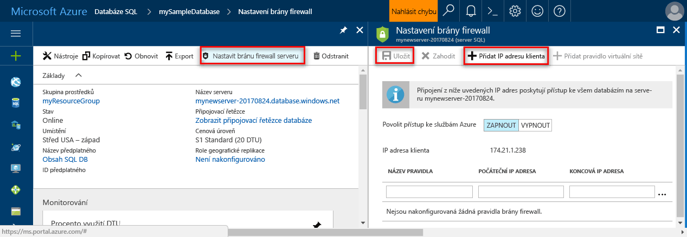

# <a name="design-your-first-azure-sql-database"></a><span data-ttu-id="2c052-103">Návrh svoji první databázi Azure SQL</span><span class="sxs-lookup"><span data-stu-id="2c052-103">Design your first Azure SQL database</span></span>

<span data-ttu-id="2c052-104">Databáze SQL Azure je relační databáze jako a služba (DBaaS) v hello cloudu Microsoftu ("Azure").</span><span class="sxs-lookup"><span data-stu-id="2c052-104">Azure SQL Database is a relational database-as-a service (DBaaS) in hello Microsoft Cloud ("Azure").</span></span> <span data-ttu-id="2c052-105">V tomto kurzu zjistíte, jak toouse hello portál Azure a [SQL Server Management Studio](https://msdn.microsoft.com/library/ms174173.aspx) (SSMS) na:</span><span class="sxs-lookup"><span data-stu-id="2c052-105">In this tutorial, you learn how toouse hello Azure portal and [SQL Server Management Studio](https://msdn.microsoft.com/library/ms174173.aspx) (SSMS) to:</span></span> 

> [!div class="checklist"]
> * <span data-ttu-id="2c052-106">Vytvoření databáze v hello portálu Azure</span><span class="sxs-lookup"><span data-stu-id="2c052-106">Create a database in hello Azure portal</span></span>
> * <span data-ttu-id="2c052-107">Nastavit pravidlo brány firewall na úrovni serveru v hello portálu Azure</span><span class="sxs-lookup"><span data-stu-id="2c052-107">Set up a server-level firewall rule in hello Azure portal</span></span>
> * <span data-ttu-id="2c052-108">Připojit databáze toohello pomocí SSMS</span><span class="sxs-lookup"><span data-stu-id="2c052-108">Connect toohello database with SSMS</span></span>
> * <span data-ttu-id="2c052-109">Vytváření tabulek pomocí SSMS</span><span class="sxs-lookup"><span data-stu-id="2c052-109">Create tables with SSMS</span></span>
> * <span data-ttu-id="2c052-110">Hromadné načtení dat pomocí BCP</span><span class="sxs-lookup"><span data-stu-id="2c052-110">Bulk load data with BCP</span></span>
> * <span data-ttu-id="2c052-111">Dotaz na data pomocí SSMS</span><span class="sxs-lookup"><span data-stu-id="2c052-111">Query that data with SSMS</span></span>
> * <span data-ttu-id="2c052-112">Obnovit předchozí tooa databáze hello [obnovení bodu v čase](sql-database-recovery-using-backups.md#point-in-time-restore) v hello portálu Azure</span><span class="sxs-lookup"><span data-stu-id="2c052-112">Restore hello database tooa previous [point in time restore](sql-database-recovery-using-backups.md#point-in-time-restore) in hello Azure portal</span></span>

<span data-ttu-id="2c052-113">Pokud nemáte předplatné Azure, [vytvořit bezplatný účet](https://azure.microsoft.com/free/) před zahájením.</span><span class="sxs-lookup"><span data-stu-id="2c052-113">If you don't have an Azure subscription, [create a free account](https://azure.microsoft.com/free/) before you begin.</span></span>

## <a name="prerequisites"></a><span data-ttu-id="2c052-114">Požadavky</span><span class="sxs-lookup"><span data-stu-id="2c052-114">Prerequisites</span></span>

<span data-ttu-id="2c052-115">toocomplete tento kurz, zkontrolujte zda jste nainstalovali:</span><span class="sxs-lookup"><span data-stu-id="2c052-115">toocomplete this tutorial, make sure you have installed:</span></span>
- <span data-ttu-id="2c052-116">nejnovější verze Hello [SQL Server Management Studio](https://msdn.microsoft.com/library/ms174173.aspx) (SSMS).</span><span class="sxs-lookup"><span data-stu-id="2c052-116">hello newest version of [SQL Server Management Studio](https://msdn.microsoft.com/library/ms174173.aspx) (SSMS).</span></span>
- <span data-ttu-id="2c052-117">nejnovější verze Hello [BCP a SQLCMD](https://www.microsoft.com/download/details.aspx?id=36433).</span><span class="sxs-lookup"><span data-stu-id="2c052-117">hello newest version of [BCP and SQLCMD](https://www.microsoft.com/download/details.aspx?id=36433).</span></span>

## <a name="log-in-toohello-azure-portal"></a><span data-ttu-id="2c052-118">Přihlaste se toohello portálu Azure</span><span class="sxs-lookup"><span data-stu-id="2c052-118">Log in toohello Azure portal</span></span>

<span data-ttu-id="2c052-119">Přihlaste se toohello [portál Azure](https://portal.azure.com/).</span><span class="sxs-lookup"><span data-stu-id="2c052-119">Log in toohello [Azure portal](https://portal.azure.com/).</span></span>

## <a name="create-a-blank-sql-database"></a><span data-ttu-id="2c052-120">Vytvořit prázdnou databázi SQL</span><span class="sxs-lookup"><span data-stu-id="2c052-120">Create a blank SQL database</span></span>

<span data-ttu-id="2c052-121">Databáze SQL Azure se vytvoří s definovanou sadou [výpočetních prostředků a prostředků úložiště](sql-database-service-tiers.md).</span><span class="sxs-lookup"><span data-stu-id="2c052-121">An Azure SQL database is created with a defined set of [compute and storage resources](sql-database-service-tiers.md).</span></span> <span data-ttu-id="2c052-122">Hello databáze byla vytvořena v rámci [skupina prostředků Azure](../azure-resource-manager/resource-group-overview.md) a v [logického serveru Azure SQL Database](sql-database-features.md).</span><span class="sxs-lookup"><span data-stu-id="2c052-122">hello database is created within an [Azure resource group](../azure-resource-manager/resource-group-overview.md) and in an [Azure SQL Database logical server](sql-database-features.md).</span></span> 

<span data-ttu-id="2c052-123">Postupujte podle těchto kroků toocreate prázdnou databázi SQL.</span><span class="sxs-lookup"><span data-stu-id="2c052-123">Follow these steps toocreate a blank SQL database.</span></span> 

1. <span data-ttu-id="2c052-124">Klikněte na tlačítko hello **nový** nalezeno tlačítko na hello levém horním rohu hello portálu Azure.</span><span class="sxs-lookup"><span data-stu-id="2c052-124">Click hello **New** button found on hello upper left-hand corner of hello Azure portal.</span></span>

2. <span data-ttu-id="2c052-125">Vyberte **databáze** z hello **nový** a vyberte **SQL Database** z hello **databáze** stránky.</span><span class="sxs-lookup"><span data-stu-id="2c052-125">Select **Databases** from hello **New** page, and select **SQL Database** from hello **Databases** page.</span></span> 

   

3. <span data-ttu-id="2c052-127">Vyplňte hello SQL Database formulář s hello následující informace, jak je znázorněno na hello předcházející bitové kopie:</span><span class="sxs-lookup"><span data-stu-id="2c052-127">Fill out hello SQL Database form with hello following information, as shown on hello preceding image:</span></span>   

   | <span data-ttu-id="2c052-128">Nastavení</span><span class="sxs-lookup"><span data-stu-id="2c052-128">Setting</span></span>       | <span data-ttu-id="2c052-129">Navrhovaná hodnota</span><span class="sxs-lookup"><span data-stu-id="2c052-129">Suggested value</span></span> | <span data-ttu-id="2c052-130">Popis</span><span class="sxs-lookup"><span data-stu-id="2c052-130">Description</span></span> | 
   | ------------ | ------------------ | ------------------------------------------------- | 
   | <span data-ttu-id="2c052-131">**Název databáze**</span><span class="sxs-lookup"><span data-stu-id="2c052-131">**Database name**</span></span> | <span data-ttu-id="2c052-132">mySampleDatabase</span><span class="sxs-lookup"><span data-stu-id="2c052-132">mySampleDatabase</span></span> | <span data-ttu-id="2c052-133">Platné názvy databází najdete v tématu [Identifikátory databází](https://docs.microsoft.com/sql/relational-databases/databases/database-identifiers).</span><span class="sxs-lookup"><span data-stu-id="2c052-133">For valid database names, see [Database Identifiers](https://docs.microsoft.com/sql/relational-databases/databases/database-identifiers).</span></span> | 
   | <span data-ttu-id="2c052-134">**Předplatné**</span><span class="sxs-lookup"><span data-stu-id="2c052-134">**Subscription**</span></span> | <span data-ttu-id="2c052-135">Vaše předplatné</span><span class="sxs-lookup"><span data-stu-id="2c052-135">Your subscription</span></span>  | <span data-ttu-id="2c052-136">Podrobnosti o vašich předplatných najdete v tématu [Předplatná](https://account.windowsazure.com/Subscriptions).</span><span class="sxs-lookup"><span data-stu-id="2c052-136">For details about your subscriptions, see [Subscriptions](https://account.windowsazure.com/Subscriptions).</span></span> |
   | <span data-ttu-id="2c052-137">**Skupina prostředků**</span><span class="sxs-lookup"><span data-stu-id="2c052-137">**Resource group**</span></span> | <span data-ttu-id="2c052-138">myResourceGroup</span><span class="sxs-lookup"><span data-stu-id="2c052-138">myResourceGroup</span></span> | <span data-ttu-id="2c052-139">Platné názvy skupin prostředků najdete v tématu [Pravidla a omezení pojmenování](https://docs.microsoft.com/azure/architecture/best-practices/naming-conventions).</span><span class="sxs-lookup"><span data-stu-id="2c052-139">For valid resource group names, see [Naming rules and restrictions](https://docs.microsoft.com/azure/architecture/best-practices/naming-conventions).</span></span> |
   | <span data-ttu-id="2c052-140">**Vyberte zdroj**</span><span class="sxs-lookup"><span data-stu-id="2c052-140">**Select source**</span></span> | <span data-ttu-id="2c052-141">Prázdnou databázi</span><span class="sxs-lookup"><span data-stu-id="2c052-141">Blank database</span></span> | <span data-ttu-id="2c052-142">Určuje, že by měl být vytvořen prázdnou databázi.</span><span class="sxs-lookup"><span data-stu-id="2c052-142">Specifies that a blank database should be created.</span></span> |

4. <span data-ttu-id="2c052-143">Klikněte na tlačítko **Server** toocreate a nakonfigurujte nový server pro novou databázi.</span><span class="sxs-lookup"><span data-stu-id="2c052-143">Click **Server** toocreate and configure a new server for your new database.</span></span> <span data-ttu-id="2c052-144">Vyplňte hello **nového formuláře serveru** s hello následující informace:</span><span class="sxs-lookup"><span data-stu-id="2c052-144">Fill out hello **New server form** with hello following information:</span></span> 

   | <span data-ttu-id="2c052-145">Nastavení</span><span class="sxs-lookup"><span data-stu-id="2c052-145">Setting</span></span>       | <span data-ttu-id="2c052-146">Navrhovaná hodnota</span><span class="sxs-lookup"><span data-stu-id="2c052-146">Suggested value</span></span> | <span data-ttu-id="2c052-147">Popis</span><span class="sxs-lookup"><span data-stu-id="2c052-147">Description</span></span> | 
   | ------------ | ------------------ | ------------------------------------------------- | 
   | <span data-ttu-id="2c052-148">**Název serveru**</span><span class="sxs-lookup"><span data-stu-id="2c052-148">**Server name**</span></span> | <span data-ttu-id="2c052-149">Libovolný globálně jedinečný název</span><span class="sxs-lookup"><span data-stu-id="2c052-149">Any globally unique name</span></span> | <span data-ttu-id="2c052-150">Platné názvy serverů najdete v tématu [Pravidla a omezení pojmenování](https://docs.microsoft.com/azure/architecture/best-practices/naming-conventions).</span><span class="sxs-lookup"><span data-stu-id="2c052-150">For valid server names, see [Naming rules and restrictions](https://docs.microsoft.com/azure/architecture/best-practices/naming-conventions).</span></span> | 
   | <span data-ttu-id="2c052-151">**Přihlašovací jméno správce serveru**</span><span class="sxs-lookup"><span data-stu-id="2c052-151">**Server admin login**</span></span> | <span data-ttu-id="2c052-152">Libovolné platné jméno</span><span class="sxs-lookup"><span data-stu-id="2c052-152">Any valid name</span></span> | <span data-ttu-id="2c052-153">Platná přihlašovací jména najdete v tématu [Identifikátory databází](https://docs.microsoft.com/sql/relational-databases/databases/database-identifiers).</span><span class="sxs-lookup"><span data-stu-id="2c052-153">For valid login names, see [Database Identifiers](https://docs.microsoft.com/sql/relational-databases/databases/database-identifiers).</span></span>|
   | <span data-ttu-id="2c052-154">**Heslo**</span><span class="sxs-lookup"><span data-stu-id="2c052-154">**Password**</span></span> | <span data-ttu-id="2c052-155">Libovolné platné heslo</span><span class="sxs-lookup"><span data-stu-id="2c052-155">Any valid password</span></span> | <span data-ttu-id="2c052-156">Heslo musí mít aspoň 8 znaků a musí obsahovat znaky ze tří z následujících kategorií hello: velká písmena, malá písmena, číslice a jiné než alfanumerické znaky.</span><span class="sxs-lookup"><span data-stu-id="2c052-156">Your password must have at least 8 characters and must contain characters from three of hello following categories: upper case characters, lower case characters, numbers, and non-alphanumeric characters.</span></span> |
   | <span data-ttu-id="2c052-157">**Umístění**</span><span class="sxs-lookup"><span data-stu-id="2c052-157">**Location**</span></span> | <span data-ttu-id="2c052-158">Libovolné platné umístění</span><span class="sxs-lookup"><span data-stu-id="2c052-158">Any valid location</span></span> | <span data-ttu-id="2c052-159">Informace o oblastech najdete v tématu [Oblasti služeb Azure](https://azure.microsoft.com/regions/).</span><span class="sxs-lookup"><span data-stu-id="2c052-159">For information about regions, see [Azure Regions](https://azure.microsoft.com/regions/).</span></span> |

   

5. <span data-ttu-id="2c052-161">Klikněte na **Vybrat**.</span><span class="sxs-lookup"><span data-stu-id="2c052-161">Click **Select**.</span></span>

6. <span data-ttu-id="2c052-162">Klikněte na tlačítko **cenová úroveň** toospecify hello služby vrstvy a úroveň výkonu pro novou databázi.</span><span class="sxs-lookup"><span data-stu-id="2c052-162">Click **Pricing tier** toospecify hello service tier and performance level for your new database.</span></span> <span data-ttu-id="2c052-163">V tomto kurzu vyberte **20 Dtu** a **250** GB úložiště.</span><span class="sxs-lookup"><span data-stu-id="2c052-163">For this tutorial, select **20 DTUs** and **250** GB of storage.</span></span>

   

7. <span data-ttu-id="2c052-165">Klikněte na tlačítko **Použít**.</span><span class="sxs-lookup"><span data-stu-id="2c052-165">Click **Apply**.</span></span>  

8. <span data-ttu-id="2c052-166">Vyberte **kolace** pro prázdnou databázi hello (pro tento kurz použijte hello výchozí hodnota).</span><span class="sxs-lookup"><span data-stu-id="2c052-166">Select a **collation** for hello blank database (for this tutorial, use hello default value).</span></span> <span data-ttu-id="2c052-167">Další informace o kolacích najdete v tématu [kolace](https://docs.microsoft.com/sql/t-sql/statements/collations)</span><span class="sxs-lookup"><span data-stu-id="2c052-167">For more information about collations, see [Collations](https://docs.microsoft.com/sql/t-sql/statements/collations)</span></span>

9. <span data-ttu-id="2c052-168">Klikněte na tlačítko **vytvořit** tooprovision hello databáze.</span><span class="sxs-lookup"><span data-stu-id="2c052-168">Click **Create** tooprovision hello database.</span></span> <span data-ttu-id="2c052-169">Zřizování trvá o minutu a půl toocomplete.</span><span class="sxs-lookup"><span data-stu-id="2c052-169">Provisioning takes about a minute and a half toocomplete.</span></span> 

10. <span data-ttu-id="2c052-170">Na panelu nástrojů hello, klikněte na tlačítko **oznámení** procesu nasazení toomonitor hello.</span><span class="sxs-lookup"><span data-stu-id="2c052-170">On hello toolbar, click **Notifications** toomonitor hello deployment process.</span></span>

   

## <a name="create-a-server-level-firewall-rule"></a><span data-ttu-id="2c052-172">Vytvoření pravidla brány firewall na úrovni serveru</span><span class="sxs-lookup"><span data-stu-id="2c052-172">Create a server-level firewall rule</span></span>

<span data-ttu-id="2c052-173">Hello služba SQL Database vytvoří brána firewall na serveru – úrovni hello, které zabrání připojení toohello serveru nebo kterékoli databázi na serveru hello, pokud je vytvořeno pravidlo brány firewall tooopen hello brány firewall pro konkrétní IP adresy externí aplikace a nástroje.</span><span class="sxs-lookup"><span data-stu-id="2c052-173">hello SQL Database service creates a firewall at hello server-level that prevents external applications and tools from connecting toohello server or any databases on hello server unless a firewall rule is created tooopen hello firewall for specific IP addresses.</span></span> <span data-ttu-id="2c052-174">Postupujte podle těchto kroků toocreate [pravidlo brány firewall na úrovni serveru SQL Database](sql-database-firewall-configure.md) pro vašeho klienta IP adres a povolte externí připojení přes firewall hello databáze SQL pro vaše IP adresa.</span><span class="sxs-lookup"><span data-stu-id="2c052-174">Follow these steps toocreate a [SQL Database server-level firewall rule](sql-database-firewall-configure.md) for your client's IP address and enable external connectivity through hello SQL Database firewall for your IP address only.</span></span> 

> [!NOTE]
> <span data-ttu-id="2c052-175">SQL Database komunikuje přes port 1433.</span><span class="sxs-lookup"><span data-stu-id="2c052-175">SQL Database communicates over port 1433.</span></span> <span data-ttu-id="2c052-176">Pokud se pokoušíte tooconnect z podnikové sítě, odchozí provoz přes port 1433 nemusí mít povolený bránou firewall vaší sítě.</span><span class="sxs-lookup"><span data-stu-id="2c052-176">If you are trying tooconnect from within a corporate network, outbound traffic over port 1433 may not be allowed by your network's firewall.</span></span> <span data-ttu-id="2c052-177">Pokud ano, nemůžete připojit tooyour serveru Azure SQL Database, pokud vaše IT oddělení otevře port 1433.</span><span class="sxs-lookup"><span data-stu-id="2c052-177">If so, you cannot connect tooyour Azure SQL Database server unless your IT department opens port 1433.</span></span>
>

1. <span data-ttu-id="2c052-178">Po dokončení hello nasazení, klikněte na tlačítko **databází SQL** z nabídky na levé straně hello a pak klikněte na tlačítko **mySampleDatabase** na hello **databází SQL** stránky.</span><span class="sxs-lookup"><span data-stu-id="2c052-178">After hello deployment completes, click **SQL databases** from hello left-hand menu and then click **mySampleDatabase** on hello **SQL databases** page.</span></span> <span data-ttu-id="2c052-179">Hello přehledová stránka otevře vaší databáze, zobrazující text hello plně kvalifikovaný název serveru (například **mynewserver20170313.database.windows.net**) a poskytuje možnosti pro další konfiguraci.</span><span class="sxs-lookup"><span data-stu-id="2c052-179">hello overview page for your database opens, showing you hello fully qualified server name (such as **mynewserver20170313.database.windows.net**) and provides options for further configuration.</span></span> <span data-ttu-id="2c052-180">Tento plně kvalifikovaný název serveru zkopírujte pro pozdější použití.</span><span class="sxs-lookup"><span data-stu-id="2c052-180">Copy this fully qualified server name for use later.</span></span>

   > [!IMPORTANT]
   > <span data-ttu-id="2c052-181">Je nutné tento plně kvalifikovaný název tooconnect tooyour serveru a její databáze v následných rychlé zahájení.</span><span class="sxs-lookup"><span data-stu-id="2c052-181">You need this fully qualified server name tooconnect tooyour server and its databases in subsequent quick starts.</span></span>
   > 

    

2. <span data-ttu-id="2c052-183">Klikněte na tlačítko **nastavení brány firewall serveru** na panelu nástrojů hello viz předchozí obrázek hello.</span><span class="sxs-lookup"><span data-stu-id="2c052-183">Click **Set server firewall** on hello toolbar as shown in hello previous image.</span></span> <span data-ttu-id="2c052-184">Hello **nastavení brány Firewall** otevře se stránka pro hello databáze SQL server.</span><span class="sxs-lookup"><span data-stu-id="2c052-184">hello **Firewall settings** page for hello SQL Database server opens.</span></span> 

    


3. <span data-ttu-id="2c052-186">Klikněte na tlačítko **přidat IP adresu klienta** na panelu nástrojů tooadd hello vaše aktuální IP adres tooa nové pravidlo brány firewall.</span><span class="sxs-lookup"><span data-stu-id="2c052-186">Click **Add client IP** on hello toolbar tooadd your current IP address tooa new firewall rule.</span></span> <span data-ttu-id="2c052-187">Pravidlo brány firewall může otevřít port 1433 pro jednu IP adresu nebo rozsah IP adres.</span><span class="sxs-lookup"><span data-stu-id="2c052-187">A firewall rule can open port 1433 for a single IP address or a range of IP addresses.</span></span>

4. <span data-ttu-id="2c052-188">Klikněte na **Uložit**.</span><span class="sxs-lookup"><span data-stu-id="2c052-188">Click **Save**.</span></span> <span data-ttu-id="2c052-189">Pro aktuální IP adrese otevřít port 1433 na logickém serveru hello je vytvořeno pravidlo brány firewall na úrovni serveru.</span><span class="sxs-lookup"><span data-stu-id="2c052-189">A server-level firewall rule is created for your current IP address opening port 1433 on hello logical server.</span></span>

    

4. <span data-ttu-id="2c052-191">Klikněte na tlačítko **OK** a pak zavřete hello **nastavení brány Firewall** stránky.</span><span class="sxs-lookup"><span data-stu-id="2c052-191">Click **OK** and then close hello **Firewall settings** page.</span></span>

<span data-ttu-id="2c052-192">Teď se můžete připojit toohello databáze SQL server a její databáze pomocí SQL Server Management Studio nebo jiný nástroj podle svého výběru z tuto IP adresu pomocí účtu správce serveru hello vytvořili dříve.</span><span class="sxs-lookup"><span data-stu-id="2c052-192">You can now connect toohello SQL Database server and its databases using SQL Server Management Studio or another tool of your choice from this IP address using hello server admin account created previously.</span></span>

> [!IMPORTANT]
> <span data-ttu-id="2c052-193">Standardně je povolen přístup přes bránu firewall hello databáze SQL pro všechny služby Azure.</span><span class="sxs-lookup"><span data-stu-id="2c052-193">By default, access through hello SQL Database firewall is enabled for all Azure services.</span></span> <span data-ttu-id="2c052-194">Klikněte na tlačítko **OFF** na této stránce toodisable pro všechny služby Azure.</span><span class="sxs-lookup"><span data-stu-id="2c052-194">Click **OFF** on this page toodisable for all Azure services.</span></span>

## <a name="sql-server-connection-information"></a><span data-ttu-id="2c052-195">Informace o připojení k SQL serveru</span><span class="sxs-lookup"><span data-stu-id="2c052-195">SQL server connection information</span></span>

<span data-ttu-id="2c052-196">Získáte hello serveru plně kvalifikovaný název pro váš server Azure SQL Database v hello portálu Azure.</span><span class="sxs-lookup"><span data-stu-id="2c052-196">Get hello fully qualified server name for your Azure SQL Database server in hello Azure portal.</span></span> <span data-ttu-id="2c052-197">Použijete hello plně kvalifikovaný název tooconnect tooyour serveru pomocí SQL Server Management Studio.</span><span class="sxs-lookup"><span data-stu-id="2c052-197">You use hello fully qualified server name tooconnect tooyour server using SQL Server Management Studio.</span></span>

1. <span data-ttu-id="2c052-198">Přihlaste se toohello [portál Azure](https://portal.azure.com/).</span><span class="sxs-lookup"><span data-stu-id="2c052-198">Log in toohello [Azure portal](https://portal.azure.com/).</span></span>
2. <span data-ttu-id="2c052-199">Vyberte **databází SQL** z nabídky na levé straně hello a klikněte na tlačítko databáze na hello **databází SQL** stránky.</span><span class="sxs-lookup"><span data-stu-id="2c052-199">Select **SQL Databases** from hello left-hand menu, and click your database on hello **SQL databases** page.</span></span> 
3. <span data-ttu-id="2c052-200">V hello **Essentials** podokně hello Azure stránky portálu pro vaši databázi, vyhledejte a pak zkopírujte hello **název serveru**.</span><span class="sxs-lookup"><span data-stu-id="2c052-200">In hello **Essentials** pane in hello Azure portal page for your database, locate and then copy hello **Server name**.</span></span>

   

## <a name="connect-toohello-database-with-ssms"></a><span data-ttu-id="2c052-202">Připojit databáze toohello pomocí SSMS</span><span class="sxs-lookup"><span data-stu-id="2c052-202">Connect toohello database with SSMS</span></span>

<span data-ttu-id="2c052-203">Použití [SQL Server Management Studio](https://docs.microsoft.com/sql/ssms/sql-server-management-studio-ssms) tooestablish serveru Azure SQL Database tooyour připojení.</span><span class="sxs-lookup"><span data-stu-id="2c052-203">Use [SQL Server Management Studio](https://docs.microsoft.com/sql/ssms/sql-server-management-studio-ssms) tooestablish a connection tooyour Azure SQL Database server.</span></span>

1. <span data-ttu-id="2c052-204">Otevřete SQL Server Management Studio.</span><span class="sxs-lookup"><span data-stu-id="2c052-204">Open SQL Server Management Studio.</span></span>

2. <span data-ttu-id="2c052-205">V hello **připojit tooServer** dialogovém okně zadejte hello následující informace:</span><span class="sxs-lookup"><span data-stu-id="2c052-205">In hello **Connect tooServer** dialog box, enter hello following information:</span></span>

   | <span data-ttu-id="2c052-206">Nastavení</span><span class="sxs-lookup"><span data-stu-id="2c052-206">Setting</span></span>       | <span data-ttu-id="2c052-207">Navrhovaná hodnota</span><span class="sxs-lookup"><span data-stu-id="2c052-207">Suggested value</span></span> | <span data-ttu-id="2c052-208">Popis</span><span class="sxs-lookup"><span data-stu-id="2c052-208">Description</span></span> | 
   | ------------ | ------------------ | ------------------------------------------------- | 
   | <span data-ttu-id="2c052-209">Typ serveru</span><span class="sxs-lookup"><span data-stu-id="2c052-209">Server type</span></span> | <span data-ttu-id="2c052-210">Databázový stroj</span><span class="sxs-lookup"><span data-stu-id="2c052-210">Database engine</span></span> | <span data-ttu-id="2c052-211">Tato hodnota je povinná.</span><span class="sxs-lookup"><span data-stu-id="2c052-211">This value is required</span></span> |
   | <span data-ttu-id="2c052-212">Název serveru</span><span class="sxs-lookup"><span data-stu-id="2c052-212">Server name</span></span> | <span data-ttu-id="2c052-213">název plně kvalifikovaný server Hello</span><span class="sxs-lookup"><span data-stu-id="2c052-213">hello fully qualified server name</span></span> | <span data-ttu-id="2c052-214">Hello název by měl být přibližně takto: **mynewserver20170313.database.windows.net**.</span><span class="sxs-lookup"><span data-stu-id="2c052-214">hello name should be something like this: **mynewserver20170313.database.windows.net**.</span></span> |
   | <span data-ttu-id="2c052-215">Authentication</span><span class="sxs-lookup"><span data-stu-id="2c052-215">Authentication</span></span> | <span data-ttu-id="2c052-216">Ověřování SQL Serveru</span><span class="sxs-lookup"><span data-stu-id="2c052-216">SQL Server Authentication</span></span> | <span data-ttu-id="2c052-217">Ověřování systému SQL je typ hello pouze ověřování, který jsme nakonfigurovali v tomto kurzu.</span><span class="sxs-lookup"><span data-stu-id="2c052-217">SQL Authentication is hello only authentication type that we have configured in this tutorial.</span></span> |
   | <span data-ttu-id="2c052-218">Přihlásit</span><span class="sxs-lookup"><span data-stu-id="2c052-218">Login</span></span> | <span data-ttu-id="2c052-219">účet správce serveru Hello</span><span class="sxs-lookup"><span data-stu-id="2c052-219">hello server admin account</span></span> | <span data-ttu-id="2c052-220">Toto je hello účet, který jste zadali při vytváření hello server.</span><span class="sxs-lookup"><span data-stu-id="2c052-220">This is hello account that you specified when you created hello server.</span></span> |
   | <span data-ttu-id="2c052-221">Heslo</span><span class="sxs-lookup"><span data-stu-id="2c052-221">Password</span></span> | <span data-ttu-id="2c052-222">Hello heslo pro váš účet správce serveru</span><span class="sxs-lookup"><span data-stu-id="2c052-222">hello password for your server admin account</span></span> | <span data-ttu-id="2c052-223">Toto je hello heslo, které jste zadali při vytváření hello server.</span><span class="sxs-lookup"><span data-stu-id="2c052-223">This is hello password that you specified when you created hello server.</span></span> |

   

3. <span data-ttu-id="2c052-225">Klikněte na tlačítko **možnosti** v hello **připojit tooserver** dialogové okno.</span><span class="sxs-lookup"><span data-stu-id="2c052-225">Click **Options** in hello **Connect tooserver** dialog box.</span></span> <span data-ttu-id="2c052-226">V hello **připojit toodatabase** zadejte **mySampleDatabase** tooconnect toothis databáze.</span><span class="sxs-lookup"><span data-stu-id="2c052-226">In hello **Connect toodatabase** section, enter **mySampleDatabase** tooconnect toothis database.</span></span>

     

4. <span data-ttu-id="2c052-228">Klikněte na **Připojit**.</span><span class="sxs-lookup"><span data-stu-id="2c052-228">Click **Connect**.</span></span> <span data-ttu-id="2c052-229">Otevře se okno Průzkumník objektů Hello v aplikaci SSMS.</span><span class="sxs-lookup"><span data-stu-id="2c052-229">hello Object Explorer window opens in SSMS.</span></span> 

5. <span data-ttu-id="2c052-230">V Průzkumníku objektů rozbalte **databáze** a potom rozbalte **mySampleDatabase** tooview hello objekty v ukázkové databázi hello.</span><span class="sxs-lookup"><span data-stu-id="2c052-230">In Object Explorer, expand **Databases** and then expand **mySampleDatabase** tooview hello objects in hello sample database.</span></span>

     

## <a name="create-tables-in-hello-database"></a><span data-ttu-id="2c052-232">Vytváření tabulek v databázi hello</span><span class="sxs-lookup"><span data-stu-id="2c052-232">Create tables in hello database</span></span> 

<span data-ttu-id="2c052-233">Vytvořte schéma databáze s čtyři tabulek, které model student systém správy pro použití vysoké školy [Transact-SQL](https://docs.microsoft.com/sql/t-sql/language-reference):</span><span class="sxs-lookup"><span data-stu-id="2c052-233">Create a database schema with four tables that model a student management system for universities using [Transact-SQL](https://docs.microsoft.com/sql/t-sql/language-reference):</span></span>

- <span data-ttu-id="2c052-234">Osoba</span><span class="sxs-lookup"><span data-stu-id="2c052-234">Person</span></span>
- <span data-ttu-id="2c052-235">Kurz</span><span class="sxs-lookup"><span data-stu-id="2c052-235">Course</span></span>
- <span data-ttu-id="2c052-236">Studenty</span><span class="sxs-lookup"><span data-stu-id="2c052-236">Student</span></span>
- <span data-ttu-id="2c052-237">Úvěrového tohoto modelu systém správy student pro vysoké školy</span><span class="sxs-lookup"><span data-stu-id="2c052-237">Credit that model a student management system for universities</span></span>

<span data-ttu-id="2c052-238">Hello následující diagram znázorňuje jak Tyhle tabulky jsou související tooeach jiné.</span><span class="sxs-lookup"><span data-stu-id="2c052-238">hello following diagram shows how these tables are related tooeach other.</span></span> <span data-ttu-id="2c052-239">Některé z těchto tabulek odkazovat na sloupce v jiné tabulky.</span><span class="sxs-lookup"><span data-stu-id="2c052-239">Some of these tables reference columns in other tables.</span></span> <span data-ttu-id="2c052-240">Například hello Student tabulka odkazuje na hello **PersonId** sloupec hello **osoba** tabulky.</span><span class="sxs-lookup"><span data-stu-id="2c052-240">For example, hello Student table references hello **PersonId** column of hello **Person** table.</span></span> <span data-ttu-id="2c052-241">Studie hello diagram toounderstand jak hello tabulky v tomto kurzu jsou související tooone jiné.</span><span class="sxs-lookup"><span data-stu-id="2c052-241">Study hello diagram toounderstand how hello tables in this tutorial are related tooone another.</span></span> <span data-ttu-id="2c052-242">Pro podrobný rozbor toho, jak toocreate efektivní databázových tabulek, najdete v části [vytvořit efektivní databázových tabulek](https://msdn.microsoft.com/library/cc505842.aspx).</span><span class="sxs-lookup"><span data-stu-id="2c052-242">For an in-depth look at how toocreate effective database tables, see [Create effective database tables](https://msdn.microsoft.com/library/cc505842.aspx).</span></span> <span data-ttu-id="2c052-243">Informace o výběru datových typů najdete v tématu [datové typy](https://docs.microsoft.com/sql/t-sql/data-types/data-types-transact-sql).</span><span class="sxs-lookup"><span data-stu-id="2c052-243">For information about choosing data types, see [Data types](https://docs.microsoft.com/sql/t-sql/data-types/data-types-transact-sql).</span></span>

> [!NOTE]
> <span data-ttu-id="2c052-244">Můžete taky hello [návrháře tabulky v aplikaci SQL Server Management Studio](https://msdn.microsoft.com/library/hh272695.aspx) toocreate a tabulek.</span><span class="sxs-lookup"><span data-stu-id="2c052-244">You can also use hello [table designer in SQL Server Management Studio](https://msdn.microsoft.com/library/hh272695.aspx) toocreate and design your tables.</span></span> 


1. <span data-ttu-id="2c052-246">V Průzkumníku objektů klikněte pravým tlačítkem na **mySampleDatabase** a potom klikněte na **Nový dotaz**.</span><span class="sxs-lookup"><span data-stu-id="2c052-246">In Object Explorer, right-click **mySampleDatabase** and click **New Query**.</span></span> <span data-ttu-id="2c052-247">Otevře okno prázdné dotazu který je připojený tooyour databáze.</span><span class="sxs-lookup"><span data-stu-id="2c052-247">A blank query window opens that is connected tooyour database.</span></span>

2. <span data-ttu-id="2c052-248">V okně dotazu hello spusťte následující dotaz toocreate čtyři tabulek v databázi hello:</span><span class="sxs-lookup"><span data-stu-id="2c052-248">In hello query window, execute hello following query toocreate four tables in your database:</span></span> 

   ```sql 
   -- Create Person table

   CREATE TABLE Person
   (
   PersonId   INT IDENTITY PRIMARY KEY,
   FirstName   NVARCHAR(128) NOT NULL,
   MiddelInitial NVARCHAR(10),
   LastName   NVARCHAR(128) NOT NULL,
   DateOfBirth   DATE NOT NULL
   )
   
   -- Create Student table
 
   CREATE TABLE Student
   (
   StudentId INT IDENTITY PRIMARY KEY,
   PersonId  INT REFERENCES Person (PersonId),
   Email   NVARCHAR(256)
   )
   
   -- Create Course table
 
   CREATE TABLE Course
   (
   CourseId  INT IDENTITY PRIMARY KEY,
   Name   NVARCHAR(50) NOT NULL,
   Teacher   NVARCHAR(256) NOT NULL
   ) 

   -- Create Credit table
 
   CREATE TABLE Credit
   (
   StudentId   INT REFERENCES Student (StudentId),
   CourseId   INT REFERENCES Course (CourseId),
   Grade   DECIMAL(5,2) CHECK (Grade <= 100.00),
   Attempt   TINYINT,
   CONSTRAINT  [UQ_studentgrades] UNIQUE CLUSTERED
   (
   StudentId, CourseId, Grade, Attempt
   )
   )
   ```

   

3. <span data-ttu-id="2c052-250">Rozbalte uzel 'tabulky' hello hello objekt SQL Server Management Studio Průzkumníka toosee hello tabulek, které jste vytvořili.</span><span class="sxs-lookup"><span data-stu-id="2c052-250">Expand hello 'tables' node in hello SQL Server Management Studio Object explorer toosee hello tables you created.</span></span>

   

## <a name="load-data-into-hello-tables"></a><span data-ttu-id="2c052-252">Načtení dat do tabulky hello</span><span class="sxs-lookup"><span data-stu-id="2c052-252">Load data into hello tables</span></span>

1. <span data-ttu-id="2c052-253">Vytvořte složku s názvem **SampleTableData** v vaše soubory ke stažení složky toostore ukázková data pro vaši databázi.</span><span class="sxs-lookup"><span data-stu-id="2c052-253">Create a folder called **SampleTableData** in your Downloads folder toostore sample data for your database.</span></span> 

2. <span data-ttu-id="2c052-254">Klikněte pravým tlačítkem na hello následující odkazy a uložit je do hello **SampleTableData** složky.</span><span class="sxs-lookup"><span data-stu-id="2c052-254">Right-click hello following links and save them into hello **SampleTableData** folder.</span></span> 

   - [<span data-ttu-id="2c052-255">SampleCourseData</span><span class="sxs-lookup"><span data-stu-id="2c052-255">SampleCourseData</span></span>](https://sqldbtutorial.blob.core.windows.net/tutorials/SampleCourseData)
   - [<span data-ttu-id="2c052-256">SamplePersonData</span><span class="sxs-lookup"><span data-stu-id="2c052-256">SamplePersonData</span></span>](https://sqldbtutorial.blob.core.windows.net/tutorials/SamplePersonData)
   - [<span data-ttu-id="2c052-257">SampleStudentData</span><span class="sxs-lookup"><span data-stu-id="2c052-257">SampleStudentData</span></span>](https://sqldbtutorial.blob.core.windows.net/tutorials/SampleStudentData)
   - [<span data-ttu-id="2c052-258">SampleCreditData</span><span class="sxs-lookup"><span data-stu-id="2c052-258">SampleCreditData</span></span>](https://sqldbtutorial.blob.core.windows.net/tutorials/SampleCreditData)

3. <span data-ttu-id="2c052-259">Otevřete okno příkazového řádku a přejděte toohello SampleTableData složky.</span><span class="sxs-lookup"><span data-stu-id="2c052-259">Open a command prompt window and navigate toohello SampleTableData folder.</span></span>

4. <span data-ttu-id="2c052-260">Spustit následující příkazy tooinsert ukázková data do tabulek hello nahrazení hodnoty hello hello **ServerName**, **DatabaseName**, **uživatelské jméno**a **Heslo** hello hodnotami pro vaše prostředí.</span><span class="sxs-lookup"><span data-stu-id="2c052-260">Execute hello following commands tooinsert sample data into hello tables replacing hello values for **ServerName**, **DatabaseName**, **UserName**, and **Password** with hello values for your environment.</span></span>
  
   ```bcp
   bcp Course in SampleCourseData -S <ServerName>.database.windows.net -d <DatabaseName> -U <Username> -P <password> -q -c -t ","
   bcp Person in SamplePersonData -S <ServerName>.database.windows.net -d <DatabaseName> -U <Username> -P <password> -q -c -t ","
   bcp Student in SampleStudentData -S <ServerName>.database.windows.net -d <DatabaseName> -U <Username> -P <password> -q -c -t ","
   bcp Credit in SampleCreditData -S <ServerName>.database.windows.net -d <DatabaseName> -U <Username> -P <password> -q -c -t ","
   ```

<span data-ttu-id="2c052-261">Ukázková data mají nyní načtena do hello tabulek, které jste vytvořili dříve.</span><span class="sxs-lookup"><span data-stu-id="2c052-261">You have now loaded sample data into hello tables you created earlier.</span></span>

## <a name="query-data"></a><span data-ttu-id="2c052-262">Dotazování dat</span><span class="sxs-lookup"><span data-stu-id="2c052-262">Query data</span></span>

<span data-ttu-id="2c052-263">Spusťte hello následujících dotazy tooretrieve informace z hello databázových tabulek.</span><span class="sxs-lookup"><span data-stu-id="2c052-263">Execute hello following queries tooretrieve information from hello database tables.</span></span> <span data-ttu-id="2c052-264">V tématu [zápis dotazů SQL](https://technet.microsoft.com/library/bb264565.aspx) toolearn více informací o zápis dotazů SQL.</span><span class="sxs-lookup"><span data-stu-id="2c052-264">See [Writing SQL Queries](https://technet.microsoft.com/library/bb264565.aspx) toolearn more about writing SQL queries.</span></span> <span data-ttu-id="2c052-265">první dotaz Hello spojí všechny čtyři tabulky toofind, které všechny studenty hello výukové podle ' Dominick Pope, kdo mají vyšší než 75 % úrovni ve své třídě.</span><span class="sxs-lookup"><span data-stu-id="2c052-265">hello first query joins all four tables toofind all hello students taught by 'Dominick Pope' who have a grade higher than 75% in his class.</span></span> <span data-ttu-id="2c052-266">druhý dotaz Hello připojí všechny čtyři tabulky a vyhledá všechny kurzy, ve kterých má někdy zapsaná 'Noe Colemane'.</span><span class="sxs-lookup"><span data-stu-id="2c052-266">hello second query joins all four tables and finds all courses in which 'Noe Coleman' has ever enrolled.</span></span>

1. <span data-ttu-id="2c052-267">V okně dotazu SQL Server Management Studio spusťte následující dotaz hello:</span><span class="sxs-lookup"><span data-stu-id="2c052-267">In a SQL Server Management Studio query window, execute hello following query:</span></span>

   ```sql 
   -- Find hello students taught by Dominick Pope who have a grade higher than 75%

   SELECT  person.FirstName,
   person.LastName,
   course.Name,
   credit.Grade
   FROM  Person AS person
   INNER JOIN Student AS student ON person.PersonId = student.PersonId
   INNER JOIN Credit AS credit ON student.StudentId = credit.StudentId
   INNER JOIN Course AS course ON credit.CourseId = course.courseId
   WHERE course.Teacher = 'Dominick Pope' 
   AND Grade > 75
   ```

2. <span data-ttu-id="2c052-268">V okně dotazu SQL Server Management Studio spusťte následující dotaz:</span><span class="sxs-lookup"><span data-stu-id="2c052-268">In a SQL Server Management Studio query window, execute following query:</span></span>

   ```sql
   -- Find all hello courses in which Noe Coleman has ever enrolled

   SELECT  course.Name,
   course.Teacher,
   credit.Grade
   FROM  Course AS course
   INNER JOIN Credit AS credit ON credit.CourseId = course.CourseId
   INNER JOIN Student AS student ON student.StudentId = credit.StudentId
   INNER JOIN Person AS person ON person.PersonId = student.PersonId
   WHERE person.FirstName = 'Noe'
   AND person.LastName = 'Coleman'
   ```

## <a name="restore-a-database-tooa-previous-point-in-time"></a><span data-ttu-id="2c052-269">Obnovit do databáze tooa předchozího bodu v čase</span><span class="sxs-lookup"><span data-stu-id="2c052-269">Restore a database tooa previous point in time</span></span>

<span data-ttu-id="2c052-270">Představte si, že jste omylem odstranili tabulku.</span><span class="sxs-lookup"><span data-stu-id="2c052-270">Imagine you have accidentally deleted a table.</span></span> <span data-ttu-id="2c052-271">Toto je něco, které nelze snadno obnovit z.</span><span class="sxs-lookup"><span data-stu-id="2c052-271">This is something you cannot easily recover from.</span></span> <span data-ttu-id="2c052-272">Databáze SQL Azure vám umožní toogo back tooany bodu v čase v hello poslední až too35 dnů a obnovit tento bod v čas tooa novou databázi.</span><span class="sxs-lookup"><span data-stu-id="2c052-272">Azure SQL Database allows you toogo back tooany point in time in hello last up too35 days and restore this point in time tooa new database.</span></span> <span data-ttu-id="2c052-273">Můžete tuto databázi toorecover odstraněná data.</span><span class="sxs-lookup"><span data-stu-id="2c052-273">You can you this database toorecover your deleted data.</span></span> <span data-ttu-id="2c052-274">Hello následující kroky hello ukázkové databáze tooa bod obnovení než byly přidány hello tabulky.</span><span class="sxs-lookup"><span data-stu-id="2c052-274">hello following steps restore hello sample database tooa point before hello tables were added.</span></span>

1. <span data-ttu-id="2c052-275">Na stránce hello databáze SQL pro vaši databázi, klikněte na **obnovení** na panelu nástrojů hello.</span><span class="sxs-lookup"><span data-stu-id="2c052-275">On hello SQL Database page for your database, click **Restore** on hello toolbar.</span></span> <span data-ttu-id="2c052-276">Hello **obnovení** otevře se stránka.</span><span class="sxs-lookup"><span data-stu-id="2c052-276">hello **Restore** page opens.</span></span>

   

2. <span data-ttu-id="2c052-278">Vyplňte hello **obnovení** formulář hello požadované informace:</span><span class="sxs-lookup"><span data-stu-id="2c052-278">Fill out hello **Restore** form with hello required information:</span></span>
    * <span data-ttu-id="2c052-279">Název databáze: Zadejte název databáze.</span><span class="sxs-lookup"><span data-stu-id="2c052-279">Database name: Provide a database name</span></span> 
    * <span data-ttu-id="2c052-280">Bodu v čase: Vyberte hello **v daném okamžiku** kartě ve formuláři obnovení hello</span><span class="sxs-lookup"><span data-stu-id="2c052-280">Point-in-time: Select hello **Point-in-time** tab on hello Restore form</span></span> 
    * <span data-ttu-id="2c052-281">Bod obnovení: vyberte časový interval, který se vyskytuje před hello databáze byl změněn.</span><span class="sxs-lookup"><span data-stu-id="2c052-281">Restore point: Select a time that occurs before hello database was changed</span></span>
    * <span data-ttu-id="2c052-282">Cílový server: tuto hodnotu nelze změnit, při obnovení databáze</span><span class="sxs-lookup"><span data-stu-id="2c052-282">Target server: You cannot change this value when restoring a database</span></span> 
    * <span data-ttu-id="2c052-283">Fond elastické databáze: vyberte **None**</span><span class="sxs-lookup"><span data-stu-id="2c052-283">Elastic database pool: Select **None**</span></span>  
    * <span data-ttu-id="2c052-284">Cenová úroveň: vyberte **20 Dtu** a **250 GB** úložiště.</span><span class="sxs-lookup"><span data-stu-id="2c052-284">Pricing tier: Select **20 DTUs** and **250 GB** of storage.</span></span>

   

3. <span data-ttu-id="2c052-286">Klikněte na tlačítko **OK** toorestore hello databáze příliš[obnovit tooa bodu v čase](sql-database-recovery-using-backups.md#point-in-time-restore) předtím, než byly přidány hello tabulky.</span><span class="sxs-lookup"><span data-stu-id="2c052-286">Click **OK** toorestore hello database too[restore tooa point in time](sql-database-recovery-using-backups.md#point-in-time-restore) before hello tables were added.</span></span> <span data-ttu-id="2c052-287">Obnovení do databáze tooa jiného bodu v čase vytvoří duplicitní databázi v hello stejný server jako původní databáze hello od hello bodu v čase zadáte, dokud je v rámci hello dobu uchování vašeho [vrstvy služby](sql-database-service-tiers.md).</span><span class="sxs-lookup"><span data-stu-id="2c052-287">Restoring a database tooa different point in time creates a duplicate database in hello same server as hello original database as of hello point in time you specify, as long as it is within hello retention period for your [service tier](sql-database-service-tiers.md).</span></span>

## <a name="next-steps"></a><span data-ttu-id="2c052-288">Další kroky</span><span class="sxs-lookup"><span data-stu-id="2c052-288">Next Steps</span></span> 
<span data-ttu-id="2c052-289">V tomto kurzu jste se dozvěděli, že databáze basic úlohy, jako například vytvořit databáze a tabulky, načítat a zadávat dotazy na data a obnovit hello databáze tooa předchozího bodu v čase.</span><span class="sxs-lookup"><span data-stu-id="2c052-289">In this tutorial, you learned basic database tasks such as create a database and tables, load and query data, and restore hello database tooa previous point in time.</span></span> <span data-ttu-id="2c052-290">Naučili jste se tyto postupy:</span><span class="sxs-lookup"><span data-stu-id="2c052-290">You learned how to:</span></span>
> [!div class="checklist"]
> * <span data-ttu-id="2c052-291">Vytvoření databáze</span><span class="sxs-lookup"><span data-stu-id="2c052-291">Create a database</span></span>
> * <span data-ttu-id="2c052-292">Nastavit pravidlo brány firewall</span><span class="sxs-lookup"><span data-stu-id="2c052-292">Set up a firewall rule</span></span>
> * <span data-ttu-id="2c052-293">Připojit databáze toohello s [SQL Server Management Studio](https://msdn.microsoft.com/library/ms174173.aspx) (SSMS)</span><span class="sxs-lookup"><span data-stu-id="2c052-293">Connect toohello database with [SQL Server Management Studio](https://msdn.microsoft.com/library/ms174173.aspx) (SSMS)</span></span>
> * <span data-ttu-id="2c052-294">Vytváření tabulek</span><span class="sxs-lookup"><span data-stu-id="2c052-294">Create tables</span></span>
> * <span data-ttu-id="2c052-295">Hromadné načítání dat</span><span class="sxs-lookup"><span data-stu-id="2c052-295">Bulk load data</span></span>
> * <span data-ttu-id="2c052-296">Dotaz na data</span><span class="sxs-lookup"><span data-stu-id="2c052-296">Query that data</span></span>
> * <span data-ttu-id="2c052-297">Obnovit hello databáze tooa předchozího bodu v čase pomocí SQL Database [obnovení bodu v čase](sql-database-recovery-using-backups.md#point-in-time-restore) možnosti</span><span class="sxs-lookup"><span data-stu-id="2c052-297">Restore hello database tooa previous point in time using SQL Database [point in time restore](sql-database-recovery-using-backups.md#point-in-time-restore) capabilities</span></span>

<span data-ttu-id="2c052-298">Posunutí další kurz toolearn toohello o návrhu databáze pomocí sady Visual Studio a C#.</span><span class="sxs-lookup"><span data-stu-id="2c052-298">Advance toohello next tutorial toolearn about designing a database using Visual Studio and C#.</span></span>

> [!div class="nextstepaction"]
>[<span data-ttu-id="2c052-299">Návrh Azure SQL database a připojení s C# a ADO.NET</span><span class="sxs-lookup"><span data-stu-id="2c052-299">Design an Azure SQL database and connect with C# and ADO.NET</span></span>](sql-database-design-first-database-csharp.md)
