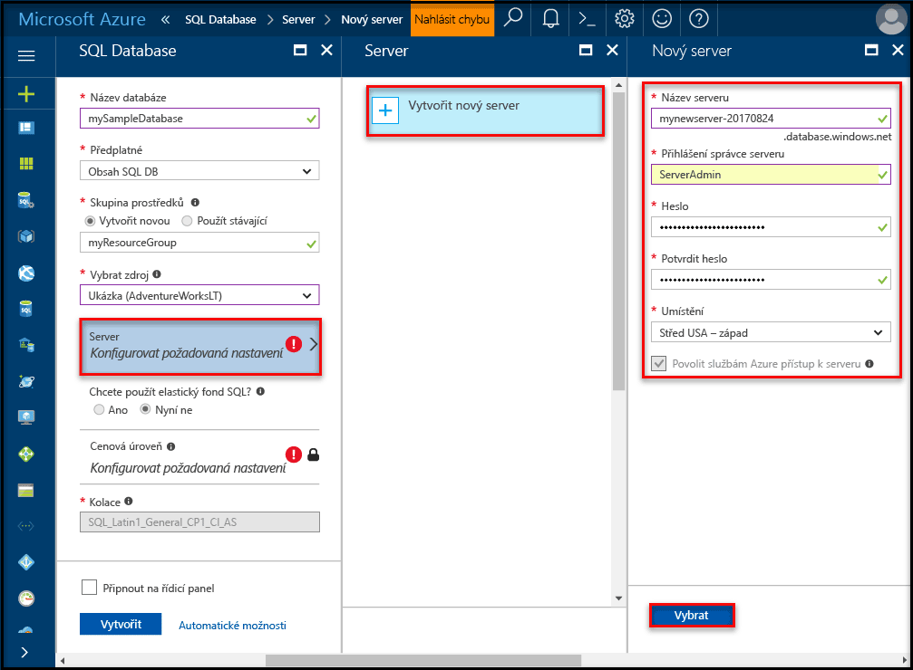
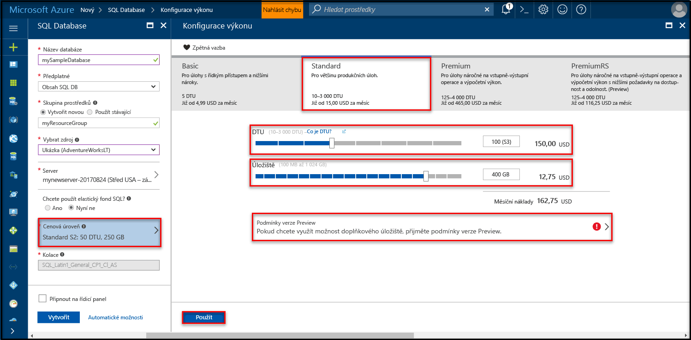
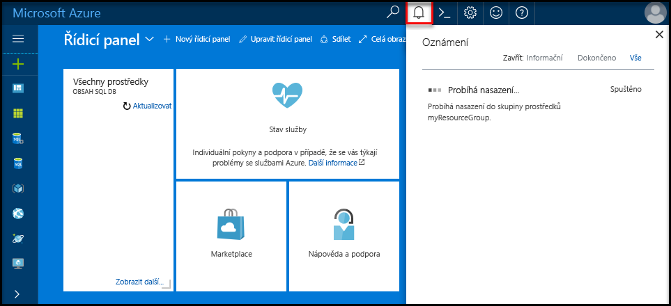
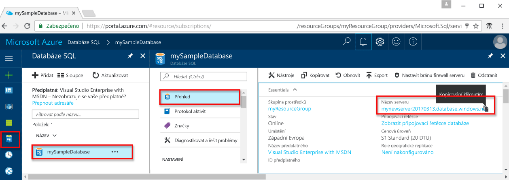

# <a name="create-an-azure-sql-database-in-hello-azure-portal"></a>Vytvoření Azure SQL database v hello portálu Azure

Tento úvodní kurz vás provede jak toocreate SQL databáze v Azure. Databáze SQL Azure je "Databáze jako služba" nabídka, která umožňuje toorun a škálování vysoce dostupné databáze systému SQL Server v cloudu hello. Tento úvodní ukazuje, jak tooget spuštěna vytvořením SQL database pomocí portálu Azure hello.

Pokud ještě nemáte předplatné Azure, vytvořte si [bezplatný účet](https://azure.microsoft.com/free/) před tím, než začnete.

## <a name="log-in-toohello-azure-portal"></a>Přihlaste se toohello portálu Azure

Přihlaste se toohello [portál Azure](https://portal.azure.com/).

## <a name="create-a-sql-database"></a>Vytvoření databáze SQL

Databáze SQL Azure se vytvoří s definovanou sadou [výpočetních prostředků a prostředků úložiště](sql-database-service-tiers.md). Hello databáze byla vytvořena v rámci [skupina prostředků Azure](../azure-resource-manager/resource-group-overview.md) a v [logického serveru Azure SQL Database](sql-database-features.md). 

Postupujte podle těchto kroků toocreate obsahující hello společnosti Adventure Works LT ukázková data databáze SQL. 

1. Klikněte na tlačítko hello **nový** nalezeno tlačítko na hello levém horním rohu hello portálu Azure.

2. Vyberte **databáze** z hello **nový** a vyberte **SQL Database** z hello **databáze** stránky.

   

3. Vyplňte hello SQL Database formulář s hello následující informace, jak je znázorněno na hello předcházející bitové kopie:   

   | Nastavení       | Navrhovaná hodnota | Popis | 
   | ------------ | ------------------ | ------------------------------------------------- | 
   | **Název databáze** | mySampleDatabase | Platné názvy databází najdete v tématu [Identifikátory databází](https://docs.microsoft.com/en-us/sql/relational-databases/databases/database-identifiers). | 
   | **Předplatné** | Vaše předplatné  | Podrobnosti o vašich předplatných najdete v tématu [Předplatná](https://account.windowsazure.com/Subscriptions). |
   | **Skupina prostředků**  | myResourceGroup | Platné názvy skupin prostředků najdete v tématu [Pravidla a omezení pojmenování](https://docs.microsoft.com/azure/architecture/best-practices/naming-conventions). |
   | **Zdroj prostředku** | Ukázka (AdventureWorksLT) | Načte hello AdventureWorksLT schéma a data do nové databáze |

   > [!IMPORTANT]
   > Hello ukázkové databáze na tomto formuláři je třeba vybrat, protože je používán v hello zbytek této úvodní.
   > 

4. V části **Server**, klikněte na tlačítko **konfigurovat požadované nastavení** a výplně se hello SQL server (logický server) formuláře s hello následující informace, jak je znázorněno na hello následující bitové kopie:   

   | Nastavení       | Navrhovaná hodnota | Popis | 
   | ------------ | ------------------ | ------------------------------------------------- | 
   | **Název serveru** | Libovolný globálně jedinečný název | Platné názvy serverů najdete v tématu [Pravidla a omezení pojmenování](https://docs.microsoft.com/azure/architecture/best-practices/naming-conventions). | 
   | **Přihlašovací jméno správce serveru** | Libovolné platné jméno | Platná přihlašovací jména najdete v tématu [Identifikátory databází](https://docs.microsoft.com/en-us/sql/relational-databases/databases/database-identifiers). |
   | **Heslo** | Libovolné platné heslo | Heslo musí mít aspoň 8 znaků a musí obsahovat znaky ze tří z následujících kategorií hello: velká písmena, malá písmena, čísla, a a jiné než alfanumerické znaky. |
   | **Předplatné** | Vaše předplatné | Podrobnosti o vašich předplatných najdete v tématu [Předplatná](https://account.windowsazure.com/Subscriptions). |
   | **Skupina prostředků** | myResourceGroup | Platné názvy skupin prostředků najdete v tématu [Pravidla a omezení pojmenování](https://docs.microsoft.com/azure/architecture/best-practices/naming-conventions). |
   | **Umístění** | Libovolné platné umístění | Informace o oblastech najdete v tématu [Oblasti služeb Azure](https://azure.microsoft.com/regions/). |

   > [!IMPORTANT]
   > Hello přihlašovací jméno správce serveru a heslo, které tady zadáte jsou požadované toolog toohello serveru a její databáze dále v této úvodní. Tyto informace si zapamatujte nebo poznamenejte pro pozdější použití. 
   >  

   

5. Pokud jste vyplnili formulář hello, klikněte na tlačítko **vyberte**.

6. Klikněte na tlačítko **cenová úroveň** toospecify hello služby vrstvy a úroveň výkonu pro novou databázi. Pomocí posuvníku tooselect hello **20 Dtu** a **250** GB úložiště. Další informace o jednotkách DTU najdete v tématu [Co je DTU](sql-database-what-is-a-dtu.md).

   

7. Po vybrané hello množství Dtu, klikněte na tlačítko **použít**.  

8. Teď, když jste dokončili formuláře hello databáze SQL, klikněte na tlačítko **vytvořit** tooprovision hello databáze. Zřizování trvá několik minut. 

9. Na panelu nástrojů hello, klikněte na tlačítko **oznámení** procesu nasazení toomonitor hello.

   

## <a name="create-a-server-level-firewall-rule"></a>Vytvoření pravidla brány firewall na úrovni serveru

Hello služba SQL Database vytvoří brána firewall na serveru – úrovni hello, které zabrání připojení toohello serveru nebo kterékoli databázi na serveru hello, pokud je vytvořeno pravidlo brány firewall tooopen hello brány firewall pro konkrétní IP adresy externí aplikace a nástroje. Postupujte podle těchto kroků toocreate [pravidlo brány firewall na úrovni serveru SQL Database](sql-database-firewall-configure.md) pro vašeho klienta IP adres a povolte externí připojení přes firewall hello databáze SQL pro vaše IP adresa. 

> [!NOTE]
> SQL Database komunikuje přes port 1433. Pokud se pokoušíte tooconnect z podnikové sítě, odchozí provoz přes port 1433 nemusí mít povolený bránou firewall vaší sítě. Pokud ano, nemůžete připojit tooyour serveru Azure SQL Database, pokud vaše IT oddělení otevře port 1433.
>

1. Po dokončení hello nasazení, klikněte na tlačítko **databází SQL** z nabídky na levé straně hello a pak klikněte na tlačítko **mySampleDatabase** na hello **databází SQL** stránky. Hello přehledová stránka otevře vaší databáze, zobrazující text hello plně kvalifikovaný název serveru (například **mynewserver20170313.database.windows.net**) a poskytuje možnosti pro další konfiguraci. Tento plně kvalifikovaný název serveru zkopírujte pro pozdější použití.

   > [!IMPORTANT]
   > Je nutné tento plně kvalifikovaný název tooconnect tooyour serveru a její databáze v následných rychlé zahájení.
   > 

    

2. Klikněte na tlačítko **nastavení brány firewall serveru** na panelu nástrojů hello viz předchozí obrázek hello. Hello **nastavení brány Firewall** otevře se stránka pro hello databáze SQL server. 

    

3. Klikněte na tlačítko **přidat IP adresu klienta** na panelu nástrojů tooadd hello vaše aktuální IP adres tooa nové pravidlo brány firewall. Pravidlo brány firewall může otevřít port 1433 pro jednu IP adresu nebo rozsah IP adres.

4. Klikněte na **Uložit**. Pro aktuální IP adrese otevřít port 1433 na logickém serveru hello je vytvořeno pravidlo brány firewall na úrovni serveru.

    

4. Klikněte na tlačítko **OK** a pak zavřete hello **nastavení brány Firewall** stránky.

Teď se můžete připojit toohello databáze SQL server a její databáze pomocí SQL Server Management Studio nebo jiný nástroj podle svého výběru z tuto IP adresu pomocí účtu správce serveru hello vytvořili dříve.

> [!IMPORTANT]
> Standardně je povolen přístup přes bránu firewall hello databáze SQL pro všechny služby Azure. Klikněte na tlačítko **OFF** na této stránce toodisable pro všechny služby Azure.
>

## <a name="query-hello-sql-database"></a>Hello dotaz do databáze SQL

Teď, když jste vytvořili ukázkové databáze v Azure, můžeme nástrojem hello integrovaného dotazu v rámci hello Azure portálu tooconfirm, že se můžete připojit toohello databáze a dotaz hello data. 

1. Na stránce hello databáze SQL pro vaši databázi, klikněte na **nástroje** na panelu nástrojů hello. Hello **nástroje** otevře se stránka.

    

2. Klikněte na tlačítko **editor dotazů (preview)**, klikněte na tlačítko hello **Náhled podmínky** zaškrtávací políčko a potom klikněte na **OK**. Otevře se stránka editor dotazů Hello.

3. Klikněte na tlačítko **přihlášení** a po zobrazení výzvy vyberte **ověřování systému SQL server** a pak zadejte přihlašovací jméno správce serveru hello a heslo, které jste vytvořili dříve.

    

4. Klikněte na tlačítko **OK** toolog v.

5. Když jste se ověřili, zadejte následující dotaz v podokně editor dotazů hello hello.

   ```sql
   SELECT TOP 20 pc.Name as CategoryName, p.name as ProductName
   FROM SalesLT.ProductCategory pc
   JOIN SalesLT.Product p
   ON pc.productcategoryid = p.productcategoryid;
   ```

6. Klikněte na tlačítko **spustit** a poté zkontrolovat výsledky dotazu hello v hello **výsledky** podokně.

   

7. Zavřít hello **editor dotazů** stránku a hello **nástroje** stránky.

## <a name="clean-up-resources"></a>Vyčištění prostředků

Pokud nepotřebujete tyto prostředky pro jiné rychlý start nebo kurzu (viz [další kroky](#next-steps)), můžete je odstranit provedením následujících hello:


1. V levé nabídce hello v hello portálu Azure klikněte na **skupiny prostředků** a pak klikněte na **myResourceGroup**. 
2. Na stránce skupiny prostředků, klikněte na tlačítko **odstranit**, typ **myResourceGroup** v hello textového pole a pak klikněte na **odstranit**.

## <a name="next-steps"></a>Další kroky

Teď, když máte databázi, můžete se k ní připojit a provádět dotazování pomocí vašich oblíbených nástrojů. Další informace získáte výběrem vašeho nástroje níže:

- [SQL Server Management Studio](sql-database-connect-query-ssms.md)
- [Visual Studio Code](sql-database-connect-query-vscode.md)
- [.NET](sql-database-connect-query-dotnet.md)
- [PHP](sql-database-connect-query-php.md)
- [Node.js](sql-database-connect-query-nodejs.md)
- [Java](sql-database-connect-query-java.md)
- [Python](sql-database-connect-query-python.md)
- [Ruby](sql-database-connect-query-ruby.md)
