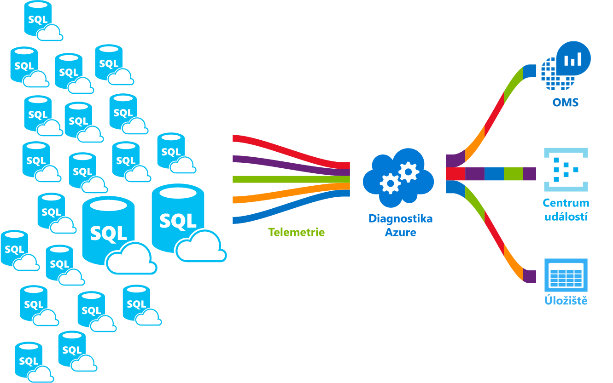

# <a name="azure-sql-database-metrics-and-diagnostics-logging"></a><span data-ttu-id="3e7fd-103">Azure SQL Database metrik a protokolování diagnostiky</span><span class="sxs-lookup"><span data-stu-id="3e7fd-103">Azure SQL Database metrics and diagnostics logging</span></span> 
<span data-ttu-id="3e7fd-104">Databáze SQL Azure můžete emitování metriky a diagnostické protokoly pro snazší monitorování.</span><span class="sxs-lookup"><span data-stu-id="3e7fd-104">Azure SQL Database can emit metrics and diagnostic logs for easier monitoring.</span></span> <span data-ttu-id="3e7fd-105">Můžete nakonfigurovat využití prostředků toostore Azure SQL Database, pracovníků a relací a připojení do jednoho z těchto prostředků Azure:</span><span class="sxs-lookup"><span data-stu-id="3e7fd-105">You can configure Azure SQL Database toostore resource usage, workers and sessions, and connectivity into one of these Azure resources:</span></span>
- <span data-ttu-id="3e7fd-106">**Azure Storage:** Pro archivaci obrovských objemů telemetrických dat za nízkou cenu.</span><span class="sxs-lookup"><span data-stu-id="3e7fd-106">**Azure Storage**: For archiving vast amounts of telemetry for a small price</span></span>
- <span data-ttu-id="3e7fd-107">**Azure centra událostí**: pro integraci telemetrie databáze SQL Azure s vlastní řešení monitorování nebo aktivní kanálů</span><span class="sxs-lookup"><span data-stu-id="3e7fd-107">**Azure Event Hub**: For integrating Azure SQL Database telemetry with your custom monitoring solution or hot pipelines</span></span>
- <span data-ttu-id="3e7fd-108">**Azure Log Analytics**: pro předinstalované hello řešení s vytváření sestav, výstrahy a zmírnění možnosti monitorování</span><span class="sxs-lookup"><span data-stu-id="3e7fd-108">**Azure Log Analytics**: For out of hello box monitoring solution with reporting, alerting, and mitigating capabilities</span></span> 

    

## <a name="enable-logging"></a><span data-ttu-id="3e7fd-110">Povolit protokolování</span><span class="sxs-lookup"><span data-stu-id="3e7fd-110">Enable logging</span></span>

<span data-ttu-id="3e7fd-111">Ve výchozím nastavení není povoleno metrik a protokolování diagnostiky.</span><span class="sxs-lookup"><span data-stu-id="3e7fd-111">Metrics and diagnostics logging is not enabled by default.</span></span> <span data-ttu-id="3e7fd-112">Můžete povolit a spravovat metrik a protokolování diagnostiky pomocí jedné z následujících metod hello:</span><span class="sxs-lookup"><span data-stu-id="3e7fd-112">You can enable and manage metrics and diagnostics logging using one of hello following methods:</span></span>
- <span data-ttu-id="3e7fd-113">portál Azure</span><span class="sxs-lookup"><span data-stu-id="3e7fd-113">Azure portal</span></span>
- <span data-ttu-id="3e7fd-114">PowerShell</span><span class="sxs-lookup"><span data-stu-id="3e7fd-114">PowerShell</span></span>
- <span data-ttu-id="3e7fd-115">Azure CLI</span><span class="sxs-lookup"><span data-stu-id="3e7fd-115">Azure CLI</span></span>
- <span data-ttu-id="3e7fd-116">REST API</span><span class="sxs-lookup"><span data-stu-id="3e7fd-116">REST API</span></span> 
- <span data-ttu-id="3e7fd-117">Šablona Resource Manageru</span><span class="sxs-lookup"><span data-stu-id="3e7fd-117">Resource Manager template</span></span>

<span data-ttu-id="3e7fd-118">Pokud povolíte metrik a protokolování diagnostiky, je potřeba toospecify hello prostředků Azure, kde se shromažďují vybraná data.</span><span class="sxs-lookup"><span data-stu-id="3e7fd-118">When you enable metrics and diagnostics logging, you need toospecify hello Azure resource where selected data is collected.</span></span> <span data-ttu-id="3e7fd-119">Dostupné možnosti:</span><span class="sxs-lookup"><span data-stu-id="3e7fd-119">Options available:</span></span>
- <span data-ttu-id="3e7fd-120">Log Analytics</span><span class="sxs-lookup"><span data-stu-id="3e7fd-120">Log analytics</span></span>
- <span data-ttu-id="3e7fd-121">Centrum událostí</span><span class="sxs-lookup"><span data-stu-id="3e7fd-121">Event Hub</span></span>
- <span data-ttu-id="3e7fd-122">Azure Storage</span><span class="sxs-lookup"><span data-stu-id="3e7fd-122">Azure Storage</span></span> 

<span data-ttu-id="3e7fd-123">Můžete zřídit nového prostředku Azure nebo vybrat existující prostředek.</span><span class="sxs-lookup"><span data-stu-id="3e7fd-123">You can provision a new Azure resource or select an existing resource.</span></span> <span data-ttu-id="3e7fd-124">Po výběru hello prostředků úložiště, musíte toospecify které toocollect data.</span><span class="sxs-lookup"><span data-stu-id="3e7fd-124">After selecting hello storage resource, you need toospecify which data toocollect.</span></span> <span data-ttu-id="3e7fd-125">Mezi dostupné možnosti patří:</span><span class="sxs-lookup"><span data-stu-id="3e7fd-125">Options available include:</span></span>

- <span data-ttu-id="3e7fd-126">**[1 minutu metriky](sql-database-metrics-diag-logging.md#1-minute-metrics)**  – obsahuje procento DTU, omezení jednotek DTU, procento využití procesoru, fyzické číst procento, protokolu zapisovat procento, bylo úspěšné nebo neúspěšné/blokováno připojení brány firewall, procento relací, procento pracovních procesů úložiště, procento úložiště, XTP procento úložiště</span><span class="sxs-lookup"><span data-stu-id="3e7fd-126">**[1-minute metrics](sql-database-metrics-diag-logging.md#1-minute-metrics)** - contains DTU percentage, DTU limit, CPU percentage, Physical data read percentage, Log write percentage, Successful/Failed/Blocked by firewall connections, sessions percentage, workers percentage, storage, storage percentage, XTP storage percentage</span></span>

<span data-ttu-id="3e7fd-127">Pokud zadáte centra událostí nebo azurestorage účet, můžete zadat toospecify zásady uchovávání data, která je starší než vybrané časové období se odstraní.</span><span class="sxs-lookup"><span data-stu-id="3e7fd-127">If you specify Event Hub or an AzureStorage account, you can specify a retention policy toospecify that data that is older than a selected time period is deleted.</span></span> <span data-ttu-id="3e7fd-128">Pokud zadáte analýzy protokolů, zásady uchovávání informací hello závisí na hello vybraná cenová úroveň.</span><span class="sxs-lookup"><span data-stu-id="3e7fd-128">If you specify Log Analytics, hello retention policy depends on hello selected pricing tier.</span></span> <span data-ttu-id="3e7fd-129">Další informace o [analýzy protokolů ceny](https://azure.microsoft.com/pricing/details/log-analytics/).</span><span class="sxs-lookup"><span data-stu-id="3e7fd-129">Read more about [Log Analytics pricing](https://azure.microsoft.com/pricing/details/log-analytics/).</span></span> 

<span data-ttu-id="3e7fd-130">Doporučujeme, abyste si přečetli obou hello [přehled metriky v Microsoft Azure](../monitoring-and-diagnostics/monitoring-overview-metrics.md) a [přehled o Azure diagnostické protokoly](../monitoring-and-diagnostics/monitoring-overview-of-diagnostic-logs.md) články toogain představu o není pouze jak tooenable protokolování, ale hello metriky a protokolu kategorií podporuje hello různé služby Azure.</span><span class="sxs-lookup"><span data-stu-id="3e7fd-130">We recommend that you read both hello [Overview of metrics in Microsoft Azure](../monitoring-and-diagnostics/monitoring-overview-metrics.md) and [Overview of Azure Diagnostic Logs](../monitoring-and-diagnostics/monitoring-overview-of-diagnostic-logs.md) articles toogain an understanding of not only how tooenable logging, but hello metrics and log categories supported by hello various Azure services.</span></span>

### <a name="azure-portal"></a><span data-ttu-id="3e7fd-131">portál Azure</span><span class="sxs-lookup"><span data-stu-id="3e7fd-131">Azure portal</span></span>

<span data-ttu-id="3e7fd-132">tooenable metriky a shromažďování diagnostických protokolů v hello portál Azure, přejděte tooyour Azure SQL database nebo stránky elastického fondu a pak klikněte na tlačítko **nastavení pro diagnostiku**.</span><span class="sxs-lookup"><span data-stu-id="3e7fd-132">tooenable metrics and diagnostic logs collection in hello Azure portal, navigate tooyour Azure SQL database or elastic pool page, and then click **Diagnostic settings**.</span></span>

   

### <a name="powershell"></a><span data-ttu-id="3e7fd-134">PowerShell</span><span class="sxs-lookup"><span data-stu-id="3e7fd-134">PowerShell</span></span>

<span data-ttu-id="3e7fd-135">tooenable metrik a protokolování diagnostiky pomocí prostředí PowerShell, použijte hello následující příkazy:</span><span class="sxs-lookup"><span data-stu-id="3e7fd-135">tooenable metrics and diagnostics logging using PowerShell, use hello following commands:</span></span>

- <span data-ttu-id="3e7fd-136">úložiště tooenable diagnostických protokolů v účtu úložiště, použijte tento příkaz:</span><span class="sxs-lookup"><span data-stu-id="3e7fd-136">tooenable storage of Diagnostic Logs in a Storage Account, use this command:</span></span>

   ```powershell
   Set-AzureRmDiagnosticSetting -ResourceId [your resource id] -StorageAccountId [your storage account id] -Enabled $true
   ```

   <span data-ttu-id="3e7fd-137">Hello ID účtu úložiště je id prostředku hello toowhich účet úložiště hello chcete toosend hello protokoly.</span><span class="sxs-lookup"><span data-stu-id="3e7fd-137">hello Storage Account ID is hello resource id for hello storage account toowhich you want toosend hello logs.</span></span>

- <span data-ttu-id="3e7fd-138">tooenable vysílání datového proudu diagnostické protokoly tooan centra událostí, použijte tento příkaz:</span><span class="sxs-lookup"><span data-stu-id="3e7fd-138">tooenable streaming of Diagnostic Logs tooan Event Hub, use this command:</span></span>

   ```powershell
   Set-AzureRmDiagnosticSetting -ResourceId [your resource id] -ServiceBusRuleId [your service bus rule id] -Enabled $true
   ```

   <span data-ttu-id="3e7fd-139">Hello ID pravidla Service Bus je řetězec s Tento formát:</span><span class="sxs-lookup"><span data-stu-id="3e7fd-139">hello Service Bus Rule ID is a string with this format:</span></span>

   ```powershell
   {service bus resource ID}/authorizationrules/{key name}
   ``` 

- <span data-ttu-id="3e7fd-140">tooenable odesílání diagnostických protokolů pracovní prostor analýzy protokolů tooa, použijte tento příkaz:</span><span class="sxs-lookup"><span data-stu-id="3e7fd-140">tooenable sending of Diagnostic Logs tooa Log Analytics workspace, use this command:</span></span>

   ```powershell
   Set-AzureRmDiagnosticSetting -ResourceId [your resource id] -WorkspaceId [resource id of hello log analytics workspace] -Enabled $true
   ```

- <span data-ttu-id="3e7fd-141">Můžete získat id prostředku hello pracovní prostor analýzy protokolů pomocí hello následující příkaz:</span><span class="sxs-lookup"><span data-stu-id="3e7fd-141">You can obtain hello resource id of your Log Analytics workspace using hello following command:</span></span>

   ```powershell
   (Get-AzureRmOperationalInsightsWorkspace).ResourceId
   ```

<span data-ttu-id="3e7fd-142">Tyto parametry tooenable můžete kombinovat více možností výstup.</span><span class="sxs-lookup"><span data-stu-id="3e7fd-142">You can combine these parameters tooenable multiple output options.</span></span>

### <a name="cli"></a><span data-ttu-id="3e7fd-143">Rozhraní příkazového řádku</span><span class="sxs-lookup"><span data-stu-id="3e7fd-143">CLI</span></span>

<span data-ttu-id="3e7fd-144">tooenable metrik a protokolování pomocí diagnostiky hello rozhraní příkazového řádku Azure, hello použijte následující příkazy:</span><span class="sxs-lookup"><span data-stu-id="3e7fd-144">tooenable metrics and diagnostics logging using hello Azure CLI, use hello following commands:</span></span>

- <span data-ttu-id="3e7fd-145">úložiště tooenable diagnostických protokolů v účtu úložiště, použijte tento příkaz:</span><span class="sxs-lookup"><span data-stu-id="3e7fd-145">tooenable storage of Diagnostic Logs in a Storage Account, use this command:</span></span>

   ```azurecli-interactive
   azure insights diagnostic set --resourceId <resourceId> --storageId <storageAccountId> --enabled true
   ```

   <span data-ttu-id="3e7fd-146">Hello ID účtu úložiště je id prostředku hello toowhich účet úložiště hello chcete toosend hello protokoly.</span><span class="sxs-lookup"><span data-stu-id="3e7fd-146">hello Storage Account ID is hello resource id for hello storage account toowhich you want toosend hello logs.</span></span>

- <span data-ttu-id="3e7fd-147">tooenable vysílání datového proudu diagnostické protokoly tooan centra událostí, použijte tento příkaz:</span><span class="sxs-lookup"><span data-stu-id="3e7fd-147">tooenable streaming of Diagnostic Logs tooan Event Hub, use this command:</span></span>

   ```azurecli-interactive
   azure insights diagnostic set --resourceId <resourceId> --serviceBusRuleId <serviceBusRuleId> --enabled true
   ```

   <span data-ttu-id="3e7fd-148">Hello ID pravidla Service Bus je řetězec s Tento formát:</span><span class="sxs-lookup"><span data-stu-id="3e7fd-148">hello Service Bus Rule ID is a string with this format:</span></span>

   ```azurecli-interactive
   {service bus resource ID}/authorizationrules/{key name}
   ```

- <span data-ttu-id="3e7fd-149">tooenable odesílání diagnostických protokolů pracovní prostor analýzy protokolů tooa, použijte tento příkaz:</span><span class="sxs-lookup"><span data-stu-id="3e7fd-149">tooenable sending of Diagnostic Logs tooa Log Analytics workspace, use this command:</span></span>

   ```azurecli-interactive
   azure insights diagnostic set --resourceId <resourceId> --workspaceId <resource id of hello log analytics workspace> --enabled true
   ```

<span data-ttu-id="3e7fd-150">Tyto parametry tooenable můžete kombinovat více možností výstup.</span><span class="sxs-lookup"><span data-stu-id="3e7fd-150">You can combine these parameters tooenable multiple output options.</span></span>

### <a name="rest-api"></a><span data-ttu-id="3e7fd-151">REST API</span><span class="sxs-lookup"><span data-stu-id="3e7fd-151">REST API</span></span>

<span data-ttu-id="3e7fd-152">Přečtěte si informace o tom příliš[změnit nastavení pro diagnostiku pomocí hello REST API služby Azure monitorování](https://msdn.microsoft.com/library/azure/dn931931.aspx).</span><span class="sxs-lookup"><span data-stu-id="3e7fd-152">Read about how too[change Diagnostic settings using hello Azure Monitor REST API](https://msdn.microsoft.com/library/azure/dn931931.aspx).</span></span> 

### <a name="resource-manager-template"></a><span data-ttu-id="3e7fd-153">Šablona Resource Manageru</span><span class="sxs-lookup"><span data-stu-id="3e7fd-153">Resource Manager template</span></span>

<span data-ttu-id="3e7fd-154">Přečtěte si informace o tom příliš[povolit nastavení pro diagnostiku při vytváření prostředků pomocí šablony Resource Manageru](../monitoring-and-diagnostics/monitoring-enable-diagnostic-logs-using-template.md).</span><span class="sxs-lookup"><span data-stu-id="3e7fd-154">Read about how too[enable Diagnostic settings at resource creation using Resource Manager template](../monitoring-and-diagnostics/monitoring-enable-diagnostic-logs-using-template.md).</span></span> 

## <a name="stream-into-log-analytics"></a><span data-ttu-id="3e7fd-155">Datový proud do analýzy protokolů</span><span class="sxs-lookup"><span data-stu-id="3e7fd-155">Stream into Log Analytics</span></span> 
<span data-ttu-id="3e7fd-156">Diagnostické protokoly a Azure SQL Database metriky Streamovat do pomocí možnosti integrované "Odeslat tooLog Analytics" hello hello portálu nebo povolením analýzy protokolů v nastavení diagnostiky pomocí rutin prostředí Azure PowerShell, rozhraní příkazového řádku Azure nebo REST Azure monitorování analýzy protokolů ROZHRANÍ API.</span><span class="sxs-lookup"><span data-stu-id="3e7fd-156">Azure SQL Database metrics and diagnostic logs can be streamed into Log Analytics using hello built-in “Send tooLog Analytics” option in hello portal, or by enabling Log Analytics in a diagnostic setting via Azure PowerShell cmdlets, Azure CLI, or Azure Monitor REST API.</span></span>

### <a name="installation-overview"></a><span data-ttu-id="3e7fd-157">Přehled instalace</span><span class="sxs-lookup"><span data-stu-id="3e7fd-157">Installation overview</span></span>

<span data-ttu-id="3e7fd-158">Monitorování firemního vozového Azure SQL Database je jednoduchý analýzy protokolů.</span><span class="sxs-lookup"><span data-stu-id="3e7fd-158">Monitoring Azure SQL Database fleet is simple with Log Analytics.</span></span> <span data-ttu-id="3e7fd-159">Vyžadují se tři kroky:</span><span class="sxs-lookup"><span data-stu-id="3e7fd-159">Three steps are required:</span></span>

1.  <span data-ttu-id="3e7fd-160">Vytvořte prostředek analýzy protokolů</span><span class="sxs-lookup"><span data-stu-id="3e7fd-160">Create Log Analytics resource</span></span>
2.  <span data-ttu-id="3e7fd-161">Konfigurace databáze toorecord metriky a diagnostických protokolů do hello vytvořili analýzy protokolů</span><span class="sxs-lookup"><span data-stu-id="3e7fd-161">Configure databases toorecord metrics and diagnostic logs into hello created Log Analytics</span></span>
3.  <span data-ttu-id="3e7fd-162">Nainstalujte **Azure SQL Analytics** řešení z Galerie v analýzy protokolů</span><span class="sxs-lookup"><span data-stu-id="3e7fd-162">Install **Azure SQL Analytics** solution from gallery in Log Analytics</span></span>

### <a name="create-log-analytics-resource"></a><span data-ttu-id="3e7fd-163">Vytvořte prostředek analýzy protokolů</span><span class="sxs-lookup"><span data-stu-id="3e7fd-163">Create Log Analytics resource</span></span>

1. <span data-ttu-id="3e7fd-164">Klikněte na tlačítko **nový** v levé nabídce hello.</span><span class="sxs-lookup"><span data-stu-id="3e7fd-164">Click **New** in hello left-hand menu.</span></span>
2. <span data-ttu-id="3e7fd-165">Klikněte na tlačítko **monitorování + správy**</span><span class="sxs-lookup"><span data-stu-id="3e7fd-165">Click **Monitoring + Management**</span></span>
3. <span data-ttu-id="3e7fd-166">Klikněte na tlačítko **protokolu analýzy**</span><span class="sxs-lookup"><span data-stu-id="3e7fd-166">Click **Log Analytics**</span></span>
4. <span data-ttu-id="3e7fd-167">Vyplňte formulář analýzy protokolů hello s hello další vyžadované informace: název pracovního prostoru, předplatné, skupinu prostředků, umístění a cenovou úroveň.</span><span class="sxs-lookup"><span data-stu-id="3e7fd-167">Fill in hello Log Analytics form with hello additional information required: workspace name, subscription, resource group, location, and pricing tier.</span></span>

   

### <a name="configure-databases-toorecord-metrics-and-diagnostic-logs"></a><span data-ttu-id="3e7fd-169">Konfigurace databáze toorecord metriky a diagnostických protokolů</span><span class="sxs-lookup"><span data-stu-id="3e7fd-169">Configure databases toorecord metrics and diagnostic logs</span></span>

<span data-ttu-id="3e7fd-170">Hello nejjednodušší způsob, jak tooconfigure kde databází záznam jejich metriky je prostřednictvím hello portálu Azure.</span><span class="sxs-lookup"><span data-stu-id="3e7fd-170">hello easiest way tooconfigure where databases record their metrics is through hello Azure portal.</span></span> <span data-ttu-id="3e7fd-171">V hello portálu Azure, přejděte tooyour prostředků Azure SQL Database a klikněte na tlačítko **nastavení diagnostiky**.</span><span class="sxs-lookup"><span data-stu-id="3e7fd-171">In hello Azure portal, navigate tooyour Azure SQL Database resource and click **Diagnostics settings**.</span></span> 

### <a name="install-hello-azure-sql-analytics-solution-from-gallery"></a><span data-ttu-id="3e7fd-172">Nainstalujte řešení hello analýzy SQL Azure z Galerie</span><span class="sxs-lookup"><span data-stu-id="3e7fd-172">Install hello Azure SQL Analytics solution from gallery</span></span>  

1. <span data-ttu-id="3e7fd-173">Jakmile je vytvořen hello prostředků analýzy protokolů a je do ní toku dat, nainstalujte řešení analýzy SQL Azure.</span><span class="sxs-lookup"><span data-stu-id="3e7fd-173">Once hello Log Analytics resource is created and your data is flowing into it, install Azure SQL Analytics solution.</span></span> <span data-ttu-id="3e7fd-174">To lze provést prostřednictvím hello **řešení Galerie** , které můžete najít na domovskou stránku hello OMS a v nabídce straně hello.</span><span class="sxs-lookup"><span data-stu-id="3e7fd-174">This can be done through hello **Solutions Gallery** that you can find on hello OMS homepage and in hello side menu.</span></span> <span data-ttu-id="3e7fd-175">V galerii hello, najít a klikněte na tlačítko **Azure SQL Analytics** řešení a klikněte na tlačítko **přidat**.</span><span class="sxs-lookup"><span data-stu-id="3e7fd-175">In hello gallery, find and click **Azure SQL Analytics** solution and click **Add**.</span></span>

   

2. <span data-ttu-id="3e7fd-177">Na domovské stránce OMS, volá se nová dlaždice **Azure SQL Analytics** se zobrazí.</span><span class="sxs-lookup"><span data-stu-id="3e7fd-177">On your OMS homepage, a new tile called **Azure SQL Analytics** appears.</span></span> <span data-ttu-id="3e7fd-178">Výběr tuto dlaždici se otevře řídicí panel Azure SQL Analytics hello.</span><span class="sxs-lookup"><span data-stu-id="3e7fd-178">Selecting this tile opens hello Azure SQL Analytics dashboard.</span></span>

### <a name="using-azure-sql-analytics-solution"></a><span data-ttu-id="3e7fd-179">Pomocí řešení analýzy Azure SQL</span><span class="sxs-lookup"><span data-stu-id="3e7fd-179">Using Azure SQL Analytics Solution</span></span>

<span data-ttu-id="3e7fd-180">Azure SQL Analytics je hierarchická řídicí panel, který vám umožní toonavigate prostřednictvím hierarchie hello prostředků Azure SQL Database.</span><span class="sxs-lookup"><span data-stu-id="3e7fd-180">Azure SQL Analytics is a hierarchical dashboard that allows you toonavigate through hello hierarchy of Azure SQL Database resources.</span></span> <span data-ttu-id="3e7fd-181">Tato funkce umožňuje vám toodo souhrnné monitorování ale také vám umožňuje tooscope vaší monitorování hello toojust správné nastavení prostředků.</span><span class="sxs-lookup"><span data-stu-id="3e7fd-181">This capability enables you toodo high-level monitoring but it also enables you tooscope your monitoring toojust hello right set of resources.</span></span>
<span data-ttu-id="3e7fd-182">Řídicí panel obsahuje seznamy hello různých prostředků ve sloupci hello vybraný zdroj.</span><span class="sxs-lookup"><span data-stu-id="3e7fd-182">Dashboard contains hello lists of different resources under hello selected resource.</span></span> <span data-ttu-id="3e7fd-183">Například pro vybrané předplatné uvidíte hello všechny servery, elastické fondy a databází, které patří toohello vybrané předplatné.</span><span class="sxs-lookup"><span data-stu-id="3e7fd-183">For example, for a selected subscription you can see hello all servers, elastic pools and databases that belong toohello selected subscription.</span></span> <span data-ttu-id="3e7fd-184">Kromě toho pro elastické fondy a databází, se zobrazí metriky využití prostředků hello tohoto prostředku.</span><span class="sxs-lookup"><span data-stu-id="3e7fd-184">Additionally, for Elastic Pools and databases, you can see hello resource usage metrics of that resource.</span></span> <span data-ttu-id="3e7fd-185">To zahrnuje grafy pro DTU, procesoru, vstupně-výstupní operace, protokolu, relace, pracovníci, připojení a úložiště v GB.</span><span class="sxs-lookup"><span data-stu-id="3e7fd-185">This includes charts for DTU, CPU, IO, LOG, sessions, workers, connections, and storage in GB.</span></span>

## <a name="stream-into-azure-event-hub"></a><span data-ttu-id="3e7fd-186">Datový proud do centra událostí Azure</span><span class="sxs-lookup"><span data-stu-id="3e7fd-186">Stream into Azure Event Hub</span></span>

<span data-ttu-id="3e7fd-187">Diagnostické protokoly a Azure SQL Database metriky Streamovat do centra událostí pomocí možnosti integrované "centra událostí tooan datového proudu" hello hello portálu nebo povolením Id Service Bus pravidla v nastavení diagnostiky pomocí rutin prostředí Azure PowerShell, rozhraní příkazového řádku Azure nebo REST Azure monitorování ROZHRANÍ API.</span><span class="sxs-lookup"><span data-stu-id="3e7fd-187">Azure SQL Database metrics and diagnostic logs can be streamed into Event Hub using hello built-in “Stream tooan event hub” option in hello portal, or by enabling Service Bus Rule Id in a diagnostic setting via Azure PowerShell Cmdlets, Azure CLI, or Azure Monitor REST API.</span></span> 

### <a name="what-toodo-with-metrics-and-diagnostic-logs-in-event-hub"></a><span data-ttu-id="3e7fd-188">Jaké toodo s metriky a diagnostických protokolů v Centru událostí?</span><span class="sxs-lookup"><span data-stu-id="3e7fd-188">What toodo with metrics and diagnostic logs in Event Hub?</span></span>
<span data-ttu-id="3e7fd-189">Jakmile je pomocí datového proudu vysílána hello vybraná data do centra událostí, jste jeden krok blíž tooenabling pokročilé scénáře monitorování.</span><span class="sxs-lookup"><span data-stu-id="3e7fd-189">Once hello selected data is streamed into Event Hub, you are one step closer tooenabling advanced monitoring scenarios.</span></span> <span data-ttu-id="3e7fd-190">Služba Event Hubs slouží jako hello "přední dveře" pro kanál událostí, a jakmile jsou data shromážděna do centra událostí, lze je transformovat a uložené pomocí kteréhokoli poskytovatele služeb, analýzu v reálném čase nebo adaptérů pro dávkování či ukládání.</span><span class="sxs-lookup"><span data-stu-id="3e7fd-190">Event Hubs acts as hello "front door" for an event pipeline, and once data is collected into an Event Hub, it can be transformed and stored using any real-time analytics provider or batching/storage adapters.</span></span> <span data-ttu-id="3e7fd-191">Služba Event Hubs oddělí hello produkce datového proudu událostí od spotřeby těchto události, hello, aby příjemci událostí přístup hello události svého vlastního plánu.</span><span class="sxs-lookup"><span data-stu-id="3e7fd-191">Event Hubs decouples hello production of a stream of events from hello consumption of those events, so that event consumers can access hello events on their own schedule.</span></span> <span data-ttu-id="3e7fd-192">Další informace o Centru událostí najdete v tématu:</span><span class="sxs-lookup"><span data-stu-id="3e7fd-192">For more information on Event Hub, see:</span></span>

- <span data-ttu-id="3e7fd-193">[Co je Azure Event Hubs](../event-hubs/event-hubs-what-is-event-hubs.md)?</span><span class="sxs-lookup"><span data-stu-id="3e7fd-193">[What are Azure Event Hubs](../event-hubs/event-hubs-what-is-event-hubs.md)?</span></span>
- [<span data-ttu-id="3e7fd-194">Začínáme s Event Hubs</span><span class="sxs-lookup"><span data-stu-id="3e7fd-194">Get started with Event Hubs</span></span>](../event-hubs/event-hubs-csharp-ephcs-getstarted.md)


<span data-ttu-id="3e7fd-195">Můžete použít hello streamování schopností několika způsoby:</span><span class="sxs-lookup"><span data-stu-id="3e7fd-195">Here are just a few ways you might use hello streaming capability:</span></span>

-   <span data-ttu-id="3e7fd-196">Zobrazit stav služby pomocí vysílání datového proudu tooPowerBI "aktivní cesta" data - pomocí služby Event Hubs, Stream Analytics a PowerBI, můžete snadno převést metriky a diagnostiky dat do téměř přehledy v reálném čase na služeb Azure.</span><span class="sxs-lookup"><span data-stu-id="3e7fd-196">View service health by streaming “hot path” data tooPowerBI - Using Event Hubs, Stream Analytics, and PowerBI, you can easily transform your metrics and diagnostics data into near real-time insights on your Azure services.</span></span> <span data-ttu-id="3e7fd-197">Přehled o tom, jak tooset se službou Event Hubs, zpracování dat pomocí služby Stream Analytics a použít PowerBI jako výstup, najdete v části [Stream Analytics a Power BI](../stream-analytics/stream-analytics-power-bi-dashboard.md).</span><span class="sxs-lookup"><span data-stu-id="3e7fd-197">For an overview of how tooset up an Event Hubs, process data with Stream Analytics, and use PowerBI as an output, see [Stream Analytics and Power BI](../stream-analytics/stream-analytics-power-bi-dashboard.md).</span></span>
-   <span data-ttu-id="3e7fd-198">Datový proud protokolů výrobců toothird protokolování telemetrie datové proudy a – Event Hubs pomocí vysílání datového proudu je můžete získat metriky a diagnostických protokolů v toodifferent řešení pro monitorování a protokolu analýzu třetích stran.</span><span class="sxs-lookup"><span data-stu-id="3e7fd-198">Stream logs toothird-party logging and telemetry streams – Using Event Hubs streaming you can get your metrics and diagnostic logs in toodifferent third-party monitoring and log analytics solutions.</span></span> 
-   <span data-ttu-id="3e7fd-199">Vytvořte vlastní telemetrii a protokolování platforma – Pokud už máte uživatelské telemetrie platformy nebo jsou právě přemýšlíte o vytváření jeden hello vysoce škálovatelné publikování a odběru, že povaha Event Hubs vám umožní tooflexibly ingestování diagnostické protokoly.</span><span class="sxs-lookup"><span data-stu-id="3e7fd-199">Build a custom telemetry and logging platform – If you already have a custom-built telemetry platform or are just thinking about building one, hello highly scalable publish-subscribe nature of Event Hubs allows you tooflexibly ingest diagnostic logs.</span></span> <span data-ttu-id="3e7fd-200">V tématu [Dana Rosanova Průvodce toousing Event Hubs v globálním měřítku telemetrie platformu](https://azure.microsoft.com/documentation/videos/build-2015-designing-and-sizing-a-global-scale-telemetry-platform-on-azure-event-Hubs/).</span><span class="sxs-lookup"><span data-stu-id="3e7fd-200">See [Dan Rosanova’s guide toousing Event Hubs in a global scale telemetry platform](https://azure.microsoft.com/documentation/videos/build-2015-designing-and-sizing-a-global-scale-telemetry-platform-on-azure-event-Hubs/).</span></span>

## <a name="stream-into-azure-storage"></a><span data-ttu-id="3e7fd-201">Datový proud do úložiště Azure</span><span class="sxs-lookup"><span data-stu-id="3e7fd-201">Stream into Azure Storage</span></span>

<span data-ttu-id="3e7fd-202">Azure SQL Database metriky a diagnostické protokoly mohou být uloženy do Azure Storage pomocí předdefinovaných možnost "Archivu tooa účet úložiště" hello v hello portál Azure nebo povolením Azure Storage v nastavení diagnostiky pomocí rutin prostředí Azure PowerShell, rozhraní příkazového řádku Azure nebo Azure Monitorování REST API.</span><span class="sxs-lookup"><span data-stu-id="3e7fd-202">Azure SQL Database metrics and diagnostic logs can be stored into Azure Storage using hello built-in "Archive tooa storage account” option in hello Azure portal, or by enabling Azure Storage in a diagnostic setting via Azure PowerShell Cmdlets, Azure CLI, or Azure Monitor REST API.</span></span>

### <a name="schema-of-metrics-and-diagnostic-logs-in-hello-storage-account"></a><span data-ttu-id="3e7fd-203">Schéma metriky a diagnostických protokolů v účtu úložiště hello</span><span class="sxs-lookup"><span data-stu-id="3e7fd-203">Schema of metrics and diagnostic logs in hello storage account</span></span>

<span data-ttu-id="3e7fd-204">Jakmile nastavíte metriky a shromažďování diagnostických protokolů, kontejner úložiště se vytvoří v účtu úložiště hello, kterou jste vybrali při hello první řádky dat jsou k dispozici.</span><span class="sxs-lookup"><span data-stu-id="3e7fd-204">Once you have set up metrics and diagnostic logs collection, a storage container is created in hello storage account you selected when hello first rows of data are available.</span></span> <span data-ttu-id="3e7fd-205">Struktura Hello tyto objekty BLOB je:</span><span class="sxs-lookup"><span data-stu-id="3e7fd-205">hello structure of these blobs is:</span></span>

```powershell
insights-{metrics|logs}-{category name}/resourceId=/SUBSCRIPTIONS/{subscription ID}/ RESOURCEGROUPS/{resource group name}/PROVIDERS/Microsoft.SQL/servers/{resource_server}/ databases/{database_name}/y={four-digit numeric year}/m={two-digit numeric month}/d={two-digit numeric day}/h={two-digit 24-hour clock hour}/m=00/PT1H.json
```
    
<span data-ttu-id="3e7fd-206">Nebo jednodušeji:</span><span class="sxs-lookup"><span data-stu-id="3e7fd-206">Or, more simply:</span></span>

```powershell
insights-{metrics|logs}-{category name}/resourceId=/{resource Id}/y={four-digit numeric year}/m={two-digit numeric month}/d={two-digit numeric day}/h={two-digit 24-hour clock hour}/m=00/PT1H.json
```

<span data-ttu-id="3e7fd-207">Například může být název objektu blob pro 1 minutu metriky:</span><span class="sxs-lookup"><span data-stu-id="3e7fd-207">For example, a blob name for 1-minute metrics might be:</span></span>

```powershell
insights-metrics-minute/resourceId=/SUBSCRIPTIONS/s1id1234-5679-0123-4567-890123456789/RESOURCEGROUPS/TESTRESOURCEGROUP/PROVIDERS/MICROSOFT.SQL/ servers/Server1/databases/database1/y=2016/m=08/d=22/h=18/m=00/PT1H.json
```

<span data-ttu-id="3e7fd-208">V případě, že chcete toorecord hello data z hello elastického fondu, název objektu blob se trochu liší:</span><span class="sxs-lookup"><span data-stu-id="3e7fd-208">In case you want toorecord hello data from hello Elastic Pool, blob name is a bit different:</span></span>

```powershell
insights-{metrics|logs}-{category name}/resourceId=/SUBSCRIPTIONS/{subscription ID}/ RESOURCEGROUPS/{resource group name}/PROVIDERS/Microsoft.SQL/servers/{resource_server}/ elasticPools/{elastic_pool_name}/y={four-digit numeric year}/m={two-digit numeric month}/d={two-digit numeric day}/h={two-digit 24-hour clock hour}/m=00/PT1H.json
```

### <a name="download-metrics-and-logs-from-azure-storage"></a><span data-ttu-id="3e7fd-209">Stažení metriky a protokoly ze služby Azure storage</span><span class="sxs-lookup"><span data-stu-id="3e7fd-209">Download metrics and logs from Azure storage</span></span>

<span data-ttu-id="3e7fd-210">V tématu [stáhnout metriky a diagnostické protokoly ze služby Azure Storage](../storage/blobs/storage-dotnet-how-to-use-blobs.md#download-blobs)</span><span class="sxs-lookup"><span data-stu-id="3e7fd-210">See [Download metrics and diagnostic logs from Azure Storage](../storage/blobs/storage-dotnet-how-to-use-blobs.md#download-blobs)</span></span>

## <a name="1-minute-metrics"></a><span data-ttu-id="3e7fd-211">1 minutu metriky</span><span class="sxs-lookup"><span data-stu-id="3e7fd-211">1-minute metrics</span></span>

| |  |
|---|---|
|<span data-ttu-id="3e7fd-212">**Prostředek**</span><span class="sxs-lookup"><span data-stu-id="3e7fd-212">**Resource**</span></span>|<span data-ttu-id="3e7fd-213">**Metriky**</span><span class="sxs-lookup"><span data-stu-id="3e7fd-213">**Metrics**</span></span>|
|<span data-ttu-id="3e7fd-214">Databáze</span><span class="sxs-lookup"><span data-stu-id="3e7fd-214">Database</span></span>|<span data-ttu-id="3e7fd-215">Procento DTU DTU používá, omezení jednotek DTU, procento využití procesoru, procento fyzické dat pro čtení, zápisu protokolu procento, bylo úspěšné nebo neúspěšné/blokováno připojení brány firewall, procento relací, procento pracovních procesů, úložiště, procento úložiště, XTP procento úložiště, zablokování</span><span class="sxs-lookup"><span data-stu-id="3e7fd-215">DTU percentage, DTU used, DTU limit, CPU percentage, Physical data read percentage, Log write percentage, Successful/Failed/Blocked by firewall connections, sessions percentage, workers percentage, storage, storage percentage, XTP storage percentage, deadlocks</span></span> |
|<span data-ttu-id="3e7fd-216">Elastický fond</span><span class="sxs-lookup"><span data-stu-id="3e7fd-216">Elastic pool</span></span>|<span data-ttu-id="3e7fd-217">Procento eDTU eDTU používá, omezení eDTU, procento využití procesoru, fyzické čtení procento, protokolu zapisovat procento, procento relací, procento pracovních procesů, úložiště, procento úložiště, limit úložiště, XTP procento úložiště</span><span class="sxs-lookup"><span data-stu-id="3e7fd-217">eDTU percentage, eDTU used, eDTU limit, CPU percentage, Physical data read percentage, Log write percentage, sessions percentage, workers percentage, storage, storage percentage, storage limit, XTP storage percentage</span></span> |
|||

## <a name="next-steps"></a><span data-ttu-id="3e7fd-218">Další kroky</span><span class="sxs-lookup"><span data-stu-id="3e7fd-218">Next steps</span></span>

- <span data-ttu-id="3e7fd-219">Čtení obou hello [přehled metriky v Microsoft Azure](../monitoring-and-diagnostics/monitoring-overview-metrics.md) a [přehled o Azure diagnostické protokoly](../monitoring-and-diagnostics/monitoring-overview-of-diagnostic-logs.md) články toogain představu o není pouze jak tooenable protokolování, ale hello metriky a protokolu kategorií podporuje hello různé služby Azure.</span><span class="sxs-lookup"><span data-stu-id="3e7fd-219">Read both hello [Overview of metrics in Microsoft Azure](../monitoring-and-diagnostics/monitoring-overview-metrics.md) and [Overview of Azure Diagnostic Logs](../monitoring-and-diagnostics/monitoring-overview-of-diagnostic-logs.md) articles toogain an understanding of not only how tooenable logging, but hello metrics and log categories supported by hello various Azure services.</span></span>
- <span data-ttu-id="3e7fd-220">Přečtěte si tyto články toolearn o službě event hubs:</span><span class="sxs-lookup"><span data-stu-id="3e7fd-220">Read these articles toolearn about event hubs:</span></span>
   - <span data-ttu-id="3e7fd-221">[Co je Azure Event Hubs](../event-hubs/event-hubs-what-is-event-hubs.md)?</span><span class="sxs-lookup"><span data-stu-id="3e7fd-221">[What are Azure Event Hubs](../event-hubs/event-hubs-what-is-event-hubs.md)?</span></span>
   - [<span data-ttu-id="3e7fd-222">Začínáme s Event Hubs</span><span class="sxs-lookup"><span data-stu-id="3e7fd-222">Get started with Event Hubs</span></span>](../event-hubs/event-hubs-csharp-ephcs-getstarted.md)
- <span data-ttu-id="3e7fd-223">V tématu [stáhnout metriky a diagnostické protokoly ze služby Azure Storage](../storage/blobs/storage-dotnet-how-to-use-blobs.md#download-blobs)</span><span class="sxs-lookup"><span data-stu-id="3e7fd-223">See [Download metrics and diagnostic logs from Azure Storage](../storage/blobs/storage-dotnet-how-to-use-blobs.md#download-blobs)</span></span>
