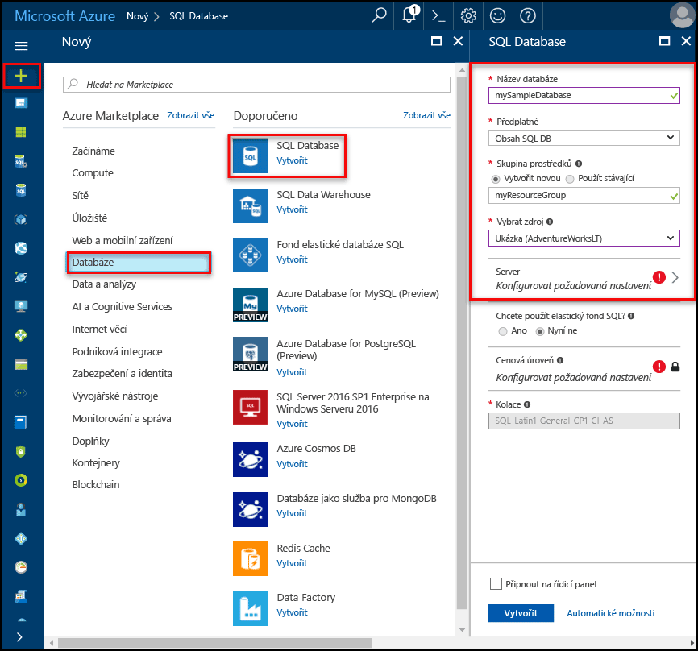
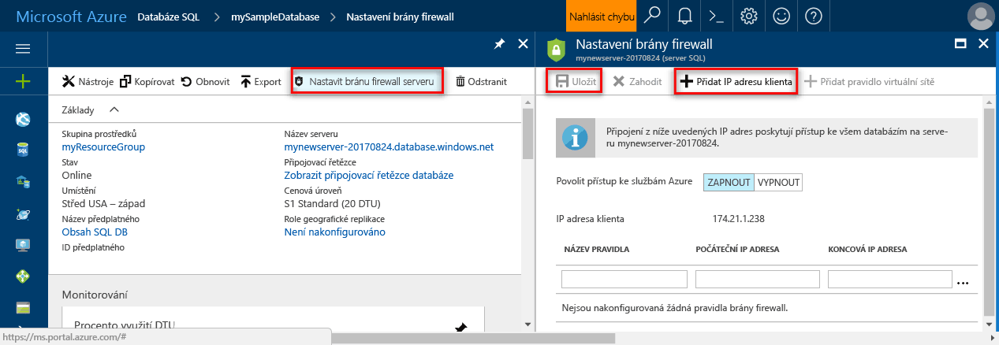

# Vytvářet a spravovat servery Azure SQL Database a databáze

Azure SQL database je spravovaný databáze v Microsoft Azure, který je vytvořen v rámci [skupina prostředků Azure](../azure-resource-manager/resource-group-overview.md) s definovanou sadu [výpočetní a úložnou kapacitu pro různé úlohy](sql-database-service-tiers.md). Azure SQL database je přidružen logického serveru Azure SQL Database, která je vytvořena v rámci konkrétní oblasti Azure. 

## Azure SQL database může být jeden, ve fondu nebo oddílů databáze

Azure SQL database může být:

- Izolovaná databáze s [vlastní sadou prostředků](sql-database-what-is-a-dtu.md#what-are-database-transaction-units-dtus) (DTU)
- Součástí [elastický fond SQL](sql-database-elastic-pool.md) , [sdílí sadu prostředků](sql-database-what-is-a-dtu.md#what-are-elastic-database-transaction-units-edtus) (Edtu)
- Součástí [sady horizontálně dělených databází s horizontálním navýšením kapacity](sql-database-elastic-scale-introduction.md#horizontal-and-vertical-scaling); tyto databáze můžou být buď izolované, nebo součástí fondu
- Součástí sady databází, které se podílejí na [vzoru návrhu SaaS pro více klientů](sql-database-design-patterns-multi-tenancy-saas-applications.md); tyto databáze můžou být buď izolované, nebo součástí fondu (nebo obojí) 

> [!TIP]
> Platné názvy databází najdete v tématu [Identifikátory databází](https://docs.microsoft.com/en-us/sql/relational-databases/databases/database-identifiers). 
>
 
- Hello výchozí databázová kolace používá Microsoft Azure SQL Database je **SQL_LATIN1_GENERAL_CP1_CI_AS**, kde **LATIN1_GENERAL** je angličtina (Spojené státy), **CP1** je znaková stránka 1252, **CI** nerozlišuje, a **AS** je diakritikou. Další informace o tom, jak tooset hello kolace najdete v tématu [klauzuli COLLATE (Transact-SQL)](https://msdn.microsoft.com/library/ms184391.aspx).
- Microsoft Azure SQL Database podporuje tabular data stream (TDS) protokol klienta verze 7.3 nebo novější.
- Jsou povoleny pouze připojení TCP/IP.

## Co je logickému serveru Azure SQL?

Logický server funguje jako centrální administrativní bod pro více databází, včetně [elastické fondy SQL](sql-database-elastic-pool.md) [přihlášení](sql-database-manage-logins.md), [pravidla brány firewall](sql-database-firewall-configure.md), [auditování pravidla](sql-database-auditing.md), [hrozby zásady detekce](sql-database-threat-detection.md), a [převzetí služeb při selhání skupiny](sql-database-geo-replication-overview.md). Logický server může být v jiné oblasti než jeho skupin prostředků. logický server Hello musí existovat před vytvořením hello Azure SQL database. Všechny databáze na serveru jsou vytvořeny v rámci hello stejné oblasti jako hello logického serveru. 

> [!IMPORTANT]
> V databázi SQL server je logická konstrukce, která se liší od instance systému SQL Server, který je pravděpodobně obeznámeni s místními hello, world. Konkrétně hello služba SQL Database umožňuje žádné záruky ohledně umístění hello databází v souvislosti tootheir logické servery a zveřejňuje žádný přístup na úrovni instance nebo funkce.
> 

Když vytvoříte logického serveru, zadat server přihlašovací účet a heslo, který má práva správce toohello hlavní databáze na tomto serveru a všechny databáze na tomto serveru vytvořit. Tento počáteční účet je účet SQL přihlášení. Azure SQL Database podporuje ověřování SQL a ověřování Azure Active Directory pro ověřování. Informace o ověřování a přihlášení najdete v tématu [Správa databází a přihlašovacích údajů ve službě Azure SQL Database](sql-database-manage-logins.md). Ověřování systému Windows se nepodporuje. 

> [!TIP]
> Názvy platný prostředků skupiny a serveru, najdete v části [pojmenování pravidla a omezení](https://docs.microsoft.com/azure/architecture/best-practices/naming-conventions).
>

Logický server Azure Database:

- Je vytvořen v rámci předplatného Azure, avšak lze přesunout s předplatným tooanother jeho obsažených prostředků
- Je hello nadřazený prostředek pro databáze elastické fondy a datových skladů
- Poskytuje obor názvů pro databáze elastické fondy a datových skladů
- Je logický kontejner s silné životnost sémantiku - odstranění serveru a odstraní hello databázích s omezením, elastické fondy a datových skladů
- Účastní se [řízení přístupu Azure na základě rolí (RBAC)](/active-directory/role-based-access-control-what-is) -databází, elastické fondy a datových skladů v rámci serveru dědí oprávnění od hello server
- Je element horní hello identity databází, elastické fondy a datových skladů pro prostředků Azure pro účely správy (najdete v části Adresa URL hello schéma databáze a fondy)
- Uspořádává prostředky v oblasti.
- Poskytuje koncový bod připojení pro přístup k databázi (<serverName>.database.windows.net).
- Poskytuje přístup toometadata týkající se obsažených prostředků pomocí zobrazení dynamické správy připojování tooa hlavní databáze 
- Poskytuje hello oboru pro zásady správy, které použít tooits databází – přihlášení, brány firewall, audit, hrozby detekce atd. 
- Je omezené na základě kvótu v rámci předplatného nadřazené hello (šesti serverů na jedno předplatné, ve výchozím nastavení - [najdete v části předplatné omezuje zde](../azure-subscription-service-limits.md))
- Poskytuje hello obor pro kvóty databáze a kvóty DTU pro hello prostředky, které obsahuje (jako je například 45 000 DTU)
- Je hello oboru správy verzí pro možnosti zapnuta obsažených prostředků 
- Hlavní přihlášení na úrovni serveru můžou spravovat všechny databáze na serveru.
- Může obsahovat přihlášení podobné toothose v instance systému SQL Server ve vašem umístění, které mají přístup tooone nebo další databáze na serveru hello a může být omezené uděleno oprávnění správce. Další informace najdete v tématu [Přihlašovací údaje](sql-database-manage-logins.md).

## Chráněné bránou firewall databáze SQL Azure databáze SQL

toohelp chránit vaše data [brány firewall SQL Database](sql-database-firewall-configure.md) brání všechny přístup tooyour databázový server ani žádnou její databáze z mimo váš server toohello připojení přímo prostřednictvím připojení k předplatnému Azure. tooenable další připojení, musíte [vytvořit jeden nebo více pravidel brány firewall](sql-database-firewall-configure.md#creating-and-managing-firewall-rules). Vytváření a Správa SQL elastické fondy najdete v tématu [elastické fondy](sql-database-elastic-pool.md).

## Spravovat servery Azure SQL, databáze a brány firewall pomocí hello portálu Azure

Můžete vytvořit skupinu prostředků databáze Azure SQL hello předem nebo při vytváření samotný server hello. Existuje více metod pro získání tooa nového formuláře serveru SQL, tak, že vytvoříte nový server SQL nebo jako součást vytvoření nové databáze. 

### Vytvořit prázdný SQL server (logický server)

hello toocreate serveru (bez databáze) Azure SQL Database pomocí [portál Azure](https://portal.azure.com), přejděte tooa prázdného formuláře SQL server (logický server). Hello následující snímek obrazovky ukazuje jedné metody formuláře toocreate otevření prázdné logický SQL server. 

   

Pokud se zobrazí formulář toothis jiným způsobem, hello informace ve formuláři hello jsou identické.

### Vytvoření databáze SQL prázdné nebo ukázku

hello toocreate databázi Azure SQL pomocí [portál Azure](https://portal.azure.com), přejděte tooa prázdného formuláře databáze SQL a zadejte hello požadované informace. Můžete vytvořit skupinu prostředků a logický server předem nebo při vytváření samotná databáze hello hello Azure SQL database. Můžete vytvořit prázdnou databázi nebo vytvoření ukázkové databáze založené na společnosti Adventure Works LT. 

  

> [DŮLEŽITÉ] Informace o výběru hello cenovou úroveň pro vaši databázi najdete v tématu [úrovních služeb](sql-database-service-tiers.md).
>

### Spravovat existující server SQL

toomanage stávajícího serveru, přejděte toohello serveru pomocí metody – například od konkrétní stránky databáze SQL, hello **servery SQL** stránky nebo hello **všechny prostředky** stránky. Následující snímek obrazovky ukazuje, jak Hello toobegin nastavení brány firewall úrovni serveru z hello **přehled** stránky pro server. 

   

toomanage existující databázi, přejděte toohello **databází SQL** a klikněte na tlačítko hello databáze chcete toomanage. Následující snímek obrazovky ukazuje, jak Hello toobegin nastavení brány firewall úrovni serveru pro databázi z hello **přehled** stránky pro databázi. 

    

> [!IMPORTANT]
> Vlastnosti výkonnostní tooconfigure pro databázi, najdete v části [úrovních služeb](sql-database-service-tiers.md).
>

> [!TIP]
> Azure portálu rychlý úvodní kurz, najdete v části [vytvoření Azure SQL database v hello portál Azure](sql-database-get-started-portal.md).
>

## Spravovat servery Azure SQL, databáze a brány firewall pomocí prostředí PowerShell

toocreate a spravovat server Azure SQL, databází a brány firewall pomocí prostředí Azure PowerShell, použijte hello následující rutiny prostředí PowerShell. Pokud potřebujete tooinstall nebo upgrade prostředí PowerShell, přečtěte si téma [modul nainstalovat Azure PowerShell](/powershell/azure/install-azurerm-ps). Vytváření a Správa SQL elastické fondy najdete v tématu [elastické fondy](sql-database-elastic-pool.md).

| Rutina | Popis |
| --- | --- |
|[New-AzureRmSqlDatabase](/powershell/module/azurerm.sql/new-azurermsqldatabase)|Vytvoří databázi |
|[Get-AzureRmSqlDatabase](/powershell/module/azurerm.sql/get-azurermsqldatabase)|Získá jednu nebo více databází|
|[Set-AzureRmSqlDatabase](/powershell/module/azurerm.sql/set-azurermsqldatabase)|Nastaví vlastnosti pro databázi nebo přesune existující databáze do pružného fondu|
|[Remove-AzureRmSqlDatabase](/powershell/module/azurerm.sql/remove-azurermsqldatabase)|Odebere databáze|
|[Nový AzureRmResourceGroup](/powershell/module/azurerm.resources/new-azurermresourcegroup)|Vytvoří skupinu prostředků.]
|[Nový AzureRmSqlServer](/powershell/module/azurerm.sql/new-azurermsqlserver)|Vytvoří serveru|
|[Get-AzureRmSqlServer](/powershell/module/azurerm.sql/get-azurermsqlserver)|Vrátí informace o serverech|
|[Set-AzureRmSqlServer](https://docs.microsoft.com/en-us/powershell/module/azurerm.sql/set-azurermsqlserver)|Upraví vlastnosti serveru|
|[Remove-AzureRmSqlServer](/powershell/module/azurerm.sql/remove-azurermsqlserver)|Odebere server|
|[New-AzureRmSqlServerFirewallRule](/powershell/module/azurerm.sql/new-azurermsqlserverfirewallrule)|Vytvoří pravidlo brány firewall na úrovni serveru |
|[Get-AzureRmSqlServerFirewallRule](/powershell/module/azurerm.sql/get-azurermsqlserverfirewallrule)|Získá pravidla brány firewall pro server|
|[Set-AzureRmSqlServerFirewallRule](/powershell/module/azurerm.sql/set-azurermsqlserverfirewallrule)|Upraví pravidlo brány firewall na serveru|
|[Remove-AzureRmSqlServerFirewallRule](/powershell/module/azurerm.sql/remove-azurermsqlserverfirewallrule)|Odstraní pravidlo brány firewall ze serveru.|

> [!TIP]
> Rychlý úvodní kurz prostředí PowerShell, najdete v části [vytvářet izolované databáze Azure SQL pomocí prostředí PowerShell](sql-database-get-started-portal.md). Příklad skriptů prostředí PowerShell, najdete v části [použijte PowerShell toocreate jeden SQL Azure databáze a nakonfigurujte pravidlo brány firewall](scripts/sql-database-create-and-configure-database-powershell.md) a [sledování a škálování jeden SQL databáze pomocí prostředí PowerShell](scripts/sql-database-monitor-and-scale-database-powershell.md).
>

## Spravovat servery Azure SQL, databáze a brány firewall pomocí hello rozhraní příkazového řádku Azure

toocreate a spravovat server Azure SQL, databáze a brány firewall s hello [rozhraní příkazového řádku Azure](/cli/azure/overview), použijte hello [databáze SQL Azure CLI](/cli/azure/sql/db) příkazy. Použití hello [cloudové prostředí](/azure/cloud-shell/overview) toorun hello rozhraní příkazového řádku v prohlížeči nebo [nainstalovat](/cli/azure/install-azure-cli) ji v systému macOS, Linux nebo Windows. Vytváření a Správa SQL elastické fondy najdete v tématu [elastické fondy](sql-database-elastic-pool.md).

| Rutina | Popis |
| --- | --- |
|[Vytvoření az sql db](/cli/azure/sql/db#create) |Vytvoří databázi|
|[AZ sql db seznamu](/cli/azure/sql/db#list)|Zobrazí všechny databáze a datových skladů na serveru, nebo všechny databáze v elastickém fondu|
|[seznam edicí az sql db](/cli/azure/sql/db#list-editions)|Seznamy, které jsou k dispozici služby cíle a limity úložiště|
|[db sql az seznamu – použití](/cli/azure/sql/db#list-usages)|Vrátí databáze použití|
|[AZ sql db zobrazit](/cli/azure/sql/db#show)|Získá databáze nebo datového skladu|
|[aktualizace databáze sql az](/cli/azure/sql/db#update)|Aktualizuje databázi|
|[Odstranění databáze sql az](/cli/azure/sql/db#delete)|Odebere databáze|
|[Vytvoření skupiny az](/cli/azure/group#create)|Vytvoří skupinu prostředků.|
|[Vytvoření az sql serveru](/cli/azure/sql/server#create)|Vytvoří serveru|
|[seznam serverů sql az](/cli/azure/sql/server#list)|Vytvoří seznam serverů|
|[server sql az seznamu – použití](/cli/azure/sql/server#list-usages)|Vrátí použití serveru|
|[AZ sql serveru zobrazit](/cli/azure/sql/server#show)|Získá serveru|
|[aktualizace az sql server](/cli/azure/sql/server#update)|Aktualizace serveru|
|[Odstranění serveru sql az](/cli/azure/sql/server#delete)|Odstraní server|
|[Vytvoření brány firewall pravidlo az sql serveru](/cli/azure/sql/server/firewall-rule#create)|Vytvoří pravidlo brány firewall serveru|
|[seznam az sql serverů pravidlo brány firewall](/cli/azure/sql/server/firewall-rule#list)|Seznamy hello pravidla brány firewall na serveru|
|[Zobrazit pravidlo brány firewall serveru sql az](/cli/azure/sql/server/firewall-rule#show)|Zobrazí podrobnosti hello pravidla brány firewall|
|[aktualizace pravidla brány firewall az sql server](/cli/azure/sql/server/firewall-rule#update)|Aktualizace pravidla brány firewall|
|[Odstranit pravidlo brány firewall serveru sql az](/cli/azure/sql/server/firewall-rule#delete)|Odstraní pravidlo brány firewall|

> [!TIP]
> Rychlý úvodní kurz pro Azure CLI, najdete v části [vytvářet izolované databáze Azure SQL pomocí rozhraní příkazového řádku Azure hello](sql-database-get-started-cli.md). Příklad skriptů příkazového řádku Azure CLI, najdete v části [použití rozhraní příkazového řádku toocreate jeden SQL Azure databáze a nakonfigurujte pravidlo brány firewall](scripts/sql-database-create-and-configure-database-cli.md) a [toomonitor použití rozhraní příkazového řádku a škálování jedné databáze SQL](scripts/sql-database-monitor-and-scale-database-cli.md).
>

## Spravovat servery Azure SQL, databáze a brány firewall pomocí jazyka Transact-SQL

toocreate a spravovat server Azure SQL, databází a brány firewall pomocí jazyka Transact-SQL, použijte následující příkazy T-SQL hello. Můžete použít tyto příkazy pomocí hello portál Azure, [SQL Server Management Studio](/sql/ssms/use-sql-server-management-studio), [Visual Studio Code](https://code.visualstudio.com/docs), nebo jiný program, který se můžete připojit server Azure SQL Database tooan a předat Transact-SQL příkazy. Pro správu SQL elastické fondy, najdete v části [elastické fondy](sql-database-elastic-pool.md).

> [!IMPORTANT]
> Nelze vytvořit nebo odstranit serveru pomocí jazyka Transact-SQL.
>

| Příkaz | Popis |
| --- | --- |
|[Vytvoření databáze (Azure SQL Database)](/sql/t-sql/statements/create-database-azure-sql-database)|Vytvoří novou databázi. Musí být připojené toohello hlavní databázi toocreate novou databázi.|
| [Příkaz ALTER DATABASE (databáze Azure SQL)](/sql/t-sql/statements/alter-database-azure-sql-database) |Upravuje Azure SQL database. |
|[Příkaz ALTER databáze (Azure SQL Data Warehouse)](/sql/t-sql/statements/alter-database-azure-sql-data-warehouse)|Upravuje datovým skladem Azure SQL.|
|[ODPOJENÍ databáze (Transact-SQL)](/sql/t-sql/statements/drop-database-transact-sql)|Odstraní databázi.|
|[Sys.database_service_objectives (Azure SQL Database)](/sql/relational-databases/system-catalog-views/sys-database-service-objectives-azure-sql-database)|Vrátí hello edition (vrstva služby), cíl služby (cenové úrovně) a název elastického fondu, pokud existuje, pro databázi Azure SQL nebo Azure SQL Data Warehouse. Pokud přihlášení toohello hlavní databázi v serveru Azure SQL Database, vrátí informace na všechny databáze. Pro Azure SQL Data Warehouse musí být připojené toohello hlavní databázi.|
|[Sys.dm_db_resource_stats (Azure SQL Database)](/sql/relational-databases/system-dynamic-management-views/sys-dm-db-resource-stats-azure-sql-database)| Vrátí spotřeby procesoru, vstupně-výstupních operací a paměti pro databázi Azure SQL Database. Jeden řádek existuje pro každých 15 sekund, i když neprobíhá žádná aktivita v databázi hello.|
|[Sys.resource_stats (Azure SQL Database)](/sql/relational-databases/system-catalog-views/sys-resource-stats-azure-sql-database)|Vrátí data o využití a úložiště procesoru pro Azure SQL Database. Hello data jsou shromažďována a agregovat v pěti minutách.|
|[Sys.database_connection_stats (Azure SQL Database)](/sql/relational-databases/system-catalog-views/sys-database-connection-stats-azure-sql-database)|Obsahuje statistiku pro události připojení databáze SQL Database, umožní získat přehled o databáze připojení úspěchy a selhání. |
|[Sys.event_log (Azure SQL Database)](/sql/relational-databases/system-catalog-views/sys-event-log-azure-sql-database)|Vrátí úspěšné připojení databáze Azure SQL Database, připojení selhání a zablokování. Můžete použít tento tootrack informace nebo řešení potíží s vaší databáze aktivity s databází SQL.|
|[příkaz sp_set_firewall_rule (Azure SQL Database)](/sql/relational-databases/system-stored-procedures/sp-set-firewall-rule-azure-sql-database)|Vytvoří nebo aktualizuje hello nastavení brány firewall na úrovni serveru pro server služby SQL Database. Tato uložená procedura je pouze v hlavní přihlášení hello hlavní databázi toohello úrovni serveru k dispozici. Pravidlo brány firewall na úrovni serveru lze vytvořit pouze po vytvoření první pravidlo brány firewall na úrovni serveru hello uživatelem s oprávnění na úrovni Azure pomocí jazyka Transact-SQL|
|[Sys.firewall_rules (Azure SQL Database)](/sql/relational-databases/system-catalog-views/sys-firewall-rules-azure-sql-database)|Vrací informace o nastavení brány firewall na úrovni serveru hello přidružené k vaší databázi SQL Azure Microsoft.|
|[sp_delete_firewall_rule (Azure SQL Database)](/sql/relational-databases/system-stored-procedures/sp-delete-firewall-rule-azure-sql-database)|Nastavení brány firewall na úrovni serveru odebere server služby SQL Database. Tato uložená procedura je pouze v hlavní přihlášení hello hlavní databázi toohello úrovni serveru k dispozici.|
|[sp_set_database_firewall_rule (Azure SQL Database)](/sql/relational-databases/system-stored-procedures/sp-set-database-firewall-rule-azure-sql-database)|Vytvoří nebo aktualizuje hello pravidla brány firewall na úrovni databáze Azure SQL Database nebo SQL Data Warehouse. Pravidla firewallu databáze lze konfigurovat pro hlavní databázi hello a pro uživatele databáze pro službu SQL Database. Pravidla firewallu databáze jsou užitečné, pokud pomocí obsažené uživatele databáze. |
|[Sys.database_firewall_rules (Azure SQL Database)](/sql/relational-databases/system-catalog-views/sys-database-firewall-rules-azure-sql-database)|Vrací informace o nastavení brány firewall na úrovni databáze hello přidružené k vaší databázi SQL Azure Microsoft. |
|[sp_delete_database_firewall_rule (Azure SQL Database)](/sql/relational-databases/system-stored-procedures/sp-delete-database-firewall-rule-azure-sql-database)|Nastavení brány firewall na úrovni databáze odebere z Azure SQL Database nebo SQL Data Warehouse. |

> [!TIP]
> Rychlý úvodní kurz pomocí SQL Server Management Studio v systému Windows, najdete v části [Azure SQL Database: tooconnect a dotazování dat pomocí SQL Server Management Studio](sql-database-connect-query-ssms.md). Rychlý úvodní kurz pomocí kódu v jazyce Visual Studio v systému macOS hello, Linux nebo Windows, najdete v části [Azure SQL Database: použití Visual Studio Code tooconnect a dotazování dat](sql-database-connect-query-vscode.md).

## Spravovat servery Azure SQL, databáze a brány firewall pomocí hello REST API

toocreate a spravovat server Azure SQL, databází a brány firewall pomocí hello REST API, přečtěte si [Azure SQL Database REST API](/rest/api/sql/).

## Další kroky

- toolearn o sdružování databází pomocí SQL elastické fondy, najdete v části [elastické fondy](sql-database-elastic-pool.md).
- Informace o hello služby Azure SQL Database, najdete v článku [co je SQL Database?](sql-database-technical-overview.md).
- toolearn o migraci tooAzure databáze systému SQL Server, najdete v části [migrovat tooAzure SQL Database](sql-database-cloud-migrate.md).
- Informace o podporovaných funkcích najdete v tématu [Funkce](sql-database-features.md).
