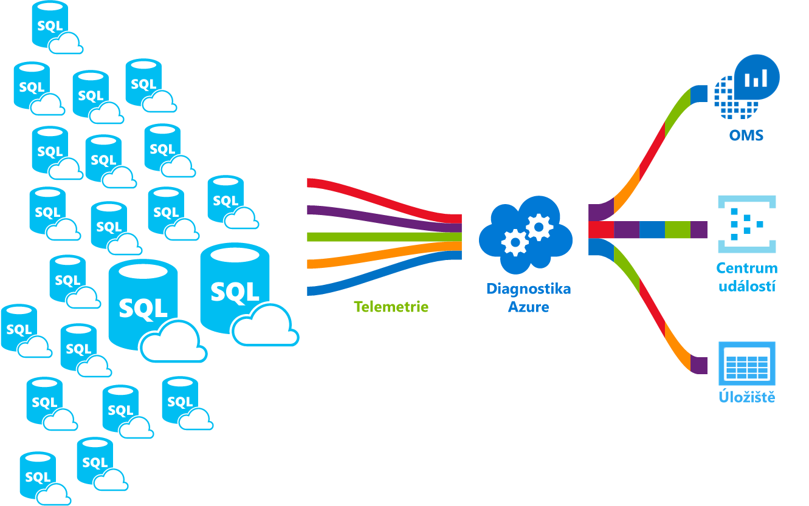

# Co je služba Azure SQL Database?What is the Azure SQL Database service? 

SQL Database je služba relačních databází pro obecné účely v Microsoft Azure, která podporuje struktury, jako jsou relační data, JSON, prostorová data a XML.SQL Database is a general-purpose relational database service in Microsoft Azure that supports structures such as relational data, JSON, spatial, and XML. Zajišťuje [dynamicky škálovatelný výkon](sql-database-service-tiers.md) a nabízí možnosti jako [indexy columnstore](https://docs.microsoft.com/sql/relational-databases/indexes/columnstore-indexes-overview) pro extrémní analytické analýzy a generování sestav nebo [OLTP v paměti](sql-database-in-memory.md) pro extrémní zpracování transakcí.It delivers [dynamically scalable performance](sql-database-service-tiers.md) and provides options such as [columnstore indexes](https://docs.microsoft.com/sql/relational-databases/indexes/columnstore-indexes-overview) for extreme analytic analysis and reporting, and [in-memory OLTP](sql-database-in-memory.md) for extreme transactional processing. Microsoft zajišťuje bezproblémové opravy a aktualizace základního kódu SQL a odděluje veškerou správu základní infrastruktury.Microsoft handles all patching and updating of the SQL code base seamlessly and abstracts away all management of the underlying infrastructure. 

SQL Database sdílí základ kódu s [databázovým strojem Microsoft SQL Serveru](https://docs.microsoft.com/sql/sql-server/sql-server-technical-documentation).SQL Database shares its code base with the [Microsoft SQL Server database engine](https://docs.microsoft.com/sql/sql-server/sql-server-technical-documentation). V rámci strategie Microsoftu zaměřené na cloud se nové funkce SQL Serveru uvolňují nejprve do služby SQL Database a až potom do samotného SQL Serveru.With Microsoft's cloud-first strategy, the newest capabilities of SQL Server are released first to SQL Database, and then to SQL Server itself. Tento přístup vám poskytuje nejnovější funkce SQL Serveru bez režijních nákladů na opravy nebo aktualizace. Kromě toho umožňuje testování těchto funkcí v milionech databází.This approach provides you with the newest SQL Server capabilities with no overhead for patching or upgrading - and with these new features tested across millions of databases. Pokud se chcete o nových funkcích dozvědět hned po jejich oznámení, podívejte se na:For information about new capabilities as they are announced, see:

- **[Plány Azure do budoucna pro službu SQL Database:](https://azure.microsoft.com/roadmap/?category=databases)** Místo, kde můžete zjistit, co je nového a co se právě chystá.**[Azure Roadmap for SQL Database](https://azure.microsoft.com/roadmap/?category=databases)**: A place to find out what’s new and what’s coming next. 
- **[Blog o službě Azure SQL Database:](https://azure.microsoft.com/blog/topics/database)** Místo, kde členové produktového týmu SQL Serveru píší o novinkách a funkcích služby SQL Database.**[Azure SQL Database blog](https://azure.microsoft.com/blog/topics/database)**: A place where SQL Server product team members blog about SQL Database news and features. 

SQL Database nabízí předvídatelný výkon na několika úrovních služeb, které poskytují dynamickou škálovatelnost bez přerušení provozu, integrovanou inteligentní optimalizaci, globální škálovatelnost a dostupnost a pokročilé možnosti zabezpečení – to vše téměř bez nutnosti jakékoli správy.SQL Database delivers predictable performance at multiple service levels that provides dynamic scalability with no downtime, built-in intelligent optimization, global scalability and availability, and advanced security options — all with near-zero administration. Díky těmto možnostem se můžete zaměřit na rychlý vývoj aplikací a zkrácení doby dodání produktu na trh, namísto vynakládání prostředků a drahocenného času na správu virtuálních počítačů a infrastruktury.These capabilities allow you to focus on rapid app development and accelerating your time to market, rather than allocating precious time and resources to managing virtual machines and infrastructure. SQL Database je aktuálně v 38 datových centrech po celém světě a další datová centra se pravidelně přidávají, což vám umožňuje provozovat databázi v datovém centru ve vaší blízkosti.The SQL Database service is currently in 38 data centers around the world, with more data centers coming online regularly, which enables you to run your database in a data center near you.

> [!NOTE]
> Informace o bezpečnosti samotné platformy Azure najdete v [Centru zabezpečení Azure](https://azure.microsoft.com/support/trust-center/security/).See [Azure Trust Center](https://azure.microsoft.com/support/trust-center/security/) for information about Azure's platform security.
>

## Škálovatelnost výkonu a fondyScalable performance and pools

Ve službě SQL Database je každá databáze izolovaná od všech ostatních a má vlastní [úroveň služeb](sql-database-service-tiers.md) s garantovanou úrovní výkonu.With SQL Database, each database is isolated from each other and portable, each with its own [service tier](sql-database-service-tiers.md) with a guaranteed performance level. SQL Database nabízí různé úrovně výkonu pro různé potřeby a umožňuje spojení databází do fondu pro maximalizaci využití prostředků a snížení nákladů.SQL Database provides different performance levels for different needs, and enables databases to be pooled to maximize the use of resources and save money.

### Úprava výkonu a škálování bez výpadkůAdjust performance and scale without downtime

SQL Database podporuje databázové úlohy od zcela nenáročných až po velmi náročné díky tomu, že nabízí čtyři úrovně služeb: Basic, Standard, Premium a Premium RS.SQL Database offers four service tiers to support lightweight to heavyweight database workloads: Basic, Standard, Premium, and Premium RS. S nízkými měsíčními náklady můžete sestavit svou první aplikaci s malou izolovanou databází a později ručně nebo programově změnit úroveň služby, aby splňovala požadavky vašeho řešení.You can build your first app on a small, single database at a low cost per month and then change its service tier manually or programmatically at any time to meet the needs of your solution. Můžete upravit úroveň výkonu bez přerušení provozu aplikace a bez dopadu na vaše zákazníky.You can adjust performance without downtime to your app or to your customers. Dynamická škálovatelnost umožňuje databázím transparentně reagovat na rychle se měnící požadavky na prostředky a vy díky tomu platíte pouze za prostředky, které potřebujete, když je potřebujete.Dynamic scalability enables your database to transparently respond to rapidly changing resource requirements and enables you to only pay for the resources that you need when you need them.

   

### Elastické fondy pro maximalizaci využití prostředkůElastic pools to maximize resource utilization

Řadě firem a aplikací stačí, že může vytvářet izolované databáze a nastavovat větší nebo menší výkon na vyžádání, zejména při relativně předvídatelném způsobu používání.For many businesses and applications, being able to create single databases and dial performance up or down on demand is enough, especially if usage patterns are relatively predictable. Ale pokud vaše vzorce používání předvídatelné nejsou, může být správa nákladů a údržba obchodního modelu velmi těžká.But if you have unpredictable usage patterns, it can make it hard to manage costs and your business model. [Elastické fondy](sql-database-elastic-pool.md) jsou navržené k řešení tohoto problému.[Elastic pools](sql-database-elastic-pool.md) are designed to solve this problem. Princip je jednoduchý.The concept is simple. Prostředky výkonu přidělujete fondu, nikoli jednotlivým databázím, a platíte za souhrnné prostředky výkonu fondu místo placení za výkon izolovaných databází.You allocate performance resources to a pool rather than an individual database, and pay for the collective performance resources of the pool rather than for single database performance. 

   

S elastickými fondy se nemusíte starat o zvyšování a snižování výkonu databáze s kolísajícími požadavky na prostředky.With elastic pools, you don’t need to focus on dialing database performance up and down as demand for resources fluctuates. Databáze ve fondu spotřebovávají prostředky výkonu elastického fondu podle potřeby.The pooled databases consume the performance resources of the elastic pool as needed. Databáze ve fondu spotřebovávají výkon, ale nepřekračují omezení fondu, takže vaše náklady budou předvídatelné, i když využívání jednotlivých databází odhadnutelné nebude.Pooled databases consume but don’t exceed the limits of the pool, so your cost remains predictable even if individual database usage doesn’t. A navíc můžete [přidávat a odebírat databáze ve fondu](sql-database-elastic-pool-manage-portal.md), škálovat aplikace od několik databází k tisícům a přitom mít rozpočet stále pod kontrolou.What’s more, you can [add and remove databases to the pool](sql-database-elastic-pool-manage-portal.md), scaling your app from a handful of databases to thousands, all within a budget that you control. Můžete také řídit minimální a maximální prostředky, které mají databáze ve fondu k dispozici, a tím zajistit, že žádná databáze ve fondu nebude využívat všechny prostředky fondu a pro každou databázi ve fondu bude garantováno minimální množství prostředků.You can also control the minimum and maximum resources available to databases in the pool to ensure that no database in the pool uses all the pool resources and that every pooled database has a guaranteed minimum amount of resources. Další informace o návrhových schématech aplikací SaaS využívajících elastické fondy najdete v tématu [Návrhová schémata pro víceklientské aplikace SaaS využívající službu SQL Database](sql-database-design-patterns-multi-tenancy-saas-applications.md).To learn more about design patterns for SaaS applications using elastic pools, see [Design Patterns for Multi-tenant SaaS Applications with SQL Database](sql-database-design-patterns-multi-tenancy-saas-applications.md).

### Kombinace izolovaných databází s databázemi ve fonduBlend single databases with pooled databases

Ať už si vyberete kteroukoli cestu – izolované databáze nebo elastické fondy – nejste k ní odsouzeni na věčné časy.Either way you go — single databases or elastic pools — you are not locked in. Izolované databáze můžete kombinovat s elastickými fondy a snadno a rychle měnit úrovně služeb izolovaných databází a elastických fondů, abyste je přizpůsobili své situaci.You can blend single databases with elastic pools, and change the service tiers of single databases and elastic pools quickly and easily to adapt to your situation. S výkonem a dostupností, které Azure nabízí, můžete se službou SQL Database kombinovat další služby Azure podle konkrétních potřeb vašich aplikací pro zvýšení ekonomičnosti provozu a efektivity prostředků a otevírat tak zcela nové obchodní příležitosti.With the power and reach of Azure, you can mix-and-match other Azure services with SQL Database to meet your unique app design needs, drive cost and resource efficiencies, and unlock new business opportunities.

### Rozsáhlé monitorování a možnosti upozorňováníExtensive monitoring and alerting capabilities

Jak ale můžeme srovnávat relativní výkon izolovaných databází a elastických fondů?But how can you compare the relative performance of single databases and elastic pools? Jak poznáme správnou hodnotu nastavení při přidávání nebo ubírání výkonu?How do you know the right click-stop when you dial up and down? Můžete použít [integrované nástroje pro monitorování výkonu](sql-database-performance.md) a [upozorňování](sql-database-insights-alerts-portal.md) v kombinaci s hodnocením výkonu na základě [jednotek DTU (Database Transaction Unit) pro izolované databáze a elastických DTU (eDTU) pro elastické fondy](sql-database-what-is-a-dtu.md).You use the [built-in performance monitoring](sql-database-performance.md) and [alerting](sql-database-insights-alerts-portal.md) tools, combined with the performance ratings based on [Database Transaction Units (DTUs) for single databases and elastic DTUs (eDTUs) for elastic pools](sql-database-what-is-a-dtu.md). Pomocí těchto nástrojů můžete rychle posoudit dopad vertikálního navýšení nebo snížení kapacity v závislosti na stávajících nebo předpokládaných požadavcích.Using these tools, you can quickly assess the impact of scaling up or down based on your current or project performance needs. Podrobnosti viz téma [Výkon a možnosti služby SQL Database: Co je k dispozici v jednotlivých úrovních služeb](sql-database-service-tiers.md).See [SQL Database options and performance: Understand what's available in each service tier](sql-database-service-tiers.md) for details.

Kromě toho může SQL Database [generovat metriky a diagnostické protokoly](sql-database-metrics-diag-logging.md) pro snazší monitorování.Additionally, SQL Database can [emit metrics and diagnostic logs](sql-database-metrics-diag-logging.md) for easier monitoring. SQL Database můžete nakonfigurovat pro ukládání využití prostředků, pracovních procesů, relací a možností připojení do jednoho z těchto prostředků Azure:You can configure SQL Database to store resource usage, workers and sessions, and connectivity into one of these Azure resources:

- **Azure Storage:** Pro archivaci obrovských objemů telemetrických dat za nízkou cenu.**Azure Storage**: For archiving vast amounts of telemetry for a small price
- **Centrum událostí Azure:** Pro integraci telemetrických dat služby SQL Database s vlastními řešeními monitorování nebo aktivními kanály.**Azure Event Hub**: For integrating SQL Database telemetry with your custom monitoring solution or hot pipelines
- **Azure Log Analytics:** Pro integrované řešení monitorování s možnostmi pro generování sestav, upozorňování a omezení rizik.**Azure Log Analytics**: For built-in monitoring solution with reporting, alerting, and mitigating capabilities

    

## Možnosti dostupnostiAvailability capabilities

Dostupnost služby Azure se smlouvou o úrovní služeb [(SLA)](http://azure.microsoft.com/support/legal/sla/) dosahuje špičkové hodnoty 99,99 %, protože staví na globální síti Microsoftem spravovaných datových center. Může tedy udržet vaše aplikace v nepřetržitém provozu každý den po celý rok.Azure's industry leading 99.99% availability service level agreement [(SLA)](http://azure.microsoft.com/support/legal/sla/), powered by a global network of Microsoft-managed datacenters, helps keep your app running 24/7. Kromě toho SQL Database nabízí integrované funkce pro [provozní kontinuitu a globální škálovatelnost](sql-database-business-continuity.md), mezi které patří:In addition, SQL Database provides built-in [business continuity and global scalability](sql-database-business-continuity.md) features, including:

- **[Automatické zálohování:](sql-database-automated-backups.md)** SQL Database automaticky provádí úplné a rozdílové zálohování a zálohování protokolů transakcí.**[Automatic backups](sql-database-automated-backups.md)**: SQL Database automatically performs full, differential, and transaction log backups.
- **[Obnovení k určitému bodu v čase:](sql-database-recovery-using-backups.md)** SQL Database podporuje obnovení k libovolnému bodu v čase v rámci doby uchování automatických záloh.**[Point-in-time restores](sql-database-recovery-using-backups.md)**: SQL Database supports recovery to any point in time within the automatic backup retention period.
- **[Aktivní geografická replikace:](sql-database-geo-replication-overview.md)** SQL Database umožňuje konfigurovat až čtyři sekundární databáze s možností čtení ve stejném datovém centru nebo v globálně distribuovaných datových centrech.**[Active geo-replication](sql-database-geo-replication-overview.md)**: SQL Database allows you to configure up to four readable secondary databases in either the same or globally distributed Azure data centers.  Pokud například máte aplikaci SaaS s databází katalogu s velkým počtem souběžných transakcí jen pro čtení, použijte geografickou replikaci a umožněte globální škálovaní operací čtení a odstraňte problémová místa v hlavní databázi způsobená úlohami čtení.For example, if you have a SaaS application with a catalog database that has a high volume of concurrent read-only transactions, use active geo-replication to enable global read scale and remove bottlenecks on the primary that are due to read workloads. 
- **[Skupiny převzetí služeb při selhání:](sql-database-geo-replication-overview.md)** SQL Database umožňuje povolit vysokou dostupnost a vyrovnávání zatížení v globálním měřítku, včetně transparentní geografické replikace a převzetí služeb při selhání pro velké sady databází a elastické fondy.**[Failover groups](sql-database-geo-replication-overview.md)**: SQL Database allows you to enable high availability and load balancing at global scale, including transparent geo-replication and failover of large sets of databases and elastic pools. Skupiny převzetí služeb při selhání a aktivní geografická replikace umožňují vytváření globálně distribuovaných aplikací SaaS s minimálními nároky na správu. Veškeré komplexní monitorování, směrování a orchestraci převzetí služeb při selhání zajišťuje služba SQL Database.Failover groups and active geo-replication enables creation of globally distributed SaaS applications with minimal administration overhead leaving all the complex monitoring, routing, and failover orchestration to SQL Database.

## Integrované inteligentní funkceBuilt-in intelligence

Se službou SQL Database získáte integrované inteligentní funkce, které vám pomůžou výrazně snížit náklady na provoz a správu databází a maximalizovat výkon a zabezpečení aplikace.With SQL Database, you get built-in intelligence that helps you dramatically reduce the costs of running and managing databases and maximizes both performance and security of your application. Během nepřetržitého spouštění milionů zákaznických úloh SQL Database shromažďuje a zpracovává obrovské množství telemetrických dat, přičemž zároveň plně respektuje ochranu osobních údajů zákazníků.Running millions of customer workloads around-the-clock, SQL Database collects and processes a massive amount of telemetry data, while also fully respecting customer privacy behind the scenes. Různé algoritmy neustále vyhodnocují telemetrická data, aby se služba mohla učit a přizpůsobovat vaší aplikaci.Various algorithms are continuously evaluating the telemetry data so that the service can learn and adapt with your application. Na základě této analýzy služba nabízí doporučení pro vylepšení výkonu přizpůsobená pro konkrétní úlohu.Based on this analysis, the service comes up with performance improving recommendations tailored to your specific workload. 

### Automatická optimalizace výkonuAutomatic performance tuning

SQL Database nabízí podrobné přehledy dotazů, které potřebujete monitorovat.SQL Database provides detailed insight into the queries that you need to monitor. SQL Database zjistí aspekty vaší databáze a umožní vám přizpůsobit schéma databáze vaší úloze.SQL Database's learns about your database patterns and enables you to adapt your database schema to your workload. SQL Database poskytuje doporučení pro optimalizaci výkonu pomocí funkce [SQL Database Advisor](sql-database-advisor.md), kde můžete zkontrolovat akce optimalizace a použít je.SQL Database provides performance tuning recommendations using  [SQL Database Advisor](sql-database-advisor.md), where you can review tuning actions and apply them. Neustálé monitorování databáze je však náročný a zdlouhavý úkol, zejména při práci s mnoha databázemi.However, constantly monitoring database is a hard and tedious task, especially when dealing with many databases. Efektivní správa velkého počtu databází může být nemožná i se všemi dostupnými nástroji a sestavami, které SQL Database a Azure Portal nabízí.Managing a huge number of databases might be impossible to do efficiently even with all available tools and reports that SQL Database and Azure portal provide. Místo ručního monitorování a optimalizace databáze můžete zvážit delegování některých akcí monitorování a optimalizace do služby SQL Database pomocí funkce automatické optimalizace.Instead of monitoring and tuning your database manually, you might consider delegating some of the monitoring and tuning actions to SQL Database using automatic tuning feature. SQL Database automaticky aplikuje doporučení a testuje a ověřuje každou z akcí optimalizace pro zajištění stálého vylepšování výkonu.SQL Database automatically apply recommendations, tests, and verifies each of its tuning actions to ensure the performance keeps improving. Díky tomu se služba SQL Database může automaticky přizpůsobit vaší úloze řízeným a bezpečným způsobem.This way, SQL Database automatically adapts to your workload in controlled and safe way. Automatická optimalizace znamená, že se výkon vaší databáze pečlivě monitoruje a porovnává před a po každé akci optimalizace, a pokud se výkon nezlepší, akce optimalizace se vrátí zpět.Automatic tuning means that the performance of your database is carefully monitored and compared before and after every tuning action, and if the performance doesn’t improve, the tuning action is reverted.

V současné době se mnoho našich partnerů provozujících [víceklientské aplikace SaaS](sql-database-design-patterns-multi-tenancy-saas-applications.md) nad službou SQL Database spoléhá na automatickou optimalizaci výkonu pro zajištění, že jejich aplikace budou mít vždy stabilní a předvídatelný výkon.Today, many of our partners running [SaaS multi-tenant apps](sql-database-design-patterns-multi-tenancy-saas-applications.md) on top of SQL Database are relying on automatic performance tuning to make sure their applications always have stable and predictable performance. Tato funkce pro ně výrazně snižuje riziko incidentu výkonu uprostřed noci.For them, this feature tremendously reduces the risk of having a performance incident in the middle of the night. Vzhledem k tomu, že část jejich zákazníků také používá SQL Server, můžou navíc s využitím stejných doporučení indexování získaných ze služby SQL Database pomáhat svým zákazníkům s SQL Serverem.In addition, since part of their customer base also uses SQL Server, they are using the same indexing recommendations provided by SQL Database to help their SQL Server customers.

Ve službě SQL Database existují dva dostupné aspekty automatické optimalizace:There are two automatic tuning aspects that are available in SQL Database:

- **[Automatická správa indexů:](sql-database-automatic-tuning.md#automatic-index-management)** Identifikuje indexy, které by se měly do databáze přidat nebo z ní naopak odebrat.**[Automatic index management](sql-database-automatic-tuning.md#automatic-index-management)**: Identifies indexes that should be added in your database, and indexes that should be removed.
- **[Automatická oprava plánů:](sql-database-automatic-tuning.md#automatic-plan-choice-correction)** Identifikuje problematické plány a řeší problémy s výkonem plánu SQL (již brzy, aktuálně k dispozici v SQL Serveru 2017).**[Automatic plan correction](sql-database-automatic-tuning.md#automatic-plan-choice-correction)**: Identifies problematic plans and fixes SQL plan performance problems (coming soon, already available in SQL Server 2017).

### Adaptivní zpracování dotazůAdaptive query processing

Do služby SQL Database přidáváme také řadu funkcí pro [adaptivní zpracování dotazů](/sql/relational-databases/performance/adaptive-query-processing), včetně prokládaného spouštění funkcí s více příkazy vracejících tabulky, odezvy přidělení paměti v režimu dávky a adaptivních příkazů join v režimu dávky.We are also adding the [adaptive query processing](/sql/relational-databases/performance/adaptive-query-processing) family of features to SQL Database, including interleaved execution for multi-statement table-valued functions, batch mode memory grant feedback, and batch mode adaptive joins. Každá z těchto funkcí pro adaptivní zpracování dotazů používá podobné techniky učení a adaptace a pomáhá tak dále řešit problémy s výkonem související s historicky nezvladatelnými problémy s optimalizací dotazů.Each of these adaptive query processing features applies similar “learn and adapt” techniques, helping further address performance issues related to historically intractable query optimization problems.

### Inteligentní detekce hrozebIntelligent threat detection

 [Detekce hrozeb SQL](sql-database-threat-detection.md) využívá [auditování služby SQL Database](sql-database-auditing.md) k nepřetržitému monitorování databází Azure SQL a detekci potencionálně škodlivých pokusů o přístup k citlivým datům.[SQL Threat Detection](sql-database-threat-detection.md) leverages [SQL Database auditing](sql-database-auditing.md) to continuously monitor Azure SQL databases for potentially harmful attempts to access sensitive data. Detekce hrozeb SQL poskytuje novou vrstvu zabezpečení, která zákazníkům umožňuje díky poskytování upozornění zabezpečení na neobvyklé aktivity detekovat a reagovat na potenciální hrozby, když k nim dojde.SQL threat detection provides a new layer of security, which enables customers to detect and respond to potential threats as they occur by providing security alerts on anomalous activities. Uživatelé obdrží upozornění při podezřelých databázových aktivitách, potenciálních ohroženích zabezpečení, útocích prostřednictvím injektáže SQL a neobvyklých vzorcích přístupu k databázi.Users receive alerts upon suspicious database activities, potential vulnerabilities, and SQL injection attacks, and anomalous database access patterns. Upozornění detekce hrozeb SQL obsahují podrobnosti o podezřelé aktivitě a doporučení akce k prošetření a zmírnění hrozby.SQL threat detection alerts provide details of suspicious activity and recommend action on how to investigate and mitigate the threat. Uživatelé můžou prozkoumat podezřelé události a určit, jestli jsou důsledkem pokusu o přístup, porušení zabezpečení nebo zneužití dat v databázi.Users can explore the suspicious events to determine if the event results from an attempt to access, breach, or exploit data in the database. Detekce hrozeb usnadňuje řešení potenciálních ohrožení databáze, aniž byste museli být odborníkem na zabezpečení nebo museli spravovat pokročilé systémy monitorování zabezpečení.Threat detection makes it simple to address potential threats to the database without the need to be a security expert or manage advanced security monitoring systems.

## Pokročilé zabezpečení a dodržování předpisůAdvanced security and compliance

SQL Database nabízí řadu [integrovaných funkcí zabezpečení a dodržování předpisů](sql-database-security-overview.md), které vaší aplikaci pomůžou se splněním nejrůznějších požadavků na zabezpečení a dodržování předpisů.SQL Database provides a range of [built-in security and compliance features](sql-database-security-overview.md) to help your application meet various security and compliance requirements. 

### Auditování dodržování předpisů a zabezpečeníAuditing for compliance and security

[Auditování služby SQL Database](sql-database-auditing.md) sleduje události databáze a zapisuje je do protokolu auditu ve vašem účtu Azure Storage.[SQL Database Auditing](sql-database-auditing.md) tracks database events and writes them to an audit log in your Azure storage account. Auditování pomáhá zajistit dodržování předpisů, porozumět databázové aktivitě a získat přehled o nesrovnalostech a anomáliích, které můžou značit problémy obchodního charakteru nebo vzbuzovat podezření na narušení zabezpečení.Auditing can help you maintain regulatory compliance, understand database activity, and gain insight into discrepancies and anomalies that could indicate business concerns or suspected security violations.

### Šifrování v klidovém stavuData encryption at rest

[Transparentní šifrování dat](https://docs.microsoft.com/sql/relational-databases/security/encryption/transparent-data-encryption-with-azure-sql-database) služby SQL Database pomáhá chránit před hrozbou škodlivé aktivity tím, že v reálném čase provádí šifrování a dešifrování databáze, přidružených záloh a souborů protokolů transakcí v klidovém stavu a nevyžaduje žádné změny aplikace.SQL Database [transparent data encryption](https://docs.microsoft.com/sql/relational-databases/security/encryption/transparent-data-encryption-with-azure-sql-database) helps protect against the threat of malicious activity by performing real-time encryption and decryption of the database, associated backups, and transaction log files at rest without requiring changes to the application. Od května 2017 jsou všechny nově vytvořené databáze Azure SQL automaticky chráněné pomocí transparentního šifrování dat (TDE).Starting in May 2017, all newly created Azure SQL databases are automatically protected with transparent data encryption (TDE). TDE je prověřená technologie SQL pro šifrování v klidovém stavu, kterou vyžaduje řada standardů dodržování předpisů z důvodu ochrany před krádeží úložného média.TDE is SQL’s proven encryption-at-rest technology that is required by many compliance standards to protect against theft of storage media. Zákazníci můžou bezpečně a s ohledem na dodržování předpisů spravovat šifrovací klíče TDE a další tajné klíče pomocí Azure Key Vault.Customers can manage the TDE encryption keys and other secrets in a secure and compliant manner using Azure Key Vault.

### Šifrování přenášených datData encryption in motion

Služba SQL Database je jediný databázový systém, který nabízí ochranu citlivých dat při přenosu, v neaktivním stavu a během zpracování dotazů pomocí funkce [Always Encrypted](https://docs.microsoft.com/sql/relational-databases/security/encryption/always-encrypted-database-engine).SQL Database is the only database system to offer protection of sensitive data in flight, at rest and during query processing with [Always Encrypted](https://docs.microsoft.com/sql/relational-databases/security/encryption/always-encrypted-database-engine). Funkce Always Encrypted je špičkou v odvětví, která nabízí bezkonkurenční zabezpečení dat před porušením zabezpečení, včetně krádeže důležitých dat.Always Encrypted is an industry-first that offers unparalleled data security against breaches involving the theft of critical data. S povolenou funkcí Always Encrypted se například čísla platebních karet zákazníků ukládají v databázi vždy v zašifrované podobě, dokonce i během zpracování dotazů, s možností jejich dešifrování pro účely zpracování těchto dat v době použití ověřeným zaměstnancem nebo aplikací.For example, with Always Encrypted, customers’ credit card numbers are stored encrypted in the database always, even during query processing, allowing decryption at the point of use by authorized staff or applications that need to process that data.

### Dynamické maskování datDynamic data masking

[Dynamické maskování dat služby SQL Database](sql-database-dynamic-data-masking-get-started.md) omezuje riziko ohrožení citlivých dat pomocí jejich maskování pro neoprávněné uživatele.[SQL Database dynamic data masking](sql-database-dynamic-data-masking-get-started.md) limits sensitive data exposure by masking it to non-privileged users. Dynamické maskování dat pomáhá předcházet neoprávněnému přístupu k citlivým datům tím, že uživatelům umožňuje určit, kolik citlivých dat se může odhalit, aby to mělo minimální dopad na aplikační vrstvu.Dynamic data masking helps prevent unauthorized access to sensitive data by enabling customers to designate how much of the sensitive data to reveal with minimal impact on the application layer. Je to funkce zabezpečení založená na zásadách, která skrývá citlivá data v sadě výsledků dotazu nad určenými poli databáze, zatímco data v databázi se nemění.It’s a policy-based security feature that hides the sensitive data in the result set of a query over designated database fields, while the data in the database is not changed.

### Zabezpečení na úrovni řádkuRow-level security

[Zabezpečení na úrovni řádku](https://docs.microsoft.com/sql/relational-databases/security/row-level-security) umožňuje řízení přístupu k řádkům v databázové tabulce na základě charakteristiky uživatele spouštějícího dotaz (například podle členství ve skupině nebo kontextu spuštění).[Row-level security](https://docs.microsoft.com/sql/relational-databases/security/row-level-security) enables customers to control access to rows in a database table based on the characteristics of the user executing a query (such as by group membership or execution context). Zabezpečení na úrovni řádku (RLS) zjednodušuje návrh a psaní kódu zabezpečení v aplikaci.Row-level security (RLS) simplifies the design and coding of security in your application. RLS umožňuje implementovat omezení přístupu k datovým řádkům.RLS enables you to implement restrictions on data row access. Například pro zajištění, že pracovníci mají přístup pouze k datovým řádkům, které se vztahují k jejich oddělení, nebo pro omezení přístupu zákazníků pouze k datům souvisejícím s jejich společností.For example ensuring that workers can access only those data rows that are pertinent to their department, or restricting a customer's data access to only the data relevant to their company.

### Integrace s Azure Active Directory a vícefaktorové ověřováníAzure Active Directory integration and multi-factor authentication

SQL Database umožňuje centrálně spravovat identity uživatele databáze a dalších služeb Microsoft pomocí [integrace s Azure Active Directory](sql-database-aad-authentication.md).SQL Database enables you to centrally manage identities of database user and other Microsoft services with [Azure Active Directory integration](sql-database-aad-authentication.md). Tato možnost zjednodušuje správu oprávnění a zvyšuje zabezpečení.This capability simplified permission management and enhances security. Azure Active Directory podporuje [vícefaktorové ověřování (MFA)](sql-database-ssms-mfa-authentication.md) pro zvýšení zabezpečení dat a aplikací při současné podpoře jednotného přihlašování.Azure Active Directory supports [multi-factor authentication](sql-database-ssms-mfa-authentication.md) (MFA) to increase data and application security while supporting a single sing-in process.

### Certifikace dodržování předpisůCompliance certification

Služba SQL Database se účastní pravidelných auditů a byla certifikována pro řadu standardů dodržování předpisů.SQL Database participates in regular audits and has been certified against several compliance standards. Další informace najdete v [Centru zabezpečení Microsoft Azure](https://azure.microsoft.com/support/trust-center/), kde také najdete nejnovější seznam [certifikátů služby SQL Database v oblasti dodržování předpisů](https://azure.microsoft.com/support/trust-center/services/).For more information, see the [Microsoft Azure Trust Center](https://azure.microsoft.com/support/trust-center/), where you can find the most current list of [SQL Database compliance certifications](https://azure.microsoft.com/support/trust-center/services/).

## Snadno použitelné nástrojeEasy-to-use tools

SQL Database zjednodušuje a zefektivňuje vytváření a správu aplikací.SQL Database makes building and maintaining applications easier and more productive. SQL Database vám umožňuje soustředit se na to, v čem jste nejlepší – na vytváření skvělých aplikací.SQL Database allows you to focus on what you do best: building great apps. Ve službě SQL Database můžete vyvíjet a provádět správu pomocí nástrojů a dovedností, které už máte.You can manage and develop in SQL Database using tools and skills you already have.

- **[Azure Portal:](https://portal.azure.com/)** Webová aplikace pro správu všech služeb Azure.**[The Azure portal](https://portal.azure.com/)**: A web-based application for managing all Azure services 
- **[SQL Server Management Studio:](https://docs.microsoft.com/sql/ssms/download-sql-server-management-studio-ssms)** Bezplatná klientská aplikace ke stažení pro správu jakékoli infrastruktury SQL, od SQL Serveru až po službu SQL Database.**[SQL Server Management Studio](https://docs.microsoft.com/sql/ssms/download-sql-server-management-studio-ssms)**: A free, downloadable client application for managing any SQL infrastructure, from SQL Server to SQL Database
- **[SQL Server Data Tools v sadě Visual Studio:](https://docs.microsoft.com/sql/ssdt/download-sql-server-data-tools-ssdt)** Bezplatná klientská aplikace ke stažení pro vývoj relačních databází SQL Serveru, databází Azure SQL, balíčků služby SSIS, datových modelů služby Analysis Services a sestav služby Reporting Services.**[SQL Server Data Tools in Visual Studio](https://docs.microsoft.com/sql/ssdt/download-sql-server-data-tools-ssdt)**: A free, downloadable client application for developing SQL Server relational databases, Azure SQL databases, Integration Services packages, Analysis Services data models, and Reporting Services reports.
- **[Visual Studio Code:](https://code.visualstudio.com/docs)** Bezplatný opensourcový editor kódu ke stažení pro Windows, MacOS a Linux, který podporuje rozšíření, včetně [rozšíření mssql](https://aka.ms/mssql-marketplace) pro dotazování Microsoft SQL Serveru, služby Azure SQL Database a služby SQL Data Warehouse.**[Visual Studio Code](https://code.visualstudio.com/docs)**: a free, downloadable, open source, code editor for Windows, macOS, and Linux that supports extensions, including the [mssql extension](https://aka.ms/mssql-marketplace) for querying Microsoft SQL Server, Azure SQL Database, and SQL Data Warehouse.

SQL Database podporuje vytváření aplikací pomocí Pythonu, Javy, Node.js, PHP, Ruby a .NET v systémech MacOS, Linux a Windows.SQL Database supports building applications with Python, Java, Node.js, PHP, Ruby, and .NET on the MacOS, Linux, and Windows. SQL Database podporuje stejné [knihovny připojení](sql-database-libraries.md) jako SQL Server.SQL Database supports the same [connection libraries](sql-database-libraries.md) as SQL Server.

## Spolupráce s technickým týmem SQL ServeruEngage with the SQL Server engineering team

- [DBA na webu Stack Exchange](https://dba.stackexchange.com/questions/tagged/sql-server): Pokládání dotazů týkajících se správy databází[DBA Stack Exchange](https://dba.stackexchange.com/questions/tagged/sql-server): Ask database administration questions
- [Stack Overflow](http://stackoverflow.com/questions/tagged/sql-server): Pokládání dotazů týkajících se vývoje[Stack Overflow](http://stackoverflow.com/questions/tagged/sql-server): Ask development questions
- [Fóra na webu MSDN](https://social.msdn.microsoft.com/Forums/en-US/home?category=sqlserver): Pokládání technických dotazů[MSDN Forums](https://social.msdn.microsoft.com/Forums/en-US/home?category=sqlserver): Ask technical questions
- [Microsoft Connect](https://connect.microsoft.com/SQLServer/Feedback): Hlášení chyb a žádosti o funkce[Microsoft Connect](https://connect.microsoft.com/SQLServer/Feedback): Report bugs and request feature
- [Reddit](https://www.reddit.com/r/SQLServer/): Diskuze o SQL Serveru[Reddit](https://www.reddit.com/r/SQLServer/): Discuss SQL Server

## Další krokyNext steps

- Na [stránce s cenami](https://azure.microsoft.com/pricing/details/sql-database/) najdete cenové kalkulačky a srovnání cen izolovaných databází a elastických fondů.See the [pricing page](https://azure.microsoft.com/pricing/details/sql-database/) for single database and elastic pools cost comparisons and calculators.

- Tyto rychlé starty vám pomůžou začít:See these quick starts to get you started:

  - [Vytvoření databáze SQL na webu Azure PortalCreate a SQL database in the Azure portal](sql-database-get-started-portal.md)  
  - [Vytvoření databáze SQL pomocí Azure CLICreate a SQL database with the Azure CLI](sql-database-get-started-cli.md)
  - [Vytvoření databáze SQL pomocí PowerShelluCreate a SQL database using PowerShell](sql-database-get-started-powershell.md)

- Řadu ukázek v Azure CLI a PowerShellu najdete tady:For a set of Azure CLI and PowerShell samples, see:
  - [Ukázky v Azure CLI pro službu SQL DatabaseAzure CLI samples for SQL Database](sql-database-cli-samples.md)
  - [Ukázky v Azure PowerShellu pro službu SQL DatabaseAzure PowerShell samples for SQL Database](sql-database-powershell-samples.md)
