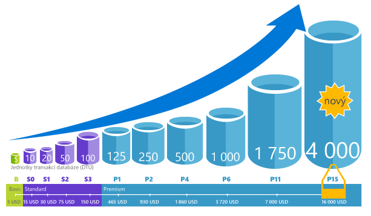
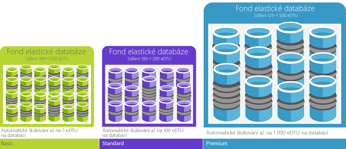

# Vysvětlení jednotek databázové transakce (DTU) a elastických jednotek databázové transakce (eDTU)Explaining Database Transaction Units (DTUs) and elastic Database Transaction Units (eDTUs)
Tento článek vysvětluje, že jednotky transakcí databáze (Dtu) a jednotky transakcí elastické databáze (Edtu) a co se stane, když je dosaženo hello maximální počet jednotek Dtu nebo Edtu.This article explains Database Transaction Units (DTUs) and elastic Database Transaction Units (eDTUs) and what happens when you hit hello maximum DTUs or eDTUs.  

## Co jsou jednotky databázové transakce (DTU)What are Database Transaction Units (DTUs)
Pro jednu databázi Azure SQL na úrovni výkonu specifických v rámci [vrstvy služby](sql-database-service-tiers.md#single-database-service-tiers-and-performance-levels), Microsoft zaručuje úroveň prostředky pro tuto databázi (nezávisle na jakékoli jiné databáze v cloudu Azure hello) a poskytování předvídatelný úroveň výkonu.For a single Azure SQL database at a specific performance level within a [service tier](sql-database-service-tiers.md#single-database-service-tiers-and-performance-levels), Microsoft guarantees a certain level of resources for that database (independent of any other database in hello Azure cloud) and providing a predictable level of performance. Toto množství prostředků počítá se jako počet jednotky transakcí databáze nebo Dtu a je kombinaci měření procesoru, paměti a vstupu a výstupu (dat a transakční protokol vstupně-výstupních operací).This amount of resources is calculated as a number of Database Transaction Units or DTUs, and is a blended measure of CPU, memory, I/O (data and transaction log I/O). Hello poměr mezi tyto prostředky se původně určený [OLTP srovnávacího testu zatížení](sql-database-benchmark-overview.md) určené toobe typické reálného OLTP úloh.hello ratio amongst these resources was originally determined by an [OLTP benchmark workload](sql-database-benchmark-overview.md) designed toobe typical of real-world OLTP workloads. Pokud vaše úlohy překročí hello množství kterýkoli z těchto prostředků, vaše propustnost je omezenému – což pomalejší výkon a vypršení časových limitů.When your workload exceeds hello amount of any of these resources, your throughput is throttled - resulting in slower performance and timeouts. Hello prostředky využívané třídou vaše úlohy nemají vliv hello prostředky k dispozici tooother databází SQL v hello cloudu Azure a prostředků hello používá jiná zatížení nemají vliv hello prostředky k dispozici tooyour SQL database.hello resources used by your workload do not impact hello resources available tooother SQL databases in hello Azure cloud, and hello resource used by other workloads do not impact hello resources available tooyour SQL database.

Počet jednotek Dtu jsou zvláště užitečné pro pochopení hello relativní objem prostředků mezi databází SQL Azure na úrovních různých výkonu a úrovně služeb.DTUs are most useful for understanding hello relative amount of resources between Azure SQL Databases at different performance levels and service tiers. Například zvýší hello Dtu zvýšením hello úroveň výkonu databáze znamená zároveň toodoubling hello sadu databáze k dispozici toothat prostředků.For example, doubling hello DTUs by increasing hello performance level of a database equates toodoubling hello set of resource available toothat database. Například databáze Premium P11 se 1 750 DTU nabízí 350x více DTU výpočetního výkonu než databáze Basic s 5 DTU.For example, a Premium P11 database with 1750 DTUs provides 350x more DTU compute power than a Basic database with 5 DTUs.  

toogain podrobnější přehled o spotřeby prostředků (DTU) hello vašich úloh, použijte [Azure SQL Database Query Performance Insight](sql-database-query-performance.md) na:toogain deeper insight into hello resource (DTU) consumption of your workload, use [Azure SQL Database Query Performance Insight](sql-database-query-performance.md) to:

- Identifikujte hello nejčastějších dotazů podle využití procesoru a doba trvání nebo provádění počtu, který lze ladit potenciálně pro zlepšení výkonu.Identify hello top queries by CPU/Duration/Execution count that can potentially be tuned for improved performance. Například dotaz intenzivním vstupně-výstupních operací může mít užitek z používání hello [techniky optimalizace v paměti](sql-database-in-memory.md) toomake lepší využití hello dostupné paměti na určité služby a výkonu úrovni.For example, an I/O intensive query might benefit from hello use of [in-memory optimization techniques](sql-database-in-memory.md) toomake better use of hello available memory at a certain service tier and performance level.
- Rozbalit hello podrobnosti o dotazu, zobrazit historii využití prostředků a text.Drill down into hello details of a query, view its text and history of resource utilization.
- Výkon přístupu k ladění doporučení, které se zobrazí akce prováděné [Poradce pro funkci SQL Database](sql-database-advisor.md).Access performance tuning recommendations that show actions performed by [SQL Database Advisor](sql-database-advisor.md).

Můžete [Změna úrovně služeb](sql-database-service-tiers.md) kdykoli s minimálními výpadky tooyour aplikaci (obvykle průměrování než čtyři sekund).You can [change service tiers](sql-database-service-tiers.md) at any time with minimal downtime tooyour application (generally averaging under four seconds). Mnoha firmám a aplikace je možné toocreate databází a vytočit výkonu nahoru nebo dolů na vyžádání, stačí, zejména v případě, že jsou vzorce používání relativně předvídatelné.For many businesses and apps, being able toocreate databases and dial performance up or down on demand is enough, especially if usage patterns are relatively predictable. Ale pokud máte vzorce nepředvídatelné použití, může být pevný toomanage náklady a obchodní model.But if you have unpredictable usage patterns, it can make it hard toomanage costs and your business model. V tomto scénáři použijete fondu elastické databáze s počtem jednotek Edtu, která jsou sdílena mezi několika databáze ve fondu hello.For this scenario, you use an elastic pool with a certain number of eDTUs that are shared among multiple database in hello pool.

## Co jsou elastické jednotky databázové transakce (eDTU)What are elastic Database Transaction Units (eDTUs)
Spíše než poskytují vyhrazené sadu prostředků (Dtu) tooa SQL Database, která je neustále dostupná bez ohledu na to, jestli není potřeba, můžete umístit do databáze [elastický fond](sql-database-elastic-pool.md) na databázi SQL serveru, který sdílí fondu zdrojů mezi tyto databáze.Rather than provide a dedicated set of resources (DTUs) tooa SQL Database that is always available regardless of whether needed not, you can place databases into an [elastic pool](sql-database-elastic-pool.md) on a SQL Database server that shares a pool of resources among those database. Hello sdílené prostředky v elastickém fondu měří elastické jednotky transakcí databáze nebo Edtu.hello shared resources in an elastic pool measured by elastic Database Transaction Units or eDTUs. Elastické fondy poskytují jednoduché nákladově efektivní řešení toomanage hello výkonnostní cíle pro více databází, které mají široce různých a nepředvídatelným vzorce.Elastic pools provide a simple cost effective solution toomanage hello performance goals for multiple databases that have widely varying and unpredictable usage patterns. V elastickém fondu, může zaručit, že žádná databáze. jeden používá všechny prostředky hello v hello fondu a také že minimální objem prostředků je vždy k dispozici tooa databáze v elastickém fondu.In an elastic pool, you can guarantee that no one database uses all of hello resources in hello pool and also that a minimum amount of resources is always available tooa database in an elastic pool. V tématu [elastické fondy](sql-database-elastic-pool.md) Další informace.See  [elastic pools](sql-database-elastic-pool.md) for more information.

Fond obdrží stanovený počet eDTU za stanovenou cenu.A pool is given a set number of eDTUs, for a set price. V rámci hello elastického fondu jsou uvedeny jednotlivé databáze hello flexibilitu tooauto rozsahu v rámci hranice hello nakonfigurované.Within hello elastic pool, individual databases are given hello flexibility tooauto-scale within hello configured boundaries. V případě velkého zatížení databáze spotřebovat další vyžádání toomeet Edtu zatímco databáze pod světla zatížením nižší, až bod toohello, že databáze žádné zatížení využívat žádné Edtu.Under heavy load, a database can consume more eDTUs toomeet demand while databases under light loads consume less, up toohello point that databases under no load consume no eDTUs. Zřizování prostředků pro celý fond hello, místo na databázi, úlohy správy jsou zjednodušené a mají předvídatelný rozpočtu hello fondu.By provisioning resources for hello entire pool, rather than per database, management tasks are simplified and you have a predictable budget for hello pool.

Další jednotek Edtu, které lze přidat existující fond tooan bez výpadků databáze a bez jakéhokoli dopadu na hello databáze ve fondu hello.Additional eDTUs can be added tooan existing pool with no database downtime and with no impact on hello databases in hello pool. Podobně platí, že pokud již přidané eDTU nejsou potřebné, lze je z existujícího fondu kdykoli odebrat.Similarly, if extra eDTUs are no longer needed, they can be removed from an existing pool at any point in time. Můžete přidat nebo odečíst fondu toohello databáze nebo limit hello množství Edtu databázi můžete použít v případě velkého zatížení tooreserve Edtu pro jiné databáze.You can add or subtract databases toohello pool, or limit hello amount of eDTUs a database can use under heavy load tooreserve eDTUs for other databases. Pokud databázi je předvídatelné pod využití prostředků, můžete přesunout mimo hello fondu a nakonfigurovat ho jako jednu databázi s velikostí prostředků vyžaduje předvídatelný.If a database is predictably under-utilizing resources, you can move it out of hello pool and configure it as a single database with predictable amount of resources it requires.

## Jak zjistím hello počet jednotek Dtu Moje zatížení vyžaduje?How can I determine hello number of DTUs needed by my workload?
Pokud hledáte toomigrate existující místní nebo tooAzure zatížení virtuálního počítače systému SQL Server SQL Database, můžete použít hello [Kalkulačka DTU](http://dtucalculator.azurewebsites.net/) tooapproximate hello počet jednotek Dtu potřeby.If you are looking toomigrate an existing on-premises or SQL Server virtual machine workload tooAzure SQL Database, you can use hello [DTU Calculator](http://dtucalculator.azurewebsites.net/) tooapproximate hello number of DTUs needed. Pro existující úlohy Azure SQL Database, můžete použít [SQL databáze Query Performance Insight](sql-database-query-performance.md) toounderstand vaší databáze prostředků spotřeby (Dtu) tooget podrobnější přehled o tom, jak toooptimize úlohy.For an existing Azure SQL Database workload, you can use [SQL Database Query Performance Insight](sql-database-query-performance.md) toounderstand your database resource consumption (DTUs) tooget deeper insight into how toooptimize your workload. Můžete taky hello [sys.dm_db_ resource_stats](https://msdn.microsoft.com/library/dn800981.aspx) DMV tooget hello prostředků informací o spotřebě pro hello poslední jednu hodinu.You can also use hello [sys.dm_db_ resource_stats](https://msdn.microsoft.com/library/dn800981.aspx) DMV tooget hello resource consumption information for hello last one hour. Alternativně hello zobrazení katalogu [sys.resource_stats](http://msdn.microsoft.com/library/dn269979.aspx) můžete také být předmětem dotazu tooget hello stejná data pro hello posledních 14 dní, i když na nižší přesnost průměry pět minut.Alternatively, hello catalog view [sys.resource_stats](http://msdn.microsoft.com/library/dn269979.aspx) can also be queried tooget hello same data for hello last 14 days, although at a lower fidelity of five-minute averages.

## Jak poznám, že by pro mě používání elastického fondu prostředků bylo výhodné?How do I know if I could benefit from an elastic pool of resources?
Fondy jsou vhodné pro velký počet databází s konkrétními vzory využití.Pools are suited for a large number of databases with specific utilization patterns. Pro danou databázi je tento vzor charakterizován nízkou mírou průměrného využití s relativně málo častými nárůsty využití.For a given database, this pattern is characterized by low average utilization with relatively infrequent utilization spikes. SQL Database automaticky vyhodnotí využití historických prostředků hello databází v existující databázi SQL server a doporučuje hello odpovídajícímu fondu adres konfigurace v hello portálu Azure.SQL Database automatically evaluates hello historical resource usage of databases in an existing SQL Database server and recommends hello appropriate pool configuration in hello Azure portal. Další informace najdete v tématu [Kdy je vhodné používat elastický fond?](sql-database-elastic-pool.md)For more information, see [when should an elastic pool be used?](sql-database-elastic-pool.md)

## Co se stane, když dosáhnu maximálního počtu DTUWhat happens when I hit my maximum DTUs
Jsou nastaveny úrovně výkonu a upraveny tooprovide hello potřebné prostředky toorun úloh toohello maximální omezení povolené úrovně vrstvy a výkonu vaší vybraných služeb vaší databáze.Performance levels are calibrated and governed tooprovide hello needed resources toorun your database workload up toohello max limits allowed for your selected service tier/performance level. Pokud vaše úlohy je nedosáhli limitů hello v jednom z limity vstupně-výstupní operace procesoru/Data vstupně-výstupní operace nebo protokolu, pokračovat tooreceive hello prostředky maximální povolené úrovni hello, ale jsou pravděpodobně toosee vyšší latence pro své dotazy.If your workload is hitting hello limits in one of CPU/Data IO/Log IO limits, you continue tooreceive hello resources at hello maximum allowed level, but you are likely toosee increased latencies for your queries. Pokud hello zpomalení stane závažné, že dotazy spustí časování nezpůsobovalo neustálé všechny chyby, ale spíš zpomalení hello zatížení, tato omezení. Pokud dosahujete limitů pro maximální povolený počet souběžných relací/požadavků uživatelů (pracovních vláken), zobrazují se explicitní chyby.These limits do not result in any errors, but rather a slowdown in hello workload, unless hello slowdown becomes so severe that queries start timing out. If you are hitting limits of maximum allowed concurrent user sessions/requests (worker threads), you see explicit errors. Informace o limitech jiných prostředků než procesory, paměť, datový vstup/výstup či vstup výstup protokolu transakcí najdete v článku [Limity prostředků Azure SQL Database](sql-database-resource-limits.md).See [Azure SQL Database resource limits](sql-database-resource-limits.md) for information on limit on resources other than CPU, memory, data I/O, and transaction log I/O.

## Další krokyNext steps
* V tématu [vrstvy služby](sql-database-service-tiers.md) informace o hello Dtu a Edtu, které jsou k dispozici pro izolované databáze a pro elastické fondy.See [Service tier](sql-database-service-tiers.md) for information on hello DTUs and eDTUs available for single databases and for elastic pools.
* Informace o limitech jiných prostředků než procesory, paměť, datový vstup/výstup či vstup výstup protokolu transakcí najdete v článku [Limity prostředků Azure SQL Database](sql-database-resource-limits.md).See [Azure SQL Database resource limits](sql-database-resource-limits.md) for information on limit on resources other than CPU, memory, data I/O, and transaction log I/O.
* V tématu [SQL databáze Query Performance Insight](sql-database-query-performance.md) toounderstand vaší spotřeby (Dtu).See [SQL Database Query Performance Insight](sql-database-query-performance.md) toounderstand your (DTUs) consumption.
* V tématu [přehledu srovnávacího testu SQL Database](sql-database-benchmark-overview.md) toounderstand hello metodika za hello OLTP srovnávacího testu zatížení použít toodetermine hello přizpůsobte DTU.See [SQL Database benchmark overview](sql-database-benchmark-overview.md) toounderstand hello methodology behind hello OLTP benchmark workload used toodetermine hello DTU blend.
