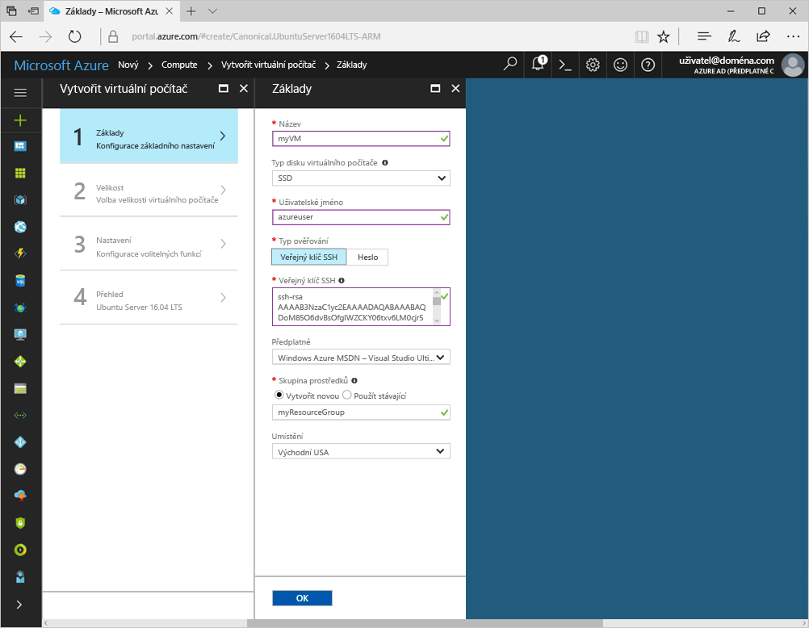
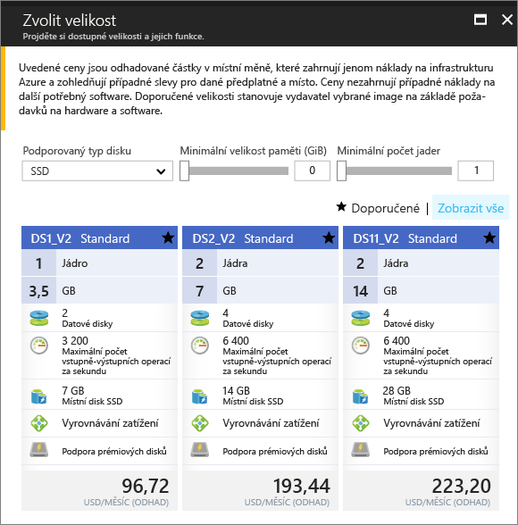
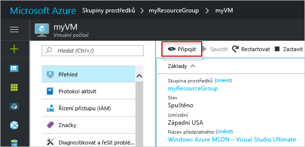

# <a name="create-a-linux-virtual-machine-with-hello-azure-portal"></a><span data-ttu-id="6ac4e-103">Vytvořte virtuální počítač s Linuxem s hello portálu Azure</span><span class="sxs-lookup"><span data-stu-id="6ac4e-103">Create a Linux virtual machine with hello Azure portal</span></span>

<span data-ttu-id="6ac4e-104">Virtuální počítače Azure můžete vytvořit prostřednictvím hello portálu Azure.</span><span class="sxs-lookup"><span data-stu-id="6ac4e-104">Azure virtual machines can be created through hello Azure portal.</span></span> <span data-ttu-id="6ac4e-105">Tato metoda poskytuje uživatelské rozhraní v prohlížeči, pomocí kterého můžete vytvářet a konfigurovat virtuální počítače a všechny související prostředky.</span><span class="sxs-lookup"><span data-stu-id="6ac4e-105">This method provides a browser-based user interface for creating and configuring virtual machines and all related resources.</span></span> <span data-ttu-id="6ac4e-106">Tento postup rychlého spuštění prostřednictvím vytvoření virtuálního počítače a instalaci webovém serveru na hello virtuálních počítačů.</span><span class="sxs-lookup"><span data-stu-id="6ac4e-106">This Quickstart steps through creating a virtual machine and installing a webserver on hello VM.</span></span>

<span data-ttu-id="6ac4e-107">Pokud ještě nemáte předplatné Azure, vytvořte si [bezplatný účet](https://azure.microsoft.com/free/?WT.mc_id=A261C142F) před tím, než začnete.</span><span class="sxs-lookup"><span data-stu-id="6ac4e-107">If you don't have an Azure subscription, create a [free account](https://azure.microsoft.com/free/?WT.mc_id=A261C142F) before you begin.</span></span>

## <a name="create-ssh-key-pair"></a><span data-ttu-id="6ac4e-108">Vytvoření páru klíčů SSH</span><span class="sxs-lookup"><span data-stu-id="6ac4e-108">Create SSH key pair</span></span>

<span data-ttu-id="6ac4e-109">Budete potřebovat toocomplete pár klíčů SSH tento rychlý start.</span><span class="sxs-lookup"><span data-stu-id="6ac4e-109">You need an SSH key pair toocomplete this quick start.</span></span> <span data-ttu-id="6ac4e-110">Pokud máte existující pár klíčů SSH, můžete tento krok přeskočit.</span><span class="sxs-lookup"><span data-stu-id="6ac4e-110">If you have an existing SSH key pair, this step can be skipped.</span></span>

<span data-ttu-id="6ac4e-111">Z prostředí Bash spusťte tento příkaz a postupujte podle hello na obrazovce pokynů.</span><span class="sxs-lookup"><span data-stu-id="6ac4e-111">From a Bash shell, run this command and follow hello on-screen directions.</span></span> <span data-ttu-id="6ac4e-112">výstup příkazu Hello obsahuje název souboru hello hello soubor veřejného klíče.</span><span class="sxs-lookup"><span data-stu-id="6ac4e-112">hello command output includes hello file name of hello public key file.</span></span> <span data-ttu-id="6ac4e-113">Kopírovat hello obsah schránky toohello hello soubor veřejného klíče.</span><span class="sxs-lookup"><span data-stu-id="6ac4e-113">Copy hello contents of hello public key file toohello clipboard.</span></span>

```bash
ssh-keygen -t rsa -b 2048
```

## <a name="log-in-tooazure"></a><span data-ttu-id="6ac4e-114">Přihlaste se tooAzure</span><span class="sxs-lookup"><span data-stu-id="6ac4e-114">Log in tooAzure</span></span> 

<span data-ttu-id="6ac4e-115">Přihlaste se toohello portál Azure na http://portal.azure.com.</span><span class="sxs-lookup"><span data-stu-id="6ac4e-115">Log in toohello Azure portal at http://portal.azure.com.</span></span>

## <a name="create-virtual-machine"></a><span data-ttu-id="6ac4e-116">Vytvoření virtuálního počítače</span><span class="sxs-lookup"><span data-stu-id="6ac4e-116">Create virtual machine</span></span>

1. <span data-ttu-id="6ac4e-117">Klikněte na tlačítko hello **nový** nalezeno tlačítko na hello levém horním rohu hello portálu Azure.</span><span class="sxs-lookup"><span data-stu-id="6ac4e-117">Click hello **New** button found on hello upper left-hand corner of hello Azure portal.</span></span>

2. <span data-ttu-id="6ac4e-118">Vyberte **Compute** a potom vyberte **Ubuntu Server 16.04 LTS**.</span><span class="sxs-lookup"><span data-stu-id="6ac4e-118">Select **Compute**, and then select **Ubuntu Server 16.04 LTS**.</span></span> 

3. <span data-ttu-id="6ac4e-119">Zadejte informace o virtuálním počítači hello.</span><span class="sxs-lookup"><span data-stu-id="6ac4e-119">Enter hello virtual machine information.</span></span> <span data-ttu-id="6ac4e-120">Jako **Typ ověřování** vyberte **Veřejný klíč SSH**.</span><span class="sxs-lookup"><span data-stu-id="6ac4e-120">For **Authentication type**, select **SSH public key**.</span></span> <span data-ttu-id="6ac4e-121">Při vkládání v veřejný klíč SSH, postará tooremove žádné začínat ani končit mezerou prázdné.</span><span class="sxs-lookup"><span data-stu-id="6ac4e-121">When pasting in your SSH public key, take care tooremove any leading or trailing white space.</span></span> <span data-ttu-id="6ac4e-122">Jakmile budete hotovi, klikněte na **OK**.</span><span class="sxs-lookup"><span data-stu-id="6ac4e-122">When complete, click **OK**.</span></span>

    

4. <span data-ttu-id="6ac4e-124">Vyberte velikost hello virtuálních počítačů.</span><span class="sxs-lookup"><span data-stu-id="6ac4e-124">Select a size for hello VM.</span></span> <span data-ttu-id="6ac4e-125">Vyberte další velikosti toosee **zobrazit všechny** nebo změňte hello **podporován typ disku** filtru.</span><span class="sxs-lookup"><span data-stu-id="6ac4e-125">toosee more sizes, select **View all** or change hello **Supported disk type** filter.</span></span> 

      

5. <span data-ttu-id="6ac4e-127">V okně Nastavení hello, zachovat hello výchozí hodnoty a klikněte na tlačítko **OK**.</span><span class="sxs-lookup"><span data-stu-id="6ac4e-127">On hello settings blade, keep hello defaults and click **OK**.</span></span>

6. <span data-ttu-id="6ac4e-128">Na stránce Souhrn hello, klikněte na **Ok** nasazení virtuálního počítače toostart hello.</span><span class="sxs-lookup"><span data-stu-id="6ac4e-128">On hello summary page, click **Ok** toostart hello virtual machine deployment.</span></span>

7. <span data-ttu-id="6ac4e-129">Hello virtuálních počítačů bude definovaného toohello řídicí panel portálu Azure.</span><span class="sxs-lookup"><span data-stu-id="6ac4e-129">hello VM will be pinned toohello Azure portal dashboard.</span></span> <span data-ttu-id="6ac4e-130">Po dokončení nasazení hello souhrnu okna hello virtuální počítač se automaticky otevře.</span><span class="sxs-lookup"><span data-stu-id="6ac4e-130">Once hello deployment has completed, hello VM summary blade automatically opens.</span></span>


## <a name="connect-toovirtual-machine"></a><span data-ttu-id="6ac4e-131">Připojte počítač toovirtual</span><span class="sxs-lookup"><span data-stu-id="6ac4e-131">Connect toovirtual machine</span></span>

<span data-ttu-id="6ac4e-132">Vytvoření připojení SSH s hello virtuálního počítače.</span><span class="sxs-lookup"><span data-stu-id="6ac4e-132">Create an SSH connection with hello virtual machine.</span></span>

1. <span data-ttu-id="6ac4e-133">Klikněte na tlačítko hello **Connect** tlačítka v okně hello virtuálního počítače.</span><span class="sxs-lookup"><span data-stu-id="6ac4e-133">Click hello **Connect** button on hello virtual machine blade.</span></span> <span data-ttu-id="6ac4e-134">Hello se zobrazí tlačítko Připojit SSH připojovací řetězec, který lze použít tooconnect toohello virtuálnímu počítači.</span><span class="sxs-lookup"><span data-stu-id="6ac4e-134">hello connect button displays an SSH connection string that can be used tooconnect toohello virtual machine.</span></span>

     

2. <span data-ttu-id="6ac4e-136">Hello spusťte následující příkaz toocreate na relace SSH.</span><span class="sxs-lookup"><span data-stu-id="6ac4e-136">Run hello following command toocreate an SSH session.</span></span> <span data-ttu-id="6ac4e-137">Nahraďte text hello, který ten, který jste zkopírovali z hello portál Azure hello připojovací řetězec.</span><span class="sxs-lookup"><span data-stu-id="6ac4e-137">Replace hello connection string with hello one you copied from hello Azure portal.</span></span>

```bash 
ssh azureuser@40.112.21.50
```

## <a name="install-nginx"></a><span data-ttu-id="6ac4e-138">Instalace serveru NGINX</span><span class="sxs-lookup"><span data-stu-id="6ac4e-138">Install NGINX</span></span>

<span data-ttu-id="6ac4e-139">Použití hello následující zdroje balíčků tooupdate skriptů bash a instalovat nejnovější balíček NGINX hello.</span><span class="sxs-lookup"><span data-stu-id="6ac4e-139">Use hello following bash script tooupdate package sources and install hello latest NGINX package.</span></span> 

```bash 
#!/bin/bash

# update package source
sudo apt-get -y update

# install NGINX
sudo apt-get -y install nginx
```

<span data-ttu-id="6ac4e-140">Až budete hotoví, ukončete hello relace SSH a vrátí hello vlastnosti virtuálního počítače v hello portálu Azure.</span><span class="sxs-lookup"><span data-stu-id="6ac4e-140">When done, exit hello SSH session and return hello VM properties in hello Azure portal.</span></span>


## <a name="open-port-80-for-web-traffic"></a><span data-ttu-id="6ac4e-141">Otevření portu 80 pro webový provoz</span><span class="sxs-lookup"><span data-stu-id="6ac4e-141">Open port 80 for web traffic</span></span> 

<span data-ttu-id="6ac4e-142">Skupina zabezpečení sítě (NSG) zabezpečuje příchozí a odchozí provoz.</span><span class="sxs-lookup"><span data-stu-id="6ac4e-142">A Network security group (NSG) secures inbound and outbound traffic.</span></span> <span data-ttu-id="6ac4e-143">Když virtuální počítač je vytvořen z hello portálu Azure, se na port 22 pro SSH připojení vytvoří pravidlo pro příchozí.</span><span class="sxs-lookup"><span data-stu-id="6ac4e-143">When a VM is created from hello Azure portal, an inbound rule is created on port 22 for SSH connections.</span></span> <span data-ttu-id="6ac4e-144">Protože tento virtuální počítač hostuje webovém serveru, musí pravidlo NSG toobe vytvořenou pro port 80.</span><span class="sxs-lookup"><span data-stu-id="6ac4e-144">Because this VM hosts a webserver, an NSG rule needs toobe created for port 80.</span></span>

1. <span data-ttu-id="6ac4e-145">Na virtuálním počítači hello, klikněte na název hello hello **skupiny prostředků**.</span><span class="sxs-lookup"><span data-stu-id="6ac4e-145">On hello virtual machine, click hello name of hello **Resource group**.</span></span>
2. <span data-ttu-id="6ac4e-146">Vyberte hello **skupinu zabezpečení sítě**.</span><span class="sxs-lookup"><span data-stu-id="6ac4e-146">Select hello **network security group**.</span></span> <span data-ttu-id="6ac4e-147">Hello NSG lze identifikovat pomocí hello **typ** sloupce.</span><span class="sxs-lookup"><span data-stu-id="6ac4e-147">hello NSG can be identified using hello **Type** column.</span></span> 
3. <span data-ttu-id="6ac4e-148">V levé nabídce hello v části nastavení, klikněte na tlačítko **příchozí pravidla zabezpečení**.</span><span class="sxs-lookup"><span data-stu-id="6ac4e-148">On hello left-hand menu, under settings, click **Inbound security rules**.</span></span>
4. <span data-ttu-id="6ac4e-149">Klikněte na **Přidat**.</span><span class="sxs-lookup"><span data-stu-id="6ac4e-149">Click on **Add**.</span></span>
5. <span data-ttu-id="6ac4e-150">Do pole **Název** zadejte **http**.</span><span class="sxs-lookup"><span data-stu-id="6ac4e-150">In **Name**, type **http**.</span></span> <span data-ttu-id="6ac4e-151">Zajistěte, aby **rozsah portů** nastavena too80 a **akce** je nastaven příliš**povolit**.</span><span class="sxs-lookup"><span data-stu-id="6ac4e-151">Make sure **Port range** is set too80 and **Action** is set too**Allow**.</span></span> 
6. <span data-ttu-id="6ac4e-152">Klikněte na **OK**.</span><span class="sxs-lookup"><span data-stu-id="6ac4e-152">Click **OK**.</span></span>


## <a name="view-hello-nginx-welcome-page"></a><span data-ttu-id="6ac4e-153">Zobrazení hello NGINX úvodní stránka</span><span class="sxs-lookup"><span data-stu-id="6ac4e-153">View hello NGINX welcome page</span></span>

<span data-ttu-id="6ac4e-154">S NGINX nainstalovaná a port 80 otevřete tooyour virtuálních počítačů, webový server hello je nyní přístupná z hello Internetu.</span><span class="sxs-lookup"><span data-stu-id="6ac4e-154">With NGINX installed, and port 80 open tooyour VM, hello webserver can now be accessed from hello internet.</span></span> <span data-ttu-id="6ac4e-155">Otevřete webový prohlížeč a zadejte hello veřejnou IP adresu hello virtuálních počítačů.</span><span class="sxs-lookup"><span data-stu-id="6ac4e-155">Open a web browser, and enter hello public IP address of hello VM.</span></span> <span data-ttu-id="6ac4e-156">Hello veřejnou IP adresu naleznete v okně hello virtuálních počítačů v hello portálu Azure.</span><span class="sxs-lookup"><span data-stu-id="6ac4e-156">hello public IP address can be found on hello VM blade in hello Azure portal.</span></span>

 

## <a name="clean-up-resources"></a><span data-ttu-id="6ac4e-158">Vyčištění prostředků</span><span class="sxs-lookup"><span data-stu-id="6ac4e-158">Clean up resources</span></span>

<span data-ttu-id="6ac4e-159">Pokud již nepotřebujete, odstraňte skupinu prostředků hello, virtuální počítač a všechny související prostředky.</span><span class="sxs-lookup"><span data-stu-id="6ac4e-159">When no longer needed, delete hello resource group, virtual machine, and all related resources.</span></span> <span data-ttu-id="6ac4e-160">toodo Ano, vyberte skupinu prostředků hello v okně hello virtuální počítač a klikněte na tlačítko **odstranit**.</span><span class="sxs-lookup"><span data-stu-id="6ac4e-160">toodo so, select hello resource group from hello virtual machine blade and click **Delete**.</span></span>

## <a name="next-steps"></a><span data-ttu-id="6ac4e-161">Další kroky</span><span class="sxs-lookup"><span data-stu-id="6ac4e-161">Next steps</span></span>

<span data-ttu-id="6ac4e-162">V tomto Rychlém startu jste nasadili jednoduchý virtuální počítač a pravidlo skupiny zabezpečení sítě a nainstalovali jste webový server.</span><span class="sxs-lookup"><span data-stu-id="6ac4e-162">In this quick start, you’ve deployed a simple virtual machine, a network security group rule, and installed a web server.</span></span> <span data-ttu-id="6ac4e-163">toolearn Další informace o virtuálních počítačích Azure, pokračovat v kurzu toohello pro virtuální počítače s Linuxem.</span><span class="sxs-lookup"><span data-stu-id="6ac4e-163">toolearn more about Azure virtual machines, continue toohello tutorial for Linux VMs.</span></span>

> [!div class="nextstepaction"]
> [<span data-ttu-id="6ac4e-164">Kurzy pro virtuální počítače Azure s Linuxem</span><span class="sxs-lookup"><span data-stu-id="6ac4e-164">Azure Linux virtual machine tutorials</span></span>](./tutorial-manage-vm.md)
